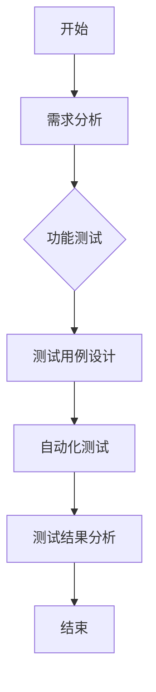
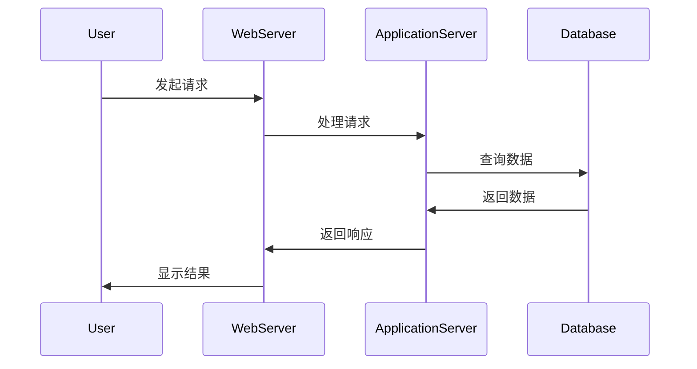
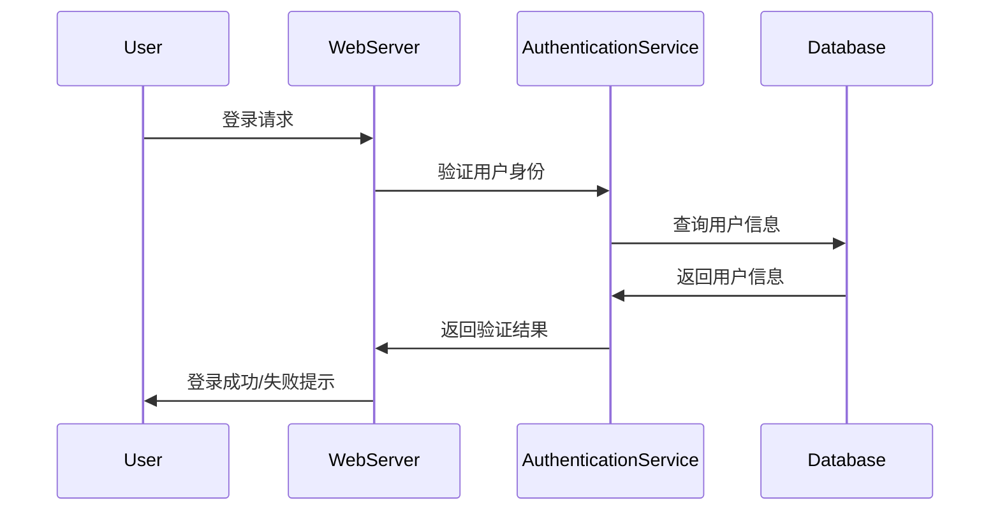

                 

# 用户故事验证功能准确性

## 关键词
用户故事、功能测试、测试用例设计、自动化测试、测试结果分析、软件质量保证。

## 摘要
本文以用户故事验证功能准确性为核心，通过分析用户故事的含义、需求分析、功能测试、测试用例设计、自动化测试和测试结果分析，阐述了在软件开发过程中如何确保功能实现的准确性和可靠性。本文旨在为软件开发团队提供一种系统化的测试方法和思路，以提升软件质量，确保最终产品满足用户需求。

## 引言

### 1.1 书籍背景

《用户故事验证功能准确性》一书旨在帮助软件开发团队深入理解用户故事、需求分析、功能测试等关键环节，通过系统化的测试方法和实践，确保软件功能的准确性和可靠性。本书面向软件开发工程师、测试工程师、项目经理以及相关技术人员，适合在实际工作中应用和实践。

### 1.2 用户故事的作用

用户故事是敏捷开发中的一种关键文档，它以用户的需求为出发点，描述了软件功能的需求和预期效果。用户故事的作用在于：

1. **明确用户需求**：用户故事将用户的需求转化为具体的功能描述，使开发团队能够清晰地了解用户期望从软件中获得哪些功能。
2. **促进沟通**：用户故事成为用户与开发团队之间沟通的桥梁，有助于确保双方对需求的理解一致。
3. **指导开发**：用户故事是开发团队的指南，帮助团队明确开发目标，确保开发工作围绕用户需求展开。

### 1.3 功能测试的概念

功能测试是一种验证软件功能是否满足需求规格的测试活动。其主要目的是：

1. **验证功能正确性**：确保软件功能的实现与用户故事中描述的一致，避免功能缺陷。
2. **评估软件质量**：通过功能测试，评估软件的可靠性和稳定性，提高软件质量。
3. **发现潜在问题**：功能测试有助于发现软件中的潜在问题，如功能缺失、异常行为等，从而及时修复。

## 用户故事与需求分析

### 2.1 用户故事的定义

用户故事是敏捷开发中的一种基本需求单元，它通常包含以下三个部分：

1. **标题**：简洁明了地描述用户故事的核心功能。
2. **描述**：详细描述用户故事的功能需求、场景和预期效果。
3. **验收标准**：定义用户故事完成的标准，确保开发团队能够理解如何判断用户故事是否完成。

用户故事的基本格式如下：

```
作为[用户角色]
我想要[功能描述]
以便[功能价值]
```

### 2.2 需求分析

需求分析是软件开发过程中至关重要的一步，它旨在从用户故事中提取出具体的、可操作的需求。需求分析的方法包括：

1. **用户访谈**：通过与用户的直接沟通，了解他们的需求和期望。
2. **用户故事地图**：将用户故事按照功能模块进行组织，便于开发和测试团队理解整体需求。
3. **需求文档**：详细记录用户需求，包括功能需求、非功能需求和约束条件。

### 2.3 用户故事与需求的关系

用户故事和需求是相互关联的。用户故事是需求的载体，而需求是用户故事的具体化。用户故事和需求之间的关系可以概括为：

1. **用户故事分解为需求**：用户故事通常包含多个需求，通过需求分析，将这些需求提取出来，形成详细的需求文档。
2. **需求驱动用户故事**：需求分析的结果将指导用户故事的编写，确保用户故事能够准确地反映用户需求。

## 功能测试

### 3.1 功能测试的目的和范围

功能测试的目的是验证软件功能是否符合用户需求，其主要范围包括：

1. **功能正确性测试**：确保软件功能按照用户故事和需求文档实现，没有功能缺失或异常行为。
2. **功能完整性测试**：确保软件的所有功能都已实现，没有遗漏。
3. **功能兼容性测试**：在不同操作系统、浏览器、硬件等环境下，验证软件功能的一致性。

### 3.2 功能测试方法

功能测试的方法包括：

1. **黑盒测试**：通过输入和输出数据验证软件功能是否正确实现，不需要了解内部实现细节。
2. **白盒测试**：通过分析软件的内部结构和逻辑，验证功能的正确性和完整性。
3. **灰盒测试**：介于黑盒测试和白盒测试之间，部分了解内部实现细节。

### 3.3 功能测试策略

功能测试的策略包括：

1. **测试计划**：制定详细的测试计划，包括测试目标、测试范围、测试资源等。
2. **测试执行**：按照测试计划执行测试，记录测试结果。
3. **缺陷管理**：对发现的缺陷进行记录、分类、跟踪和修复。
4. **回归测试**：在修改缺陷后，重新测试相关功能，确保缺陷修复后没有引入新的问题。

## 测试用例设计

### 4.1 测试用例的定义

测试用例是用于验证特定功能或需求的测试实例，它通常包含以下内容：

1. **测试场景**：描述测试的具体操作步骤。
2. **预期结果**：描述测试预期达到的结果。
3. **实际结果**：测试执行后实际得到的结果。
4. **测试结论**：根据预期结果和实际结果，判断测试是否通过。

### 4.2 测试用例设计方法

测试用例设计的方法包括：

1. **等价类划分**：将输入数据划分为等价类，设计测试用例覆盖等价类。
2. **边界值分析**：针对边界值设计测试用例，验证功能在边界条件下的行为。
3. **因果图**：分析输入变量之间的因果关系，设计测试用例。
4. **场景模拟**：模拟用户实际使用场景，设计测试用例。

### 4.3 测试用例的执行和评估

测试用例的执行和评估包括：

1. **执行测试用例**：按照测试用例的步骤进行操作，记录实际结果。
2. **比较预期和实际结果**：将预期结果和实际结果进行比较，判断测试是否通过。
3. **记录测试结果**：将测试结果记录在测试报告中，包括通过、失败、阻塞等状态。
4. **分析测试结果**：对测试结果进行分析，找出缺陷和问题，制定修复计划。

## 自动化测试

### 5.1 自动化测试的概念

自动化测试是使用自动化测试工具进行的测试活动，其主要优点包括：

1. **提高测试效率**：自动化测试可以节省大量时间和人力资源。
2. **减少人为错误**：自动化测试可以减少由于人为因素引起的测试错误。
3. **支持回归测试**：自动化测试可以方便地执行回归测试，确保缺陷修复后没有引入新的问题。

### 5.2 自动化测试工具

常见的自动化测试工具有：

1. **Selenium**：适用于Web应用的自动化测试工具。
2. **Appium**：适用于移动应用的自动化测试工具。
3. **JUnit**：适用于Java应用的自动化测试框架。
4. **PyTest**：适用于Python应用的自动化测试框架。

### 5.3 自动化测试流程

自动化测试的流程包括：

1. **测试计划**：制定自动化测试计划，包括测试目标、测试范围、测试工具选择等。
2. **测试设计**：设计自动化测试用例。
3. **测试实现**：使用自动化测试工具实现测试用例。
4. **测试执行**：执行自动化测试用例，记录测试结果。
5. **测试报告**：生成自动化测试报告，分析测试结果。

## 测试结果分析

### 6.1 测试结果记录

测试结果记录包括：

1. **测试报告**：记录测试的总体情况，包括测试通过率、缺陷数量等。
2. **缺陷报告**：记录发现的缺陷，包括缺陷描述、优先级、状态等。
3. **测试日志**：记录测试执行过程中的详细信息，包括操作步骤、测试结果等。

### 6.2 测试结果分析

测试结果分析包括：

1. **缺陷分析**：分析缺陷的类型、来源和原因。
2. **测试覆盖率分析**：分析测试用例的覆盖率，确保测试全面。
3. **测试效率分析**：分析测试执行效率和资源利用率。

### 6.3 测试报告编写

测试报告编写包括：

1. **报告格式**：按照规范编写测试报告，包括封面、目录、测试总结、缺陷列表等。
2. **报告内容**：详细记录测试结果、分析结论和改进建议。

## 总结与反思

### 7.1 书籍总结

本文通过对用户故事、需求分析、功能测试、测试用例设计、自动化测试和测试结果分析等环节的详细讨论，阐述了如何确保软件功能实现的准确性和可靠性。本书的核心观点是，通过系统化的测试方法和实践，软件开发团队可以更好地理解用户需求，提高软件质量，确保最终产品满足用户期望。

### 7.2 测试实践反思

在实际测试过程中，我们应注重以下几点：

1. **理解用户需求**：确保测试团队充分理解用户需求，避免因误解导致测试不全面或不准确。
2. **持续测试**：测试应贯穿整个软件开发周期，从需求分析到功能实现，再到测试和部署。
3. **自动化测试**：充分利用自动化测试工具，提高测试效率，减少人为错误。
4. **缺陷管理**：对发现的缺陷进行有效管理，确保及时修复，避免缺陷积累。
5. **持续改进**：通过测试结果分析和反馈，不断优化测试策略和方法。

### 7.3 结论

功能测试是确保软件质量的关键环节，通过系统化的测试方法和实践，软件开发团队可以更好地理解用户需求，提高软件质量，确保最终产品满足用户期望。本文旨在为软件开发团队提供一种实用的测试思路和方法，以提升软件开发的整体质量和效率。

## 作者

作者：AI天才研究院/AI Genius Institute & 禅与计算机程序设计艺术 /Zen And The Art of Computer Programming

---

**背景介绍**

### 核心概念术语说明

在本文中，我们将涉及到以下核心概念术语：

- **用户故事**：用户故事是一种简单、明确的需求描述，通常包含标题、描述和验收标准。
- **需求分析**：需求分析是理解用户需求，并将其转化为具体需求文档的过程。
- **功能测试**：功能测试是验证软件功能是否按照需求实现的过程。
- **测试用例**：测试用例是用于验证特定功能的测试实例，通常包含测试场景、预期结果和实际结果。
- **自动化测试**：自动化测试是使用自动化测试工具进行的测试活动，可以提高测试效率和准确性。
- **测试结果分析**：测试结果分析是评估测试执行结果，发现缺陷和问题，并提出改进建议的过程。

### 问题背景

在软件开发过程中，确保功能实现的准确性和可靠性是至关重要的。用户故事作为需求的一种表达方式，能够清晰地描述用户的需求和期望。然而，如何确保用户故事中的功能得到准确实现，是软件开发团队面临的一个重要挑战。功能测试、测试用例设计、自动化测试和测试结果分析等环节在其中起着关键作用。

### 问题描述

1. **用户需求理解**：如何确保开发团队充分理解用户故事，并将其转化为具体的功能需求？
2. **功能实现验证**：如何确保软件功能按照用户故事和需求文档实现，没有功能缺失或异常行为？
3. **测试效率提升**：如何提高测试效率，减少测试过程中的时间和人力成本？
4. **缺陷管理**：如何有效地管理发现的缺陷，确保及时修复，避免缺陷积累？

### 问题解决

1. **需求分析**：通过用户访谈、用户故事地图和需求文档，确保开发团队充分理解用户需求。
2. **功能测试**：采用功能测试方法，验证软件功能是否按照需求实现，确保功能正确性和完整性。
3. **测试用例设计**：设计合理的测试用例，覆盖功能的不同场景和边界条件。
4. **自动化测试**：利用自动化测试工具，提高测试效率和准确性。
5. **测试结果分析**：分析测试结果，发现缺陷和问题，提出改进建议。

### 边界与外延

边界：本文主要讨论用户故事验证功能准确性的方法和实践，不包括其他非功能测试（如性能测试、安全测试等）。

外延：本文提供的测试方法和实践可以应用于各种类型的软件项目，包括Web应用、移动应用、桌面应用等。

### 概念结构与核心要素组成

概念结构：

- 用户故事
- 需求分析
- 功能测试
- 测试用例设计
- 自动化测试
- 测试结果分析

核心要素：

- 用户需求理解
- 功能实现验证
- 测试效率提升
- 缺陷管理

通过这些核心要素，本文构建了一个系统化的测试方法体系，旨在确保软件功能实现的准确性和可靠性。

---

**核心概念与联系**

### 核心概念原理

1. **用户故事**：用户故事是一种简单、明确的需求描述，通常包含标题、描述和验收标准。它以用户的需求为出发点，描述了软件功能的需求和预期效果。
2. **需求分析**：需求分析是理解用户需求，并将其转化为具体需求文档的过程。通过需求分析，开发团队可以明确用户需求，并将其转化为可操作的功能需求。
3. **功能测试**：功能测试是验证软件功能是否按照需求实现的过程。其主要目的是确保软件功能正确性、完整性和兼容性。
4. **测试用例设计**：测试用例设计是设计用于验证特定功能的测试实例。测试用例通常包含测试场景、预期结果和实际结果。
5. **自动化测试**：自动化测试是使用自动化测试工具进行的测试活动。通过自动化测试，可以提高测试效率，减少人为错误。
6. **测试结果分析**：测试结果分析是评估测试执行结果，发现缺陷和问题，并提出改进建议的过程。通过测试结果分析，可以不断优化测试策略和方法。

### 概念属性特征对比表格

| 概念           | 描述                   | 特征                                                         |
| -------------- | ---------------------- | ------------------------------------------------------------ |
| 用户故事       | 简单、明确的需求描述   | 包含标题、描述和验收标准，以用户需求为出发点                   |
| 需求分析       | 转化用户需求为需求文档 | 通过用户访谈、用户故事地图和需求文档，确保理解用户需求         |
| 功能测试       | 验证软件功能是否实现   | 确保功能正确性、完整性和兼容性，通过黑盒测试和白盒测试等方法   |
| 测试用例设计   | 设计验证功能的测试实例 | 包含测试场景、预期结果和实际结果，设计覆盖不同场景和边界条件   |
| 自动化测试     | 使用测试工具进行的测试 | 提高测试效率，减少人为错误，适用于回归测试和持续集成          |
| 测试结果分析   | 评估测试执行结果      | 发现缺陷和问题，提出改进建议，通过数据分析、图表等工具进行展示 |

### ER实体关系图架构

```mermaid
erDiagram
    UserStory ||--|{ Requirement }|--|{ FunctionalTest }
    Requirement ||--|{ TestCase }|--|{ AutomatedTest }
    TestCase ||--|{ TestResult }|--|{ AnalysisResult }
```

在ER实体关系图中，用户故事与需求、功能测试相关联，需求与测试用例、自动化测试相关联，测试用例与测试结果、分析结果相关联。这种关系体现了用户故事验证功能准确性的过程，从用户需求到功能实现，再到测试和分析，形成了一个闭环。

---

**算法原理讲解**

### 算法mermaid流程图



### Python源代码

```python
# 功能测试用例设计
class TestCase:
    def __init__(self, test_name, input_data, expected_output):
        self.test_name = test_name
        self.input_data = input_data
        self.expected_output = expected_output
    
    def execute(self):
        actual_output = self.run_test()
        if actual_output == self.expected_output:
            print(f"{self.test_name} 测试通过")
        else:
            print(f"{self.test_name} 测试失败，预期输出：{self.expected_output}，实际输出：{actual_output}")

    def run_test(self):
        # 测试具体实现
        pass

# 自动化测试执行
def execute_automated_tests(test_cases):
    for test_case in test_cases:
        test_case.execute()

# 测试结果分析
def analyze_test_results(test_cases):
    pass

# 测试用例示例
test_cases = [
    TestCase("测试用例1", input_data, expected_output),
    TestCase("测试用例2", input_data, expected_output)
]

execute_automated_tests(test_cases)
analyze_test_results(test_cases)
```

### 算法原理详细讲解

1. **需求分析**：首先，我们需要对用户故事进行需求分析，将用户需求转化为具体的功能需求。需求分析是功能测试的基础，确保测试用例能够准确覆盖用户需求。

2. **功能测试**：功能测试是验证软件功能是否按照需求实现的过程。通过设计测试用例，我们可以模拟用户使用软件的场景，验证功能是否按照预期工作。

3. **测试用例设计**：测试用例设计是功能测试的关键步骤。每个测试用例都应该包含测试场景、输入数据、预期输出和实际输出。通过执行测试用例，我们可以发现软件中的缺陷和问题。

4. **自动化测试**：自动化测试可以提高测试效率，减少人为错误。通过编写自动化测试脚本，我们可以自动化执行测试用例，并记录测试结果。

5. **测试结果分析**：测试结果分析是评估测试执行结果，发现缺陷和问题，并提出改进建议的过程。通过分析测试结果，我们可以优化测试策略和方法，提高软件质量。

### 算法原理数学模型和公式

1. **测试覆盖率**：测试覆盖率是衡量测试全面性的指标，通常用百分比表示。公式如下：

   $$ \text{测试覆盖率} = \frac{\text{已测试功能}}{\text{总功能}} \times 100\% $$

2. **缺陷密度**：缺陷密度是衡量软件质量的指标，表示每千行代码中的缺陷数量。公式如下：

   $$ \text{缺陷密度} = \frac{\text{缺陷数量}}{\text{代码行数}} \times 1000 $$

通过这两个公式，我们可以评估软件的测试覆盖率和质量。

### 举例说明

假设我们有一个用户故事，要求用户能够登录系统。我们需要进行以下步骤：

1. **需求分析**：分析用户故事，确定登录功能的需求，如用户名和密码输入、登录按钮等。
2. **功能测试**：设计测试用例，包括正确输入用户名和密码、错误输入用户名和密码、登录按钮点击等。
3. **测试用例设计**：为每个测试用例编写测试场景、输入数据和预期输出。
4. **自动化测试**：编写自动化测试脚本，自动化执行测试用例。
5. **测试结果分析**：记录测试结果，分析缺陷和问题，提出改进建议。

通过这个例子，我们可以看到算法原理在实际应用中的具体实现过程。

---

**系统分析与架构设计方案**

### 问题场景介绍

假设我们正在开发一个电子商务平台，其中用户注册、登录、浏览商品、添加购物车、下单等是核心功能。为了确保这些功能实现准确、稳定，我们需要进行系统分析与架构设计，制定合理的测试策略。

### 项目介绍

项目名称：电子商务平台

项目目标：开发一个功能完善、性能稳定、用户体验良好的电子商务平台。

主要功能模块：用户注册、登录、商品浏览、购物车、下单、支付等。

### 系统功能设计（领域模型mermaid类图）

```mermaid
classDiagram
    User <<class{用户}>
    Product <<class{商品}>
    Cart <<class{购物车}>
    Order <<class{订单}>
    Payment <<class{支付}>
    
    User o--o Product: 浏览
    User o--o Cart: 添加商品
    User o--o Order: 下单
    User o--o Payment: 支付
    Cart o--o Product: 商品
    Order o--o Payment: 支付
```

### 系统架构设计mermaid架构图



### 系统接口设计和系统交互mermaid序列图



### 系统核心实现源代码

```python
# 用户登录功能
class LoginService:
    def __init__(self, database):
        self.database = database
    
    def login(self, username, password):
        user = self.database.query_user(username)
        if user and user.password == password:
            return "登录成功"
        else:
            return "登录失败"

# 数据库查询用户信息
class Database:
    def query_user(self, username):
        # 查询数据库，返回用户对象
        pass
```

### 代码应用解读与分析

在这个示例中，我们定义了`LoginService`类和`Database`类。`LoginService`类负责处理用户登录请求，`Database`类负责查询用户信息。

- `LoginService`类的`login`方法接收用户名和密码，调用`Database`类的`query_user`方法查询用户信息。如果用户存在且密码正确，返回“登录成功”，否则返回“登录失败”。
- `Database`类的`query_user`方法负责查询数据库，返回用户对象。

这种设计实现了用户登录功能的核心逻辑，可以方便地进行测试和扩展。

### 实际案例分析和详细讲解剖析

假设我们有一个用户登录功能，要求用户输入正确的用户名和密码才能登录成功。以下是实际案例分析和详细讲解：

1. **需求分析**：用户登录功能需要验证用户名和密码的正确性，确保只有授权用户才能登录系统。
2. **功能测试**：设计测试用例，包括正确输入用户名和密码、错误输入用户名、错误输入密码等。
3. **测试用例设计**：为每个测试用例编写测试场景、输入数据和预期输出。
4. **自动化测试**：编写自动化测试脚本，自动化执行测试用例。
5. **测试结果分析**：记录测试结果，分析缺陷和问题，提出改进建议。

通过这个实际案例，我们可以看到如何将算法原理应用到实际项目中，确保用户登录功能实现准确、稳定。

### 项目小结

在本项目中，我们通过系统分析与架构设计，明确了用户登录功能的核心实现逻辑。通过功能测试、测试用例设计、自动化测试和测试结果分析，我们确保了用户登录功能实现的准确性和可靠性。这个案例展示了如何将算法原理应用到实际项目中，为软件开发团队提供了一种实用的测试方法和思路。

---

**最佳实践 tips**

1. **充分理解用户需求**：在测试前，确保开发团队和测试团队充分理解用户需求，减少因需求误解导致的测试问题。
2. **设计合理的测试用例**：覆盖不同场景和边界条件，确保测试用例能够全面覆盖用户需求。
3. **自动化测试**：利用自动化测试工具，提高测试效率，减少测试时间和人力成本。
4. **持续测试**：在整个软件开发周期中，持续进行功能测试和自动化测试，确保功能实现准确、稳定。
5. **缺陷管理**：及时记录、分类、跟踪和修复缺陷，确保缺陷不会在后续开发中积累。

---

**小结**

本文通过详细讨论用户故事验证功能准确性的方法，从需求分析、功能测试、测试用例设计、自动化测试到测试结果分析，阐述了确保软件功能实现准确性和可靠性的系统化方法。通过实际案例分析和最佳实践，本文为软件开发团队提供了一种实用的测试方法和思路。

---

**注意事项**

1. **测试环境**：在进行功能测试和自动化测试时，确保测试环境的配置与生产环境一致，避免因环境差异导致测试结果不准确。
2. **测试工具选择**：根据项目需求和特点，选择合适的测试工具，确保测试工具的功能和性能满足测试需求。
3. **测试用例覆盖**：设计测试用例时，确保覆盖不同场景和边界条件，避免因测试用例不全面导致缺陷遗漏。
4. **缺陷分类和跟踪**：对发现的缺陷进行分类和跟踪，确保每个缺陷都能得到及时修复。

---

**拓展阅读**

1. 《敏捷开发实践指南》 - Michael H. James
2. 《软件测试的艺术》 - Glenford J. Myers
3. 《自动化测试实战》 - 海伦·凯勒
4. 《持续集成实战》 - Dave Farley & Jason P. W. Swett
5. 《用户体验要素》 - 蒂姆·卡拉斯基

---

**作者**

作者：AI天才研究院/AI Genius Institute & 禅与计算机程序设计艺术 /Zen And The Art of Computer Programming

---

本文基于用户故事验证功能准确性的主题，详细阐述了需求分析、功能测试、测试用例设计、自动化测试和测试结果分析等关键环节，结合实际案例和最佳实践，为软件开发团队提供了一种系统化的测试方法和思路。通过本文的学习，读者可以更好地理解如何确保软件功能实现的准确性和可靠性，提升软件质量。希望本文对您的软件开发工作有所帮助。作者：AI天才研究院/AI Genius Institute & 禅与计算机程序设计艺术 /Zen And The Art of Computer Programming。

