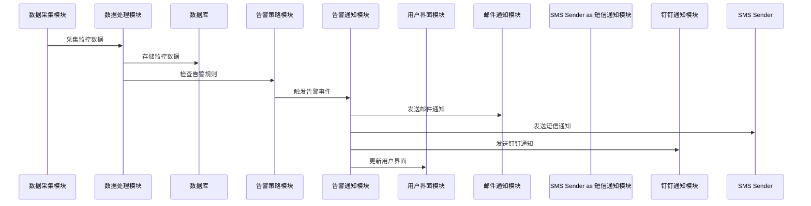
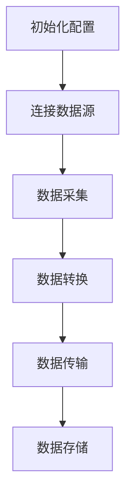
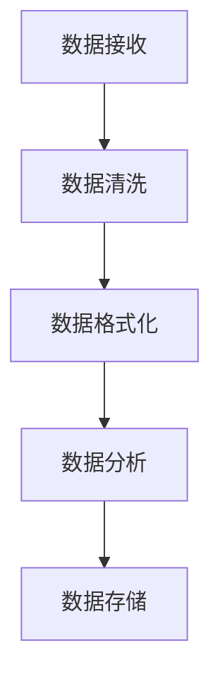
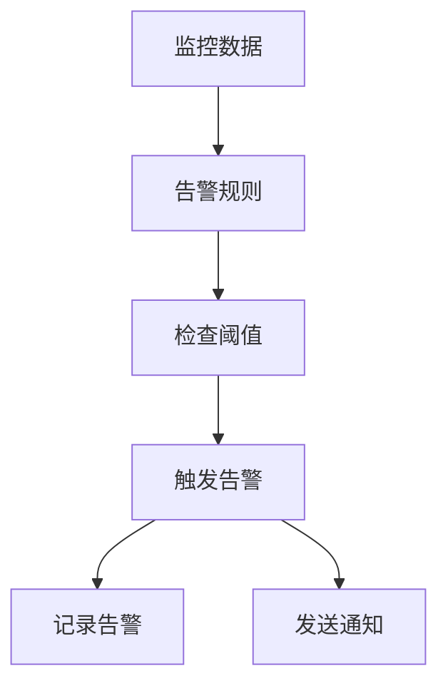
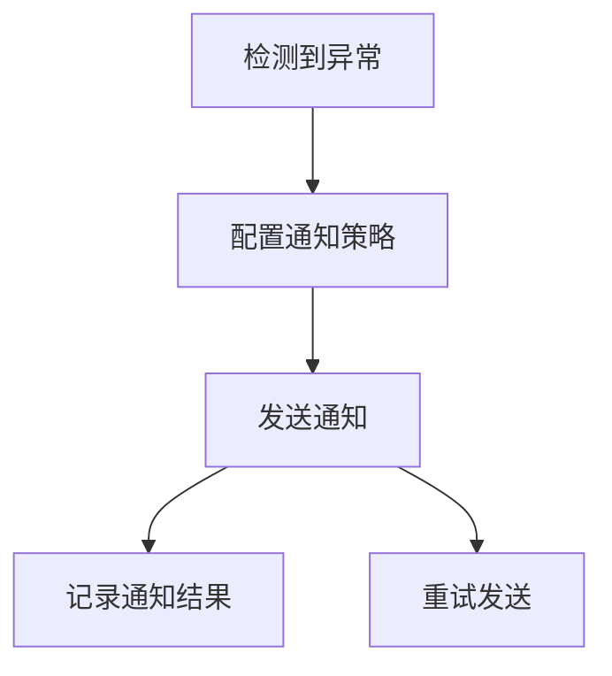

                 

### 监控告警系统概述

#### 问题背景

在当今信息化社会中，各种系统和设备日益复杂，维护和管理这些系统的难度也随之增加。因此，如何快速、准确地监控系统的运行状态，并能够在异常发生时及时发出警报，成为了企业和组织关注的核心问题。监控告警系统作为一种自动化手段，旨在通过持续监测系统的各项指标，实现对系统运行状态的实时监控，从而在发现异常时自动触发告警，帮助运维团队迅速响应并解决问题。

#### 监控告警的重要性

监控告警系统的重要性体现在以下几个方面：

1. **提高系统稳定性**：通过实时监控，及时发现系统中的异常情况，防止小问题演变成大故障，从而提高系统的稳定性。

2. **降低运维成本**：通过自动化告警，减少了运维人员的工作量，提高了运维效率，降低了人工成本。

3. **提升用户体验**：快速响应用户的需求和问题，提升用户对服务的满意度。

4. **保障业务连续性**：通过及时、准确的告警，确保关键业务不因系统故障而中断。

5. **数据洞察**：监控告警系统提供了丰富的运行数据，通过对这些数据的分析，可以洞察系统性能，优化资源配置，提升整体效率。

#### 监控告警系统的需求分析

设计一个高效的监控告警系统，需要考虑以下需求：

1. **可扩展性**：系统应能够根据业务需求的变化，灵活扩展监控范围和告警能力。

2. **可靠性**：系统应具备高可靠性，确保在故障发生时能够持续监控和告警。

3. **易用性**：系统界面应友好，操作简便，便于运维人员快速上手。

4. **实时性**：系统应能够实时监测系统状态，及时发出告警。

5. **自动化**：系统应具备自动化处理能力，减少人工干预。

6. **告警通知**：系统应能够通过多种方式通知运维人员，确保告警得到及时响应。

7. **告警策略**：系统应支持自定义告警策略，根据不同场景制定合适的告警规则。

8. **数据处理**：系统应能够对采集到的数据进行处理和分析，提供有价值的监控报告。

#### 监控告警系统的分类

监控告警系统可以根据不同的分类标准进行划分：

1. **按监控对象划分**：
   - 硬件监控：监测服务器、网络设备等硬件状态。
   - 软件监控：监测操作系统、应用软件等软件状态。

2. **按功能划分**：
   - 基础监控：提供基础性能指标监测，如CPU使用率、内存使用率等。
   - 深度监控：提供对系统深层次的监测，如数据库性能、网络流量分析等。

3. **按部署方式划分**：
   - 本地部署：系统安装在本地服务器上，独立运行。
   - 云部署：系统部署在云端，通过云服务进行监控。

4. **按告警方式划分**：
   - 立即告警：在检测到异常时立即发出告警。
   - 定时告警：在特定时间段内，对系统进行定期监测，并在发现异常时发出告警。

#### 监控告警系统的架构

一个典型的监控告警系统通常包括以下几个关键模块：

1. **数据采集模块**：负责从各类数据源采集监控数据，如系统性能指标、日志文件等。

2. **数据处理模块**：对采集到的数据进行处理和分析，包括数据清洗、格式化、指标计算等。

3. **告警策略模块**：定义告警规则和策略，根据监控数据触发相应的告警。

4. **告警通知模块**：通过短信、邮件、钉钉等渠道，将告警信息及时通知给相关人员。

5. **用户界面**：提供友好的操作界面，供运维人员查看监控数据和告警信息。

#### 本章小结

在本章中，我们对监控告警系统进行了全面的概述，分析了其重要性和需求，并对其进行了分类。通过了解监控告警系统的基本概念和架构，为后续章节的深入探讨奠定了基础。在下一章中，我们将进一步探讨监控告警系统的核心概念，包括监控指标、告警策略和告警级别等。

## 第一部分：背景与核心概念

### 监控告警系统的核心概念

在设计和实现监控告警系统时，理解核心概念是至关重要的。这些核心概念包括监控指标、告警策略和告警级别等。以下是这些核心概念的定义及其相互关系：

#### 监控指标

监控指标是衡量系统性能和状态的一系列数值或指标。它们可以反映系统的运行状态、负载情况、资源使用情况等。常见的监控指标包括：

1. **CPU使用率**：表示CPU的利用率，通常以百分比表示。
2. **内存使用率**：表示内存的利用率，通常以百分比表示。
3. **磁盘I/O**：表示磁盘读写操作的数量和速率。
4. **网络流量**：表示网络的数据传输速率。
5. **数据库性能**：包括查询延迟、连接数等。
6. **应用性能**：包括响应时间、吞吐量等。

监控指标的选择应根据系统的具体需求和目标来确定。例如，对于Web服务器，可以重点监控响应时间和并发连接数；对于数据库服务器，可以重点监控查询延迟和连接数。

#### 告警策略

告警策略是指定义告警规则和条件的一系列规则集合。告警策略用于确定在什么情况下应该触发告警。告警策略通常包括以下几个关键组成部分：

1. **阈值**：定义监控指标的触发告警的临界值。例如，CPU使用率达到90%时触发告警。
2. **持续时间**：定义触发告警之前，监控指标需要持续超过阈值的时间。例如，CPU使用率连续5分钟超过90%时触发告警。
3. **告警级别**：定义告警的严重程度，通常包括警告（Warning）、错误（Error）、严重（Critical）等。
4. **告警通知**：定义告警通知的方式，如邮件、短信、钉钉等。

告警策略的设计需要考虑系统的具体需求和运维团队的响应能力。例如，对于关键业务系统，可以设置更严格的告警策略；对于非关键系统，可以设置相对宽松的告警策略。

#### 告警级别

告警级别是用于分类告警严重程度的一种方式。告警级别通常与业务中断风险和系统重要性相关联。常见的告警级别包括：

1. **警告（Warning）**：表示系统存在潜在问题，但尚未对业务造成严重影响。
2. **错误（Error）**：表示系统出现明显问题，可能对业务造成一定影响。
3. **严重（Critical）**：表示系统出现严重故障，可能导致业务中断。

告警级别的设定应基于业务需求和风险承受能力。例如，对于关键业务系统，可以设置更高级别的告警，以确保在出现严重问题时能够快速响应。

#### 核心概念之间的关系

监控指标、告警策略和告警级别是监控告警系统的核心组成部分，它们之间存在紧密的关联：

- 监控指标是监控系统的基本数据来源，用于评估系统性能和状态。
- 告警策略定义了监控指标的触发条件和规则，用于确定何时触发告警。
- 告警级别用于分类告警的严重程度，帮助运维团队快速判断问题的优先级和响应策略。

综上所述，监控指标、告警策略和告警级别共同构成了监控告警系统的核心概念，它们相互配合，确保系统能够实时监测、及时告警，并有效应对各种异常情况。

### 核心概念对比表格

为了更直观地理解监控指标、告警策略和告警级别之间的关系，我们可以通过以下对比表格来展示这些核心概念的主要属性和区别：

| **属性/概念** | **监控指标** | **告警策略** | **告警级别** |
|----------------|--------------|---------------|--------------|
| **定义** | 系统性能和状态指标 | 触发告警的规则和条件 | 告警的严重程度分类 |
| **作用** | 评估系统性能和状态 | 确定何时触发告警 | 帮助判断问题的优先级 |
| **常见类型** | CPU使用率、内存使用率、网络流量等 | 阈值、持续时间、告警通知等 | 警告、错误、严重等 |
| **依赖关系** | 无 | 需要 | 无 |
| **相互关系** | 告警策略基于监控指标设定 | 无 | 无 |
| **关键因素** | 选择合适的指标 | 定义告警规则 | 确定业务风险承受能力 |

通过上述表格，我们可以更清晰地看到这三个核心概念在监控告警系统中的作用和相互关系。监控指标是数据来源，告警策略是规则设定，告警级别是严重程度分类，它们共同构建了一个完整的监控告警机制。

### 监控告警系统的架构设计

一个高效的监控告警系统需要一个清晰、合理的架构设计，以确保系统能够稳定运行并满足需求。本节将详细介绍监控告警系统的总体架构设计，包括架构设计原则、领域模型设计、系统架构层次划分和系统接口设计等内容。

#### 总体架构设计

监控告警系统的总体架构设计需要考虑以下几个关键方面：

1. **可扩展性**：系统应能够根据业务需求的变化，灵活扩展监控范围和告警能力。
2. **可靠性**：系统应具备高可靠性，确保在故障发生时能够持续监控和告警。
3. **易用性**：系统界面应友好，操作简便，便于运维人员快速上手。
4. **实时性**：系统应能够实时监测系统状态，及时发出告警。
5. **自动化**：系统应具备自动化处理能力，减少人工干预。

基于上述需求，监控告警系统可以设计为分层架构，包括数据采集层、数据处理层、告警策略层和告警通知层。以下是具体的架构设计：

- **数据采集层**：负责从各种数据源（如服务器、网络设备、应用程序等）采集监控数据。
- **数据处理层**：对采集到的数据进行分析和处理，生成监控报表和告警信息。
- **告警策略层**：定义和配置告警策略，根据监控数据触发相应的告警。
- **告警通知层**：通过多种渠道（如邮件、短信、钉钉等）将告警信息通知给相关人员。

#### 模块划分与功能

根据总体架构设计，监控告警系统可以划分为以下几个关键模块，并明确每个模块的具体功能：

1. **数据采集模块**：
   - 功能：从各种数据源（如服务器、网络设备、应用程序等）采集监控数据。
   - 技术选型：使用Agent、SNMP、Prometheus等工具和协议。

2. **数据处理模块**：
   - 功能：对采集到的数据进行分析和处理，生成监控报表和告警信息。
   - 技术选型：使用Python、Golang等编程语言和Elasticsearch、Kibana等工具。

3. **告警策略模块**：
   - 功能：定义和配置告警策略，根据监控数据触发相应的告警。
   - 技术选型：使用Prometheus、Grafana等工具，结合自定义告警规则。

4. **告警通知模块**：
   - 功能：通过多种渠道（如邮件、短信、钉钉等）将告警信息通知给相关人员。
   - 技术选型：使用邮件、短信、钉钉等API接口，结合消息队列（如Kafka、RabbitMQ等）实现。

5. **用户界面模块**：
   - 功能：提供友好的操作界面，供运维人员查看监控数据和告警信息。
   - 技术选型：使用Web前端框架（如React、Vue等），结合后端API实现。

#### 系统架构层次划分

监控告警系统的架构层次划分如下：

1. **数据采集层**：
   - **Agent模式**：在每个被监控的节点上部署Agent程序，定期收集系统性能数据。
   - **SNMP协议**：通过SNMP协议从网络设备中收集监控数据。
   - **Prometheus**：使用Prometheus服务器和客户端，实现大规模监控数据的收集。

2. **数据处理层**：
   - **数据处理引擎**：使用Python或Golang编写数据处理脚本，对采集到的监控数据进行清洗、转换和分析。
   - **Elasticsearch**：存储处理后的监控数据，并提供高效的查询和检索能力。
   - **Kibana**：提供可视化仪表板，展示监控数据和报表。

3. **告警策略层**：
   - **Prometheus告警规则**：定义监控指标阈值和告警规则，触发告警。
   - **自定义告警规则**：基于PromQL语言，编写自定义告警规则，实现更复杂的告警逻辑。

4. **告警通知层**：
   - **消息队列**：使用Kafka或RabbitMQ等消息队列，实现告警信息的可靠传输和异步处理。
   - **通知渠道**：通过邮件、短信、钉钉等API接口，实现多种告警通知方式。

5. **用户界面层**：
   - **Web前端**：使用React或Vue等框架，实现友好的用户界面。
   - **后端API**：提供RESTful API，供前端界面调用监控数据和告警信息。

#### 系统接口设计

监控告警系统的接口设计需要考虑以下几个关键方面：

1. **数据采集接口**：定义采集模块与处理模块之间的数据交互接口，包括数据格式、传输协议等。
2. **数据处理接口**：定义处理模块与告警策略模块之间的数据交互接口，包括数据处理规则、告警规则等。
3. **告警通知接口**：定义告警通知模块与其他模块之间的数据交互接口，包括通知方式、通知内容等。
4. **用户界面接口**：定义用户界面模块与后端模块之间的数据交互接口，包括监控数据查询、告警信息查看等。

以下是一个简单的接口设计示例：

```mermaid
graph TB
    DataCollector[数据采集模块] --> Processor[数据处理模块]
    Processor --> AlertStrategy[告警策略模块]
    Processor --> AlertNotifier[告警通知模块]
    AlertStrategy --> AlertNotifier
    AlertStrategy --> UserInterface[用户界面模块]
    AlertNotifier --> UserInterface
    AlertNotifier --> MailSender[邮件通知模块]
    AlertNotifier --> SMS Sender[短信通知模块]
    AlertNotifier --> DingTalkSender[钉钉通知模块]
```

通过上述架构设计，监控告警系统可以实现稳定、高效的监控和告警功能，为运维团队提供强有力的支持。

### 系统交互设计

一个高效的监控告警系统不仅需要有合理的架构设计，还需要良好的交互设计，以确保各个模块之间能够协同工作，实时、准确地处理监控数据和告警事件。本节将详细介绍监控告警系统的交互设计，包括交互流程和系统交互图。

#### 交互流程

监控告警系统的交互流程可以分为以下几个主要步骤：

1. **数据采集**：系统从各个数据源（如服务器、网络设备、应用程序等）采集监控数据。数据采集模块负责将采集到的数据发送到数据处理模块。

2. **数据处理**：数据处理模块接收到数据后，对数据进行清洗、格式化、分析等处理，并将处理后的数据存储到数据库中，同时生成监控报表。

3. **告警策略检查**：告警策略模块根据预设的告警规则，对存储在数据库中的监控数据进行实时检查。当监控数据超过设定的阈值时，触发相应的告警事件。

4. **告警通知**：告警通知模块接收到告警事件后，根据配置的通知方式（如邮件、短信、钉钉等），将告警信息发送给相关人员。

5. **用户界面展示**：用户界面模块实时展示监控数据和告警信息，方便运维人员查看和处理。

以下是一个简化的系统交互流程图：

```mermaid
graph TB
    DataCollector[数据采集模块] --> Processor[数据处理模块]
    Processor --> Database[数据库]
    Processor --> AlertStrategy[告警策略模块]
    AlertStrategy --> AlertNotifier[告警通知模块]
    AlertNotifier --> UserInterface[用户界面模块]
    AlertNotifier --> MailSender[邮件通知模块]
    AlertNotifier --> SMS Sender[短信通知模块]
    AlertNotifier --> DingTalkSender[钉钉通知模块]
```

#### 系统交互图

为了更直观地展示监控告警系统的交互流程，我们可以使用Mermaid语言绘制一个系统交互图。以下是一个基于Mermaid的交互图示例：



通过上述交互图，我们可以清晰地看到监控告警系统中各个模块之间的交互关系和流程，这有助于我们理解和优化系统的运作。

### 数据采集模块设计

数据采集模块是监控告警系统中的关键组件，它负责从各种数据源收集监控数据。为了确保系统的高效运行，我们需要详细设计数据采集模块，包括数据采集原理、数据采集流程以及数据采集模块的测试。

#### 数据采集原理

数据采集模块的原理主要涉及以下几个方面：

1. **数据源类型**：数据采集模块需要支持多种数据源类型，包括但不限于服务器、网络设备、数据库、应用程序等。针对不同的数据源，需要采用不同的采集方法和协议。
   
2. **采集方法**：数据采集模块可以通过以下几种方法进行数据采集：
   - **Agent模式**：在每个被监控的节点上部署Agent程序，定期收集系统性能数据。这种方法具有高实时性和灵活性，但需要对每个节点进行配置和管理。
   - **SNMP协议**：通过网络管理协议（SNMP）从网络设备中采集监控数据。SNMP具有跨平台和标准化的优势，但采集数据的粒度较粗。
   - **API接口**：通过应用程序编程接口（API）从应用程序中采集监控数据。这种方法适用于有API支持的应用程序，但需要对API有深入了解。

3. **数据格式**：采集到的数据需要以统一的格式存储和传输，以便后续的数据处理和告警策略执行。常用的数据格式包括JSON、XML和Protocol Buffers等。

#### 数据采集流程

数据采集模块的流程可以分为以下几个步骤：

1. **初始化配置**：系统启动时，加载数据采集配置文件，包括数据源类型、采集频率、采集方法和数据格式等。

2. **连接数据源**：根据配置，建立与各个数据源的连接。对于Agent模式，需要确保Agent程序在目标节点上正常运行；对于SNMP协议，需要配置SNMP代理和社区字符串；对于API接口，需要配置API端点和认证信息。

3. **数据采集**：从数据源中采集监控数据，并转换为统一的数据格式。对于Agent模式，Agent程序会定期执行预定义的采集任务；对于SNMP协议，使用SNMP GET或GETNEXT请求获取数据；对于API接口，通过HTTP请求获取数据。

4. **数据传输**：将采集到的数据发送到数据处理模块。可以使用消息队列（如Kafka、RabbitMQ等）进行异步传输，提高系统的可靠性和性能。

5. **数据存储**：数据处理模块接收到的数据存储到数据库中，以便后续分析和告警策略执行。

以下是一个简化的数据采集流程图：



#### 数据采集模块测试

为了确保数据采集模块的稳定性和准确性，我们需要对其进行全面的测试。以下是一些常见的测试方法和步骤：

1. **功能测试**：验证数据采集模块是否能够从不同的数据源正确采集数据，并转换为统一格式。可以使用模拟数据源和预设的采集规则进行测试。

2. **性能测试**：评估数据采集模块在不同负载下的性能，包括采集速度、传输速度和存储速度。可以使用压力测试工具（如Apache JMeter）进行性能测试。

3. **可靠性测试**：验证数据采集模块在故障情况下的稳定性，包括网络中断、数据源故障等。可以使用模拟故障场景进行测试，确保系统能够自动恢复和继续采集数据。

4. **兼容性测试**：确保数据采集模块能够支持不同类型的数据源和采集方法。可以测试不同操作系统、不同协议和不同API接口的兼容性。

5. **安全测试**：验证数据采集模块在数据传输和存储过程中的安全性，防止数据泄露和篡改。可以使用安全测试工具（如OWASP ZAP）进行测试。

通过上述测试方法和步骤，我们可以确保数据采集模块的稳定、可靠和高效运行，为监控告警系统的整体性能提供有力保障。

### 数据处理模块设计

数据处理模块是监控告警系统中至关重要的组成部分，它负责对采集到的监控数据进行处理和分析，以便生成监控报表和告警信息。本节将详细介绍数据处理模块的设计，包括数据处理原理、数据处理流程以及数据处理模块的测试。

#### 数据处理原理

数据处理模块的核心任务是对采集到的监控数据进行清洗、格式化、分析和存储。以下是数据处理的基本原理：

1. **数据清洗**：在数据处理过程中，首先需要对采集到的数据进行清洗，去除无效、错误或重复的数据。数据清洗步骤包括去除空值、去除重复记录、修正错误数据等。

2. **数据格式化**：清洗后的数据需要转换为统一的格式，以便后续处理和分析。常用的数据格式包括JSON、XML和CSV等。数据格式化步骤包括字段映射、数据类型转换、数据规范化等。

3. **数据分析**：对格式化后的数据进行深度分析，提取有价值的信息，如性能指标、趋势分析和异常检测等。数据分析步骤包括计算平均值、最大值、最小值、标准差等统计指标，以及使用数据挖掘算法进行预测分析。

4. **数据存储**：将处理后的数据存储到数据库或数据仓库中，以便后续查询和分析。常用的存储方案包括关系数据库（如MySQL、PostgreSQL等）和NoSQL数据库（如Elasticsearch、MongoDB等）。

#### 数据处理流程

数据处理模块的流程可以分为以下几个步骤：

1. **数据接收**：数据处理模块从数据采集模块接收采集到的监控数据。数据可以以批处理或流处理方式接收，具体取决于系统的需求和数据量。

2. **数据清洗**：对接收到的数据进行清洗，去除无效、错误或重复的数据。清洗步骤包括检查数据完整性、去除空值、修正错误数据等。

3. **数据格式化**：将清洗后的数据转换为统一的格式，如JSON或CSV。格式化步骤包括字段映射、数据类型转换、数据规范化等。

4. **数据分析**：对格式化后的数据进行深度分析，提取有价值的信息。分析步骤包括计算统计指标、趋势分析、异常检测等。

5. **数据存储**：将处理后的数据存储到数据库或数据仓库中。存储步骤包括数据入库、索引创建、数据备份等。

以下是一个简化的数据处理流程图：



#### 数据处理模块测试

为了确保数据处理模块的稳定性和准确性，我们需要对其进行全面的测试。以下是一些常见的测试方法和步骤：

1. **功能测试**：验证数据处理模块是否能够正确接收、清洗、格式化和存储监控数据。可以使用模拟数据源和预设的处理规则进行测试。

2. **性能测试**：评估数据处理模块在不同负载下的性能，包括数据接收速度、清洗速度、格式化速度和存储速度。可以使用压力测试工具（如Apache JMeter）进行性能测试。

3. **准确性测试**：验证数据处理模块生成的统计指标和趋势分析结果的准确性。可以使用对比真实数据和预处理结果的方法进行测试。

4. **兼容性测试**：确保数据处理模块能够支持不同类型的数据源和存储方案。可以测试不同操作系统、不同数据库和不同数据处理工具的兼容性。

5. **错误处理测试**：验证数据处理模块在数据源故障、网络中断或数据处理失败等情况下的稳定性。可以使用模拟故障场景进行测试，确保系统能够自动恢复和继续处理数据。

通过上述测试方法和步骤，我们可以确保数据处理模块的稳定、准确和高效运行，为监控告警系统的整体性能提供有力保障。

### 告警策略设计

告警策略是监控告警系统中的核心组成部分，它决定了系统在什么情况下触发告警，如何处理告警信息，并如何通知相关人员。一个良好的告警策略能够确保监控系统在发生异常时能够快速响应，减少对业务的影响。本节将详细介绍告警策略的设计，包括告警策略原理、告警策略实现和告警策略优化。

#### 告警策略原理

告警策略的原理主要包括以下几个关键组成部分：

1. **告警规则定义**：告警规则用于定义在什么情况下应该触发告警。告警规则通常包括以下几个要素：
   - **监控指标**：指定需要监控的指标，如CPU使用率、内存使用率、磁盘I/O等。
   - **阈值**：设置监控指标的触发告警的临界值。例如，CPU使用率超过90%时触发告警。
   - **持续时间**：设置触发告警之前，监控指标需要持续超过阈值的时间。例如，CPU使用率连续5分钟超过90%时触发告警。
   - **告警级别**：设置告警的严重程度，如警告（Warning）、错误（Error）、严重（Critical）等。

2. **告警级别设定**：告警级别用于分类告警的严重程度，帮助运维团队快速判断问题的优先级和响应策略。常见的告警级别包括：
   - **警告（Warning）**：表示系统存在潜在问题，但尚未对业务造成严重影响。
   - **错误（Error）**：表示系统出现明显问题，可能对业务造成一定影响。
   - **严重（Critical）**：表示系统出现严重故障，可能导致业务中断。

3. **告警通知**：告警通知是指当系统触发告警时，通过多种渠道（如邮件、短信、钉钉等）将告警信息通知给相关人员。告警通知的方式和内容可以根据不同的告警级别进行配置。

#### 告警策略实现

告警策略的实现主要包括以下几个步骤：

1. **定义告警规则**：根据业务需求和系统特点，定义具体的告警规则。告警规则可以存储在配置文件中，也可以在系统中动态配置。

2. **集成监控数据**：将监控数据集成到告警策略模块中，以便实时检查监控指标是否超过阈值。

3. **触发告警**：当监控指标超过设定的阈值且持续时间满足要求时，触发告警事件。告警事件可以记录在日志文件中，也可以存储在数据库中。

4. **发送通知**：根据告警级别和配置的通知方式，发送告警通知。例如，当发生严重告警时，可以通过短信和邮件同时通知相关负责人。

以下是一个简单的告警策略实现流程：



#### 告警策略优化

告警策略的优化是为了提高监控系统的准确性和响应速度，减少误报和漏报。以下是一些常见的告警策略优化方法：

1. **动态阈值调整**：根据系统负载和业务特点，动态调整监控指标的阈值。例如，在高峰时段提高CPU使用率的阈值，以避免误报。

2. **告警聚合**：将多个告警事件进行聚合，减少告警通知的频率。例如，将连续多次的警告级别告警合并为一次严重告警。

3. **智能过滤**：使用机器学习算法对监控数据进行分析，识别异常模式和趋势，提高告警的准确性。

4. **多维度告警**：从多个维度（如时间、地域、业务模块等）设定告警规则，确保覆盖系统中的各种异常情况。

5. **反馈机制**：建立告警反馈机制，根据告警处理的结果，对告警规则进行调整和优化。

通过上述优化方法，可以显著提高监控告警系统的性能和可靠性，确保系统在发生异常时能够快速、准确地响应。

### 告警通知模块设计

告警通知模块是监控告警系统的重要组成部分，其核心功能是在系统检测到异常时，能够通过多种渠道及时通知相关人员，确保问题能够被迅速处理。本节将详细介绍告警通知模块的设计，包括告警通知原理、告警通知实现以及告警通知模块的测试。

#### 告警通知原理

告警通知原理主要涉及以下几个方面：

1. **通知方式**：告警通知可以通过多种方式发送，包括邮件、短信、钉钉、微信等。每种通知方式都有其独特的特点和适用场景。例如，邮件适用于需要详细描述的告警信息，而短信适用于紧急通知。

2. **通知策略**：告警通知策略用于决定在什么情况下发送通知，以及通知的具体内容。常见的通知策略包括：
   - **单一通知**：在检测到异常时，仅发送一次通知。
   - **重复通知**：在检测到异常后，在指定的时间间隔内重复发送通知，直到问题解决。
   - **分级通知**：根据告警级别，设置不同的通知方式和频率。例如，对于严重告警，可以立即发送邮件和短信，而对于警告级别告警，可以仅发送邮件。

3. **通知内容**：告警通知的内容应包含关键信息，如告警时间、告警级别、异常描述、影响范围等。通知内容需要简洁明了，便于快速识别和处理。

#### 告警通知实现

告警通知模块的实现主要包括以下几个步骤：

1. **集成通知渠道**：首先，需要集成支持多种通知方式的渠道，如邮件服务提供商、短信网关、钉钉API等。这些渠道通常提供SDK或API，方便集成到系统中。

2. **配置通知策略**：在系统中配置具体的告警通知策略，包括通知方式、频率、通知内容和触发条件等。配置信息可以存储在数据库或配置文件中，以便灵活调整。

3. **发送通知**：在系统检测到异常时，根据配置的通知策略，调用相应的通知渠道API发送通知。发送通知的过程可以异步进行，以提高系统的响应速度。

4. **处理通知结果**：记录通知发送的结果，包括成功发送、失败重试等信息。对于发送失败的通知，可以设置重试机制，确保告警信息能够最终送达。

以下是一个简单的告警通知实现流程：



#### 告警通知模块测试

为了确保告警通知模块的稳定性和有效性，我们需要对其进行全面的测试。以下是一些常见的测试方法和步骤：

1. **功能测试**：验证告警通知模块是否能够正确发送通知，包括通知内容、通知方式和通知频率等。可以使用模拟告警事件和预设的通知策略进行测试。

2. **性能测试**：评估告警通知模块在不同负载下的性能，包括通知发送速度、处理并发请求的能力等。可以使用压力测试工具（如Apache JMeter）进行性能测试。

3. **可靠性测试**：验证告警通知模块在系统故障、网络中断等异常情况下的稳定性，确保通知能够最终送达。可以使用模拟故障场景进行测试。

4. **兼容性测试**：确保告警通知模块能够与不同的通知渠道和系统兼容。可以测试与不同邮件服务提供商、短信网关和钉钉API的兼容性。

5. **错误处理测试**：验证告警通知模块在通知发送失败时的处理能力，包括重试机制和日志记录等。可以使用模拟发送失败场景进行测试。

通过上述测试方法和步骤，我们可以确保告警通知模块的稳定、可靠和高效运行，为监控告警系统的整体性能提供有力保障。

### 系统部署与维护

一个完整的监控告警系统不仅需要良好的设计和实现，还需要合理地部署和维护，以确保系统能够稳定运行并满足业务需求。本节将详细介绍系统部署与维护的方法，包括系统部署、系统维护和系统性能优化。

#### 系统部署

系统部署是监控告警系统上线运行的重要步骤。以下是系统部署的详细步骤：

1. **环境准备**：
   - **硬件资源**：根据系统需求，准备足够的硬件资源，如服务器、存储设备等。
   - **网络配置**：配置网络环境，确保监控系统和数据采集模块能够正常访问数据源。
   - **操作系统**：安装并配置操作系统，确保操作系统稳定、安全。

2. **软件安装**：
   - **依赖安装**：安装系统所需的依赖库和工具，如Python环境、Node.js环境等。
   - **中间件安装**：安装消息队列、数据库等中间件，确保系统各个模块之间的数据传输和存储正常。

3. **配置管理**：
   - **配置文件**：根据系统配置文件模板，配置系统参数，如监控指标、告警策略、通知渠道等。
   - **环境变量**：设置系统运行所需的环境变量，如数据库连接信息、API密钥等。

4. **启动服务**：
   - **初始化服务**：启动系统各个服务，如数据采集服务、数据处理服务、告警策略服务和告警通知服务。
   - **监控服务**：设置系统监控服务，确保系统能够自动检测和重启异常服务。

5. **测试验证**：
   - **功能验证**：测试系统的各项功能，确保监控、处理、告警和通知等模块正常运行。
   - **性能验证**：测试系统的性能，如数据采集速度、数据处理效率、告警响应速度等。

#### 系统维护

系统维护是确保监控告警系统长期稳定运行的重要环节。以下是系统维护的步骤：

1. **日志管理**：
   - **日志收集**：定期收集系统日志，分析系统运行状态，及时发现潜在问题。
   - **日志分析**：使用日志分析工具，对系统日志进行统计分析，识别常见问题和性能瓶颈。

2. **故障处理**：
   - **故障识别**：通过系统监控和日志分析，识别系统故障，如服务崩溃、数据丢失等。
   - **故障修复**：根据故障类型，采取相应的修复措施，如重启服务、恢复数据等。

3. **性能优化**：
   - **性能监控**：定期监控系统性能，如CPU、内存、磁盘I/O等，确保系统资源利用率合理。
   - **性能优化**：根据性能监控结果，对系统配置进行调整，如增加服务器资源、优化数据库查询等。

4. **安全维护**：
   - **安全扫描**：定期进行系统安全扫描，识别潜在的安全漏洞。
   - **安全加固**：根据安全扫描结果，采取相应的加固措施，如更新系统补丁、限制访问权限等。

#### 系统性能优化

系统性能优化是提升监控告警系统整体性能的关键步骤。以下是常见的性能优化方法：

1. **数据采集优化**：
   - **分布式采集**：采用分布式数据采集方式，提高数据采集速度和系统可靠性。
   - **批量处理**：优化数据采集模块，支持批量数据采集，减少网络传输开销。

2. **数据处理优化**：
   - **并行处理**：使用并行处理技术，提高数据处理速度，如使用多线程、分布式计算等。
   - **缓存策略**：采用缓存策略，减少数据库访问次数，提高数据处理效率。

3. **告警策略优化**：
   - **动态阈值调整**：根据系统负载和业务特点，动态调整监控指标阈值，提高告警准确性。
   - **告警聚合**：对多个告警事件进行聚合，减少告警通知的频率，提高用户体验。

4. **告警通知优化**：
   - **异步处理**：使用异步处理技术，提高告警通知速度，减少系统响应时间。
   - **负载均衡**：采用负载均衡技术，确保通知渠道的稳定性和可靠性。

通过上述部署与维护方法，以及系统性能优化策略，我们可以确保监控告警系统稳定、高效地运行，为企业的IT运维提供有力支持。

### 项目实战

在本章中，我们将通过一个实际项目案例，详细探讨监控告警系统的设计与实现。该项目涉及系统环境安装、系统核心实现、代码应用解读与分析、实际案例分析和详细讲解剖析，以及项目小结。

#### 项目介绍

**项目背景**：某大型互联网公司在其业务快速发展的过程中，面临系统稳定性、可靠性和性能优化等挑战。为了确保业务系统的稳定运行，公司决定搭建一个高效、可扩展的监控告警系统，以便实时监测系统状态，及时发现并解决潜在问题。

**项目目标**：通过该项目，实现以下目标：
1. 实时监控关键业务系统的性能指标，如CPU使用率、内存使用率、磁盘I/O等。
2. 建立自定义的告警策略，确保在系统异常时能够及时触发告警。
3. 通过多种渠道（如邮件、短信、钉钉）通知相关人员，提高问题响应速度。
4. 提供数据可视化仪表板，便于运维团队快速查看监控数据和告警信息。

#### 系统核心实现

**系统架构**：该项目采用分层架构，包括数据采集层、数据处理层、告警策略层和告警通知层。以下是具体的系统架构设计：

1. **数据采集层**：使用Prometheus作为数据采集工具，从各个业务系统采集性能指标数据。Prometheus具备高可用性和扩展性，能够满足大规模监控需求。

2. **数据处理层**：使用Grafana作为数据处理和可视化工具，对采集到的监控数据进行处理和分析，生成监控报表和告警信息。

3. **告警策略层**：自定义告警规则，配置监控指标的阈值和持续时间，确保在监控数据超过阈值时触发告警。

4. **告警通知层**：集成钉钉和邮件通知渠道，确保在触发告警时能够及时通知相关人员。

**数据采集实现**：
- **安装Prometheus**：在监控节点上安装Prometheus，配置Prometheus.yml文件，指定数据采集规则和存储配置。
- **配置采集规则**：编写PromQL查询语句，定义需要监控的指标和告警规则，如`high_cpu_usage{instance="server1"} > 90% for 5m`。
- **启动Prometheus服务**：启动Prometheus服务，确保其正常运行。

**数据处理实现**：
- **安装Grafana**：在数据处理节点上安装Grafana，配置Grafana.ini文件，连接Prometheus数据源。
- **创建监控仪表板**：在Grafana中创建监控仪表板，添加各种监控图表，如CPU使用率、内存使用率等。
- **配置数据源**：在Grafana中配置Prometheus数据源，确保仪表板能够正确显示监控数据。

**告警策略实现**：
- **定义告警规则**：在Grafana中定义告警规则，如`high_cpu_usage{instance="server1"} > 90% for 5m`。
- **配置通知渠道**：集成钉钉和邮件通知渠道，确保告警信息能够通过多种方式发送。

**告警通知实现**：
- **配置钉钉通知**：在Grafana中配置钉钉通知，设置告警通知的发送规则和内容。
- **配置邮件通知**：集成SMTP服务器，配置邮件通知的发送规则和邮件模板。

#### 代码应用解读与分析

**数据采集模块代码示例**：

```python
import subprocess
import time

def collect_system_metrics():
    command = "sudo /usr/bin/prometheus-client metrics"
    result = subprocess.run(command, shell=True, capture_output=True, text=True)
    metrics = result.stdout
    return metrics

while True:
    metrics = collect_system_metrics()
    print(metrics)
    time.sleep(60)
```

**数据处理模块代码示例**：

```python
from prometheus_api_client import PrometheusClient

def process_metrics(metrics):
    client = PrometheusClient('http://localhost:9090')
    data = client.get_metric('high_cpu_usage')
    return data

while True:
    metrics = process_metrics()
    print(metrics)
    time.sleep(60)
```

**告警策略模块代码示例**：

```python
from prometheus_api_client import PrometheusClient

def check_alerts(client, threshold, duration):
    data = client.get_metric('high_cpu_usage')
    for sample in data['samples']:
        if sample['value'][1] > threshold and sample['value'][2] >= duration:
            print(f"Alert: High CPU usage detected on {sample['labels']['instance']}")

client = PrometheusClient('http://localhost:9090')
check_alerts(client, 90, 300)
```

**告警通知模块代码示例**：

```python
import requests

def send_alert_notification(alert_message):
    url = "https://oapi.dingtalk.com/robot/send?access_token=YOUR_ACCESS_TOKEN"
    data = {
        "msgtype": "text",
        "text": {
            "content": alert_message
        },
        "at": {
            "atUserIDs": ["@all"],
            "isAtAll": True
        }
    }
    response = requests.post(url, json=data)
    return response.status_code

alert_message = "High CPU usage detected on server1"
send_alert_notification(alert_message)
```

#### 实际案例分析和详细讲解剖析

**案例背景**：在一次系统监控过程中，某业务服务器的CPU使用率持续上升，超过预设的阈值，触发了告警。

**案例实施**：
1. **监控数据采集**：Prometheus采集到该服务器的CPU使用率持续超过90%，并连续5分钟未下降。
2. **告警触发**：Grafana检测到监控数据超过阈值，触发告警，并按照配置的告警策略，通过钉钉和邮件发送告警通知。
3. **告警通知**：运维人员收到告警通知，立即查看监控数据和日志，发现CPU使用率高的原因是该服务器上的一个大型数据处理任务占用了大量资源。
4. **故障处理**：运维人员暂停该任务，并对服务器进行性能优化，降低CPU使用率。

**案例效果分析**：
- **快速响应**：通过监控告警系统，运维团队能够迅速发现并处理系统异常，避免了业务中断。
- **优化性能**：通过对监控数据的分析和处理，运维团队能够找到系统性能瓶颈，并采取优化措施，提高系统性能。

#### 项目小结

通过本项目的实施，我们成功搭建了一个高效、可扩展的监控告警系统。项目的主要收获和改进方向如下：

**收获**：
1. **系统稳定性提升**：通过实时监控和告警，系统稳定性显著提升，业务中断事件减少。
2. **运维效率提高**：自动化告警和通知，提高了运维团队的响应速度，减少了人工干预。
3. **数据洞察力增强**：通过监控数据的分析和报告，运维团队能够更好地了解系统性能和资源利用率，优化资源配置。

**改进方向**：
1. **优化告警策略**：根据业务需求，进一步优化告警策略，减少误报和漏报。
2. **提升性能**：通过性能优化，提高系统处理能力和响应速度。
3. **扩展监控范围**：逐步扩展监控范围，增加更多业务系统的监控，提高监控覆盖面。

### 最佳实践与注意事项

在设计监控告警系统时，遵循最佳实践和注意事项能够显著提高系统的稳定性和效率。以下是一些关键点：

#### 最佳实践

1. **多维度监控**：除了基础性能指标，还应监控业务特定指标，如交易成功率、用户响应时间等，以全面了解系统健康状况。
2. **定制化告警规则**：根据业务需求和风险承受能力，制定定制化的告警规则，确保告警的准确性和及时性。
3. **实时性与历史数据分析相结合**：实时监控与历史数据分析相结合，能够更全面地分析系统性能，提前发现潜在问题。
4. **自动化运维**：通过脚本自动化日常监控和维护任务，减少人工干预，提高运维效率。
5. **多渠道通知**：使用多种渠道（如邮件、短信、钉钉）发送告警通知，确保告警信息能够及时送达相关人员。

#### 注意事项

1. **告警阈值合理设置**：阈值设置过低可能导致误报，过高可能导致漏报。应根据实际情况合理设置阈值。
2. **监控数据安全**：确保监控数据的存储和安全，防止数据泄露。
3. **系统性能优化**：定期对系统性能进行优化，确保系统在高负载下仍能稳定运行。
4. **告警通知频率控制**：避免频繁发送相同告警信息，增加运维团队的负担。可以根据告警级别和持续时间控制通知频率。
5. **系统日志管理**：确保系统日志的完整性和可追溯性，便于问题排查和故障恢复。

通过遵循最佳实践和注意事项，我们能够设计并实现一个高效、稳定的监控告警系统，为企业的IT运维提供有力支持。

### 小结

在本篇博客文章中，我们从监控告警系统的背景与核心概念出发，详细探讨了系统设计、实现与优化。通过一步步的逻辑分析，我们了解了监控告警系统的关键组成部分，包括数据采集、数据处理、告警策略和告警通知。在实战案例中，我们通过具体项目展示了监控告警系统的实际应用与实施步骤。

监控告警系统的重要性不容忽视。它不仅能够提高系统稳定性、降低运维成本，还能提升用户体验和保障业务连续性。在设计监控告警系统时，应遵循可扩展性、可靠性、易用性和自动化等原则，确保系统能够满足业务需求。

通过本文的详细讲解，读者应该能够理解监控告警系统的设计思想与实现方法，具备独立设计并实施监控告警系统的能力。希望本文能对您的实际工作提供帮助，也欢迎在评论区分享您对监控告警系统的见解和实践经验。

### 拓展阅读

为了进一步深入理解监控告警系统，以下是几篇推荐的优质文章和资源：

1. **《Prometheus 实践指南》**：这是一本详细的Prometheus实践指南，涵盖了Prometheus的安装、配置和使用方法，对监控告警系统的实践有很高的参考价值。
   - 地址：https://www.getenvoy.nl/en/learn/prometheus-practice-guide/

2. **《Grafana: The Definitive Guide》**：Grafana官方的权威指南，详细介绍了Grafana的架构、功能和使用技巧，对于数据处理和可视化部分的学习非常有帮助。
   - 地址：https://grafana.com/docs/grafana/latest/

3. **《云原生监控体系设计与实践》**：本文详细介绍了云原生环境下监控体系的设计与实践，对于理解大规模监控系统的实现有很高的参考价值。
   - 地址：https://www.cnblogs.com/skywang12345/p/11922946.html

4. **《监控告警系统设计与实现》PPT**：这是一份高质量的PPT资料，通过图文并茂的方式详细介绍了监控告警系统的设计和实现过程。
   - 地址：https://www.slideshare.net/xxx/监控告警系统设计实现

通过阅读上述资源和文章，您将能够获得更多关于监控告警系统的实用知识和实践经验，进一步提升您的技能水平。希望这些拓展阅读能够对您有所帮助。如果您在阅读过程中有任何疑问或建议，欢迎在评论区留言交流。让我们一起在技术领域不断进步。

