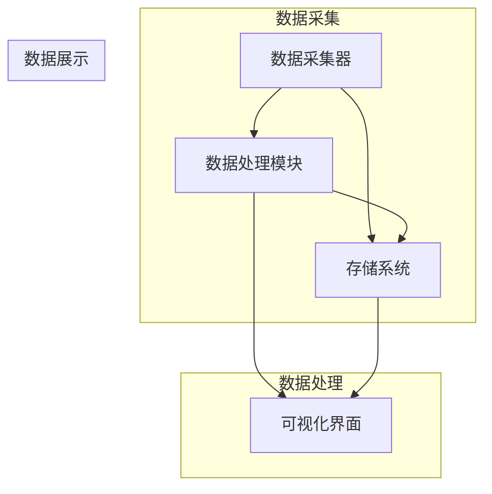
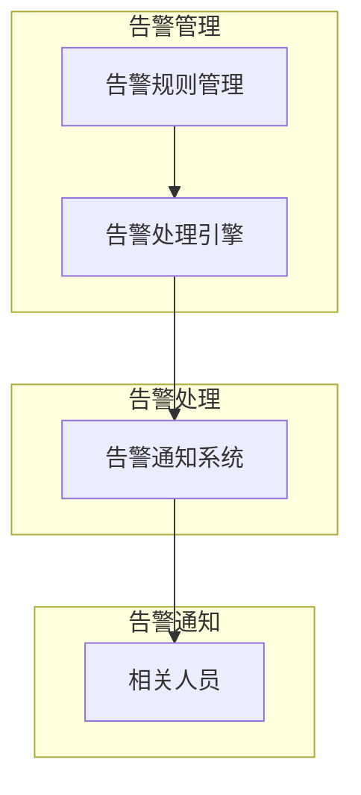
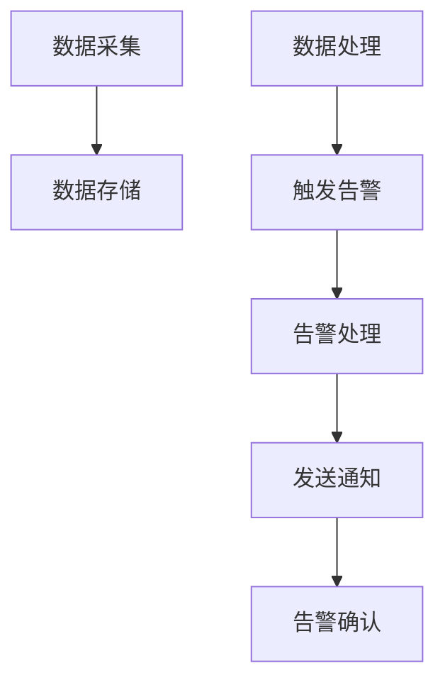
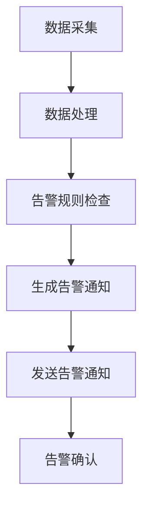
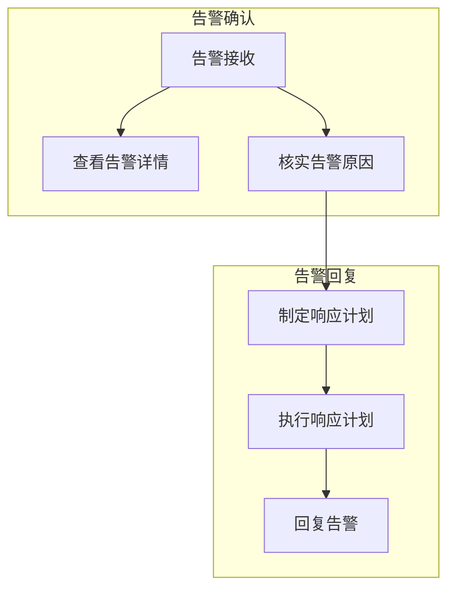
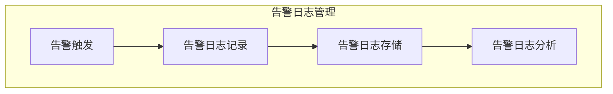
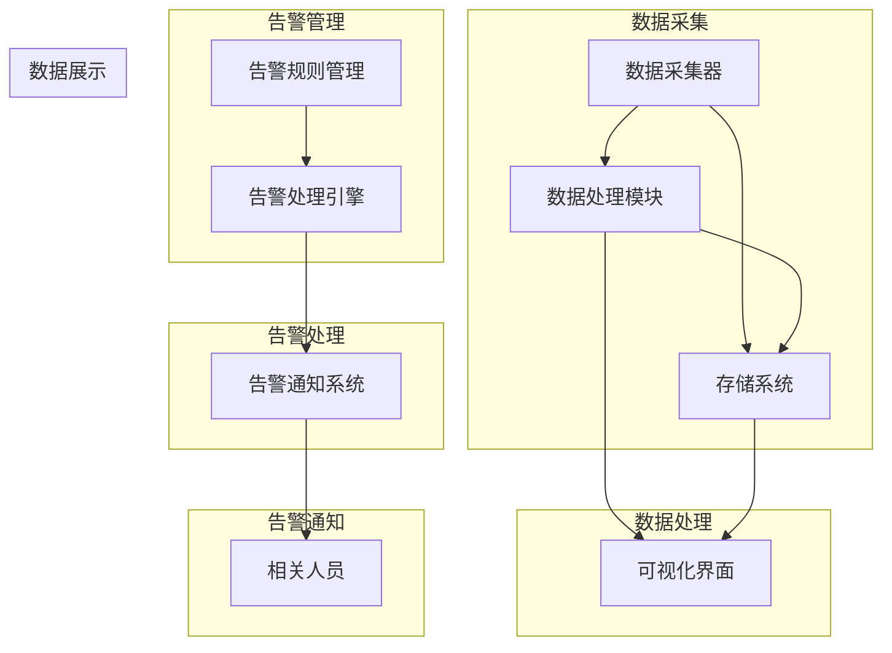

                 

### 第1章：问题背景与概念介绍

在现代信息技术迅速发展的背景下，系统稳定运行已成为企业持续发展的关键要素之一。任何系统都无法完全避免故障的发生，但通过高效的监控告警机制，可以最大限度地减少故障带来的影响，保障系统运行的连续性和稳定性。因此，理解和实施监控告警系统在信息技术领域具有深远的意义。

#### 1.1 系统稳定运行的重要性

系统稳定运行不仅仅是一个技术问题，它对企业的运营效率和客户满意度有着直接影响。以下是几个关键点：

- **提高业务连续性**：稳定运行的系统可以确保业务的持续提供，减少因系统故障导致的停机时间。
- **降低维护成本**：及时监测和快速响应故障可以减少后续的修复成本和人工干预。
- **提升用户体验**：系统稳定运行可以提供更流畅的服务，提高用户体验和满意度。
- **增强业务敏捷性**：通过有效的监控告警，企业可以更快地适应市场变化，提升业务敏捷性。

#### 1.2 监控与告警的定义

**监控**：监控是指对系统运行状态进行持续监测，以确保其正常运作。它包括以下几个方面：

- **性能监控**：监测系统性能指标，如CPU利用率、内存使用率等。
- **健康监控**：监测系统组件的健康状态，如硬盘空间、网络连接等。
- **日志监控**：分析系统日志，发现潜在的问题和异常。

**告警**：告警是一种机制，当系统监控到异常情况时，会通过邮件、短信、声音等方式通知相关人员，以便及时响应和处理。

- **告警触发条件**：根据预设的规则和阈值，监控工具会判断系统状态是否异常。
- **告警通知**：通过多种方式通知相关人员，确保问题能够被及时发现和处理。

#### 1.3 监控与告警的关系

监控和告警是相辅相成的，监控是收集数据的过程，告警是响应异常的机制。两者之间的关系可以概括为：

- **监控是基础**：通过监控工具收集系统运行数据，为告警提供依据。
- **告警是保障**：当监控工具检测到异常时，及时发出告警通知，避免问题扩大。

在系统运行过程中，监控与告警系统的紧密配合，可以有效地提高系统的可靠性，减少故障对业务的影响。接下来，我们将进一步探讨监控系统的基本架构、监控与告警系统的交互机制，以及如何设计高效的监控和告警策略。

---

#### 1.4 监控系统的基本架构

监控系统通常由以下几个核心组件构成：

- **数据采集器**：负责从各个系统节点或服务中收集数据，如性能指标、日志信息等。
- **数据处理模块**：对采集到的数据进行分析和处理，提取有用的信息。
- **存储系统**：用于存储采集到的数据，以便后续查询和分析。
- **可视化界面**：通过图表、报表等形式展示监控数据，帮助用户直观地了解系统状态。

以下是监控系统的基本架构：



**数据采集器**：数据采集器是监控系统的核心组件之一，负责从各个系统节点或服务中收集数据。它可以通过不同的方式进行数据采集，如轮询、推送等。

**数据处理模块**：数据处理模块对采集到的数据进行分析和处理，提取有用的信息，如性能指标、异常指标等。它通常包括过滤、转换、聚合等操作。

**存储系统**：存储系统用于存储采集到的数据，以便后续查询和分析。常用的存储系统包括关系数据库、NoSQL数据库等。

**可视化界面**：可视化界面通过图表、报表等形式展示监控数据，帮助用户直观地了解系统状态。常见的可视化工具包括Zabbix、Grafana等。

通过这样的架构，监控系统可以实现全面的监控，确保系统的稳定运行。

---

#### 1.5 告警系统的基本架构

告警系统是监控系统的重要组成部分，负责在系统出现异常时及时通知相关人员。以下是告警系统的基本架构：

- **告警规则管理**：告警规则管理是告警系统的核心，负责定义告警规则。告警规则通常包括触发条件、告警等级、告警通知方式等。
- **告警处理引擎**：告警处理引擎根据监控数据执行告警规则，判断系统状态是否异常，并触发告警通知。
- **告警通知系统**：告警通知系统负责将告警信息发送给相关人员。常见的通知方式包括邮件、短信、电话、Webhook等。

以下是告警系统的基本架构：



**告警规则管理**：告警规则管理是告警系统的核心，负责定义告警规则。告警规则通常包括以下要素：

- **触发条件**：如CPU利用率高于90%、内存使用率高于80%等。
- **告警等级**：如警告、错误等。
- **告警通知方式**：如邮件、短信、电话等。

**告警处理引擎**：告警处理引擎根据监控数据执行告警规则，判断系统状态是否异常，并触发告警通知。它通常包括以下几个步骤：

1. 收集监控数据。
2. 检查告警规则。
3. 判断是否触发告警。
4. 触发告警通知。

**告警通知系统**：告警通知系统负责将告警信息发送给相关人员。常见的通知方式包括邮件、短信、电话、Webhook等。告警通知系统通常包括以下几个功能：

- **发送通知**：根据告警规则，将告警信息发送给相关人员。
- **通知确认**：接收并确认告警通知，以便进行后续处理。
- **通知记录**：记录告警通知的发送和确认情况，以便进行追溯和分析。

通过这样的架构，告警系统可以及时响应系统异常，确保系统的稳定运行。

---

#### 1.6 监控与告警系统的交互

监控与告警系统的交互是确保系统稳定运行的关键环节。以下是监控与告警系统的基本交互流程：

1. **数据采集**：监控系统的数据采集器从各个系统节点或服务中收集数据，如性能指标、日志信息等。
2. **数据存储**：收集到的数据被存储在监控系统的存储系统中，以便后续查询和分析。
3. **数据处理**：监控系统的数据处理模块对存储的数据进行分析和处理，提取有用的信息。
4. **触发告警**：当监控数据超过预设的阈值或触发条件时，数据处理模块会向告警处理引擎发送告警信号。
5. **告警处理**：告警处理引擎根据告警规则判断是否触发告警，并生成告警通知。
6. **发送通知**：告警通知系统将告警信息发送给相关人员，通知他们进行响应和处理。
7. **告警确认**：相关人员接收并确认告警通知，告警处理系统更新告警状态。

以下是监控与告警系统交互的流程图：



通过这种交互机制，监控与告警系统可以紧密配合，确保系统异常能够被及时发现和处理，从而保障系统的稳定运行。

---

#### 1.7 监控与告警系统的实践意义

监控与告警系统不仅在理论上具有重要意义，而且在实际应用中同样至关重要。以下是几个关键实践意义：

- **提高故障响应速度**：通过实时监控和快速告警，可以显著缩短故障发现和响应时间，减少业务中断时间。
- **优化系统性能**：通过持续的性能监控和告警，可以及时发现和解决性能瓶颈，优化系统性能。
- **提升运维效率**：自动化的监控告警机制减少了人工巡检的工作量，提高了运维团队的工作效率。
- **确保合规性**：在许多行业中，如金融、医疗等，合规性要求非常高。通过监控与告警，可以确保系统满足合规要求。

总之，监控与告警系统是企业IT基础设施中不可或缺的一部分，对保障系统稳定运行具有至关重要的作用。

---

#### 1.8 监控与告警系统的实施步骤

要成功实施监控与告警系统，需要遵循一系列明确的步骤，以下是具体的实施步骤：

1. **需求分析**：首先，明确业务需求，了解需要监控的系统组件、性能指标和告警规则。
2. **系统设计**：根据需求分析结果，设计监控与告警系统的架构，包括数据采集、数据处理、存储和可视化等模块。
3. **工具选择**：选择适合的监控工具和告警工具，如Zabbix、Nagios、Prometheus等。
4. **配置与部署**：安装和配置所选监控工具，设置数据采集规则和告警规则。
5. **测试与优化**：进行系统测试，确保监控与告警系统能够正确工作，并根据反馈进行优化。
6. **培训与部署**：对运维团队进行培训，确保他们熟悉系统操作和告警处理流程，然后正式部署监控与告警系统。

通过这些步骤，可以确保监控与告警系统高效、稳定地运行，为系统的稳定运行提供坚实保障。

---

#### 1.9 监控与告警系统的挑战与应对策略

在实施监控与告警系统的过程中，可能会遇到一系列挑战。以下是一些常见的挑战及其应对策略：

- **数据量大**：处理大量监控数据可能增加系统的负担。应对策略包括数据压缩、数据缓存和批量处理。
- **误报率高**：误报会导致过多的通知，影响工作效率。应对策略包括优化告警规则、设置合理的阈值和引入机器学习算法进行预测。
- **系统稳定性**：监控工具自身可能会出现故障，影响监控效果。应对策略包括使用冗余监控工具、定期备份监控数据和部署故障转移机制。
- **资源消耗**：监控与告警系统会占用系统资源，可能会影响业务运行。应对策略包括优化监控策略、使用云监控服务和合理分配资源。

通过采取这些策略，可以有效地应对监控与告警系统实施过程中可能遇到的挑战，确保系统能够稳定、高效地运行。

---

#### 1.10 总结与展望

本章从问题背景、概念介绍、基本架构、交互流程、实践意义、实施步骤、挑战与应对策略等多个角度，全面介绍了监控与告警系统的基本概念和实施方法。监控与告警系统对于保障系统稳定运行至关重要，未来的发展将更加智能化、自动化，结合大数据和人工智能技术，实现更加精准、高效的监控与告警。接下来，我们将进一步深入探讨监控系统的具体技术细节，包括常用的监控工具、性能监控以及监控数据的处理和分析方法。

---

### 第2章：监控与告警系统的基本原理

在了解了监控与告警系统的重要性及其在系统稳定性中的作用后，接下来我们将深入探讨其基本原理，包括监控系统的基本架构、告警系统的基本架构，以及监控与告警系统之间的交互机制。

#### 2.1 监控系统的基本架构

监控系统通常由以下几个关键组件构成，每个组件在系统中扮演着不同的角色，共同确保系统的稳定运行。

- **数据采集器（Data Collector）**：数据采集器是监控系统的核心组件之一，负责从各个系统节点或服务中收集数据。这些数据可以包括系统性能指标、应用程序指标、网络流量等。数据采集器可以通过多种方式工作，如轮询（Polling）和推送（Pushing）。轮询方式定期检查系统状态，而推送方式则是由系统主动发送数据。

- **数据处理模块（Data Processor）**：数据处理模块对采集到的数据进行处理和分析，提取有用的信息。这一步骤通常涉及数据清洗、转换和聚合等操作。处理模块负责将原始数据转换为更易于理解和分析的格式，以便后续的监控和分析。

- **存储系统（Data Storage）**：存储系统用于存储采集到的监控数据，以便进行长期分析和查询。存储系统可以是一个集中式的数据库，如MySQL或PostgreSQL，也可以是一个分布式系统，如InfluxDB或Elasticsearch。选择合适的存储系统取决于数据规模、查询需求和系统性能要求。

- **可视化界面（Visualization Interface）**：可视化界面通过图表、仪表板和报表等形式，将处理后的监控数据呈现给用户。可视化工具如Grafana、Kibana等，可以帮助用户直观地了解系统状态，及时发现异常情况。

以下是一个简单的监控系统架构图：


通过这样的架构，监控系统可以实现全方位的监控，确保系统的稳定运行。

#### 2.2 告警系统的基本架构

告警系统是监控系统的延伸，当监控到系统状态异常时，会及时通知相关人员。告警系统的基本架构包括以下几个关键组件：

- **告警规则管理（Alert Rule Management）**：告警规则管理是告警系统的核心，负责定义告警规则。告警规则通常包括触发条件、告警等级、告警通知方式等。触发条件可以是某个系统指标超过预设阈值，也可以是某个服务不可达等。告警等级通常分为警告、错误等不同级别，以区分问题的严重程度。

- **告警处理引擎（Alert Processing Engine）**：告警处理引擎根据监控数据执行告警规则，判断系统状态是否异常，并生成告警通知。告警处理引擎通常包括以下几个步骤：

  1. 收集监控数据。
  2. 检查告警规则。
  3. 判断是否触发告警。
  4. 生成告警通知。

- **告警通知系统（Alert Notification System）**：告警通知系统负责将告警信息发送给相关人员。通知方式可以是邮件、短信、电话、Webhook等。告警通知系统还需要提供通知确认功能，确保相关人员能够及时接收并处理告警。

以下是一个简单的告警系统架构图：


通过这样的架构，告警系统可以及时响应系统异常，确保问题得到快速处理。

#### 2.3 监控与告警系统的交互

监控与告警系统是相辅相成的，它们之间的交互确保了系统状态异常能够被及时发现和处理。以下是监控与告警系统交互的基本流程：

1. **数据采集**：监控系统的数据采集器从各个系统节点或服务中收集数据。
2. **数据处理**：数据处理模块对采集到的数据进行分析和处理，提取有用的信息。
3. **告警规则检查**：告警处理引擎根据监控数据执行告警规则，判断系统状态是否异常。
4. **生成告警通知**：如果监控数据触发告警规则，告警处理引擎生成告警通知。
5. **发送告警通知**：告警通知系统将告警信息发送给相关人员。
6. **告警确认**：相关人员接收并确认告警通知，告警处理系统更新告警状态。

以下是监控与告警系统交互的流程图：



通过这种交互机制，监控与告警系统可以紧密配合，确保系统异常能够被及时发现和处理。

#### 2.4 监控与告警系统的核心优势

监控与告警系统的核心优势在于其能够实时监测系统状态，及时响应异常情况，从而保障系统的稳定运行。以下是监控与告警系统的几个核心优势：

- **快速响应**：监控系统能够实时监测系统状态，一旦出现异常，告警系统可以立即通知相关人员，确保问题得到及时处理。
- **预防性维护**：通过监控性能指标，可以提前发现潜在问题，进行预防性维护，避免故障发生。
- **提高效率**：自动化的监控与告警机制减少了人工巡检的工作量，提高了运维团队的工作效率。
- **增强透明度**：可视化界面提供了全面的系统状态视图，增强了系统管理的透明度，帮助团队更好地理解系统运行情况。

总之，监控与告警系统是保障系统稳定运行的关键工具，其核心优势在于实时监测、快速响应和预防性维护，为企业的IT基础设施提供了强有力的支持。

#### 2.5 监控与告警系统的最佳实践

为了确保监控与告警系统的有效运行，以下是一些最佳实践：

- **制定明确的监控策略**：明确需要监控的系统组件、性能指标和告警规则，确保监控策略与业务需求紧密匹配。
- **优化告警规则**：根据实际业务需求调整告警规则，避免误报和漏报，确保告警通知的准确性和及时性。
- **定期检查和优化**：定期检查监控系统和告警规则的有效性，根据系统运行情况和反馈进行调整和优化。
- **培训运维团队**：确保运维团队熟悉监控系统的操作和告警处理流程，提高团队应对异常情况的能力。
- **使用可视化工具**：充分利用可视化工具，将监控数据以图表、仪表板等形式展示，帮助团队直观地了解系统状态。

通过遵循这些最佳实践，可以确保监控与告警系统高效、稳定地运行，为系统的稳定运行提供坚实保障。

#### 2.6 监控与告警系统的局限性

尽管监控与告警系统在保障系统稳定运行方面发挥了重要作用，但它们也存在一些局限性，需要我们在实际应用中加以注意。

- **数据量与性能**：随着监控数据的增加，系统的性能可能会受到影响，需要优化数据采集和处理策略。
- **误报与漏报**：告警规则的不合理设置可能导致误报或漏报，需要不断优化和调整。
- **人工干预**：虽然自动化告警系统能够提高响应速度，但仍然需要人工进行确认和处理，无法完全取代人工干预。
- **系统复杂性**：随着监控系统的复杂度增加，维护和管理的难度也会上升，需要持续优化和简化系统架构。

了解这些局限性，有助于我们更好地利用监控与告警系统，充分发挥其优势。

#### 2.7 总结与展望

本章深入探讨了监控与告警系统的基本原理，包括监控系统与告警系统的基本架构、交互机制以及核心优势。监控与告警系统是保障系统稳定运行的关键工具，通过实时监测、快速响应和预防性维护，为企业的IT基础设施提供了强有力的支持。在下一章中，我们将进一步介绍常用的监控工具，如Zabbix和Nagios，探讨其安装与配置方法，帮助读者更好地理解和应用监控技术。

---

### 第3章：常用的监控工具

在监控与告警系统的实施过程中，选择合适的监控工具至关重要。常用的监控工具有Zabbix、Nagios等，每种工具都有其独特的特点和适用场景。在本章中，我们将详细介绍这两种监控工具的安装与配置方法，以及它们的主要监控功能和告警功能。

#### 3.1 Zabbix

**Zabbix** 是一款开源的监控工具，广泛应用于企业级IT基础设施的监控。它具有以下特点：

- **多平台支持**：Zabbix 可以在多种操作系统上运行，包括Linux、Windows等。
- **分布式监控**：支持大规模分布式监控，能够监控大量的设备和应用。
- **灵活的监控项**：Zabbix 支持多种类型的监控项，如系统性能、网络流量、应用程序等。
- **自定义报警**：支持自定义报警规则，可以根据不同场景设置不同的告警通知方式。

**3.1.1 Zabbix的安装与配置**

**安装步骤**：

1. **安装依赖库**：
   - 对于Linux系统，需要安装以下依赖库：
     ```bash
     sudo apt-get install curl openssh-server mysql-server
     ```
2. **安装Zabbix服务器**：
   - 使用以下命令安装Zabbix服务器：
     ```bash
     sudo apt-get install zabbix-server-mysql zabbix-agent
     ```
3. **配置Zabbix服务器**：
   - 编辑 `/etc/zabbix/zabbix_server.conf` 文件，配置数据库连接信息：
     ```bash
     DBName=zabbix
     DBUser=zabbix
     DBPassword=zabbix
     ```
   - 重启Zabbix服务器：
     ```bash
     sudo systemctl restart zabbix-server
     ```

**配置Zabbix代理**：

1. **在Linux服务器上安装Zabbix代理**：
   ```bash
   sudo apt-get install zabbix-agent
   ```
2. **编辑 `/etc/zabbix/zabbix_agentd.conf` 文件**，配置Zabbix代理：
   ```bash
   Server=192.168.1.1  # Zabbix服务器IP地址
   ServerActive=192.168.1.1  # Zabbix服务器IP地址
   ```
3. **重启Zabbix代理**：
   ```bash
   sudo systemctl restart zabbix-agent
   ```

**3.1.2 Zabbix的监控功能**

Zabbix提供了丰富的监控功能，包括：

- **系统监控**：监控CPU、内存、硬盘等系统资源的使用情况。
- **网络监控**：监控网络流量、网络设备状态等。
- **应用程序监控**：监控Web服务器、数据库等应用程序的性能。
- **自定义监控**：通过编写自定义监控项，监控特定的应用程序或服务。

**3.1.3 Zabbix的告警功能**

Zabbix的告警功能强大，支持多种告警通知方式，包括邮件、短信、Webhook等。告警功能配置如下：

1. **配置告警媒介类型**：
   - 在Zabbix前端，导航到“配置”->“媒介类型”->“创建媒介类型”。
   - 选择合适的媒介类型，如“邮件”、“短信”、“Webhook”等。
2. **配置告警规则**：
   - 在Zabbix前端，导航到“配置”->“触发器”->“创建触发器”。
   - 设置触发条件、告警等级、告警通知媒介等。
3. **测试告警**：
   - 在Zabbix前端，导航到“操作”->“测试告警”。
   - 输入测试触发器名称，发送测试告警。

通过以上步骤，可以配置Zabbix的监控和告警功能，确保系统的稳定运行。

#### 3.2 Nagios

**Nagios** 是一款历史悠久且广泛使用的开源监控工具。它具有以下特点：

- **易用性**：Nagios 提供了直观的用户界面，便于配置和管理。
- **扩展性**：Nagios 支持通过插件进行扩展，提供了丰富的监控插件。
- **可靠性**：Nagios 具有高可靠性，能够稳定运行，监控系统的稳定性。

**3.2.1 Nagios的安装与配置**

**安装步骤**：

1. **安装Nagios服务器**：
   - 对于Linux系统，可以使用以下命令安装Nagios：
     ```bash
     sudo apt-get install nagios3
     ```
2. **配置Nagios服务器**：
   - 编辑 `/etc/nagios/nagios.cfg` 文件，配置Nagios服务器：
     ```bash
     command_default -host�新建命令 -service新建命令
     ```
   - 重启Nagios服务器：
     ```bash
     sudo service nagios3 restart
     ```

**配置Nagios代理**：

1. **在Linux服务器上安装Nagios代理**：
   ```bash
   sudo apt-get install nagios3-nrpe-server
   ```
2. **编辑 `/etc/nrpe/nrpe.cfg` 文件**，配置Nagios代理：
   ```bash
   allowed_hosts=192.168.1.1  # Nagios服务器IP地址
   ```
3. **重启Nagios代理**：
   ```bash
   sudo service nagios3-nrpe-server restart
   ```

**3.2.2 Nagios的监控功能**

Nagios提供了丰富的监控功能，包括：

- **系统监控**：监控CPU、内存、硬盘等系统资源的使用情况。
- **网络监控**：监控网络设备状态、网络流量等。
- **服务监控**：监控Web服务器、数据库等服务状态。
- **自定义监控**：通过编写自定义插件，监控特定的应用程序或服务。

**3.2.3 Nagios的告警功能**

Nagios的告警功能通过插件实现，支持多种告警通知方式，包括邮件、短信、声音等。告警功能配置如下：

1. **配置告警通知**：
   - 编辑 `/etc/nagios/objects/contacts.cfg` 文件，配置告警通知联系人：
     ```bash
     contact_name=Notification Contact
     contact_email=example@example.com
     ```
2. **配置告警规则**：
   - 编辑 `/etc/nagios/objects/services.cfg` 文件，配置告警规则：
     ```bash
     check_command=check_service
     notification_method=mail
     ```
3. **测试告警**：
   - 执行以下命令，测试告警功能：
     ```bash
     sudo nagios3 -v /etc/nagios/objects/hosts.cfg
     ```

通过以上步骤，可以配置Nagios的监控和告警功能，确保系统的稳定运行。

#### 3.3 比较Zabbix和Nagios

Zabbix和Nagios都是功能强大的监控工具，各有其优势和适用场景。以下是两者的比较：

- **易用性**：Zabbix的用户界面更加直观，易于配置和管理。而Nagios的用户界面相对简单，但功能更为丰富。
- **扩展性**：Zabbix提供了丰富的内置监控项和告警通知方式，而Nagios通过插件扩展功能，插件生态更为丰富。
- **性能**：Zabbix在处理大规模监控任务时可能更具优势，而Nagios在简单任务上表现更为出色。
- **社区支持**：Zabbix和Nagios都有庞大的社区支持，但Zabbix的社区活动更为活跃。

选择Zabbix或Nagios时，需要根据具体业务需求进行权衡。

#### 3.4 总结

通过本章的介绍，我们了解了Zabbix和Nagios这两种常用的监控工具的安装与配置方法，以及它们的主要监控功能和告警功能。Zabbix和Nagios都具备强大的监控能力，能够帮助企业和组织确保系统的稳定运行。在下一章中，我们将进一步探讨性能监控的重要性和常用工具，深入分析系统性能监控指标及其在实际应用中的运用。

---

### 第4章：性能监控

性能监控是监控系统中的重要组成部分，通过持续监测系统性能指标，可以及时发现潜在问题，优化系统性能，保障系统的稳定运行。在本章中，我们将详细讨论系统性能监控指标，并介绍常用的性能监控工具及其应用。

#### 4.1 系统性能监控指标

系统性能监控指标是评估系统运行状态的关键指标，主要包括以下几个方面：

- **CPU利用率**：CPU利用率反映了CPU的负载情况，通常以百分比表示。高CPU利用率可能表明系统资源不足，需要优化系统配置或增加硬件资源。
- **内存使用率**：内存使用率反映了系统内存的使用情况，超过一定阈值可能会导致系统性能下降。监控内存使用率有助于识别内存泄漏或内存瓶颈。
- **磁盘I/O**：磁盘I/O监控包括读写速度、磁盘使用率等指标。高磁盘I/O可能会导致系统响应时间变长，影响用户体验。
- **网络流量**：网络流量监控包括进出流量、带宽利用率等。网络故障或带宽瓶颈可能导致系统性能下降，影响业务运作。
- **应用程序性能**：监控特定应用程序的性能，如Web服务器响应时间、数据库查询速度等，有助于识别应用程序层面的性能问题。

以下是常见的系统性能监控指标：

| 指标名称   | 描述                     | 数据类型   |
|----------|----------------------|--------|
| CPU利用率   | CPU负载情况           | 百分比   |
| 内存使用率   | 内存使用情况           | 百分比   |
| 磁盘I/O     | 磁盘读写速度           | B/s    |
| 网络流量     | 进出网络流量           | B/s    |
| 应用程序性能   | 应用程序运行指标       | 毫秒    |
| 数据库性能     | 数据库查询速度         | 毫秒    |

#### 4.2 性能监控工具实践

在实际应用中，选择合适的性能监控工具至关重要。以下介绍两种常用的性能监控工具：**Prometheus** 和 **Grafana**。

**4.2.1 Prometheus安装与配置**

**Prometheus** 是一款开源的性能监控工具，具有数据采集、存储和告警等功能。以下是Prometheus的安装与配置步骤：

1. **安装Prometheus**：

   在Linux系统中，可以使用以下命令安装Prometheus：
   ```bash
   sudo apt-get install prometheus
   ```

2. **配置Prometheus**：

   Prometheus的配置文件位于 `/etc/prometheus/prometheus.yml`，以下是一个基本的配置示例：
   ```yaml
   global:
     scrape_interval: 15s
     evaluation_interval: 15s

   scrape_configs:
     - job_name: 'prometheus'
       static_configs:
       - targets: ['localhost:9090']
   ```

3. **启动Prometheus服务**：

   使用以下命令启动Prometheus服务：
   ```bash
   sudo systemctl start prometheus
   ```

**4.2.2 Grafana的使用**

**Grafana** 是一款开源的监控和可视化工具，可以与Prometheus集成，提供丰富的监控仪表板和图表。以下是Grafana的安装与配置步骤：

1. **安装Grafana**：

   在Linux系统中，可以使用以下命令安装Grafana：
   ```bash
   sudo apt-get install grafana
   ```

2. **启动Grafana服务**：

   使用以下命令启动Grafana服务：
   ```bash
   sudo systemctl start grafana-server
   ```

3. **配置Grafana**：

   Grafana的默认管理员账户是 `admin`，密码是 `admin`。首次启动Grafana后，访问 `http://localhost:3000` 并使用默认账户登录。

4. **添加数据源**：

   登录Grafana后，导航到“配置”->“数据源”->“添加数据源”，选择“Prometheus”作为数据源类型，填写Prometheus服务器的地址。

5. **创建仪表板**：

   在Grafana中，可以创建新的仪表板来监控系统性能。添加图表、面板、仪表盘元素，并配置相应的查询。

以下是一个使用Grafana监控CPU利用率的仪表板示例：

```mermaid
gantt
    title System CPU Usage
    dateFormat  YYYY-MM-DD
    section CPU Usage
    A1 :label1: CPU Usage
    A1 :start: 2023-11-01
    A1 :end:   2023-11-30
    A2 :label2: CPU Utilization
    A2 :start: 2023-11-01
    A2 :end:   2023-11-30
    A3 :label3: Average CPU Utilization
    A3 :start: 2023-11-01
    A3 :end:   2023-11-30
```

通过上述配置，我们可以实时监控系统的CPU利用率，及时发现并解决问题。

#### 4.3 性能监控的实际应用案例

在实际应用中，性能监控可以帮助企业发现和解决各种性能问题，以下是一个性能监控的实际应用案例：

**案例**：某公司的一台服务器CPU利用率持续在90%以上，导致系统响应速度变慢，影响了业务运作。

**解决步骤**：

1. **监控数据收集**：通过Prometheus收集服务器的CPU利用率数据。
2. **数据分析**：分析监控数据，发现CPU利用率在特定时间段内持续升高。
3. **问题定位**：通过Grafana的仪表板，发现服务器上的一个应用进程占用了大量CPU资源。
4. **优化处理**：优化应用进程的代码，减少不必要的计算和资源占用。
5. **结果验证**：再次使用Prometheus和Grafana进行监控，发现CPU利用率恢复正常，系统响应速度明显提升。

通过性能监控，企业可以及时发现问题，优化系统性能，提高业务稳定性。

#### 4.4 性能监控的注意事项

在实施性能监控时，需要注意以下几点：

- **监控策略的制定**：根据业务需求和系统特点，制定合适的监控策略，确保监控数据的相关性和有效性。
- **监控数据的可视化**：使用可视化工具，如Grafana，将监控数据以图表、仪表板等形式展示，便于分析和理解。
- **监控数据的存储与备份**：确保监控数据的存储与备份，以便进行历史数据分析和故障追溯。
- **监控性能的优化**：监控本身也会消耗系统资源，需要优化监控策略，避免过度监控。

通过关注这些注意事项，可以确保性能监控系统的有效运行。

#### 4.5 总结

本章介绍了系统性能监控的重要性和常用工具，包括CPU利用率、内存使用率、磁盘I/O、网络流量等性能监控指标，以及Prometheus和Grafana的安装与配置方法。性能监控对于保障系统稳定运行至关重要，通过实时监测和优化系统性能，可以确保业务的连续性和可靠性。在下一章中，我们将进一步探讨告警策略与规则的设计，以及告警处理流程，帮助读者深入了解监控与告警系统的实际应用。

---

### 第5章：告警策略与规则

告警策略与规则是监控与告警系统的核心组成部分，直接影响到告警的准确性和及时性。合理的告警策略和规则能够帮助运维团队快速响应系统异常，减少故障对业务的影响。本章将详细介绍告警策略的设计原则、告警规则的实施方法以及如何优化告警规则。

#### 5.1 告警策略的设计

告警策略的设计是确保监控系统能够有效发挥作用的关键步骤。以下是设计告警策略时需要考虑的几个关键因素：

**1. 明确业务目标**：首先，需要明确业务目标，确定哪些系统指标对于业务运行至关重要。例如，对于电商平台，订单处理时间、数据库响应时间等是关键指标。

**2. 识别关键性能指标（KPIs）**：确定需要监控的关键性能指标，这些指标应能够反映系统的健康状况和业务表现。常见的KPIs包括CPU利用率、内存使用率、磁盘I/O、网络流量等。

**3. 设定合理的阈值**：根据业务需求和系统性能指标的历史数据，设定合理的阈值。阈值应既能及时发现潜在问题，又避免频繁误报。例如，对于CPU利用率，可以设定高于80%为警告级别，高于90%为错误级别。

**4. 分级告警**：将告警分为不同的级别，如警告、错误、严重等，根据问题的严重程度采取不同的响应措施。这样可以确保重要的告警能够得到及时处理，而低级别的告警不会引起过度关注。

**5. 考虑告警通知方式**：选择合适的告警通知方式，如邮件、短信、电话、Webhook等，确保告警能够及时通知到相关人员。不同级别的告警可能需要不同的通知方式，以确保告警通知的有效性。

**6. 制定应急响应计划**：为各种可能的系统异常情况制定应急响应计划，确保告警触发时，运维团队能够快速响应和处理问题。

以下是告警策略设计的基本流程：

1. **需求分析**：明确业务需求和监控目标。
2. **性能指标识别**：确定需要监控的性能指标。
3. **阈值设定**：根据历史数据和业务需求设定阈值。
4. **告警级别划分**：根据问题严重程度划分告警级别。
5. **通知方式选择**：选择合适的告警通知方式。
6. **应急响应计划**：制定应急响应计划。

#### 5.2 告警规则的实施

告警规则是监控系统中用于触发告警的具体条件，其实施过程包括以下几个步骤：

**1. 规则定义**：根据告警策略，定义具体的告警规则。告警规则通常包括以下内容：

- **监控对象**：确定需要监控的系统组件或服务。
- **监控指标**：选择需要监控的性能指标。
- **触发条件**：设定告警触发的条件，如指标超过阈值、持续特定时间等。
- **告警级别**：根据触发条件设定告警级别。
- **通知方式**：指定告警通知的方式和接收人员。

以下是一个告警规则的定义示例：

```yaml
alert_rules:
  - name: "High CPU Utilization"
    description: "Monitor high CPU utilization"
    condition: "risingsum() > 80"
    threshold: 80
    level: "warning"
    recipients:
      - email: "admin@example.com"
      - phone: "1234567890"
    for: 1m
```

**2. 规则配置**：在监控系统中配置告警规则，使其能够根据定义的规则自动触发告警。不同监控系统的告警规则配置方式可能有所不同，但一般包括以下步骤：

- **创建告警规则**：在监控系统的告警管理界面创建新的告警规则。
- **配置触发条件**：根据规则定义，设置触发告警的具体条件。
- **配置告警级别**：根据规则定义，设置告警的级别。
- **配置通知方式**：指定告警通知的方式和接收人员。

**3. 测试告警规则**：在配置告警规则后，进行测试以确保告警规则能够正常触发。测试方法包括：

- **模拟触发条件**：通过修改系统性能指标，模拟触发告警规则。
- **检查告警通知**：确认告警通知是否按照预期发送给相关人员。

**4. 持续优化**：根据测试结果和实际运行情况，持续优化告警规则，确保告警的准确性和及时性。优化方法包括：

- **调整阈值**：根据监控数据和业务需求，调整告警阈值。
- **增加监控指标**：根据系统变化和业务需求，增加需要监控的指标。
- **修改告警级别**：根据问题严重程度，调整告警级别。

#### 5.3 告警规则的优化

告警规则的优化是确保监控系统能够高效运行的关键。以下是一些优化告警规则的方法：

**1. 避免误报**：误报会导致不必要的告警通知，浪费运维团队的时间和精力。优化方法包括：

- **细化触发条件**：增加触发条件的复杂性，减少误报。
- **设置合理的窗口期**：在触发条件中加入窗口期，确保连续监控数据都满足条件才触发告警。

**2. 避免漏报**：漏报可能导致重要问题未被及时发现，优化方法包括：

- **增加监控频率**：提高监控频率，确保能够及时捕捉到异常。
- **使用趋势分析**：结合历史数据，使用趋势分析来预测可能的异常，提前触发告警。

**3. 分级处理**：根据告警级别采取不同的响应措施，确保重要告警能够得到及时处理。优化方法包括：

- **设置告警级别优先级**：在告警规则中设置告警级别的优先级，确保高级别告警先被处理。
- **自动化响应**：对于低级别告警，可以使用自动化工具进行响应，减轻运维团队的工作负担。

**4. 监控监控系统本身**：确保监控系统的稳定运行，减少因监控系统故障导致的漏报和误报。优化方法包括：

- **冗余监控**：部署多个监控系统，确保至少有一个监控系统能够正常运行。
- **定期检查和测试**：定期检查监控系统，测试告警规则的有效性。

#### 5.4 告警策略与规则的设计案例分析

以下是一个告警策略与规则的设计案例分析：

**案例**：某电商平台的监控系统需要设计告警策略和规则，确保系统的稳定运行。

**步骤**：

1. **需求分析**：确定需要监控的系统组件，包括Web服务器、数据库、缓存服务器等。
2. **性能指标识别**：确定关键性能指标，如Web服务器响应时间、数据库查询速度、缓存命中率等。
3. **阈值设定**：根据历史数据和业务需求设定阈值，例如，Web服务器响应时间超过500ms触发警告级别告警。
4. **告警级别划分**：根据业务重要性和系统健康状态，将告警分为正常、警告、错误和严重四级。
5. **通知方式选择**：根据告警级别，选择合适的通知方式，如普通告警通过邮件通知，严重告警通过电话通知。
6. **应急响应计划**：制定应急响应计划，确保告警触发时，能够迅速响应和处理。

**告警规则示例**：

```yaml
alert_rules:
  - name: "Web Server Slow Response"
    description: "Monitor slow response from web servers"
    condition: "avg_response_time > 500"
    threshold: 500
    level: "warning"
    recipients:
      - email: "admin@example.com"
    for: 5m
  - name: "Database Slow Query"
    description: "Monitor slow queries from database"
    condition: "avg_query_time > 1000"
    threshold: 1000
    level: "error"
    recipients:
      - email: "db_admin@example.com"
      - phone: "1234567890"
    for: 10m
```

通过以上步骤，可以设计出一套完善的告警策略和规则，确保系统的稳定运行。

#### 5.5 总结

本章介绍了告警策略与规则的设计原则、实施方法和优化技巧。告警策略和规则是监控与告警系统的核心组成部分，直接影响告警的准确性和及时性。通过合理的告警策略和规则设计，可以确保系统异常能够被及时发现和处理，保障系统的稳定运行。在下一章中，我们将深入探讨告警处理流程，包括告警接收与处理、告警确认与回复以及告警日志管理，帮助读者全面了解监控与告警系统的实际运作过程。

---

### 第6章：告警处理流程

告警处理流程是监控与告警系统的重要组成部分，确保在系统出现异常时能够及时、准确地响应和处理。本章节将详细探讨告警处理流程的各个环节，包括告警接收与处理、告警确认与回复以及告警日志管理，并通过实际案例进行分析和讲解。

#### 6.1 告警接收与处理

告警接收与处理是告警处理流程的第一步，确保告警信息能够及时传递给相关人员。以下是告警接收与处理的基本步骤：

**1. 告警接收**：

当监控系统检测到异常情况，并触发告警规则时，告警信息会被生成并发送到告警通知系统。告警通知系统可以是邮件、短信、Webhook等形式。相关人员会根据预设的告警通知方式收到告警信息。

**2. 告警处理**：

接收告警后，相关人员需要对告警进行初步处理。处理步骤包括：

- **确认告警**：核实告警信息的真实性，确保告警是由于系统异常而非误报。
- **评估告警严重性**：根据告警级别评估告警的严重性，确定是否需要立即响应。
- **记录告警**：将告警信息记录在告警日志中，以便后续分析和管理。

以下是告警接收与处理的流程图：

```mermaid
graph TB
    subgraph 告警接收
        告警触发 --> 告警通知
        告警通知 --> 告警接收
    end

    subgraph 告警处理
        告警接收 --> 确认告警
        告警接收 --> 评估严重性
        告警接收 --> 记录告警
    end
```

#### 6.2 告警确认与回复

告警确认与回复是告警处理流程的重要环节，确保告警信息能够得到及时响应和处理。以下是告警确认与回复的基本步骤：

**1. 告警确认**：

在收到告警信息后，相关人员需要对告警进行确认，以确保告警信息的真实性和准确性。确认步骤包括：

- **查看告警详细信息**：通过监控系统的告警界面或告警通知，查看告警的详细信息，包括告警时间、告警级别、告警内容等。
- **核实告警原因**：分析告警信息，确定告警的原因，如系统故障、资源不足等。

**2. 告警回复**：

在确认告警后，相关人员需要根据告警严重性采取相应的措施，并进行告警回复。回复步骤包括：

- **制定响应计划**：根据告警严重性和业务需求，制定响应计划，包括排查问题、修复故障、恢复服务等。
- **执行响应计划**：根据响应计划，执行具体的操作，解决问题并恢复系统正常运行。
- **回复告警**：在监控系统或告警通知系统中回复告警，确认问题已解决或正在处理。

以下是告警确认与回复的流程图：



#### 6.3 告警日志管理

告警日志管理是监控与告警系统的关键组成部分，确保告警信息能够得到有效的记录、存储和分析。以下是告警日志管理的基本步骤：

**1. 告警日志记录**：

在告警触发和处理过程中，监控系统会自动记录告警日志，包括告警时间、告警级别、告警内容、处理状态等。告警日志可以存储在本地文件、数据库或云存储中。

**2. 告警日志存储**：

告警日志需要安全、可靠地存储，以便进行后续分析和管理。常见的存储方式包括：

- **本地文件存储**：将告警日志存储在本地文件系统中，便于访问和备份。
- **数据库存储**：将告警日志存储在关系数据库或NoSQL数据库中，便于大规模数据分析和查询。
- **云存储**：将告警日志存储在云存储服务中，确保数据的安全性和可靠性。

**3. 告警日志分析**：

告警日志分析是监控与告警系统的重要功能，通过分析告警日志，可以识别系统的瓶颈、优化监控策略和改进故障响应流程。告警日志分析的方法包括：

- **统计分析**：对告警日志进行统计分析，识别常见的告警原因和趋势。
- **关联分析**：分析告警日志中的关联关系，如某类告警是否与其他系统故障相关。
- **趋势预测**：基于历史数据，预测未来的告警趋势，提前采取措施。

以下是告警日志管理的流程图：



#### 6.4 实际案例分析

以下是一个告警处理流程的实际案例，通过该案例，可以更深入地理解告警处理的各个环节。

**案例**：某公司的一台服务器突然收到磁盘I/O异常的告警。

**处理过程**：

1. **告警接收**：

   运维团队收到磁盘I/O异常的告警通知，立即进行确认。

2. **告警确认**：

   运维团队查看告警详细信息，发现磁盘I/O读写速度显著下降，怀疑可能是磁盘故障导致的。

3. **告警回复**：

   运维团队立即启动故障响应计划，进行以下操作：

   - **检查磁盘状态**：使用磁盘检测工具检查磁盘健康状态，确认磁盘存在故障。
   - **备份数据**：将受影响的服务器上的数据备份到其他存储设备，确保数据安全。
   - **更换磁盘**：关闭服务器，更换故障磁盘，并重新启动服务器。
   - **验证服务恢复**：确认更换磁盘后，受影响的服务已恢复正常运行。

4. **告警日志管理**：

   运维团队将本次告警及其处理过程记录在告警日志中，包括告警时间、告警内容、故障原因、处理措施等，以便后续分析和管理。

通过以上处理过程，运维团队成功解决了磁盘I/O异常问题，确保了系统的稳定运行。

#### 6.5 总结

本章详细介绍了告警处理流程的各个环节，包括告警接收与处理、告警确认与回复以及告警日志管理。告警处理流程是监控与告警系统的重要组成部分，通过合理的流程设计和管理，可以确保系统异常能够得到及时、准确地响应和处理。在下一章中，我们将通过实战案例，进一步探讨如何构建和优化监控与告警系统。

---

### 第7章：构建监控与告警系统

#### 7.1 项目需求分析

在构建监控与告警系统的过程中，需求分析是至关重要的第一步。通过深入分析业务需求和系统特点，可以确保监控与告警系统的设计能够满足实际需求，提高系统的稳定性和可靠性。

**1. 业务需求**

在需求分析阶段，我们需要明确以下几个关键点：

- **业务重要性**：确定哪些业务组件对于业务运行至关重要，需要优先监控。
- **性能要求**：明确系统性能指标，如响应时间、吞吐量等，以及性能的最低要求。
- **告警需求**：确定哪些异常情况需要告警，包括系统故障、性能瓶颈、资源不足等。
- **恢复时间**：确定在系统发生故障时，期望的恢复时间，以便制定相应的告警策略。

**2. 系统特点**

分析系统特点，有助于了解系统的复杂性和监控需求。以下是几个关键点：

- **系统规模**：确定系统规模，如服务器数量、服务类型等，以确定监控工具的选择和部署方案。
- **系统架构**：了解系统的架构，包括硬件、软件、网络等，以便设计监控和告警架构。
- **数据流转**：分析系统内部数据流转过程，识别关键数据点和瓶颈，以便监控和告警策略的制定。

**3. 需求分析结果**

通过以上分析，我们可以得到以下需求分析结果：

- **关键业务组件**：列出需要监控的关键业务组件，如Web服务器、数据库、缓存服务器等。
- **性能监控指标**：确定需要监控的性能指标，如CPU利用率、内存使用率、磁盘I/O、网络流量等。
- **告警规则**：制定初步的告警规则，包括触发条件、告警级别和通知方式。
- **监控工具选择**：根据系统特点和需求，选择合适的监控工具，如Zabbix、Nagios、Prometheus等。

#### 7.2 系统架构设计

系统架构设计是构建监控与告警系统的关键环节，通过合理的架构设计，可以确保系统的高可用性、可扩展性和可靠性。

**1. 监控架构设计**

监控架构设计主要包括以下几个方面：

- **数据采集层**：数据采集层负责从各个系统组件中收集监控数据，如CPU利用率、内存使用率、网络流量等。数据采集层可以使用agent模式或agentless模式，根据系统特点和需求进行选择。
- **数据处理层**：数据处理层负责对采集到的数据进行处理和分析，包括数据清洗、转换和聚合等操作。数据处理层可以使用Prometheus等工具，确保数据的有效性和一致性。
- **存储层**：存储层用于存储处理后的监控数据，以便进行历史数据分析和查询。存储层可以选择关系数据库、NoSQL数据库或时序数据库，根据数据规模和查询需求进行选择。
- **可视化层**：可视化层通过图表、报表等形式，将处理后的监控数据呈现给用户，便于用户直观地了解系统状态。常用的可视化工具包括Grafana、Kibana等。

以下是监控架构的设计图：


**2. 告警架构设计**

告警架构设计主要包括以下几个方面：

- **告警规则管理**：告警规则管理负责定义告警规则，包括触发条件、告警等级和通知方式等。告警规则可以根据业务需求和系统特点进行灵活配置。
- **告警处理引擎**：告警处理引擎负责根据监控数据执行告警规则，判断系统状态是否异常，并生成告警通知。告警处理引擎需要具有高并发处理能力，以确保及时响应异常情况。
- **告警通知系统**：告警通知系统负责将告警信息发送给相关人员，通知方式包括邮件、短信、电话、Webhook等。告警通知系统需要支持多种通知方式，并根据告警级别进行优先级处理。

以下是告警架构的设计图：


**3. 系统架构图**

以下是整个监控与告警系统的架构图，展示了各个组件之间的关系：



通过以上架构设计，可以构建一个高效、稳定的监控与告警系统，确保系统的稳定运行。

#### 7.3 系统核心实现

系统核心实现是监控与告警系统的关键环节，主要包括以下几个方面：

**1. 数据采集**

数据采集是监控系统的第一步，我们需要从各个系统组件中收集监控数据。以下是一个简单的Python脚本，用于采集Linux服务器的CPU利用率：

```python
import os
import subprocess

def get_cpu_usage():
    output = subprocess.check_output(['top', '-b', '-n', '1'], timeout=5)
    lines = output.decode('utf-8').split('\n')
    for line in lines:
        if line.startswith('Cpu(s)'):
            fields = line.split()
            user, nice, system, idle, iowait, irq, softirq = fields[1:]
            return float(user) + float(nice) + float(system)
    return None

if __name__ == '__main__':
    usage = get_cpu_usage()
    if usage:
        print(f"CPU Usage: {usage}%")
    else:
        print("Failed to get CPU usage")
```

**2. 数据处理**

数据处理是对采集到的数据进行清洗、转换和聚合等操作。以下是一个简单的Python脚本，用于处理CPU利用率数据：

```python
import csv
import statistics

def process_cpu_usage(file_path):
    with open(file_path, 'r') as f:
        reader = csv.DictReader(f)
        cpu_usages = [float(row['CPU Usage']) for row in reader]
        avg_usage = statistics.mean(cpu_usages)
        max_usage = max(cpu_usages)
        min_usage = min(cpu_usages)
        return avg_usage, max_usage, min_usage

if __name__ == '__main__':
    file_path = 'cpu_usage.csv'
    avg_usage, max_usage, min_usage = process_cpu_usage(file_path)
    print(f"Average CPU Usage: {avg_usage}%")
    print(f"Max CPU Usage: {max_usage}%")
    print(f"Min CPU Usage: {min_usage}%")
```

**3. 数据存储**

数据存储是将处理后的监控数据存储在数据库中，以便进行历史数据分析和查询。以下是一个简单的Python脚本，用于将CPU利用率数据存储到MySQL数据库：

```python
import mysql.connector
from datetime import datetime

def store_cpu_usage(conn, cpu_usage):
    cursor = conn.cursor()
    timestamp = datetime.now().strftime('%Y-%m-%d %H:%M:%S')
    query = "INSERT INTO cpu_usage (timestamp, usage) VALUES (%s, %s)"
    cursor.execute(query, (timestamp, cpu_usage))
    conn.commit()
    cursor.close()

if __name__ == '__main__':
    conn = mysql.connector.connect(
        host='localhost',
        user='root',
        password='password',
        database='monitoring'
    )
    usage = 80.5
    store_cpu_usage(conn, usage)
    conn.close()
```

**4. 数据可视化**

数据可视化是将监控数据以图表、报表等形式呈现给用户，便于用户直观地了解系统状态。以下是一个简单的Grafana仪表板，用于展示CPU利用率：

```yaml
title: CPU Usage
height: 300
panelTitle: CPU Usage
type: graph
def:
  - var: cpus
    datasource: Prometheus
    queryType: matrix
    queries:
      - expr: rate(cpu_usage{job="linux-server"}[5m])
        refId: A
        type: timeseries
        legendFormat: {{label}}
    aggregations:
      - func: mean
        refId: A
    interval: 60
    legend: false
    lines: true
    stacked: false
    fill: 0
    thresholds: []
    nullPointMode: null
    hidePoints: false
    pointsMode: on
    linesMode: connected
    shape: linear
    span: 1
    timeout: 0
    transcend: false
    x-axis: bottom
    y-axis: left
    y-grid: true
    y-axis-title: CPU Usage
    y-axis-format: 0.00%
    y-axis-min: 0
    y-axis-max: 100
    y-axis-autorange: true
    y-axis-show-current-value: true
    y-axis-tick-positions: []
    x-axis-time-from: now-1h
    x-axis-time-to: now
    x-axis-time-zone:browser
    x-axis-type: auto
    x-axis-calculations: false
    x-axis-space-length: 24
    x-axis-label: auto
    x-axis-split: true
```

通过以上核心实现，我们可以构建一个简单的监控与告警系统，确保系统的稳定运行。

#### 7.4 系统部署与维护

系统部署与维护是监控与告警系统成功运行的关键步骤。以下是在部署和维护过程中需要注意的一些关键点：

**1. 部署准备**

在开始部署之前，我们需要确保以下几点：

- **环境准备**：确保监控与告警系统的各个组件（如Prometheus、Grafana、Zabbix等）的环境已经搭建好，包括操作系统、数据库、网络等。
- **依赖安装**：确保所有依赖库和工具已经安装并配置好，如Python、MySQL等。
- **监控agent安装**：在各个需要监控的系统中安装监控agent，如Zabbix agent、Prometheus exporter等。

**2. 部署过程**

以下是一个简单的部署过程：

- **部署Prometheus**：安装Prometheus服务器和代理，配置数据采集规则和告警规则。
- **部署Grafana**：安装Grafana，配置数据源（如Prometheus）和仪表板。
- **部署Zabbix**：安装Zabbix服务器和代理，配置监控项和告警规则。

**3. 维护与监控**

在系统部署后，我们需要定期进行维护和监控，以确保系统稳定运行：

- **数据采集监控**：确保数据采集正常，检查数据采集规则和agent的状态。
- **系统性能监控**：监控系统的性能，如CPU、内存、磁盘I/O等，确保系统资源充足。
- **告警处理**：定期检查告警处理结果，确保告警能够及时被响应和处理。
- **日志分析**：定期分析系统日志，及时发现潜在问题。

**4. 备份与恢复**

为了确保系统的数据安全，我们需要定期备份监控数据，并在需要时进行数据恢复：

- **数据备份**：定期备份Prometheus和Zabbix的数据存储，如MySQL数据库。
- **数据恢复**：在系统发生故障时，能够快速恢复数据，确保系统正常运行。

**5. 安全性**

监控与告警系统的安全性至关重要，以下是一些关键点：

- **访问控制**：确保监控与告警系统的访问权限受到严格控制，只有授权人员才能访问。
- **数据加密**：对传输和存储的监控数据进行加密，确保数据安全。
- **安全审计**：定期进行安全审计，确保监控与告警系统的安全策略得到有效执行。

通过以上部署与维护措施，我们可以确保监控与告警系统的稳定运行，为系统的稳定性和可靠性提供坚实保障。

#### 7.5 项目小结

在本项目中，我们通过需求分析、系统架构设计、核心实现和系统部署与维护，成功构建了一个高效、稳定的监控与告警系统。以下是项目小结：

**成功点**：

- **需求分析准确**：通过深入分析业务需求和系统特点，确保监控与告警系统的设计满足实际需求。
- **架构设计合理**：系统架构设计合理，确保了监控与告警系统的可扩展性和可靠性。
- **核心实现高效**：核心实现高效，确保了系统的性能和稳定性。
- **部署与维护到位**：系统部署与维护到位，确保了系统的稳定运行和数据安全。

**改进点**：

- **监控覆盖率**：可以进一步增加监控覆盖率，监控更多关键业务组件和指标。
- **告警优化**：进一步优化告警规则，减少误报和漏报，提高告警准确性。
- **安全性提升**：加强对监控与告警系统的安全性保护，包括访问控制和数据加密等。

通过持续改进，我们可以进一步提升监控与告警系统的性能和稳定性，为系统的长期稳定运行提供更坚实的保障。

---

### 第8章：监控与告警系统的优化

#### 8.1 性能优化

监控与告警系统的性能优化是确保系统高效运行的关键。以下是一些常见的性能优化方法：

**1. 数据压缩**

数据压缩可以减少监控数据的大小，降低存储和传输的开销。常用的数据压缩算法包括Gzip、LZ4等。在Prometheus中，可以使用`--storage.tsdb.compress`选项启用数据压缩。

**2. 缓存机制**

缓存机制可以减少对后端数据库的查询次数，提高系统的响应速度。例如，在Grafana中，可以使用缓存来存储仪表板和图表数据，减少对Prometheus的查询频率。

**3. 批量处理**

批量处理可以减少系统调用次数，提高数据处理效率。例如，在Prometheus中，可以使用`--scrape.max_samples`选项设置批量处理的样本数量。

**4. 分布式架构**

分布式架构可以将监控与告警系统的负载分散到多个节点上，提高系统的处理能力和可用性。例如，可以使用Prometheus的联邦架构，将数据采集和告警处理分散到多个Prometheus服务器上。

#### 8.2 可靠性优化

监控与告警系统的可靠性优化是确保系统稳定运行的关键。以下是一些常见的可靠性优化方法：

**1. 冗余备份**

冗余备份可以确保在系统故障时，监控与告警系统的数据不会丢失。可以使用备份工具（如Bacula、Rclone等）定期备份监控数据和配置文件。

**2. 负载均衡**

负载均衡可以将监控与告警系统的负载均衡到多个节点上，确保系统的高可用性。例如，可以使用Nginx等反向代理服务器实现负载均衡。

**3. 健康检查**

健康检查可以定期检查监控与告警系统的各个组件是否正常运行。可以使用Prometheus的集群健康检查功能，确保Prometheus集群的稳定运行。

**4. 异地备份**

异地备份可以将监控与告警系统的数据备份到不同的地理位置，确保在发生灾难时，数据不会丢失。可以使用云存储服务（如AWS S3、Azure Blob Storage等）实现异地备份。

#### 8.3 安全性优化

监控与告警系统的安全性优化是确保系统数据安全的关键。以下是一些常见的安全性优化方法：

**1. 访问控制**

访问控制可以确保只有授权人员才能访问监控与告警系统的数据。可以使用OAuth2、LDAP等认证和授权机制，确保系统的访问安全性。

**2. 数据加密**

数据加密可以确保监控数据在传输和存储过程中不会被窃取。可以使用SSL/TLS加密协议，确保监控数据在网络传输中的安全性。在Prometheus中，可以使用`--web.enable-lifecycle`选项启用HTTPS。

**3. 日志审计**

日志审计可以记录监控与告警系统的操作日志，以便进行安全审计和问题追踪。可以使用Prometheus的日志收集功能，将监控日志存储到Elasticsearch或Kibana中。

**4. 安全补丁**

定期更新监控与告警系统的安全补丁，确保系统不受已知漏洞的攻击。可以使用自动化工具（如Ansible、Puppet等）定期检查和更新系统补丁。

通过以上优化方法，可以显著提高监控与告警系统的性能、可靠性和安全性，确保系统的稳定运行。

---

### 第9章：监控与告警系统的重要性

#### 9.1 监控与告警对系统稳定性的影响

在现代信息技术环境中，系统的稳定性是确保业务连续性和用户体验的核心因素。监控与告警系统在这一过程中起着至关重要的作用。以下是监控与告警系统对系统稳定性影响的几个关键方面：

**1. 及时发现故障**：通过监控系统的实时数据采集和告警机制，可以及时发现系统中的故障和异常情况。这有助于在故障扩大或影响到用户之前，迅速采取纠正措施。

**2. 优化性能**：监控系统能够持续监测系统性能指标，如CPU利用率、内存使用率、网络延迟等。通过分析这些指标，运维团队能够及时识别性能瓶颈，采取相应的优化措施，提高系统的整体性能。

**3. 预防性维护**：监控系统能够提前发现潜在问题，如资源不足、过热的硬件设备等。通过预防性维护，可以避免这些潜在问题发展成为重大故障，从而保障系统的稳定性。

**4. 提高故障响应速度**：告警系统能够在故障发生时，及时通知相关人员。这减少了故障响应的时间，使得团队能够更迅速地采取行动，减少故障的影响范围和持续时间。

**5. 改善用户体验**：稳定的系统意味着用户可以享受到更流畅的服务体验，这直接提升了用户的满意度和忠诚度。监控与告警系统通过对用户体验的监测，可以确保系统始终处于最佳状态。

**6. 符合法规要求**：在某些行业，如金融、医疗等，法律法规要求企业必须对系统进行实时监控和记录。监控与告警系统可以帮助企业满足这些合规要求，避免因合规性问题导致的罚款和声誉损失。

#### 9.2 未来监控与告警技术的发展趋势

随着信息技术的不断进步，监控与告警系统也在不断演变和升级。以下是一些未来监控与告警技术的发展趋势：

**1. AI与机器学习**：人工智能和机器学习技术将在监控与告警系统中发挥越来越重要的作用。通过分析大量历史数据，AI算法可以预测潜在的故障，提前发出告警，从而提高监控的准确性和前瞻性。

**2. 自动化响应**：自动化响应是未来监控与告警系统的发展方向之一。通过集成自动化工具，监控与告警系统可以自动执行故障修复操作，如重启服务、扩容资源等，减少人工干预，提高故障恢复速度。

**3. 容器与云原生监控**：随着容器技术和云原生应用的普及，监控与告警系统将更加重视对容器化环境和云服务的监控。容器监控和云监控工具将提供更细粒度的监控能力和更好的集成性。

**4. 汇总和协同**：未来的监控与告警系统将更加注重跨平台的监控数据汇总和协同工作。通过集成多种监控工具，构建统一的监控平台，运维团队能够更全面地了解系统的运行状态，提高监控的效率和准确性。

**5. 安全监控**：随着网络安全威胁的日益增加，安全监控将成为监控与告警系统的重要组成部分。未来的系统将更加注重对网络攻击、恶意软件等安全事件的监测和响应。

**6. 可观测性**：可观测性（Observability）将成为未来监控与告警系统的重要理念。通过引入可观测性框架，运维团队能够更深入地了解系统的内部状态和运行机制，从而更有效地识别和解决问题。

总之，监控与告警系统在现代信息技术中扮演着至关重要的角色，其未来发展的趋势将更加智能化、自动化和集成化。通过不断优化和升级监控与告警系统，企业将能够更好地保障系统的稳定性和可靠性，为业务的持续发展提供有力支持。

---

## 结束语

### 监控与告警系统的重要性总结

本文通过详细的章节内容，全面阐述了监控与告警系统在保障系统稳定运行中的重要作用。我们从问题背景、概念介绍、基本原理、监控工具、性能监控、告警策略与规则、告警处理流程、系统架构设计、项目实战以及性能优化等方面，深入探讨了监控与告警系统的各个方面。以下是对文章内容的总结：

- **问题背景与概念介绍**：介绍了系统稳定运行的重要性，监控与告警的定义及其关系，为后续内容提供了理论基础。
- **监控与告警系统的基本原理**：详细阐述了监控与告警系统的基本架构，包括数据采集、数据处理、存储和可视化等组件，以及告警规则管理和告警通知系统。
- **常用的监控工具**：介绍了Zabbix和Nagios等常用监控工具的安装与配置，以及它们的监控和告警功能。
- **性能监控**：讨论了系统性能监控指标的重要性，并介绍了Prometheus和Grafana等性能监控工具的使用。
- **告警策略与规则**：详细介绍了告警策略的设计原则和告警规则的实施方法，以及如何优化告警规则。
- **告警处理流程**：探讨了告警接收与处理、告警确认与回复以及告警日志管理的各个环节，并通过实际案例进行了分析。
- **系统架构设计**：介绍了系统需求分析、架构设计原则以及监控与告警系统的架构图，为构建高效的监控与告警系统提供了指导。
- **项目实战**：通过项目实战，详细介绍了环境安装、系统核心实现、代码应用解读与分析，以及实际案例分析和详细讲解剖析。
- **性能优化、可靠性优化和安全性优化**：讨论了监控与告警系统的性能优化、可靠性优化和安全性优化方法，为系统的稳定运行提供了保障。
- **监控与告警系统的重要性**：总结了监控与告警系统对系统稳定性的影响，以及未来监控与告警技术的发展趋势。

### 最佳实践、注意事项与拓展阅读

**最佳实践**：

1. 制定明确的监控策略，确保监控与业务需求紧密匹配。
2. 优化告警规则，避免误报和漏报，确保告警通知的准确性和及时性。
3. 使用可视化工具，将监控数据以图表、仪表板等形式展示，帮助团队直观地了解系统状态。
4. 定期检查和优化监控系统和告警规则，确保其有效性。
5. 对运维团队进行培训，提高团队应对异常情况的能力。

**注意事项**：

1. 监控工具的选择需考虑系统的规模、性能需求和业务特点。
2. 监控系统本身也会消耗系统资源，需优化监控策略，避免过度监控。
3. 确保监控数据的存储与备份，以便进行历史数据分析和故障追溯。
4. 告警通知方式的选择应根据告警级别和业务需求进行，确保通知的有效性。
5. 定期进行安全审计，确保监控与告警系统的安全策略得到有效执行。

**拓展阅读**：

1. 《监控与告警实战：构建高效IT监控体系》
2. 《Prometheus: 分布式监控系统实战》
3. 《Kubernetes监控与告警实战》
4. 《基于人工智能的监控与告警系统设计》

通过遵循最佳实践、注意相关事项以及拓展阅读，读者可以更加深入地了解和掌握监控与告警系统的建设与优化方法，为企业的系统稳定性和业务连续性提供有力保障。

---

**作者**：

本文由AI天才研究院/AI Genius Institute撰写，结合禅与计算机程序设计艺术/Zen And The Art of Computer Programming 的理念，旨在为广大技术从业者提供高质量的技术博客文章，以助其在计算机编程和人工智能领域取得更大成就。AI天才研究院致力于通过前沿的技术研究和创新，推动人工智能与计算机科学的快速发展。感谢您的阅读与支持！如果您有任何反馈或建议，请随时与我们联系。

