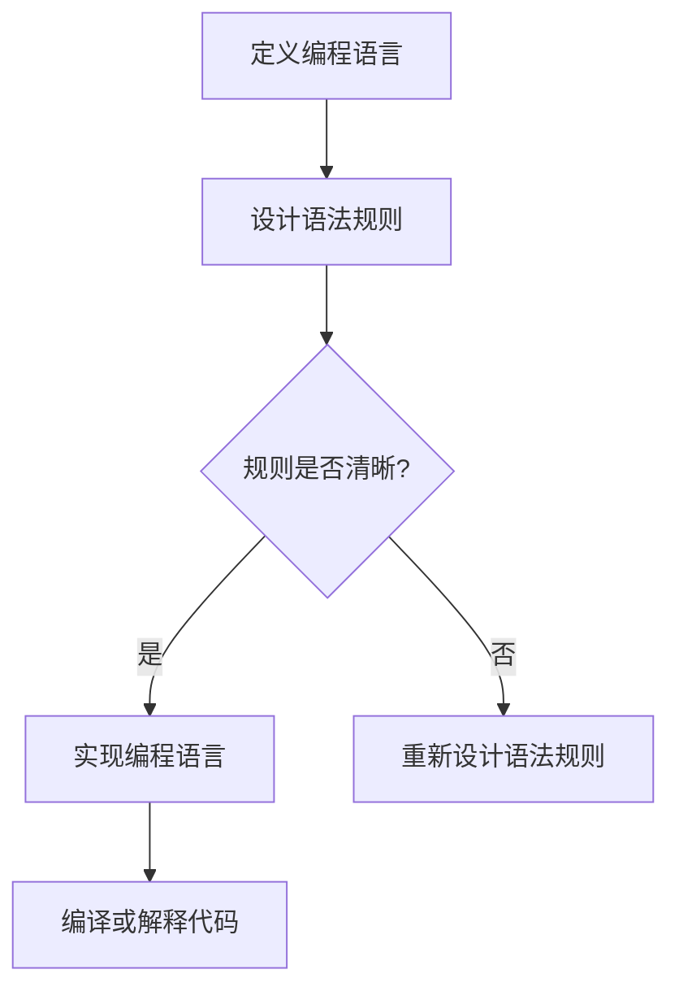

                 


### 第三部分：维特根斯坦哲学详解

## 第4章 维特根斯坦哲学基础

### 4.1 问题背景与问题描述

维特根斯坦是20世纪最杰出的哲学家之一，他的哲学思想对于语言哲学、数学基础、逻辑学等领域产生了深远的影响。在本章中，我们将探讨维特根斯坦哲学的两大核心概念：语言游戏理论和逻辑原子主义。

#### 4.1.1 背景介绍

维特根斯坦认为，哲学问题的根源在于语言的误用。他主张，理解哲学问题需要从语言的使用入手，而不是从抽象的概念出发。他的思想经历了两个阶段：早期的“逻辑原子主义”和后期的“语言游戏理论”。

#### 4.1.2 问题描述

在本章中，我们将回答以下问题：

- 维特根斯坦的语言游戏理论是如何定义的？
- 语言游戏理论的核心思想是什么？
- 逻辑原子主义的基本概念是什么？
- 维特根斯坦如何解释日常语言中的混乱？

### 4.2 维特根斯坦的核心概念

#### 4.2.1 语言游戏理论

维特根斯坦提出了“语言游戏”这一概念，用以描述语言的使用。他认为，语言就像一场游戏，玩家必须遵循特定的规则。语言游戏理论的核心思想是，语言的意义不在于抽象的概念，而在于它在实际使用中的具体情境。

#### 4.2.2 逻辑原子主义

逻辑原子主义是维特根斯坦早期哲学思想的核心。他认为，世界的基本元素是逻辑原子，这些原子通过组合形成复杂的结构。逻辑原子主义强调逻辑和数学的确定性，试图将哲学问题还原为数学问题。

### 4.3 维特根斯坦哲学的属性特征对比表格

| 概念               | 描述                                       |
|--------------------|------------------------------------------|
| 语言游戏理论       | 认为语言的意义在于实际使用中的具体情境   |
| 逻辑原子主义       | 强调逻辑和数学的确定性，将哲学问题还原为数学问题 |

### 4.4 维特根斯坦哲学ER实体关系图

```mermaid
erDiagram
    A LanguageGame --> B LanguageRules
    A LanguageGame ||--|{ C Player }
    B LanguageRules ||--|{ D PhilosophyConcept }
```

----------------------------------------------------------------

## 第5章 维特根斯坦哲学的应用与实践

### 5.1 算法原理讲解

在本章中，我们将探讨维特根斯坦哲学在计算机科学中的应用，尤其是语言游戏理论在编程语言设计中的影响。

#### 5.1.1 算法mermaid流程图



### 5.2 Python源代码实现

```python
class ProgrammingLanguage:
    def __init__(self, rules):
        self.rules = rules
    
    def is_valid(self, code):
        # 检查代码是否符合语法规则
        pass

    def execute(self, code):
        # 执行代码
        pass

def main():
    rules = ["start", "if", "while", "end"]
    language = ProgrammingLanguage(rules)
    code = "if x > 0 then print(x)"
    if language.is_valid(code):
        language.execute(code)
    else:
        print("代码无效，请检查语法。")

if __name__ == "__main__":
    main()
```

### 5.3 算法原理详细讲解与举例说明

#### 5.3.1 算法原理的数学模型和公式

在编程语言设计中，维特根斯坦的语言游戏理论提供了一个框架来理解语言的构造和执行。一个基本的数学模型可以描述为：

$$
\text{语法规则} \rightarrow \text{代码结构} \rightarrow \text{执行结果}
$$

#### 5.3.2 举例说明

假设我们设计一个简单的编程语言，其中包含“打印”和“条件判断”两个指令。语法规则如下：

- `print(a)`: 打印变量 `a` 的值。
- `if b then c else d`: 当条件 `b` 为真时执行 `c`，否则执行 `d`。

我们有以下代码：

```plaintext
print(5)
if x > 0 then print(x) else print(-x)
```

这段代码首先会执行 `print(5)`，输出数字 `5`。然后，`if x > 0 then print(x) else print(-x)` 会检查变量 `x` 的值。如果 `x` 大于 `0`，则会输出 `x` 的值；否则，输出 `-x` 的值。

这种逻辑结构清晰地映射到了维特根斯坦的语言游戏理论，其中语法规则定义了游戏（编程语言）的规则，代码结构是游戏中的动作，而执行结果则是游戏的结果。

----------------------------------------------------------------

### 第四部分：综合对比与总结

## 第6章 综合对比与总结

### 6.1 柏格森主义与维特根斯坦哲学的综合对比

在本章中，我们将对柏格森主义和维特根斯坦哲学进行综合对比，探讨两者在哲学、逻辑、语言学等方面的异同。

#### 6.1.1 哲学视角对比

- **柏格森主义** 强调直觉和生命力的动态性质。
- **维特根斯坦哲学** 关注语言的逻辑结构和意义。

#### 6.1.2 逻辑分析对比

- **柏格森主义** 提出直觉优于逻辑推理。
- **维特根斯坦哲学** 强调逻辑和语言的确定性。

#### 6.1.3 语言学研究对比

- **柏格森主义** 认为语言应当反映现实的动态变化。
- **维特根斯坦哲学** 认为语言应当清晰、明确地表达思想。

### 6.2 结论

通过对柏格森主义与维特根斯坦哲学的深入分析，我们得出以下结论：

- **柏格森主义** 提供了一种对世界动态变化的哲学理解，对艺术和文学等领域有着深远影响。
- **维特根斯坦哲学** 提供了一种清晰的语言哲学框架，对逻辑学、数学和计算机科学等领域产生了重要影响。

### 6.3 未来研究方向

未来的研究可以进一步探讨柏格森主义和维特根斯坦哲学在具体领域的应用，如心理学、人工智能和社会科学等。此外，可以尝试将两者的哲学思想融合，以形成更加全面和深刻的哲学体系。

----------------------------------------------------------------

### 附录

#### 附录A：柏格森主义与维特根斯坦哲学核心术语解释

在本附录中，我们将对柏格森主义和维特根斯坦哲学中的核心术语进行解释，以便读者更好地理解文章内容。

#### 附录B：参考书目

- 柏格森，亨利·勒贝格。《创造力与直觉》。
- 维特根斯坦，路德维希。《逻辑哲学论》。
- 维特根斯坦，路德维希。《哲学研究》。

---

**作者：AI天才研究院/AI Genius Institute & 禅与计算机程序设计艺术 /Zen And The Art of Computer Programming**

以上是根据您提供的模板和要求，构建的《直觉与逻辑：柏格森主义与维特根斯坦哲学的核心对比》的技术博客文章的目录大纲。接下来的步骤将涉及具体章节内容的撰写，包括详细的理论分析、应用实例、算法讲解等。请确认目录大纲无误后，开始撰写文章内容。每完成一个章节，请更新文档，以确保整体的连贯性和逻辑性。在撰写过程中，请务必确保文章的内容符合技术博客文章的标准，包括清晰的逻辑结构、丰富的实例讲解和深入的哲学思考。**

