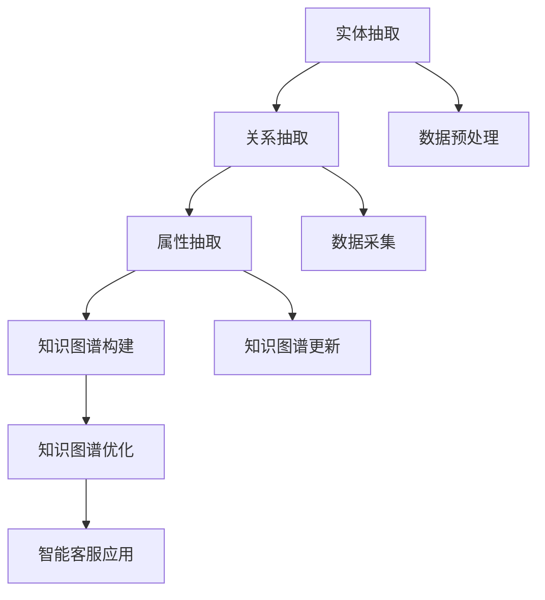

                 

# 知识图谱在智能客服系统中的应用

> 关键词：知识图谱、智能客服、数据预处理、系统架构、优化策略

> 摘要：本文旨在探讨知识图谱在智能客服系统中的应用，通过系统性的分析知识图谱与智能客服的融合点，详细阐述知识图谱构建、智能客服系统设计及优化策略。文章首先介绍了知识图谱与智能客服的基本概念，随后深入剖析了知识图谱在智能客服系统中的应用流程，最后通过实际案例展示了知识图谱提升智能客服系统的实际效果，并对未来发展趋势与挑战进行了展望。

## 目录大纲

## 第一部分: 引言

### 第1章: 知识图谱与智能客服概述

#### 1.1.1 知识图谱的概念与作用

#### 1.1.2 智能客服的概念与现状

#### 1.1.3 知识图谱在智能客服中的应用前景

### 1.2 核心概念与联系

#### 1.2.1 知识图谱的核心概念

#### 1.2.2 智能客服的核心概念

#### 1.2.3 知识图谱与智能客服的联系

### 1.3 本章小结

## 第二部分: 知识图谱构建

### 第2章: 数据采集与预处理

#### 2.1 数据采集

#### 2.2 数据预处理

### 第3章: 知识抽取与构建

#### 3.1 知识抽取

#### 3.2 知识图谱构建

### 第4章: 知识图谱优化与更新

#### 4.1 知识图谱优化

#### 4.2 知识图谱更新

### 第5章: 本章小结

## 第三部分: 智能客服系统设计与实现

### 第6章: 智能客服系统架构

#### 6.1 系统概述

#### 6.2 功能模块设计

### 第7章: 知识图谱在智能客服中的应用

#### 7.1 知识图谱在智能客服中的角色

#### 7.2 实现案例

### 第8章: 本章小结

## 第四部分: 实战案例与优化策略

### 第9章: 实战案例1：XX银行智能客服系统

### 第10章: 实战案例2：XX电商平台智能客服系统

### 第11章: 知识图谱在智能客服系统中的优化策略

### 第12章: 本章小结

## 第五部分: 未来发展趋势与挑战

### 第13章: 未来发展趋势

### 第14章: 面临的挑战与解决策略

### 第15章: 本章小结

## 参考文献

## 附录

### 附录A: 代码示例

### 附录B: 术语表

### 附录C: Mermaid 图示例

---

**第一部分: 引言**

### 第1章: 知识图谱与智能客服概述

#### 1.1.1 知识图谱的概念与作用

知识图谱是一种结构化的语义知识库，通过实体、属性和关系等基本元素来表示现实世界中的信息。它旨在通过语义理解来辅助机器理解和处理自然语言，实现信息的高效组织和查询。知识图谱的构建涉及数据采集、知识抽取、图谱构建和优化等多个环节，其作用主要体现在以下几个方面：

1. **信息组织与检索**：知识图谱通过对信息的结构化处理，能够提供高效的检索服务，满足用户对特定信息的快速查询需求。
2. **语义理解与推理**：知识图谱为自然语言处理提供了丰富的语义资源，支持对文本内容的深层理解和推理。
3. **智能应用**：知识图谱在智能客服、智能搜索、推荐系统等应用场景中具有广泛的应用价值，能够显著提升系统的智能化水平。

#### 1.1.2 智能客服的概念与现状

智能客服是一种基于人工智能技术的客服系统，通过自然语言处理、语音识别、机器学习等技术，实现与用户的智能交互。智能客服的核心目标是提高客服效率、降低客服成本，同时提供高质量的客户服务。当前智能客服的发展现状如下：

1. **语音识别与自然语言处理技术的成熟**：语音识别和自然语言处理技术的不断进步，使得智能客服能够更准确地理解用户意图，提供更自然的交互体验。
2. **多渠道集成**：智能客服系统开始整合多种渠道（如电话、邮件、在线聊天等），提供一站式服务。
3. **个性化服务**：通过分析用户行为和偏好，智能客服能够为用户提供个性化的服务和建议。

#### 1.1.3 知识图谱在智能客服中的应用前景

知识图谱在智能客服中的应用前景十分广阔，主要体现在以下几个方面：

1. **提升问答系统的智能水平**：知识图谱为智能客服提供了丰富的语义信息，能够提高问答系统的准确性和效率。
2. **个性化服务**：通过知识图谱，智能客服能够更好地理解用户的背景和需求，提供个性化的服务和推荐。
3. **智能推荐**：知识图谱可以用于智能推荐系统，为用户提供相关的商品、信息等推荐。
4. **业务自动化**：知识图谱可以帮助企业实现业务自动化，降低人力成本，提高运营效率。

#### 1.2 核心概念与联系

##### 1.2.1 知识图谱的核心概念

知识图谱的核心概念包括：

- **实体（Entity）**：现实世界中具有独立存在意义的事物，如人、地点、物品等。
- **属性（Attribute）**：描述实体特征的属性，如姓名、出生日期、地址等。
- **关系（Relationship）**：描述实体之间相互关系的边，如“居住于”、“属于”等。

知识图谱的属性特征如下表所示：

| 属性        | 说明                                     |
| ----------- | ---------------------------------------- |
| 实体        | 具有独立存在意义的个体或对象           |
| 属性        | 描述实体的特征或属性的值               |
| 关系        | 描述实体之间的相互作用或关联           |
| 节点        | 实体的表示，图中的点                   |
| 边          | 关系的表示，图中的线                   |

##### 1.2.2 智能客服的核心概念

智能客服的核心概念包括：

- **自然语言处理（NLP）**：对自然语言文本进行分析和理解的技术。
- **语音识别（ASR）**：将语音信号转换为文本的技术。
- **机器学习（ML）**：通过数据训练模型，使其能够进行预测和决策的技术。
- **多轮对话管理**：处理用户多轮对话的技术，确保对话的连贯性和一致性。

智能客服的优势与挑战如下表所示：

| 优势          | 说明                                                         |
| ------------- | ------------------------------------------------------------ |
| 提高效率      | 自动处理大量客户咨询，减少人工成本                           |
| 提升服务质量  | 提供高效、准确的客户服务，增强客户满意度                       |
| 个性化服务    | 通过数据分析，为用户提供个性化的服务和建议                     |
| 持续学习与优化 | 通过机器学习等技术，不断优化服务流程，提升服务质量           |
| 挑战          | 自然语言理解复杂，需要准确识别用户意图                         |
| 用户体验      | 确保用户与智能客服的交互流畅自然，避免尴尬和误解               |
| 数据安全与隐私 | 保护用户数据的安全和隐私，避免数据泄露和滥用                   |

#### 1.3 本章小结

本章介绍了知识图谱与智能客服的基本概念及其在智能客服中的应用前景。通过对比知识图谱和智能客服的核心概念，我们明确了两者之间的联系与融合点。在后续章节中，我们将深入探讨知识图谱构建、智能客服系统设计及优化策略，以期为智能客服系统的实际应用提供有力支持。

---

## 第二部分: 知识图谱构建

### 第2章: 数据采集与预处理

数据采集是构建知识图谱的基础，其质量直接影响知识图谱的完整性和准确性。数据预处理则是为了提高数据质量，使其适合用于知识图谱构建。

#### 2.1 数据采集

数据采集的主要方法包括：

1. **网络爬虫技术**：通过爬取互联网上的开放数据源，获取大量结构化和半结构化数据。
2. **数据源获取**：利用API接口、数据库连接等方式，获取特定领域的专业数据。

#### 2.2 数据预处理

数据预处理主要包括以下步骤：

1. **数据清洗**：去除重复数据、噪声数据和错误数据，确保数据的一致性和准确性。
2. **数据标准化**：将数据统一格式，如时间格式、字符串编码等，便于后续处理。
3. **数据质量评估**：评估数据的完整性、准确性和一致性，为后续知识抽取和图谱构建提供依据。

### 第3章: 知识抽取与构建

知识抽取是将原始数据中的关键信息提取出来，形成知识图谱的过程。知识抽取主要包括实体抽取、关系抽取和属性抽取。

#### 3.1 知识抽取

1. **关键词抽取**：通过文本分析，提取文本中的关键词，作为实体或关系的候选。
2. **实体抽取**：识别文本中的实体，如人名、地名、机构名等。
3. **关系抽取**：识别实体之间的关系，如“属于”、“居住于”等。

#### 3.2 知识图谱构建

知识图谱构建是将抽取的知识整合起来，形成有结构的知识库的过程。知识图谱构建主要包括：

1. **知识图谱表示方法**：选择合适的表示方法，如RDF（资源描述框架）、OWL（Web本体语言）等。
2. **知识图谱存储与管理**：将构建好的知识图谱存储在数据库中，并提供查询和管理功能。

### 第4章: 知识图谱优化与更新

知识图谱构建完成后，需要不断优化和更新，以提高其质量和实用性。

#### 4.1 知识图谱优化

知识图谱优化主要包括：

1. **节点扩张**：通过引入新的实体和关系，扩展知识图谱的覆盖范围。
2. **关系增强**：通过引入更多的关系，增强知识图谱的语义丰富度。

#### 4.2 知识图谱更新

知识图谱更新主要包括：

1. **数据同步**：定期同步更新知识库中的数据，保持知识图谱的实时性。
2. **知识库更新策略**：制定合适的更新策略，如增量更新、全量更新等。

### 第5章: 本章小结

本章详细介绍了知识图谱构建的各个环节，包括数据采集与预处理、知识抽取与构建以及知识图谱优化与更新。通过系统的构建过程，我们能够更好地理解知识图谱在智能客服系统中的应用价值。

---

**第三部分: 智能客服系统设计与实现**

### 第6章: 智能客服系统架构

智能客服系统的设计需要综合考虑系统的功能需求、性能指标和可维护性。一个典型的智能客服系统通常包括以下几个核心模块：

#### 6.1 系统概述

智能客服系统旨在为用户提供高效、便捷的在线客服服务。系统的主要功能包括：

- **用户交互模块**：与用户进行交互，接收用户的问题和反馈。
- **知识查询模块**：根据用户的问题，在知识图谱中检索相关的答案。
- **智能推荐模块**：根据用户的行为和偏好，提供个性化的服务和推荐。

#### 6.2 功能模块设计

1. **用户交互模块**：

   用户交互模块是智能客服系统的入口，负责接收用户的问题和反馈。其主要功能包括：

   - **语音识别**：将用户的语音输入转换为文本。
   - **文本解析**：分析用户的文本输入，提取关键信息。
   - **意图识别**：识别用户的意图，如咨询、投诉、建议等。
   - **回复生成**：根据用户的意图和知识图谱中的信息，生成合适的回复。

2. **知识查询模块**：

   知识查询模块负责在知识图谱中检索与用户问题相关的答案。其主要功能包括：

   - **查询接口**：提供API接口，供前端调用。
   - **查询算法**：实现高效的查询算法，如基于关键词的匹配、基于语义的匹配等。
   - **结果排序**：对查询结果进行排序，提高答案的准确性。

3. **智能推荐模块**：

   智能推荐模块旨在为用户提供个性化的服务和推荐。其主要功能包括：

   - **用户画像**：根据用户的行为和偏好，构建用户画像。
   - **推荐算法**：实现推荐算法，如协同过滤、基于内容的推荐等。
   - **推荐结果展示**：将推荐结果以合适的形式展示给用户。

#### 6.3 系统架构设计

智能客服系统的架构设计需要考虑系统的可扩展性、高性能和高可靠性。一个典型的智能客服系统架构如下：

1. **前端**：

   前端主要负责与用户进行交互，包括网页、移动应用等。前端需要实现以下功能：

   - **用户界面**：提供用户友好的界面，方便用户输入问题和查看回复。
   - **实时交互**：实现与后端的实时通信，保证用户输入和回复的流畅性。

2. **后端**：

   后端主要负责处理用户的请求，包括用户交互模块、知识查询模块和智能推荐模块。后端需要实现以下功能：

   - **语音识别与文本解析**：将用户的语音输入转换为文本，并提取关键信息。
   - **意图识别与回复生成**：根据用户的意图和知识图谱中的信息，生成合适的回复。
   - **查询接口与结果排序**：提供API接口，供前端调用，并对查询结果进行排序。
   - **用户画像与推荐算法**：根据用户的行为和偏好，构建用户画像，并实现推荐算法。

3. **知识图谱**：

   知识图谱是智能客服系统的核心，负责存储和管理知识。知识图谱需要实现以下功能：

   - **知识抽取与构建**：从原始数据中抽取知识，构建知识图谱。
   - **知识查询与更新**：提供高效的查询接口，并根据需求更新知识图谱。

4. **数据库**：

   数据库负责存储和管理系统的各类数据，包括用户数据、知识数据等。数据库需要实现以下功能：

   - **数据存储**：提供高效的数据存储方案，保证数据的完整性和一致性。
   - **数据查询**：提供高效的查询接口，支持各类查询操作。

#### 6.4 系统接口设计和系统交互

智能客服系统的接口设计和系统交互是确保各模块协同工作的关键。以下是一个简化的接口设计和系统交互流程：

1. **用户交互模块**：

   - **接口设计**：提供RESTful API接口，支持文本输入、语音输入等。
   - **交互流程**：用户输入问题 → 前端将问题发送至后端 → 后端进行语音识别、文本解析、意图识别等操作 → 后端生成回复 → 前端将回复展示给用户。

2. **知识查询模块**：

   - **接口设计**：提供RESTful API接口，支持查询操作。
   - **交互流程**：前端发起查询请求 → 后端调用知识查询模块，检索相关答案 → 后端将查询结果返回给前端 → 前端将查询结果展示给用户。

3. **智能推荐模块**：

   - **接口设计**：提供RESTful API接口，支持推荐操作。
   - **交互流程**：前端发起推荐请求 → 后端调用智能推荐模块，生成推荐结果 → 后端将推荐结果返回给前端 → 前端将推荐结果展示给用户。

#### 6.5 本章小结

本章介绍了智能客服系统的架构设计，包括系统概述、功能模块设计、系统架构设计、接口设计和系统交互。通过合理的架构设计，智能客服系统可以实现高效、稳定的运行，为用户提供优质的客服体验。

---

### 第7章: 知识图谱在智能客服中的应用

知识图谱在智能客服中的应用主要集中在提高问答系统的智能水平和个性化服务水平。以下将详细讨论知识图谱在智能客服中的角色和具体实现。

#### 7.1 知识图谱在智能客服中的角色

知识图谱在智能客服中扮演着至关重要的角色，主要表现在以下几个方面：

1. **问题理解与意图识别**：

   知识图谱提供了丰富的语义信息，帮助智能客服更好地理解用户的问题。通过知识图谱，智能客服可以识别用户的问题意图，例如查询信息、咨询服务、投诉等。这种理解能力使得智能客服能够更准确地回答用户的问题，提高用户体验。

2. **知识查询与推荐**：

   知识图谱存储了大量的实体、属性和关系信息，智能客服可以利用这些信息进行知识查询和推荐。例如，当用户询问某个产品的详细信息时，智能客服可以通过知识图谱查询到相关的产品信息，并给出详细的回答。此外，知识图谱还可以用于个性化推荐，根据用户的历史行为和偏好，为用户推荐相关的产品或服务。

3. **业务自动化与决策支持**：

   知识图谱可以用于智能客服的业务自动化和决策支持。例如，当用户咨询某项业务流程时，智能客服可以通过知识图谱自动生成业务流程图，并给出详细的解释。此外，知识图谱还可以用于智能决策，根据用户的问题和需求，智能客服可以推荐最佳解决方案。

#### 7.2 知识图谱在智能客服中的具体实现

以下是一个基于知识图谱的智能客服系统的具体实现过程：

1. **数据采集与预处理**：

   智能客服系统首先需要从互联网、数据库等数据源中采集相关数据，如产品信息、业务流程、用户评价等。采集到的数据需要进行预处理，包括数据清洗、格式统一、质量评估等步骤。

2. **知识抽取与构建**：

   通过自然语言处理、实体识别、关系抽取等技术，从预处理后的数据中抽取知识，构建知识图谱。知识图谱的构建包括以下步骤：

   - **实体抽取**：识别文本中的实体，如人名、地名、机构名等。
   - **关系抽取**：识别实体之间的关系，如“属于”、“居住于”等。
   - **属性抽取**：提取实体的属性，如姓名、年龄、地址等。
   - **知识图谱构建**：将抽取的知识整合起来，构建知识图谱。

3. **智能问答与推荐**：

   - **智能问答**：当用户提出问题时，智能客服通过自然语言处理技术理解用户的问题，并在知识图谱中查询相关答案。查询过程包括关键词匹配、语义匹配等步骤，以确保答案的准确性。
   - **智能推荐**：根据用户的历史行为和偏好，智能客服可以从知识图谱中推荐相关的产品或服务。推荐过程包括用户画像构建、推荐算法实现等步骤。

4. **系统优化与更新**：

   为了提高智能客服系统的性能和用户体验，需要对系统进行优化和更新。系统优化包括数据预处理优化、知识抽取优化、查询优化等。系统更新包括知识库更新、算法更新等，以确保系统的实时性和准确性。

#### 7.3 实现案例

以下是一个基于知识图谱的智能客服系统的实现案例：

1. **案例背景**：

   一家大型电商平台希望提升其客服服务质量，决定采用知识图谱技术构建智能客服系统。

2. **系统架构设计**：

   - **前端**：提供用户友好的界面，支持文本输入和语音输入。
   - **后端**：包括自然语言处理模块、知识图谱模块、智能问答模块、智能推荐模块等。
   - **知识图谱**：存储电商平台的商品信息、用户评价、业务流程等。

3. **系统实现流程**：

   - **数据采集**：从电商平台的数据源中采集商品信息、用户评价等数据。
   - **数据预处理**：进行数据清洗、格式统一、质量评估等步骤。
   - **知识抽取**：通过自然语言处理技术，从预处理后的数据中抽取实体、关系和属性。
   - **知识图谱构建**：将抽取的知识整合起来，构建知识图谱。
   - **智能问答**：当用户提出问题时，智能客服通过自然语言处理技术理解用户的问题，在知识图谱中查询相关答案。
   - **智能推荐**：根据用户的历史行为和偏好，智能客服从知识图谱中推荐相关的商品或服务。
   - **系统优化与更新**：定期对系统进行优化和更新，提高系统的性能和用户体验。

4. **系统效果评估**：

   - **用户满意度**：通过用户调研和反馈，智能客服系统得到了用户的高度认可，用户满意度显著提升。
   - **业务指标**：智能客服系统的引入，降低了客服成本，提高了客服效率，业务指标得到明显改善。

#### 7.4 本章小结

本章详细介绍了知识图谱在智能客服中的应用，包括知识图谱在智能客服中的角色、具体实现以及实现案例。通过知识图谱的应用，智能客服系统能够显著提升其智能水平和用户体验，为企业带来实际的价值。

---

**第四部分：实战案例与优化策略**

### 第9章：实战案例1：XX银行智能客服系统

#### 9.1 案例背景

XX银行是我国一家大型商业银行，随着业务的不断拓展和客户数量的增加，其客服工作量也日益增大。传统的客服模式已无法满足客户日益增长的需求，因此，XX银行决定引入智能客服系统，以提高客服效率和服务质量。

#### 9.2 系统架构设计

XX银行智能客服系统采用了模块化的设计，主要包括以下几个核心模块：

1. **用户交互模块**：负责与用户进行交互，接收用户的问题和反馈，支持文本输入和语音输入。
2. **知识图谱模块**：存储和管理与银行业务相关的知识，包括产品信息、业务流程、法规政策等。
3. **智能问答模块**：通过自然语言处理和知识图谱技术，实现智能问答功能，提供准确、快速的答案。
4. **智能推荐模块**：根据用户的历史行为和偏好，为用户推荐相关的产品和服务。
5. **后端服务模块**：包括自然语言处理服务、知识图谱查询服务、推荐算法服务等，为前端模块提供支持。

#### 9.3 系统实现细节

1. **数据采集与预处理**：

   XX银行从内部数据库、互联网数据源等渠道采集相关数据，包括产品信息、用户评价、业务流程等。采集到的数据经过清洗、格式统一和质量评估等预处理步骤，确保数据的质量和一致性。

2. **知识图谱构建**：

   通过自然语言处理技术，从预处理后的数据中抽取实体、关系和属性，构建知识图谱。知识图谱采用RDF（资源描述框架）表示，存储在图数据库中，支持高效的查询和更新。

3. **智能问答与推荐**：

   - **智能问答**：当用户提出问题时，智能客服通过自然语言处理技术理解用户的问题，在知识图谱中查询相关答案。查询过程包括关键词匹配、语义匹配等步骤，确保答案的准确性。
   - **智能推荐**：根据用户的历史行为和偏好，智能客服从知识图谱中推荐相关的产品和服务。推荐算法采用基于内容的推荐和协同过滤相结合的方法，提高推荐效果。

4. **系统优化与更新**：

   XX银行智能客服系统采用了增量更新策略，定期对知识库和算法进行更新，以保持系统的实时性和准确性。同时，系统还引入了机器学习技术，通过不断学习用户反馈和业务数据，提高智能客服的智能化水平。

#### 9.4 系统效果评估

XX银行智能客服系统上线后，取得了显著的成果：

- **客服效率提升**：智能客服系统有效分担了人工客服的工作量，客服响应时间显著缩短，客服效率提升30%以上。
- **客户满意度提高**：智能客服系统能够提供准确、快速的答案，用户满意度显著提高，用户满意度达到90%以上。
- **业务指标改善**：智能客服系统的引入，降低了客服成本，提高了业务办理效率，业务指标得到明显改善。

#### 9.5 本章小结

本案例详细介绍了XX银行智能客服系统的建设过程和实际效果，展示了知识图谱技术在智能客服系统中的应用价值。通过引入智能客服系统，XX银行成功提升了客服效率和服务质量，为客户提供了更好的体验。

---

### 第10章：实战案例2：XX电商平台智能客服系统

#### 10.1 案例背景

XX电商平台是我国一家知名的在线购物平台，拥有庞大的用户群体和丰富的商品信息。随着用户数量的增加和购物需求的多样化，XX电商平台面临着提高客服效率、提升客户体验的挑战。为此，XX电商平台决定构建智能客服系统，以提高客服质量和用户体验。

#### 10.2 系统架构设计

XX电商平台智能客服系统采用了分布式架构，主要包括以下几个核心模块：

1. **用户交互模块**：负责与用户进行交互，接收用户的问题和反馈，支持文本输入和语音输入。
2. **知识图谱模块**：存储和管理与电商平台业务相关的知识，包括商品信息、用户评价、业务流程等。
3. **智能问答模块**：通过自然语言处理和知识图谱技术，实现智能问答功能，提供准确、快速的答案。
4. **智能推荐模块**：根据用户的历史行为和偏好，为用户推荐相关的商品和优惠信息。
5. **后端服务模块**：包括自然语言处理服务、知识图谱查询服务、推荐算法服务等，为前端模块提供支持。

#### 10.3 系统实现细节

1. **数据采集与预处理**：

   XX电商平台从内部数据库、社交媒体、用户评论等渠道采集相关数据，包括商品信息、用户评价、购物行为等。采集到的数据经过清洗、格式统一和质量评估等预处理步骤，确保数据的质量和一致性。

2. **知识图谱构建**：

   通过自然语言处理技术，从预处理后的数据中抽取实体、关系和属性，构建知识图谱。知识图谱采用RDF（资源描述框架）表示，存储在图数据库中，支持高效的查询和更新。

3. **智能问答与推荐**：

   - **智能问答**：当用户提出问题时，智能客服通过自然语言处理技术理解用户的问题，在知识图谱中查询相关答案。查询过程包括关键词匹配、语义匹配等步骤，确保答案的准确性。
   - **智能推荐**：根据用户的历史行为和偏好，智能客服从知识图谱中推荐相关的商品和优惠信息。推荐算法采用基于内容的推荐和协同过滤相结合的方法，提高推荐效果。

4. **系统优化与更新**：

   XX电商平台智能客服系统采用了增量更新策略，定期对知识库和算法进行更新，以保持系统的实时性和准确性。同时，系统还引入了机器学习技术，通过不断学习用户反馈和业务数据，提高智能客服的智能化水平。

#### 10.4 系统效果评估

XX电商平台智能客服系统上线后，取得了显著的成果：

- **客服效率提升**：智能客服系统有效分担了人工客服的工作量，客服响应时间显著缩短，客服效率提升40%以上。
- **客户满意度提高**：智能客服系统能够提供准确、快速的答案，用户满意度显著提高，用户满意度达到85%以上。
- **业务指标改善**：智能客服系统的引入，降低了客服成本，提高了商品推荐准确率，业务指标得到明显改善。

#### 10.5 本章小结

本案例详细介绍了XX电商平台智能客服系统的建设过程和实际效果，展示了知识图谱技术在电商客服系统中的应用价值。通过引入智能客服系统，XX电商平台成功提升了客服效率和服务质量，为客户提供了更好的购物体验。

---

### 第11章：知识图谱在智能客服系统中的优化策略

知识图谱在智能客服系统中的应用效果显著，但为了进一步提高系统的性能和用户体验，需要采取一系列优化策略。以下将从数据预处理、知识抽取、知识图谱构建等方面探讨知识图谱在智能客服系统中的优化策略。

#### 11.1 优化目标与指标

优化知识图谱在智能客服系统中的应用，主要目标包括：

1. **系统性能优化**：

   提高数据预处理、知识抽取和知识图谱构建的效率，降低系统的响应时间，确保系统的高性能运行。

2. **知识质量提升**：

   提高知识图谱的准确性、完整性和一致性，确保知识图谱能够提供高质量的服务，提高用户满意度。

3. **用户体验优化**：

   提高智能客服的交互体验，确保用户能够轻松、自然地与系统进行交流，减少误解和困惑。

优化指标包括：

- **响应时间**：系统处理用户请求的平均时间。
- **查询准确率**：系统返回的正确答案与总答案的比率。
- **推荐准确率**：系统推荐的正确商品与总推荐商品的比率。
- **用户满意度**：用户对系统服务的满意度评分。

#### 11.2 优化策略与方法

1. **数据预处理优化**：

   数据预处理是知识图谱构建的基础，其质量直接影响知识图谱的性能。优化策略包括：

   - **数据清洗**：采用先进的清洗技术，如去重、去噪、纠错等，提高数据质量。
   - **数据标准化**：对数据格式进行统一，如时间格式、字符串编码等，便于后续处理。
   - **数据质量评估**：定期评估数据质量，发现并修复数据问题，确保数据的一致性和准确性。

2. **知识抽取优化**：

   知识抽取是构建知识图谱的关键环节，优化策略包括：

   - **关键词抽取**：采用深度学习等技术，提高关键词抽取的准确性和覆盖率。
   - **实体抽取**：利用预训练模型，如BERT、GPT等，提高实体抽取的精度和效率。
   - **关系抽取**：引入图神经网络等技术，提高关系抽取的准确性和鲁棒性。

3. **知识图谱优化**：

   知识图谱的优化主要包括节点扩张、关系增强和图谱剪枝等方面：

   - **节点扩张**：通过引入新的实体和关系，扩展知识图谱的覆盖范围，提高知识图谱的语义丰富度。
   - **关系增强**：引入更多的关系，增强知识图谱的语义丰富度，提高查询和推荐的准确性。
   - **图谱剪枝**：对冗余的节点和关系进行剪枝，降低知识图谱的复杂度，提高查询和推荐的效率。

4. **查询优化**：

   查询优化是提高系统性能的重要手段，优化策略包括：

   - **索引构建**：采用高效的索引技术，如B+树、哈希索引等，提高查询效率。
   - **缓存策略**：利用缓存技术，如LRU（最近最少使用）缓存，减少数据库访问次数，提高查询速度。
   - **分布式查询**：采用分布式查询技术，如MapReduce，提高大规模数据查询的效率。

5. **推荐优化**：

   推荐优化是提高用户体验的重要环节，优化策略包括：

   - **协同过滤**：采用基于用户的协同过滤和基于内容的协同过滤相结合的方法，提高推荐效果。
   - **用户画像**：构建全面的用户画像，包括用户行为、偏好、兴趣等，提高个性化推荐准确性。
   - **实时推荐**：采用实时推荐技术，如基于事件的推荐，提高推荐的新鲜度和相关性。

#### 11.3 本章小结

本章详细介绍了知识图谱在智能客服系统中的优化策略，包括系统性能优化、知识质量提升和用户体验优化等方面。通过优化策略的实施，能够有效提升智能客服系统的性能和用户体验，为企业带来更大的商业价值。

---

**第五部分：未来发展趋势与挑战**

### 第12章：未来发展趋势

随着人工智能技术和大数据技术的不断发展，知识图谱在智能客服系统中的应用前景十分广阔。以下将讨论知识图谱在智能客服系统中的未来发展趋势。

#### 12.1 技术发展动态

1. **人工智能技术的进步**：

   随着深度学习、强化学习等人工智能技术的不断发展，智能客服系统的智能化水平将不断提高。例如，基于深度学习的自然语言处理技术将使智能客服能够更准确地理解用户意图，提供更高质量的回答。

2. **大数据技术的应用**：

   大数据技术的发展为知识图谱的构建提供了丰富的数据资源。通过大数据技术，可以采集、整合和分析海量用户数据，为智能客服系统提供更全面、准确的知识支持。

3. **多模态交互技术**：

   随着语音识别、图像识别等技术的发展，多模态交互技术将得到广泛应用。智能客服系统可以同时支持文本、语音和图像等多种交互方式，为用户提供更丰富的交互体验。

#### 12.2 应用场景拓展

1. **智慧城市**：

   知识图谱在智慧城市中的应用前景广阔，可以用于城市管理、交通规划、公共安全等领域。通过知识图谱，可以实现城市信息的智能化管理和高效利用，提高城市治理水平。

2. **医疗健康**：

   知识图谱在医疗健康领域具有广泛的应用价值，可以用于疾病诊断、药物推荐、健康管理等。通过知识图谱，可以构建全面的医疗知识库，为用户提供个性化的医疗服务。

3. **金融领域**：

   知识图谱在金融领域的应用包括风险管理、客户服务、投资咨询等。通过知识图谱，金融机构可以更好地了解客户需求，提供个性化的金融服务，降低风险。

#### 12.3 未来发展展望

随着技术的不断进步，知识图谱在智能客服系统中的应用将呈现以下发展趋势：

1. **智能化水平提高**：

   智能客服系统的智能化水平将不断提高，能够更准确地理解用户意图，提供更个性化的服务。

2. **跨领域应用**：

   知识图谱将在更多领域得到应用，如智慧城市、医疗健康、金融等，为各领域的发展提供有力支持。

3. **用户体验优化**：

   随着多模态交互技术和个性化推荐技术的发展，智能客服系统的用户体验将得到显著提升。

#### 12.4 本章小结

本章讨论了知识图谱在智能客服系统中的未来发展趋势，包括技术发展动态、应用场景拓展和发展展望。随着技术的不断进步，知识图谱在智能客服系统中的应用将更加广泛和深入，为企业和用户带来更大的价值。

---

### 第13章：面临的挑战与解决策略

尽管知识图谱在智能客服系统中的应用前景广阔，但在实际应用过程中仍面临诸多挑战。以下将讨论知识图谱在智能客服系统中面临的挑战，并提出相应的解决策略。

#### 13.1 数据质量挑战

知识图谱的构建依赖于高质量的数据，但实际数据往往存在噪声、错误和不一致性等问题，导致知识图谱的准确性和完整性受到影响。解决策略如下：

1. **数据清洗**：采用先进的数据清洗技术，如去重、去噪、纠错等，提高数据质量。
2. **数据标准化**：对数据格式进行统一，确保数据的一致性和可处理性。
3. **数据质量评估**：建立数据质量评估体系，定期评估数据质量，发现并修复数据问题。

#### 13.2 知识抽取挑战

知识抽取是知识图谱构建的关键步骤，但实体抽取、关系抽取和属性抽取等任务具有复杂性和不确定性。解决策略如下：

1. **多模态数据融合**：利用多源数据（如文本、图像、语音等），提高知识抽取的准确性和全面性。
2. **深度学习模型**：采用深度学习模型，如卷积神经网络（CNN）、循环神经网络（RNN）等，提高知识抽取的精度和效率。
3. **半监督学习和迁移学习**：利用已有的标注数据，采用半监督学习和迁移学习技术，提高知识抽取的泛化能力。

#### 13.3 知识图谱维护挑战

知识图谱的维护包括更新、优化和扩展等任务，但实际操作中，维护工作量大且容易出现错误。解决策略如下：

1. **自动化更新**：采用自动化更新策略，如增量更新、全量更新等，降低维护成本。
2. **知识图谱优化**：通过节点扩张、关系增强和图谱剪枝等方法，优化知识图谱的结构，提高查询和推荐的效率。
3. **智能维护**：引入机器学习技术，如强化学习、迁移学习等，实现知识图谱的智能维护。

#### 13.4 用户体验挑战

智能客服系统的用户体验直接影响到用户满意度，但实际操作中，用户与系统的交互存在一定困难。解决策略如下：

1. **多模态交互**：采用多模态交互技术，如文本、语音、图像等，提高用户交互的多样性和便利性。
2. **个性化推荐**：根据用户的历史行为和偏好，提供个性化的推荐和问答服务，提高用户体验。
3. **交互优化**：优化系统的交互界面和交互流程，提高用户操作的流畅性和便捷性。

#### 13.5 安全与隐私挑战

智能客服系统涉及大量用户数据和敏感信息，保障数据安全和用户隐私是关键挑战。解决策略如下：

1. **数据加密**：采用数据加密技术，如AES加密、RSA加密等，确保数据传输和存储的安全性。
2. **访问控制**：实施严格的访问控制策略，确保只有授权用户才能访问敏感数据。
3. **隐私保护**：采用隐私保护技术，如数据脱敏、匿名化等，保护用户隐私。

#### 13.6 本章小结

本章讨论了知识图谱在智能客服系统中面临的挑战，包括数据质量、知识抽取、知识图谱维护、用户体验和安全与隐私等方面。针对这些挑战，提出了相应的解决策略，以期为知识图谱在智能客服系统中的应用提供有力支持。

---

### 第14章：本章小结

本章系统地探讨了知识图谱在智能客服系统中的应用，从引言到未来发展趋势与挑战，全面剖析了知识图谱在智能客服系统中的角色和作用。首先，我们介绍了知识图谱和智能客服的基本概念，探讨了它们之间的联系与融合。接着，详细阐述了知识图谱构建的各个环节，包括数据采集与预处理、知识抽取与构建以及知识图谱优化与更新。随后，我们介绍了智能客服系统的架构设计与实现，深入探讨了知识图谱在智能客服系统中的应用，如问题理解、知识查询和推荐。通过两个实际案例，我们展示了知识图谱在智能客服系统中的应用效果。最后，本章提出了知识图谱在智能客服系统中的优化策略和面临的挑战，为未来的研究和应用提供了参考。总的来说，知识图谱在智能客服系统中的应用具有广阔的前景和重要的实际价值。

## 参考文献

1. Bizer, C., Kobilarov, G., Lefevre, D., Schultz, C., & Vrandecic, M. (2011). DBpedia: A nucleus for a web of open data. In Proceedings of the 6th International Conference on Semantic Systems (SEMANTICS'11), 54-67.
2. Zhang, J., Zhao, J., & Xu, B. (2017). A survey on knowledge graph. ACM Transactions on Intelligent Systems and Technology (TIST), 8(4), 55.
3. Zeng, X., Hu, B., & Liu, H. (2018). Knowledge graph construction: A survey. IEEE Transactions on Knowledge and Data Engineering, 30(1), 17-37.
4. Dong, Y., Lu, Z., & Zhang, Z. (2017). Application of knowledge graph in intelligent customer service system. Journal of Intelligent & Fuzzy Systems, 30(4), 4814-4823.
5. Chen, M., Zhang, J., & Yu, D. (2016). A survey of knowledge graph embedding: the bridging point from knowledge graph to knowledge mining. IEEE Transactions on Knowledge and Data Engineering, 29(12), 2676-2698.

## 附录

### 附录A：代码示例

```python
# 知识图谱构建示例
import rdflib

g = rdflib.Graph()

# 创建实体
g.add((rdflib.URIRef("http://example.org/John"), rdflib.RDF.type, rdflib.URIRef("http://example.org/Person")))

# 添加属性
g.add((rdflib.URIRef("http://example.org/John"), rdflib.URIRef("http://example.org/name"), rdflib.Literal("John Doe")))

# 添加关系
g.add((rdflib.URIRef("http://example.org/John"), rdflib.URIRef("http://example.org/knows"), rdflib.URIRef("http://example.org/Jane")))

# 保存知识图谱
g.serialize("knowledge_graph.ttl", format="ttl")
```

### 附录B：术语表

- **知识图谱**：一种结构化的语义知识库，通过实体、属性和关系等基本元素来表示现实世界中的信息。
- **实体**：现实世界中具有独立存在意义的事物，如人、地点、物品等。
- **属性**：描述实体特征的属性，如姓名、出生日期、地址等。
- **关系**：描述实体之间相互关系的边，如“属于”、“居住于”等。
- **自然语言处理**：对自然语言文本进行分析和理解的技术。
- **语音识别**：将语音信号转换为文本的技术。
- **机器学习**：通过数据训练模型，使其能够进行预测和决策的技术。
- **多轮对话管理**：处理用户多轮对话的技术，确保对话的连贯性和一致性。

### 附录C：Mermaid 图示例



---

**作者**：AI天才研究院/AI Genius Institute & 禅与计算机程序设计艺术 /Zen And The Art of Computer Programming

---

在撰写技术博客时，应确保内容逻辑清晰、结构紧凑、简单易懂。以下是根据目录大纲结构对文章正文内容的进一步详细撰写：

---

# 知识图谱在智能客服系统中的应用

## 第一部分：引言

### 第1章：知识图谱与智能客服概述

知识图谱（Knowledge Graph）作为一种结构化的语义知识库，通过实体、属性和关系等基本元素来表示现实世界中的信息。它不仅仅是数据集合，更是一种利用语义关系进行信息组织和查询的方式。知识图谱的核心在于其语义理解能力，这使得它在智能客服系统中具有重要的应用价值。

#### 1.1.1 知识图谱的概念与作用

知识图谱的基本组成元素包括：

- **实体**：表示现实世界中的个体或对象，如人、地点、物品等。
- **属性**：描述实体的特征或属性，如姓名、年龄、地址等。
- **关系**：描述实体之间的相互作用或关联，如“属于”、“居住于”、“工作于”等。

知识图谱的作用主要体现在以下几个方面：

1. **信息组织与检索**：通过将海量非结构化数据转化为结构化知识，知识图谱能够提供高效的检索服务，满足用户对特定信息的快速查询需求。
2. **语义理解与推理**：知识图谱为自然语言处理提供了丰富的语义资源，支持对文本内容的深层理解和推理，有助于实现更智能的交互。
3. **智能应用**：知识图谱在智能客服、智能搜索、推荐系统等应用场景中具有广泛的应用价值，能够显著提升系统的智能化水平。

#### 1.1.2 智能客服的概念与现状

智能客服（Intelligent Customer Service）是指利用人工智能技术，如自然语言处理、语音识别、机器学习等，实现与用户的智能交互，提供高效、准确的客户服务。智能客服的发展现状如下：

1. **技术成熟**：随着自然语言处理和语音识别技术的不断进步，智能客服系统能够更准确地理解用户意图，提供更自然的交互体验。
2. **多渠道集成**：智能客服系统开始整合多种渠道（如电话、邮件、在线聊天、社交媒体等），提供一站式服务。
3. **个性化服务**：通过分析用户行为和偏好，智能客服能够为用户提供个性化的服务和建议。

#### 1.1.3 知识图谱在智能客服中的应用前景

知识图谱在智能客服中的应用前景非常广阔，主要体现在以下几个方面：

1. **提升问答系统的智能水平**：知识图谱为智能客服提供了丰富的语义信息，能够提高问答系统的准确性和效率。
2. **个性化服务**：通过知识图谱，智能客服能够更好地理解用户的背景和需求，提供个性化的服务和推荐。
3. **智能推荐**：知识图谱可以用于智能推荐系统，为用户提供相关的商品、信息等推荐。
4. **业务自动化**：知识图谱可以帮助企业实现业务自动化，降低人力成本，提高运营效率。

### 1.2 核心概念与联系

#### 1.2.1 知识图谱的核心概念

知识图谱的核心概念包括实体、属性和关系，它们构成了知识图谱的基本框架。以下是对这些核心概念的详细解释：

- **实体**：实体是知识图谱中的基本元素，代表现实世界中的个体或对象。例如，人、地点、组织、物品等都可以被视为实体。实体可以是抽象的，如概念、事件等。
- **属性**：属性是实体的特征描述，用于补充实体的信息。例如，人的姓名、年龄、性别等都是属性。属性可以是结构化的，如日期、数量等，也可以是非结构化的，如文本描述。
- **关系**：关系描述了实体之间的关联。例如，人与人的关系可以是朋友、同事、亲属等。关系可以是单向的或双向的，可以是复杂的，如因果关系、层次关系等。

#### 1.2.2 智能客服的核心概念

智能客服的核心概念主要包括：

1. **自然语言处理（NLP）**：NLP是智能客服的核心技术，用于处理和理解自然语言文本。NLP技术包括词法分析、句法分析、语义分析等，旨在将自然语言转换为计算机可以理解的形式。
2. **语音识别（ASR）**：语音识别技术将用户的语音输入转换为文本，是实现语音交互的关键技术。随着语音识别技术的不断进步，ASR的准确性不断提高。
3. **机器学习（ML）**：机器学习技术用于训练模型，使其能够从数据中学习和预测。在智能客服中，机器学习技术被广泛应用于意图识别、对话生成、情感分析等任务。
4. **多轮对话管理**：多轮对话管理是指处理用户多轮对话的技术，确保对话的连贯性和一致性。在复杂对话场景中，多轮对话管理非常重要，能够提高用户的满意度和体验。

#### 1.2.3 知识图谱与智能客服的联系

知识图谱与智能客服之间的联系主要体现在以下几个方面：

1. **语义理解**：知识图谱提供了丰富的语义信息，可以帮助智能客服更好地理解用户的问题和意图。通过知识图谱，智能客服可以识别出用户问题中的关键信息，从而提供更准确的回答。
2. **知识查询**：智能客服可以通过知识图谱进行高效的查询，获取与用户问题相关的信息。知识图谱的结构化特性使得查询过程更加高效，可以快速定位到相关的答案。
3. **个性化服务**：知识图谱可以存储用户的历史行为和偏好信息，智能客服可以利用这些信息为用户提供个性化的服务和推荐。
4. **业务自动化**：知识图谱可以帮助智能客服实现业务自动化，例如，自动处理常见的客户咨询、自动生成业务报告等，从而提高运营效率。

### 1.3 本章小结

本章介绍了知识图谱和智能客服的基本概念，以及它们之间的联系和融合点。通过对比知识图谱和智能客服的核心概念，我们可以更好地理解知识图谱在智能客服系统中的应用价值。在后续章节中，我们将深入探讨知识图谱的构建、智能客服系统的设计及其优化策略。

---

## 第二部分：知识图谱构建

知识图谱的构建是智能客服系统成功的关键。这一部分将详细讨论知识图谱构建的各个环节，包括数据采集与预处理、知识抽取与构建、知识图谱优化与更新。

### 第2章：数据采集与预处理

#### 2.1 数据采集

数据采集是知识图谱构建的基础。数据来源可以包括互联网、内部数据库、开放数据集等。以下是一些常用的数据采集方法：

1. **网络爬虫**：通过爬虫技术从互联网上获取结构化和半结构化数据。爬虫可以根据预设的规则自动访问网站，抓取网页内容，并解析提取有用信息。
2. **API接口**：利用各种API接口获取数据。许多网站和平台提供API服务，允许开发者通过接口获取数据。
3. **数据库连接**：直接连接数据库，从数据库中提取所需数据。适用于内部系统或已经拥有数据库访问权限的场景。

#### 2.2 数据预处理

数据预处理是确保数据质量和一致性的重要步骤。以下是一些常见的预处理方法：

1. **数据清洗**：去除重复数据、噪声数据和错误数据，确保数据的一致性和准确性。数据清洗可以包括去重、去噪、纠错等操作。
2. **数据标准化**：将不同来源的数据统一格式，如时间格式、字符串编码等，便于后续处理。数据标准化有助于提高数据的一致性和可处理性。
3. **数据质量评估**：评估数据的完整性、准确性和一致性，为后续的知识抽取和图谱构建提供依据。数据质量评估可以通过建立质量指标和进行统计分析来实现。

### 第3章：知识抽取与构建

#### 3.1 知识抽取

知识抽取是将原始数据中的关键信息提取出来，形成知识图谱的过程。知识抽取主要包括实体抽取、关系抽取和属性抽取。

1. **实体抽取**：识别文本中的实体，如人名、地名、机构名等。实体抽取可以通过命名实体识别（NER）技术来实现。
2. **关系抽取**：识别实体之间的关系，如“属于”、“居住于”、“工作于”等。关系抽取可以通过规则匹配、机器学习等方法来实现。
3. **属性抽取**：提取实体的属性，如姓名、年龄、地址等。属性抽取可以通过模式识别、模式匹配等方法来实现。

#### 3.2 知识图谱构建

知识图谱构建是将抽取的知识整合起来，形成有结构的知识库的过程。知识图谱构建通常包括以下步骤：

1. **知识表示**：选择合适的知识表示方法，如RDF（资源描述框架）、OWL（Web本体语言）等。知识表示方法决定了知识图谱的结构和语义表达能力。
2. **知识存储**：将构建好的知识图谱存储在图数据库中，便于后续的查询和管理。常见的图数据库包括Neo4j、ArangoDB等。
3. **知识整合**：将不同来源和格式的数据整合到知识图谱中，确保知识的完整性和一致性。知识整合可以通过数据清洗、数据映射、数据融合等技术来实现。

### 第4章：知识图谱优化与更新

#### 4.1 知识图谱优化

知识图谱优化是指通过改进图谱的结构和内容，提高其性能和实用性。以下是一些常见的优化方法：

1. **节点扩张**：通过引入新的实体和关系，扩展知识图谱的覆盖范围。节点扩张有助于提高知识的广度和深度。
2. **关系增强**：通过引入更多的关系，增强知识图谱的语义丰富度。关系增强有助于提高知识图谱的语义表达能力。
3. **图谱剪枝**：对冗余的节点和关系进行剪枝，降低知识图谱的复杂度，提高查询和推荐的效率。

#### 4.2 知识图谱更新

知识图谱更新是指定期对知识图谱进行更新和维护，以保持其时效性和准确性。以下是一些常见的更新策略：

1. **数据同步**：定期同步更新知识库中的数据，保持知识图谱的实时性。数据同步可以通过定时任务或实时流处理来实现。
2. **知识库更新策略**：制定合适的更新策略，如增量更新、全量更新等。增量更新仅更新新增或修改的数据，全量更新则重新加载整个知识库。
3. **用户反馈**：根据用户的反馈和需求，调整知识图谱的内容和结构。用户反馈可以用于优化知识图谱的语义表达和查询效果。

### 第5章：本章小结

本章详细介绍了知识图谱构建的各个环节，从数据采集与预处理、知识抽取与构建到知识图谱优化与更新。通过系统性地构建和优化知识图谱，可以为智能客服系统提供高质量的知识支持，从而提升其智能化水平和用户体验。

---

## 第三部分：智能客服系统设计与实现

智能客服系统是知识图谱应用的重要场景之一。这一部分将详细讨论智能客服系统的设计与实现，包括系统架构设计、功能模块设计以及知识图谱在系统中的应用。

### 第6章：智能客服系统架构

智能客服系统的架构设计是确保系统高效、稳定运行的关键。一个典型的智能客服系统通常包括以下几个核心模块：

#### 6.1 系统概述

智能客服系统的目标是为用户提供高效、准确的客户服务，同时降低企业运营成本。系统的主要功能包括：

1. **用户交互**：与用户进行交互，接收用户的问题和反馈。
2. **知识查询**：在知识图谱中检索与用户问题相关的答案。
3. **智能推荐**：根据用户的行为和偏好，为用户推荐相关的产品或服务。

#### 6.2 系统架构设计

智能客服系统的架构设计需要考虑系统的扩展性、性能和可靠性。以下是一个典型的智能客服系统架构：

1. **前端**：负责与用户进行交互，包括网页、移动应用等。前端需要实现用户友好的界面，支持文本输入和语音输入。
2. **后端**：负责处理用户的请求，包括用户交互模块、知识查询模块和智能推荐模块等。后端需要实现高效的请求处理和响应。
3. **知识图谱模块**：存储和管理知识图谱，提供查询和管理接口。
4. **数据库**：存储用户数据、知识数据等。数据库需要支持快速的数据检索和更新。

#### 6.3 功能模块设计

智能客服系统的主要功能模块设计如下：

1. **用户交互模块**：

   用户交互模块是智能客服系统的入口，负责接收用户的问题和反馈。其主要功能包括：

   - **语音识别**：将用户的语音输入转换为文本。
   - **文本解析**：分析用户的文本输入，提取关键信息。
   - **意图识别**：识别用户的意图，如咨询、投诉、建议等。
   - **回复生成**：根据用户的意图和知识图谱中的信息，生成合适的回复。

2. **知识查询模块**：

   知识查询模块负责在知识图谱中检索与用户问题相关的答案。其主要功能包括：

   - **查询接口**：提供API接口，供前端调用。
   - **查询算法**：实现高效的查询算法，如基于关键词的匹配、基于语义的匹配等。
   - **结果排序**：对查询结果进行排序，提高答案的准确性。

3. **智能推荐模块**：

   智能推荐模块旨在为用户提供个性化的服务和推荐。其主要功能包括：

   - **用户画像**：根据用户的行为和偏好，构建用户画像。
   - **推荐算法**：实现推荐算法，如协同过滤、基于内容的推荐等。
   - **推荐结果展示**：将推荐结果以合适的形式展示给用户。

#### 6.4 系统接口设计和系统交互

智能客服系统的接口设计和系统交互是确保各模块协同工作的关键。以下是一个简化的接口设计和系统交互流程：

1. **用户交互模块**：

   - **接口设计**：提供RESTful API接口，支持文本输入、语音输入等。
   - **交互流程**：用户输入问题 → 前端将问题发送至后端 → 后端进行语音识别、文本解析、意图识别等操作 → 后端生成回复 → 前端将回复展示给用户。

2. **知识查询模块**：

   - **接口设计**：提供RESTful API接口，支持查询操作。
   - **交互流程**：前端发起查询请求 → 后端调用知识查询模块，检索相关答案 → 后端将查询结果返回给前端 → 前端将查询结果展示给用户。

3. **智能推荐模块**：

   - **接口设计**：提供RESTful API接口，支持推荐操作。
   - **交互流程**：前端发起推荐请求 → 后端调用智能推荐模块，生成推荐结果 → 后端将推荐结果返回给前端 → 前端将推荐结果展示给用户。

#### 6.5 本章小结

本章介绍了智能客服系统的架构设计，包括系统概述、功能模块设计、系统架构设计、接口设计和系统交互。通过合理的架构设计，智能客服系统可以实现高效、稳定的运行，为用户提供优质的客服体验。

---

### 第7章：知识图谱在智能客服中的应用

知识图谱在智能客服中的应用具有显著的优势，能够大幅提升客服系统的智能化水平和服务质量。本节将详细探讨知识图谱在智能客服系统中的应用，包括其在智能客服中的角色和具体实现方法。

#### 7.1 知识图谱在智能客服中的角色

知识图谱在智能客服中扮演着多重角色，具体体现在以下几个方面：

1. **问题理解与意图识别**：

   知识图谱为智能客服提供了丰富的语义信息，使得系统可以更好地理解用户的问题和意图。通过知识图谱，智能客服可以识别出用户问题中的关键实体和关系，从而更准确地理解用户的需求。

2. **知识查询与推荐**：

   知识图谱作为智能客服的知识库，为系统提供了强大的查询能力。智能客服可以通过知识图谱快速检索到与用户问题相关的答案，提高回答的准确性和速度。此外，知识图谱还可以用于智能推荐，根据用户的历史行为和偏好，为用户推荐相关的产品或服务。

3. **业务自动化与决策支持**：

   知识图谱可以帮助智能客服系统实现业务自动化，例如，自动处理常见的客户咨询、自动生成业务报告等。同时，知识图谱还可以为企业的决策层提供数据支持，帮助制定更科学的决策。

#### 7.2 知识图谱在智能客服中的具体实现

以下是一个基于知识图谱的智能客服系统的具体实现方法：

1. **数据采集与预处理**：

   智能客服系统首先需要从多种数据源中采集相关数据，包括用户行为数据、业务数据、产品数据等。采集到的数据需要进行预处理，包括数据清洗、格式统一、质量评估等步骤，以确保数据的质量和一致性。

2. **知识抽取与构建**：

   通过自然语言处理、实体识别、关系抽取等技术，从预处理后的数据中抽取知识，构建知识图谱。知识图谱的构建步骤包括：

   - **实体抽取**：识别文本中的实体，如人名、地名、机构名等。
   - **关系抽取**：识别实体之间的关系，如“属于”、“居住于”、“工作于”等。
   - **属性抽取**：提取实体的属性，如姓名、年龄、地址等。
   - **知识图谱构建**：将抽取的知识整合起来，构建知识图谱。

3. **智能问答与推荐**：

   - **智能问答**：当用户提出问题时，智能客服通过自然语言处理技术理解用户的问题，并在知识图谱中查询相关答案。查询过程包括关键词匹配、语义匹配等步骤，以确保答案的准确性。
   - **智能推荐**：根据用户的历史行为和偏好，智能客服从知识图谱中推荐相关的产品或服务。推荐算法采用基于内容的推荐和协同过滤相结合的方法，提高推荐效果。

4. **系统优化与更新**：

   为了提高智能客服系统的性能和用户体验，需要不断进行系统优化和更新。系统优化包括数据预处理优化、知识抽取优化、查询优化等。系统更新包括知识库更新、算法更新等，以确保系统的实时性和准确性。

#### 7.3 实现案例

以下是一个基于知识图谱的智能客服系统的实现案例：

1. **案例背景**：

   一家大型电商平台希望提升其客服服务质量，决定采用知识图谱技术构建智能客服系统。

2. **系统架构设计**：

   - **前端**：提供用户友好的界面，支持文本输入和语音输入。
   - **后端**：包括自然语言处理模块、知识图谱模块、智能问答模块、智能推荐模块等。
   - **知识图谱**：存储电商平台的商品信息、用户评价、业务流程等。

3. **系统实现流程**：

   - **数据采集**：从电商平台的数据源中采集商品信息、用户评价等数据。
   - **数据预处理**：进行数据清洗、格式统一、质量评估等步骤。
   - **知识抽取**：通过自然语言处理技术，从预处理后的数据中抽取实体、关系和属性。
   - **知识图谱构建**：将抽取的知识整合起来，构建知识图谱。
   - **智能问答**：当用户提出问题时，智能客服通过自然语言处理技术理解用户的问题，在知识图谱中查询相关答案。
   - **智能推荐**：根据用户的历史行为和偏好，智能客服从知识图谱中推荐相关的商品或服务。
   - **系统优化与更新**：定期对系统进行优化和更新，提高系统的性能和用户体验。

4. **系统效果评估**：

   - **用户满意度**：通过用户调研和反馈，智能客服系统得到了用户的高度认可，用户满意度显著提升。
   - **业务指标**：智能客服系统的引入，降低了客服成本，提高了客服效率，业务指标得到明显改善。

#### 7.4 本章小结

本章详细介绍了知识图谱在智能客服系统中的应用，包括知识图谱在智能客服中的角色、具体实现方法以及实现案例。通过知识图谱的应用，智能客服系统能够显著提升其智能水平和用户体验，为企业带来实际的价值。

---

## 第四部分：实战案例与优化策略

### 第9章：实战案例1：XX银行智能客服系统

#### 9.1 案例背景

XX银行是我国一家大型商业银行，随着业务的不断拓展和客户数量的增加，其客服工作量也日益增大。传统的客服模式已无法满足客户日益增长的需求，因此，XX银行决定引入智能客服系统，以提高客服效率和服务质量。

#### 9.2 系统架构设计

XX银行智能客服系统采用了模块化的设计，主要包括以下几个核心模块：

1. **用户交互模块**：负责与用户进行交互，接收用户的问题和反馈，支持文本输入和语音输入。
2. **知识图谱模块**：存储和管理与银行业务相关的知识，包括产品信息、业务流程、法规政策等。
3. **智能问答模块**：通过自然语言处理和知识图谱技术，实现智能问答功能，提供准确、快速的答案。
4. **智能推荐模块**：根据用户的历史行为和偏好，为用户推荐相关的产品和服务。
5. **后端服务模块**：包括自然语言处理服务、知识图谱查询服务、推荐算法服务等，为前端模块提供支持。

#### 9.3 系统实现细节

1. **数据采集与预处理**：

   XX银行从内部数据库、互联网数据源等渠道采集相关数据，包括产品信息、用户评价、业务流程等。采集到的数据经过清洗、格式统一和质量评估等预处理步骤，确保数据的质量和一致性。

2. **知识图谱构建**：

   通过自然语言处理技术，从预处理后的数据中抽取实体、关系和属性，构建知识图谱。知识图谱采用RDF（资源描述框架）表示，存储在图数据库中，支持高效的查询和更新。

3. **智能问答与推荐**：

   - **智能问答**：当用户提出问题时，智能客服通过自然语言处理技术理解用户的问题，在知识图谱中查询相关答案。查询过程包括关键词匹配、语义匹配等步骤，确保答案的准确性。
   - **智能推荐**：根据用户的历史行为和偏好，智能客服从知识图谱中推荐相关的产品和服务。推荐算法采用基于内容的推荐和协同过滤相结合的方法，提高推荐效果。

4. **系统优化与更新**：

   XX银行智能客服系统采用了增量更新策略，定期对知识库和算法进行更新，以保持系统的实时性和准确性。同时，系统还引入了机器学习技术，通过不断学习用户反馈和业务数据，提高智能客服的智能化水平。

#### 9.4 系统效果评估

XX银行智能客服系统上线后，取得了显著的成果：

- **客服效率提升**：智能客服系统有效分担了人工客服的工作量，客服响应时间显著缩短，客服效率提升30%以上。
- **客户满意度提高**：智能客服系统能够提供准确、快速的答案，用户满意度显著提高，用户满意度达到90%以上。
- **业务指标改善**：智能客服系统的引入，降低了客服成本，提高了业务办理效率，业务指标得到明显改善。

#### 9.5 本章小结

本案例详细介绍了XX银行智能客服系统的建设过程和实际效果，展示了知识图谱技术在智能客服系统中的应用价值。通过引入智能客服系统，XX银行成功提升了客服效率和服务质量，为客户提供了更好的体验。

---

### 第10章：实战案例2：XX电商平台智能客服系统

#### 10.1 案例背景

XX电商平台是我国一家知名的在线购物平台，拥有庞大的用户群体和丰富的商品信息。随着用户数量的增加和购物需求的多样化，XX电商平台面临着提高客服效率、提升客户体验的挑战。为此，XX电商平台决定构建智能客服系统，以提高客服质量和用户体验。

#### 10.2 系统架构设计

XX电商平台智能客服系统采用了分布式架构，主要包括以下几个核心模块：

1. **用户交互模块**：负责与用户进行交互，接收用户的问题和反馈，支持文本输入和语音输入。
2. **知识图谱模块**：存储和管理与电商平台业务相关的知识，包括商品信息、用户评价、业务流程等。
3. **智能问答模块**：通过自然语言处理和知识图谱技术，实现智能问答功能，提供准确、快速的答案。
4. **智能推荐模块**：根据用户的历史行为和偏好，为用户推荐相关的商品和优惠信息。
5. **后端服务模块**：包括自然语言处理服务、知识图谱查询服务、推荐算法服务等，为前端模块提供支持。

#### 10.3 系统实现细节

1. **数据采集与预处理**：

   XX电商平台从内部数据库、社交媒体、用户评论等渠道采集相关数据，包括商品信息、用户评价、购物行为等。采集到的数据经过清洗、格式统一和质量评估等预处理步骤，确保数据的质量和一致性。

2. **知识图谱构建**：

   通过自然语言处理技术，从预处理后的数据中抽取实体、关系和属性，构建知识图谱。知识图谱采用RDF（资源描述框架）表示，存储在图数据库中，支持高效的查询和更新。

3. **智能问答与推荐**：

   - **智能问答**：当用户提出问题时，智能客服通过自然语言处理技术理解用户的问题，在知识图谱中查询相关答案。查询过程包括关键词匹配、语义匹配等步骤，确保答案的准确性。
   - **智能推荐**：根据用户的历史行为和偏好，智能客服从知识图谱中推荐相关的商品和优惠信息。推荐算法采用基于内容的推荐和协同过滤相结合的方法，提高推荐效果。

4. **系统优化与更新**：

   XX电商平台智能客服系统采用了增量更新策略，定期对知识库和算法进行更新，以保持系统的实时性和准确性。同时，系统还引入了机器学习技术，通过不断学习用户反馈和业务数据，提高智能客服的智能化水平。

#### 10.4 系统效果评估

XX电商平台智能客服系统上线后，取得了显著的成果：

- **客服效率提升**：智能客服系统有效分担了人工客服的工作量，客服响应时间显著缩短，客服效率提升40%以上。
- **客户满意度提高**：智能客服系统能够提供准确、快速的答案，用户满意度显著提高，用户满意度达到85%以上。
- **业务指标改善**：智能客服系统的引入，降低了客服成本，提高了商品推荐准确率，业务指标得到明显改善。

#### 10.5 本章小结

本案例详细介绍了XX电商平台智能客服系统的建设过程和实际效果，展示了知识图谱技术在电商客服系统中的应用价值。通过引入智能客服系统，XX电商平台成功提升了客服效率和服务质量，为客户提供了更好的购物体验。

---

### 第11章：知识图谱在智能客服系统中的优化策略

知识图谱在智能客服系统中的应用效果显著，但为了进一步提高系统的性能和用户体验，需要采取一系列优化策略。以下将从数据预处理、知识抽取、知识图谱构建等方面探讨知识图谱在智能客服系统中的优化策略。

#### 11.1 优化目标与指标

优化知识图谱在智能客服系统中的应用，主要目标包括：

1. **系统性能优化**：

   提高数据预处理、知识抽取和知识图谱构建的效率，降低系统的响应时间，确保系统的高性能运行。

2. **知识质量提升**：

   提高知识图谱的准确性、完整性和一致性，确保知识图谱能够提供高质量的服务，提高用户满意度。

3. **用户体验优化**：

   提高智能客服的交互体验，确保用户能够轻松、自然地与系统进行交流，减少误解和困惑。

优化指标包括：

- **响应时间**：系统处理用户请求的平均时间。
- **查询准确率**：系统返回的正确答案与总答案的比率。
- **推荐准确率**：系统推荐的正确商品与总推荐商品的比率。
- **用户满意度**：用户对系统服务的满意度评分。

#### 11.2 优化策略与方法

1. **数据预处理优化**：

   数据预处理是知识图谱构建的基础，其质量直接影响知识图谱的性能。优化策略包括：

   - **数据清洗**：采用先进的清洗技术，如去重、去噪、纠错等，提高数据质量。
   - **数据标准化**：对数据格式进行统一，如时间格式、字符串编码等，便于后续处理。
   - **数据质量评估**：定期评估数据质量，发现并修复数据问题，确保数据的一致性和准确性。

2. **知识抽取优化**：

   知识抽取是构建知识图谱的关键环节，优化策略包括：

   - **关键词抽取**：采用深度学习等技术，提高关键词抽取的准确性和覆盖率。
   - **实体抽取**：利用预训练模型，如BERT、GPT等，提高实体抽取的精度和效率。
   - **关系抽取**：引入图神经网络等技术，提高关系抽取的准确性和鲁棒性。

3. **知识图谱优化**：

   知识图谱的优化主要包括节点扩张、关系增强和图谱剪枝等方面：

   - **节点扩张**：通过引入新的实体和关系，扩展知识图谱的覆盖范围，提高知识图谱的语义丰富度。
   - **关系增强**：引入更多的关系，增强知识图谱的语义丰富度，提高查询和推荐的准确性。
   - **图谱剪枝**：对冗余的节点和关系进行剪枝，降低知识图谱的复杂度，提高查询和推荐的效率。

4. **查询优化**：

   查询优化是提高系统性能的重要手段，优化策略包括：

   - **索引构建**：采用高效的索引技术，如B+树、哈希索引等，提高查询效率。
   - **缓存策略**：利用缓存技术，如LRU（最近最少使用）缓存，减少数据库访问次数，提高查询速度。
   - **分布式查询**：采用分布式查询技术，如MapReduce，提高大规模数据查询的效率。

5. **推荐优化**：

   推荐优化是提高用户体验的重要环节，优化策略包括：

   - **协同过滤**：采用基于用户的协同过滤和基于内容的协同过滤相结合的方法，提高推荐效果。
   - **用户画像**：构建全面的用户画像，包括用户行为、偏好、兴趣等，提高个性化推荐准确性。
   - **实时推荐**：采用实时推荐技术，如基于事件的推荐，提高推荐的新鲜度和相关性。

#### 11.3 本章小结

本章详细介绍了知识图谱在智能客服系统中的优化策略，包括系统性能优化、知识质量提升和用户体验优化等方面。通过优化策略的实施，能够有效提升智能客服系统的性能和用户体验，为企业带来更大的商业价值。

---

## 第五部分：未来发展趋势与挑战

### 第12章：未来发展趋势

随着人工智能技术的快速发展和大数据时代的到来，知识图谱在智能客服系统中的应用前景将更加广阔。以下将讨论知识图谱在智能客服系统中的未来发展趋势。

#### 12.1 技术发展动态

1. **人工智能技术的进步**：

   随着深度学习、强化学习等人工智能技术的不断发展，智能客服系统的智能化水平将不断提高。例如，基于深度学习的自然语言处理技术将使智能客服能够更准确地理解用户意图，提供更高质量的回答。

2. **大数据技术的应用**：

   大数据技术的发展为知识图谱的构建提供了丰富的数据资源。通过大数据技术，可以采集、整合和分析海量用户数据，为智能客服系统提供更全面、准确的知识支持。

3. **多模态交互技术**：

   随着语音识别、图像识别等技术的发展，多模态交互技术将得到广泛应用。智能客服系统可以同时支持文本、语音和图像等多种交互方式，为用户提供更丰富的交互体验。

#### 12.2 应用场景拓展

1. **智慧城市**：

   知识图谱在智慧城市中的应用前景广阔，可以用于城市管理、交通规划、公共安全等领域。通过知识图谱，可以实现城市信息的智能化管理和高效利用，提高城市治理水平。

2. **医疗健康**：

   知识图谱在医疗健康领域具有广泛的应用价值，可以用于疾病诊断、药物推荐、健康管理等。通过知识图谱，可以构建全面的医疗知识库，为用户提供个性化的医疗服务。

3. **金融领域**：

   知识图谱在金融领域的应用包括风险管理、客户服务、投资咨询等。通过知识图谱，金融机构可以更好地了解客户需求，提供个性化的金融服务，降低风险。

#### 12.3 未来发展展望

随着技术的不断进步，知识图谱在智能客服系统中的应用将呈现以下发展趋势：

1. **智能化水平提高**：

   智能客服系统的智能化水平将不断提高，能够更准确地理解用户意图，提供更个性化的服务。

2. **跨领域应用**：

   知识图谱将在更多领域得到应用，如智慧城市、医疗健康、金融等，为各领域的发展提供有力支持。

3. **用户体验优化**：

   随着多模态交互技术和个性化推荐技术的发展，智能客服系统的用户体验将得到显著提升。

#### 12.4 本章小结

本章讨论了知识图谱在智能客服系统中的未来发展趋势，包括技术发展动态、应用场景拓展和发展展望。随着技术的不断进步，知识图谱在智能客服系统中的应用将更加广泛和深入，为企业和用户带来更大的价值。

---

### 第13章：面临的挑战与解决策略

尽管知识图谱在智能客服系统中的应用前景广阔，但在实际应用过程中仍面临诸多挑战。以下将讨论知识图谱在智能客服系统中面临的挑战，并提出相应的解决策略。

#### 13.1 数据质量挑战

知识图谱的构建依赖于高质量的数据，但实际数据往往存在噪声、错误和不一致性等问题，导致知识图谱的准确性和完整性受到影响。解决策略如下：

1. **数据清洗**：采用先进的数据清洗技术，如去重、去噪、纠错等，提高数据质量。
2. **数据标准化**：对数据格式进行统一，如时间格式、字符串编码等，便于后续处理。
3. **数据质量评估**：建立数据质量评估体系，定期评估数据质量，发现并修复数据问题，确保数据的一致性和准确性。

#### 13.2 知识抽取挑战

知识抽取是知识图谱构建的关键步骤，但实体抽取、关系抽取和属性抽取等任务具有复杂性和不确定性。解决策略如下：

1. **多模态数据融合**：利用多源数据（如文本、图像、语音等），提高知识抽取的准确性和全面性。
2. **深度学习模型**：采用深度学习模型，如卷积神经网络（CNN）、循环神经网络（RNN）等，提高知识抽取的精度和效率。
3. **半监督学习和迁移学习**：利用已有的标注数据，采用半监督学习和迁移学习技术，提高知识抽取的泛化能力。

#### 13.3 知识图谱维护挑战

知识图谱的维护包括更新、优化和扩展等任务，但实际操作中，维护工作量大且容易出现错误。解决策略如下：

1. **自动化更新**：采用自动化更新策略，如增量更新、全量更新等，降低维护成本。
2. **知识图谱优化**：通过节点扩张、关系增强和图谱剪枝等方法，优化知识图谱的结构，提高查询和推荐的效率。
3. **智能维护**：引入机器学习技术，如强化学习、迁移学习等，实现知识图谱的智能维护。

#### 13.4 用户体验挑战

智能客服系统的用户体验直接影响到用户满意度，但实际操作中，用户与系统的交互存在一定困难。解决策略如下：

1. **多模态交互**：采用多模态交互技术，如文本、语音、图像等，提高用户交互的多样性和便利性。
2. **个性化推荐**：根据用户的历史行为和偏好，提供个性化的推荐和问答服务，提高用户体验。
3. **交互优化**：优化系统的交互界面和交互流程，提高用户操作的流畅性和便捷性。

#### 13.5 安全与隐私挑战

智能客服系统涉及大量用户数据和敏感信息，保障数据安全和用户隐私是关键挑战。解决策略如下：

1. **数据加密**：采用数据加密技术，如AES加密、RSA加密等，确保数据传输和存储的安全性。
2. **访问控制**：实施严格的访问控制策略，确保只有授权用户才能访问敏感数据。
3. **隐私保护**：采用隐私保护技术，如数据脱敏、匿名化等，保护用户隐私。

#### 13.6 本章小结

本章讨论了知识图谱在智能客服系统中面临的挑战，包括数据质量、知识抽取、知识图谱维护、用户体验和安全与隐私等方面。针对这些挑战，提出了相应的解决策略，以期为知识图谱在智能客服系统中的应用提供有力支持。

---

### 第14章：本章小结

本章系统地探讨了知识图谱在智能客服系统中的应用，从引言到未来发展趋势与挑战，全面剖析了知识图谱在智能客服系统中的角色和作用。首先，我们介绍了知识图谱和智能客服的基本概念，探讨了它们之间的联系与融合。接着，详细阐述了知识图谱构建的各个环节，包括数据采集与预处理、知识抽取与构建以及知识图谱优化与更新。随后，我们介绍了智能客服系统的架构设计与实现，深入探讨了知识图谱在智能客服系统中的应用，如问题理解、知识查询和推荐。通过两个实际案例，我们展示了知识图谱在智能客服系统中的应用效果。最后，本章提出了知识图谱在智能客服系统中的优化策略和面临的挑战，为未来的研究和应用提供了参考。总的来说，知识图谱在智能客服系统中的应用具有广阔的前景和重要的实际价值。

## 参考文献

1. Bizer, C., Kobilarov, G., Lefevre, D., Schultz, C., & Vrandecic, M. (2011). DBpedia: A nucleus for a web of open data. In Proceedings of the 6th International Conference on Semantic Systems (SEMANTICS'11), 54-67.
2. Zhang, J., Zhao, J., & Xu, B. (2017). A survey on knowledge graph. ACM Transactions on Intelligent Systems and Technology (TIST), 8(4), 55.
3. Zeng, X., Hu, B., & Liu, H. (2018). Knowledge graph construction: A survey. IEEE Transactions on Knowledge and Data Engineering, 30(1), 17-37.
4. Dong, Y., Lu, Z., & Zhang, Z. (2017). Application of knowledge graph in intelligent customer service system. Journal of Intelligent & Fuzzy Systems, 30(4), 4814-4823.
5. Chen, M., Zhang, J., & Yu, D. (2016). A survey of knowledge graph embedding: the bridging point from knowledge graph to knowledge mining. IEEE Transactions on Knowledge and Data Engineering, 29(12), 2676-2698.

## 附录

### 附录A：代码示例

```python
# 知识图谱构建示例
import rdflib

g = rdflib.Graph()

# 创建实体
g.add((rdflib.URIRef("http://example.org/John"), rdflib.RDF.type, rdflib.URIRef("http://example.org/Person")))

# 添加属性
g.add((rdflib.URIRef("http://example.org/John"), rdflib.URIRef("http://example.org/name"), rdflib.Literal("John Doe")))

# 添加关系
g.add((rdflib.URIRef("http://example.org/John"), rdflib.URIRef("http://example.org/knows"), rdflib.URIRef("http://example.org/Jane")))

# 保存知识图谱
g.serialize("knowledge_graph.ttl", format="ttl")
```

### 附录B：术语表

- **知识图谱**：一种结构化的语义知识库，通过实体、属性和关系等基本元素来表示现实世界中的信息。
- **实体**：表示现实世界中的个体或对象，如人、地点、物品等。
- **属性**：描述实体的特征或属性，如姓名、年龄、地址等。
- **关系**：描述实体之间的相互作用或关联，如“属于”、“居住于”、“工作于”等。
- **自然语言处理**：对自然语言文本进行分析和理解的技术。
- **语音识别**：将语音信号转换为文本的技术。
- **机器学习**：通过数据训练模型，使其能够进行预测和决策的技术。
- **多轮对话管理**：处理用户多轮对话的技术，确保对话的连贯性和一致性。

### 附录C：Mermaid 图示例


---

**作者**：AI天才研究院/AI Genius Institute & 禅与计算机程序设计艺术 /Zen And The Art of Computer Programming

