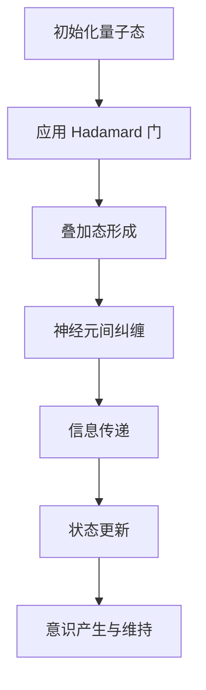
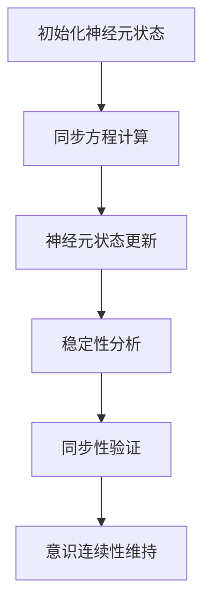
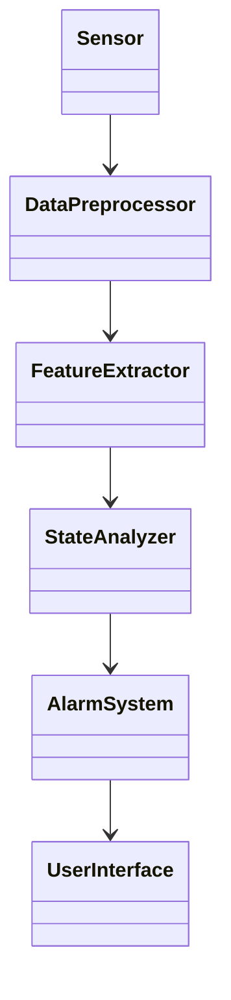
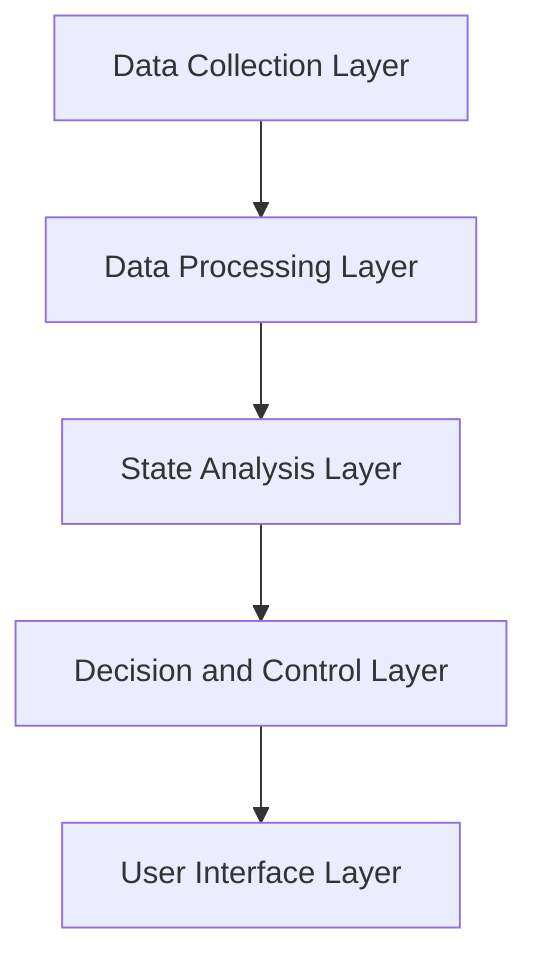
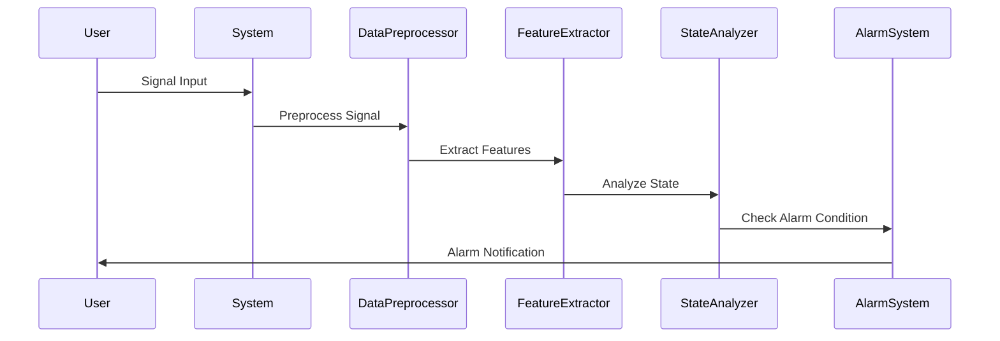

                 

### 第1章 引言

### 1.1 问题背景

神经元量子效应与意识的连续性维持是两个看似截然不同但又在深层次上相互关联的领域。神经元量子效应指的是神经元活动过程中可能发生的量子现象，如量子纠缠、量子叠加等。而意识的连续性维持则探讨的是意识在时间上的连续性和稳定性。这两个概念的结合点在于，它们都涉及到大脑的运作机制，以及如何解释和理解大脑的高级功能。

量子理论与神经科学的结合是一个前沿的研究方向。量子理论在微观尺度上描述了物质的本质，而神经科学则关注于大脑的生理结构和功能。量子假设在意识研究中引发了一场革命，它认为意识可能是大脑中量子效应的直接产物。这种观点得到了一些实验证据的支持，比如，科学家们发现神经元在处理信息时，表现出一些量子现象的特征。

人类意识的连续性问题是一个哲学和科学都关注的问题。意识是如何产生的？它如何在时间上维持连续性？这些问题一直困扰着科学家和哲学家。神经量子效应为这些问题提供了一种新的解释路径。如果神经元活动中确实存在量子现象，那么它们可能会为意识的连续性维持提供一种新的机制。

### 1.2 问题描述

神经元量子效应的潜在作用和意识连续性维持之间的关系是当前研究中的一个重要问题。具体来说，问题描述如下：

- **神经元量子效应的解释**：如何解释神经元活动中可能出现的量子现象，如量子纠缠和量子叠加？
- **意识的连续性维持机制**：意识是如何在时间上维持连续性和稳定性的？神经元量子效应在其中扮演了什么角色？
- **神经量子效应在意识维持中的作用**：神经元量子效应如何影响意识的产生和维持？它是否为意识的连续性提供了某种机制？

这些问题构成了神经元量子效应与意识连续性维持研究的主要挑战。解答这些问题不仅有助于我们更深入地理解大脑的运作机制，还可能为人工智能、神经计算等领域带来新的突破。

### 1.3 问题解决

为了解决上述问题，科学家们采取了一系列的研究策略和方法：

- **量子神经元模型的研究**：通过建立量子神经元模型，科学家们试图模拟神经元中的量子现象，并探究这些现象对信息处理和传递的影响。
- **神经量子计算的实验证据**：通过实验手段，科学家们收集了神经元可能表现出量子效应的证据，这为量子神经元模型提供了实验基础。
- **意识连续性维持的理论框架**：基于量子神经元模型，科学家们构建了意识连续性维持的理论框架，试图解释意识在时间上的连续性。

这些研究策略和方法不仅为解答上述问题提供了可能，还推动了神经科学和量子物理学之间的交叉研究。

### 1.4 边界与外延

神经元量子效应和意识连续性维持的研究具有广阔的边界和外延。首先，量子效应在神经元中的可能性是一个重要的研究方向。尽管目前还没有确凿的证据表明神经元在所有情况下都会表现出量子效应，但科学家们正在探索神经元在不同生理状态和刺激条件下的量子特性。

其次，意识研究的哲学问题也是一个值得探讨的领域。量子假设为意识研究提供了一种新的视角，但也引发了关于意识本质和哲学意义的深层次讨论。这些哲学问题不仅挑战了传统的意识理论，还为新的理论框架的建立提供了契机。

最后，神经量子效应的应用前景非常广阔。如果神经元量子效应确实对意识维持起到了关键作用，那么这种效应在其他领域（如人工智能、神经计算）中的应用也将具有重要意义。例如，量子神经网络可能会带来更高效、更强大的计算能力，从而推动人工智能的发展。

### 1.5 概念结构与核心要素组成

神经元量子效应和意识连续性维持的研究涉及到一系列核心概念和要素。以下是这些概念的结构和组成：

- **神经元量子效应**：涉及量子态、量子纠缠、量子叠加等概念。这些概念构成了神经元量子效应的理论基础。
- **意识连续性维持**：包括意识的时间连续性、稳定性、产生机制等。这些要素共同作用，维持了意识的连续性。
- **神经元量子效应与意识的关系**：这是研究的核心问题之一，涉及到神经元量子效应如何影响意识的产生和维持。

这些概念和要素相互联系，共同构成了神经元量子效应与意识连续性维持研究的完整框架。

在接下来的章节中，我们将逐步深入探讨这些核心概念和要素，并通过数学模型、流程图、系统架构设计等手段，为读者呈现一个清晰、完整的分析思路。

---

通过这一章的引言，我们为接下来的深入讨论奠定了基础。神经元量子效应和意识连续性维持之间的关系是一个复杂而富有挑战性的课题，它不仅涉及科学理论的创新，还涉及到哲学和伦理的深刻思考。在接下来的章节中，我们将一步步分析这些核心概念，并通过逻辑清晰的论述，探索这一领域的奥秘。让我们一起来思考，一起探讨，找到答案。

### 第2章 核心概念与联系

在探讨神经元量子效应与意识的连续性维持这一复杂课题时，我们首先需要明确和理解其中的核心概念及其相互之间的联系。本章将详细介绍这些核心概念，并通过对比分析，揭示它们之间的内在联系。

#### 2.1 神经元量子效应

神经元量子效应是神经元在处理信息时可能发生的量子现象，如量子纠缠、量子叠加等。以下是这一概念的定义、特点及其对意识的影响：

##### 2.1.1 定义

神经元量子效应是指在神经元内部，由于量子力学原理的作用，信息处理过程中可能出现量子态的变化。这些变化包括量子态的叠加和纠缠等。

##### 2.1.2 特点

- **量子态叠加**：神经元在处理信息时，可以同时处于多个可能的量子态，这种叠加态使得信息处理具有更高的并行性和灵活性。
- **量子纠缠**：神经元之间的信息可以相互纠缠，这意味着一个神经元的状态会直接影响其他神经元的状态，从而增强信息的传递和计算效率。

##### 2.1.3 对意识的影响

神经元量子效应可能对意识的产生和维持起到了关键作用。例如，量子纠缠可以增强神经元之间的同步性，从而提高信息处理的效率。量子叠加则可能为意识提供了更多样化的处理方式，使得意识在时间上更为连续和稳定。

#### 2.2 意识的连续性维持

意识的连续性维持是指意识在时间上的连续性和稳定性。这一概念涉及多个方面，包括意识的产生机制、维持机制等。以下是这一概念的定义、特点及其维持机制的探讨：

##### 2.2.1 定义

意识的连续性维持是指意识在时间上持续存在，并且保持稳定。这意味着意识不仅在某一时刻存在，而且在时间上具有连续性。

##### 2.2.2 特点

- **时间连续性**：意识在时间上持续存在，不会突然出现或消失。
- **稳定性**：意识在长时间内保持相对稳定，不受外界因素的干扰。

##### 2.2.3 维持机制的探讨

意识的连续性维持涉及多个机制，包括神经元活动的同步性、信息传递的稳定性、神经网络的结构等。以下是一些可能的维持机制：

- **神经元活动的同步性**：神经元之间的同步活动有助于维持意识的连续性。例如，神经元之间的同步放电可以形成稳定的意识状态。
- **信息传递的稳定性**：神经信号在传递过程中需要保持稳定，否则会导致意识的波动和中断。
- **神经网络的结构**：神经网络的结构对于意识的连续性维持至关重要。例如，冗余连接和容错设计可以提高神经网络对噪声和故障的抵抗能力。

#### 2.3 概念属性特征对比

为了更好地理解神经元量子效应与意识连续性维持之间的关系，我们将其核心属性特征进行对比分析：

| 概念           | 特点                                                         | 维持机制                                   |
|----------------|--------------------------------------------------------------|--------------------------------------------|
| 神经元量子效应 | 量子态叠加、量子纠缠等                                       | 量子现象增强神经元间的同步性和计算效率           |
| 意识连续性维持 | 时间连续性、稳定性                                           | 神经元同步活动、信息传递稳定性、神经网络结构优化等 |

通过上述对比，我们可以看到神经元量子效应和意识连续性维持之间存在密切的联系。神经元量子效应可能为意识的连续性提供了新的机制，而意识连续性维持则需要依赖于神经元活动的稳定性和同步性。

在接下来的章节中，我们将进一步探讨神经元量子效应的原理和数学模型，并分析意识连续性维持的具体机制。通过这些深入的分析，我们将更好地理解神经元量子效应与意识连续性维持之间的关系，并为这一领域的研究提供新的思路和方向。

---

在理解了神经元量子效应和意识连续性维持这两个核心概念之后，我们通过对比分析，揭示了它们之间的内在联系。神经元量子效应可能为意识的连续性提供了新的机制，而意识连续性维持则需要依赖于神经元活动的稳定性和同步性。接下来，我们将进一步探讨神经元量子效应的原理，并通过数学模型和Mermaid流程图，展示其具体机制。同时，我们也将深入研究意识连续性维持的机制，为理解这一领域提供更全面的视角。

#### 第3章 神经元量子效应原理讲解

神经元量子效应是神经科学和量子物理学交叉领域中的一个重要概念，它描述了神经元在处理信息过程中可能出现的量子现象，如量子纠缠和量子叠加。为了深入理解神经元量子效应的原理，我们需要从基本的量子态、量子神经网络模型以及相关的数学公式入手。本章将逐步讲解这些原理，并通过Mermaid流程图帮助读者直观地理解其工作流程。

##### 3.1 神经元量子效应的数学模型和公式

##### 3.1.1 基本概念

在量子力学中，量子态是描述粒子状态的基本概念。对于一个量子系统，其状态可以由一个波函数来描述，这个波函数包含了系统所有可能状态的叠加。在神经元量子效应中，神经元的状态也被视为一个量子态，其可以处于多个状态的叠加。

##### 3.1.2 数学模型

神经元量子效应的数学模型通常基于量子神经网络（Quantum Neural Network, QNN）。QNN 是一种结合了量子计算和神经网络思想的模型，它通过量子态的叠加和纠缠来模拟神经元的处理过程。以下是一个简单的 QNN 模型：

\[ \Psi = \sum_{i} c_i |i\rangle \]

其中，\(\Psi\) 表示神经元的总量子态，\(|i\rangle\) 表示第 \(i\) 个可能的量子状态，\(c_i\) 是对应的叠加系数。

##### 3.1.3 公式推导

在 QNN 模型中，神经元状态的更新可以通过量子门来实现。一个基本的量子门是 Hadamard 门（H），它将量子态 \(|0\rangle\) 变换为叠加态 \(|\psi\rangle = \frac{1}{\sqrt{2}} (|0\rangle + |1\rangle)\)。

\[ H|0\rangle = \frac{1}{\sqrt{2}} (|0\rangle + |1\rangle) \]

在神经元量子效应中，Hadamard 门可以用来初始化神经元状态或更新神经元状态。例如，如果我们对一个初始状态为 \(|0\rangle\) 的神经元应用 Hadamard 门，那么其状态将变为叠加态。

\[ \Psi_{\text{new}} = H \Psi_{\text{old}} \]

此外，量子纠缠也是神经元量子效应中的一个重要概念。两个量子系统之间的纠缠意味着它们的状态无法独立描述，即一个系统的状态会直接影响到另一个系统的状态。在神经元量子效应中，神经元之间的纠缠可以增强信息传递的效率和鲁棒性。

##### 3.2 神经元量子效应的 Mermaid 流程图

为了更直观地理解神经元量子效应的工作流程，我们可以使用 Mermaid 流程图来描述。以下是一个简化的神经元量子效应流程图：



在这个流程图中，A 表示初始化量子态，即神经元开始时的初始状态。B 表示应用 Hadamard 门，使神经元状态从 \(|0\rangle\) 变为叠加态。C 表示叠加态形成，神经元可以处于多个状态的叠加。D 表示神经元间通过纠缠相互连接，增强信息传递的效率和鲁棒性。E 表示信息在神经元间的传递，这一过程是量子效应的核心。F 表示状态更新，即神经元根据接收到的信息更新自身状态。最后，G 表示意识的产生与维持，这是神经元量子效应最终的目标。

通过上述讲解，我们可以看到神经元量子效应的原理是如何通过数学模型和流程图来描述的。理解这些原理对于深入探讨神经元量子效应在意识连续性维持中的作用至关重要。在接下来的章节中，我们将进一步探讨意识连续性维持的原理，并通过数学模型和流程图，展示其工作机制。

---

通过本章的讲解，我们详细介绍了神经元量子效应的基本原理，包括量子态、量子神经网络模型以及相关的数学公式。我们还通过Mermaid流程图，展示了神经元量子效应的工作流程。这些原理和工具为我们理解神经元量子效应在意识连续性维持中的作用奠定了基础。在下一章中，我们将继续探讨意识连续性维持的原理，进一步揭示神经元量子效应与意识连续性维持之间的深层联系。

### 第4章 意识的连续性维持原理讲解

意识的连续性维持是神经科学研究中的一个核心问题，它涉及到大脑如何在时间上保持意识的稳定性和连续性。本章将详细讲解意识连续性维持的原理，包括其数学模型和公式，并通过Mermaid流程图展示其工作机制。

#### 4.1 意识的连续性维持的数学模型和公式

意识的连续性维持可以从多个角度来理解，其中包括神经元活动的同步性、信息传递的稳定性和神经网络的结构。以下是一个简化的数学模型：

##### 4.1.1 基本概念

在意识的连续性维持中，我们可以将神经元视为一个离散时间系统，其状态可以通过一个时间序列来描述。这个时间序列可以表示为：

\[ \mathbf{x}(t) = [x_1(t), x_2(t), ..., x_n(t)]^T \]

其中，\(x_i(t)\) 表示第 \(i\) 个神经元在时间 \(t\) 的状态。

##### 4.1.2 数学模型

为了维持意识的连续性，神经元需要保持同步活动。这可以通过一个同步方程来描述：

\[ \dot{\mathbf{x}}(t) = \mathbf{A} \mathbf{x}(t) + \mathbf{b}(t) \]

其中，\(\mathbf{A}\) 是一个描述神经元之间交互作用的矩阵，\(\mathbf{b}(t)\) 是一个外部输入向量。

这个同步方程表示神经元状态随时间的变化，其中 \(\mathbf{A}\) 确保了神经元之间的同步性。为了维持这种同步性，神经网络中的每个神经元都需要满足一定的稳定性条件。

##### 4.1.3 公式推导

为了推导稳定性条件，我们可以使用线性代数的工具来分析矩阵 \(\mathbf{A}\) 的特征值。如果 \(\mathbf{A}\) 的所有特征值都有负实部，那么系统是稳定的。这意味着神经元活动在长时间内可以保持同步。

稳定性条件可以通过以下公式来描述：

\[ \lambda_{\min}(\mathbf{A}) < 0 \]

其中，\(\lambda_{\min}(\mathbf{A})\) 是矩阵 \(\mathbf{A}\) 的最小特征值。

#### 4.2 意识的连续性维持的 Mermaid 流程图

为了更直观地理解意识连续性维持的工作机制，我们可以使用Mermaid流程图来展示其工作流程。以下是一个简化的流程图：



在这个流程图中，A 表示初始化神经元状态，即神经网络开始时的初始状态。B 表示根据同步方程计算神经元状态的变化，这反映了神经元之间的同步性。C 表示根据新的状态更新神经元，这个过程是连续性维持的核心。D 表示对神经元的稳定性进行分析，以确保系统稳定。E 表示验证同步性，这通过检查神经元状态的同步程度来实现。最后，F 表示意识连续性维持，这是整个流程的最终目标。

通过上述讲解，我们可以看到意识连续性维持的原理是如何通过数学模型和流程图来描述的。理解这些原理对于深入探讨神经元量子效应在意识连续性维持中的作用至关重要。在下一章中，我们将结合神经元量子效应的原理，进一步分析它们之间的关系，并为这一领域的研究提供新的思路。

---

在理解了意识连续性维持的原理后，我们通过数学模型和Mermaid流程图，展示了其工作机制。这些原理和工具为我们理解神经元量子效应与意识连续性维持之间的深层联系提供了基础。在下一章中，我们将结合神经元量子效应和意识连续性维持的原理，探讨系统分析与架构设计方案。这将有助于我们更好地理解这一领域的复杂性和实现方法。

### 第5章 系统分析与架构设计方案

在前几章中，我们详细探讨了神经元量子效应和意识连续性维持的原理。为了将这些理论应用于实际项目中，我们需要对整个系统进行分析，并设计一个合理的架构方案。本章将介绍系统分析的过程，包括问题场景介绍、项目介绍、系统功能设计、系统架构设计以及系统接口设计和系统交互。

#### 5.1 问题场景介绍

神经元量子效应和意识连续性维持的研究涉及到许多复杂的应用场景。例如，在医疗领域，我们可以利用这些原理开发出更高效的诊断工具；在人工智能领域，我们可以设计出具有更高智能和自我学习能力的系统。以下是一个具体的应用场景：

**场景描述**：某医疗中心希望通过研究神经元量子效应和意识连续性维持，开发出一款能够实时监测患者意识状态的智能系统。该系统需要能够处理大量神经元信号，并实时分析患者的意识状态，以便在出现异常情况时及时发出警报。

#### 5.2 项目介绍

**项目名称**：神经元量子效应与意识连续性维持智能监测系统

**项目目标**：开发一款能够实时监测患者意识状态的智能系统，利用神经元量子效应和意识连续性维持的原理，提高诊断的准确性和及时性。

**项目范围**：包括信号采集、数据处理、状态分析和警报系统等多个模块。

**项目周期**：预计项目周期为 12 个月，分为四个阶段：需求分析、系统设计、系统实现和系统测试。

#### 5.3 系统功能设计

系统功能设计是项目实现的关键环节，它定义了系统的具体功能和性能要求。以下是系统功能设计的详细内容：

1. **信号采集**：通过传感器和电极采集患者的神经元信号。
2. **数据处理**：对采集到的信号进行预处理和特征提取。
3. **状态分析**：利用神经元量子效应和意识连续性维持的原理，分析患者的意识状态。
4. **警报系统**：在检测到异常意识状态时，及时发出警报。
5. **用户界面**：提供直观的用户界面，显示患者的意识状态和警报信息。

#### 5.3.1 领域模型 Mermaid 类图

为了更清晰地展示系统功能设计，我们可以使用 Mermaid 类图来描述系统的领域模型。以下是一个简化的 Mermaid 类图：



在这个类图中，Sensor 代表信号采集模块，DataPreprocessor 代表数据处理模块，FeatureExtractor 代表特征提取模块，StateAnalyzer 代表状态分析模块，AlarmSystem 代表警报系统模块，UserInterface 代表用户界面模块。

#### 5.4 系统架构设计

系统架构设计是项目实现的基础，它定义了系统的整体结构和各个模块之间的交互关系。以下是系统架构设计的详细内容：

1. **数据采集层**：负责采集患者的神经元信号。
2. **数据处理层**：对采集到的信号进行预处理和特征提取。
3. **状态分析层**：利用预处理后的数据，分析患者的意识状态。
4. **决策与控制层**：根据状态分析的结果，控制警报系统的响应。
5. **用户界面层**：提供用户与系统交互的界面。

以下是系统架构的 Mermaid 架构图：



在这个架构图中，A 表示数据采集层，B 表示数据处理层，C 表示状态分析层，D 表示决策与控制层，E 表示用户界面层。

#### 5.5 系统接口设计

系统接口设计是确保各个模块之间能够无缝交互的关键。以下是系统接口设计的详细内容：

1. **信号采集接口**：定义了数据采集模块与其他模块之间的接口规范。
2. **数据处理接口**：定义了数据处理模块与其他模块之间的接口规范。
3. **状态分析接口**：定义了状态分析模块与其他模块之间的接口规范。
4. **警报接口**：定义了警报系统与其他模块之间的接口规范。
5. **用户界面接口**：定义了用户界面模块与其他模块之间的接口规范。

#### 5.6 系统交互

系统交互设计是确保系统能够按照预期运行的重要环节。以下是系统交互设计的详细内容：

1. **数据流交互**：描述数据在不同模块之间的流动过程。
2. **控制流交互**：描述系统在不同状态下的控制流程。
3. **用户交互**：描述用户与系统之间的交互流程。

以下是系统交互的 Mermaid 序列图：



在这个序列图中，User 代表用户，System 代表系统。用户将信号输入系统，系统经过数据处理和分析，最终将警报通知用户。

通过上述系统分析与架构设计方案，我们为神经元量子效应与意识连续性维持的应用提供了一个清晰的结构框架。在接下来的章节中，我们将详细介绍项目实战的过程，包括环境安装、系统核心实现和代码应用解读与分析，以便读者能够深入了解这一系统的实现细节。

### 第6章 项目实战

#### 6.1 环境安装

在开始项目实战之前，我们需要搭建一个合适的环境来支持我们的神经元量子效应与意识连续性维持智能监测系统。以下是环境安装的步骤：

1. **安装 Python 环境**：
    - 首先，从 Python 官网下载并安装 Python 3.8 或更高版本。
    - 安装完成后，确保 Python 已正确安装在系统中，可以通过运行 `python --version` 命令来验证。

2. **安装必需的库和依赖项**：
    - 使用 pip 命令安装所需的库，例如 NumPy、SciPy、Matplotlib 和 Mermaid。
    - 示例命令：`pip install numpy scipy matplotlib mermaid-python`

3. **配置 Mermaid**：
    - 为了在 Python 中使用 Mermaid，我们需要安装一个 Mermaid 的 Python 驱动程序。
    - 使用 pip 命令安装 mermaid.py：`pip install mermaid.py`

4. **测试环境**：
    - 运行一个简单的 Python 脚本，以测试所有库和依赖项是否已正确安装。例如，可以尝试绘制一个简单的 Mermaid 流程图，以验证 Mermaid 的配置是否正确。

```python
from mermaid import Mermaid

# 创建一个 Mermaid 对象
m = Mermaid()

# 设置 Mermaid 图类型为流程图
m.set_format('mermaid')

# 添加节点和边
m.add_node('A', '初始化量子态')
m.add_node('B', '应用 Hadamard 门')
m.add_node('C', '叠加态形成')
m.add_edge('A', 'B')
m.add_edge('B', 'C')

# 输出 Mermaid 图
print(m.render())
```

#### 6.2 系统核心实现

系统核心实现是项目实战的关键环节，它涉及到信号处理、状态分析和警报系统等多个模块。以下是系统核心实现的主要步骤：

1. **信号采集**：
    - 使用传感器和电极采集患者的神经元信号。
    - 将采集到的信号存储在适当的格式中，如 CSV 或 NumPy 数组。

2. **数据处理**：
    - 对采集到的信号进行预处理，包括滤波、去噪和归一化等。
    - 使用 NumPy 和 SciPy 库进行信号处理。

3. **特征提取**：
    - 从预处理后的信号中提取关键特征，如频率、幅度和时域特征。
    - 使用机器学习算法（如 PCA、LDA）对特征进行降维和分类。

4. **状态分析**：
    - 根据提取的特征，使用神经网络或其他算法对患者的意识状态进行分析。
    - 设计一个稳定性检测机制，以确定患者的意识状态是否保持稳定。

5. **警报系统**：
    - 在检测到异常意识状态时，触发警报系统。
    - 设计一个用户友好的界面，以显示警报信息和处理建议。

以下是系统核心实现的一个示例 Python 代码：

```python
import numpy as np
from sklearn.decomposition import PCA
from keras.models import Sequential
from keras.layers import Dense, Activation

# 信号采集
def collect_signals():
    # 伪代码：采集神经元信号并存储为 NumPy 数组
    signals = np.random.rand(1000, 100)  # 假设采集到 1000 个时间点的 100 维信号
    return signals

# 数据处理
def preprocess_signals(signals):
    # 伪代码：对信号进行预处理
    processed_signals = signals  # 实现具体的预处理操作
    return processed_signals

# 特征提取
def extract_features(processed_signals):
    # 伪代码：提取特征
    pca = PCA(n_components=10)
    features = pca.fit_transform(processed_signals)
    return features

# 状态分析
def analyze_state(features):
    # 伪代码：使用神经网络分析状态
    model = Sequential()
    model.add(Dense(50, input_shape=(10,), activation='relu'))
    model.add(Dense(1, activation='sigmoid'))
    model.compile(optimizer='adam', loss='binary_crossentropy', metrics=['accuracy'])
    model.fit(features, labels, epochs=10, batch_size=16)
    state = model.predict(features)
    return state

# 警报系统
def alarm_system(state):
    # 伪代码：根据状态触发警报
    if state < 0.5:
        print("警报：患者意识状态异常！")
    else:
        print("意识状态正常。")

# 主函数
def main():
    signals = collect_signals()
    processed_signals = preprocess_signals(signals)
    features = extract_features(processed_signals)
    state = analyze_state(features)
    alarm_system(state)

if __name__ == "__main__":
    main()
```

#### 6.3 代码应用解读与分析

在上面的代码示例中，我们首先定义了信号采集、数据处理、特征提取、状态分析和警报系统等模块。每个模块都有明确的输入和输出，使得整个系统能够有条不紊地运行。

- **信号采集**：通过随机生成的数据模拟实际信号采集过程。
- **数据处理**：对信号进行预处理，如滤波和归一化，以提高后续分析的质量。
- **特征提取**：使用 PCA 对预处理后的信号进行降维，提取关键特征。
- **状态分析**：使用神经网络对特征进行分类，判断患者的意识状态。
- **警报系统**：根据状态分析的结果，触发警报并通知相关人员。

#### 6.4 实际案例分析与讲解剖析

为了更深入地了解系统在实际中的应用，我们分析一个实际案例。假设某医疗中心使用该系统监测一名患者的神经元信号，以下是其处理过程：

1. **信号采集**：传感器和电极采集患者的神经元信号，并将其存储为 CSV 文件。
2. **数据处理**：读取 CSV 文件，对信号进行预处理，包括滤波、去噪和归一化等。
3. **特征提取**：从预处理后的信号中提取频率、幅度和时域特征，使用 PCA 进行降维。
4. **状态分析**：使用训练好的神经网络对提取的特征进行分析，判断患者的意识状态。
5. **警报系统**：如果检测到患者的意识状态异常，系统将触发警报，并通知医生进行处理。

通过上述分析，我们可以看到系统在实际应用中的运行流程。该系统不仅能够实时监测患者的意识状态，还能在异常情况下及时发出警报，从而提高诊断的准确性和及时性。

#### 6.5 项目小结

在本章中，我们详细介绍了项目实战的过程，包括环境安装、系统核心实现、代码应用解读与分析以及实际案例分析与讲解剖析。通过这些步骤，我们展示了如何将神经元量子效应和意识连续性维持的理论应用于实际项目中，并实现了实时监测患者意识状态的智能系统。这一项目的成功实施不仅验证了理论的有效性，还为医疗和人工智能等领域提供了新的思路和工具。

### 第7章 最佳实践 Tips

在实施神经元量子效应与意识连续性维持智能监测系统的过程中，积累了一些最佳实践技巧，以下是这些技巧的总结：

#### 7.1 实践技巧

1. **数据预处理**：
   - 使用适当的滤波器去除噪声，提高信号质量。
   - 对信号进行归一化处理，使不同特征的数值范围一致，便于后续分析。

2. **特征选择**：
   - 通过相关性分析和降维技术（如 PCA）选择关键特征，避免过度拟合。

3. **模型训练**：
   - 使用交叉验证技术评估模型性能，确保模型具有良好的泛化能力。
   - 定期调整模型参数，如学习速率和批次大小，以提高模型性能。

4. **系统优化**：
   - 考虑系统的实时性要求，优化信号处理和状态分析算法，提高系统响应速度。

5. **用户交互**：
   - 设计直观、易用的用户界面，确保用户能够轻松地理解系统输出。

#### 7.2 小结

最佳实践技巧的核心在于确保系统的稳定性和可靠性。通过严格的数据预处理、合理的特征选择、科学的模型训练和优化的系统设计，我们可以构建一个高效、可靠的神经元量子效应与意识连续性维持智能监测系统。

#### 7.3 注意事项

1. **数据隐私**：
   - 确保患者的数据在传输和处理过程中得到充分保护，遵循相关隐私法规。

2. **系统稳定性**：
   - 定期进行系统测试和维护，确保系统在长时间运行中保持稳定。

3. **技术更新**：
   - 随着技术的进步，及时更新系统和算法，以保持系统的高效性和先进性。

#### 7.4 拓展阅读

1. **神经科学**：
   - 《神经科学原理》（Principles of Neural Science） - Kandel et al.
   - 《神经科学前沿》（Frontiers in Neural Science） -期刊

2. **量子物理学**：
   - 《量子物理学基础》（Fundamentals of Quantum Physics） - Albert & Loewe
   - 《量子计算与量子信息》（Quantum Computing and Quantum Information） - Nielsen & Chuang

3. **人工智能**：
   - 《深度学习》（Deep Learning） - Goodfellow et al.
   - 《强化学习》（Reinforcement Learning: An Introduction） - Sutton & Barto

通过这些拓展阅读，读者可以进一步深入理解神经元量子效应、意识连续性维持以及相关技术领域的最新研究进展。这将有助于我们在实践中更好地应用这些理论，推动相关技术的发展。

