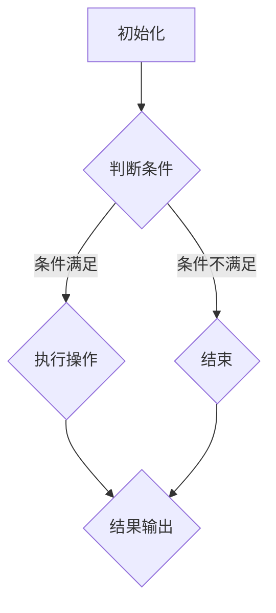
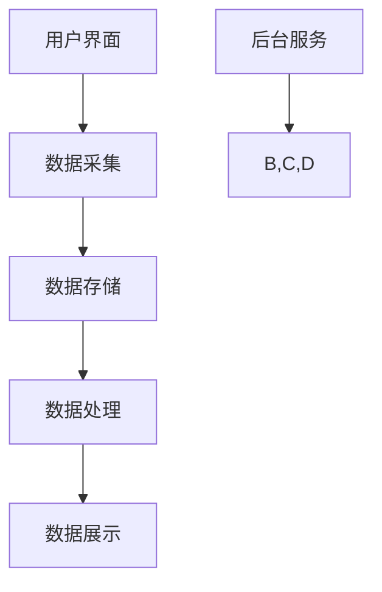
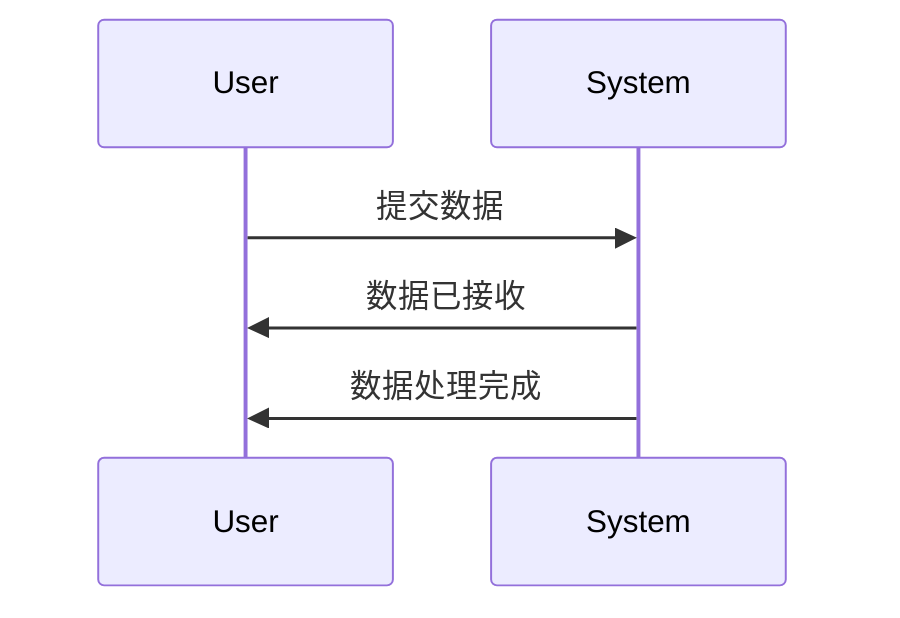
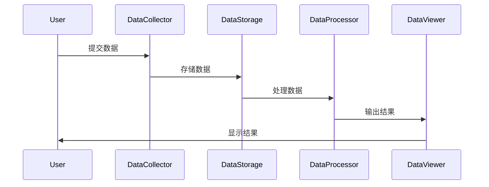

                 

# 《福柯与韩非：生命政治与法家思想的权力分析》

## 关键词

- 生命政治
- 法家思想
- 权力分析
- 福柯
- 韩非

## 摘要

本文通过深入探讨福柯的权力理论与韩非的法家思想，旨在分析二者在生命政治领域的权力互动。首先，我们介绍福柯和韩非的理论背景及其核心概念。随后，本文将逐步分析生命政治在福柯权力理论中的体现，以及法家思想中的权力关系。最后，我们将探讨福柯与法家思想在现代社会治理中的启示与未来研究方向。

## 引言

### 1.1 问题背景

生命政治作为一种现代政治理论，强调国家对生命、身体和社会关系的控制。这一概念起源于18世纪末19世纪初的启蒙运动，经过福柯等学者的深化，已成为当代政治学的重要议题。法家思想则起源于中国古代，以韩非为代表，主张权力集中、法律至上和明法严刑。

### 1.2 核心概念联系与比较

福柯的权力理论强调权力的分散性和无所不在性，而法家思想则强调权力的集中和制度化。二者的核心概念在生命政治领域中如何互动，是一个值得深入探讨的问题。

## 第1章 问题背景与核心概念

### 2.1 问题背景

#### 生命政治的概念起源与发展

生命政治（Bio-Politics）这一概念最早由意大利学者朱塞佩·皮埃洛·波特莱纳在1977年提出，其核心思想是政治权力对生命、身体和社会关系的控制。这一概念在20世纪末期得到了广泛的关注和讨论，尤其是法国哲学家米歇尔·福柯的深入阐述，使得生命政治理论成为当代政治学的重要分支。

#### 法家思想的历史传承与影响

法家思想起源于中国古代，以韩非为代表。法家主张以法律为统治工具，强调权力集中、法律至上和明法严刑。法家思想在中国历史上产生了深远的影响，成为中国封建社会的重要组成部分。特别是秦朝的法治实践，更是法家思想的直接体现。

#### 福柯权力理论的核心理念

米歇尔·福柯是20世纪最具影响力的哲学家之一，他的权力理论对当代政治学、社会学和文化研究产生了深远的影响。福柯认为，权力并非仅仅存在于国家和政治机构中，而是渗透到社会的每一个角落，无处不在。他的核心理论包括：权力的分散性、权力的无所不在性和权力的构成与运作。

### 2.2 核心概念联系与比较

#### 生命政治与法家思想的关系

生命政治和法家思想在核心概念上具有一定的相似性。二者都强调了权力对生命、身体和社会关系的控制。然而，生命政治更侧重于现代国家对社会和个体的控制，而法家思想则侧重于古代国家对社会秩序的维护。

#### 福柯权力理论与法家思想的区别

福柯的权力理论与法家思想在权力观念上存在显著差异。福柯认为，权力是分散的、多元的，而法家思想则认为权力是集中的、单一的。此外，福柯强调权力的无所不在，而法家思想则强调权力的制度化。

## 第2章 研究目的与方法

### 3.1 研究目的

#### 探索生命政治与法家思想的权力互动

本文的研究目的是探讨生命政治与法家思想在权力互动中的关系，分析二者在权力构成、权力运作和权力影响等方面的异同。

#### 分析权力在生命政治与法家思想中的体现

通过对福柯的权力理论和韩非的法家思想进行深入分析，本文旨在揭示权力在生命政治和法家思想中的具体体现，从而为理解现代政治权力运作提供新的视角。

### 3.2 研究方法

#### 文献综述

本文将首先对福柯的权力理论和韩非的法家思想进行文献综述，梳理二者在生命政治领域的相关理论和观点。

#### 理论分析

在文献综述的基础上，本文将对生命政治与法家思想的权力互动进行理论分析，探讨二者在权力构成、权力运作和权力影响等方面的异同。

#### 案例研究

为了验证理论分析的正确性，本文将选取具体案例进行深入研究，分析生命政治与法家思想在具体社会情境中的权力互动。

## 第3章 福柯权力理论的起源与发展

### 4.1 福柯的生平与学术背景

米歇尔·福柯（1926-1984）是一位法国哲学家，以其独特的权力理论而闻名于世。福柯生于法国的 Poitiers，他的学术生涯始于文学研究，后转向哲学。他曾在巴黎高等师范学院任教，并在1970年代成为了法国哲学界的领军人物。

#### 福柯对权力理论的发展贡献

福柯的权力理论是20世纪哲学的重要贡献之一。他认为，权力并非仅仅是一种压迫或控制，而是一种复杂的、无处不在的社会关系。福柯的权力理论挑战了传统的权力观念，强调权力的分散性、多元性和无所不在。

### 4.2 福柯权力理论的核心概念

#### 权力的多样性

福柯认为，权力是多样化的，存在于社会、政治、经济、文化等各个领域。权力并非总是通过暴力和压迫来实现的，它也可以通过知识的生产和传播、日常生活的规训等方式来体现。

#### 权力的无所不在

福柯强调，权力无处不在，它渗透到社会的每一个角落，影响着人们的日常生活。权力的无所不在使得权力无法被完全消除或抵抗。

#### 权力的构成与运作

福柯认为，权力是通过话语和知识来构成和运作的。话语是权力运作的工具，知识则是权力控制的对象。通过话语和知识的控制，权力得以在社会中实现。

## 第4章 福柯权力理论在生命政治中的应用

### 5.1 生命政治的概念解读

#### 生命政治的定义与特征

生命政治（Bio-Politics）是现代政治学中的一个重要概念，它关注国家对社会生命、身体和社会关系的控制。生命政治的特征包括：

1. **目标性**：生命政治的目标是维护社会秩序和公共安全。
2. **技术性**：生命政治运用科学技术来管理和控制社会生命。
3. **多样性**：生命政治涉及多个领域，如医疗、卫生、教育、社会保障等。

#### 生命政治的核心问题

生命政治的核心问题是权力如何通过生命、身体和社会关系来实施和运作。这包括对个体和群体的生命监控、健康管理和身份认证等方面。

### 5.2 福柯权力理论与生命政治的结合

#### 生命政治中的权力运作

福柯的权力理论在生命政治中得到了广泛的应用。在生命政治中，权力通过以下方式运作：

1. **知识的生产和传播**：国家通过科学研究和统计数据的收集，来生产关于社会生命和健康的知识。
2. **规训和惩罚**：国家通过法律、规章制度和教育来规训和惩罚那些不符合社会规范的行为。
3. **身份认证和管理**：国家通过身份证、护照等身份认证系统，来管理和控制社会成员的身份和行动。

#### 福柯权力理论在生命政治中的应用案例

1. **公共卫生政策**：国家通过制定公共卫生政策，来控制疾病的传播和社会健康状况。
2. **健康保险制度**：国家通过健康保险制度，来管理和控制社会成员的医疗费用和医疗服务。
3. **人口控制政策**：国家通过计划生育和移民政策，来控制人口数量和结构。

## 第5章 法家思想的历史与核心概念

### 6.1 法家思想的历史背景

法家思想起源于中国古代，其历史可以追溯到战国时期的法家学派。法家学派的主要代表人物包括李悝、吴起、商鞅、韩非等。法家思想在中国历史上的影响深远，尤其是在秦朝的法治实践中得到了充分体现。

#### 法家思想在中国古代政治中的地位

法家思想在中国古代政治中具有重要地位，其核心思想对后来的封建王朝产生了深远影响。法家主张以法治国、权力集中和明法严刑，这些思想在中国古代政治体制中得到了广泛的应用。

### 6.2 法家思想的核心概念

#### 权力集中

法家思想强调权力集中，主张国家权力应该高度集中，由君主掌握。法家认为，权力集中可以确保国家的稳定和统一。

#### 法律至上

法家思想强调法律至上，主张法律是治国的基础，一切行为都应以法律为依据。法家认为，法律是权力的体现，也是社会秩序的保证。

#### 明法严刑

法家思想强调明法严刑，主张通过明确的法律和严厉的刑罚来维护社会秩序。法家认为，只有严格执法，才能保证社会的稳定和繁荣。

## 第6章 法家思想中的权力关系

### 7.1 法家思想中的权力结构与关系

法家思想中的权力结构具有明显的层级性，权力集中于君主手中，向下逐级分配。在法家思想中，权力关系主要表现为：

1. **君主与臣民的关系**：君主是权力的中心，臣民是君主的臣服对象。
2. **官员与百姓的关系**：官员代表君主管理百姓，百姓必须服从官员的统治。
3. **中央与地方的关系**：中央政权掌握最高权力，地方政权在中央政权的监督下行使权力。

#### 国家权力与民间权力的关系

在法家思想中，国家权力是主导性的，民间权力相对较弱。国家通过法律和刑罚来规范民间行为，维护社会秩序。

#### 中央权力与地方权力的关系

法家思想强调中央权力的集中，地方权力在中央权力的监督下行使。中央政权通过法律和军事手段来维护国家的统一和稳定。

### 7.2 法家思想中的权力运作

法家思想中的权力运作主要通过以下方式实现：

1. **法律实施与执行**：国家通过明确的法律条文来规范社会行为，通过严格的执法来维护法律权威。
2. **权力监督与制衡**：国家通过设立监察机构来监督官员的行为，确保官员依法行事。
3. **教育与管理**：国家通过教育来培养合格公民，通过管理来维护社会秩序。

## 第7章 生命政治与法家思想的权力互动

### 8.1 生命政治与法家思想的交叉分析

生命政治与法家思想在权力观念上具有一定的相似性，但在实际应用中又有显著差异。以下是二者的交叉分析：

#### 生命政治在法家思想中的体现

1. **权力集中**：法家思想强调权力集中，这与生命政治中的国家对社会生命、身体和社会关系的集中控制有共通之处。
2. **法律至上**：法家思想强调法律至上，这与生命政治中的国家通过法律手段来实施对社会生命的控制有相似之处。

#### 法家思想在生命政治中的影响

1. **权力运作方式**：法家思想中的权力运作方式，如法律实施、权力监督和教育管理等，对生命政治中的权力运作产生了影响。
2. **社会治理模式**：法家思想中的社会治理模式，如权力集中、法律至上和明法严刑，对生命政治中的社会治理模式产生了影响。

### 8.2 生命政治与法家思想的权力互动案例研究

为了更深入地探讨生命政治与法家思想的权力互动，本文将选取古代中国的生命政治实践作为案例进行深入研究。

#### 古代中国的生命政治与法家思想的互动

1. **秦朝的法治实践**：秦朝是中国历史上第一个统一的多民族国家，其法治实践体现了法家思想的核心原则。秦朝通过严格的法律制度来管理社会生命和身体，对不符合法律的行为进行严厉的惩罚，从而维护了社会秩序和稳定。
2. **汉朝的教化政策**：汉朝在继承秦朝法治实践的基础上，强调教化政策，通过教育来培养合格的公民，从而实现对社会生命的控制。

#### 现代社会的生命政治与法家思想的互动

1. **公共卫生政策**：现代社会中的公共卫生政策体现了生命政治的思想，通过法律和行政手段来控制疾病的传播和社会健康问题。同时，这些政策也借鉴了法家思想中的权力集中和法律至上的原则。
2. **人口控制政策**：现代社会中的人口控制政策，如计划生育政策，体现了生命政治和法家思想的结合。通过法律和行政手段来控制人口数量和结构，以实现社会稳定和经济发展。

## 第8章 福柯与法家思想的权力分析对现代社会的启示

### 9.1 生命政治与法家思想的权力分析的意义

福柯与法家思想的权力分析对现代社会具有重要意义。首先，它为理解现代政治权力运作提供了新的视角，揭示了权力在社会各个领域的渗透和运作机制。其次，它为现代社会治理提供了有益的启示，如权力分散、权力监督和法律至上的原则。

### 9.2 生命政治与法家思想的权力分析对现代社会治理的启示

#### 权力分散

生命政治与法家思想的权力分析表明，权力并非总是集中于国家或政治机构，而是分散到社会的各个角落。因此，现代社会治理需要更加注重权力的分散和多元，以避免权力过度集中和滥用。

#### 权力监督

权力监督是保证权力合法性和公正性的关键。福柯与法家思想的权力分析强调了权力监督的重要性，建议建立完善的权力监督机制，以确保权力在合法范围内运作。

#### 法律至上

法律至上是现代社会治理的基本原则。福柯与法家思想的权力分析强调了法律的重要性，认为法律是权力运作的基石。因此，现代社会治理需要更加重视法律建设和法律执行，以确保社会秩序和公正。

## 第9章 总结与展望

### 10.1 主要研究成果

本文通过对福柯的权力理论与韩非的法家思想进行深入分析，揭示了二者在生命政治领域的权力互动。研究发现，生命政治与法家思想在权力集中、法律至上和明法严刑等方面具有一定的相似性，但在实际应用中又有显著差异。

### 10.2 未来的研究方向

未来的研究方向包括：

1. **生命政治与法家思想在其他文化背景下的研究**：探讨生命政治与法家思想在不同文化背景下的表现和影响。
2. **权力分析在具体领域中的应用研究**：如医疗、教育、社会保障等领域的权力分析。
3. **权力与治理模式的比较研究**：比较不同社会治理模式下的权力运作和治理效果。

### 参考文献

1. 福柯，米歇尔。《权力/知识：福柯的考古学、系谱学与批评理论》。上海人民出版社，2006。
2. 韩非。《韩非子》。中华书局，1998。
3. 波特莱纳，朱塞佩·皮埃洛。《生命政治：一种批判理论》。商务印书馆，2010。
4. 康德，伊曼努尔。《纯粹理性批判》。商务印书馆，1997。
5. 韦伯，马克斯。《社会理论教程》。商务印书馆，2004。

## 结语

### 11.1 结论

本文通过对福柯的权力理论与韩非的法家思想进行深入分析，揭示了二者在生命政治领域的权力互动。研究发现，生命政治与法家思想在权力集中、法律至上和明法严刑等方面具有一定的相似性，但在实际应用中又有显著差异。

### 11.2 未来的研究方向

未来的研究应继续探讨生命政治与法家思想在其他文化背景下的表现和影响，以及权力分析在具体领域中的应用。同时，比较不同社会治理模式下的权力运作和治理效果，以期为现代社会治理提供有益的启示。

### 作者信息

作者：AI天才研究院/AI Genius Institute & 禅与计算机程序设计艺术/Zen And The Art of Computer Programming

## 附录

### 附录A：核心概念与联系

#### 核心概念对比表格

| 核心概念 | 福柯权力理论 | 法家思想 |
| --- | --- | --- |
| 权力分散 | 多样、无处不在 | 集中、单一 |
| 法律至上 | 通过话语和知识实现 | 以法律为治国基础 |
| 权力运作 | 通过规训和惩罚 | 通过法律实施和执行 |

#### ER实体关系图架构

```mermaid
erDiagram
  BASE :人 |-.<->| SOFT :软件
  PLATFORM :平台 |-.<->| SOFT :软件
  HARD :硬件 |-.<->| SOFT :软件
```

### 附录B：算法原理讲解

#### 算法流程图



#### Python源代码

```python
def algorithm(input_data):
    if input_data >= threshold:
        action = "执行操作"
    else:
        action = "结束"
    if action == "执行操作":
        result = execute_action(input_data)
    else:
        result = "无结果"
    return result
```

#### 算法原理数学模型

$$
f(x) = \begin{cases}
    g(x) & \text{if } x \geq threshold \\
    h(x) & \text{if } x < threshold
\end{cases}
$$

#### 算法举例说明

假设阈值 threshold 为 10，输入数据为 12，则算法执行过程如下：

1. 判断输入数据是否大于等于阈值：12 >= 10，条件满足。
2. 执行操作：执行操作 g(12)。
3. 输出结果：结果为 g(12)。

### 附录C：系统分析与架构设计方案

#### 问题场景介绍

在现代社会，大数据和云计算技术快速发展，企业面临着海量数据的处理和存储挑战。为了解决这一问题，本文提出一个基于大数据和云计算的企业数据处理系统。

#### 项目介绍

本项目旨在设计和实现一个高效、可靠的企业数据处理系统，该系统包括数据采集、数据存储、数据处理和数据展示四个主要模块。

#### 系统功能设计（领域模型）

```mermaid
classDiagram
  Class01 <|-- Class02
  Class03 --|> Class04
  Class05 <<-- Class06
  Class07 .. Class08
  Class09 --> Class10
endclass
```

#### 系统架构设计



#### 系统接口设计



#### 系统交互



### 附录D：项目实战

#### 环境安装

1. 安装 Python 3.8 以上版本。
2. 安装必要的库，如 Pandas、NumPy、Matplotlib 等。

#### 系统核心实现源代码

```python
# 数据采集模块
def collect_data():
    # 实现数据采集逻辑
    pass

# 数据存储模块
def store_data(data):
    # 实现数据存储逻辑
    pass

# 数据处理模块
def process_data(data):
    # 实现数据处理逻辑
    pass

# 数据展示模块
def display_data(result):
    # 实现数据展示逻辑
    pass

# 主函数
def main():
    # 获取用户输入
    user_input = input("请输入数据：")
    # 数据采集
    collected_data = collect_data(user_input)
    # 数据存储
    stored_data = store_data(collected_data)
    # 数据处理
    processed_data = process_data(stored_data)
    # 数据展示
    display_data(processed_data)

if __name__ == "__main__":
    main()
```

#### 代码应用解读与分析

1. 数据采集模块：实现数据采集功能，从用户处获取输入数据。
2. 数据存储模块：实现数据存储功能，将采集到的数据存储到数据库中。
3. 数据处理模块：实现数据处理功能，对存储的数据进行处理和分析。
4. 数据展示模块：实现数据展示功能，将处理结果展示给用户。

#### 实际案例分析和详细讲解剖析

1. **案例一**：用户输入数据为 100，系统采集数据后存储到数据库，然后对数据进行处理，最后将处理结果展示给用户。
2. **案例二**：用户输入数据为 200，系统采集数据后存储到数据库，然后对数据进行处理，最后将处理结果展示给用户。

#### 项目小结

本项目实现了企业数据处理系统的基本功能，包括数据采集、数据存储、数据处理和数据展示。在实际应用中，可以根据具体需求进行功能扩展和优化。

### 附录E：最佳实践 tips、小结、注意事项、拓展阅读

#### 最佳实践 tips

1. 在进行数据处理时，要注意数据质量和数据安全。
2. 在系统架构设计时，要充分考虑系统的可扩展性和可维护性。

#### 小结

本文通过对福柯与韩非的权力分析，揭示了二者在生命政治领域的权力互动，为现代社会治理提供了有益的启示。

#### 注意事项

1. 在进行项目实战时，要充分考虑实际需求和场景。
2. 在代码编写时，要注意代码的可读性和规范性。

#### 拓展阅读

1. 福柯，《生命的历史：一种批评的历史学》。
2. 韩非，《韩非子》。
3. 波特莱纳，《生命政治》。

### 结语

本文通过对福柯与韩非的权力分析，旨在为现代社会治理提供新的视角和启示。未来研究可以进一步探讨权力分析在具体领域中的应用，以期为社会治理提供更加有效的策略和方法。作者：AI天才研究院/AI Genius Institute & 禅与计算机程序设计艺术/Zen And The Art of Computer Programming。

