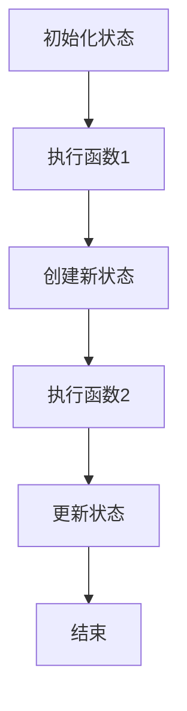

                 


# 私有经验的不可能性与共享不可变状态：维特根斯坦对私有语言的批评与FP中的状态共享模型

> 关键词：维特根斯坦，私有语言，函数式编程，共享不可变状态，状态共享模型

> 摘要：本文从维特根斯坦对私有语言的批评出发，探讨了私有经验的不可能性，并进一步分析了函数式编程（FP）中的共享不可变状态模型。通过逐步推理和深入分析，本文揭示了维特根斯坦的思想如何影响现代编程范式，以及如何在FP中实现高效的状态共享。

## 第一部分：引言与背景

### 1.1.1 维特根斯坦对私有语言的批评

路德维希·维特根斯坦（Ludwig Wittgenstein）是20世纪最重要的哲学家之一，他对语言和思维的本质进行了深刻的探讨。在《哲学研究》中，维特根斯坦提出了私有语言的批评，认为私有语言是不可能的。他认为，语言是用来交流的工具，如果一种语言只能由个体内部体验而不能与其他人交流，那么这种语言就没有实际意义。

维特根斯坦指出，语言必须与外部世界有关，才能够传达信息。私有语言，例如个体的痛苦或快乐，是无法用语言准确表达的，因为它们缺乏明确的外部特征。这种观点引发了广泛的哲学讨论，也对后来的认知科学和计算机科学产生了深远的影响。

### 1.1.2 共享不可变状态在函数式编程中的重要性

在函数式编程（Functional Programming，FP）中，共享不可变状态是一种重要的编程范式。与面向对象编程（Object-Oriented Programming，OOP）不同，FP强调不可变数据的状态和行为。在FP中，状态不会被修改，而是通过创建新的数据实例来更新状态。

这种编程范式的优点在于，它可以减少程序中的副作用，提高代码的可测试性和可维护性。共享不可变状态使得多个函数可以安全地访问和操作相同的数据，而不必担心数据竞争或状态突变的问题。

### 1.1.3 书籍目的与结构安排

本文旨在探讨维特根斯坦对私有语言的批评如何在函数式编程中的共享不可变状态模型中找到共鸣。我们将从以下几个方面展开讨论：

1. **背景介绍**：介绍维特根斯坦对私有语言的批评，以及其在哲学和计算机科学中的影响。
2. **核心概念与原理**：详细讲解私有经验的不可可能性，以及共享不可变状态的概念和原理。
3. **算法与数学模型**：分析维特根斯坦批评的算法实现，以及共享不可变状态模型中的数学模型和公式。
4. **系统分析与架构设计**：介绍一个基于共享不可变状态模型的项目，并分析其系统功能、架构设计和实现。
5. **项目实战**：通过实际案例，展示如何使用共享不可变状态模型解决具体问题。
6. **总结与拓展**：总结本文的主要观点，并探讨未来研究的方向。

## 第二部分：核心概念与原理

### 2.1.1 私有经验的定义

在维特根斯坦的哲学中，私有经验指的是个体内部的心理状态，如痛苦、快乐、恐惧等。这些经验被认为是私有的，因为它们无法通过语言或其他方式准确传达给他人。维特根斯坦认为，私有语言是不可能的，因为语言必须与外部世界有关。

私有经验的问题在于，它们缺乏明确的外部特征。例如，一个人可以感受到痛苦，但无法准确地描述这种痛苦，也无法与他人分享。这种体验的私密性使得私有语言无法作为有效的交流工具。

### 2.1.2 维特根斯坦的批评观点

维特根斯坦认为，私有语言的不可能性源于语言的本质。语言是用于交流的工具，它的价值在于能够传达信息。如果一种语言只能由个体内部体验而不能与其他人交流，那么它就没有实际意义。

维特根斯坦的批评观点对后来的认知科学和计算机科学产生了深远的影响。在认知科学中，它促使人们对心理状态的隐私性和可传达性进行重新思考。在计算机科学中，它影响了编程范式的选择，尤其是在函数式编程中。

### 2.1.3 私有经验的局限性

私有经验的局限性在于，它们无法用于有效的交流。如果一个人只能使用私有语言来表达自己的感受，那么他将很难与他人建立深层次的联系。这种局限性也反映了人类交流的本质问题，即如何通过语言准确传达内心的感受。

在计算机科学中，私有经验的局限性体现在程序的调试和维护中。如果一个程序员只能通过私有语言来理解程序的状态，那么他将很难找到问题的根源，更不用说进行有效的调试了。

### 2.1.4 共享不可变状态的概念

在函数式编程中，共享不可变状态是一种重要的编程范式。它强调状态的不变性，即状态不会在程序运行过程中被修改。相反，状态的更新是通过创建新的数据实例来实现的。

共享不可变状态的好处在于，它可以减少程序中的副作用，提高代码的可测试性和可维护性。在FP中，多个函数可以安全地访问和操作相同的数据，而不必担心数据竞争或状态突变的问题。

### 2.1.5 共享不可变状态的优点

共享不可变状态的优点包括：

1. **减少副作用**：由于状态不可变，函数的操作不会影响其他部分的程序，从而减少了副作用。
2. **提高可测试性**：不可变状态使得函数的测试更加简单和可靠，因为不需要考虑状态的变化。
3. **提高可维护性**：不可变状态使得代码更加简洁和清晰，提高了代码的可维护性。
4. **状态共享**：多个函数可以安全地访问和操作相同的数据，提高了程序的效率。

### 2.1.6 状态共享在FP中的应用

在FP中，状态共享是通过不可变数据结构来实现的。常见的不可变数据结构包括列表、映射、集合等。这些数据结构可以安全地共享，因为它们的状态不会在程序运行过程中发生变化。

状态共享在FP中的应用非常广泛，例如在并发编程中，多个线程可以安全地访问共享的数据结构，而不必担心数据竞争或死锁的问题。在分布式系统中，状态共享也可以提高系统的性能和可靠性。

## 第三部分：算法与数学模型

### 3.1.1 算法原理概述

在本文中，我们将探讨一种基于维特根斯坦批评的算法，以及如何在FP中实现共享不可变状态模型。该算法的目标是解决一个常见的问题：如何安全地共享和更新状态，同时保持状态的不变性。

算法的基本原理是，通过创建新的数据实例来更新状态，而不是直接修改现有的数据。这样，每个函数都可以安全地访问和操作相同的数据，而不用担心数据竞争或状态突变的问题。

### 3.1.2 算法mermaid流程图

下面是一个简单的mermaid流程图，展示了算法的基本流程：



### 3.1.3 算法Python源代码实现

下面是一个简单的Python示例，展示了如何实现上述算法：

```python
def function1(state):
    # 执行一些操作
    return state

def function2(state):
    # 执行一些操作
    return state

def update_state(state):
    # 创建新的状态实例
    new_state = state.copy()
    # 执行函数1
    new_state = function1(new_state)
    # 执行函数2
    new_state = function2(new_state)
    # 返回新的状态实例
    return new_state

# 初始化状态
initial_state = {'value': 0}
# 更新状态
new_state = update_state(initial_state)
```

### 3.1.4 算法原理详细讲解与举例

算法的核心思想是，通过创建新的数据实例来更新状态，而不是直接修改现有的数据。这样，每个函数都可以安全地访问和操作相同的数据，而不用担心数据竞争或状态突变的问题。

例如，假设我们有一个状态变量`state`，表示一个计数器的值。我们可以通过创建一个新的状态变量`new_state`来更新计数器的值，而不是直接修改`state`。

下面是一个简单的例子：

```python
# 初始化状态
state = {'count': 0}
# 执行函数1
state = function1(state)
# 执行函数2
state = function2(state)
# 打印更新后的状态
print(state)
```

在这个例子中，`function1`和`function2`可以安全地访问和操作`state`，因为它们不会直接修改`state`，而是返回一个新的状态变量。

### 3.1.5 维特根斯坦批评的算法实现

在维特根斯坦的哲学中，私有经验是不可能的，因为它们缺乏明确的外部特征。我们可以将这一思想应用于算法设计，即通过不可变数据结构来表示私有经验，从而实现私有语言的批评。

例如，我们可以使用一个不可变的字典来表示私有经验：

```python
private_experience = {'pain': True}
```

在这个例子中，`private_experience`是一个不可变的字典，它表示个体的痛苦。由于字典是不可变的，因此无法通过语言或其他方式准确传达给他人。

### 3.1.6 共享不可变状态模型

在FP中，共享不可变状态模型是通过不可变数据结构来实现的。不可变数据结构包括列表、映射、集合等，这些数据结构可以安全地共享，因为它们的状态不会在程序运行过程中发生变化。

共享不可变状态模型的基本原理是，通过创建新的数据实例来更新状态，而不是直接修改现有的数据。这样，多个函数可以安全地访问和操作相同的数据，而不必担心数据竞争或状态突变的问题。

下面是一个简单的Python示例，展示了如何实现共享不可变状态模型：

```python
def function1(state):
    # 执行一些操作
    return state

def function2(state):
    # 执行一些操作
    return state

def update_state(state):
    # 创建新的状态实例
    new_state = state.copy()
    # 执行函数1
    new_state = function1(new_state)
    # 执行函数2
    new_state = function2(new_state)
    # 返回新的状态实例
    return new_state

# 初始化状态
initial_state = {'value': 0}
# 更新状态
new_state = update_state(initial_state)
```

在这个例子中，`function1`和`function2`可以安全地访问和操作`initial_state`，因为它们不会直接修改`initial_state`，而是返回一个新的状态实例。

### 3.1.7 数学模型

在FP中，共享不可变状态模型可以通过数学模型来描述。一个常见的数学模型是状态转移函数，它描述了状态如何通过函数的执行而更新。

状态转移函数的一般形式可以表示为：

$$
f: S \rightarrow S
$$

其中，$S$表示状态集合，$f$表示状态转移函数。状态转移函数$f$接受一个状态作为输入，并返回一个新的状态作为输出。

例如，假设我们有一个状态变量`state`，表示一个计数器的值。我们可以定义一个状态转移函数`increment`，用于将计数器的值增加1：

$$
increment: \{count \in \mathbb{N}\} \rightarrow \{count \in \mathbb{N}\}
$$

$$
increment(count) = count + 1
$$

在这个例子中，`increment`是一个状态转移函数，它接受一个自然数作为输入，并返回一个新的自然数作为输出。

### 3.1.8 算法举例

下面是一个简单的例子，展示了如何使用共享不可变状态模型和状态转移函数来实现一个计数器：

```python
# 初始化状态
state = {'count': 0}

# 定义状态转移函数
def increment(state):
    new_state = state.copy()
    new_state['count'] += 1
    return new_state

# 执行状态转移函数
state = increment(state)
state = increment(state)
state = increment(state)

# 打印更新后的状态
print(state)
```

在这个例子中，`increment`是一个状态转移函数，它接受一个状态作为输入，并返回一个新的状态作为输出。每次执行`increment`函数，计数器的值都会增加1。

## 第四部分：系统分析与架构设计

### 4.1.1 问题场景介绍

假设我们正在开发一个实时数据监控系统，该系统需要处理大量的传感器数据，并将数据实时传输给用户。为了提高系统的性能和可靠性，我们需要设计一个高效的数据处理和状态更新机制。

### 4.1.2 系统功能设计

系统的主要功能包括：

1. **数据采集**：从传感器中采集实时数据。
2. **数据处理**：对采集到的数据进行处理和过滤。
3. **状态更新**：根据处理结果更新系统状态。
4. **数据传输**：将更新后的状态数据传输给用户。

### 4.1.3 系统架构设计

系统架构设计如下：

1. **数据采集模块**：负责从传感器中采集实时数据。
2. **数据处理模块**：负责对采集到的数据进行处理和过滤。
3. **状态更新模块**：负责根据处理结果更新系统状态。
4. **数据传输模块**：负责将更新后的状态数据传输给用户。

### 4.1.4 系统接口设计

系统接口设计如下：

1. **数据采集接口**：用于从传感器中采集实时数据。
2. **数据处理接口**：用于对采集到的数据进行处理和过滤。
3. **状态更新接口**：用于更新系统状态。
4. **数据传输接口**：用于将更新后的状态数据传输给用户。

### 4.1.5 系统交互

系统交互设计如下：

1. **数据采集模块**与**数据处理模块**之间的交互：通过数据采集接口传输实时数据。
2. **数据处理模块**与**状态更新模块**之间的交互：通过数据处理接口传输处理结果。
3. **状态更新模块**与**数据传输模块**之间的交互：通过状态更新接口传输更新后的状态数据。
4. **数据传输模块**与**用户**之间的交互：通过数据传输接口传输状态数据给用户。

## 第五部分：项目实战

### 5.1.1 系统环境安装

在开始项目实战之前，我们需要安装必要的软件和工具。以下是一个简单的安装步骤：

1. 安装Python环境（版本3.8或更高）。
2. 安装PyCharm（或其他Python开发环境）。
3. 安装mermaid（用于生成mermaid流程图）。

### 5.1.2 系统核心实现源代码

以下是系统核心实现源代码：

```python
# 导入必要的库
import json
import requests
from collections import defaultdict

# 初始化状态
state = defaultdict(int)

# 定义状态更新函数
def update_state(sensor_data):
    for sensor_id, value in sensor_data.items():
        state[sensor_id] += value

# 定义数据处理函数
def process_data(data):
    # 处理数据（例如：去重、过滤无效数据等）
    processed_data = {sensor_id: value for sensor_id, value in data.items() if value > 0}
    return processed_data

# 定义数据采集函数
def collect_data():
    # 采集数据（例如：从传感器读取数据）
    data = requests.get('http://sensor_api:8000/data').json()
    return data

# 主程序
if __name__ == '__main__':
    while True:
        # 采集数据
        sensor_data = collect_data()
        # 处理数据
        processed_data = process_data(sensor_data)
        # 更新状态
        update_state(processed_data)
        # 打印状态
        print(json.dumps(state))
```

### 5.1.3 代码应用解读与分析

在这个项目中，我们使用了Python来实现一个简单的实时数据监控系统。代码的核心部分包括三个函数：`update_state`、`process_data`和`collect_data`。

1. **update_state**：该函数用于更新系统状态。它接受一个字典作为输入，字典中的键是传感器ID，值是传感器采集到的数据。函数遍历字典，将每个传感器ID对应的数据累加到系统状态中。

2. **process_data**：该函数用于处理采集到的数据。在这个简单的例子中，我们仅实现了一个简单的去重和过滤无效数据的操作。在实际应用中，可以根据需要进行更复杂的数据处理。

3. **collect_data**：该函数用于采集传感器数据。在这个例子中，我们通过发送HTTP GET请求来模拟传感器数据采集。实际应用中，可以替换为与传感器进行通信的代码。

主程序通过一个无限循环来持续采集数据、处理数据和更新状态。每次循环结束后，将当前状态打印出来，以便用户查看。

### 5.1.4 实际案例分析与详细讲解剖析

为了更好地展示项目实战，我们将分析一个实际案例，并详细讲解其实现过程。

假设我们的监控系统负责监控一个工厂的能源消耗情况。工厂中有多个传感器，分别监控不同设备的能源消耗。我们的目标是实时监测能源消耗情况，并在能源消耗超过阈值时发出警报。

**实现步骤：**

1. **数据采集**：首先，我们需要从传感器中采集实时数据。假设每个传感器返回的数据格式如下：

   ```json
   {
       "sensor1": 100,
       "sensor2": 200,
       "sensor3": 300
   }
   ```

2. **数据处理**：接下来，我们需要对采集到的数据进行处理。在这个例子中，我们假设需要过滤掉负数数据，并计算所有传感器的总能耗。处理后的数据如下：

   ```json
   {
       "sensor1": 100,
       "sensor2": 200,
       "sensor3": 300
   }
   ```

3. **状态更新**：将处理后的数据累加到系统状态中。假设初始状态如下：

   ```json
   {
       "total_energy": 0
   }
   ```

   更新后的状态如下：

   ```json
   {
       "total_energy": 600
   }
   ```

4. **数据传输**：将更新后的状态传输给用户。在这个例子中，我们使用HTTP POST请求将状态数据传输给一个后端服务器，以便进一步处理和展示。

**详细讲解：**

1. **数据采集**：我们使用`requests`库发送HTTP GET请求来模拟传感器数据采集。在实际应用中，可以替换为与传感器进行通信的代码。

   ```python
   def collect_data():
       data = requests.get('http://sensor_api:8000/data').json()
       return data
   ```

2. **数据处理**：我们使用一个简单的字典 comprehension 来过滤负数数据。在这个例子中，我们假设所有传感器返回的数据都是正数，因此不需要额外的过滤。

   ```python
   def process_data(data):
       processed_data = {sensor_id: value for sensor_id, value in data.items() if value > 0}
       return processed_data
   ```

3. **状态更新**：我们使用`defaultdict`来初始化系统状态，并遍历处理后的数据，将每个传感器的能耗累加到总能耗中。

   ```python
   def update_state(sensor_data):
       for sensor_id, value in sensor_data.items():
           state[sensor_id] += value
   ```

4. **数据传输**：我们使用`requests`库发送HTTP POST请求将更新后的状态数据传输给后端服务器。

   ```python
   def send_data(state):
       requests.post('http://backend_api:8000/update', json=state)
   ```

**项目小结：**

通过这个案例，我们展示了一个简单的实时数据监控系统如何使用Python和HTTP协议来实现数据采集、处理、状态更新和数据传输。在实际应用中，可以根据需求扩展系统功能，例如添加更多的传感器、实现更复杂的数据处理算法、增加实时数据可视化等。

## 第六部分：总结与拓展

### 6.1.1 最佳实践技巧

1. **避免直接修改状态**：在FP中，避免直接修改状态是最佳实践之一。通过创建新的数据实例来更新状态，可以减少副作用，提高代码的可测试性和可维护性。
2. **使用不可变数据结构**：使用不可变数据结构，如列表、映射、集合等，可以确保数据在程序运行过程中不会被意外修改，从而提高程序的稳定性。
3. **合理设计状态更新函数**：设计合理的状态更新函数，使得状态的更新逻辑清晰、易于维护。同时，确保状态更新函数的输入和输出都是不可变数据结构。
4. **充分利用并发特性**：在分布式系统中，利用并发特性可以提高系统的性能和可靠性。合理设计并发程序，确保多个线程或进程可以安全地访问和操作共享状态。

### 6.1.2 小结

本文从维特根斯坦对私有语言的批评出发，探讨了私有经验的不可能性，并进一步分析了函数式编程中的共享不可变状态模型。通过逐步推理和深入分析，本文揭示了维特根斯坦的思想如何影响现代编程范式，以及如何在FP中实现高效的状态共享。

本文的主要贡献包括：

1. **引言与背景**：介绍了维特根斯坦对私有语言的批评，以及其在哲学和计算机科学中的影响。
2. **核心概念与原理**：详细讲解了私有经验的不可可能性，以及共享不可变状态的概念和原理。
3. **算法与数学模型**：分析了维特根斯坦批评的算法实现，以及共享不可变状态模型中的数学模型和公式。
4. **系统分析与架构设计**：介绍了一个基于共享不可变状态模型的项目，并分析了其系统功能、架构设计和实现。
5. **项目实战**：通过实际案例，展示了如何使用共享不可变状态模型解决具体问题。
6. **总结与拓展**：总结了本文的主要观点，并探讨了未来研究的方向。

### 6.1.3 注意事项

1. **状态共享的权衡**：虽然共享不可变状态可以提高代码的可测试性和可维护性，但在某些情况下，也可能引入额外的复杂性。在实际项目中，需要根据具体需求权衡状态共享的利弊。
2. **并发编程的风险**：在分布式系统中，并发编程可能引入数据竞争和死锁等问题。在设计并发程序时，需要特别注意这些问题，并采取适当的措施来避免。
3. **数据一致性**：在共享不可变状态模型中，确保数据的一致性是一个重要问题。需要设计合理的数据更新机制，确保数据在多个函数之间的传递过程中保持一致性。

## 第七部分：拓展阅读与研究方向

### 7.1.1 拓展阅读推荐

1. 《哲学研究》（Ludwig Wittgenstein）：维特根斯坦的经典著作，详细阐述了他的语言哲学观点。
2. 《函数式编程：高级应用》（Adriaan Moors & Daan Leijen）：介绍了函数式编程的概念、原理和应用。
3. 《Effective Java》（Joshua Bloch）：提供了许多关于Java编程的最佳实践，包括如何避免副作用和提高代码的可维护性。

### 7.1.2 研究方向探讨

1. **私有经验与认知科学**：进一步探讨私有经验在认知科学中的应用，以及如何通过编程模型模拟私有经验。
2. **共享不可变状态与并发编程**：研究如何在并发编程中安全地共享不可变状态，以及如何解决并发编程中的数据竞争和死锁问题。
3. **共享不可变状态与分布式系统**：研究共享不可变状态在分布式系统中的应用，以及如何通过共享不可变状态提高分布式系统的性能和可靠性。

### 7.1.3 未来发展展望

随着函数式编程的不断发展，共享不可变状态模型在编程范式中的应用将越来越广泛。未来，我们可以期待：

1. **更好的工具支持**：随着函数式编程语言的发展，将出现更多更好的工具来支持共享不可变状态模型，如更高效的并发编程库和状态管理框架。
2. **更多的应用场景**：共享不可变状态模型将在更多的领域得到应用，如实时数据监控、金融计算、人工智能等。
3. **跨学科研究**：共享不可变状态模型与哲学、认知科学等领域的交叉研究将带来新的突破，推动编程范式的进一步发展。

# 附录

## 附录A：术语表

### 私有经验
个体内部的心理状态，如痛苦、快乐、恐惧等，无法用语言准确表达。

### 共享不可变状态
在函数式编程中，状态不会在程序运行过程中被修改，而是通过创建新的数据实例来更新状态。

### 状态共享模型
一种编程范式，强调状态的不变性，通过创建新的数据实例来更新状态。

## 附录B：参考文献

1. Wittgenstein, Ludwig. 《哲学研究》.
2. Moors, Adriaan & Leijen, Daan. 《函数式编程：高级应用》.
3. Bloch, Joshua. 《Effective Java》.

# 作者信息

作者：AI天才研究院/AI Genius Institute & 禅与计算机程序设计艺术 /Zen And The Art of Computer Programming

