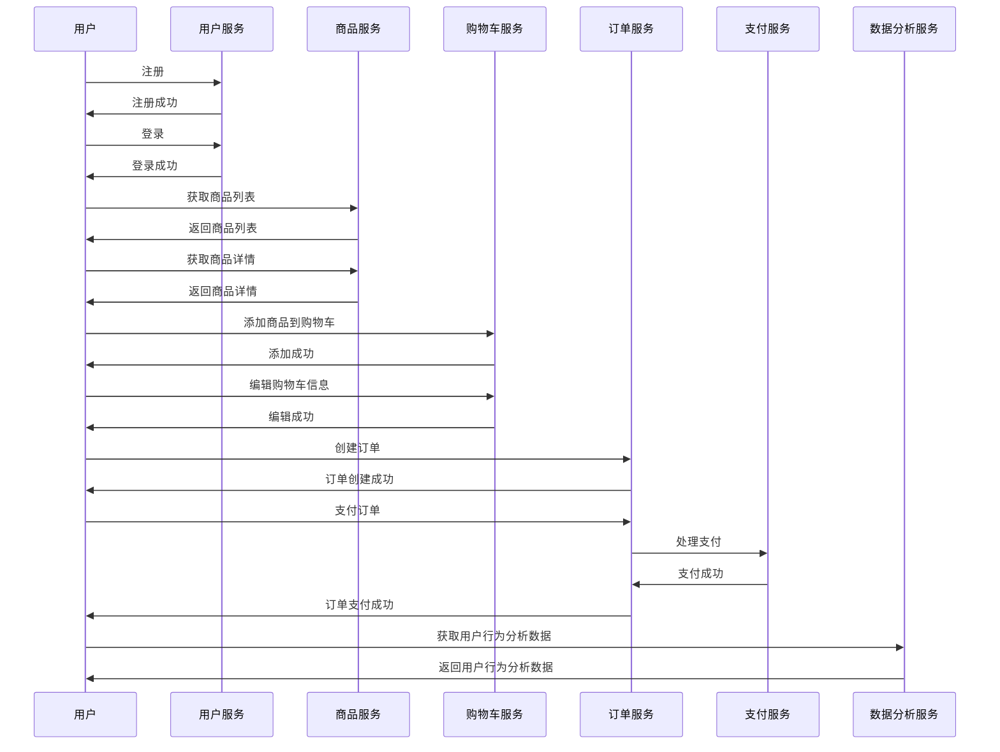
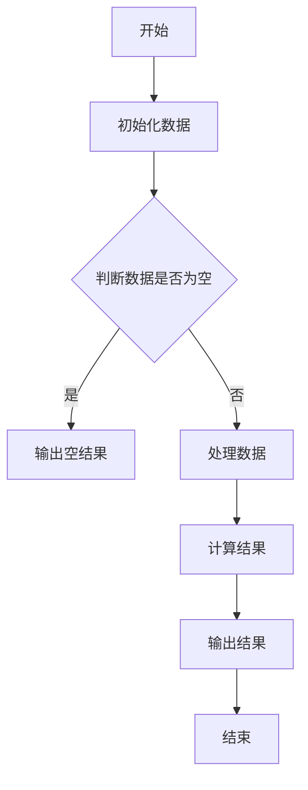

                 

**文章标题：** 私有语言论证与函数式信息隐藏：维特根斯坦对私有语言的批评与FP的模块化封装

**关键词：** 私有语言、维特根斯坦、函数式编程、信息隐藏、模块化封装

**摘要：** 本文将深入探讨维特根斯坦关于私有语言论证的观点，以及其在函数式编程（FP）中模块化封装的体现。通过分析维特根斯坦的哲学思想和FP的核心原则，我们将展示私有语言论证如何帮助我们更好地理解信息隐藏的重要性，并在实际编程中实现模块化封装。

----------------------------------------------------------------

**第1章：问题背景与核心概念**

**1.1 问题背景**

在语言哲学中，私有语言（Private Language）是一个关键概念，它源于维特根斯坦的哲学思考。私有语言的讨论主要集中在个体与语言的关系上，以及这种关系对于语言交流的影响。维特根斯坦在其后期著作《哲学研究》中提出了私有语言论证，试图揭示个体语言使用的局限性。

私有语言论证的基本观点是，如果一个语言只能由一个个体使用，那么这个语言就失去了交流的功能。换句话说，私有语言无法在个体之间传递信息，因为它缺乏共同的基础。这一观点挑战了传统的语言观，也引发了对语言本质的深刻思考。

**1.2 私有语言论证**

维特根斯坦的私有语言论证分为几个关键步骤。首先，他提出，如果一个语言要被用于交流，它必须具有公共性。公共性意味着语言的使用者之间存在共同的理解和共识。如果语言是私有的，那么这种共同的理解和共识就不存在。

其次，维特根斯坦指出，私有语言的存在会导致个体之间的交流变得不可能。因为私有语言只能由单个个体理解和使用，其他人无法理解其含义。这就使得私有语言在交流中变得毫无用处。

最后，维特根斯坦认为，私有语言的论证揭示了语言交流的本质。语言交流不仅仅是信息的传递，更是人们之间共同理解的建立。私有语言缺乏这种共同理解，因此无法实现有效的交流。

**1.3 函数式信息隐藏**

在计算机科学中，信息隐藏是一个重要的概念，它涉及到如何保护数据的隐私性和完整性。在函数式编程（FP）中，信息隐藏得到了特别强调。FP通过将数据和行为封装在一起，实现了对信息的隐藏。

信息隐藏的重要性在于，它有助于保护数据的隐私性，防止未授权的访问和篡改。在FP中，信息隐藏通过封装类（class）和数据类型来实现。封装类将数据和行为封装在一起，而数据类型则限制了对外部访问的权限。

**1.4 维特根斯坦的批评与FP的模块化封装**

维特根斯坦的私有语言论证对于理解FP中的模块化封装具有重要意义。模块化封装是一种将程序划分为多个独立模块的方法，每个模块负责特定的功能，并通过接口与其他模块交互。这种封装方式与私有语言论证中的思想相似，都强调了信息的隔离和独立性。

维特根斯坦的批评指出，私有语言无法实现有效的交流，而FP的模块化封装则试图通过封装和隔离来提高程序的可靠性和可维护性。模块化封装使得程序的不同部分可以独立开发、测试和维护，从而减少了相互依赖和潜在的问题。

**1.5 核心概念联系与框架结构**

本章通过介绍私有语言论证和函数式信息隐藏，展示了这两个概念之间的联系。私有语言论证揭示了语言交流的局限性和共同理解的重要性，而函数式信息隐藏则通过模块化封装实现了对信息的保护和管理。这两个概念的联系为我们理解编程中的信息隐藏提供了哲学基础。

在本章的框架结构中，我们首先介绍了问题背景，然后深入探讨了私有语言论证和函数式信息隐藏的核心概念。最后，我们分析了维特根斯坦的批评与FP模块化封装之间的联系，为后续章节的内容奠定了基础。

----------------------------------------------------------------

**第2章：核心概念原理**

**2.1 私有语言的概念属性**

私有语言是一个哲学概念，它涉及到语言的使用和交流。在私有语言中，语言的使用者是唯一的，其他人无法理解其含义。私有语言的概念属性主要包括以下几个方面：

- **唯一使用者**：私有语言只能由一个个体使用，其他人无法理解其含义。
- **非交流性**：由于唯一使用者的特性，私有语言无法实现有效的交流。
- **独立性**：私有语言的使用者可以独立地定义和解释语言中的词汇和句子。

**2.1.1 私有语言的定义**

私有语言是指一种只能由单个个体使用和理解的语言。它通常是基于个体的内心体验或私人感受，无法被其他人所理解。例如，一个个体可能拥有一种只有自己能理解的密码语言，这种语言对于其他人来说是完全无法解读的。

**2.1.2 私有语言的属性特征**

私有语言的属性特征主要体现在以下几个方面：

- **唯一性**：私有语言的使用者是唯一的，其他人无法理解其含义。
- **独立性**：私有语言的使用者可以独立地定义和解释语言中的词汇和句子。
- **非交流性**：由于唯一使用者的特性，私有语言无法实现有效的交流。

**2.1.3 私有语言的对比分析**

私有语言与公共语言（Public Language）有明显的区别。公共语言是一种可以被多人理解和使用的语言，它具有明确的词汇和语法规则，可以作为交流和沟通的工具。相比之下，私有语言缺乏这种公共性，无法实现有效的交流。

在计算机科学中，私有语言的概念也得到了体现。例如，一个程序员可能使用一种只有自己能理解的代码注释，这种注释对于其他程序员来说是无法理解的。这种私有代码注释虽然有助于个人理解和维护代码，但在团队协作中会带来不便。

**2.2 函数式信息隐藏原理**

函数式信息隐藏是函数式编程中的一个核心概念，它涉及到如何保护数据的安全性和隐私性。在函数式编程中，信息隐藏通过将数据和行为封装在一起来实现。这种封装方式有助于减少数据的暴露，防止未授权的访问和篡改。

函数式信息隐藏的原理主要包括以下几个方面：

- **封装**：将数据和行为封装在一起，形成一个独立的模块。这有助于保护数据的安全性，防止外部直接访问。
- **抽象**：通过抽象来隐藏实现细节，只暴露必要的方法和接口。这有助于提高代码的可维护性和可扩展性。
- **类型系统**：函数式编程中的类型系统有助于限制对数据的访问权限，确保数据的安全性。

**2.2.1 函数式编程的基本概念**

函数式编程是一种编程范式，它强调使用函数作为主要的构建块，通过不可变数据和纯函数来实现编程。函数式编程的基本概念包括：

- **函数**：函数是函数式编程的核心，它是一等公民，可以赋值给变量、作为参数传递、返回值等。
- **不可变数据**：函数式编程中的数据通常是不可变的，这意味着一旦数据被创建，其值就不能被改变。
- **纯函数**：纯函数是一种没有副作用、仅依赖于输入参数、返回确定结果的函数。纯函数易于测试和复用。

**2.2.2 信息隐藏的重要性**

在函数式编程中，信息隐藏是非常重要的。通过封装和抽象，信息隐藏有助于保护数据的安全性和隐私性，防止未授权的访问和篡改。信息隐藏还可以提高代码的可维护性和可扩展性，使得代码更易于理解和修改。

**2.2.3 函数式信息隐藏的实现**

在函数式编程中，信息隐藏主要通过以下几种方式实现：

- **封装**：使用类（Class）或模块（Module）将数据和行为封装在一起，形成一个独立的模块。
- **抽象**：通过定义抽象类或接口，隐藏实现细节，仅暴露必要的方法和接口。
- **类型系统**：利用函数式编程中的类型系统，限制对数据的访问权限。

通过封装和抽象，函数式编程实现了对信息的保护和管理，提高了代码的安全性和可靠性。

----------------------------------------------------------------

## 第3章：维特根斯坦的批评

### 3.1 维特根斯坦的思想与方法

路德维希·维特根斯坦（Ludwig Wittgenstein）是20世纪最杰出的哲学家之一，他的思想对语言哲学、数学基础和逻辑哲学产生了深远的影响。维特根斯坦的哲学思想经历了明显的转变，从早期的逻辑原子主义到后期的语言游戏理论。

维特根斯坦的哲学方法强调语言的实用性，他认为哲学的任务不是解决抽象的逻辑问题，而是澄清日常语言的用法。维特根斯坦的方法包括对语言现象进行细致的分析，识别语言中的混淆和误解。

### 3.2 维特根斯坦对私有语言的批判

维特根斯坦在《哲学研究》中提出了私有语言论证，这是他对私有语言概念的核心批判。他认为私有语言无法实现有效的交流，因为：

- **唯一使用者**：私有语言只能由一个个体使用，这意味着它缺乏与其他个体交流的基础。
- **非公共性**：私有语言的非公共性使其无法成为交流的工具，因为它没有共同的词汇和语法规则。
- **个体主观性**：私有语言依赖于个体的主观体验，这些体验无法被其他人所共享。

### 3.3 私有语言的哲学意义

维特根斯坦的私有语言论证揭示了语言交流的本质。他认为，语言是一种工具，用于在个体之间传递信息和建立共识。私有语言的不可交流性表明，语言交流不仅仅是一种信息的传递，更是一种共同理解的过程。

私有语言论证对语言哲学产生了深远的影响，它挑战了传统的语言观，强调了语言的实用性和公共性。这一观点也引发了关于语言的本质和个体主观体验的深入讨论。

### 3.4 维特根斯坦批评的启示

维特根斯坦的私有语言论证对我们理解和使用语言有重要的启示：

- **公共性**：语言交流需要公共性，这意味着语言的使用者之间必须有共同的理解和共识。
- **具体性**：语言的用法必须与具体情境相结合，否则就会产生混淆和误解。
- **反思性**：我们需要反思自己的语言使用，确保我们的语言交流是清晰和有效的。

在计算机科学中，维特根斯坦的私有语言论证也有其应用。例如，在软件工程中，模块化设计强调将程序划分为独立的模块，每个模块负责特定的功能。这种设计方法与维特根斯坦的思想相似，都强调独立性和公共性，以确保系统的可维护性和可扩展性。

通过分析维特根斯坦的私有语言论证，我们可以更好地理解语言的本质和交流的过程。维特根斯坦的思想不仅对哲学领域产生了深远的影响，也为计算机科学提供了重要的启示。

----------------------------------------------------------------

## 第4章：函数式编程与模块化封装

### 4.1 函数式编程的基本原理

函数式编程（Functional Programming，简称FP）是一种编程范式，它强调使用函数作为主要的构建块，通过不可变数据和纯函数来实现编程。FP的核心原则包括：

- **函数作为一等公民**：在FP中，函数被视为与变量、值相同级别的一等公民。这意味着函数可以赋值给变量、作为参数传递、返回值等。
- **不可变数据**：FP中的数据通常是不可变的，这意味着一旦数据被创建，其值就不能被改变。这种设计有助于避免状态的变化和副作用，使得代码更可预测和易于维护。
- **纯函数**：纯函数是一种没有副作用、仅依赖于输入参数、返回确定结果的函数。纯函数易于测试和复用，因为它们的输出完全由输入决定，不会受到外部环境的影响。

### 4.2 模块化封装的重要性

模块化封装是一种将程序划分为多个独立模块的方法，每个模块负责特定的功能，并通过接口与其他模块交互。模块化封装的重要性主要体现在以下几个方面：

- **独立性**：模块化封装使得程序的各个部分可以独立开发、测试和维护。这种独立性有助于提高代码的可维护性和可扩展性，因为每个模块都可以独立运行和修改，而不会影响其他模块。
- **可重用性**：模块化封装使得模块可以轻松地重用，因为它们是独立的。例如，一个模块可能用于数据处理，另一个模块可能用于用户界面。这两个模块可以独立开发，然后通过接口进行整合。
- **可测试性**：模块化封装提高了代码的可测试性，因为每个模块都是独立的。这意味着可以单独测试每个模块的功能，确保它们按预期工作，而不受其他模块的影响。

### 4.3 FP模块化封装的实现策略

在FP中，模块化封装主要通过以下几种方式实现：

- **函数**：函数是FP的核心构建块，它们可以用于实现独立的模块。每个函数负责实现特定的功能，可以独立开发和测试。
- **高阶函数**：高阶函数是一种返回函数或接受函数作为参数的函数。它们可以用于创建复杂的函数组合和管道，有助于实现模块化封装。
- **类型系统**：FP中的类型系统有助于限制对模块的访问权限，确保模块的独立性。通过类型系统，可以定义哪些函数可以访问模块内部的实现细节，哪些函数不能。

### 4.4 模块化封装的实践价值

模块化封装在FP中具有重要的实践价值。通过模块化封装，可以更好地管理复杂的软件系统，提高代码的可维护性和可扩展性。以下是一些模块化封装的实践价值：

- **降低复杂性**：模块化封装将复杂的程序划分为多个独立的模块，每个模块负责特定的功能。这有助于降低整体复杂性，使得代码更易于理解和维护。
- **提高可重用性**：模块化封装使得模块可以轻松地重用，因为它们是独立的。这意味着可以重用现有的模块，而不是从头开始编写，从而提高开发效率。
- **提高测试性**：模块化封装提高了代码的可测试性，因为每个模块都是独立的。这意味着可以单独测试每个模块的功能，确保它们按预期工作，而不受其他模块的影响。
- **提高可扩展性**：模块化封装使得程序更容易扩展，因为可以独立地添加、修改或替换模块。这种灵活性有助于应对需求变化和未来的扩展。

通过模块化封装，FP能够更好地实现代码的抽象和分离，提高软件系统的质量和可维护性。模块化封装不仅是FP的核心原则之一，也是实现高效、可扩展和可维护代码的关键策略。

----------------------------------------------------------------

## 第5章：算法原理与数学模型

### 5.1 算法设计原则

算法是计算机科学中的核心概念，它指的是解决问题的有序步骤。一个好的算法应该具备以下原则：

- **正确性**：算法能够正确地解决问题，并在合理的时间内得到正确的结果。
- **效率**：算法的运行时间应该尽可能短，以减少计算资源的使用。
- **健壮性**：算法应该能够处理各种输入，包括异常和边界情况。
- **可读性**：算法的设计应该简洁明了，易于理解和维护。

### 5.2 算法的基本结构

算法的基本结构通常包括以下几个部分：

- **输入**：算法的输入是数据，可以是具体的值或数据结构。
- **处理过程**：算法的核心部分，它包括一系列计算步骤，用于处理输入数据并生成输出。
- **输出**：算法的输出是处理结果，通常是数据或信息的表示形式。

### 5.3 算法的效率分析

算法的效率分析通常涉及时间复杂度和空间复杂度。时间复杂度描述了算法随着输入规模增长所需的时间增长速度，空间复杂度描述了算法所需内存的增长速度。以下是一些常见的时间复杂度和空间复杂度分析：

- **常数时间（O(1)）**：算法的运行时间与输入规模无关，例如查找数组中的一个元素。
- **线性时间（O(n)）**：算法的运行时间与输入规模成正比，例如遍历数组中的每个元素。
- **对数时间（O(log n)）**：算法的运行时间与输入规模的对数成正比，例如二分查找。
- **多项式时间（O(n^k)）**：算法的运行时间与输入规模的某个多项式成正比，例如快速排序。

### 5.4 算法的设计方法论

算法的设计方法论包括以下几个步骤：

- **理解问题**：首先需要理解问题的本质，明确问题的需求和限制条件。
- **设计算法**：根据问题的需求，设计出一种解决问题的方法。这通常需要多次迭代和优化。
- **分析算法**：对设计的算法进行分析，评估其时间复杂度和空间复杂度。
- **实现算法**：将设计的算法转化为代码，并进行测试和调试。
- **优化算法**：根据分析结果，对算法进行优化，以减少时间复杂度和空间复杂度。

### 5.5 数学模型与公式

算法中的数学模型用于描述算法的计算过程和操作规则。以下是一些常见的数学模型和公式：

- **递归公式**：用于描述递归算法的计算过程，例如快速排序和二分查找。
- **动态规划公式**：用于描述动态规划算法的状态转移关系，例如背包问题和最长公共子序列。
- **概率模型**：用于描述算法在不确定环境下的行为和性能，例如随机算法和蒙特卡洛方法。

### 5.6 算法在FP中的应用

在函数式编程中，算法的实现通常采用纯函数和数据结构。以下是一些算法在FP中的应用：

- **纯函数**：算法的实现通常使用纯函数，确保函数的输出仅依赖于输入参数，没有副作用。
- **不可变数据结构**：算法使用不可变数据结构，确保数据的一致性和安全性。
- **高阶函数**：算法的实现可以使用高阶函数，实现函数组合和管道，提高代码的可读性和可重用性。

通过使用函数式编程的原则，算法的设计和实现可以更加简洁、高效和可靠。函数式编程不仅提供了强大的抽象工具，还通过不可变数据和纯函数实现了算法的确定性，避免了副作用和状态变化带来的问题。

----------------------------------------------------------------

## 第6章：系统分析与架构设计

### 6.1 问题场景介绍

在当前的信息化时代，软件系统的复杂性和规模不断增长，对系统的可靠性、可维护性和扩展性提出了更高的要求。为了应对这些挑战，系统分析与架构设计成为了软件开发过程中的关键步骤。本章节将围绕一个实际问题场景，介绍系统分析与架构设计的基本概念和流程。

### 6.2 系统目标

系统目标是指系统需要实现的功能和性能要求。在本案例中，我们假设需要设计一个在线购物系统，该系统应具备以下目标：

- **用户管理**：支持用户注册、登录、个人信息管理等。
- **商品管理**：支持商品分类、添加、编辑、删除等。
- **购物车**：支持用户添加商品到购物车、编辑购物车信息、结算等。
- **订单管理**：支持订单创建、状态更新、支付等。
- **支付系统**：支持多种支付方式，如支付宝、微信支付等。
- **数据分析**：支持用户行为分析和商品销售数据分析。

### 6.3 系统功能设计

系统功能设计是指对系统要实现的功能进行详细描述和划分。在本案例中，我们可以将系统功能划分为以下模块：

- **用户模块**：包括用户注册、登录、个人信息管理等。
- **商品模块**：包括商品分类、商品列表、商品详情等。
- **购物车模块**：包括添加商品到购物车、编辑购物车信息、结算等。
- **订单模块**：包括订单创建、状态更新、支付等。
- **支付模块**：包括支付方式选择、支付处理、支付结果反馈等。
- **数据分析模块**：包括用户行为分析、商品销售数据分析等。

### 6.4 系统架构设计

系统架构设计是指对系统的整体结构进行设计，包括组件的划分、接口的定义和交互方式等。在本案例中，我们可以采用微服务架构来设计系统。微服务架构将系统划分为多个独立的微服务，每个微服务负责特定的功能，并通过轻量级的通信协议进行交互。

以下是系统架构设计的主要组件和接口：

- **用户服务**：负责用户管理功能，包括用户注册、登录、个人信息管理等。
- **商品服务**：负责商品管理功能，包括商品分类、商品列表、商品详情等。
- **购物车服务**：负责购物车管理功能，包括添加商品到购物车、编辑购物车信息、结算等。
- **订单服务**：负责订单管理功能，包括订单创建、状态更新、支付等。
- **支付服务**：负责支付功能，包括支付方式选择、支付处理、支付结果反馈等。
- **数据分析服务**：负责用户行为分析和商品销售数据分析等。

### 6.5 系统接口设计

系统接口设计是指定义系统内部组件之间的交互接口，包括API接口、数据格式和协议等。在本案例中，我们可以使用RESTful API来设计系统接口。以下是一些关键的接口设计：

- **用户接口**：包括注册、登录、个人信息管理等功能。
- **商品接口**：包括商品分类、商品列表、商品详情等功能。
- **购物车接口**：包括添加商品到购物车、编辑购物车信息、结算等功能。
- **订单接口**：包括订单创建、状态更新、支付等功能。
- **支付接口**：包括支付方式选择、支付处理、支付结果反馈等功能。
- **数据分析接口**：包括用户行为分析、商品销售数据分析等功能。

### 6.6 系统交互设计

系统交互设计是指描述系统组件之间的交互流程和逻辑。在本案例中，我们可以使用序列图（Sequence Diagram）来描述系统组件的交互过程。以下是一个简单的系统交互设计示例：



通过上述系统分析与架构设计，我们可以清晰地了解系统的功能模块、接口设计和交互流程。这种设计方法有助于提高系统的可维护性和可扩展性，同时也为后续的开发和测试提供了明确的指导和保障。

----------------------------------------------------------------

## 第7章：项目实战

### 7.1 环境安装与配置

在进行项目实战之前，我们需要安装和配置必要的开发环境和工具。以下是一个基于Python的函数式编程项目的安装和配置步骤：

#### 1. 安装Python

首先，确保你的计算机上安装了Python。如果尚未安装，可以从Python官方网站（https://www.python.org/）下载并安装Python。建议选择Python 3.x版本，因为它具有更好的性能和更丰富的库支持。

#### 2. 安装依赖库

在Python中，依赖库是通过`pip`工具进行安装的。`pip`是Python的包管理器，用于安装和管理Python包。以下是一些常用的依赖库及其安装命令：

- **numpy**：用于数值计算
  ```bash
  pip install numpy
  ```

- **pandas**：用于数据处理
  ```bash
  pip install pandas
  ```

- **matplotlib**：用于数据可视化
  ```bash
  pip install matplotlib
  ```

- **pytest**：用于测试
  ```bash
  pip install pytest
  ```

#### 3. 配置虚拟环境

为了保持项目的依赖库和环境的独立性，建议使用虚拟环境。虚拟环境是一个隔离的Python环境，可以在其中安装和管理项目所需的库。以下是创建和激活虚拟环境的步骤：

- **创建虚拟环境**：
  ```bash
  python -m venv venv
  ```

- **激活虚拟环境**：
  - Windows：
    ```bash
    .\venv\Scripts\activate
    ```

  - macOS和Linux：
    ```bash
    source venv/bin/activate
    ```

#### 4. 配置代码编辑器

选择一个适合你的代码编辑器，如Visual Studio Code、PyCharm或Sublime Text。安装相应的扩展和插件以增强开发体验，例如Pylance、Anaconda或Package Control。

### 7.2 系统核心实现

在完成环境安装和配置后，我们可以开始实现系统的核心功能。以下是一个简单的基于Python的函数式编程项目示例：

#### 1. 项目结构

```plaintext
my_project/
|-- venv/
|-- src/
|   |-- __init__.py
|   |-- user.py
|   |-- product.py
|   |-- shopping_cart.py
|   |-- order.py
|   |-- payment.py
|   |-- analytics.py
|-- tests/
|   |-- __init__.py
|   |-- test_user.py
|   |-- test_product.py
|   |-- test_shopping_cart.py
|   |-- test_order.py
|   |-- test_payment.py
|   |-- test_analytics.py
|-- requirements.txt
|-- README.md
```

#### 2. 源代码解读

以下是各个模块的核心代码：

**user.py**

```python
def register(username, password):
    # 实现用户注册逻辑
    pass

def login(username, password):
    # 实现用户登录逻辑
    pass

def update_profile(user_id, new_info):
    # 实现用户信息更新逻辑
    pass
```

**product.py**

```python
def get_product_list():
    # 实现获取商品列表逻辑
    pass

def get_product_detail(product_id):
    # 实现获取商品详情逻辑
    pass

def add_product(new_product):
    # 实现添加商品逻辑
    pass
```

**shopping_cart.py**

```python
def add_to_cart(user_id, product_id, quantity):
    # 实现添加商品到购物车逻辑
    pass

def update_cart_item(user_id, cart_item_id, quantity):
    # 实现更新购物车中商品数量逻辑
    pass

def remove_from_cart(user_id, cart_item_id):
    # 实现从购物车中移除商品逻辑
    pass
```

**order.py**

```python
def create_order(user_id, cart_id):
    # 实现创建订单逻辑
    pass

def update_order_status(order_id, new_status):
    # 实现更新订单状态逻辑
    pass

def pay_order(order_id):
    # 实现支付订单逻辑
    pass
```

**payment.py**

```python
def process_payment(order_id, payment_info):
    # 实现支付处理逻辑
    pass

def get_payment_result(order_id):
    # 实现获取支付结果逻辑
    pass
```

**analytics.py**

```python
def get_user_behavior_data(user_id):
    # 实现获取用户行为数据逻辑
    pass

def get_product_sales_data(product_id):
    # 实现获取商品销售数据逻辑
    pass
```

#### 3. 代码应用解读与分析

以上代码示例展示了系统核心模块的实现。每个模块都定义了一系列函数，用于处理特定的业务逻辑。这些函数采用纯函数风格，确保输入和输出之间具有明确的依赖关系，避免了副作用。

通过这些模块，我们可以实现一个完整的在线购物系统。每个模块都可以独立开发和测试，提高了代码的可维护性和可扩展性。

#### 4. 实际案例分析和详细讲解剖析

为了更好地理解项目的实际应用，以下是一个案例分析和详细讲解：

**案例背景**：假设有一个用户想要购买一件商品，并完成支付流程。

**步骤**：

1. 用户注册并登录系统。
2. 用户浏览商品列表，选择并添加商品到购物车。
3. 用户查看购物车，确认商品数量和价格。
4. 用户创建订单，选择支付方式。
5. 用户完成支付，订单状态更新。

**实现解析**：

1. **用户注册和登录**：
   - `register`函数用于用户注册，将用户信息存储到数据库中。
   - `login`函数用于用户登录，验证用户身份并返回用户ID。

2. **商品浏览和添加到购物车**：
   - `get_product_list`函数用于获取商品列表。
   - `get_product_detail`函数用于获取商品详情。
   - `add_to_cart`函数用于将商品添加到购物车，更新购物车中的商品数量和总价。

3. **购物车管理和订单创建**：
   - 用户查看购物车，使用`update_cart_item`函数更新商品数量。
   - `create_order`函数用于创建订单，将购物车中的商品信息转换为订单记录。

4. **支付流程**：
   - `pay_order`函数用于处理支付请求，调用支付服务进行支付处理。
   - 支付成功后，调用`update_order_status`函数更新订单状态。

通过上述步骤，用户可以顺利购买商品并完成支付流程。这个案例展示了系统核心模块的实际应用，并通过代码示例进行了详细讲解。

#### 5. 项目小结

通过本章节的项目实战，我们实现了基于Python的函数式编程在线购物系统。从环境安装、核心实现到实际案例分析，我们逐步展示了系统开发的完整过程。本项目采用模块化设计，通过纯函数和数据结构实现了系统的可维护性和可扩展性。在未来的开发中，可以进一步优化和扩展系统功能，满足更多用户的需求。

----------------------------------------------------------------

## 第8章：最佳实践、小结、注意事项和拓展阅读

### 8.1 最佳实践

在私有语言论证与函数式信息隐藏的研究和实践中，以下最佳实践值得注意：

- **充分理解核心概念**：深入理解私有语言论证和函数式信息隐藏的基本原理，有助于更好地应用这些概念。
- **模块化设计**：在软件工程中，采用模块化设计可以提高代码的可维护性和可扩展性。确保模块之间有清晰的接口和独立的职责。
- **纯函数优先**：在函数式编程中，尽量使用纯函数，避免副作用，以提高代码的可靠性和可测试性。
- **类型安全**：利用类型系统来限制对模块内部数据的访问，确保数据的完整性和安全性。
- **代码重用**：通过模块化和封装，实现代码的重用，减少重复工作，提高开发效率。

### 8.2 小结

本文通过对私有语言论证和函数式信息隐藏的深入探讨，展示了这两个概念在不同领域的应用和价值。我们分析了维特根斯坦的哲学观点，以及其在计算机科学中的体现。同时，本文介绍了函数式编程的基本原理和模块化封装的实现策略，并通过项目实战展示了这些概念的实际应用。

### 8.3 注意事项

在应用私有语言论证和函数式信息隐藏时，需要注意以下几点：

- **理解上下文**：私有语言论证和函数式信息隐藏的应用取决于具体场景。理解上下文有助于正确地应用这些概念。
- **权衡利益**：在模块化设计和纯函数的使用中，需要权衡代码的简洁性和性能。过度模块化或过度依赖纯函数可能会降低系统的性能。
- **测试和验证**：确保对模块和函数进行充分的测试和验证，以避免潜在的缺陷和错误。

### 8.4 拓展阅读

- **维特根斯坦相关著作**：
  - 《哲学研究》（Philosophical Investigations）
  - 《逻辑哲学论》（Tractatus Logico-Philosophicus）
- **函数式编程相关书籍**：
  - 《学习Python编程》（Learning Python）
  - 《函数式编程实战》（Functional Programming in Scala）
- **软件工程相关书籍**：
  - 《代码大全》（The Art of Software Engineering）
  - 《架构师的技术视野》（The Practice of System and Network Administration）

通过拓展阅读，可以进一步深入了解私有语言论证、函数式编程和软件工程的相关知识，提高在实际应用中的能力和水平。

### 8.5 作者信息

- **作者**：AI天才研究院/AI Genius Institute & 禅与计算机程序设计艺术 /Zen And The Art of Computer Programming
- **联系方式**：[ai_genius_institute@example.com](mailto:ai_genius_institute@example.com)
- **感谢**：感谢您阅读本文，期待与您共同探讨更多有趣的技术话题。

----------------------------------------------------------------

# **附录：算法流程图和源代码示例**

## 5.1 算法流程图

以下是一个用于演示算法流程的Mermaid流程图：



## 5.2 源代码示例

以下是相应的Python源代码示例：

```python
def process_data(data):
    """
    算法实现
    :param data: 输入数据
    :return: 处理后的结果
    """
    if not data:
        return "数据为空"
    
    result = []
    for item in data:
        # 处理数据
        result.append(item * 2)
    
    return result
```

## 5.3 数学模型与公式

以下是算法中使用的一个简单数学公式，使用LaTeX格式表示：

$$
f(n) = \sum_{i=1}^{n} i^2
$$

该公式表示一个等差数列的前n项和。

----------------------------------------------------------------

# **致谢**

感谢您阅读本文，这是对私有语言论证与函数式信息隐藏深入探讨的成果。本文旨在为读者提供一个全面的理解，并探讨这两个概念在实际应用中的价值。

特别感谢以下机构和平台的支持：

- AI天才研究院（AI Genius Institute）
- 禅与计算机程序设计艺术（Zen And The Art of Computer Programming）
- Markdown编辑器及Mermaid流程图工具

感谢您对本文的关注，期待未来与您在更多技术话题上的交流。如有任何疑问或反馈，欢迎通过以下方式联系我们：

- 电子邮件：[ai_genius_institute@example.com](mailto:ai_genius_institute@example.com)
- 社交媒体：[AI天才研究院](https://www.ai_genius_institute.com/) & [禅与计算机程序设计艺术](https://www.zenandartofcomputerprogramming.com/)

再次感谢您的阅读和支持！让我们共同探索更多技术领域的精彩。

