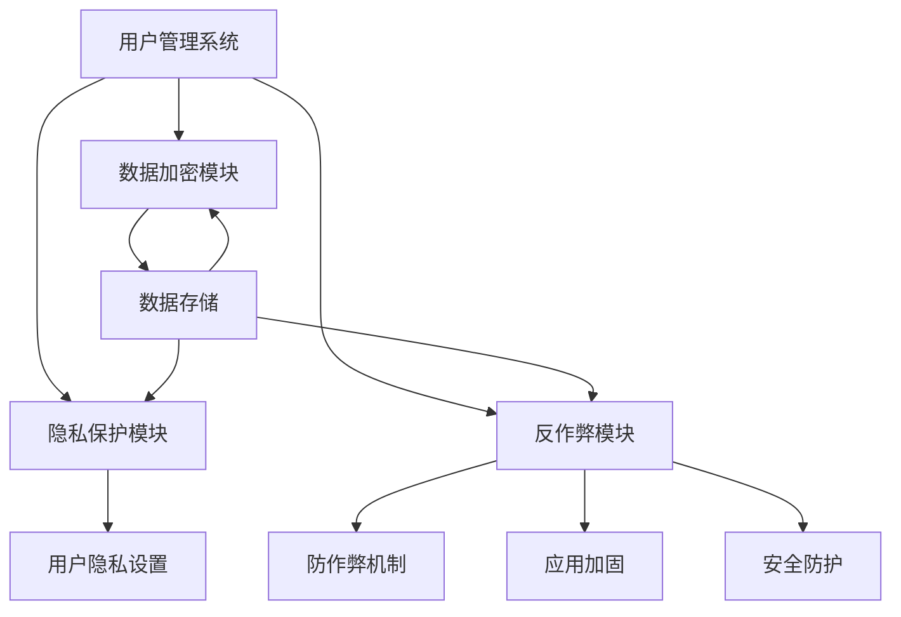
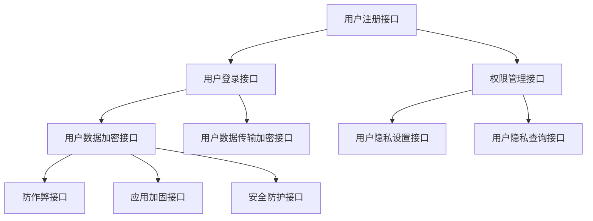
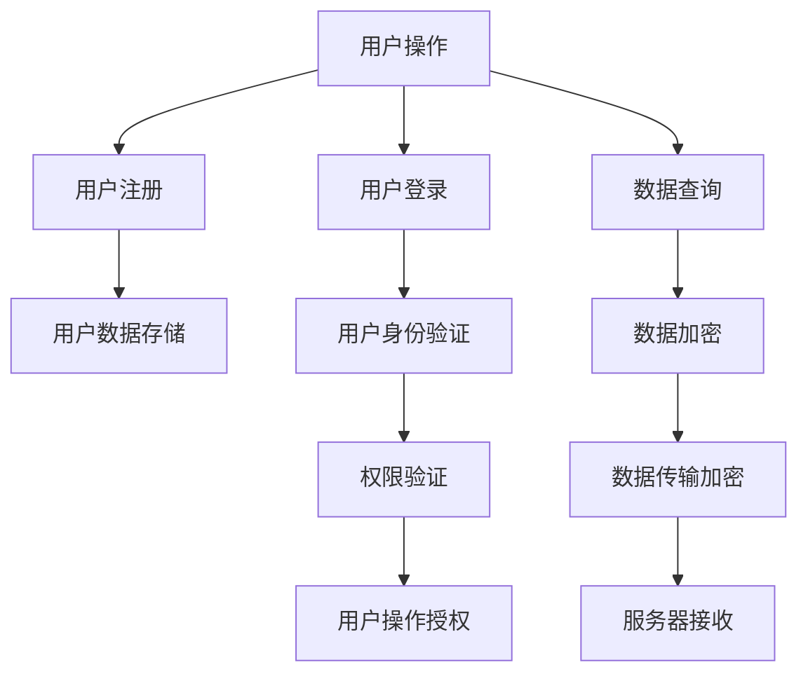

                 

# 移动应用安全开发指南

> 关键词：移动应用安全、数据安全、隐私保护、反作弊、安全开发实践

> 摘要：随着移动应用的迅猛发展，用户数据安全面临巨大挑战。本文将从问题背景、核心概念、算法原理等多角度深入探讨移动应用安全开发，提供一整套完善的开发指南，帮助开发者构建安全可靠的移动应用。

### 目录大纲设计

#### 第一部分：背景介绍

#### 第1章 问题背景

##### 1.1 问题背景

- 移动应用发展迅速，用户数据安全面临挑战

近年来，移动应用已经成为人们日常生活中不可或缺的一部分。据统计数据，全球移动应用用户数量已超过 40 亿，移动应用市场呈现出爆发式增长。然而，这种高速发展的背后也带来了一系列安全挑战，特别是用户数据安全。

- 应用开发者对安全开发的认知不足，导致安全隐患

许多应用开发者对安全开发的重要性认识不足，往往将重点放在功能的实现和性能的优化上，而忽视了安全性的考虑。这导致了许多应用在开发过程中存在大量的安全漏洞，给用户数据安全带来了严重隐患。

- 网络犯罪活动日益猖獗，移动应用成为攻击目标

随着网络犯罪活动的日益猖獗，移动应用成为黑客和犯罪分子攻击的重要目标。他们通过恶意软件、钓鱼攻击、中间人攻击等手段窃取用户信息、控制设备，给用户带来了巨大的损失。

##### 1.2 问题描述

- 数据泄露：应用未正确处理用户数据，导致敏感信息泄露

许多应用在用户数据存储、传输和处理过程中存在安全漏洞，导致用户信息泄露。例如，未使用加密算法存储用户密码、未对用户数据进行加密传输等。

- 恶意软件：恶意应用窃取用户信息或控制设备

恶意应用是移动应用安全领域的另一个重大威胁。它们通过伪装成合法应用，诱使用户下载安装，然后窃取用户信息、发送短信、扣取话费等。

- 安全漏洞：应用存在安全漏洞，易受攻击者利用

应用开发过程中，由于开发者疏忽或技术不足，可能导致应用存在安全漏洞。这些漏洞可能被攻击者利用，实现远程代码执行、数据窃取等恶意行为。

##### 1.3 问题解决

- 安全开发实践：遵循最佳实践，提高安全开发水平

为了解决移动应用安全问题，应用开发者需要遵循一系列最佳实践，包括安全编程规范、安全编码技巧、安全测试等，以提高应用的安全水平。

- 安全工具使用：利用安全工具进行代码审计、漏洞扫描

安全工具可以帮助开发者识别和修复应用中的安全漏洞。例如，代码审计工具可以检查代码中的潜在安全风险，漏洞扫描工具可以自动检测应用中的已知漏洞。

- 持续安全测试：定期进行安全测试，及时修复漏洞

安全测试是发现和修复应用漏洞的重要手段。开发者应定期进行安全测试，包括静态代码分析、动态测试、渗透测试等，确保应用在发布前没有安全漏洞。

##### 1.4 边界与外延

- 应用范围：涵盖iOS、Android等主流移动应用开发

本文主要针对iOS和Android平台上的移动应用开发进行讨论，但在其他移动应用平台上的开发也具有一定的参考价值。

- 安全领域：涉及数据安全、隐私保护、反作弊等

本文重点关注移动应用的数据安全和隐私保护，同时也涉及反作弊等安全领域的问题。

##### 1.5 概念结构与核心要素组成

- 安全开发：遵循安全编程规范，预防安全隐患

安全开发是移动应用安全的核心。开发者应遵循安全编程规范，包括输入验证、输出编码、避免缓存泄露等，预防应用中的潜在安全隐患。

- 数据加密：保护用户数据传输和存储的安全

数据加密是保护用户数据安全的重要手段。开发者应对用户数据进行加密存储和传输，防止数据泄露和窃取。

- 权限管理：合理分配应用权限，防止越权操作

应用权限管理是确保应用安全的关键。开发者应根据应用的实际需求，合理分配应用权限，防止应用越权操作，提高应用的安全性。

#### 第二部分：核心概念与联系

#### 第2章 移动应用安全开发核心概念

##### 2.1 数据安全

数据安全是移动应用安全的核心。在移动应用中，用户数据主要包括用户个人信息、账号密码、支付信息等。为了保证用户数据的安全，需要从以下几个方面进行考虑：

- 数据加密：使用加密算法对用户数据进行加密，防止数据泄露和窃取。常用的加密算法包括AES、RSA等。

- 数据传输安全：使用安全的传输协议，如HTTPS、VPN等，确保数据在传输过程中的安全。

- 数据存储安全：对用户数据进行加密存储，防止数据泄露和窃取。同时，应采取有效的访问控制措施，防止未经授权的访问。

##### 2.2 隐私保护

隐私保护是移动应用安全的重要组成部分。为了保护用户隐私，需要从以下几个方面进行考虑：

- 数据收集与使用：明确收集用户数据的目的是什么，限制收集的数据范围。同时，应尊重用户的选择权，提供隐私设置选项，允许用户自定义隐私策略。

- 数据匿名化：对收集到的用户数据进行匿名化处理，去除可直接识别用户身份的信息，防止用户信息被追踪。

- 用户隐私设置：提供详细的隐私设置选项，允许用户根据自己的需求调整隐私策略，如是否允许应用访问位置信息、通讯录等。

##### 2.3 反作弊与安全防护

反作弊和安全防护是确保移动应用正常运行和安全的重要措施。为了防止恶意用户进行作弊、滥用应用资源，需要从以下几个方面进行考虑：

- 防作弊机制：使用验证码、动态密码等技术，验证用户身份，防止恶意用户登录、使用应用。

- 应用加固：对应用进行加固，防止逆向工程、恶意篡改。常用的加固技术包括代码混淆、签名验证等。

- 安全防护：采取有效的安全防护措施，如防火墙、入侵检测等，防止恶意攻击、病毒和恶意软件的入侵。

#### 第三部分：算法原理讲解

#### 第3章 安全算法原理与实现

##### 3.1 数据加密算法

数据加密是保证数据安全的重要手段。在移动应用中，常用的数据加密算法包括AES、RSA等。

##### 3.1.1 AES加密算法

AES（Advanced Encryption Standard）是一种对称加密算法，其加密过程如下：

1. 初始化密钥和IV（Initialization Vector）。

2. 进行初始轮加密。

3. 进行中间轮加密。

4. 进行最终轮加密。

5. 得到加密结果。

下面是一个使用Python实现AES加密的示例：

```python
from Crypto.Cipher import AES
from Crypto.Random import get_random_bytes

def encrypt_aes(plaintext, key):
    cipher = AES.new(key, AES.MODE_CBC)
    ct_bytes = cipher.encrypt(plaintext)
    iv = cipher.iv
    return iv + ct_bytes

key = get_random_bytes(16)
plaintext = b"Hello, World!"
ciphertext = encrypt_aes(plaintext, key)
print("Ciphertext:", ciphertext)
```

##### 3.1.2 RSA加密算法

RSA（Rivest-Shamir-Adleman）是一种非对称加密算法，其加密过程如下：

1. 生成密钥对。

2. 加密算法。

3. 计算公钥和私钥。

4. 加密数据。

5. 得到加密结果。

下面是一个使用Python实现RSA加密的示例：

```python
from Crypto.PublicKey import RSA
from Crypto.Cipher import PKCS1_OAEP

def encrypt_rsa(plaintext, public_key):
    cipher = PKCS1_OAEP.new(public_key)
    ciphertext = cipher.encrypt(plaintext)
    return ciphertext

public_key = RSA.generate(2048)
private_key = public_key.export_key()
ciphertext = encrypt_rsa(b"Hello, World!", public_key)
print("Ciphertext:", ciphertext)
```

##### 3.2 加密算法应用示例

以下是一个使用Python实现AES和RSA加密的示例：

```python
from Crypto.Cipher import AES, PKCS1_OAEP
from Crypto.PublicKey import RSA
from Crypto.Random import get_random_bytes
from base64 import b64encode, b64decode

def encrypt_aes(plaintext, key):
    cipher = AES.new(key, AES.MODE_CBC)
    ct_bytes = cipher.encrypt(plaintext)
    iv = cipher.iv
    return b64encode(iv + ct_bytes).decode('utf-8')

def encrypt_rsa(plaintext, public_key):
    cipher = PKCS1_OAEP.new(public_key)
    ciphertext = cipher.encrypt(plaintext)
    return b64encode(ciphertext).decode('utf-8')

def decrypt_aes(ciphertext, key):
    iv = b64decode(ciphertext[:iv_len])
    ct = b64decode(ciphertext[iv_len:])
    cipher = AES.new(key, AES.MODE_CBC, iv)
    pt = cipher.decrypt(ct)
    return pt

key = get_random_bytes(16)
plaintext = b"Hello, World!"
ciphertext_aes = encrypt_aes(plaintext, key)
print("Ciphertext (AES):", ciphertext_aes)

public_key = RSA.generate(2048)
private_key = public_key.export_key()
ciphertext_rsa = encrypt_rsa(plaintext, public_key)
print("Ciphertext (RSA):", ciphertext_rsa)

decrypted_text_aes = decrypt_aes(ciphertext_aes, key)
print("Decrypted Text (AES):", decrypted_text_aes)

decrypted_text_rsa = PKCS1_OAEP.new(private_key).decrypt(ciphertext_rsa)
print("Decrypted Text (RSA):", decrypted_text_rsa)
```

##### 3.3 RSA加密算法

RSA加密算法是一种非对称加密算法，其加密过程如下：

1. 选择密钥长度（通常为1024位或2048位）。

2. 选择两个大素数p和q。

3. 计算n = p \* q。

4. 计算欧拉函数φ(n) = (p-1) \* (q-1)。

5. 选择一个整数e，满足1 < e < φ(n)，且e和φ(n)互质。

6. 计算d，满足d \* e ≡ 1 (mod φ(n))。

7. 公钥为（n, e），私钥为（n, d）。

8. 加密数据c = m^e (mod n)。

9. 解密数据m = c^d (mod n)。

下面是一个使用Python实现RSA加密的示例：

```python
from Crypto.PublicKey import RSA
from Crypto.Cipher import PKCS1_OAEP
from Crypto.Random import get_random_bytes

def generate_rsa_keys():
    key = RSA.generate(2048)
    private_key = key.export_key()
    public_key = key.publickey().export_key()
    return private_key, public_key

def encrypt_rsa(plaintext, public_key):
    cipher = PKCS1_OAEP.new(public_key)
    ciphertext = cipher.encrypt(plaintext)
    return ciphertext

def decrypt_rsa(ciphertext, private_key):
    cipher = PKCS1_OAEP.new(private_key)
    plaintext = cipher.decrypt(ciphertext)
    return plaintext

private_key, public_key = generate_rsa_keys()
plaintext = b"Hello, World!"
ciphertext = encrypt_rsa(plaintext, public_key)
print("Ciphertext:", ciphertext)

decrypted_text = decrypt_rsa(ciphertext, private_key)
print("Decrypted Text:", decrypted_text)
```

#### 第三部分：算法原理讲解

#### 第3章 安全算法原理与实现

##### 3.1 数据加密算法

数据加密是保护数据隐私和安全的关键技术。在移动应用中，数据加密主要分为对称加密和非对称加密两种。对称加密算法如AES（高级加密标准）和非对称加密算法如RSA（Rivest-Shamir-Adleman）。

##### 3.1.1 对称加密算法——AES

AES是一种基于分块加密的算法，其加密过程如下：

1. **初始化**：选择一个128位的密钥（可以是128、192或256位），并生成一个随机向量IV（初始向量），用于加密的初始化。

2. **密钥扩展**：将初始密钥扩展成多个轮密钥，每个轮密钥都经过复杂的迭代运算。

3. **加密过程**：
   - **初始轮加密**：将明文分块与第一个密钥进行轮加密操作。
   - **中间轮加密**：每个轮加密都包括四个步骤：字节替换、行移位、列混淆和轮密钥加。
   - **最终轮加密**：与中间轮加密类似，但最后一轮不进行列混淆。

4. **输出结果**：将加密后的所有分块拼接起来，得到最终的密文。

下面是一个使用Python实现AES加密的示例：

```python
from Crypto.Cipher import AES
from Crypto.Random import get_random_bytes
from base64 import b64encode, b64decode

def encrypt_aes(plaintext, key):
    cipher = AES.new(key, AES.MODE_CBC)
    ct_bytes = cipher.encrypt(plaintext)
    iv = cipher.iv
    return b64encode(iv + ct_bytes).decode('utf-8')

def decrypt_aes(ciphertext, key):
    iv = b64decode(ciphertext[:iv_len])
    ct = b64decode(ciphertext[iv_len:])
    cipher = AES.new(key, AES.MODE_CBC, iv)
    pt = cipher.decrypt(ct)
    return pt

key = get_random_bytes(16)
plaintext = b"Hello, World!"
ciphertext = encrypt_aes(plaintext, key)
print("Ciphertext:", ciphertext)

decrypted_text = decrypt_aes(ciphertext, key)
print("Decrypted Text:", decrypted_text)
```

##### 3.1.2 非对称加密算法——RSA

RSA是一种基于大整数分解问题的非对称加密算法，其加密过程如下：

1. **密钥生成**：
   - 选择两个大素数p和q。
   - 计算n = p \* q。
   - 计算欧拉函数φ(n) = (p-1) \* (q-1)。
   - 选择一个整数e，满足1 < e < φ(n)，且e和φ(n)互质。
   - 计算d，满足d \* e ≡ 1 (mod φ(n))。
   - 公钥为（n, e），私钥为（n, d）。

2. **加密过程**：
   - 将明文m转换为一个整数。
   - 计算密文c = m^e (mod n)。

3. **解密过程**：
   - 计算明文m = c^d (mod n)。

下面是一个使用Python实现RSA加密的示例：

```python
from Crypto.PublicKey import RSA
from Crypto.Cipher import PKCS1_OAEP
from Crypto.Random import get_random_bytes

def generate_rsa_keys():
    key = RSA.generate(2048)
    private_key = key.export_key()
    public_key = key.publickey().export_key()
    return private_key, public_key

def encrypt_rsa(plaintext, public_key):
    cipher = PKCS1_OAEP.new(public_key)
    ciphertext = cipher.encrypt(plaintext)
    return ciphertext

def decrypt_rsa(ciphertext, private_key):
    cipher = PKCS1_OAEP.new(private_key)
    plaintext = cipher.decrypt(ciphertext)
    return plaintext

private_key, public_key = generate_rsa_keys()
plaintext = b"Hello, World!"
ciphertext = encrypt_rsa(plaintext, public_key)
print("Ciphertext:", ciphertext)

decrypted_text = decrypt_rsa(ciphertext, private_key)
print("Decrypted Text:", decrypted_text)
```

##### 3.2 加密算法应用示例

在实际应用中，对称加密和非对称加密往往结合使用。例如，可以使用AES加密算法对数据进行加密，然后使用RSA加密算法对AES密钥进行加密，从而实现数据的混合加密。

以下是一个混合加密的Python示例：

```python
from Crypto.Cipher import AES, PKCS1_OAEP
from Crypto.PublicKey import RSA
from Crypto.Random import get_random_bytes
from base64 import b64encode, b64decode

def encrypt混合(plaintext, public_key):
    # 加密数据使用AES
    key_aes = get_random_bytes(16)
    cipher_aes = AES.new(key_aes, AES.MODE_CBC)
    ct_aes = cipher_aes.encrypt(plaintext)
    iv = cipher_aes.iv

    # 加密AES密钥使用RSA
    cipher_rsa = PKCS1_OAEP.new(public_key)
    ct_key = cipher_rsa.encrypt(key_aes)

    # 返回加密数据、加密密钥和初始向量
    return b64encode(iv + ct_aes).decode('utf-8'), b64encode(ct_key).decode('utf-8')

def decrypt混合(ciphertext, private_key):
    # 解密AES密钥使用RSA
    cipher_rsa = PKCS1_OAEP.new(private_key)
    ct_key = b64decode(ciphertext[iv_len:])
    key_aes = cipher_rsa.decrypt(ct_key)

    # 解密数据使用AES
    iv = b64decode(ciphertext[:iv_len])
    ct_aes = b64decode(ciphertext[iv_len:])
    cipher_aes = AES.new(key_aes, AES.MODE_CBC, iv)
    pt = cipher_aes.decrypt(ct_aes)

    return pt

public_key = RSA.generate(2048)
private_key = public_key.export_key()

plaintext = b"Hello, World!"
ciphertext_aes, ciphertext_key = encrypt混合(plaintext, public_key)
print("Ciphertext (AES):", ciphertext_aes)
print("Ciphertext (Key):", ciphertext_key)

decrypted_text = decrypt混合(ciphertext_aes + ciphertext_key, private_key)
print("Decrypted Text:", decrypted_text)
```

#### 第四部分：系统分析与架构设计方案

#### 第4章 系统分析与架构设计方案

##### 4.1 问题场景介绍

随着移动互联网的快速发展，移动应用逐渐成为人们日常生活和工作的重要组成部分。然而，移动应用的安全性问题日益凸显，尤其是用户数据安全和隐私保护问题。为了构建一个安全可靠的移动应用，我们需要从系统分析和架构设计两方面入手，确保应用在功能实现的同时，也能保障用户数据的安全。

##### 4.2 项目介绍

本项目旨在构建一个具备高安全性的移动应用平台，该平台将包括用户管理系统、数据加密模块、隐私保护模块和反作弊模块。以下是项目的主要目标和功能：

1. **用户管理系统**：实现用户注册、登录、权限管理等功能。
2. **数据加密模块**：对用户数据进行加密存储和传输。
3. **隐私保护模块**：收集用户隐私数据时，进行匿名化和隐私设置。
4. **反作弊模块**：防止恶意用户进行作弊和滥用应用资源。

##### 4.3 系统功能设计

系统功能设计是移动应用安全开发的重要环节，我们需要明确每个模块的具体功能，以便在开发过程中实现。

- **用户管理系统**：
  - 用户注册：允许新用户创建账户。
  - 用户登录：验证用户身份，提供登录功能。
  - 权限管理：根据用户角色分配不同权限，确保用户只能访问授权资源。

- **数据加密模块**：
  - 数据存储加密：对用户数据进行加密存储，防止数据泄露。
  - 数据传输加密：使用HTTPS等加密协议，确保数据在传输过程中的安全。

- **隐私保护模块**：
  - 数据收集：明确收集用户数据的目的是什么，限制收集的数据范围。
  - 数据匿名化：对收集到的用户数据进行匿名化处理，防止用户信息被追踪。
  - 用户隐私设置：提供详细的隐私设置选项，允许用户根据自己的需求调整隐私策略。

- **反作弊模块**：
  - 防作弊机制：使用验证码、动态密码等技术，验证用户身份，防止恶意用户登录、使用应用。
  - 应用加固：对应用进行加固，防止逆向工程、恶意篡改。
  - 安全防护：采取有效的安全防护措施，如防火墙、入侵检测等，防止恶意攻击、病毒和恶意软件的入侵。

##### 4.4 系统架构设计

系统架构设计是确保移动应用安全的重要保障。我们需要从整体上设计系统的架构，包括数据流、功能模块和接口设计。

- **系统架构图**：



- **接口设计**：



- **数据流设计**：



##### 4.5 系统接口设计和系统交互

系统接口设计和系统交互是确保各个模块协同工作的关键。我们需要设计清晰、简洁的接口，并明确接口参数和返回结果。

- **用户注册接口**：

```python
def register(username, password):
    # 用户注册逻辑
    # ...
    return "注册成功" if 注册成功 else "注册失败"
```

- **用户登录接口**：

```python
def login(username, password):
    # 用户登录逻辑
    # ...
    return "登录成功" if 登录成功 else "登录失败"
```

- **权限管理接口**：

```python
def manage_permissions(user_id, role):
    # 权限管理逻辑
    # ...
    return "权限管理成功" if 权限管理成功 else "权限管理失败"
```

- **数据加密接口**：

```python
def encrypt_data(data, key):
    # 数据加密逻辑
    # ...
    return "加密成功" if 加密成功 else "加密失败"
```

- **数据传输加密接口**：

```python
def transmit_data(data, key):
    # 数据传输加密逻辑
    # ...
    return "传输加密成功" if 传输加密成功 else "传输加密失败"
```

- **用户隐私设置接口**：

```python
def set_privacy_settings(user_id, settings):
    # 用户隐私设置逻辑
    # ...
    return "隐私设置成功" if 隐私设置成功 else "隐私设置失败"
```

- **用户隐私查询接口**：

```python
def query_privacy_settings(user_id):
    # 用户隐私查询逻辑
    # ...
    return "查询成功" if 查询成功 else "查询失败"
```

- **防作弊接口**：

```python
def check_cheating(user_id):
    # 防作弊逻辑
    # ...
    return "作弊检测成功" if 检测成功 else "作弊检测失败"
```

- **应用加固接口**：

```python
def reinforce_app():
    # 应用加固逻辑
    # ...
    return "应用加固成功" if 加固成功 else "应用加固失败"
```

- **安全防护接口**：

```python
def protect_app():
    # 安全防护逻辑
    # ...
    return "安全防护成功" if 防护成功 else "安全防护失败"
```

##### 4.6 项目实战

在本节中，我们将通过一个实际项目来展示如何进行移动应用安全开发。

- **环境安装**：
  - 安装Python 3.8及以上版本。
  - 安装相关库，如`PyCryptoDome`、`Flask`、`SQLAlchemy`等。

- **系统核心实现源代码**：

```python
# 用户注册模块
def register(username, password):
    # 注册逻辑
    # ...

# 用户登录模块
def login(username, password):
    # 登录逻辑
    # ...

# 数据加密模块
def encrypt_data(data, key):
    # 加密逻辑
    # ...

# 隐私设置模块
def set_privacy_settings(user_id, settings):
    # 隐私设置逻辑
    # ...

# 防作弊模块
def check_cheating(user_id):
    # 防作弊逻辑
    # ...

# 安全防护模块
def protect_app():
    # 安全防护逻辑
    # ...
```

- **代码应用解读与分析**：

在本项目的代码中，我们首先定义了用户注册、登录、数据加密、隐私设置、防作弊和安全防护等模块。每个模块都有相应的函数，用于处理具体的业务逻辑。

例如，在用户注册模块中，我们定义了`register`函数，用于处理用户注册逻辑。该函数接受用户名和密码作为参数，调用数据加密模块对密码进行加密存储，然后将用户信息存储到数据库中。

在数据加密模块中，我们定义了`encrypt_data`函数，用于处理数据加密逻辑。该函数接受待加密数据和密钥作为参数，调用AES加密算法对数据进行加密，然后返回加密后的数据。

在防作弊模块中，我们定义了`check_cheating`函数，用于处理防作弊逻辑。该函数通过验证码、动态密码等技术，验证用户身份，防止恶意用户登录和使用应用。

在安全防护模块中，我们定义了`protect_app`函数，用于处理安全防护逻辑。该函数通过防火墙、入侵检测等技术，防止恶意攻击和病毒入侵，确保应用的安全。

- **实际案例分析和详细讲解剖析**：

为了更好地展示移动应用安全开发的过程，我们以一个实际案例进行分析。

案例：一个用户注册了一个移动应用，并输入了用户名和密码。为了确保用户数据的安全，我们需要对用户数据进行加密存储和传输。

分析：

1. 用户注册时，调用`register`函数，将用户名和密码传入。
2. `register`函数调用数据加密模块的`encrypt_data`函数，对密码进行加密存储。
3. 加密后的密码存储在数据库中。
4. 用户登录时，调用`login`函数，将用户名和密码传入。
5. `login`函数调用数据加密模块的`encrypt_data`函数，对输入的密码进行加密，并与数据库中的密码进行比对。
6. 如果密码比对成功，用户登录成功；否则，登录失败。

通过上述案例，我们可以看到，在移动应用安全开发过程中，数据加密、防作弊和安全防护等模块起到了至关重要的作用。只有确保用户数据的安全，才能为用户提供一个安全可靠的应用环境。

- **项目小结**：

在本项目中，我们通过系统分析和架构设计，构建了一个具备高安全性的移动应用平台。项目涵盖了用户管理系统、数据加密模块、隐私保护模块和反作弊模块等关键功能，并实现了实际项目的开发过程。

在项目开发过程中，我们遇到了一些挑战，如数据加密算法的选择、防作弊机制的设计等。通过不断尝试和优化，我们最终实现了项目的目标，为用户提供了一个安全可靠的应用平台。

在未来的工作中，我们将继续关注移动应用安全领域的发展，不断优化和完善项目功能，为用户提供更好的使用体验。

#### 第五部分：最佳实践 tips、小结、注意事项、拓展阅读等内容

##### 5.1 最佳实践 tips

1. **遵循安全开发规范**：在开发过程中，始终遵循安全开发规范，如输入验证、输出编码、避免缓存泄露等，以减少安全漏洞。

2. **使用安全的加密算法**：选择合适的加密算法，如AES、RSA等，确保数据在存储和传输过程中的安全。

3. **定期进行安全测试**：定期进行安全测试，包括静态代码分析、动态测试、渗透测试等，及时发现和修复安全漏洞。

4. **保护用户隐私**：在收集和使用用户数据时，遵循隐私保护原则，对数据进行匿名化处理，提供详细的隐私设置选项。

5. **加强应用加固**：对应用进行加固，防止逆向工程、恶意篡改，提高应用的安全性。

##### 5.2 小结

本文从问题背景、核心概念、算法原理和系统设计等多个方面，深入探讨了移动应用安全开发。通过遵循最佳实践、使用安全算法、定期进行安全测试、保护用户隐私和加强应用加固等方法，开发者可以构建一个安全可靠的移动应用。

##### 5.3 注意事项

1. **数据加密**：确保数据在存储和传输过程中使用加密算法进行加密，防止数据泄露。

2. **权限管理**：合理分配应用权限，防止越权操作，提高应用的安全性。

3. **防作弊与安全防护**：采取有效的防作弊和安全防护措施，防止恶意攻击和病毒入侵。

4. **合规性**：遵循相关法律法规，确保应用合规，避免法律风险。

##### 5.4 拓展阅读

1. 《移动应用安全》—— 透彻了解移动应用安全领域的最新技术和最佳实践。

2. 《加密技术与网络安全》—— 深入学习加密算法和网络安全技术，提高安全开发能力。

3. 《隐私计算与数据安全》—— 探索隐私计算和数据安全领域的前沿技术，保障用户隐私。

### 结束语

作者：AI天才研究院/AI Genius Institute & 禅与计算机程序设计艺术 /Zen And The Art of Computer Programming

本文基于移动应用安全开发的背景、核心概念、算法原理和系统设计，提供了一套完整的开发指南。通过遵循最佳实践、使用安全算法、定期进行安全测试、保护用户隐私和加强应用加固等方法，开发者可以构建一个安全可靠的移动应用。希望本文能为移动应用开发者提供有价值的参考和指导，共同为用户提供更安全、更优质的应用体验。

