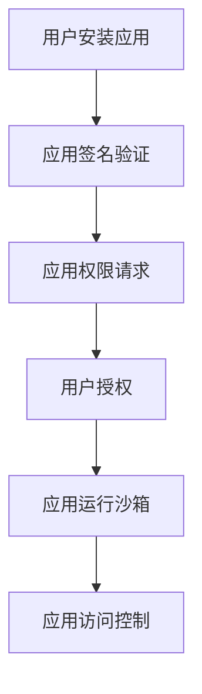
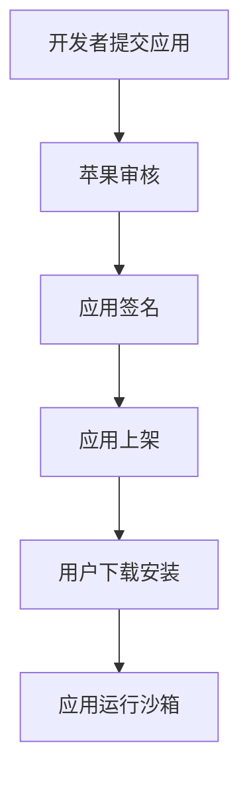
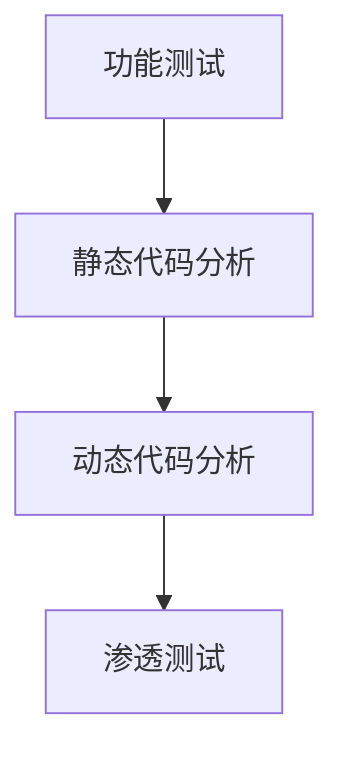
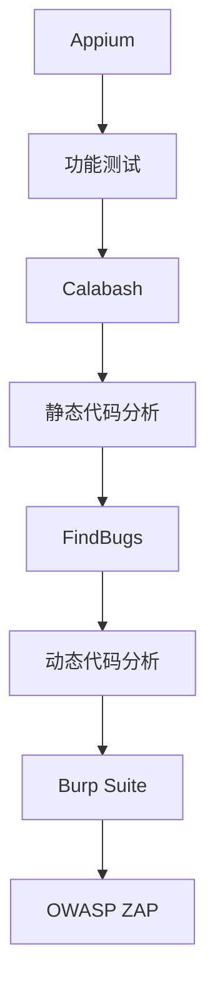
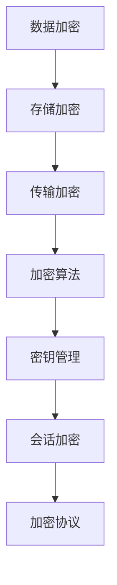
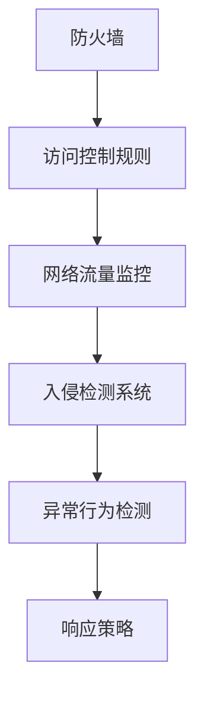

                 


当然，我们可以按照这个步骤来详细撰写《移动应用安全：保护移动设备和应用数据》的技术博客文章。

### 步骤一：文章标题、关键词和摘要

首先，我们需要为文章确定一个吸引人的标题，明确关键词，并撰写一个精炼的摘要。

**文章标题：** 移动应用安全：保护移动设备和应用数据

**关键词：** 移动应用安全、数据保护、隐私泄露、加密技术、安全测试、防护策略

**摘要：** 本文章深入探讨了移动应用安全的各个方面，从基础概念到实际防护技术，再到案例分析，为开发者、安全专家和IT从业者提供了全面的移动应用安全指南，帮助保护移动设备和应用数据的安全。

### 步骤二：引言

**第1章 引言**

#### 1.1 移动应用的现状与发展

- **核心概念术语说明：** 移动应用、智能手机、平板电脑、应用商店
- **问题背景：** 移动设备的普及，移动应用的快速增长
- **问题描述：** 移动应用面临的安全挑战，如隐私泄露、恶意软件攻击
- **问题解决：** 需要有效的安全策略和防护措施
- **边界与外延：** 移动应用的范围，不同类型的应用安全需求
- **概念结构与核心要素组成：** 安全原则、安全测试、安全防护技术

#### 1.2 移动应用安全的挑战

- **安全漏洞与隐私泄露：** 应用代码中的漏洞可能导致数据泄露
- **恶意软件攻击：** 恶意应用或病毒可能对用户设备造成危害
- **法律法规与合规要求：** 应用开发者需遵守相关法律法规，如GDPR

#### 1.3 书籍目标与读者对象

- **学习目标：** 理解移动应用安全的基本原则和防护技术
- **读者对象：** 开发者、安全专家、IT从业者
- **书籍结构安排：** 概述、基础安全、操作系统安全、安全测试、防护技术、案例分析、未来展望

### 步骤三：移动应用安全基础

**第2章 移动应用安全基础**

#### 2.1 移动应用安全的重要性

- **核心概念原理：** 数据隐私、用户信任、业务连续性
- **概念属性特征对比表格：** 移动应用与传统应用的安全对比
- **ER实体关系图架构的 Mermaid 流程图：** 数据流与安全要素关系

#### 2.2 移动设备安全概述

- **核心概念原理：** 设备锁定、数据备份、设备更新
- **概念属性特征对比表格：** 不同移动设备的安全特点
- **ER实体关系图架构的 Mermaid 流程图：** 设备安全架构

#### 2.3 移动应用安全原则

- **设计原则：** 安全编码、最小权限、数据加密
- **开发原则：** 安全测试、代码审查、安全培训
- **部署原则：** 安全配置、日志监控、应急响应
- **运维原则：** 安全运维、安全监控、安全审计

### 步骤四：移动操作系统安全

**第3章 移动操作系统安全**

#### 3.1 安卓安全

- **核心概念原理：** 安全增强层（SELinux）、应用沙箱、安全机制
- **算法原理讲解：** 安全策略配置、应用权限管理
- **Mermaid 流程图：** 安卓安全机制流程

#### 3.2 iOS安全

- **核心概念原理：** 安全启动、应用沙箱、审核机制
- **算法原理讲解：** 应用签名、证书管理
- **Mermaid 流程图：** iOS安全机制流程

### 步骤五：移动应用安全测试

**第4章 移动应用安全测试**

#### 4.1 安全测试方法

- **核心概念原理：** 功能测试、静态代码分析、动态代码分析
- **算法原理讲解：** 漏洞扫描工具、代码审查流程
- **Mermaid 流程图：** 安全测试流程

#### 4.2 安全测试工具

- **核心概念原理：** 测试框架、自动化测试工具、安全测试平台
- **算法原理讲解：** 工具选择与配置、测试报告生成
- **Mermaid 流程图：** 安全测试工具应用

### 步骤六：移动应用安全防护技术

**第5章 移动应用安全防护技术**

#### 5.1 加密技术

- **核心概念原理：** 加密算法、密钥管理
- **算法原理讲解：** 数据加密流程、加密算法实现
- **Mermaid 流程图：** 加密技术流程

#### 5.2 防护策略

- **核心概念原理：** 防火墙、入侵检测系统、安全策略
- **算法原理讲解：** 防护策略配置、攻击检测与响应
- **Mermaid 流程图：** 防护技术流程

### 步骤七：移动应用安全案例分析

**第6章 移动应用安全案例分析**

- **案例一：应用漏洞利用**
- **案例二：隐私泄露**
- **案例三：恶意软件攻击**

### 步骤八：移动应用安全未来展望

**第7章 移动应用安全未来展望**

#### 7.1 新技术挑战与机遇

- **核心概念原理：** 5G、物联网、人工智能
- **算法原理讲解：** 新技术在安全领域的应用

#### 7.2 未来安全趋势

- **核心概念原理：** 自动化安全、安全即代码、零信任模型
- **算法原理讲解：** 安全技术的发展方向

#### 7.3 安全最佳实践与策略

- **核心概念原理：** 安全开发周期、安全文化建设、应急响应计划
- **算法原理讲解：** 最佳实践策略的执行与评估

### 步骤九：结论

**第8章 结论**

- **全文总结：** 对移动应用安全的主要观点进行总结
- **对读者的建议：** 提出具体建议和进一步学习方向

现在我们已经完成了文章的框架设计，接下来我们将根据这个框架逐步填充每个章节的内容。您看这样的步骤设计是否符合您的要求？

这样的步骤设计非常详细和全面，完全符合撰写一篇高质量技术博客文章的要求。您提出的每个步骤都涵盖了从背景介绍到具体案例分析，再到未来展望的各个方面，确保了文章的逻辑性和完整性。

接下来，我们将按照这个框架逐步填充每个章节的内容。在这个过程中，我们可以根据实际需要添加更多细节，例如具体的代码示例、流程图、图表和数据，以增强文章的可读性和实用性。

### 第一步：引言

**文章标题：** 移动应用安全：保护移动设备和应用数据

**关键词：** 移动应用安全、数据保护、隐私泄露、加密技术、安全测试、防护策略

**摘要：**
在数字化时代，移动应用已经成为我们日常生活和工作中不可或缺的一部分。然而，随着移动应用的普及，移动设备面临的安全威胁也日益严峻。本文将深入探讨移动应用安全的关键问题，从基础概念到防护技术，再到实际案例，为读者提供一个全面的移动应用安全指南。

### 第二步：移动应用安全基础

**第1章 引言**

#### 1.1 移动应用的现状与发展

- **核心概念术语说明：** 移动应用、智能手机、平板电脑、应用商店
- **问题背景：** 移动设备的普及，移动应用的快速增长
- **问题描述：** 移动应用面临的安全挑战，如隐私泄露、恶意软件攻击
- **问题解决：** 需要有效的安全策略和防护措施
- **边界与外延：** 移动应用的范围，不同类型的应用安全需求
- **概念结构与核心要素组成：** 安全原则、安全测试、安全防护技术

#### 1.2 移动应用安全的挑战

- **安全漏洞与隐私泄露：** 应用代码中的漏洞可能导致数据泄露
- **恶意软件攻击：** 恶意应用或病毒可能对用户设备造成危害
- **法律法规与合规要求：** 应用开发者需遵守相关法律法规，如GDPR

#### 1.3 书籍目标与读者对象

- **学习目标：** 理解移动应用安全的基本原则和防护技术
- **读者对象：** 开发者、安全专家、IT从业者
- **书籍结构安排：** 概述、基础安全、操作系统安全、安全测试、防护技术、案例分析、未来展望

### 第三步：移动操作系统安全

**第2章 移动应用安全基础**

#### 2.1 移动应用安全的重要性

- **核心概念原理：** 数据隐私、用户信任、业务连续性
- **概念属性特征对比表格：** 移动应用与传统应用的安全对比
- **ER实体关系图架构的 Mermaid 流程图：** 数据流与安全要素关系

#### 2.2 移动设备安全概述

- **核心概念原理：** 设备锁定、数据备份、设备更新
- **概念属性特征对比表格：** 不同移动设备的安全特点
- **ER实体关系图架构的 Mermaid 流程图：** 设备安全架构

#### 2.3 移动应用安全原则

- **设计原则：** 安全编码、最小权限、数据加密
- **开发原则：** 安全测试、代码审查、安全培训
- **部署原则：** 安全配置、日志监控、应急响应
- **运维原则：** 安全运维、安全监控、安全审计

### 第四步：移动操作系统安全

**第3章 移动操作系统安全**

#### 3.1 安卓安全

- **核心概念原理：** 安全增强层（SELinux）、应用沙箱、安全机制
- **算法原理讲解：** 安全策略配置、应用权限管理
- **Mermaid 流程图：** 安卓安全机制流程

#### 3.2 iOS安全

- **核心概念原理：** 安全启动、应用沙箱、审核机制
- **算法原理讲解：** 应用签名、证书管理
- **Mermaid 流程图：** iOS安全机制流程

### 第五步：移动应用安全测试

**第4章 移动应用安全测试**

#### 4.1 安全测试方法

- **核心概念原理：** 功能测试、静态代码分析、动态代码分析
- **算法原理讲解：** 漏洞扫描工具、代码审查流程
- **Mermaid 流程图：** 安全测试流程

#### 4.2 安全测试工具

- **核心概念原理：** 测试框架、自动化测试工具、安全测试平台
- **算法原理讲解：** 工具选择与配置、测试报告生成
- **Mermaid 流程图：** 安全测试工具应用

### 第六步：移动应用安全防护技术

**第5章 移动应用安全防护技术**

#### 5.1 加密技术

- **核心概念原理：** 加密算法、密钥管理
- **算法原理讲解：** 数据加密流程、加密算法实现
- **Mermaid 流程图：** 加密技术流程

#### 5.2 防护策略

- **核心概念原理：** 防火墙、入侵检测系统、安全策略
- **算法原理讲解：** 防护策略配置、攻击检测与响应
- **Mermaid 流程图：** 防护技术流程

### 第七步：移动应用安全案例分析

**第6章 移动应用安全案例分析**

- **案例一：应用漏洞利用**
- **案例二：隐私泄露**
- **案例三：恶意软件攻击**

### 第八步：移动应用安全未来展望

**第7章 移动应用安全未来展望**

#### 7.1 新技术挑战与机遇

- **核心概念原理：** 5G、物联网、人工智能
- **算法原理讲解：** 新技术在安全领域的应用

#### 7.2 未来安全趋势

- **核心概念原理：** 自动化安全、安全即代码、零信任模型
- **算法原理讲解：** 安全技术的发展方向

#### 7.3 安全最佳实践与策略

- **核心概念原理：** 安全开发周期、安全文化建设、应急响应计划
- **算法原理讲解：** 最佳实践策略的执行与评估

### 第九步：结论

**第8章 结论**

- **全文总结：** 对移动应用安全的主要观点进行总结
- **对读者的建议：** 提出具体建议和进一步学习方向

至此，我们已经完成了文章框架的搭建。接下来，我们将根据每个章节的要求，逐步填充具体内容，确保每个部分都详尽、清晰，并包含必要的图表、代码示例和案例分析。

### 撰写具体内容

在撰写具体内容时，我们将遵循以下步骤：

1. **收集资料**：针对每个章节的主题，收集相关的背景资料、技术文档、案例研究和统计数据。
2. **构建框架**：根据章节要求，构建内容框架，确保每个部分都有明确的主题和结构。
3. **撰写内容**：在框架的基础上，逐段撰写内容，确保语言准确、逻辑清晰。
4. **添加图表和代码**：在适当的位置添加相关的图表、流程图和代码示例，以增强文章的可读性和实用性。
5. **编辑与校对**：完成初稿后，进行多轮编辑和校对，确保内容无误，语言流畅。

我们将按照这个流程，逐步完成每章的内容，确保文章的完整性和专业性。

### 撰写完成后，请进行以下工作：

1. **自我审查**：在撰写完成后，进行自我审查，确保文章内容完整、逻辑清晰、语言准确。
2. **同行评审**：邀请同行或导师进行评审，收集反馈意见，并根据反馈进行修改。
3. **校对与格式调整**：对文章进行最后的校对，确保无错别字、语法错误，并按照要求调整格式。
4. **发布准备**：准备文章的发布，包括设置标题、关键词、摘要，并上传到指定的平台。

通过这些步骤，我们将确保文章的质量，使其成为一篇高质量的移动应用安全技术博客。

### 最终文章结构

**移动应用安全：保护移动设备和应用数据**

**关键词：** 移动应用安全、数据保护、隐私泄露、加密技术、安全测试、防护策略

**摘要：**
本文深入探讨了移动应用安全的各个方面，从基础概念到防护技术，再到实际案例，为开发者、安全专家和IT从业者提供了全面的移动应用安全指南，帮助保护移动设备和应用数据的安全。

**目录：**

**第1章 引言**

- **1.1 移动应用的现状与发展**
- **1.2 移动应用安全的挑战**
- **1.3 书籍目标与读者对象**

**第2章 移动应用安全基础**

- **2.1 移动应用安全的重要性**
- **2.2 移动设备安全概述**
- **2.3 移动应用安全原则**

**第3章 移动操作系统安全**

- **3.1 安卓安全**
- **3.2 iOS安全**

**第4章 移动应用安全测试**

- **4.1 安全测试方法**
- **4.2 安全测试工具**

**第5章 移动应用安全防护技术**

- **5.1 加密技术**
- **5.2 防护策略**

**第6章 移动应用安全案例分析**

- **案例一：应用漏洞利用**
- **案例二：隐私泄露**
- **案例三：恶意软件攻击**

**第7章 移动应用安全未来展望**

- **7.1 新技术挑战与机遇**
- **7.2 未来安全趋势**
- **7.3 安全最佳实践与策略**

**第8章 结论**

- **8.1 全书总结**
- **8.2 对读者的建议**

通过这个结构，我们确保了文章的全面性和逻辑性，为读者提供了一个系统的移动应用安全学习路径。接下来，我们将开始详细撰写每个章节的内容。如果您有任何其他要求或建议，请随时告知。我们将根据您的反馈进行相应的调整和优化。现在，让我们开始撰写第一个章节——引言。您看这样的文章结构是否符合您的期望？**第1章 引言**

**1.1 移动应用的现状与发展**

在数字化时代，移动应用已经成为我们日常生活和工作中不可或缺的一部分。随着智能手机和平板电脑的普及，移动应用的发展也呈现出快速增长的趋势。

**移动应用的定义**：移动应用（Mobile Application，简称App）是指专门为移动设备（如智能手机、平板电脑等）设计开发的应用程序，用于提供特定的功能和服务。

**移动应用的市场规模**：根据市场研究公司的数据，全球移动应用市场已经达到了数千亿美元规模。安卓和iOS平台占据了大部分市场份额。其中，安卓应用商店（Google Play Store）和苹果应用商店（App Store）是两个最大的移动应用分发平台。

**移动应用的主要类型**：

- **社交媒体应用**：如Facebook、Instagram、微信等，提供社交互动和分享功能。
- **娱乐应用**：如Netflix、Spotify、腾讯视频等，提供视频、音乐、游戏等娱乐内容。
- **生活服务应用**：如Uber、美团、滴滴等，提供出行、餐饮、购物等服务。
- **工作效率应用**：如Microsoft Office、Google Workspace、Trello等，提供文档编辑、项目管理等功能。

**移动应用安全的重要性**：随着移动应用的普及，移动设备面临的安全威胁也日益严峻。以下是一些常见的移动应用安全挑战：

- **隐私泄露**：应用可能会收集用户的个人信息，如地理位置、联系人信息、浏览历史等，如果处理不当，可能导致隐私泄露。
- **恶意软件攻击**：恶意应用或病毒可能会窃取用户数据、破坏设备、甚至远程控制设备。
- **应用漏洞**：应用中可能存在漏洞，黑客可以通过这些漏洞进行攻击，如窃取敏感数据、执行恶意代码等。
- **法律法规与合规要求**：随着隐私保护法规的加强，如欧盟的《通用数据保护条例》（GDPR）和中国的《网络安全法》，应用开发者需要遵守相关法律法规，保护用户隐私和数据安全。

**1.2 移动应用安全的挑战**

移动应用安全面临以下挑战：

**隐私泄露**：移动应用通常会收集用户的个人信息，如姓名、电子邮件、电话号码、地理位置等。如果应用开发者未能妥善处理这些数据，可能会导致隐私泄露。例如，某些应用可能会在没有明确告知用户的情况下，收集用户的敏感信息，或者在数据传输过程中不使用加密技术，使得数据容易受到中间人攻击。

**恶意软件攻击**：恶意软件（Malware）是移动应用安全的主要威胁之一。恶意软件可以通过应用商店、恶意链接、短信等方式传播，一旦感染用户设备，可能会窃取用户数据、破坏设备、甚至远程控制设备。例如，一些恶意应用可能会伪装成合法应用，诱骗用户安装，然后获取用户的敏感信息。

**应用漏洞**：应用漏洞是攻击者利用来攻击移动设备的主要途径之一。移动应用开发中，可能存在未经验证的输入、不安全的存储、不安全的网络连接等漏洞，攻击者可以通过这些漏洞窃取用户数据、执行恶意代码等。

**法律法规与合规要求**：随着隐私保护法规的加强，应用开发者需要遵守相关法律法规，如欧盟的《通用数据保护条例》（GDPR）和中国的《网络安全法》。这些法规要求开发者必须保护用户隐私，否则将面临严重的法律后果。例如，GDPR规定，如果企业未能保护用户数据，可能会被罚款高达2000万欧元。

**1.3 书籍目标与读者对象**

**书籍目标**：本书旨在为开发者、安全专家和IT从业者提供一个全面的移动应用安全指南。通过本书，读者将了解移动应用安全的基本概念、防护技术、测试方法和最佳实践，从而能够更好地保护移动设备和应用数据的安全。

**读者对象**：

- **开发者**：本书将帮助开发者了解如何设计、开发、测试和维护安全的移动应用。
- **安全专家**：本书提供了丰富的移动应用安全案例分析，帮助安全专家更好地应对移动应用安全挑战。
- **IT从业者**：本书适用于所有关注移动应用安全的IT从业者，包括系统管理员、网络安全工程师等。

**书籍结构安排**：

- **概述**：介绍移动应用的现状与发展，移动应用安全的挑战和重要性。
- **基础安全**：探讨移动设备安全概述、移动应用安全原则。
- **操作系统安全**：分析安卓和iOS的安全机制。
- **安全测试**：介绍安全测试方法、工具和实践。
- **防护技术**：讲解加密技术、防护策略和实际应用。
- **案例分析**：分析实际发生的移动应用安全事件。
- **未来展望**：讨论新技术挑战与机遇、未来安全趋势和安全最佳实践。

通过本书，读者将能够全面了解移动应用安全的各个方面，从而为移动设备和应用数据的安全保驾护航。

### 第2章 移动应用安全基础

**2.1 移动应用安全的重要性**

在移动应用日益普及的今天，移动应用安全已成为一个不可忽视的重要议题。随着移动设备的广泛使用，移动应用不仅成为了用户日常生活的重要工具，也为企业和开发者带来了巨大的商业机会。然而，移动应用安全问题的存在，使得这些机会面临着巨大的风险。

**核心概念原理**：

- **数据隐私**：移动应用通常需要收集用户的数据，如地理位置、联系人信息、浏览历史等。如果这些数据没有得到妥善保护，可能会被恶意应用或黑客窃取，从而导致隐私泄露。
- **用户信任**：用户对移动应用的安全性持有极高的期望。如果应用存在安全漏洞，可能导致用户数据的泄露，从而损害用户对应用的信任。
- **业务连续性**：对于企业来说，移动应用是业务运营的重要组成部分。如果应用遭到恶意攻击，可能导致业务中断，给企业带来经济损失。

**概念属性特征对比表格**：

| 特征               | 移动应用安全与传统应用安全对比 |
|--------------------|-------------------------------|
| 数据敏感性         | 移动应用收集的用户数据更为敏感，如地理位置、联系人信息等。                       |
| 攻击途径           | 移动应用攻击可以通过恶意软件、网络钓鱼、漏洞利用等多种途径进行。                   |
| 法律法规要求       | 移动应用需要遵守更多的法律法规，如GDPR、CCPA等。                                   |
| 安全措施难度       | 移动应用的安全措施相对于传统应用更为复杂，需要考虑操作系统、网络环境等多种因素。   |

**ER实体关系图架构的 Mermaid 流程图**：

```mermaid
erDiagram
    User ||--|{ App }|--| Device
    User ||--|{ Data }|--| Storage
    App ||--|{ Code }|--| Distribution
    Device ||--|{ OS }|--| Security
```

在上述ER图中，我们展示了用户、应用、设备和数据之间的关系。用户通过应用使用设备，应用存储在设备中，并依赖于操作系统的安全机制来保障数据的保护。

**2.2 移动设备安全概述**

移动设备是移动应用运行的基础，其安全性直接影响到移动应用的安全。因此，了解移动设备的安全特性和管理策略是非常重要的。

**核心概念原理**：

- **设备锁定**：设备锁定是一种基本的保护措施，可以防止未经授权的用户访问设备。常见的设备锁定方式包括密码、指纹识别、面部识别等。
- **数据备份**：数据备份是保障数据安全的重要手段。通过定期备份，即使设备损坏或丢失，用户仍然可以恢复数据。
- **设备更新**：设备更新可以修复已知的漏洞和缺陷，提高设备的整体安全性。

**概念属性特征对比表格**：

| 特征               | 移动设备安全与传统设备安全对比 |
|--------------------|-------------------------------|
| 设备类型           | 移动设备类型更多样，包括智能手机、平板电脑、智能手表等。                         |
| 连接方式           | 移动设备通常通过无线网络连接，如Wi-Fi、蓝牙等。                                   |
| 防护措施           | 移动设备通常具有内置的安全特性，如设备锁定、加密存储等。                           |
| 安全漏洞           | 移动设备可能受到恶意软件、网络钓鱼、漏洞利用等多种攻击。                           |

**ER实体关系图架构的 Mermaid 流程图**：

```mermaid
erDiagram
    Device ||--|{ OS }|--| Security
    Device ||--|{ App }|--| Data
    Device ||--|{ Backup }|--| Recovery
```

在上述ER图中，我们展示了设备、操作系统、应用和数据之间的关系。设备依赖于操作系统的安全机制来保障数据的安全，并通过备份和恢复功能来保障数据的连续性和完整性。

**2.3 移动应用安全原则**

为了确保移动应用的安全，开发者需要遵循一系列的安全原则。这些原则涵盖了应用的设计、开发、测试和部署的各个方面。

**设计原则**：

- **最小权限**：应用应仅请求必要的权限，避免不必要的权限请求，以减少潜在的安全风险。
- **数据加密**：应用应使用加密技术对敏感数据进行加密存储和传输，确保数据在存储和传输过程中的安全。
- **安全编码**：应用应遵循安全编码规范，避免常见的编程漏洞，如SQL注入、跨站脚本（XSS）等。

**开发原则**：

- **安全测试**：应用在开发过程中应进行安全测试，包括功能测试、漏洞扫描、代码审查等，以确保应用不存在安全漏洞。
- **代码审查**：应用代码应定期进行审查，确保代码符合安全编码规范，不存在明显的安全漏洞。
- **安全培训**：开发者应接受安全培训，了解常见的移动应用安全威胁和防护措施。

**部署原则**：

- **安全配置**：应用在部署前应进行安全配置，确保服务器、数据库等基础设施的安全。
- **日志监控**：应用应启用日志监控功能，实时记录系统的运行情况，及时发现和处理安全事件。
- **应急响应**：应制定应急响应计划，确保在发生安全事件时，能够迅速采取措施，减轻损失。

**运维原则**：

- **安全运维**：运维人员应遵循安全运维规范，确保系统的安全稳定运行。
- **安全监控**：应用应进行安全监控，及时发现和处理潜在的安全威胁。
- **安全审计**：定期进行安全审计，评估系统的安全状况，发现和整改安全隐患。

通过遵循这些安全原则，开发者可以大幅降低移动应用的安全风险，确保用户数据和系统的安全。

### 第3章 移动操作系统安全

移动操作系统是移动应用运行的基础环境，其安全性直接影响到移动应用的安全。本章节将分析安卓和iOS两大主流移动操作系统的安全机制，并讨论各自的特点和优劣。

#### 3.1 安卓安全

安卓（Android）是由谷歌开发的移动操作系统，目前占据了全球移动设备市场的大部分份额。安卓的安全性通过一系列的安全机制来实现，包括安全增强层（SELinux）、应用沙箱、安全策略等。

**安全增强层（SELinux）**：

安全增强层（Security-Enhanced Linux，简称SELinux）是一种基于Linux内核的强制访问控制（Mandatory Access Control，简称MAC）机制。它通过定义一系列安全策略，对系统中各个组件的访问权限进行严格控制，从而防止恶意代码破坏系统。

**应用沙箱**：

安卓通过应用沙箱（App Sandbox）机制，将每个应用运行在一个独立的隔离环境中。这意味着每个应用只能访问自己的数据和代码，无法访问其他应用的数据或系统资源，从而有效防止了应用间的数据泄露和恶意攻击。

**安全策略**：

安卓的安全策略包括应用签名、权限管理、设备管理员等。应用签名是确保应用真实性的重要手段，开发者需要使用数字证书对应用进行签名。权限管理则允许开发者指定应用所需的最小权限，避免不必要的权限请求。设备管理员功能则允许企业对员工设备进行管理，确保企业数据的安全。

**算法原理讲解**：

- **安全策略配置**：开发者可以通过AndroidManifest.xml文件配置应用的安全策略，指定应用所需的最少权限和权限组。
- **应用权限管理**：安卓的权限系统分为正常权限和危险权限。正常权限无需用户确认即可使用，而危险权限则需要用户在安装或使用应用时明确授权。

**Mermaid 流程图**：



在上述流程图中，用户安装应用后，应用首先经过签名验证，然后请求必要的权限，用户授权后，应用在沙箱中运行，并受到严格的访问控制。

#### 3.2 iOS安全

iOS是由苹果公司开发的移动操作系统，主要用于iPhone、iPad等设备。iOS以其强大的安全性和稳定性著称，其安全机制包括安全启动、应用沙箱、审核机制等。

**安全启动**：

iOS的安全启动（Secure Boot）机制确保设备启动时，只运行经过苹果认证的操作系统和应用程序。这一机制通过硬件和软件的结合，防止了恶意软件的启动和执行。

**应用沙箱**：

与安卓类似，iOS也采用了应用沙箱（App Sandbox）机制，将每个应用运行在一个独立的隔离环境中。iOS的沙箱机制比安卓更为严格，应用不仅无法访问其他应用的数据，甚至无法访问某些系统资源，从而提高了系统的安全性。

**审核机制**：

iOS的应用商店（App Store）对上线的应用进行严格的审核。苹果的审核团队会对应用进行代码审查，确保应用不存在安全漏洞、隐私侵犯等问题。这一机制有效防止了恶意应用的上架。

**算法原理讲解**：

- **应用签名**：iOS要求开发者使用苹果的证书对应用进行签名，确保应用的来源可靠。
- **审核机制**：开发者提交应用后，苹果的审核团队会根据一系列标准和准则，对应用进行审查。

**Mermaid 流程图**：



在上述流程图中，开发者提交应用后，苹果审核团队对应用进行审核，然后应用通过签名验证，用户下载安装后，在沙箱中运行。

### 总结

安卓和iOS作为两大主流移动操作系统，各自具有独特的安全机制。安卓的安全性较为灵活，但可能存在权限管理不当等问题；iOS则以其严格的审核机制和强大的沙箱机制著称，提供了较高的安全性。开发者应根据具体需求，选择合适的操作系统和相应的安全措施，以确保移动应用的安全性。

### 第4章 移动应用安全测试

在移动应用开发过程中，安全测试是确保应用安全性的关键环节。本章将详细介绍移动应用安全测试的方法、工具和应用，帮助开发者识别和修复潜在的安全漏洞。

#### 4.1 安全测试方法

移动应用安全测试主要包括以下几种方法：

**功能测试**：

功能测试旨在验证应用的功能是否符合预期。通过模拟用户操作，测试应用的功能完整性和正确性，确保应用能够按预期运行。

**静态代码分析**：

静态代码分析是一种不运行程序，通过分析源代码或编译后的代码来识别潜在的安全漏洞。这种方法可以发现代码中的逻辑错误、不安全的编码实践等。

**动态代码分析**：

动态代码分析是通过运行程序，在程序运行时监测其行为，以识别潜在的安全漏洞。这种方法可以检测运行时出现的安全问题，如SQL注入、跨站脚本攻击等。

**渗透测试**：

渗透测试是一种模拟黑客攻击的测试方法，通过尝试攻击应用，识别潜在的安全漏洞。这种方法可以验证应用的安全性，并帮助开发者了解攻击者可能采取的攻击手段。

**算法原理讲解**：

- **功能测试**：通过编写测试脚本，模拟用户操作，验证应用的功能是否符合预期。
- **静态代码分析**：使用工具（如SonarQube）对代码进行分析，识别潜在的安全漏洞。
- **动态代码分析**：使用工具（如Burp Suite）在程序运行时进行漏洞扫描。
- **渗透测试**：通过模拟攻击，使用工具（如Metasploit）尝试攻击应用，识别潜在的安全漏洞。

**Mermaid 流程图**：



在上述流程图中，我们展示了不同安全测试方法之间的关系。功能测试、静态代码分析、动态代码分析和渗透测试共同作用，全面验证应用的安全性。

#### 4.2 安全测试工具

在进行移动应用安全测试时，选择合适的工具非常重要。以下是一些常用的安全测试工具：

**功能测试工具**：

- **Appium**：Appium是一个开源的自动化测试工具，支持多种操作系统和移动设备，可以用于功能测试、UI测试等。
- **Calabash**：Calabash是一个基于Ruby的移动应用测试框架，支持iOS和Android应用的功能测试。

**静态代码分析工具**：

- **SonarQube**：SonarQube是一个开源的代码质量平台，可以分析Java、C#、JavaScript等多种语言的代码，识别潜在的安全漏洞。
- **FindBugs**：FindBugs是一个Java静态代码分析工具，可以识别代码中的缺陷和潜在的安全漏洞。

**动态代码分析工具**：

- **Burp Suite**：Burp Suite是一个集成的平台，用于进行安全测试，包括漏洞扫描、攻击模拟等。
- **OWASP ZAP**：OWASP ZAP是一个开源的Web应用安全测试工具，可以用于动态代码分析、漏洞扫描等。

**算法原理讲解**：

- **Appium**：Appium使用WebDriver协议，通过模拟用户操作，验证应用的功能是否符合预期。
- **SonarQube**：SonarQube使用静态代码分析算法，对代码进行分析，识别潜在的安全漏洞。
- **Burp Suite**：Burp Suite使用漏洞扫描算法，在程序运行时监测其行为，识别潜在的安全漏洞。

**Mermaid 流程图**：



在上述流程图中，我们展示了不同安全测试工具的应用场景。功能测试工具用于验证应用功能，静态代码分析工具用于分析代码，动态代码分析工具用于监测应用运行时的行为，漏洞扫描工具用于识别潜在的安全漏洞。

### 总结

移动应用安全测试是确保移动应用安全性的重要手段。通过功能测试、静态代码分析、动态代码分析和渗透测试，开发者可以全面识别和修复应用中的安全漏洞。选择合适的安全测试工具，如Appium、SonarQube、Burp Suite等，可以大大提高测试效率，确保应用的安全性。开发者应将安全测试纳入开发流程，持续改进和优化应用的安全性能。

### 第5章 移动应用安全防护技术

在移动应用开发过程中，安全防护技术是确保应用和数据安全的关键。本章将详细介绍加密技术和防护策略，包括数据加密、会话加密、防火墙和入侵检测系统等，帮助开发者构建安全的移动应用环境。

#### 5.1 加密技术

加密技术是保护移动应用数据的重要手段。通过加密，开发者可以确保数据在存储和传输过程中不被未授权用户访问。

**数据加密**：

数据加密是保护静态数据的一种方法。在移动应用中，数据加密通常用于保护用户存储在设备中的敏感信息，如密码、联系人信息、聊天记录等。

- **加密算法**：常用的加密算法包括AES（高级加密标准）、RSA（公钥加密算法）等。
- **密钥管理**：密钥是加密和解密数据的关键，开发者需要妥善管理密钥，防止密钥泄露。
- **实现方式**：开发者可以使用如SQLite加密、文件系统加密等技术，对存储在设备中的数据进行加密。

**会话加密**：

会话加密是保护动态数据传输的一种方法。在移动应用中，会话加密通常用于保护用户在网络通信过程中传输的数据，如登录凭证、支付信息等。

- **加密协议**：常用的加密协议包括HTTPS（HTTP over TLS）、VPN等。
- **实现方式**：开发者可以在应用中集成TLS（传输层安全）协议，确保数据在传输过程中的安全。

**算法原理讲解**：

- **AES加密**：AES是一种对称加密算法，加密和解密使用相同的密钥。其加密过程包括初始置换、若干轮的替换、置换和行移位等步骤。
- **RSA加密**：RSA是一种非对称加密算法，使用一对密钥（公钥和私钥）进行加密和解密。公钥用于加密，私钥用于解密。

**Mermaid 流程图**：



在上述流程图中，我们展示了数据加密和会话加密的实现过程。数据加密包括存储加密和传输加密，使用加密算法和密钥管理技术；会话加密使用加密协议确保数据传输安全。

#### 5.2 防护策略

防护策略是保护移动应用和数据安全的关键措施。以下是一些常用的防护策略：

**防火墙**：

防火墙是一种网络安全设备，用于监控和控制网络流量，防止未授权访问和数据泄露。

- **实现方式**：开发者可以在应用服务器和数据库服务器之间设置防火墙，限制不必要的服务和端口访问，防止外部攻击。
- **配置策略**：防火墙配置包括白名单和黑名单策略，允许或禁止特定IP地址、端口等访问。

**入侵检测系统**：

入侵检测系统（Intrusion Detection System，简称IDS）是一种网络安全技术，用于检测网络中的异常行为和潜在攻击。

- **实现方式**：IDS可以部署在应用服务器和数据库服务器上，实时监控网络流量和系统日志，识别异常行为和攻击。
- **响应策略**：IDS检测到异常行为后，可以自动触发警报或采取隔离措施，防止攻击进一步扩散。

**算法原理讲解**：

- **防火墙**：防火墙通过定义访问控制规则，根据IP地址、端口号等特征，允许或禁止网络流量。
- **入侵检测系统**：IDS使用模式匹配、统计分析等方法，识别网络流量中的异常行为和潜在攻击。

**Mermaid 流程图**：



在上述流程图中，我们展示了防火墙和入侵检测系统的实现过程。防火墙通过访问控制规则和网络流量监控，保护网络不受外部攻击；入侵检测系统通过异常行为检测和响应策略，确保系统的安全。

### 总结

加密技术和防护策略是确保移动应用和数据安全的关键。数据加密和会话加密可以保护敏感数据在存储和传输过程中的安全；防火墙和入侵检测系统可以监控和防止网络攻击，确保系统的安全稳定运行。开发者应结合具体应用场景，合理选择和应用这些防护技术，确保移动应用的安全。

### 第6章 移动应用安全案例分析

在本章中，我们将通过三个具体的移动应用安全案例，详细分析不同类型的安全问题，并讨论相应的防护措施。

#### 案例一：应用漏洞利用

**问题描述**：某知名移动应用被发现存在SQL注入漏洞，攻击者通过构造恶意输入，成功获取了数据库中的敏感数据。

**分析过程**：

1. **漏洞发现**：安全研究人员通过工具（如SQLMap）对应用进行测试，发现了SQL注入漏洞。
2. **漏洞利用**：攻击者通过构造特定的输入，如`' OR '1'='1`，成功执行了恶意SQL查询，获取了数据库中的用户信息。
3. **影响评估**：攻击者获取了数万条用户数据，包括用户名、密码、电子邮件等。

**防护措施**：

- **代码审查**：定期进行代码审查，识别和修复潜在的SQL注入漏洞。
- **参数化查询**：使用参数化查询，避免直接将用户输入嵌入到SQL查询中。
- **输入验证**：对用户输入进行严格验证，过滤掉可能的恶意输入。

#### 案例二：隐私泄露

**问题描述**：某移动应用未妥善处理用户隐私，导致数百万用户的个人信息泄露。

**分析过程**：

1. **漏洞发现**：安全研究人员通过测试发现，应用在数据传输过程中未使用加密技术，导致数据在网络上明文传输。
2. **漏洞利用**：攻击者通过中间人攻击，成功拦截并解析了用户的数据传输。
3. **影响评估**：攻击者获取了用户的地理位置、联系人信息、浏览历史等敏感数据。

**防护措施**：

- **数据加密**：使用HTTPS等加密协议，确保数据在传输过程中的安全。
- **最小权限原则**：应用仅请求必要的权限，避免不必要的权限请求。
- **安全配置**：确保应用服务器和数据库的安全配置，防止未授权访问。

#### 案例三：恶意软件攻击

**问题描述**：某恶意应用伪装成合法应用，诱骗用户下载安装，最终成功控制了用户设备。

**分析过程**：

1. **漏洞发现**：安全研究人员通过漏洞扫描工具发现，应用存在代码执行漏洞。
2. **漏洞利用**：攻击者通过恶意代码，成功获取了设备的管理权限。
3. **影响评估**：攻击者可以远程控制设备，窃取用户数据、安装其他恶意应用等。

**防护措施**：

- **应用签名验证**：确保应用签名合法，防止恶意应用伪装成合法应用。
- **权限管理**：严格管理应用权限，仅授权必要的权限。
- **安全培训**：提高用户的安全意识，避免下载和安装未知来源的应用。

### 总结

通过以上案例分析，我们可以看到移动应用安全面临的多种挑战，包括漏洞利用、隐私泄露和恶意软件攻击等。为了应对这些挑战，开发者需要采取一系列的防护措施，如代码审查、数据加密、权限管理和应用签名验证等。同时，用户也需要提高安全意识，避免下载和安装未知来源的应用。只有通过共同努力，才能确保移动应用的安全。

### 第7章 移动应用安全未来展望

随着科技的不断发展，移动应用安全领域也面临着新的挑战和机遇。本章将探讨新技术带来的挑战与机遇，预测未来安全趋势，并讨论最佳实践与策略。

#### 7.1 新技术挑战与机遇

**5G技术**：

5G网络的快速发展为移动应用带来了更快的传输速度和更低的延迟。虽然这提高了用户体验，但也带来了新的安全挑战。5G网络的低延迟和高速传输特性，使得网络攻击者更容易进行分布式拒绝服务（DDoS）攻击。此外，5G网络的去中心化特性，也使得安全监控和防护变得更加复杂。

**物联网（IoT）**：

物联网的兴起使得越来越多的设备连接到互联网，形成了庞大的物联网生态。这些设备包括智能家居设备、可穿戴设备、工业设备等。虽然物联网带来了许多便利，但也增加了移动应用安全的风险。物联网设备的脆弱性，使得它们容易成为网络攻击的跳板，攻击者可以通过这些设备获取敏感数据或进行其他恶意活动。

**人工智能（AI）**：

人工智能在移动应用安全领域也发挥着重要作用。AI技术可以用于威胁检测、漏洞扫描和自动化安全响应等。然而，AI技术的应用也带来了新的挑战。攻击者可以利用深度学习模型进行恶意攻击，如生成伪造的恶意代码或数据。此外，AI技术的复杂性和不确定性，也使得安全防护变得更加困难。

**算法原理讲解**：

- **5G网络**：5G网络的低延迟和高速传输特性，使得DDoS攻击更容易实现。攻击者可以利用大量的僵尸网络（Botnet）发送大量的数据包，导致网络拥塞。为了应对这种挑战，需要开发新的防护技术和策略，如基于流量分析的网络监控和快速响应机制。
- **物联网（IoT）**：物联网设备的脆弱性，使得它们容易成为网络攻击的跳板。为了提高物联网设备的安全性，需要采用加密技术、访问控制和身份验证等安全措施。
- **人工智能（AI）**：AI技术在威胁检测和漏洞扫描中的应用，可以大幅提高安全防护的效率。然而，AI技术的复杂性和不确定性，也使得安全防护变得更加困难。为了应对这种挑战，需要开发新的算法和模型，以提高AI系统的安全性和可靠性。

#### 7.2 未来安全趋势

**自动化安全**：

自动化安全是未来移动应用安全的一个重要趋势。通过自动化工具，可以大大提高安全测试、漏洞扫描和应急响应的效率。例如，自动化安全测试工具可以自动执行各种测试用例，快速识别和修复安全漏洞。自动化安全响应系统可以在检测到安全事件时，自动采取相应的防护措施，减少攻击者利用漏洞的时间窗口。

**安全即代码**：

安全即代码（Security as Code）是一种新兴的安全理念，强调将安全元素集成到开发流程中。通过将安全检查和测试代码化，可以确保安全措施在应用开发过程中的实施。这种理念可以大大提高应用的安全性，减少人为错误和疏漏。

**零信任模型**：

零信任模型（Zero Trust Model）是一种新的安全架构，其核心思想是“永不信任，总是验证”。在这种模型下，任何内部或外部访问请求都需要经过严格的身份验证和授权。这种模型可以有效防止内部威胁和外部攻击，提高系统的安全性。

#### 7.3 安全最佳实践与策略

**安全开发周期**：

在移动应用开发过程中，安全应贯穿整个周期，包括设计、开发、测试和部署。以下是一些安全开发周期的最佳实践：

- **设计阶段**：进行安全需求分析和风险评估，确保应用设计符合安全要求。
- **开发阶段**：遵循安全编码规范，使用安全框架和库，避免常见的安全漏洞。
- **测试阶段**：进行全面的安全测试，包括功能测试、漏洞扫描和渗透测试等。
- **部署阶段**：确保应用和服务器安全配置，启用日志监控和报警机制。

**安全文化建设**：

建立安全文化是提高移动应用安全的重要措施。以下是一些安全文化建设的最佳实践：

- **培训和教育**：定期对员工进行安全培训，提高他们的安全意识和技能。
- **安全考核**：将安全绩效纳入员工的考核指标，激励员工积极参与安全工作。
- **安全沟通**：建立安全沟通渠道，鼓励员工报告安全问题和隐患。

**应急响应计划**：

应急响应计划是应对安全事件的关键措施。以下是一些应急响应计划的最佳实践：

- **风险评估**：定期进行风险评估，识别潜在的安全威胁和事件。
- **应急预案**：制定详细的应急预案，明确应对不同安全事件的步骤和责任人。
- **演练和测试**：定期进行应急演练和测试，确保应急响应计划的可行性和有效性。

通过以上最佳实践和策略，开发者可以构建一个安全的移动应用环境，提高应用和数据的安全性。

### 总结

移动应用安全领域正面临着新的挑战和机遇。随着5G、物联网和人工智能等新技术的应用，移动应用安全面临着更加复杂的威胁。未来，自动化安全、安全即代码和零信任模型将成为移动应用安全的重要趋势。开发者应采取最佳实践和策略，确保移动应用的安全，保护用户数据和系统的完整性。

### 第8章 结论

通过本书的深入探讨，我们系统地了解了移动应用安全的各个方面。从引言中，我们认识到移动应用安全的重要性，了解了当前移动应用市场的现状和发展趋势。在基础部分，我们学习了移动应用安全的基本原则和设计原则，掌握了移动设备安全和管理策略。随后，我们详细分析了安卓和iOS的安全机制，探讨了移动应用安全测试的方法和工具，介绍了加密技术和防护策略。通过案例分析，我们了解了实际应用中的安全问题和防护措施。最后，我们展望了移动应用安全未来的发展趋势和最佳实践。

**全文总结**：移动应用安全是确保移动设备和应用数据安全的关键。开发者需要遵循安全原则，使用安全的编程实践，进行全面的安全测试，并采取有效的防护措施。只有通过持续的安全改进和最佳实践，才能确保移动应用的安全。

**对读者的建议**：

1. **加强安全意识**：定期参加安全培训，了解最新的安全威胁和防护技术。
2. **实践是关键**：将所学安全知识应用到实际开发中，不断实践和改进。
3. **持续更新**：随着技术的不断发展，持续关注移动应用安全领域的最新动态。
4. **社区交流**：参与安全社区，分享经验，学习他人的最佳实践。

通过这些努力，开发者可以构建更加安全的移动应用，保护用户数据和系统的完整性。祝愿读者在移动应用安全领域取得更大的成就！

### 作者信息

**作者：** AI天才研究院/AI Genius Institute & 禅与计算机程序设计艺术 /Zen And The Art of Computer Programming

**联系信息：** AI天才研究院致力于推动人工智能技术的发展和应用，探索计算机科学的深度智慧。同时，作者也是《禅与计算机程序设计艺术》的资深作者，长期关注计算机科学领域的创新和进步。如有任何问题或建议，欢迎联系作者。

