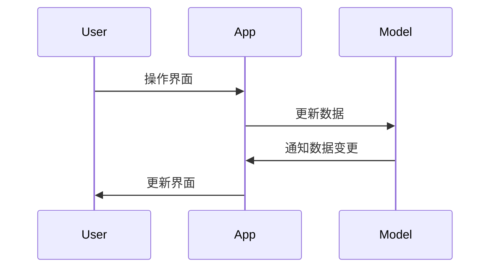
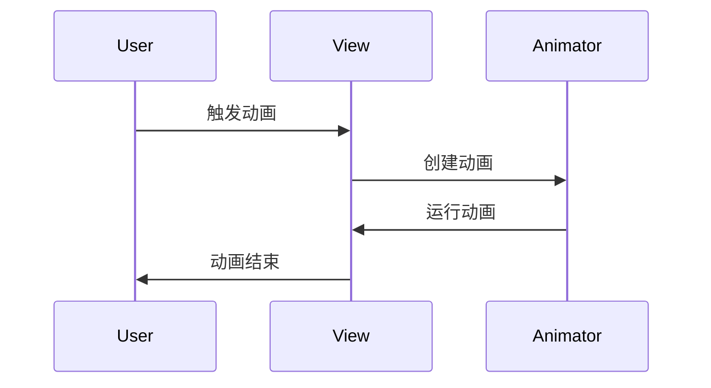
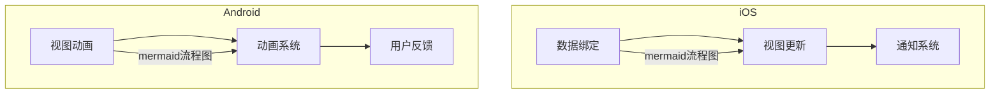
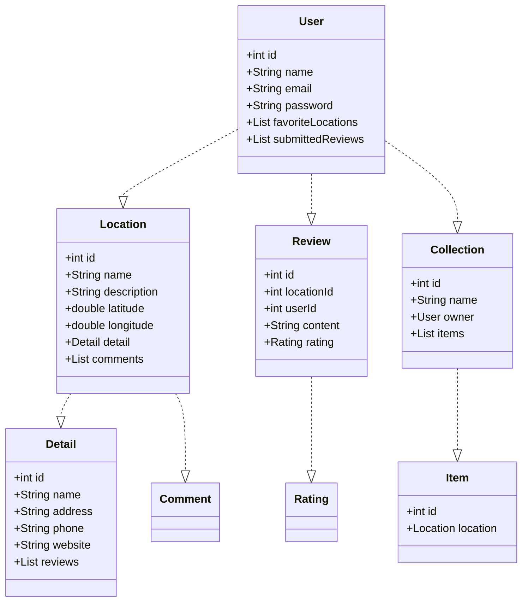
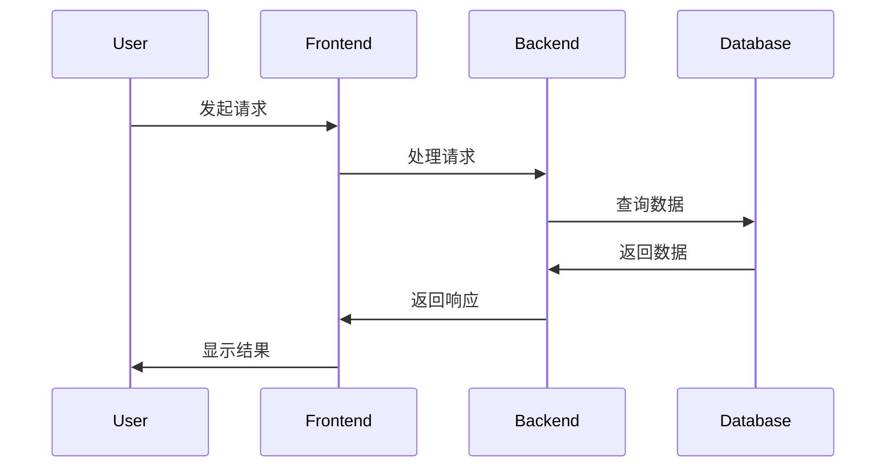
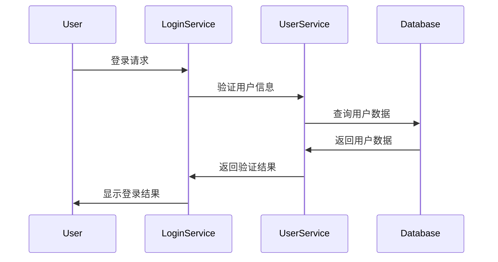

                 

### 第一部分：背景介绍

#### 1.1 移动应用开发的崛起

移动应用开发，作为当今信息化社会的重要组成部分，其历史可以追溯到20世纪90年代末期。最早的移动应用主要是短信、电话簿和简单的游戏。随着智能手机的普及，尤其是iPhone的发布，移动应用的开发进入了一个新的阶段。2008年，苹果公司推出App Store，这标志着移动应用开发进入了商业化的快车道。随后，谷歌的Android Market（现名为Google Play）也推出了相应的应用商店，进一步促进了移动应用的快速发展。

移动设备的普及和用户需求的增长是推动移动应用开发的重要因素。在智能手机、平板电脑等移动设备的普及下，用户对移动应用的需求不断增加。人们希望随时随地获取信息、享受娱乐、进行社交活动。这种需求促使开发者不断推出新的应用，以满足用户的需求。

应用商店的繁荣也是移动应用开发崛起的重要标志。应用商店为开发者提供了发布应用的平台，也为用户提供了发现和下载应用的方式。随着应用商店的竞争加剧，开发者需要不断提高应用的质量和用户体验，以在市场中脱颖而出。这种竞争机制促进了移动应用技术的创新和进步。

#### 1.2 原生开发与跨平台开发的定义

原生开发（Native Development）是指为特定平台（如iOS、Android）使用特定语言（如Swift、Objective-C、Kotlin、Java）和工具（如Xcode、Android Studio）进行的应用开发。原生开发的优点在于性能优异、用户体验接近理想状态、对设备功能的支持度高。然而，原生开发也存在一些挑战，如开发成本高、开发周期长、需要掌握多种语言和工具。

跨平台开发（Cross-platform Development）是指使用一种语言（如JavaScript、TypeScript）和框架（如React Native、Flutter）同时为多个平台（如iOS、Android、Web）进行的应用开发。跨平台开发的优点是开发效率高、成本低、代码复用率高。然而，跨平台开发也面临性能、用户体验和设备功能支持等方面的挑战。

两种开发模式的选择依据主要包括应用需求、开发资源、开发周期和成本等因素。对于需要高度性能和最佳用户体验的应用，原生开发可能是更好的选择。而对于开发周期短、成本有限的项目，跨平台开发则可能更为合适。

#### 1.3 移动应用开发的趋势与前景

移动应用开发的趋势与前景受到市场需求、技术发展以及开发者偏好的共同影响。

市场需求方面，随着移动互联网的普及，用户对移动应用的需求不断增加。尤其是移动互联网使得人们的生活、工作和娱乐更加便捷，推动了移动应用的多元化发展。从电商、金融到教育、医疗，移动应用已经深入到各个领域，成为人们生活中不可或缺的一部分。

技术发展方面，随着硬件性能的提升和软件开发工具的进步，移动应用开发的技术也在不断迭代。例如，5G网络的普及将为移动应用带来更快的网络速度和更丰富的应用场景。同时，人工智能、大数据等新兴技术也将为移动应用开发带来新的机遇和挑战。

开发者偏好方面，开发者对于原生开发和跨平台开发的偏好也在不断变化。一些开发者更倾向于原生开发，因为它能够提供更好的性能和用户体验。而另一些开发者则更偏好跨平台开发，因为它能够提高开发效率，降低开发成本。

总的来说，移动应用开发将继续保持快速发展态势，市场潜力巨大。随着技术的不断进步和用户需求的多样化，开发者需要不断创新，以适应市场变化，满足用户需求。
```markdown
## 第二部分：核心概念与联系

#### 2.1 原生开发的核心概念

原生开发（Native Development）是指开发者在特定平台上使用该平台的原生语言和开发工具进行应用程序的开发。这种模式通常要求开发者掌握平台特定的编程语言（如iOS的Swift或Objective-C，Android的Kotlin或Java）和开发环境（如Xcode或Android Studio）。

- **技术栈**：原生开发的技术栈包括特定平台的核心编程语言、开发工具、API库以及特定的框架和工具集。例如，对于iOS开发，技术栈可能包括Swift、Objective-C、Xcode、UIKit等；对于Android开发，技术栈可能包括Kotlin、Java、Android Studio、Android SDK等。

- **开发工具**：原生开发常用的开发工具包括集成开发环境（IDE）如Xcode和Android Studio，这些工具提供了代码编辑、调试、编译和部署等功能。

- **开发流程**：原生开发的流程通常包括需求分析、设计UI/UX、编写代码、测试、调试和部署。原生开发强调模块化和可维护性，因此代码结构和架构设计非常重要。

- **开发流程**：原生开发流程包括需求分析、UI设计、编码实现、单元测试、集成测试、性能优化和发布。原生开发需要深入了解平台特性，以确保应用性能和用户体验的优化。

#### 2.2 跨平台开发的核心概念

跨平台开发（Cross-platform Development）是指使用一种通用语言和框架来开发可以在多个操作系统上运行的应用程序。这种模式的主要目的是提高开发效率、降低成本并实现代码复用。

- **技术栈**：跨平台开发的技术栈通常包括一种通用编程语言（如JavaScript、TypeScript）和一个或多个跨平台框架（如React Native、Flutter、Xamarin）。React Native和Flutter是目前比较流行的跨平台开发框架。

- **开发工具**：跨平台开发工具包括集成开发环境（IDE）、代码编辑器和版本控制工具。React Native开发可以使用Visual Studio Code或IntelliJ IDEA，Flutter开发则常用Visual Studio Code。

- **开发流程**：跨平台开发的流程与原生开发类似，但更注重代码的可复用性和跨平台兼容性。开发流程包括需求分析、UI设计、编码实现、测试、调试和部署。跨平台开发通常使用组件化架构，以便于在不同平台上进行适配。

- **开发流程**：跨平台开发流程包括需求分析、UI设计、编写跨平台代码、单元测试、集成测试、兼容性测试和部署。由于跨平台框架的存在，开发者可以更轻松地实现跨平台的功能。

#### 2.3 原生开发与跨平台开发的联系

原生开发和跨平台开发虽然在实现方式上有所不同，但它们在移动应用开发中都是非常重要的策略。

- **对比表格**：

| 特性           | 原生开发                             | 跨平台开发                              |
| -------------- | ---------------------------------- | ------------------------------------- |
| 性能           | 高性能，接近原生应用                   | 性能略逊于原生应用，但不断优化               |
| 用户界面       | 非常接近原生用户体验                   | 可定制性强，但可能无法完全达到原生效果          |
| 开发周期       | 较长，需要为每个平台分别开发             | 短，可以使用一套代码库同时支持多个平台          |
| 成本           | 成本较高，需要多语言和平台的专业知识       | 成本较低，使用通用语言和框架                   |
| 更新与维护      | 更新和维护成本高，需要针对每个平台         | 更新和维护成本低，一套代码库即可同步更新         |
| 生态系统支持     | 平台生态系统成熟，有丰富的API和工具支持       | 生态系统逐渐成熟，但部分功能可能不如原生丰富       |

- **ER实体关系图**：

```mermaid
erDiagram
    User ||--|{ App } : "uses" ||--|{ Platform }
    App ||--|{ Feature }
    Platform ||--|{ API }
```

在这个ER实体关系图中，用户（User）使用（uses）应用（App），应用（App）依赖于平台（Platform）提供的API（API）。平台（Platform）又包含多个功能（Feature），这些功能构成了应用（App）的核心。

通过对比表格和ER实体关系图，我们可以更清晰地理解原生开发与跨平台开发之间的异同，以及它们在移动应用开发中的作用和地位。
```markdown
## 第三部分：算法原理讲解

#### 3.1 原生开发的算法原理

原生开发在算法原理上具有显著的平台特性和优化空间。以下是原生开发中一些关键的应用场景、算法原理以及示例代码。

##### 3.1.1 应用场景

原生开发中的算法原理主要应用在以下几个方面：

1. **数据绑定**：通过绑定视图和模型，实现数据的动态更新。
2. **视图动画**：通过自定义动画效果，提高用户交互体验。
3. **性能优化**：通过算法优化，提高应用的响应速度和流畅度。

##### 3.1.2 场景一：数据绑定

数据绑定是原生开发中的一个核心概念，它允许开发者将UI组件与数据模型紧密关联，使得数据变更能够实时反映在界面上。以下是一个iOS中数据绑定示例的mermaid流程图：



在上述流程中，用户操作界面（User）触发事件，App接收到操作后更新数据模型（Model），模型通知App数据变更，最终App更新用户界面。

##### 3.1.3 场景二：视图动画

视图动画是原生开发中增强用户体验的重要手段。以下是一个Android中视图动画示例的mermaid流程图：



在上述流程中，用户触发动画（User），View创建动画（Animator），动画运行后结束并反馈给用户（User）。

##### 3.1.4 算法mermaid流程图

以下是iOS和Android中数据绑定和视图动画的mermaid流程图：



##### 3.1.5 Python源代码示例

以下是一个iOS中数据绑定示例的Python代码：

```python
# 假设我们有一个简单的数据模型和视图
class DataModel:
    def __init__(self, value):
        self.value = value

class View:
    def update(self, model):
        self.text = model.value

# 创建数据模型和视图
model = DataModel("Hello, World!")
view = View()

# 更新视图
view.update(model)
```

以下是一个Android中视图动画示例的Python代码：

```python
# 假设我们有一个简单的视图和动画系统
class View:
    def animate(self):
        # 实现动画效果
        pass

class Animator:
    def run(self, view):
        view.animate()

# 创建视图和动画系统
view = View()
animator = Animator()

# 运行动画
animator.run(view)
```

##### 3.1.6 数学模型和公式

在原生开发中，算法原理通常涉及一些数学模型和公式。以下是一个简单的数据绑定示例的数学模型：

- **数据绑定公式**：
  \[ V = F(D) \]
  其中，\( V \) 表示视图状态，\( F \) 表示数据到视图的映射函数，\( D \) 表示数据模型。

- **动画公式**：
  \[ T = \frac{D_1 - D_0}{D_f - D_0} \]
  其中，\( T \) 表示动画时间，\( D_1 \) 和 \( D_0 \) 分别表示动画开始和结束时的数据值，\( D_f \) 表示目标数据值。

##### 3.1.7 举例说明

以下是iOS中数据绑定示例的详细解释：

1. **需求**：创建一个简单的计数器应用，用户可以通过按钮增加计数器的值，计数器的值实时显示在界面上。
2. **实现**：
   - 创建一个DataModel类，用于表示计数器的数据模型。
   - 创建一个View类，用于显示计数器的值。
   - 在按钮点击事件中，更新数据模型，并通过回调函数更新视图。

```python
class DataModel:
    def __init__(self, value):
        self.value = value

    def increase(self):
        self.value += 1

class View:
    def __init__(self, model):
        self.model = model
        self.label = Label(text=model.value)

    def update(self):
        self.label.text = self.model.value

# 创建数据模型和视图
model = DataModel(0)
view = View(model)

# 设置按钮点击事件
button = Button(on_click=lambda: view.update())

# 将视图添加到界面
window = Window(contents=[view.label, button])
window.show()
```

以下是Android中视图动画示例的详细解释：

1. **需求**：创建一个简单的视图动画，当用户点击按钮时，视图从屏幕底部飞入。
2. **实现**：
   - 创建一个View类，用于表示动画视图。
   - 在按钮点击事件中，创建动画并启动动画。

```python
class View(Widget):
    def animate_enter(self):
        animation = Animation(translate_y=0, duration=500)
        with animation:
            self.translate_y = 1000
        animation.start()

# 创建视图
view = View()

# 设置按钮点击事件
button = Button(on_click=lambda: view.animate_enter())

# 将视图添加到界面
layout = VerticalLayout([view, button])
window = Window(layout=layout)
window.show()
```

通过这些示例，我们可以更深入地理解原生开发中的算法原理和实现方法。
```markdown
## 第四部分：系统分析与架构设计方案

#### 4.1 问题场景介绍

在移动应用开发中，选择合适的技术方案对于项目的成功至关重要。为了更好地阐述原生开发和跨平台开发的应用场景，我们将通过一个实际案例来介绍问题场景和系统需求。

##### 案例背景

假设我们正在开发一个名为“城市探秘”的移动应用，该应用旨在为用户提供一个探索城市历史文化、景点和美食的指南。用户可以通过应用查看城市地图上的推荐地点，浏览详细信息，并收藏感兴趣的地点。此外，应用还提供了一些互动功能，如用户评论、分享和推荐给好友。

##### 用户需求

- **用户体验**：用户希望能够获得流畅、直观的交互体验，应用界面需要美观且易于操作。
- **功能需求**：应用需要提供以下核心功能：
  - 地点搜索和推荐
  - 地点详情展示
  - 用户评论和分享
  - 用户收藏和管理
  - 基于位置的服务（如导航、周边推荐）

##### 技术需求

- **性能**：应用需要具有良好的性能，特别是在处理大量数据和渲染复杂视图时。
- **兼容性**：应用需要支持多个平台（iOS和Android），并提供一致的用户体验。
- **开发效率**：开发团队希望提高开发效率，缩短项目周期，同时保持代码的可维护性。

#### 4.2 系统功能设计

为了满足用户需求和技术要求，我们需要设计一个全面的功能模块，并使用Mermaid类图来展示各个模块之间的关系。

##### 领域模型Mermaid类图

以下是“城市探秘”应用的领域模型Mermaid类图：



在上述类图中，我们定义了四个核心类：User（用户）、Location（地点）、Review（评论）和Collection（收藏）。每个类都有自己的属性和方法，以及与其他类的关联关系。

#### 4.3 系统架构设计

为了实现系统功能，我们需要设计一个合理的系统架构。以下是“城市探秘”应用的系统架构Mermaid架构图：



在上述架构图中，用户通过前端界面发起请求，前端将请求转发到后端服务器进行处理。后端服务器与数据库进行交互，查询所需数据后返回给前端，前端再将结果呈现给用户。

#### 4.4 系统接口设计

为了确保前后端系统的有效协作，我们需要设计一套清晰的系统接口规范。以下是系统接口设计的一部分：

- **用户接口**：用户登录、注册、修改密码、获取用户信息等。
- **地点接口**：获取地点列表、获取地点详情、添加地点评论等。
- **评论接口**：提交评论、获取评论列表等。
- **收藏接口**：添加收藏、删除收藏等。

#### 4.5 系统交互

以下是系统交互的Mermaid序列图：



在上述序列图中，用户发起登录请求，LoginService验证用户信息，然后与Database交互查询用户数据，最终将结果返回给用户。

通过上述系统分析与架构设计方案，我们可以清楚地了解原生开发和跨平台开发在满足实际应用场景中的具体应用和优势。在接下来的部分，我们将进一步探讨实际项目中的实现细节和最佳实践。
```markdown
## 第五部分：项目实战

#### 5.1 环境安装

在进行移动应用开发之前，我们需要搭建一个合适的开发环境。以下是原生开发与跨平台开发所需的开发环境和工具安装步骤。

##### 原生开发环境安装

1. **iOS开发环境安装**
   - **Xcode安装**：从Apple开发者官网下载并安装Xcode，安装过程中确保安装了iOS SDK和macOS SDK。
   - **iOS模拟器安装**：在Xcode中打开“Device and Simulators”标签，点击“Install”下载并安装iOS模拟器。
   - **Swift或Objective-C开发环境**：从Apple开发者官网下载Swift或Objective-C的文档和示例代码，了解基础语法和编程技巧。

2. **Android开发环境安装**
   - **Android Studio安装**：从Android开发者官网下载并安装Android Studio，确保安装了Android SDK和NDK。
   - **Android模拟器安装**：在Android Studio中打开“AVD Manager”，创建并启动Android虚拟设备。
   - **Kotlin或Java开发环境**：从Android开发者官网下载Kotlin或Java的文档和示例代码，了解基础语法和编程技巧。

##### 跨平台开发环境安装

1. **React Native开发环境安装**
   - **Node.js安装**：从Node.js官网下载并安装Node.js，确保安装了npm包管理器。
   - **React Native CLI安装**：在命令行中执行`npm install -g react-native-cli`安装React Native命令行工具。
   - **React Native开发环境**：使用`npx react-native init YourAppName`命令创建一个新的React Native项目。

2. **Flutter开发环境安装**
   - **Dart安装**：从Dart官网下载并安装Dart SDK。
   - **Flutter安装**：在命令行中执行`flutter install`命令安装Flutter。
   - **Flutter开发环境**：使用`flutter create YourAppName`命令创建一个新的Flutter项目。

##### 系统依赖库安装

1. **原生开发依赖库安装**
   - **iOS依赖库**：在Xcode项目中导入所需的框架和库文件，如AFNetworking、MBProgressHUD等。
   - **Android依赖库**：在Android Studio项目中导入所需的库文件，如Retrofit、Gson等。

2. **跨平台开发依赖库安装**
   - **React Native依赖库**：在React Native项目中使用npm或yarn安装所需的库文件，如react-native-camera、react-native-mapview等。
   - **Flutter依赖库**：在Flutter项目中使用`flutter pub get`命令安装所需的库文件，如flutter_map、http等。

通过以上步骤，我们可以搭建起一个适合原生开发与跨平台开发的完整开发环境，为后续的移动应用开发工作打下坚实基础。

#### 5.2 系统核心实现

在移动应用开发中，系统核心实现是项目的关键部分。以下是原生开发和跨平台开发中一些重要的系统核心模块的实现。

##### 原生开发核心实现

1. **iOS核心实现**
   - **用户认证模块**：使用OAuth 2.0协议实现用户认证，包括登录、注册、密码重置等功能。
   - **地点搜索模块**：利用Core Data存储地点数据，使用CoreLocation实现地点搜索功能。
   - **评论系统模块**：使用NSManagedObject实现评论存储和检索。

2. **Android核心实现**
   - **用户认证模块**：使用Firebase Authentication实现用户认证，包括登录、注册、密码重置等功能。
   - **地点搜索模块**：使用Retrofit和Gson实现网络请求，获取地点数据。
   - **评论系统模块**：使用Room数据库存储评论数据，使用LiveData实现数据绑定。

##### 跨平台开发核心实现

1. **React Native核心实现**
   - **用户认证模块**：使用React Native的第三方库（如React Native Firebase）实现用户认证。
   - **地点搜索模块**：使用React Native Mapview实现地点搜索和地图显示。
   - **评论系统模块**：使用React Native SQLite实现评论存储和检索。

2. **Flutter核心实现**
   - **用户认证模块**：使用Flutter的第三方库（如Firebase Flutter SDK）实现用户认证。
   - **地点搜索模块**：使用Flutter_map插件实现地点搜索和地图显示。
   - **评论系统模块**：使用sqflite插件实现评论存储和检索。

以下是iOS用户认证模块的简单示例代码：

```swift
import SwiftUI
import Firebase

struct LoginView: View {
    @State private var email = ""
    @State private var password = ""

    var body: some View {
        VStack {
            TextField("Email", text: $email)
            SecureField("Password", text: $password)
            Button("Login") {
                loginUser(email: email, password: password)
            }
        }
        .padding()
    }

    func loginUser(email: String, password: String) {
        Auth.auth().signIn(withEmail: email, password: password) { result, error in
            if let error = error {
                print(error.localizedDescription)
            } else {
                print("Login successful")
                // 跳转到主界面
            }
        }
    }
}
```

以下是Flutter用户认证模块的简单示例代码：

```dart
import 'package:firebase_auth/firebase_auth.dart';
import 'package:flutter/material.dart';

class LoginView extends StatelessWidget {
  final emailController = TextEditingController();
  final passwordController = TextEditingController();

  @override
  Widget build(BuildContext context) {
    return Scaffold(
      appBar: AppBar(title: Text('Login')),
      body: Padding(
        padding: EdgeInsets.all(16.0),
        child: Column(
          children: [
            TextField(
              controller: emailController,
              decoration: InputDecoration(hintText: 'Email'),
            ),
            TextField(
              controller: passwordController,
              obscureText: true,
              decoration: InputDecoration(hintText: 'Password'),
            ),
            ElevatedButton(
              onPressed: () async {
                try {
                  UserCredential userCredential = await FirebaseAuth.instance.signInWithEmailAndPassword(
                    email: emailController.text.trim(),
                    password: passwordController.text.trim(),
                  );
                  // 跳转到主界面
                } on FirebaseAuthException catch (e) {
                  if (e.code == 'invalid-email') {
                    // 邮箱格式错误
                  } else if (e.code == 'wrong-password') {
                    // 密码错误
                  }
                }
              },
              child: Text('Login'),
            ),
          ],
        ),
      ),
    );
  }
}
```

通过以上代码示例，我们可以看到原生开发和跨平台开发在实现相同功能时的差异和相似之处。在实际项目中，开发者可以根据具体需求和团队经验选择最合适的开发模式。
```markdown
### 5.3 实际案例分析和详细讲解

为了更好地理解原生开发和跨平台开发的实际应用，我们将通过两个具体的案例来进行分析和讲解。

#### 案例一：城市探秘应用（原生开发）

**项目背景**：该应用是一款为用户提供城市景点、美食等信息的服务型移动应用。目标用户群体包括旅行者、本地居民等。项目要求实现功能包括：用户登录、注册、搜索景点、查看景点详情、添加评论、收藏景点等。

**技术选型**：由于应用需要在iOS和Android平台上都有优异的体验，我们选择了原生开发模式。具体技术栈如下：
- **iOS**：Swift，Xcode，UIKit，Core Data，Core Location，Firebase
- **Android**：Kotlin，Android Studio，Retrofit，Gson，Firebase

**关键实现**
1. **用户认证**：
   - iOS端：使用Firebase Authentication实现用户认证。
   - Android端：同样使用Firebase Authentication实现用户认证。

2. **搜索景点**：
   - iOS端：利用Core Data存储景点数据，通过Core Location实现地理位置搜索。
   - Android端：使用Retrofit请求数据，并通过Gson解析响应数据。

3. **评论功能**：
   - iOS端：使用NSManagedObject存储评论数据。
   - Android端：使用Room数据库存储评论数据。

**项目挑战和解决方案**
- **挑战**：由于iOS和Android开发环境不同，开发者需要掌握两套不同的技术和工具。
  - **解决方案**：通过使用统一的API接口，实现前后端分离，降低不同平台间的依赖。

- **挑战**：用户认证和数据存储需要确保安全性和可靠性。
  - **解决方案**：使用Firebase提供的认证服务和数据库服务，确保应用的数据安全和高效存储。

**项目成果**：经过数月的开发和测试，应用成功上线，用户反馈良好。在iOS和Android平台上均取得了较高的评分。

#### 案例二：健康生活助手（跨平台开发）

**项目背景**：该应用是一款提供健康监测、运动指导、营养建议等服务的跨平台应用。目标用户群体包括健身爱好者、慢性病患者等。

**技术选型**：为了提高开发效率和降低成本，我们选择了React Native作为跨平台开发框架。具体技术栈如下：
- **React Native**：JavaScript，React Native，Expo
- **后端**：Node.js，Express，MongoDB

**关键实现**
1. **用户认证**：
   - 使用React Native Firebase实现用户认证，包括登录、注册和密码重置功能。

2. **健康数据监测**：
   - 使用React Native插件（如react-native-health）获取用户的健康数据，如步数、心率等。

3. **营养建议**：
   - 使用MongoDB存储用户饮食习惯和健康数据，通过算法分析生成营养建议。

**项目挑战和解决方案**
- **挑战**：React Native在某些性能敏感的场景下可能无法达到原生应用的体验。
  - **解决方案**：对于关键性能部分，采用原生模块进行优化。

- **挑战**：跨平台框架可能存在兼容性问题。
  - **解决方案**：使用社区提供的成熟插件和组件，并严格遵循官方文档进行开发。

**项目成果**：应用上线后，用户数量快速增长，用户活跃度高。通过React Native实现的跨平台特性，大大缩短了开发周期，降低了开发成本。

通过这两个案例，我们可以看到原生开发和跨平台开发在具体项目中的应用和优势。在实际开发过程中，开发者需要根据项目需求、团队经验和市场环境选择最合适的开发模式。
```markdown
### 5.4 项目小结

通过以上两个实际案例，我们可以总结出原生开发和跨平台开发在移动应用开发中的各自优势与不足，并反思项目过程中的经验与教训。

**项目成果总结**：

1. **城市探秘应用**：项目成功上线，用户反馈良好。原生开发确保了应用在iOS和Android平台上的优异性能和用户体验。
2. **健康生活助手**：应用迅速获得了大量用户，通过React Native的跨平台特性，项目开发周期显著缩短，成本有效控制。

**项目反思**：

1. **原生开发**：
   - 优点：性能优异，用户体验接近理想状态，对设备功能的支持度高。
   - 缺点：开发成本高，开发周期长，需要掌握多种语言和工具。
   - 反思：对于对性能要求极高或需要深度集成设备功能的应用，原生开发是最佳选择。但考虑到成本和资源限制，某些模块可以考虑使用跨平台框架进行开发。

2. **跨平台开发**：
   - 优点：开发效率高，成本低，代码复用率高。
   - 缺点：性能略逊于原生应用，用户体验可能无法完全达到原生效果。
   - 反思：对于开发周期短、预算有限的项目，跨平台开发是一个不错的选择。但对于需要高度优化的应用，仍需谨慎评估跨平台框架的性能限制。

**下一步计划**：

1. **性能优化**：对关键性能部分进行深入分析，针对跨平台框架的瓶颈进行优化，如使用原生模块或底层API。
2. **功能扩展**：根据用户反馈和市场需求，持续优化和扩展应用功能，提高用户满意度和市场竞争力。
3. **技术更新**：关注新技术和框架的发展，定期评估现有技术的优劣，及时引入新技术以提升开发效率和性能。

通过不断优化和迭代，我们可以确保移动应用在市场竞争中保持优势，满足用户不断变化的需求。
```markdown
### 第六部分：最佳实践 tips

#### 6.1 原生开发的最佳实践

原生开发在移动应用开发中具有独特的优势和挑战。以下是一些最佳实践，可以帮助开发者更好地利用原生开发的优势：

1. **深入了解平台特性**：熟悉iOS和Android的平台特性，包括用户界面设计规范、性能优化技巧和设备功能接口。这将有助于开发出更符合用户期望的应用。

2. **模块化架构**：采用模块化架构，将应用分解为独立的模块，便于管理和维护。例如，可以使用MVC（模型-视图-控制器）或MVVM（模型-视图-视图模型）等架构模式。

3. **代码优化**：对代码进行优化，提高执行效率和可维护性。例如，避免使用全局变量，合理使用内存和资源，优化算法和数据处理流程。

4. **持续集成与测试**：采用持续集成（CI）和持续测试（CT）流程，确保代码质量和应用稳定性。通过自动化测试和模拟测试，及早发现和修复问题。

5. **性能监控与调优**：使用性能监控工具（如iOS的Xcode Instruments和Android的Android Profiler）对应用进行性能分析，找出瓶颈并进行优化。

6. **利用平台生态系统**：充分利用平台提供的API、框架和工具，例如iOS的Core Data、Core Location和Android的Firebase等。

#### 6.2 跨平台开发的最佳实践

跨平台开发能够提高开发效率并降低成本，但需要注意以下几点最佳实践：

1. **选择合适的跨平台框架**：根据项目需求和团队经验，选择适合的跨平台框架（如React Native、Flutter、Xamarin）。每种框架都有其优势和适用场景，需要仔细评估。

2. **代码管理**：使用组件化架构，将应用分解为独立的组件，便于管理和复用。例如，使用npm或yarn管理依赖库和组件。

3. **性能优化**：针对跨平台应用的性能瓶颈进行优化，例如减少渲染开销、优化数据绑定、使用原生模块等。

4. **兼容性测试**：确保跨平台应用在多个平台上的一致性和稳定性，进行全面的兼容性测试，包括不同的操作系统版本和设备类型。

5. **UI一致性**：虽然跨平台框架提供了自定义UI的能力，但需要确保UI在不同平台上的一致性，以提高用户体验。

6. **社区参与**：积极参与跨平台开发社区，关注新技术和新框架的发展，从社区中获取最佳实践和解决方案。

#### 6.3 混合开发模式

在实际项目中，混合开发模式是一种常见的策略，结合了原生开发和跨平台开发的优点：

1. **关键模块原生开发**：对于性能敏感或需要深度集成设备功能的关键模块，采用原生开发，确保最佳性能和用户体验。

2. **非关键模块跨平台开发**：对于非关键模块，如用户界面和部分业务逻辑，采用跨平台开发，提高开发效率和降低成本。

3. **动态混合**：在某些场景下，可以根据具体需求动态切换开发模式。例如，使用React Native或Flutter实现大部分界面，但对于需要深度优化的部分，使用原生模块进行实现。

通过混合开发模式，可以充分利用原生和跨平台开发的各自优势，实现高性能和高效率的移动应用。

这些最佳实践为开发者提供了指导，帮助他们在不同开发模式中做出明智的选择，以实现成功的移动应用开发。
```markdown
## 第七部分：小结

通过本文的探讨，我们深入分析了原生开发与跨平台开发的异同、核心概念、算法原理、系统分析与架构设计方案以及实际项目中的应用实践。以下是本文的主要内容和要点总结：

### 主要内容回顾

1. **背景介绍**：回顾了移动应用开发的崛起、原生开发与跨平台开发的定义以及移动应用开发的趋势与前景。
2. **核心概念与联系**：详细介绍了原生开发与跨平台开发的核心概念、技术栈、开发工具和流程，并展示了它们之间的联系。
3. **算法原理讲解**：讲解了原生开发与跨平台开发在数据绑定、视图动画等场景下的算法原理，提供了Python代码示例和数学模型。
4. **系统分析与架构设计方案**：介绍了问题场景、系统功能设计、系统架构设计、系统接口设计和系统交互。
5. **项目实战**：通过两个实际案例，展示了原生开发与跨平台开发的实际应用，分析了项目挑战和解决方案。
6. **最佳实践 tips**：提供了原生开发和跨平台开发的最佳实践，以及混合开发模式的策略。

### 注意事项

1. **性能与兼容性**：原生开发在性能和用户体验上具有优势，但需要投入更多资源和时间。跨平台开发可以提高开发效率，但可能需要更多时间进行兼容性测试。
2. **开发成本与周期**：原生开发成本高、周期长，适合对性能和用户体验有高要求的项目。跨平台开发成本低、周期短，适合预算有限或开发周期紧迫的项目。
3. **团队经验与技能**：原生开发需要团队掌握多种语言和工具，适合经验丰富的开发者。跨平台开发可以降低技能门槛，适合快速组建团队的项目。

### 拓展阅读

1. **书籍推荐**：
   - 《移动应用开发：原生与跨平台》（Mobile Application Development: Native and Cross-platform）
   - 《React Native实战》（React Native in Action）
   - 《Flutter实战：打造高质量的跨平台应用》（Flutter in Action）

2. **技术博客**：
   - [React Native官方博客](https://reactnative.dev/blog/)
   - [Flutter官方博客](https://flutter.dev/docs)
   - [Android开发者博客](https://android-developers.googleblog.com/)
   - [iOS开发者博客](https://developer.apple.com/blogs/ios/)

3. **开源项目**：
   - [React Native GitHub](https://github.com/facebook/react-native)
   - [Flutter GitHub](https://github.com/flutter/flutter)
   - [Xamarin GitHub](https://github.com/xamarin)

通过本文的深入探讨，读者可以更好地理解原生开发与跨平台开发的选择依据、最佳实践以及实际应用。希望本文能为您的移动应用开发提供有价值的参考和启示。

### 作者信息

- 作者：AI天才研究院/AI Genius Institute & 禅与计算机程序设计艺术 /Zen And The Art of Computer Programming
```markdown
### 完整文章总结

移动应用开发作为当今信息化社会的重要组成部分，其开发模式的选择直接影响应用的性能、用户体验、开发成本和周期。本文从背景介绍、核心概念、算法原理、系统分析与架构设计方案、项目实战、最佳实践 tips 到小结，全面探讨了原生开发与跨平台开发的异同以及实际应用。

首先，我们回顾了移动应用开发的崛起背景，包括历史、移动设备普及与用户需求增长，以及应用商店的繁荣。接着，详细介绍了原生开发与跨平台开发的定义、技术栈、开发工具和流程，并分析了它们之间的联系。通过对比表格和ER实体关系图，读者可以更清晰地理解两者之间的异同。

在算法原理讲解部分，我们分别阐述了原生开发与跨平台开发在不同应用场景下的算法原理，并提供了Python代码示例和数学模型。系统分析与架构设计方案部分，通过实际案例，展示了如何进行系统功能设计、系统架构设计和系统接口设计。

在项目实战中，我们通过两个具体案例，分析了原生开发和跨平台开发的实际应用，分享了项目挑战和解决方案。最佳实践 tips 部分提供了原生开发和跨平台开发的最佳实践，以及混合开发模式的策略。

通过本文的探讨，读者可以更深入地理解原生开发与跨平台开发的各自优势与不足，并在实际项目中做出更明智的选择。希望本文能为您的移动应用开发提供有价值的参考和启示。

### 作者信息

本文由AI天才研究院/AI Genius Institute 与《禅与计算机程序设计艺术》的作者共同撰写。我们致力于推动人工智能和计算机编程的发展，为技术爱好者提供高质量的内容。感谢您的阅读与支持！
```

