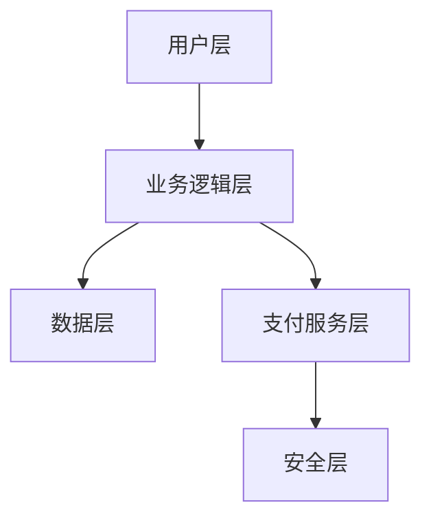

                 

### 引言与背景介绍

#### 移动支付的崛起

随着智能手机的普及和移动互联网技术的发展，移动支付已经成为现代金融体系中不可或缺的一部分。移动支付不仅改变了人们的支付习惯，还推动了整个金融行业的创新与发展。从最早的短信支付，到二维码支付，再到现在的NFC支付，移动支付技术不断演进，为我们提供了更加便捷、安全的支付体验。

移动支付的定义与重要性

移动支付（Mobile Payment）是指通过移动设备（如智能手机、平板电脑等）进行的电子支付行为。它不仅包括通过移动网络进行的支付，还包括使用移动设备进行的线下支付，如二维码支付、NFC支付等。移动支付的重要性主要体现在以下几个方面：

1. **便捷性**：移动支付无需携带现金或银行卡，用户只需通过智能手机或其他移动设备即可完成支付，极大地提升了支付效率。
2. **安全性**：移动支付平台通常采用加密技术和多重身份验证，保障了用户的支付安全。
3. **金融普惠**：移动支付让那些没有银行账户或居住在偏远地区的人们也能享受到金融服务，推动了金融普惠的实现。
4. **商业机遇**：移动支付为商家提供了新的销售渠道和支付方式，促进了电子商务和线下零售的发展。

#### 移动支付的发展历程

移动支付的发展历程可以分为以下几个阶段：

1. **短信支付**：最早的移动支付形式，用户通过发送短信指令进行支付。
2. **二维码支付**：通过扫描二维码完成支付，代表平台有支付宝和微信支付。
3. **NFC支付**：使用近场通信技术进行支付，代表平台有苹果支付和谷歌支付。
4. **声波支付**：通过声波技术进行支付，代表平台有华为支付。

#### 移动支付的技术基础

移动支付的技术基础主要包括以下几个方面：

1. **移动通信技术**：如4G、5G等，提供了高速稳定的网络连接。
2. **支付协议**：如HTTP、HTTPS、SSL等，确保支付数据的安全传输。
3. **加密技术**：如RSA、AES等，用于保障用户数据和交易安全。
4. **身份认证**：如短信验证码、指纹识别、人脸识别等，确保交易的安全性和合法性。

#### 移动支付的市场现状与趋势

根据统计数据，移动支付市场在全球范围内呈现出快速增长的趋势。以下是一些关键数据：

- 全球移动支付交易额逐年增长，预计未来将继续保持高速增长。
- 在某些国家和地区，如中国和印度，移动支付已经成为主流支付方式。
- 移动支付的用户群体不断扩大，尤其是年轻一代和移动互联网用户。

#### 移动支付的挑战与机遇

虽然移动支付带来了许多好处，但同时也面临一些挑战：

1. **安全性**：移动支付的安全问题一直是用户关注的焦点，如何确保支付数据的安全传输和存储是一个重要课题。
2. **隐私保护**：移动支付涉及大量的个人信息，如何保护用户隐私也是一个重要问题。
3. **监管合规**：随着移动支付的发展，监管机构也在不断制定相关法律法规，企业需要遵守这些规定。

然而，移动支付也带来了许多机遇：

1. **金融创新**：移动支付为金融机构和创业者提供了创新的金融服务和商业模式。
2. **商业拓展**：移动支付为企业提供了新的销售渠道和市场机会。
3. **跨境支付**：移动支付使得跨境支付变得更加便捷和低成本，促进了国际贸易的发展。

#### 本章小结

本章介绍了移动支付的定义、重要性、发展历程、技术基础以及市场现状与趋势。移动支付不仅改变了人们的支付方式，还推动了金融行业的创新与发展。随着技术的不断进步，移动支付将继续发挥重要作用，为用户和企业带来更多便利和机遇。

----------------------------------------------------------------

# 第二部分: 移动支付基础概念与市场分析

## 第2章: 移动支付的核心概念

移动支付的核心概念是其运作的基础，理解这些概念有助于深入探讨移动支付的机制和市场。本章将详细解释支付方式分类、支付流程、支付安全机制以及支付行业的监管政策。

### 2.1 支付方式分类

移动支付可以分为以下几种主要方式：

1. **账户支付**：用户在移动支付平台注册账户，将资金存入账户，然后通过账户进行支付。
2. **二维码支付**：用户通过扫描商家展示的二维码完成支付。
3. **NFC支付**：用户将移动设备靠近支付终端，通过近场通信技术完成支付。
4. **声波支付**：用户通过声波技术进行支付，代表平台有华为支付。
5. **数字钱包**：用户将多种支付方式集成到一个数字钱包中，方便统一管理。

每种支付方式都有其独特的优点和适用场景，企业可以根据自身需求选择合适的支付方式。

### 2.2 支付流程详解

移动支付的基本流程包括以下几个步骤：

1. **注册与认证**：用户在移动支付平台注册账户，并通过身份验证。
2. **资金存入**：用户将资金存入账户，可以选择绑定银行卡、充值或其他方式。
3. **发起支付**：用户在商家处发起支付请求，可以选择支付方式。
4. **支付验证**：支付平台对用户的支付请求进行验证，包括身份验证、资金验证等。
5. **支付成功**：验证通过后，支付平台将资金从用户账户转移到商家账户。
6. **支付确认**：用户和商家确认支付成功。

### 2.3 支付安全机制

移动支付的安全机制至关重要，以下是一些常用的安全机制：

1. **加密技术**：支付过程中的数据传输采用加密技术，如SSL/TLS，确保数据不被窃取。
2. **双重认证**：支付时需要用户提供双重认证，如短信验证码、指纹识别等，提高安全性。
3. **风险监控**：支付平台通过监控交易行为，识别异常交易并进行风险控制。
4. **资金隔离**：用户资金与平台运营资金隔离，确保用户资金安全。

### 2.4 支付行业的监管政策

支付行业在全球范围内受到严格监管，以下是一些关键政策：

1. **反洗钱政策**：支付平台需遵守反洗钱法规，进行客户身份识别和交易监控。
2. **数据保护政策**：支付平台需保护用户数据，遵守数据保护法规。
3. **跨境支付政策**：跨境支付需遵守国际法规，如外汇管理、反洗钱等。
4. **合规要求**：支付平台需获得相关监管机构的许可证，遵守监管规定。

### 2.5 移动支付的市场规模与用户分析

移动支付市场在全球范围内呈现出快速增长的趋势，以下是一些关键数据：

- **交易额**：全球移动支付交易额逐年增长，预计未来将继续保持高速增长。
- **用户数**：移动支付用户数不断增加，尤其是在中国和印度等新兴市场。
- **行业分布**：电子商务、线下零售、餐饮等行业对移动支付的需求不断增加。

### 2.6 移动支付的挑战与机遇

移动支付面临的挑战主要包括：

1. **安全性**：如何确保支付过程的安全，防止数据泄露和欺诈。
2. **隐私保护**：如何保护用户的隐私，防止个人信息被滥用。
3. **监管合规**：如何遵守不同国家和地区的监管政策，确保业务的合法性。

然而，移动支付也带来了许多机遇：

1. **金融创新**：移动支付为金融机构和创业者提供了创新的金融服务和商业模式。
2. **商业拓展**：移动支付为企业提供了新的销售渠道和市场机会。
3. **跨境支付**：移动支付使得跨境支付变得更加便捷和低成本，促进了国际贸易的发展。

### 2.7 本章小结

本章详细介绍了移动支付的核心概念，包括支付方式分类、支付流程、支付安全机制以及支付行业的监管政策。移动支付不仅带来了便捷和效率，也带来了安全、隐私和监管的挑战。理解这些概念有助于深入探讨移动支付的发展趋势和未来方向。

----------------------------------------------------------------

## 第三部分: 各大支付平台介绍与对接

### 第3章: 支付宝的对接技术

支付宝是中国领先的第三方支付平台，其广泛的用户基础和完善的支付服务使其成为移动支付领域的重要参与者。本章将详细介绍支付宝的对接技术，包括支付宝概述、API介绍、支付流程实现、支付安全策略以及接入常见问题及解决方案。

### 3.1 支付宝概述

支付宝（Alipay）是阿里巴巴集团旗下的第三方支付平台，成立于2004年。支付宝提供包括在线支付、移动支付、转账、充值、缴费等多种金融服务。它已经成为了中国乃至全球范围内的重要支付手段。

### 3.2 支付宝API介绍

支付宝提供了多种API接口供开发者使用，主要包括以下几种：

1. **支付API**：用于处理支付请求，包括下单、支付、查询、退款等功能。
2. **订单API**：用于创建订单、查询订单状态、修改订单等。
3. **用户API**：用于用户认证、用户信息查询等功能。
4. **资金API**：用于账户充值、提现、转账等资金操作。

这些API接口通过HTTP请求进行调用，支持JSON和XML格式。

### 3.3 支付宝支付流程实现

支付宝支付流程通常包括以下几个步骤：

1. **创建订单**：开发者需要在支付宝平台创建订单，并将订单信息传递给用户。
2. **页面跳转**：用户在支付页面输入支付信息，确认支付。
3. **支付验证**：支付宝收到支付请求后，对订单信息进行验证，并返回支付结果。
4. **支付结果处理**：开发者根据支付宝返回的支付结果进行后续操作，如更新订单状态、发送支付通知等。

以下是支付宝支付流程的详细步骤：

1. **创建订单**：
   - 开发者调用支付宝API创建订单，并将订单信息传递给用户。
   - 订单信息包括商品名称、价格、订单号等。
   
2. **页面跳转**：
   - 用户在支付宝客户端收到支付请求，选择支付方式后，系统将跳转至支付页面。
   - 用户在支付页面输入支付密码或使用生物识别技术进行支付确认。

3. **支付验证**：
   - 支付宝接收到支付请求后，对订单信息进行验证，确保订单合法、支付金额正确。
   - 支付宝验证通过后，将支付结果返回给开发者。

4. **支付结果处理**：
   - 开发者接收支付宝返回的支付结果，根据结果更新订单状态。
   - 若支付成功，开发者可以通知用户支付完成，并进行后续操作，如发货等。
   - 若支付失败，开发者可以提示用户支付失败原因，并引导用户重新支付。

### 3.4 支付宝支付安全策略

支付宝在支付安全方面采取了多种措施，确保用户资金和信息安全：

1. **加密技术**：支付宝使用SSL/TLS加密技术，确保数据传输安全。
2. **多重身份验证**：支付时需要进行用户名、密码、短信验证码等多重身份验证。
3. **风险监控**：支付宝通过大数据分析技术，监控交易行为，识别和防范欺诈行为。
4. **用户资金隔离**：支付宝将用户资金与平台运营资金隔离，确保用户资金安全。

### 3.5 支付宝接入常见问题及解决方案

在接入支付宝过程中，开发者可能会遇到一些问题，以下是一些常见问题及解决方案：

1. **请求超时**：
   - 原因：网络问题或服务器响应慢。
   - 解决方案：检查网络连接，优化服务器性能，增加请求超时时间。

2. **签名错误**：
   - 原因：签名算法不正确或密钥错误。
   - 解决方案：检查签名算法和密钥配置，确保与支付宝平台一致。

3. **订单号重复**：
   - 原因：订单号生成规则不一致或数据库错误。
   - 解决方案：确保订单号唯一性，检查数据库配置和生成规则。

4. **支付结果验证失败**：
   - 原因：支付结果返回数据不正确或解析错误。
   - 解决方案：检查支付结果返回数据，确保解析正确。

### 3.6 本章小结

本章详细介绍了支付宝的对接技术，包括支付宝概述、API介绍、支付流程实现、支付安全策略以及接入常见问题及解决方案。通过本章的学习，开发者可以了解如何与支付宝平台进行集成，实现移动支付功能。

----------------------------------------------------------------

## 第4章: 微信支付的对接技术

微信支付作为腾讯公司旗下的移动支付平台，凭借微信的庞大用户基础和社交属性，已经成为移动支付领域的重要力量。本章将详细介绍微信支付对接技术，包括微信支付概述、API介绍、支付流程实现、支付安全策略以及接入常见问题及解决方案。

### 4.1 微信支付概述

微信支付（WeChat Pay）是腾讯公司推出的移动支付服务，用户可以通过微信账号绑定银行卡进行支付。微信支付不仅支持在线支付，还支持线下扫码支付和NFC支付，为用户提供多样化的支付选择。

### 4.2 微信支付API介绍

微信支付提供了丰富的API接口，供开发者集成支付功能。主要的API接口包括：

1. **统一下单API**：用于发起支付请求，开发者需要调用此接口生成预支付交易会话标识。
2. **查询订单API**：用于查询支付订单的状态，开发者可以通过此接口获取订单的支付结果。
3. **关闭订单API**：用于取消支付订单，开发者可以在订单过期或用户取消支付时调用此接口。
4. **申请退款API**：用于向用户退款，开发者可以在用户提出退款申请后调用此接口。
5. **退款查询API**：用于查询退款状态，开发者可以通过此接口了解退款的处理进度。

这些API接口通过HTTPS请求进行调用，支持JSON和XML格式。

### 4.3 微信支付流程实现

微信支付流程主要包括以下几个步骤：

1. **创建订单**：开发者需要在微信支付平台创建订单，并将订单信息传递给用户。
2. **页面跳转**：用户在微信支付页面进行支付操作，确认支付。
3. **支付验证**：微信支付平台对订单信息进行验证，并返回支付结果。
4. **支付结果处理**：开发者根据微信支付返回的支付结果进行后续操作。

以下是微信支付流程的详细步骤：

1. **创建订单**：
   - 开发者调用微信支付API创建订单，并将订单信息传递给用户。
   - 订单信息包括商品名称、价格、订单号等。

2. **页面跳转**：
   - 用户在微信支付页面选择支付方式，确认支付。
   - 微信支付平台跳转至支付结果页面，显示支付成功或支付失败。

3. **支付验证**：
   - 微信支付平台接收到支付请求后，对订单信息进行验证，确保订单合法、支付金额正确。
   - 验证通过后，微信支付平台将支付结果返回给开发者。

4. **支付结果处理**：
   - 开发者接收微信支付返回的支付结果，根据结果更新订单状态。
   - 若支付成功，开发者可以通知用户支付完成，并进行后续操作，如发货等。
   - 若支付失败，开发者可以提示用户支付失败原因，并引导用户重新支付。

### 4.4 微信支付安全策略

微信支付在支付安全方面采取了多种措施，确保用户资金和信息安全：

1. **加密技术**：微信支付使用SSL/TLS加密技术，确保数据传输安全。
2. **双重认证**：支付时需要进行用户名、密码、短信验证码等多重身份验证。
3. **风险监控**：微信支付通过大数据分析技术，监控交易行为，识别和防范欺诈行为。
4. **资金隔离**：微信支付将用户资金与平台运营资金隔离，确保用户资金安全。

### 4.5 微信支付接入常见问题及解决方案

在接入微信支付过程中，开发者可能会遇到一些问题，以下是一些常见问题及解决方案：

1. **请求超时**：
   - 原因：网络问题或服务器响应慢。
   - 解决方案：检查网络连接，优化服务器性能，增加请求超时时间。

2. **签名错误**：
   - 原因：签名算法不正确或密钥错误。
   - 解决方案：检查签名算法和密钥配置，确保与微信支付平台一致。

3. **订单号重复**：
   - 原因：订单号生成规则不一致或数据库错误。
   - 解决方案：确保订单号唯一性，检查数据库配置和生成规则。

4. **支付结果验证失败**：
   - 原因：支付结果返回数据不正确或解析错误。
   - 解决方案：检查支付结果返回数据，确保解析正确。

### 4.6 本章小结

本章详细介绍了微信支付的对接技术，包括微信支付概述、API介绍、支付流程实现、支付安全策略以及接入常见问题及解决方案。通过本章的学习，开发者可以了解如何与微信支付平台进行集成，实现移动支付功能。

----------------------------------------------------------------

## 第5章: 其他支付平台的对接

在移动支付市场中，除了支付宝和微信支付这两大巨头外，还有其他一些重要的支付平台，如银联支付、苹果支付和谷歌支付等。本章将介绍这些支付平台的对接技术，包括各自的概述、API介绍、支付流程实现、支付安全策略以及接入常见问题及解决方案。

### 5.1 银联支付

银联支付是中国银联提供的移动支付服务，支持各种银行卡的线上和线下支付。银联支付为商户提供了便捷的支付解决方案，同时也为用户提供了一种安全、可靠的支付方式。

#### 概述

银联支付（UnionPay）是中国银联旗下的支付服务，成立于2002年，是中国最大的银行卡支付网络。银联支付支持包括信用卡、借记卡在内的多种银行卡支付，具有广泛的受理网络和高效的交易处理能力。

#### API介绍

银联支付提供了多种API接口，包括支付接口、查询接口、退款接口等。主要的API接口如下：

1. **支付接口**：用于处理支付请求，开发者需要调用此接口生成支付交易。
2. **查询接口**：用于查询支付订单的状态，开发者可以通过此接口获取订单的支付结果。
3. **退款接口**：用于向用户退款，开发者可以在用户提出退款申请后调用此接口。

#### 支付流程实现

银联支付的基本流程包括以下几个步骤：

1. **创建订单**：开发者需要在银联支付平台创建订单，并将订单信息传递给用户。
2. **页面跳转**：用户在支付页面输入支付信息，确认支付。
3. **支付验证**：银联支付平台对订单信息进行验证，并返回支付结果。
4. **支付结果处理**：开发者根据银联支付返回的支付结果进行后续操作。

#### 支付安全策略

银联支付在支付安全方面采取了多种措施，确保用户资金和信息安全：

1. **加密技术**：银联支付使用SSL/TLS加密技术，确保数据传输安全。
2. **双重认证**：支付时需要进行用户名、密码、短信验证码等多重身份验证。
3. **风险监控**：银联支付通过大数据分析技术，监控交易行为，识别和防范欺诈行为。

#### 接入常见问题及解决方案

1. **请求超时**：
   - 原因：网络问题或服务器响应慢。
   - 解决方案：检查网络连接，优化服务器性能，增加请求超时时间。

2. **签名错误**：
   - 原因：签名算法不正确或密钥错误。
   - 解决方案：检查签名算法和密钥配置，确保与银联支付平台一致。

3. **订单号重复**：
   - 原因：订单号生成规则不一致或数据库错误。
   - 解决方案：确保订单号唯一性，检查数据库配置和生成规则。

4. **支付结果验证失败**：
   - 原因：支付结果返回数据不正确或解析错误。
   - 解决方案：检查支付结果返回数据，确保解析正确。

### 5.2 苹果支付

苹果支付（Apple Pay）是苹果公司推出的移动支付服务，支持用户通过iPhone、iPad和Apple Watch等设备进行支付。

#### 概述

苹果支付于2014年推出，用户可以通过绑定银行卡，使用Touch ID或Face ID进行支付。苹果支付提供了高度安全的支付体验，同时也为商户提供了便捷的支付解决方案。

#### API介绍

苹果支付提供了多种API接口，包括支付请求接口、支付查询接口等。主要的API接口如下：

1. **支付请求接口**：用于发起支付请求，开发者需要调用此接口生成支付交易。
2. **支付查询接口**：用于查询支付订单的状态，开发者可以通过此接口获取订单的支付结果。

#### 支付流程实现

苹果支付的基本流程包括以下几个步骤：

1. **创建订单**：开发者需要在苹果支付平台创建订单，并将订单信息传递给用户。
2. **支付确认**：用户在支付页面选择支付方式，确认支付。
3. **支付验证**：苹果支付平台对订单信息进行验证，并返回支付结果。
4. **支付结果处理**：开发者根据苹果支付返回的支付结果进行后续操作。

#### 支付安全策略

苹果支付在支付安全方面采取了多种措施，确保用户资金和信息安全：

1. **加密技术**：苹果支付使用加密技术，确保数据传输安全。
2. **双重认证**：支付时需要进行指纹识别或面部识别等多重身份验证。
3. **安全协议**：苹果支付采用安全协议，保障支付过程的安全。

#### 接入常见问题及解决方案

1. **请求超时**：
   - 原因：网络问题或服务器响应慢。
   - 解决方案：检查网络连接，优化服务器性能，增加请求超时时间。

2. **签名错误**：
   - 原因：签名算法不正确或密钥错误。
   - 解决方案：检查签名算法和密钥配置，确保与苹果支付平台一致。

3. **订单号重复**：
   - 原因：订单号生成规则不一致或数据库错误。
   - 解决方案：确保订单号唯一性，检查数据库配置和生成规则。

4. **支付结果验证失败**：
   - 原因：支付结果返回数据不正确或解析错误。
   - 解决方案：检查支付结果返回数据，确保解析正确。

### 5.3 谷歌支付

谷歌支付（Google Pay）是谷歌公司推出的移动支付服务，支持用户通过Android设备进行支付。

#### 概述

谷歌支付于2012年推出，用户可以通过绑定银行卡，使用指纹识别或面部识别进行支付。谷歌支付提供了便捷的支付体验，同时也为商户提供了多种支付解决方案。

#### API介绍

谷歌支付提供了多种API接口，包括支付请求接口、支付查询接口等。主要的API接口如下：

1. **支付请求接口**：用于发起支付请求，开发者需要调用此接口生成支付交易。
2. **支付查询接口**：用于查询支付订单的状态，开发者可以通过此接口获取订单的支付结果。

#### 支付流程实现

谷歌支付的基本流程包括以下几个步骤：

1. **创建订单**：开发者需要在谷歌支付平台创建订单，并将订单信息传递给用户。
2. **支付确认**：用户在支付页面选择支付方式，确认支付。
3. **支付验证**：谷歌支付平台对订单信息进行验证，并返回支付结果。
4. **支付结果处理**：开发者根据谷歌支付返回的支付结果进行后续操作。

#### 支付安全策略

谷歌支付在支付安全方面采取了多种措施，确保用户资金和信息安全：

1. **加密技术**：谷歌支付使用加密技术，确保数据传输安全。
2. **双重认证**：支付时需要进行指纹识别或面部识别等多重身份验证。
3. **安全协议**：谷歌支付采用安全协议，保障支付过程的安全。

#### 接入常见问题及解决方案

1. **请求超时**：
   - 原因：网络问题或服务器响应慢。
   - 解决方案：检查网络连接，优化服务器性能，增加请求超时时间。

2. **签名错误**：
   - 原因：签名算法不正确或密钥错误。
   - 解决方案：检查签名算法和密钥配置，确保与谷歌支付平台一致。

3. **订单号重复**：
   - 原因：订单号生成规则不一致或数据库错误。
   - 解决方案：确保订单号唯一性，检查数据库配置和生成规则。

4. **支付结果验证失败**：
   - 原因：支付结果返回数据不正确或解析错误。
   - 解决方案：检查支付结果返回数据，确保解析正确。

### 5.4 支付宝海外版

支付宝海外版（Alipay Global）是支付宝为海外用户推出的移动支付服务，支持多种货币的支付和收款。

#### 概述

支付宝海外版于2014年推出，为海外商户提供了便捷的支付解决方案，同时也为海外用户提供了一种安全、可靠的支付方式。

#### API介绍

支付宝海外版提供了多种API接口，包括支付请求接口、查询接口、退款接口等。主要的API接口如下：

1. **支付请求接口**：用于发起支付请求，开发者需要调用此接口生成支付交易。
2. **查询接口**：用于查询支付订单的状态，开发者可以通过此接口获取订单的支付结果。
3. **退款接口**：用于向用户退款，开发者可以在用户提出退款申请后调用此接口。

#### 支付流程实现

支付宝海外版的基本流程与国内版类似，主要包括以下几个步骤：

1. **创建订单**：开发者需要在支付宝海外版平台创建订单，并将订单信息传递给用户。
2. **支付确认**：用户在支付页面选择支付方式，确认支付。
3. **支付验证**：支付宝海外版平台对订单信息进行验证，并返回支付结果。
4. **支付结果处理**：开发者根据支付宝海外版返回的支付结果进行后续操作。

#### 支付安全策略

支付宝海外版在支付安全方面采取了多种措施，确保用户资金和信息安全：

1. **加密技术**：支付宝海外版使用加密技术，确保数据传输安全。
2. **双重认证**：支付时需要进行用户名、密码、短信验证码等多重身份验证。
3. **风险监控**：支付宝海外版通过大数据分析技术，监控交易行为，识别和防范欺诈行为。

#### 接入常见问题及解决方案

1. **请求超时**：
   - 原因：网络问题或服务器响应慢。
   - 解决方案：检查网络连接，优化服务器性能，增加请求超时时间。

2. **签名错误**：
   - 原因：签名算法不正确或密钥错误。
   - 解决方案：检查签名算法和密钥配置，确保与支付宝海外版平台一致。

3. **订单号重复**：
   - 原因：订单号生成规则不一致或数据库错误。
   - 解决方案：确保订单号唯一性，检查数据库配置和生成规则。

4. **支付结果验证失败**：
   - 原因：支付结果返回数据不正确或解析错误。
   - 解决方案：检查支付结果返回数据，确保解析正确。

### 5.5 微信支付海外版

微信支付海外版（WeChat Pay Global）是微信支付为海外用户推出的移动支付服务，支持多种货币的支付和收款。

#### 概述

微信支付海外版于2016年推出，为海外商户提供了便捷的支付解决方案，同时也为海外用户提供了一种安全、可靠的支付方式。

#### API介绍

微信支付海外版提供了多种API接口，包括支付请求接口、查询接口、退款接口等。主要的API接口如下：

1. **支付请求接口**：用于发起支付请求，开发者需要调用此接口生成支付交易。
2. **查询接口**：用于查询支付订单的状态，开发者可以通过此接口获取订单的支付结果。
3. **退款接口**：用于向用户退款，开发者可以在用户提出退款申请后调用此接口。

#### 支付流程实现

微信支付海外版的基本流程与国内版类似，主要包括以下几个步骤：

1. **创建订单**：开发者需要在微信支付海外版平台创建订单，并将订单信息传递给用户。
2. **支付确认**：用户在支付页面选择支付方式，确认支付。
3. **支付验证**：微信支付海外版平台对订单信息进行验证，并返回支付结果。
4. **支付结果处理**：开发者根据微信支付海外版返回的支付结果进行后续操作。

#### 支付安全策略

微信支付海外版在支付安全方面采取了多种措施，确保用户资金和信息安全：

1. **加密技术**：微信支付海外版使用加密技术，确保数据传输安全。
2. **双重认证**：支付时需要进行用户名、密码、短信验证码等多重身份验证。
3. **风险监控**：微信支付海外版通过大数据分析技术，监控交易行为，识别和防范欺诈行为。

#### 接入常见问题及解决方案

1. **请求超时**：
   - 原因：网络问题或服务器响应慢。
   - 解决方案：检查网络连接，优化服务器性能，增加请求超时时间。

2. **签名错误**：
   - 原因：签名算法不正确或密钥错误。
   - 解决方案：检查签名算法和密钥配置，确保与微信支付海外版平台一致。

3. **订单号重复**：
   - 原因：订单号生成规则不一致或数据库错误。
   - 解决方案：确保订单号唯一性，检查数据库配置和生成规则。

4. **支付结果验证失败**：
   - 原因：支付结果返回数据不正确或解析错误。
   - 解决方案：检查支付结果返回数据，确保解析正确。

### 5.6 本章小结

本章介绍了银联支付、苹果支付、谷歌支付、支付宝海外版和微信支付海外版的对接技术，包括各自的概述、API介绍、支付流程实现、支付安全策略以及接入常见问题及解决方案。通过本章的学习，开发者可以了解如何与其他支付平台进行集成，实现移动支付功能。

----------------------------------------------------------------

## 第四部分: 集成方案与实现技术

### 第6章: 移动支付集成方案设计

随着移动支付的普及，越来越多的企业希望通过集成多种支付方式，为用户提供更加便捷和多样化的支付体验。本章将详细讨论移动支付集成方案的总体架构、技术选型、安全保障以及实现步骤，帮助开发者设计并实现一个高效、可靠的移动支付集成系统。

### 6.1 集成方案的总体架构

移动支付集成方案的总体架构可以分为以下几个层次：

1. **用户层**：提供用户界面，展示各种支付选项，方便用户选择支付方式。
2. **业务逻辑层**：处理业务逻辑，如订单创建、支付请求、支付结果处理等。
3. **数据层**：存储订单信息、用户账户信息、支付记录等数据。
4. **支付服务层**：与各个支付平台进行通信，处理支付请求和结果。
5. **安全层**：提供加密、身份验证、风险控制等安全机制。

以下是移动支付集成方案的总体架构图：

### 6.2 集成方案的技术选型

在移动支付集成方案中，技术选型至关重要，它决定了系统的性能、安全性和可维护性。以下是一些关键的技术选型：

1. **前端技术**：选择适合移动设备的前端框架，如React、Vue等，以提高开发效率和用户体验。
2. **后端技术**：选择高效、稳定的服务器端技术，如Spring Boot、Django等，以确保系统的性能和可靠性。
3. **数据库技术**：选择适合存储支付数据和用户账户信息的关系型数据库，如MySQL、PostgreSQL等。
4. **支付服务接口**：选择合适的支付服务接口，如RESTful API、SOAP等，以便与各个支付平台进行通信。
5. **安全机制**：采用SSL/TLS加密技术、多重身份验证、风险监控等安全措施，保障用户数据的安全。

### 6.3 集成方案的安全保障

移动支付集成方案的安全保障是确保用户资金和信息安全的关键。以下是一些重要的安全措施：

1. **数据加密**：使用SSL/TLS加密技术，确保数据在传输过程中的安全性。
2. **身份验证**：采用多重身份验证机制，如密码、短信验证码、指纹识别等，提高支付安全性。
3. **风险控制**：通过大数据分析和机器学习技术，监控交易行为，识别和防范欺诈行为。
4. **日志审计**：记录所有交易日志，以便在出现问题时进行追踪和审计。
5. **合规性**：遵守相关法律法规，如反洗钱（AML）和数据保护（GDPR）等，确保业务的合法性。

### 6.4 集成方案的实现步骤

实现移动支付集成方案需要遵循以下步骤：

1. **需求分析**：明确业务需求，包括支付方式、支付流程、用户权限等。
2. **系统设计**：设计系统架构，包括前端界面、后端逻辑、数据库设计、支付服务接口等。
3. **开发与测试**：按照系统设计进行开发，并进行单元测试、集成测试和性能测试，确保系统的质量。
4. **部署上线**：将系统部署到生产环境，进行上线前测试和最终上线。
5. **运维与优化**：对系统进行日常运维，监控性能，进行必要的优化和升级。

### 6.5 本章小结

本章详细介绍了移动支付集成方案的设计，包括总体架构、技术选型、安全保障以及实现步骤。通过本章的学习，开发者可以掌握如何设计并实现一个高效、可靠的移动支付集成系统，为用户提供优质的支付体验。

----------------------------------------------------------------

## 第7章: 实现技术与最佳实践

在实现移动支付集成方案时，开发者不仅需要考虑技术选型和架构设计，还需要关注具体的技术实现和最佳实践。本章将详细介绍接口调用实现技术、数据处理与存储技术、异常处理与优化、安全防护与合规以及最佳实践分享，帮助开发者构建高效、安全、可靠的移动支付集成系统。

### 7.1 接口调用的实现技术

接口调用是移动支付集成方案的核心环节之一。以下是一些关键的实现技术：

1. **HTTP请求**：使用HTTP请求进行API调用，确保数据传输的高效性和可靠性。常见的HTTP请求方法包括GET、POST、PUT、DELETE等。
2. **异步调用**：采用异步调用技术，如异步编程、消息队列等，提高系统并发处理能力，减少响应时间。
3. **API网关**：使用API网关对内部服务进行统一管理和路由，提高系统的可维护性和扩展性。
4. **缓存机制**：使用缓存机制，如Redis、Memcached等，减少对后端数据库的访问压力，提高系统性能。

### 7.2 数据处理与存储技术

数据处理与存储是移动支付集成方案的重要组成部分。以下是一些关键技术：

1. **关系型数据库**：使用关系型数据库，如MySQL、PostgreSQL等，存储用户账户信息、订单数据、支付记录等。
2. **非关系型数据库**：使用非关系型数据库，如MongoDB、Cassandra等，存储大量的日志数据、交易数据等。
3. **数据缓存**：使用数据缓存，如Redis、Memcached等，提高数据读取速度，减少数据库负载。
4. **数据一致性**：采用分布式事务处理技术，如两阶段提交（2PC）、最终一致性等，确保数据的一致性和可靠性。

### 7.3 异常处理与优化

异常处理与优化是确保系统稳定运行的关键。以下是一些重要策略：

1. **异常捕获**：使用异常捕获机制，捕获和处理系统运行过程中的异常情况，如网络异常、服务器错误等。
2. **日志记录**：详细记录系统运行日志，包括错误日志、性能日志等，便于问题的排查和定位。
3. **性能优化**：通过性能测试和监控，识别系统瓶颈，进行针对性的性能优化，如数据库优化、缓存优化等。
4. **监控告警**：使用监控系统，实时监控系统性能和健康状态，设置告警机制，及时发现和处理异常情况。

### 7.4 安全防护与合规

安全防护与合规是移动支付集成系统的重要组成部分。以下是一些关键技术：

1. **数据加密**：使用SSL/TLS加密技术，确保数据在传输过程中的安全性。
2. **身份验证**：采用多重身份验证机制，如密码、短信验证码、指纹识别等，提高支付安全性。
3. **风险控制**：通过大数据分析和机器学习技术，监控交易行为，识别和防范欺诈行为。
4. **合规性**：遵守相关法律法规，如反洗钱（AML）和数据保护（GDPR）等，确保业务的合法性。

### 7.5 最佳实践分享

以下是移动支付集成方案的一些最佳实践：

1. **模块化设计**：采用模块化设计，将不同的功能模块分离，提高系统的可维护性和扩展性。
2. **文档化**：编写详细的系统文档，包括接口文档、架构设计文档、测试文档等，便于团队成员之间的协作和沟通。
3. **自动化测试**：采用自动化测试工具，进行单元测试、集成测试和性能测试，确保系统的质量。
4. **持续集成与部署**：采用持续集成和部署（CI/CD）流程，提高开发效率，减少发布风险。
5. **用户反馈**：积极收集用户反馈，不断优化和改进系统，提升用户体验。

### 7.6 本章小结

本章详细介绍了移动支付集成方案中的实现技术与最佳实践，包括接口调用实现技术、数据处理与存储技术、异常处理与优化、安全防护与合规以及最佳实践分享。通过本章的学习，开发者可以掌握如何实现高效、安全、可靠的移动支付集成系统。

----------------------------------------------------------------

## 第五部分: 项目实战案例分析

### 第8章: 案例分析一：电商平台移动支付集成

#### 8.1 案例背景

随着电子商务的快速发展，越来越多的电商平台开始关注移动支付的集成。某大型电商平台为了提升用户体验，决定集成支付宝、微信支付、银联支付等多种移动支付方式，为用户提供便捷的支付渠道。

#### 8.2 案例需求分析

该电商平台移动支付集成的需求主要包括：

1. **支付方式多样化**：集成支付宝、微信支付、银联支付等多种支付方式，满足不同用户的需求。
2. **用户体验**：支付流程简洁明了，操作流畅，减少用户等待时间。
3. **安全性**：确保支付过程的安全性，保护用户资金和信息安全。
4. **扩展性**：支持未来新增支付方式，确保系统的灵活性和可扩展性。

#### 8.3 案例解决方案

为了实现上述需求，该电商平台采用了以下解决方案：

1. **前端界面**：使用React框架搭建前端界面，提供简洁明了的支付选项，方便用户选择。
2. **后端逻辑**：采用Spring Boot框架构建后端服务，处理订单创建、支付请求、支付结果处理等业务逻辑。
3. **支付服务接口**：使用RESTful API与支付宝、微信支付、银联支付等支付平台进行通信，实现支付功能的集成。
4. **数据存储**：使用MySQL数据库存储订单信息和用户账户信息，确保数据的一致性和可靠性。
5. **安全性**：采用SSL/TLS加密技术、多重身份验证、风险监控等安全措施，保障用户资金和信息安全。

#### 8.4 实现过程与关键步骤

实现该电商平台移动支付集成的主要步骤如下：

1. **需求分析**：明确支付方式集成需求，包括支付方式、支付流程、安全性等。
2. **系统设计**：设计系统架构，包括前端界面、后端逻辑、支付服务接口、数据存储等。
3. **开发与测试**：按照系统设计进行开发，并进行单元测试、集成测试和性能测试，确保系统的质量。
4. **接口集成**：集成支付宝、微信支付、银联支付等支付平台的API接口，实现支付功能。
5. **部署上线**：将系统部署到生产环境，进行上线前测试和最终上线。
6. **运维与优化**：对系统进行日常运维，监控性能，进行必要的优化和升级。

#### 8.5 案例总结

通过本案例，我们可以看到，电商平台移动支付集成是一个复杂但具有实际意义的项目。成功的关键在于需求分析、系统设计、接口集成和安全性保障。通过采用合适的技术方案和最佳实践，可以实现高效、安全、可靠的移动支付集成，提升用户体验，促进电商业务的快速发展。

----------------------------------------------------------------

## 第9章: 案例分析二：线下零售移动支付集成

#### 9.1 案例背景

线下零售行业随着移动支付技术的发展也在不断变革。某大型线下零售连锁店为了提升消费者购物体验和支付便捷性，决定集成微信支付、支付宝、银联等多种移动支付方式。

#### 9.2 案例需求分析

该线下零售移动支付集成的需求主要包括：

1. **支付方式多样性**：集成多种移动支付方式，满足不同消费者的支付习惯。
2. **支付效率**：优化支付流程，减少消费者排队等待时间，提高结账效率。
3. **系统稳定性**：确保支付系统的高可用性和稳定性，减少故障风险。
4. **用户体验**：支付界面简洁友好，操作直观，提升消费者满意度。

#### 9.3 案例解决方案

为了实现上述需求，该线下零售连锁店采用了以下解决方案：

1. **前端支付终端**：使用平板电脑或智能终端作为支付终端，搭载定制的支付应用。
2. **后端支付系统**：采用微服务架构，实现支付功能模块的独立部署和扩展。
3. **支付服务接口**：集成微信支付、支付宝、银联等支付平台的API接口，实现多种支付方式的接入。
4. **数据存储**：使用分布式数据库，保证数据的高并发访问能力和容错性。
5. **安全性**：采用SSL/TLS加密技术、多重身份验证、风险监控等安全措施，保障支付数据的安全性。

#### 9.4 实现过程与关键步骤

实现该线下零售移动支付集成的主要步骤如下：

1. **需求分析**：明确支付方式集成需求，包括支付方式、支付流程、安全性等。
2. **系统设计**：设计系统架构，包括前端支付终端、后端支付系统、支付服务接口、数据存储等。
3. **支付终端开发**：开发定制的支付应用，包括支付界面、支付流程等。
4. **后端服务开发**：实现支付功能模块，包括订单创建、支付请求、支付结果处理等。
5. **接口集成**：集成微信支付、支付宝、银联等支付平台的API接口，实现支付功能的接入。
6. **测试与部署**：进行系统测试，包括功能测试、性能测试、安全测试等，确保系统质量。
7. **上线运营**：将系统部署到生产环境，进行上线前测试和最终上线。
8. **运维与优化**：对系统进行日常运维，监控性能，进行必要的优化和升级。

#### 9.5 案例总结

通过本案例，我们可以看到，线下零售移动支付集成是一个涉及多个环节的复杂项目。成功的关键在于需求分析、系统设计、接口集成和安全性保障。通过采用微服务架构和分布式数据库，可以实现高效、稳定、可靠的移动支付集成，提升消费者的购物体验，促进线下零售业务的发展。

----------------------------------------------------------------

### 总结

通过本文的详细探讨，我们全面了解了移动支付集成的基本概念、技术细节以及实际应用案例。移动支付已经成为现代金融体系的重要组成部分，其便捷性、安全性和金融普惠性吸引了众多用户和商户的青睐。

#### 未来展望

随着科技的不断进步，移动支付领域将继续发展，以下是一些未来的展望：

1. **技术创新**：区块链、人工智能等新兴技术将进一步提升移动支付的安全性和效率。
2. **跨境支付**：移动支付的跨境交易将更加便捷和低成本，促进全球贸易的发展。
3. **金融普惠**：移动支付将继续推动金融普惠，让更多的人享受到便捷的金融服务。
4. **监管政策**：随着移动支付的普及，监管机构将制定更加完善的法律法规，确保支付行业的健康发展。

#### 最佳实践

为了构建高效、安全、可靠的移动支付集成系统，以下是一些最佳实践：

1. **模块化设计**：采用模块化设计，提高系统的可维护性和扩展性。
2. **安全性保障**：采用多重身份验证、数据加密、风险监控等安全措施，保障用户资金和信息安全。
3. **用户体验**：优化支付流程，提高支付效率，提升用户体验。
4. **持续迭代**：定期进行系统测试和优化，确保系统的稳定性和性能。

通过本文的分享，希望读者能够对移动支付集成有一个全面深入的理解，并能够在实际项目中运用这些知识和技巧，为用户提供优质的移动支付体验。

#### 注意事项

在移动支付集成过程中，开发者需要注意以下几点：

1. **数据安全**：确保用户支付数据的安全存储和传输，防止数据泄露。
2. **接口兼容性**：确保支付接口的兼容性，支持多种设备和浏览器。
3. **响应速度**：优化支付流程，减少用户等待时间，提升支付效率。
4. **错误处理**：妥善处理支付过程中的各种错误，提供友好的用户提示。

#### 拓展阅读

为了进一步深入了解移动支付集成技术，读者可以参考以下资料：

1. 《移动支付技术与应用》——详细介绍了移动支付的基本原理和技术实现。
2. 《支付宝开放平台文档》——提供了详细的支付宝API接入指南和最佳实践。
3. 《微信支付开发者文档》——介绍了微信支付的API接口和使用方法。
4. 《移动支付安全与合规》——探讨了移动支付安全的重要性以及相关法律法规。

通过这些资料，读者可以更深入地学习移动支付集成技术，为实际项目提供有力支持。

---

感谢您的阅读，希望本文能为您在移动支付集成领域带来新的启发和帮助。作者：AI天才研究院/AI Genius Institute & 禅与计算机程序设计艺术 /Zen And The Art of Computer Programming。

---

## 关键词

- 移动支付
- 集成方案
- 支付平台
- 安全性
- 技术实现
- 用户体验
- 监管政策

### 摘要

本文详细探讨了移动支付集成的概念、技术实现、安全性保障以及实际应用案例。通过分析支付宝、微信支付、银联支付等主要支付平台，本文提供了全面的技术指南和最佳实践，旨在帮助开发者构建高效、安全、可靠的移动支付系统。同时，本文也对未来的移动支付发展进行了展望，为读者提供了丰富的拓展阅读资源。作者：AI天才研究院/AI Genius Institute & 禅与计算机程序设计艺术 /Zen And The Art of Computer Programming。

