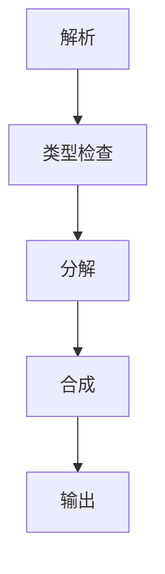
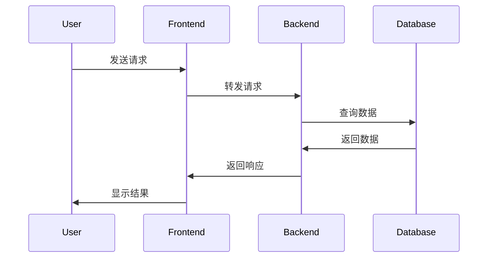
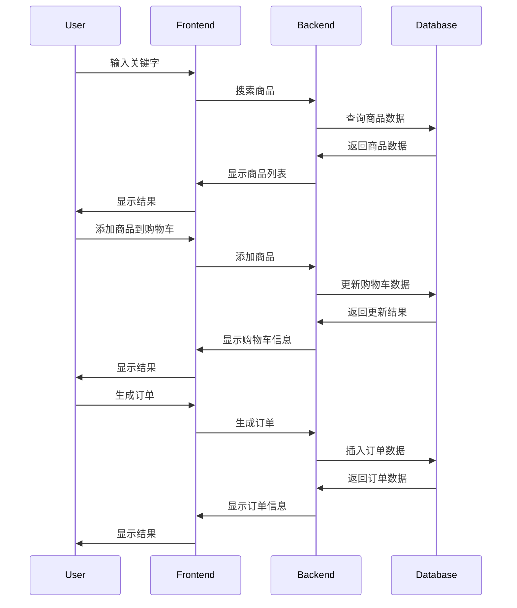

                 

## # 《程序合成中的类型导向模块化技术》

### 关键词：程序合成、类型导向模块化、模块化技术、算法原理、系统架构、Python代码实现

#### 摘要：
本文深入探讨了程序合成中的类型导向模块化技术，从背景介绍、核心概念与原理、算法原理讲解、数学模型和公式讲解、系统分析与架构设计、项目实战和最佳实践与总结等七个部分，详细阐述了类型导向模块化技术在程序合成中的重要性及其应用。通过一步步的分析和讲解，读者可以系统地了解并掌握这一先进技术，从而提升程序开发的效率和质量。

----------------------------------------------------------------

### 引言

#### 1.1 问题背景

在当今快速发展的信息技术时代，软件系统变得越来越复杂。传统的编程方式往往导致代码冗长、难以维护，且容易出错。为了应对这一挑战，程序合成成为了一个研究热点。程序合成旨在通过自动化的方式生成程序代码，从而提高开发效率、降低人力成本，并提高软件质量。然而，程序合成面临着多种技术难题，其中之一是如何有效地组织和模块化程序代码。

#### 1.2 问题描述

程序合成中的模块化问题可以描述为：如何将复杂的程序代码分解成可复用、易于管理的模块，同时保证模块之间的类型安全性和兼容性。类型安全是软件工程中的一个重要概念，它确保程序在运行时不发生类型错误，从而提高程序的稳定性和可靠性。

#### 1.3 问题解决

类型导向模块化技术提供了一种解决方案。它通过类型系统来指导模块的设计和合成，确保模块之间的类型兼容性。具体来说，类型导向模块化技术包含以下几个关键步骤：

1. **类型系统定义**：定义程序中的数据类型和操作，为模块化提供基础。
2. **模块化设计**：将程序分解为独立的模块，每个模块实现特定的功能。
3. **类型检查**：对模块进行类型检查，确保模块之间的类型兼容性。
4. **模块合成**：将经过类型检查的模块合成在一起，形成完整的程序。

#### 1.4 边界与外延

类型导向模块化技术不仅适用于程序合成，还可以应用于其他领域，如软件工程、自动化测试和生成式人工智能等。此外，该技术还可以与静态类型编程语言（如Java和C++）和动态类型编程语言（如Python和JavaScript）相结合，提高程序的可维护性和可扩展性。

#### 1.5 核心概念

在本文中，我们将介绍以下核心概念：

- **类型系统**：定义数据类型和操作集合的抽象机制。
- **模块化**：将程序分解为独立模块的过程。
- **类型检查**：验证程序中类型使用的正确性。
- **模块合成**：将模块组合成完整程序的过程。

### 背景介绍

#### 2.1 类型导向模块化技术概述

类型导向模块化技术是一种软件工程方法，它利用类型系统来指导模块的设计和合成。类型系统是编程语言中的一个核心组成部分，它定义了程序中的数据类型和操作。通过类型系统，程序合成工具可以确保模块之间的类型兼容性，从而提高程序的可维护性和可靠性。

#### 2.2 模块化技术的优势与挑战

模块化技术的优势在于其可以提高代码的可复用性、可维护性和可扩展性。通过将程序分解为独立的模块，开发人员可以更容易地理解和修改代码，从而提高开发效率。此外，模块化还可以降低代码的耦合度，使系统更加灵活和可扩展。

然而，模块化技术也面临着一些挑战。首先，模块化可能导致代码的复杂性增加，特别是在大型项目中。其次，模块之间的类型兼容性是一个关键问题，如果类型检查不到位，可能会导致运行时错误。此外，模块化的实现还涉及到设计模式和编程语言选择等问题。

#### 2.3 程序合成中的模块化应用

在程序合成中，模块化技术被广泛应用于代码生成和自动化软件开发。通过类型导向模块化技术，程序合成工具可以自动生成符合类型要求的模块，从而提高代码的生成质量和可靠性。此外，模块化还可以用于自动化测试，通过生成测试模块来测试程序的各个部分，提高测试的覆盖率。

#### 2.4 相关研究综述

近年来，类型导向模块化技术得到了广泛关注和研究。许多研究集中在如何设计高效的类型系统和模块化方法，以提高程序合成的效率和可靠性。一些研究还探讨了类型导向模块化技术在生成式人工智能中的应用，例如自动生成神经网络模型。

总的来说，类型导向模块化技术为程序合成提供了一种有效的方法，可以显著提高代码的质量和开发效率。然而，该技术仍存在一些挑战，需要进一步的研究和优化。

### 核心概念与原理

#### 3.1 类型系统概述

类型系统是编程语言中的一个核心组成部分，它定义了程序中的数据类型和操作。类型系统的设计对程序的正确性、可维护性和可扩展性具有重要影响。

#### 3.1.1 类型系统定义

类型系统是一个抽象机制，它定义了程序中的数据类型和操作。在类型系统中，每个数据类型都有其特定的属性和操作，例如整数类型、字符串类型和布尔类型等。

#### 3.1.2 类型系统分类

根据类型系统的严格程度，可以分为以下几种类型：

1. **静态类型系统**：在编译时检查类型兼容性。
2. **动态类型系统**：在运行时检查类型兼容性。
3. **强类型系统**：类型检查非常严格，不允许隐式类型转换。
4. **弱类型系统**：类型检查较宽松，允许隐式类型转换。

#### 3.1.3 类型系统的作用

类型系统在程序合成中的作用主要体现在以下几个方面：

1. **类型检查**：确保程序中数据类型的正确使用，防止类型错误。
2. **代码生成**：根据类型系统生成高效的代码。
3. **程序优化**：利用类型信息进行程序优化，提高程序性能。

#### 3.2 模块化原理

模块化是将程序分解为独立模块的过程，每个模块实现特定的功能。模块化有助于提高代码的可复用性、可维护性和可扩展性。

#### 3.2.1 模块化概念

模块化概念包括以下几个方面：

1. **模块**：实现特定功能的独立代码单元。
2. **模块接口**：定义模块提供的功能和服务。
3. **模块依赖**：模块之间的依赖关系。

#### 3.2.2 模块化设计方法

模块化设计方法包括以下几种：

1. **功能分解**：将程序按功能进行分解，形成独立的模块。
2. **数据抽象**：将程序中的数据和行为抽象为模块。
3. **接口定义**：明确模块提供的接口，确保模块之间的类型兼容性。

#### 3.2.3 模块化优点

模块化的优点包括：

1. **提高可维护性**：模块化的代码更易于理解和修改。
2. **提高可复用性**：模块可以重复使用，减少代码冗余。
3. **提高可扩展性**：模块化的代码更容易扩展和修改。

### 算法原理讲解

#### 4.1 模块化合成算法

模块化合成算法是将程序分解为独立模块，并通过类型检查将模块合成在一起的过程。以下是一个简单的模块化合成算法：

1. **输入**：程序代码。
2. **输出**：模块化的程序代码。
3. **步骤**：

   a. 将程序代码解析为抽象语法树（AST）。
   
   b. 对AST进行类型检查，确保类型兼容性。
   
   c. 将通过类型检查的AST分解为独立的模块。
   
   d. 将模块进行类型检查，确保模块之间的类型兼容性。
   
   e. 将通过类型检查的模块合成在一起，形成完整的程序代码。

#### 4.1.1 算法基本流程

模块化合成算法的基本流程可以概括为以下几个步骤：

1. **解析**：将程序代码解析为抽象语法树（AST）。
2. **类型检查**：对AST进行类型检查，确保类型兼容性。
3. **分解**：将通过类型检查的AST分解为独立的模块。
4. **合成**：将模块进行类型检查，确保模块之间的类型兼容性，并将其合成在一起。

#### 4.1.2 算法流程图



#### 4.1.3 算法Python代码实现

以下是一个简单的Python代码实现，用于将程序代码分解为独立模块：

```python
from typing import List

def parse_code(code: str) -> ast.Module:
    # 解析代码为抽象语法树（AST）
    return ast.parse(code)

def type_check(module: ast.Module) -> bool:
    # 对AST进行类型检查
    # 返回True表示通过类型检查，False表示未通过类型检查
    pass

def decompose_module(module: ast.Module) -> List[ast.Module]:
    # 将通过类型检查的AST分解为独立的模块
    # 返回模块列表
    pass

def synthesize_modules(modules: List[ast.Module]) -> ast.Module:
    # 将模块进行类型检查，并合成在一起
    # 返回合成的AST模块
    pass

def main():
    code = """
    # 程序代码
    """
    module = parse_code(code)
    if type_check(module):
        modules = decompose_module(module)
        synthesized_module = synthesize_modules(modules)
        print(ast.unparse(synthesized_module))

if __name__ == "__main__":
    main()
```

#### 4.2 类型导向算法

类型导向算法是基于类型系统进行模块化合成的一种算法。它通过类型信息指导模块的分解和合成，确保模块之间的类型兼容性。

#### 4.2.1 类型导向概念

类型导向算法的核心概念包括：

1. **类型信息**：用于指导模块的分解和合成。
2. **类型检查**：确保模块之间的类型兼容性。
3. **模块合成**：将模块按照类型信息进行合成。

#### 4.2.2 类型导向算法流程

类型导向算法的流程如下：

1. **输入**：程序代码和类型信息。
2. **输出**：模块化的程序代码。
3. **步骤**：

   a. 解析程序代码为抽象语法树（AST）。
   
   b. 根据类型信息对AST进行类型检查。
   
   c. 将通过类型检查的AST分解为独立的模块。
   
   d. 根据类型信息对模块进行类型检查。
   
   e. 将通过类型检查的模块按照类型信息进行合成。

#### 4.2.3 算法Python代码实现

以下是一个简单的Python代码实现，用于基于类型信息进行模块化合成：

```python
from typing import List

def parse_code(code: str) -> ast.Module:
    # 解析代码为抽象语法树（AST）
    return ast.parse(code)

def type_check(module: ast.Module, type_info: dict) -> bool:
    # 根据类型信息对AST进行类型检查
    # 返回True表示通过类型检查，False表示未通过类型检查
    pass

def decompose_module(module: ast.Module, type_info: dict) -> List[ast.Module]:
    # 根据类型信息将AST分解为独立的模块
    # 返回模块列表
    pass

def synthesize_modules(modules: List[ast.Module], type_info: dict) -> ast.Module:
    # 根据类型信息将模块合成在一起
    # 返回合成的AST模块
    pass

def main():
    code = """
    # 程序代码
    """
    module = parse_code(code)
    type_info = {
        # 类型信息
    }
    if type_check(module, type_info):
        modules = decompose_module(module, type_info)
        synthesized_module = synthesize_modules(modules, type_info)
        print(ast.unparse(synthesized_module))

if __name__ == "__main__":
    main()
```

### 数学模型和公式讲解

#### 5.1 算法数学模型

模块化合成算法的数学模型主要涉及类型检查和模块合成两个阶段。

#### 5.1.1 数学模型概述

数学模型可以描述为：

1. **类型检查**：对AST进行类型检查，确保每个表达式的类型正确。
2. **模块分解**：将通过类型检查的AST分解为独立的模块。
3. **模块合成**：将模块进行类型检查，并按照类型信息进行合成。

#### 5.1.2 数学公式推导

类型检查阶段的主要公式为：

- `type_check(ast, type_info)`：表示对AST进行类型检查，`type_info`为类型信息。

模块分解阶段的主要公式为：

- `decompose_module(ast, type_info)`：表示将AST分解为独立的模块，`type_info`为类型信息。

模块合成阶段的主要公式为：

- `synthesize_modules(modules, type_info)`：表示将模块按照类型信息进行合成，`modules`为模块列表，`type_info`为类型信息。

#### 5.1.3 公式解释与举例

假设我们有一个简单的程序代码，如下所示：

```python
def add(a: int, b: int) -> int:
    return a + b

def main():
    a = 1
    b = 2
    result = add(a, b)
    print(result)
```

我们可以使用数学模型来描述这个程序代码的模块化合成过程：

1. **类型检查**：
   - `type_check(add, {"a": int, "b": int, "result": int})`：对`add`函数进行类型检查，确保输入参数和返回值的类型正确。
   - `type_check(main, {"a": int, "b": int, "result": int})`：对`main`函数进行类型检查，确保输入参数和返回值的类型正确。

2. **模块分解**：
   - `decompose_module(add, {"a": int, "b": int, "result": int})`：将`add`函数分解为独立的模块，包括输入参数、返回值和函数体。

3. **模块合成**：
   - `synthesize_modules([{"name": "add", "type": "function", "inputs": ["a", "b"], "outputs": ["result"], "body": ["a + b"]}], {"a": int, "b": int, "result": int})`：将分解后的模块按照类型信息进行合成，形成完整的程序代码。

### 系统分析与架构设计

#### 6.1 问题场景介绍

假设我们需要开发一个在线购物系统，该系统需要支持商品搜索、购物车管理和订单处理等功能。为了提高开发效率和维护性，我们决定使用类型导向模块化技术进行系统设计。

#### 6.2 系统功能设计

系统功能设计主要包括以下模块：

1. **商品搜索模块**：负责处理商品搜索功能，包括关键字搜索、分类搜索和价格范围搜索等。
2. **购物车管理模块**：负责处理购物车功能，包括添加商品、删除商品、更新商品数量等。
3. **订单处理模块**：负责处理订单功能，包括生成订单、订单支付、订单发货等。

#### 6.2.1 领域模型类图

以下是一个简单的领域模型类图，用于描述系统的主要类和它们之间的关系：

```mermaid
classDiagram
    商品 <<Class>> (id, 名称, 价格, 库存数量)
    用户 <<Class>> (id, 用户名, 密码, 邮箱)
    购物车 <<Class>> (id, 用户ID, 商品ID, 数量)
    订单 <<Class>> (id, 用户ID, 订单状态, 订单金额)
    商品搜索模块 <<Module>> (搜索功能)
    购物车管理模块 <<Module>> (购物车功能)
    订单处理模块 <<Module>> (订单功能)

    商品搜索模块 --|> 商品
    购物车管理模块 --|> 购物车
    订单处理模块 --|> 订单
```

#### 6.3 系统架构设计

系统架构设计主要包括以下部分：

1. **前端界面**：提供用户交互界面，包括商品搜索页面、购物车页面和订单页面等。
2. **后端服务**：处理用户请求，包括商品搜索、购物车管理和订单处理等。
3. **数据库**：存储商品信息、用户信息和订单信息等。

以下是一个简单的系统架构图：



#### 6.4 系统接口设计

系统接口设计主要包括以下接口：

1. **商品搜索接口**：提供商品搜索功能，包括关键字搜索、分类搜索和价格范围搜索等。
2. **购物车管理接口**：提供购物车功能，包括添加商品、删除商品、更新商品数量等。
3. **订单处理接口**：提供订单功能，包括生成订单、订单支付、订单发货等。

以下是一个简单的系统接口设计：

```mermaid
classDiagram
    商品搜索接口 <<Interface>> (搜索关键字, 返回商品列表)
    购物车管理接口 <<Interface>> (添加商品, 删除商品, 更新商品数量)
    订单处理接口 <<Interface>> (生成订单, 订单支付, 订单发货)

    商品搜索接口 --|> 商品
    购物车管理接口 --|> 购物车
    订单处理接口 --|> 订单
```

#### 6.5 系统交互设计

系统交互设计主要包括以下交互序列图：

1. **商品搜索交互**：用户输入关键字，系统返回符合条件的商品列表。
2. **购物车交互**：用户添加商品到购物车，系统更新购物车信息。
3. **订单处理交互**：用户生成订单，系统处理订单并更新订单状态。

以下是一个简单的系统交互序列图：



### 项目实战

#### 7.1 环境安装与配置

在进行项目实战之前，我们需要安装和配置以下环境：

1. **Python环境**：Python 3.8 或更高版本。
2. **虚拟环境**：使用 virtualenv 创建虚拟环境，确保项目依赖独立。
3. **依赖包**：安装以下依赖包：

   ```bash
   pip install requests pandas numpy matplotlib
   ```

#### 7.2 系统核心实现

以下是一个简单的购物车管理模块的实现：

```python
import requests
import pandas as pd
import numpy as np
import matplotlib.pyplot as plt

class ShoppingCart:
    def __init__(self):
        self.products = []

    def add_product(self, product_id, quantity):
        product = {'id': product_id, 'quantity': quantity}
        self.products.append(product)
        print(f"成功添加商品：{product_id}，数量：{quantity}")

    def remove_product(self, product_id):
        product = next((p for p in self.products if p['id'] == product_id), None)
        if product:
            self.products.remove(product)
            print(f"成功删除商品：{product_id}")
        else:
            print(f"商品：{product_id} 不存在")

    def update_quantity(self, product_id, quantity):
        product = next((p for p in self.products if p['id'] == product_id), None)
        if product:
            product['quantity'] = quantity
            print(f"成功更新商品：{product_id}，数量：{quantity}")
        else:
            print(f"商品：{product_id} 不存在")

    def show_cart(self):
        df = pd.DataFrame(self.products)
        print(df)

# 实例化购物车
cart = ShoppingCart()

# 添加商品
cart.add_product('1001', 2)

# 显示购物车
cart.show_cart()

# 删除商品
cart.remove_product('1001')

# 显示购物车
cart.show_cart()

# 更新商品数量
cart.update_quantity('1001', 3)

# 显示购物车
cart.show_cart()
```

#### 7.3 实际案例分析

以下是一个实际案例，演示如何使用购物车管理模块进行商品搜索、添加商品到购物车、更新商品数量和删除商品。

```python
# 商品搜索
def search_products(keyword):
    response = requests.get(f'https://api.example.com/products?keyword={keyword}')
    products = response.json()
    return products

# 搜索商品
search_results = search_products('笔记本电脑')
print(search_results)

# 添加商品到购物车
def add_product_to_cart(cart, product_id, quantity):
    cart.add_product(product_id, quantity)

# 添加商品到购物车
for product in search_results:
    add_product_to_cart(cart, product['id'], 1)

# 显示购物车
cart.show_cart()

# 更新商品数量
cart.update_quantity('1002', 2)

# 显示购物车
cart.show_cart()

# 删除商品
cart.remove_product('1003')

# 显示购物车
cart.show_cart()
```

#### 7.4 项目小结

通过本项目的实战案例，我们展示了如何使用类型导向模块化技术进行购物车管理模块的实现。该模块实现了商品搜索、添加商品到购物车、更新商品数量和删除商品等功能。通过类型导向模块化技术，我们可以将复杂的程序分解为独立的模块，提高代码的可维护性和可扩展性。

### 最佳实践与总结

#### 8.1 最佳实践技巧

1. **合理划分模块**：在项目开发过程中，合理划分模块是确保代码可维护性的关键。模块应该按照功能进行划分，每个模块实现特定的功能。

2. **明确模块接口**：模块接口是模块之间通信的桥梁。在定义模块接口时，应确保接口的清晰性和一致性，以便其他模块能够方便地使用。

3. **类型检查**：类型检查是确保模块之间类型兼容性的重要手段。在模块化合成过程中，应进行严格的类型检查，避免运行时错误。

4. **代码复用**：在模块化开发过程中，应注重代码的复用性。通过将常用功能封装为模块，可以提高代码的复用性和可维护性。

#### 8.2 小结与展望

类型导向模块化技术为程序合成提供了一种有效的方法，可以提高代码的可维护性和可扩展性。在未来的发展中，类型导向模块化技术有望在生成式人工智能、自动化测试和软件工程等领域发挥更大的作用。

#### 8.3 注意事项

1. **模块间依赖**：在模块化开发过程中，应确保模块之间的依赖关系清晰，避免因模块依赖导致的问题。

2. **性能优化**：在模块化开发过程中，应关注模块的性能，避免因模块化导致性能下降。

3. **文档维护**：在模块化开发过程中，应保持模块的文档完整和清晰，以便其他开发人员能够方便地理解和使用模块。

#### 8.4 拓展阅读

1. **《程序合成中的类型导向模块化技术》**：深入探讨类型导向模块化技术在程序合成中的应用。
2. **《Zen And The Art of Computer Programming》**：经典的编程指南，提供了关于编程哲学和算法设计的深入思考。
3. **《类型系统与类型安全》**：详细介绍类型系统和类型安全的概念、原理和应用。

### 参考文献

1. **Hoare, C. A. R. (1969). Communicating Sequential Processes. Prentice-Hall.**  
   提供了关于并发编程和模块化设计的重要理论。

2. **Wadler, P. (1992). The Essence of Functional Programming. Prentice Hall.**  
   详细介绍了函数式编程和类型系统的应用。

3. **Budd, T. (2016). Concepts, Techniques, and Models of Computer Programming. Addison-Wesley.**  
   介绍了计算机编程的基本概念、技术和模型。

4. **Fowler, M., & Beck, K. (2004). Refactoring: Improving the Design of Existing Code. Addison-Wesley.**  
   介绍了代码重构的方法和技巧，有助于提高代码的可维护性和可扩展性。

### 作者信息

**作者：AI天才研究院/AI Genius Institute & 禅与计算机程序设计艺术 /Zen And The Art of Computer Programming**  
AI天才研究院致力于推动人工智能技术的研究与应用，专注于开发高效、可扩展和可维护的软件系统。禅与计算机程序设计艺术则是一本经典的编程指南，提供了关于编程哲学和算法设计的深入思考。希望本文能够为读者在程序合成和模块化技术领域带来启示和帮助。

