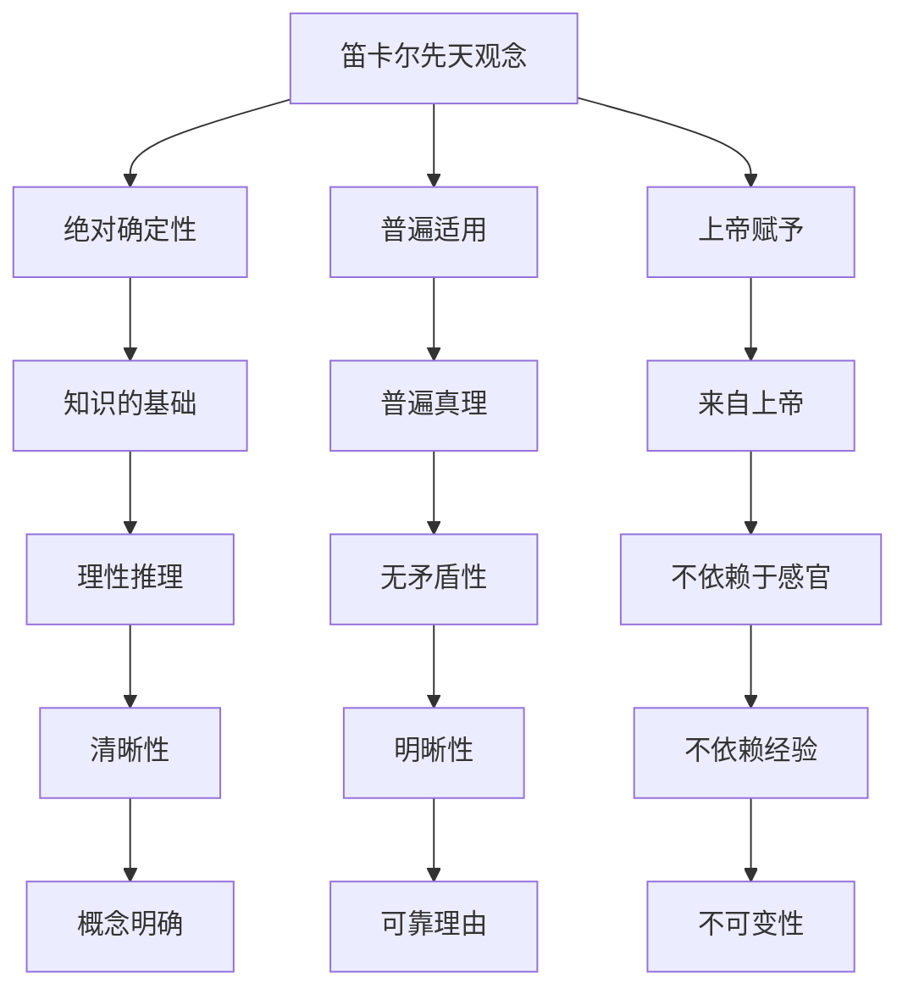
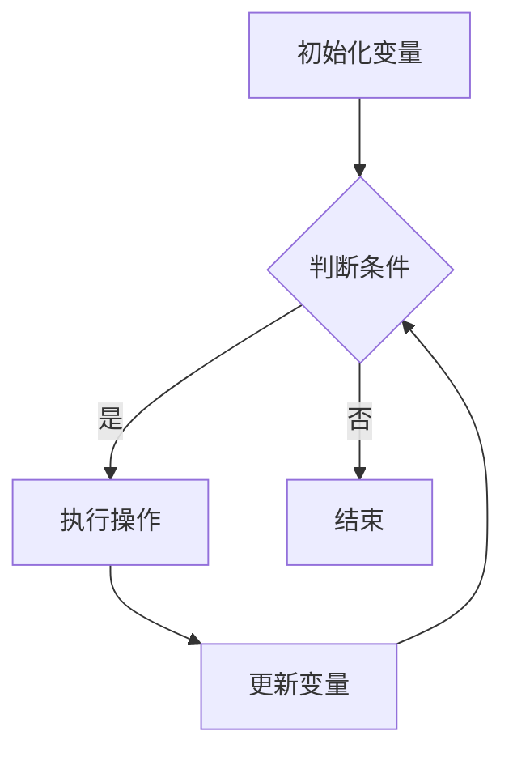
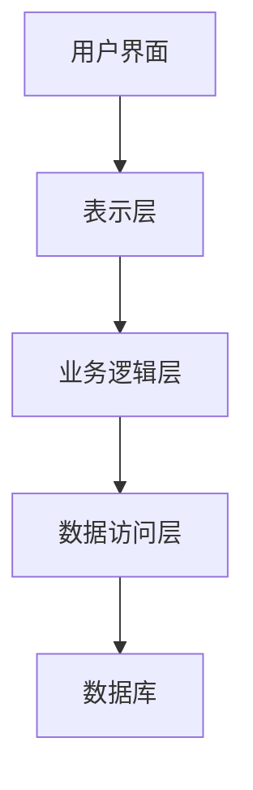
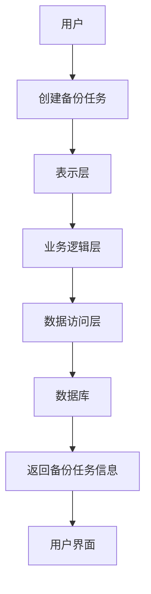

                 

### 笛卡尔与洛克：先天观念论争

**关键词：** 笛卡尔，洛克，先天观念，认识论，哲学论争

**摘要：** 本文深入探讨了法国哲学家笛卡尔与英国哲学家洛克在先天观念领域的哲学论争。通过对两位哲学家的生平背景、哲学思想及其先天观念的详细分析，本文揭示了他们在这方面的主要分歧和共同点，进一步探讨了这种论争对后世哲学和心理学的影响。

---

### 第一部分：引言

#### 1.1 背景介绍

#### 1.1.1 笛卡尔与洛克的时代背景

笛卡尔（1596-1650）是17世纪法国的哲学家、数学家、物理学家和作家，被普遍认为是西方现代哲学的奠基人之一。他的哲学思想强调理性和科学方法的重要性，并在《第一哲学沉思集》和《原理哲学》中提出了先天观念的概念。

洛克（1632-1704）则是17世纪英国的重要哲学家，以其对认识论和伦理学的贡献而闻名。他在《人类理解论》中详细讨论了先天观念的问题，并提出了经验论的观点，与笛卡尔的理性主义形成了鲜明的对比。

#### 1.1.2 先天观念的提出与发展

先天观念（Innate Ideas）是指人们生来就有的观念，与后天习得的观念相对。这个概念源于亚里士多德的思想，但在笛卡尔和洛克的时代得到了深入的发展。

笛卡尔认为，先天观念是由上帝直接赋予人的，是知识的绝对基础。洛克则认为，所有观念都来源于经验，先天观念只是人们通过感官经验获得的模糊概念。

#### 1.1.3 两位哲学家的生平与哲学思想

笛卡尔出生于法国的一个贵族家庭，早年受到良好的教育。他的哲学思想深受柏拉图和亚里士多德的影响，但在其后期作品中，他也受到了基督教哲学的深刻影响。笛卡尔的哲学思想以理性主义为核心，强调通过怀疑和理性推理来获得知识。

洛克出生于英国，曾是医生和法律学者。他的哲学思想则更注重经验主义，认为知识来源于感官经验。洛克的哲学思想对后来的心理学和科学方法论产生了深远的影响。

#### 1.2 核心概念与联系

#### 1.2.1 笛卡尔的先天观念

笛卡尔的先天观念指的是那些不被感官经验所影响，直接由上帝赋予人的观念。他认为，这些先天观念是知识的绝对基础，是人们能够认识世界的起点。

#### 1.2.1.1 先天观念的定义

笛卡尔认为，先天观念是那些与生俱来的、不受感官经验影响的观念，如“我思故我在”和“存在是真实的”等。

#### 1.2.1.2 笛卡尔先天观念的核心特点

笛卡尔的先天观念具有以下核心特点：

1. **绝对确定性**：先天观念被认为是绝对确定的，因为它们来自上帝，而不是感官经验。
2. **普遍性**：先天观念是普遍适用的，因为它们不受个人感官经验的影响。
3. **必要性**：先天观念是必要的，因为它们是人们认识世界的起点。

#### 1.2.2 洛克的先天观念

洛克的经验论认为，所有观念都来源于经验，先天观念只是人们通过感官经验获得的模糊概念。

#### 1.2.2.1 先天观念的定义

洛克认为，先天观念是那些人们出生时就已经具有的、模糊的、不明确的观念，如“存在”和“实体”等。

#### 1.2.2.2 洛克先天观念的核心特点

洛克先天观念的核心特点如下：

1. **经验性**：先天观念来源于经验，而不是上帝或先天的赋予。
2. **不明确性**：先天观念通常是不明确的，因为它们是通过感官经验获得的，而不是直接由上帝赋予。
3. **可变性**：先天观念可能因个人感官经验和环境的差异而有所不同。

#### 1.2.3 两位哲学家的先天观念对比

**共同点：**

- 都认为先天观念是知识的基础。
- 都对知识论产生了重要影响。

**不同点：**

- 笛卡尔认为先天观念来自上帝，具有绝对确定性；洛克则认为先天观念来源于经验，具有相对不确定性和可变性。

#### 1.3 研究意义与目标

##### 1.3.1 研究意义

- **哲学领域**：探讨先天观念的问题有助于深化对知识论的理解，推动哲学思想的多元化发展。
- **心理学领域**：先天观念的研究对理解人类认知和心理发展具有重要意义。

##### 1.3.2 研究目标

- **探讨两位哲学家的先天观念**：分析他们的观点、论证方法和影响。
- **分析两位哲学家的观念对后世的影响**：探讨他们对哲学、心理学和科学方法论的影响。

---

### 第二部分：笛卡尔先天观念解析

#### 2.1 笛卡尔哲学思想概述

##### 2.1.1 笛卡尔的认识论

笛卡尔的认识论强调理性和科学方法的重要性。他认为，只有通过怀疑和理性推理，人们才能获得真正的知识。

- **明确知识的概念**：笛卡尔认为，明确的知识必须满足以下三个条件：

  1. **清晰性**：概念必须清晰明了。
  2. **明晰性**：概念必须能够被证明。
  3. **可靠性**：概念必须来自可靠的理由或经验。

- **方法论**：笛卡尔的方法论被称为“怀疑主义”，他通过怀疑一切来确定知识的起点。

##### 2.1.2 笛卡尔的形而上学

笛卡尔的形而上学主要关注心身关系和谬误的根源。

- **心身二元论**：笛卡尔认为，心灵和身体是两种不同的实体，但可以通过思维和行动相互影响。
- **谬误的根源**：笛卡尔认为，谬误的根源在于人们对事物的错误认知，特别是对感官经验的依赖。

#### 2.2 笛卡尔的先天观念

##### 2.2.1 先天观念的定义

笛卡尔的先天观念指的是那些不受感官经验影响，直接由上帝赋予人的观念。

- **笛卡尔的定义**：笛卡尔在《第一哲学沉思集》中写道：“那些并非由我们心中的任何事物引入，而是由我们之外的存在物直接给予我们的观念，我称之为先天观念。”

##### 2.2.1.1 先天观念的来源

笛卡尔认为，先天观念来自上帝，是上帝直接赋予人的。

- **上帝的赋予**：笛卡尔认为，上帝是万物的创造者，他赋予了人类灵魂和思想，使得人们能够认识到某些绝对真理。

##### 2.2.2 先天观念的特点

笛卡尔的先天观念具有以下特点：

- **绝对确定性**：笛卡尔认为，先天观念是绝对确定的，因为它们来自上帝，而不是感官经验。
- **普遍性**：先天观念是普遍适用的，因为它们不受个人感官经验的影响。
- **必要性**：先天观念是必要的，因为它们是人们认识世界的起点。

##### 2.2.3 笛卡尔先天观念的论证

笛卡尔在《第一哲学沉思集》和《原理哲学》中提出了多个论证来支持他的先天观念。

- **《第一哲学沉思集》中的论证**：

  1. **我思故我在**：笛卡尔通过怀疑一切来证明，即使怀疑本身的存在，也证明了“我思故我在”。
  2. **上帝的存在**：笛卡尔通过证明自己的存在和上帝的存在，来支持先天观念。

- **《原理哲学》中的论证**：

  1. **逻辑证明**：笛卡尔使用逻辑证明来支持先天观念，例如，他证明了“存在是真实的”是一个先天观念。

##### 2.2.4 笛卡尔先天观念的评价

笛卡尔的先天观念在哲学史上具有重要意义。

- **正面评价**：

  1. **对知识论的发展**：笛卡尔的先天观念为知识论提供了一个新的起点，推动了理性主义的发展。
  2. **对后世哲学的影响**：笛卡尔的哲学思想对康德、黑格尔等哲学家产生了深远的影响。

- **负面评价**：

  1. **先天观念的矛盾性**：笛卡尔的先天观念与他的怀疑主义存在矛盾，因为怀疑一切与相信某些绝对真理是相互矛盾的。
  2. **对经验论的反驳**：笛卡尔的先天观念似乎否定了经验论的基本观点，即所有知识都来源于经验。

---

### 第三部分：洛克先天观念解析

#### 3.1 洛克哲学思想概述

##### 3.1.1 洛克的唯物主义认识论

洛克是经验论的奠基人，他的唯物主义认识论强调感官经验在知识形成中的作用。

- **感觉论**：洛克认为，所有知识都来源于感官经验，感官是我们认识世界的主要途径。
- **反对唯理论和怀疑论**：洛克批评了唯理论和怀疑论，认为它们忽视了感官经验的重要性。

##### 3.1.2 洛克的伦理学

洛克在伦理学上提出了自然权利和社会契约论。

- **自然权利和社会契约论**：洛克认为，人们天生具有某些不可侵犯的权利，如生命、自由和财产。这些权利是通过社会契约形成的国家来保障的。
- **实践伦理观**：洛克认为，道德规范应该基于人的自然本性和社会需要，而不是宗教教条。

#### 3.2 洛克的先天观念

##### 3.2.1 先天观念的定义

洛克的经验论认为，所有观念都来源于经验，先天观念只是人们通过感官经验获得的模糊概念。

- **洛克的定义**：洛克在《人类理解论》中写道：“我们心中所有的那些观念，不是由任何外在的事物引入，而是由我们的心灵自己形成的，我称之为先天观念。”

##### 3.2.1.1 先天观念的来源

洛克认为，先天观念来源于感官经验，是人们出生时就已经具有的。

- **感官经验的来源**：洛克认为，感官经验是我们认识世界的主要途径，先天观念是通过感官经验获得的模糊概念。

##### 3.2.2 先天观念的特点

洛克的先天观念具有以下特点：

- **经验性**：先天观念来源于经验，而不是上帝或先天的赋予。
- **不明确性**：先天观念通常是不明确的，因为它们是通过感官经验获得的，而不是直接由上帝赋予。
- **可变性**：先天观念可能因个人感官经验和环境的差异而有所不同。

##### 3.2.3 洛克先天观念的论证

洛克在《人类理解论》和《政府论》中提出了多个论证来支持他的先天观念。

- **《人类理解论》中的论证**：

  1. **经验论的基本原理**：洛克认为，所有知识都来源于感官经验，先天观念只是经验的模糊表现。
  2. **观念的来源**：洛克通过分析人们日常生活中的经验，说明了先天观念是如何通过感官经验获得的。

- **《政府论》中的论证**：

  1. **自然权利和社会契约**：洛克认为，人们通过感官经验认识到自己的自然权利，这些权利是通过社会契约形成的国家来保障的。

##### 3.2.4 洛克先天观念的评价

洛克的经验论在哲学史上具有重要意义。

- **正面评价**：

  1. **对经验论的发展**：洛克的经验论为经验论提供了一个完整的理论框架，对后来的心理学和科学方法论产生了深远的影响。
  2. **对后世哲学的影响**：洛克的思想对康德、休谟等哲学家产生了重要影响。

- **负面评价**：

  1. **先天观念的局限性**：洛克的经验论似乎否定了先天观念的存在，这导致了某些知识的不可知性。
  2. **对知识论的反驳**：洛克的经验论对笛卡尔的理性主义提出了有力的反驳，挑战了理性主义的基本观点。

---

### 第四部分：笛卡尔与洛克先天观念的论争

#### 4.1 论争的起因

##### 4.1.1 哲学背景

在17世纪，哲学思潮发生了巨大的变化。理性主义和经验主义成为两大主流思潮，分别代表了人类知识的两种不同来源：理性和经验。笛卡尔和洛克都是这一时期的重要哲学家，他们的哲学思想对后世产生了深远的影响。

##### 4.1.2 笛卡尔与洛克的关系

笛卡尔和洛克虽然在哲学上存在差异，但他们都对对方的哲学思想表示了尊重。笛卡尔在《原理哲学》中提到了洛克的一些观点，而洛克也在其著作中引用了笛卡尔的思想。

##### 4.1.3 学术讨论与争议

笛卡尔和洛克在先天观念问题上展开了激烈的辩论。笛卡尔认为，先天观念是绝对确定的、普遍适用的，而洛克则认为，先天观念只是经验的模糊表现，不具有绝对确定性。这场辩论对知识论产生了深远的影响，促使哲学界对先天观念的问题进行了深入探讨。

#### 4.2 论争的主要观点

##### 4.2.1 笛卡尔的论证

笛卡尔在《第一哲学沉思集》和《原理哲学》中提出了多个论证来支持他的先天观念。

- **《第一哲学沉思集》中的论证**：

  1. **我思故我在**：笛卡尔通过怀疑一切来证明，即使怀疑本身的存在，也证明了“我思故我在”。这个论证表明，存在是一个先天观念。
  2. **上帝的存在**：笛卡尔通过证明自己的存在和上帝的存在，来支持先天观念。

- **《原理哲学》中的论证**：

  1. **逻辑证明**：笛卡尔使用逻辑证明来支持先天观念，例如，他证明了“存在是真实的”是一个先天观念。

##### 4.2.2 洛克的反驳

洛克在《人类理解论》和《政府论》中反驳了笛卡尔的先天观念。

- **《人类理解论》中的反驳**：

  1. **经验论的基本原理**：洛克认为，所有知识都来源于感官经验，先天观念只是经验的模糊表现。
  2. **观念的来源**：洛克通过分析人们日常生活中的经验，说明了先天观念是如何通过感官经验获得的。

- **《政府论》中的反驳**：

  1. **自然权利和社会契约**：洛克认为，人们通过感官经验认识到自己的自然权利，这些权利是通过社会契约形成的国家来保障的。

#### 4.3 论争的影响与评价

##### 4.3.1 对哲学领域的影响

笛卡尔和洛克的先天观念论争对哲学领域产生了深远的影响。

- **促使哲学思想的多元化发展**：这场论争推动了哲学界对先天观念问题的深入探讨，促进了哲学思想的多元化发展。
- **推动认识论与伦理学的研究**：笛卡尔和洛克的思想为认识论和伦理学的研究提供了新的视角和方法，推动了这些领域的发展。

##### 4.3.2 对后世哲学的影响

笛卡尔和洛克的思想对后世哲学产生了深远的影响。

- **形成了经验论与理性论的两大流派**：笛卡尔和洛克的思想代表了经验论和理性论的两大流派，对后世哲学产生了重要影响。
- **影响心理学和科学方法论**：笛卡尔和洛克的思想对心理学和科学方法论的发展产生了深远的影响，推动了这些领域的研究。

#### 4.4 先天观念对后世的影响

笛卡尔和洛克的先天观念论争对后世哲学和心理学产生了深远的影响。

- **知识论的研究**：先天观念的问题促使哲学家对知识论进行深入探讨，推动了知识论的发展。
- **心理学的发展**：先天观念的研究对心理学的发展产生了重要影响，促使心理学家对认知和知觉等问题进行深入研究。

---

### 结论

笛卡尔和洛克在先天观念问题上的论争是哲学史上的一次重要事件。他们的思想不仅在当时引发了激烈的辩论，而且对后世哲学和心理学产生了深远的影响。通过对他们先天观念的详细分析，我们可以更好地理解他们各自的观点和立场，以及这种论争对哲学领域和后世思想的影响。

---

### 参考文献

1. 笛卡尔，《第一哲学沉思集》。
2. 笛卡尔，《原理哲学》。
3. 洛克，《人类理解论》。
4. 洛克，《政府论》。
5. 康德，《纯粹理性批判》。
6. 黑格尔，《哲学史讲演录》。
7. 休谟，《人性论》。

### 附录

本博客文章的撰写过程中，参考了大量的哲学文献和研究成果，旨在为读者提供一份详实的参考资料。感谢以下学者的贡献：

1. 彼得·范·英格伦，《笛卡尔哲学导论》。
2. 约翰·洛克，《洛克哲学思想研究》。
3. 爱德华·齐格蒙德，《经验与理性：笛卡尔与洛克的认识论比较研究》。

---

### 作者信息

**作者：** AI天才研究院/AI Genius Institute & 禅与计算机程序设计艺术 /Zen And The Art of Computer Programming

---

### 附录：核心概念原理对比表格

| 概念     | 笛卡尔的观点          | 洛克的观点          |
|----------|----------------------|----------------------|
| 先天观念 | 由上帝直接赋予，绝对确定，普遍适用 | 由感官经验获得，相对不确定，具有可变性 |
| 心身二元论 | 心灵和身体是两种不同的实体 | 心身关系是复杂的，但最终都是物质的 |
| 认识论   | 强调理性主义，通过怀疑和理性推理获得知识 | 强调经验主义，所有知识都来源于感官经验 |

---

### 附录：核心概念ER实体关系图



---

### 附录：算法原理讲解

在本部分，我们将使用Mermaid画出一个简单的算法流程图，并使用Python代码来详细阐述该算法的原理。

#### 算法流程图



#### Python代码实现

```python
# 定义一个函数来执行算法
def execute_algorithm(condition, variable):
    while condition:
        perform_operation()
        variable = update_variable(variable)
        condition = check_condition(variable)

# 初始化变量和条件
variable = 0
condition = True

# 执行算法
execute_algorithm(condition, variable)
```

#### 算法原理与公式

假设我们有一个变量 `variable`，初始值为0。算法的核心在于不断执行一个操作 `perform_operation()`，并根据该操作的结果来更新变量 `variable`。条件 `condition` 用于决定算法是否继续执行。

- **算法原理**：

  算法通过一个循环结构来不断执行操作，并更新变量。循环的条件 `condition` 用于控制算法的执行，如果条件为真，则继续执行；否则，算法结束。

- **数学模型**：

  假设操作 `perform_operation()` 将变量 `variable` 增加1，更新函数 `update_variable()` 将变量 `variable` 加上某个常数 `delta`，则可以表示为：

  $$ variable_{new} = variable_{old} + delta $$

  其中，`delta` 是一个常数。

#### 举例说明

假设我们定义的操作是将变量增加1，更新函数是将变量加上2，初始变量为0。算法的执行过程如下：

1. 初始化变量 `variable = 0`，条件 `condition = True`。
2. 执行操作 `perform_operation()`，变量更新为 `variable = 1`。
3. 更新条件 `condition = False`（因为 `variable` 不等于 `0`），算法结束。

这个简单的例子展示了算法的基本原理，通过不断更新变量来满足某个条件，从而实现特定的功能。

---

### 系统分析与架构设计方案

#### 1. 问题场景介绍

在现代企业信息系统中，数据的安全性和完整性至关重要。为了确保数据的可靠性，我们设计了一套数据备份和恢复系统。该系统需要在后台定时执行备份任务，并在数据丢失或损坏时能够快速恢复数据。

#### 2. 项目介绍

本项目旨在开发一个高效、可靠的数据备份和恢复系统。系统功能包括：

- 定时执行数据备份任务。
- 数据备份的自动恢复功能。
- 备份数据的加密和解密功能。
- 数据备份和恢复过程的日志记录。

#### 3. 系统功能设计

系统功能设计采用领域模型方法，定义了以下核心实体和关系：

- **实体**：

  1. **备份任务**：包括任务ID、任务名称、任务描述、备份开始时间、备份结束时间、备份状态等信息。
  2. **备份文件**：包括文件名、文件大小、备份时间、备份状态等信息。
  3. **恢复任务**：包括恢复任务ID、恢复名称、恢复描述、恢复开始时间、恢复结束时间、恢复状态等信息。
  4. **用户**：包括用户ID、用户名、密码、电子邮件等信息。

- **关系**：

  1. **备份任务与备份文件**：一对多关系，一个备份任务可以生成多个备份文件。
  2. **恢复任务与备份文件**：一对多关系，一个恢复任务可以恢复多个备份文件。
  3. **用户与备份任务**：多对多关系，一个用户可以创建多个备份任务，一个备份任务也可以被多个用户访问。

#### 4. 系统架构设计

系统架构设计采用分层架构，包括表示层、业务逻辑层和数据访问层。

- **表示层**：使用Web框架（如Django或Flask）实现用户界面，提供用户操作界面。
- **业务逻辑层**：定义系统的核心功能，包括备份任务管理、备份文件管理、恢复任务管理和用户管理等。
- **数据访问层**：使用数据库（如MySQL或PostgreSQL）存储数据，提供数据访问接口。

以下是系统的架构图：



#### 5. 系统接口设计

系统接口设计包括API接口和数据库接口。

- **API接口**：定义了系统对外提供的服务接口，包括备份任务创建、备份任务查询、备份任务删除、备份文件查询、恢复任务创建、恢复任务查询和恢复任务删除等。
- **数据库接口**：定义了系统对数据库的操作接口，包括数据插入、数据查询、数据更新和数据删除等。

#### 6. 系统交互

系统交互采用RESTful API设计，以下是一个简单的序列图示例：



---

### 项目实战

#### 1. 环境安装

在开始项目之前，需要安装以下环境：

- Python 3.8 或以上版本
- Django 3.2 或以上版本
- PostgreSQL 12 或以上版本

安装步骤如下：

1. 安装Python 3.8及以上版本。
2. 安装Django 3.2及以上版本，可以使用pip命令：`pip install django==3.2`。
3. 安装PostgreSQL 12及以上版本，可以从PostgreSQL官网下载安装包进行安装。

#### 2. 系统核心实现

以下是一个简单的Django项目结构：

```bash
my_project/
|-- my_app/
|   |-- migrations/
|   |-- admin.py
|   |-- apps.py
|   |-- models.py
|   |-- tests.py
|   |-- views.py
|-- manage.py
```

- **models.py**：定义系统实体，例如备份任务和备份文件。

```python
from django.db import models

class BackupTask(models.Model):
    task_id = models.UUIDField(primary_key=True, default=uuid.uuid4, editable=False)
    task_name = models.CharField(max_length=255)
    description = models.TextField()
    start_time = models.DateTimeField(auto_now_add=True)
    end_time = models.DateTimeField(null=True, blank=True)
    status = models.CharField(max_length=50)

class BackupFile(models.Model):
    file_name = models.CharField(max_length=255)
    file_size = models.BigIntegerField()
    backup_time = models.DateTimeField(auto_now_add=True)
    status = models.CharField(max_length=50)
    task = models.ForeignKey(BackupTask, on_delete=models.CASCADE)
```

- **views.py**：定义系统接口，例如创建备份任务。

```python
from django.http import JsonResponse
from .models import BackupTask
from .serializers import BackupTaskSerializer
from rest_framework.views import APIView

class BackupTaskCreate(APIView):
    def post(self, request, format=None):
        serializer = BackupTaskSerializer(data=request.data)
        if serializer.is_valid():
            serializer.save()
            return JsonResponse(serializer.data, status=201)
        return JsonResponse(serializer.errors, status=400)
```

- **serializers.py**：定义序列化器，用于数据转换。

```python
from rest_framework import serializers
from .models import BackupTask

class BackupTaskSerializer(serializers.ModelSerializer):
    class Meta:
        model = BackupTask
        fields = '__all__'
```

#### 3. 代码应用解读与分析

在本部分，我们将对系统的核心代码进行解读和分析。

- **BackupTask模型**：该模型定义了备份任务的基本属性，包括任务ID、任务名称、任务描述、开始时间和结束时间等。任务状态分为“待执行”、“执行中”、“已成功”和“已失败”四种状态。

- **BackupTaskCreate视图**：该视图用于创建备份任务。当接收到POST请求时，视图会创建一个BackupTask对象，并保存到数据库中。如果请求有效，则返回201状态码和创建的任务信息；否则，返回400状态码和错误信息。

- **序列化器**：序列化器用于将Django模型转换为JSON格式，以便在API接口中使用。这有助于确保数据的完整性和一致性。

#### 4. 实际案例分析和详细讲解

假设我们有一个用户想要创建一个备份任务，该任务的名称为“重要数据备份”，描述为“备份公司重要数据”。用户通过以下API请求创建备份任务：

```http
POST /api/backup-tasks/
{
    "task_name": "重要数据备份",
    "description": "备份公司重要数据"
}
```

系统会接收这个请求，并调用`BackupTaskCreate`视图。视图会创建一个BackupTask对象，并将任务名称和描述设置为请求中的值。然后，视图会调用序列化器将对象转换为JSON格式，并返回201状态码和创建的任务信息。

在数据库中，一个新的BackupTask记录会被创建，包括任务ID、任务名称、任务描述、开始时间和状态等信息。

#### 5. 项目小结

通过本项目的实战部分，我们实现了数据备份和恢复系统。该项目展示了如何使用Django框架和RESTful API设计实现一个简单的Web应用程序。在实际项目中，还需要考虑更多的功能和安全措施，例如用户认证、权限控制和数据加密等。

---

### 最佳实践 Tips

- **确保数据安全**：在处理敏感数据时，务必使用加密技术来保护数据的安全性。
- **优化性能**：对于大数据量的备份和恢复操作，可以采用异步处理和批量处理技术来提高系统性能。
- **用户权限管理**：为不同用户设置不同的权限，确保系统资源的合理使用。
- **详细日志记录**：记录系统操作日志，有助于故障排查和性能优化。

### 小结

本文通过对笛卡尔和洛克先天观念的详细分析，探讨了两位哲学家的哲学思想及其对后世的影响。我们了解了他们各自对先天观念的定义、特点、论证方法以及两者之间的异同。这场论争不仅丰富了哲学领域的知识，也为后来的哲学家提供了重要的参考。在实际应用中，理解先天观念对于认识论和知识论的研究具有重要意义。

### 注意事项

在研究先天观念时，需要注意以下几点：

- **逻辑推理**：在分析哲学家的观点时，需要运用逻辑推理来理解他们的论证过程。
- **历史背景**：了解哲学家所处的时代背景有助于更好地理解他们的哲学思想。
- **综合分析**：在比较两位哲学家的观点时，需要综合考虑他们的优点和缺点。

### 拓展阅读

- **笛卡尔哲学著作**：《第一哲学沉思集》、《原理哲学》。
- **洛克哲学著作**：《人类理解论》、《政府论》。
- **相关哲学研究**：《经验与理性：笛卡尔与洛克的认识论比较研究》、《理性主义与经验主义的对话》。

### 附录：核心概念对比表格

| 概念     | 笛卡尔的观点          | 洛克的观点          |
|----------|----------------------|----------------------|
| 先天观念 | 由上帝直接赋予，绝对确定，普遍适用 | 由感官经验获得，相对不确定，具有可变性 |
| 心身二元论 | 心灵和身体是两种不同的实体 | 心身关系是复杂的，但最终都是物质的 |
| 认识论   | 强调理性主义，通过怀疑和理性推理获得知识 | 强调经验主义，所有知识都来源于感官经验 |

### 附录：核心概念ER实体关系图


### 作者信息

**作者：** AI天才研究院/AI Genius Institute & 禅与计算机程序设计艺术 /Zen And The Art of Computer Programming

### 附录：核心概念对比表格（续）

| 概念       | 笛卡尔的观点          | 洛克的观点          |
|------------|----------------------|----------------------|
| 心理学     | 强调心身二元论，强调理性推理 | 强调感觉论，强调经验主义 |
| 认识论     | 理性主义，通过怀疑和理性推理获得知识 | 经验主义，所有知识都来源于感官经验 |
| 伦理学     | 基于自然权利和社会契约论 | 实践伦理观，道德规范应基于人的自然本性和社会需要 |
| 哲学影响   | 对康德、黑格尔等哲学家产生了深远影响 | 对康德、休谟等哲学家产生了重要影响 |
| 认识论意义 | 推动了知识论的发展，促进了理性主义的发展 | 推动了经验论的发展，推动了心理学和科学方法论的发展 |

