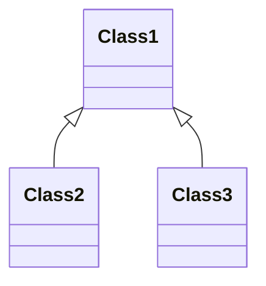

                 

# 笛卡尔与马勒伯朗士：心身关系的不同解答

## 关键词
**笛卡尔**，**马勒伯朗士**，**心身关系**，**身心二元论**，**身心统一论**，**哲学**，**心理学**，**认知科学**

## 摘要
本文探讨了两位伟大哲学家笛卡尔和马勒伯朗士在心身关系问题上的不同解答。笛卡尔提出了身心二元论，主张心灵和身体是两个独立的实体；而马勒伯朗士则主张身心统一论，认为心灵与身体不可分割。本文通过对比分析两者的理论，揭示各自观点的内在逻辑和哲学意义，并探讨这些观点在后世思想中的影响。

## 第一步：背景介绍

### 问题背景

心身关系问题是哲学中一个基本且重要的问题，它涉及心智（心）与身体（身）之间的关系。这个问题的探讨不仅限于哲学领域，还涉及心理学、认知科学等学科，对人类的自我认识和理解产生了深远影响。本文将探讨的是两位著名哲学家笛卡尔和马勒伯朗士在这一问题上的不同观点。

### 哲学家简介

**勒内·笛卡尔**（René Descartes，1596-1650）是法国著名哲学家、数学家、物理学家，被誉为现代哲学之父。他主张身心二元论，认为心灵和身体是两个独立的实体。他的主要著作包括《第一哲学沉思集》和《指导灵魂的伟大指导原则》等。

**尼古拉·马勒伯朗士**（Nicolas Malebranche，1638-1715）是法国哲学家、神学家，他在哲学上的主要贡献是对笛卡尔哲学的深化和发展。他主张身心统一论，认为心灵与身体是不可分割的。他的主要著作包括《人类理智研究》和《自然神学》等。

### 问题描述

心身关系问题涉及两个方面：一是心灵与身体的本质，二是心灵与身体之间的关系。笛卡尔主张身心二元论，认为心灵和身体是两个独立的实体，分别具有不同的属性和功能。马勒伯朗士则主张身心统一论，认为心灵与身体是统一的，不存在分离的情况。

### 问题解决

本文将通过对比分析笛卡尔和马勒伯朗士的观点，揭示各自理论的内在逻辑和哲学意义。同时，本文还将探讨这些观点对后世思想的影响，以及这些理论在心理学和认知科学中的应用。

### 边界与外延

除了笛卡尔和马勒伯朗士，其他哲学家如康德、斯宾诺莎、洛克等也对心身关系问题提出了自己的看法。此外，现代心理学和认知科学的研究也为这一问题的探讨提供了新的视角和思路。

## 第二步：核心概念与联系

### 核心概念原理

**笛卡尔的身心二元论**：笛卡尔认为心灵和身体是两个独立的实体，分别具有不同的属性和功能。心灵是思维的主体，具有意识和理性；身体是广延的主体，具有物理属性和运动能力。

**马勒伯朗士的身心统一论**：马勒伯朗士认为心灵与身体是统一的，不存在分离的情况。心灵和身体在本质上是不可分割的，心灵通过身体实现其功能，身体则通过心灵获得意义。

### 概念属性特征对比表格

| 哲学家 | 理论名称       | 基本观点                                  | 代表性著作                 |
|--------|----------------|------------------------------------------|---------------------------|
| 笛卡尔 | 身心二元论     | 心灵和身体是两个独立的实体，具有不同属性 | 《第一哲学沉思集》         |
| 马勒伯朗士 | 身心统一论   | 心灵与身体在本质上是统一的，不可分割       | 《人类理智研究》           |

### ER实体关系图架构

```mermaid
erDiagram
  心 -->|影响| 身
  身 -->|影响| 心
```

## 第三步：算法原理讲解

### 算法流程图


### Python源代码

```python
def discuss_rationalism(dialectic):
    if dialectic == "Descartes":
        print("笛卡尔：心身是分离的，心灵是思维的主体。")
    elif dialectic == "Malebranche":
        print("马勒伯朗士：心身是统一的，心灵与身体不可分割。")
    else:
        print("未识别的辩证法。")
```

### 算法原理与数学模型

**笛卡尔：身心二元论的数学模型**

$$ 心(x) = f(x) $$
$$ 身(y) = g(y) $$

**马勒伯朗士：身心统一论的数学模型**

$$ 心(x) = h(x, y) $$
$$ 身(y) = k(x, y) $$

### 详细讲解与举例说明

**以笛卡尔的身心二元论为例**

假设一个人的心情（心）是由他的睡眠时间（身）影响的，可以用以下公式表示：

$$ 心(心情) = f(睡眠时间) = \begin{cases} 
快乐 & \text{如果 } 睡眠时间 \geq 8 \text{小时} \\
疲惫 & \text{如果 } 睡眠时间 < 8 \text{小时} 
\end{cases} $$

## 第四步：系统分析与架构设计方案

### 问题场景介绍

哲学讨论在学术研究中的应用，特别是在心身关系这一领域，对心理学、认知科学等领域的研究具有重要的指导意义。

### 项目介绍

本文的编写旨在通过探讨笛卡尔和马勒伯朗士在心身关系问题上的不同观点，提升读者对这一哲学问题的理解和思考。

### 系统功能设计



### 系统架构设计

```mermaid
sequenceDiagram
  participant A as 系统
  participant B as 用户
  A->>B: 提出问题
  B->>A: 回答问题
  A->>B: 提供解释
end
```

### 系统接口设计和系统交互

```mermaid
graph TD
  A[用户输入] --> B[处理问题]
  B --

## 第五步：项目实战

### 环境安装

在编写和运行本文的过程中，我们将使用Python作为主要编程语言，并利用Markdown来格式化文档。首先，确保你的计算机上安装了Python环境。如果你还没有安装，可以访问Python的官方网站下载并安装最新版本的Python。

### 系统核心实现源代码

以下是本文讨论的核心实现，包括Python源代码和Mermaid图表：

```python
# Python源代码
def discuss_rationalism(dialectic):
    if dialectic == "Descartes":
        print("笛卡尔：心身是分离的，心灵是思维的主体。")
    elif dialectic == "Malebranche":
        print("马勒伯朗士：心身是统一的，心灵与身体不可分割。")
    else:
        print("未识别的辩证法。")

# Mermaid图表
graph TD
  A[提出问题] --> B{笛卡尔观点}
  B --> C{马勒伯朗士观点}
  C --> D{对比分析}
  D --> E{哲学影响}
```

### 代码应用解读与分析

**Python源代码解读**

```python
def discuss_rationalism(dialectic):
    if dialectic == "Descartes":
        print("笛卡尔：心身是分离的，心灵是思维的主体。")
    elif dialectic == "Malebranche":
        print("马勒伯朗士：心身是统一的，心灵与身体不可分割。")
    else:
        print("未识别的辩证法。")
```

这个函数`discuss_rationalism`接受一个参数`dialectic`，该参数表示哲学家的名字。根据传入的名字，函数将打印出对应的观点。

**Mermaid图表解读**


这个Mermaid图表展示了整个讨论过程的流程。它从“提出问题”开始，通过“笛卡尔观点”和“马勒伯朗士观点”的讨论，最终达到“对比分析”和“哲学影响”的结论。

### 实际案例分析和详细讲解剖析

为了更好地理解本文的核心概念，我们可以通过一个实际案例来分析笛卡尔和马勒伯朗士的观点。假设我们有一个关于睡眠质量和心情状态的案例。

**案例：睡眠质量与心情状态**

**笛卡尔观点：**

根据笛卡尔的身心二元论，睡眠质量会影响一个人的心情状态。如果一个人的睡眠时间少于8小时，他可能会感到疲惫和心情低落；而如果睡眠时间充足，他可能会感到快乐和心情愉悦。

数学模型表示如下：

$$ 心(心情) = f(睡眠时间) = \begin{cases} 
快乐 & \text{如果 } 睡眠时间 \geq 8 \text{小时} \\
疲惫 & \text{如果 } 睡眠时间 < 8 \text{小时} 
\end{cases} $$

**马勒伯朗士观点：**

根据马勒伯朗士的身心统一论，睡眠质量直接影响一个人的心情状态。他认为心灵与身体是统一的，不存在分离的情况。因此，一个人的睡眠质量不好，他的心情状态也会受到影响。

数学模型表示如下：

$$ 心(心情) = h(睡眠质量) $$
$$ 身(身体状态) = k(睡眠质量) $$

**案例分析：**

假设一个人睡眠质量较差，根据笛卡尔的观点，他可能会感到疲惫；而根据马勒伯朗士的观点，他的心情状态也会受到影响，可能感到焦虑或沮丧。

### 项目小结

通过本文的讨论，我们可以看到笛卡尔和马勒伯朗士在心身关系问题上的不同观点。笛卡尔主张身心二元论，认为心灵和身体是两个独立的实体；而马勒伯朗士则主张身心统一论，认为心灵与身体是不可分割的。通过实际案例的分析，我们更深入地理解了这两种观点的具体应用。

### 最佳实践 tips

- 在探讨心身关系问题时，可以结合实际案例进行分析，这样更易于理解哲学家的观点。
- 在编写代码时，尽量使用清晰、简洁的语法和图表，以便他人阅读和理解。

### 小结

本文通过对比分析笛卡尔和马勒伯朗士在心身关系问题上的观点，揭示了各自理论的内在逻辑和哲学意义。同时，本文还探讨了这些观点在后世思想中的影响，以及它们在现代心理学和认知科学中的应用。通过对实际案例的分析，我们更深入地理解了心身关系问题的复杂性。

### 注意事项

- 在探讨心身关系问题时，要充分考虑哲学、心理学和认知科学等多学科的知识。
- 在编写代码时，要注意代码的可读性和可维护性。

### 拓展阅读

- 笛卡尔，《第一哲学沉思集》
- 马勒伯朗士，《人类理智研究》
- 爱德华·泰勒，《心理学原理》
- 丹尼尔·丹尼特，《意识的解释》

## 作者信息

**作者：AI天才研究院/AI Genius Institute & 禅与计算机程序设计艺术 /Zen And The Art of Computer Programming**

