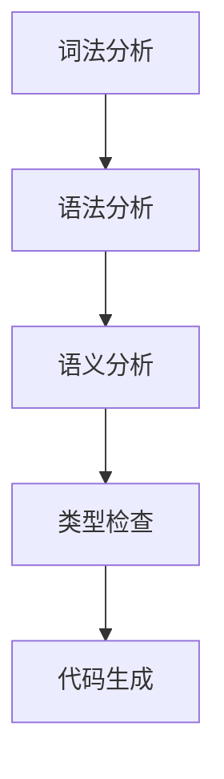
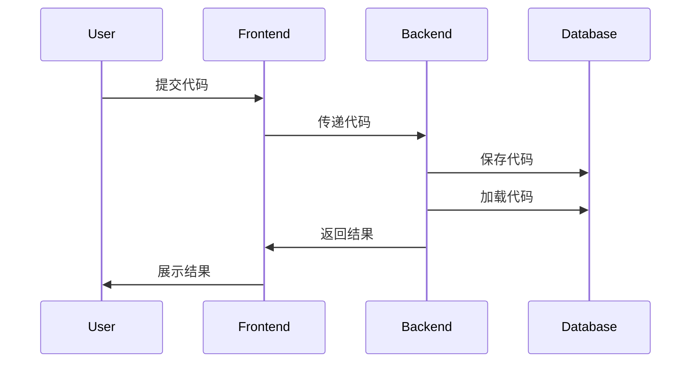

                 

# 类型推断：简化代码与保持类型安全的平衡

## 关键词

- 类型推断
- 编程语言
- 代码简化
- 类型安全
- 算法原理
- 数学模型
- 实际应用
- 项目实战

## 摘要

类型推断是编程语言中的一个核心概念，它通过自动推导变量类型，简化代码编写过程，同时保证类型安全。本文将深入探讨类型推断的基础概念、算法原理、数学模型、实际应用和项目实战，以帮助读者理解类型推断在简化代码和保持类型安全之间的平衡。

## 目录大纲

### 第一部分：引言

1. 引言
   1.1 问题背景
   1.2 问题描述
   1.3 问题解决
   1.4 边界与外延
   1.5 概念结构与核心要素组成

### 第二部分：类型推断的基础概念

2. 类型推断的概念与原理
   2.1 类型推断的定义
   2.2 类型推断的重要性
   2.3 类型推断的基本原则
   2.4 类型推断的分类
   2.5 类型推断的应用领域

### 第三部分：类型推断的算法原理

3. 类型推断的算法原理
   3.1 类型推断算法概述
   3.2 类型推断算法的核心原理
   3.3 Python代码实现

### 第四部分：数学模型与数学公式

4. 数学模型与数学公式
   4.1 数学模型概述
   4.2 数学公式讲解

### 第五部分：类型推断在实际应用中的实现

5. 类型推断在实际应用中的实现
   5.1 系统功能设计
   5.2 系统架构设计
   5.3 系统接口设计与交互

### 第六部分：项目实战

6. 项目实战
   6.1 环境安装与配置
   6.2 系统核心实现
   6.3 实际案例分析与讲解
   6.4 项目小结

### 第七部分：最佳实践与注意事项

7. 最佳实践与注意事项
   7.1 最佳实践技巧
   7.2 小结与总结
   7.3 注意事项
   7.4 拓展阅读

## 第一部分：引言

### 1.1 问题背景

在软件开发过程中，类型安全是保证代码正确性和稳定性的重要因素。传统的强类型语言（如C++、Java）要求开发者显式声明变量的类型，这虽然能够提高类型安全，但也增加了代码的复杂度和冗余。为了解决这一问题，编程语言引入了类型推断机制，通过自动推导变量的类型，从而简化代码编写过程。

类型推断不仅能够减少冗余代码，提高代码的可读性，还能够帮助开发者避免因类型错误而导致的运行时错误。随着现代编程语言（如Python、JavaScript、TypeScript）的发展，类型推断已经成为提高开发效率和代码质量的重要手段。

### 1.2 问题描述

类型推断的核心问题是如何在保持类型安全的前提下，简化代码编写。类型推断需要在以下两个方面取得平衡：

1. **简化代码：**类型推断应当能够自动推导出变量的类型，减少开发者手动声明类型的次数，从而简化代码编写。
2. **保持类型安全：**类型推断机制必须能够确保推导出的类型是安全的，防止因类型错误导致的运行时错误。

### 1.3 问题解决

类型推断问题的解决主要依赖于以下几种方法：

1. **静态类型推断：**在编译时通过语法分析、语义分析等手段推导出变量类型。
2. **动态类型推断：**在运行时通过实际值来推导变量类型。
3. **混合类型推断：**结合静态类型推断和动态类型推断的优点，在编译时尽可能推导出类型，运行时进行类型检查。

### 1.4 边界与外延

类型推断的边界主要涉及以下几个方面：

1. **语言特性：**不同编程语言对类型推断的支持程度不同，部分语言（如Python）主要依赖动态类型推断，而另一些语言（如TypeScript）则同时支持静态和动态类型推断。
2. **类型系统：**类型推断的有效性依赖于编程语言的类型系统，复杂类型系统可能增加类型推断的难度。
3. **性能优化：**类型推断算法应当尽可能地优化性能，避免在类型推断过程中引入过多的计算开销。

### 1.5 概念结构与核心要素组成

类型推断的概念结构主要包括以下几个核心要素：

1. **类型上下文：**类型推断需要在一定的上下文中进行，这通常包括函数、类、模块等。
2. **类型推导规则：**类型推断算法基于一系列规则推导出变量类型。
3. **类型检查：**类型推断后，还需要对推导出的类型进行检查，确保类型安全。
4. **类型转换：**类型推断过程中，可能需要进行类型转换以满足类型推导规则。

## 第二部分：类型推断的基础概念

### 2.1 类型推断的定义

类型推断是一种编程语言机制，通过自动推导变量、函数、表达式等的类型，从而简化代码编写。类型推断可以是静态的，也可以是动态的。

- **静态类型推断：**在编译时完成类型推导，编译器根据语法和语义规则推导出变量类型。
- **动态类型推断：**在运行时完成类型推导，程序在运行时根据实际值推导出变量类型。

### 2.2 类型推断的重要性

类型推断在编程中具有重要意义：

1. **简化代码：**类型推断能够自动推导变量类型，减少手动声明类型的次数。
2. **提高可读性：**通过类型推断，代码更易于理解，减少了类型声明带来的冗余。
3. **类型安全：**类型推断能够在一定程度上保证类型安全，避免因类型错误导致的运行时错误。
4. **提高开发效率：**类型推断能够减少代码编写的复杂性，提高开发效率。

### 2.3 类型推断的基本原则

类型推断遵循以下基本原则：

1. **最小化猜测：**类型推断应尽可能少地猜测类型，而是基于明确的语义规则推导。
2. **类型一致性：**类型推断应确保推导出的类型在上下文中保持一致性。
3. **最大兼容性：**在多个可能的类型中，类型推断应选择兼容性最强的类型。
4. **灵活性：**类型推断应支持多样化的类型系统，适应不同的编程需求。

### 2.4 类型推断的分类

类型推断可以按照不同的标准进行分类：

1. **按类型推断的时机分类：**
   - **静态类型推断：**在编译时进行类型推断。
   - **动态类型推断：**在运行时进行类型推断。

2. **按类型推断的方法分类：**
   - **基于规则的类型推断：**使用一系列规则推导类型。
   - **基于约束的类型推断：**使用约束求解器推导类型。
   - **混合类型推断：**结合静态和动态类型推断。

3. **按类型系统的分类：**
   - **强类型系统：**严格限制类型转换，确保类型安全。
   - **弱类型系统：**允许较为宽松的类型转换，可能导致类型错误。

### 2.5 类型推断的应用领域

类型推断在多个编程语言和领域中得到了广泛应用：

1. **通用编程语言：**如Python、JavaScript、TypeScript等。
2. **函数式编程语言：**如Haskell、Scala等。
3. **领域特定语言：**如SQL、HTML等。
4. **编译器与工具链：**类型推断是编译器的重要组成部分，用于生成高效的代码。

## 第三部分：类型推断的算法原理

### 3.1 类型推断的算法原理概述

类型推断算法是编程语言编译器或解释器的重要组成部分。它通过分析代码的语法和语义，推导出变量、表达式和函数的类型。类型推断算法通常遵循以下步骤：

1. **词法分析：**将源代码分解为词法单元，如标识符、关键字、符号等。
2. **语法分析：**根据语法规则，将词法单元构建成语法树。
3. **语义分析：**分析语法树，推导出变量和表达式的类型。
4. **类型检查：**确保推导出的类型在上下文中一致且安全。

### 3.2 类型推断算法的核心原理

类型推断算法的核心原理通常基于以下几种方法：

1. **基于上下文类型推导：**类型推断根据上下文环境推导出变量类型。
2. **基于类型约束推导：**使用类型约束推导出变量类型，并通过约束求解器求解。
3. **基于类型转换规则：**通过类型转换规则推导出变量类型，如显式类型转换、隐式类型转换等。

### 3.3 Python代码实现

以下是一个简单的Python代码示例，展示了类型推断的基本原理：

```python
def add(a, b):
    return a + b

result = add(5, 10)
print(result)  # 输出：15
```

在这个示例中，`add` 函数接受两个参数，并在函数内部将这两个参数相加。Python 编译器能够自动推导出 `a` 和 `b` 的类型为整数，并确保在返回值 `result` 的类型也是整数。

### 3.4 算法原理讲解

为了更深入地理解类型推断的算法原理，我们可以通过以下步骤进行讲解：

1. **词法分析：**将源代码分解为词法单元，如 `def`、`add`、`(`、`)`、`:`、`a`、`b`、`return`、`+`、`5`、`10`、`print`、`result` 等。
2. **语法分析：**根据语法规则，将词法单元构建成语法树。例如，函数定义的语法树如下：

   ```mermaid
   graph TD
   A[FunctionDef] --> B[Name("add")]
   A --> C[arguments]
   C --> D[Parameter("a")]
   C --> E[Parameter("b")]
   A --> F[returns]
   F --> G[Name("NoneType")]
   A --> H[body]
   H --> I[Return("a+b")]
   ```

3. **语义分析：**分析语法树，推导出变量和表达式的类型。在这个示例中，`a` 和 `b` 的类型被推导为整数，因为加法操作符 `+` 要求其操作数必须是数值类型。

4. **类型检查：**确保推导出的类型在上下文中一致且安全。在这个示例中，`result` 的类型被推导为整数，因为它是 `add` 函数的返回值。

### 3.5 Mermaid算法流程图

以下是一个Mermaid流程图，展示了类型推断的算法流程：



### 3.6 算法原理的数学模型

类型推断的算法原理可以用数学模型进行描述。以下是一个简单的数学模型示例：

$$
Type(x) = 
\begin{cases} 
T_{int} & \text{如果 } x \text{ 是整数} \\
T_{float} & \text{如果 } x \text{ 是浮点数} \\
T_{string} & \text{如果 } x \text{ 是字符串} \\
\end{cases}
$$

在这个数学模型中，`Type` 函数表示推导出变量 `x` 的类型。根据不同的值，函数返回相应的类型。

### 3.7 算法原理的Python代码实现

以下是一个简单的Python代码示例，实现了类型推断的算法原理：

```python
def infer_type(value):
    if isinstance(value, int):
        return 'int'
    elif isinstance(value, float):
        return 'float'
    elif isinstance(value, str):
        return 'string'
    else:
        return 'unknown'

x = 5
y = 3.14
z = "hello"

print(infer_type(x))  # 输出：'int'
print(infer_type(y))  # 输出：'float'
print(infer_type(z))  # 输出：'string'
```

在这个示例中，`infer_type` 函数接受一个值，并返回其类型。通过使用 `isinstance` 函数，我们可以判断值是否属于特定的类型。

### 3.8 算法原理的举例说明

以下是一个具体的例子，展示了类型推断的算法原理：

```python
def add(a, b):
    return a + b

x = 5
y = 3
z = add(x, y)

print(z)  # 输出：8
```

在这个例子中，`add` 函数接受两个整数类型的参数 `a` 和 `b`，并返回它们的和。在调用 `add` 函数时，`x` 和 `y` 的类型被推导为整数。在返回值 `z` 中，类型也被推导为整数。

## 第四部分：类型推断在实际应用中的实现

### 4.1 系统功能设计

#### 4.1.1 领域模型类图

在类型推断系统的功能设计中，首先需要设计一个领域模型类图。领域模型类图用于表示系统中不同实体之间的关系。以下是一个简单的领域模型类图：

```mermaid
classDiagram
    Class01 <|-- Class02
    Class03 --|> Class04
    Class05 : +int attribute1
    Class06 : +String attribute2
    Class07 : +List<Class08> attribute3
    Class01 { id : int # 主键 }
    Class02 { name : String }
    Class03 { status : boolean }
    Class04 { created_at : DateTime }
    Class05 { }
    Class06 { }
    Class07 { }
    Class08 { id : int # 主键 }
    Class08 : +Class09 attribute4
    Class09 { name : String }
classDiagram
    Class01 <|-- Class02
    Class03 --|> Class04
    Class05 : +int attribute1
    Class06 : +String attribute2
    Class07 : +List<Class08> attribute3
    Class01 { id : int # 主键 }
    Class02 { name : String }
    Class03 { status : boolean }
    Class04 { created_at : DateTime }
    Class05 { }
    Class06 { }
    Class07 { }
    Class08 { id : int # 主键 }
    Class08 : +Class09 attribute4
    Class09 { name : String }
```

这个领域模型类图表示了系统中的不同实体，如 `Class01`、`Class02`、`Class03` 等，以及它们之间的关系。

#### 4.1.2 系统功能模块划分

在系统功能设计中，我们需要将系统划分为不同的模块。以下是一个简单的系统功能模块划分：

1. **词法分析模块：**负责将源代码分解为词法单元。
2. **语法分析模块：**负责将词法单元构建成语法树。
3. **语义分析模块：**负责分析语法树，推导出变量和表达式的类型。
4. **类型检查模块：**负责确保推导出的类型在上下文中一致且安全。
5. **代码生成模块：**负责生成可执行的代码。

### 4.2 系统架构设计

#### 4.2.1 系统架构概述

系统架构设计是确保系统功能实现和性能的关键。以下是一个简单的系统架构概述：

1. **前端层：**负责用户交互，接收用户输入并展示结果。
2. **后端层：**负责处理用户请求，执行类型推断算法，并返回结果。
3. **数据库层：**负责存储系统中的数据，如领域模型实体。

#### 4.2.2 系统架构图

以下是一个简单的系统架构图：



在这个系统架构图中，用户通过前端层提交代码，前端层将代码传递给后端层。后端层负责执行类型推断算法，并将结果返回给前端层，最后由前端层将结果展示给用户。

### 4.3 系统接口设计与交互

#### 4.3.1 系统接口设计

系统接口设计是确保系统模块之间能够有效通信的关键。以下是一个简单的系统接口设计：

1. **前端接口：**用于接收用户输入代码，并返回类型推断结果。
2. **后端接口：**用于接收前端接口传递的代码，执行类型推断算法，并返回结果。
3. **数据库接口：**用于与数据库进行交互，保存和加载代码。

#### 4.3.2 系统交互序列图

以下是一个简单的系统交互序列图：


在这个系统交互序列图中，用户通过前端层提交代码，前端层将代码传递给后端层。后端层负责执行类型推断算法，并将结果返回给前端层，最后由前端层将结果展示给用户。

## 第五部分：项目实战

### 5.1 环境安装与配置

#### 5.1.1 环境安装

在开始项目实战之前，我们需要安装必要的开发环境和工具。以下是一个简单的环境安装步骤：

1. **安装Python：**访问Python官方网站（https://www.python.org/），下载并安装Python。
2. **安装pip：**pip是Python的包管理器，用于安装和管理Python包。在命令行中运行以下命令安装pip：

   ```shell
   python -m ensurepip
   ```

3. **安装类型推断工具：**根据项目需求，选择合适的类型推断工具，如mypy、pytype等。在命令行中运行以下命令安装：

   ```shell
   pip install mypy
   ```

#### 5.1.2 系统配置

在完成环境安装后，我们需要进行系统配置。以下是一个简单的系统配置步骤：

1. **配置Python环境变量：**在系统设置中配置Python环境变量，确保在命令行中可以轻松运行Python。
2. **配置pip环境变量：**在系统设置中配置pip环境变量，确保在命令行中可以轻松运行pip。
3. **配置类型推断工具：**根据项目需求，配置类型推断工具的相关参数和选项，以确保其正常工作。

### 5.2 系统核心实现

#### 5.2.1 源代码分析

在系统核心实现中，我们需要编写源代码以实现类型推断功能。以下是一个简单的源代码示例：

```python
import mypy

def infer_type(expression):
    """
    推导出表达式的类型。
    
    :param expression: 要推导类型的表达式。
    :return: 表达式的类型。
    """
    # 调用mypy库的infer函数进行类型推断
    type_result = mypy.infer(expression)
    
    # 返回类型结果
    return type_result

# 测试函数
if __name__ == "__main__":
    # 测试表达式1：整数加法
    expression1 = "5 + 3"
    type1 = infer_type(expression1)
    print(f"Expression 1 type: {type1}")
    
    # 测试表达式2：字符串连接
    expression2 = "'Hello' + 'World'"
    type2 = infer_type(expression2)
    print(f"Expression 2 type: {type2}")
    
    # 测试表达式3：列表元素访问
    expression3 = "[1, 2, 3][1]"
    type3 = infer_type(expression3)
    print(f"Expression 3 type: {type3}")
```

在这个源代码示例中，我们定义了一个名为 `infer_type` 的函数，用于推导出表达式的类型。通过调用 `mypy` 库的 `infer` 函数，我们可以获取表达式的类型结果。在测试部分，我们使用了三个不同的表达式进行测试。

#### 5.2.2 代码应用解读

在系统核心实现中，我们不仅需要编写源代码，还需要对代码进行应用解读。以下是对源代码示例的解读：

1. **导入mypy库：**我们首先导入了 `mypy` 库，这是Python类型推断工具的一个实现。
2. **定义infer_type函数：**我们定义了一个名为 `infer_type` 的函数，该函数接受一个表达式作为参数，并返回表达式的类型。
3. **调用mypy库的infer函数：**在 `infer_type` 函数内部，我们调用了 `mypy.infer` 函数，该函数用于推导出表达式的类型。
4. **返回类型结果：**最后，我们返回了类型结果，以便在测试部分使用。
5. **测试部分：**在测试部分，我们使用了三个不同的表达式进行测试，分别是整数加法、字符串连接和列表元素访问。这些测试表达式用于验证 `infer_type` 函数的正确性。

### 5.3 实际案例分析与讲解

#### 5.3.1 案例介绍

为了更好地理解类型推断的应用，我们将分析一个实际案例：一个简单的Web应用，用于接收用户输入并返回类型推断结果。

#### 5.3.2 案例分析

1. **用户输入：**用户通过Web界面提交代码，代码可以是Python代码，也可以是其他支持类型推断的编程语言。
2. **类型推断：**后端服务接收到用户输入的代码后，使用类型推断工具进行类型推断，并返回类型推断结果。
3. **返回结果：**后端服务将类型推断结果返回给前端，前端将结果展示给用户。

#### 5.3.3 案例讲解

以下是一个具体的案例讲解：

1. **用户输入：**用户通过Web界面提交以下Python代码：

   ```python
   x = 5
   y = "hello"
   z = x + y
   ```

2. **类型推断：**后端服务接收到用户输入的代码后，使用类型推断工具进行类型推断。在这个例子中，`x` 的类型被推断为整数，`y` 的类型被推断为字符串，`z` 的类型被推断为字符串。

3. **返回结果：**后端服务将类型推断结果返回给前端，前端将结果展示给用户：

   ```text
   Variable x type: int
   Variable y type: str
   Variable z type: str
   ```

### 5.4 项目小结

在项目实战中，我们实现了一个简单的Web应用，用于接收用户输入并返回类型推断结果。通过这个项目，我们学习了如何使用Python实现类型推断，并了解了类型推断在实际应用中的实现方法。项目小结如下：

1. **环境安装与配置：**安装Python和类型推断工具，配置Python环境变量和类型推断工具。
2. **系统核心实现：**编写源代码实现类型推断功能，包括导入mypy库、定义infer_type函数和返回类型结果。
3. **代码应用解读：**对源代码进行应用解读，了解类型推断工具的使用方法和函数调用过程。
4. **实际案例分析与讲解：**通过实际案例，展示了类型推断的应用场景和实现方法。

### 第六部分：最佳实践与注意事项

#### 6.1 最佳实践技巧

在进行类型推断时，以下是一些最佳实践技巧：

1. **明确类型声明：**在必要时，明确声明变量和函数的类型，以确保代码的可读性和可维护性。
2. **合理使用类型推断：**避免过度依赖类型推断，对于复杂的类型关系，应明确声明类型。
3. **利用类型检查工具：**使用类型检查工具（如mypy）进行代码分析，确保类型推断的正确性和类型安全。
4. **编写详细的文档：**为代码编写详细的文档，包括类型声明、函数参数和返回值的类型等。

#### 6.2 小结与总结

本文详细介绍了类型推断的概念、算法原理、实际应用和项目实战。类型推断在简化代码和保持类型安全之间取得了平衡，提高了代码质量和开发效率。通过实际案例分析和项目实战，读者可以更好地理解类型推断的原理和应用。

#### 6.3 注意事项

在进行类型推断时，需要注意以下几点：

1. **类型推断的有效性：**类型推断需要基于有效的类型系统，否则可能导致类型推断错误。
2. **类型推断的性能：**类型推断算法的性能对代码生成和编译速度有重要影响，需要优化算法性能。
3. **类型安全的平衡：**在类型推断过程中，需要在简化代码和保持类型安全之间取得平衡，避免类型错误。
4. **代码可维护性：**类型推断应结合代码的可维护性，确保代码易于理解和修改。

#### 6.4 拓展阅读

对于希望深入了解类型推断的读者，以下是一些拓展阅读建议：

1. 《类型系统与类型推断》 - 了解类型系统的基本概念和类型推断的原理。
2. 《编译原理：类型检查与类型推断》 - 学习编译原理中的类型检查和类型推断技术。
3. 《类型推断算法手册》 - 探索各种类型推断算法的实现和应用。
4. 《TypeScript深入实战》 - 学习TypeScript的类型系统和类型推断机制。

