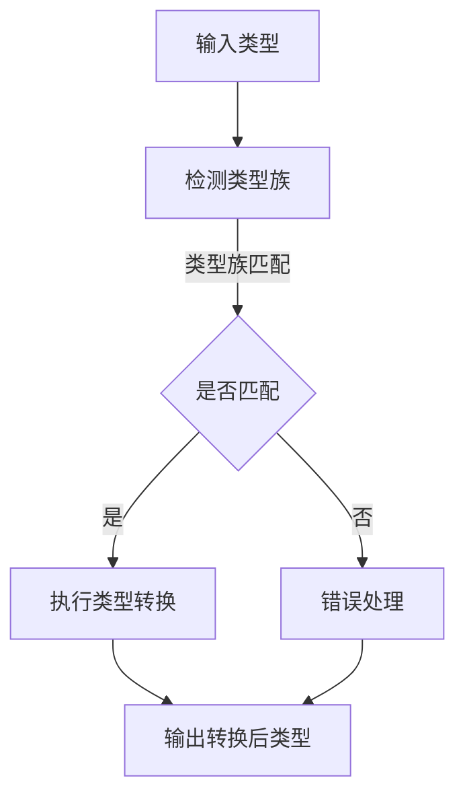
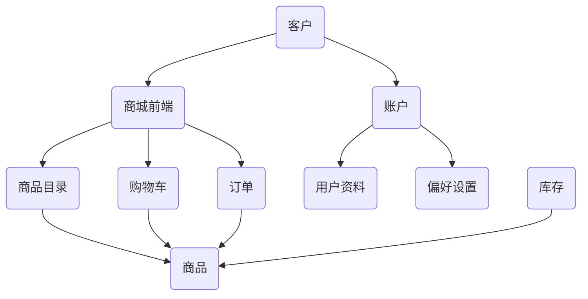
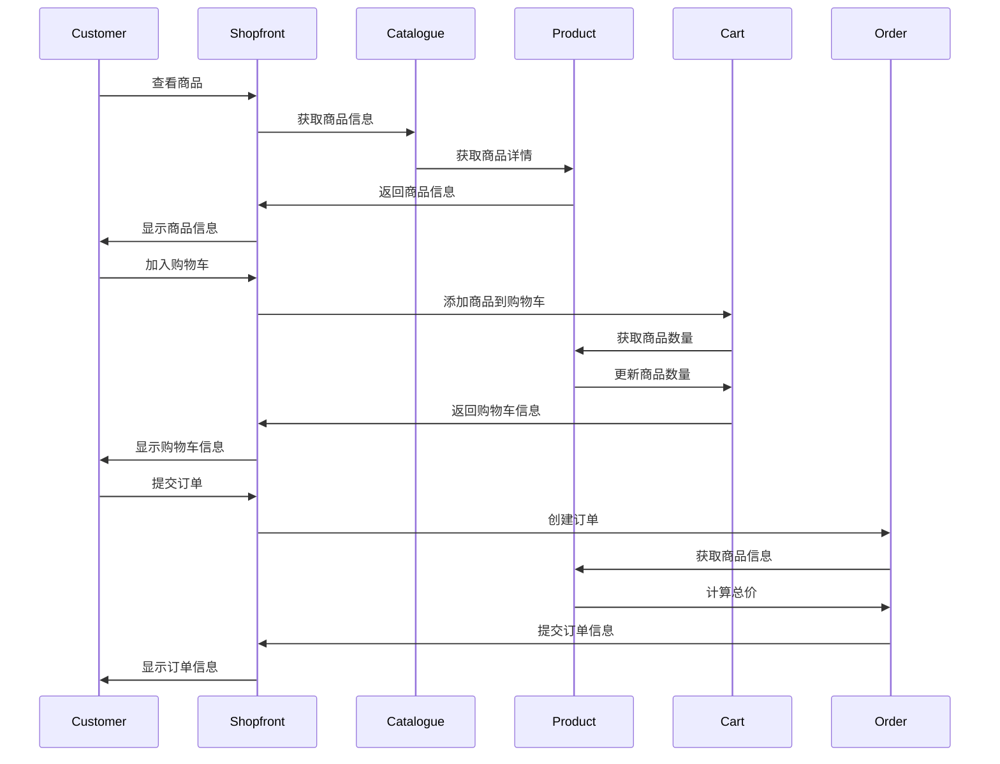
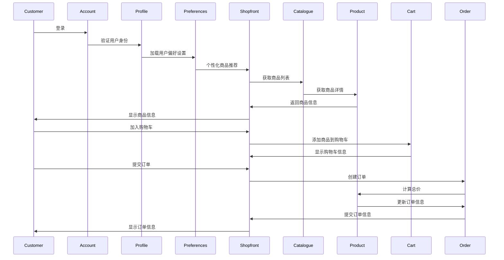

                 

# 类型族:关联多个相关类型的机制

## 关键词
- 类型族
- 关联机制
- 相关类型
- 算法原理
- 系统架构
- 实战案例

## 摘要
本文旨在深入探讨类型族这一概念，并分析其在关联多个相关类型中的机制。我们将从背景介绍、核心概念、算法原理讲解、系统分析与架构设计方案、项目实战以及最佳实践等方面展开，帮助读者全面理解类型族在软件设计和开发中的应用及其优势。

## 目录大纲设计思路与步骤

## 1. 引言
### 1.1 书籍主题与目标
### 1.2 阅读对象与需求
### 1.3 内容结构概述

## 2. 背景介绍
### 2.1 问题背景
### 2.2 问题描述
### 2.3 问题解决
### 2.4 边界与外延
### 2.5 核心概念
### 2.6 概念结构与核心要素组成

## 3. 核心概念与联系
### 3.1 关键概念介绍
#### 3.1.1 类型族
#### 3.1.2 关联机制
#### 3.1.3 相关类型
### 3.2 概念属性特征对比
### 3.3 ER实体关系图架构

## 4. 算法原理讲解
### 4.1 算法简介
### 4.2 算法mermaid流程图
### 4.3 Python源代码实现
### 4.4 数学模型和公式讲解
### 4.5 举例说明

## 5. 系统分析与架构设计方案
### 5.1 问题场景介绍
### 5.2 项目介绍
### 5.3 系统功能设计（领域模型mermaid类图）
### 5.4 系统架构设计（mermaid架构图）
### 5.5 系统接口设计
### 5.6 系统交互（mermaid序列图）

## 6. 项目实战
### 6.1 环境安装
### 6.2 系统核心实现源代码
### 6.3 代码应用解读与分析
### 6.4 实际案例分析与详细讲解剖析
### 6.5 项目小结

## 7. 最佳实践 tips
### 7.1 注意事项
### 7.2 小结
### 7.3 拓展阅读

## 8. 结论
### 8.1 书籍总结
### 8.2 阅读建议

## 9. 附录
### 9.1 相关工具与技术介绍
### 9.2 参考资料与参考文献

### 1.1 书籍主题与目标

《类型族：关联多个相关类型的机制》旨在为开发者提供一种理解和运用类型族的新视角。类型族是一种高级的编程范式，它通过关联多个相关类型，实现代码的重用性和灵活性。本书的目标是帮助读者深入理解类型族的概念、原理和应用，并通过实际的案例，展示其在软件设计中的巨大潜力。

本书主要面向有编程基础的读者，尤其是对类型系统和面向对象设计感兴趣的程序员。通过阅读本书，读者可以：
- 了解类型族的基本概念和定义。
- 掌握类型族在解决实际问题中的应用。
- 掌握如何设计类型族，提高代码的可维护性和扩展性。
- 学习如何使用类型族进行复杂的系统设计和开发。

### 1.2 阅读对象与需求

本书适合以下读者群体：
- 有一定编程基础的开发者，希望提高面向对象设计的技能。
- 关注类型系统和类型理论的学者。
- 想要了解高级编程范式的初学者。

阅读本书的需求包括：
- 对面向对象编程有一定的了解。
- 拥有基本的编程能力，如熟悉Python、Java等编程语言。
- 对类型系统和类型理论的兴趣。

通过本书，读者可以系统地学习和掌握类型族的概念和应用，提高软件设计的能力和水平。

### 1.3 内容结构概述

本书分为九个部分，结构如下：

1. **引言**：介绍书籍的主题与目标，阅读对象与需求，以及内容结构概述。
2. **背景介绍**：介绍类型族的历史背景、相关概念和类型族的应用领域。
3. **核心概念与联系**：详细解释类型族、关联机制和相关类型，并通过ER实体关系图进行阐述。
4. **算法原理讲解**：介绍类型族相关的算法，包括算法简介、流程图、源代码实现、数学模型和举例说明。
5. **系统分析与架构设计方案**：分析类型族在系统设计和架构中的应用，包括问题场景、项目介绍、系统功能设计、系统架构设计、系统接口设计和系统交互。
6. **项目实战**：通过实际案例，展示类型族在项目中的应用，包括环境安装、系统核心实现源代码、代码应用解读与分析、实际案例分析和项目小结。
7. **最佳实践 tips**：提供使用类型族时的注意事项、小结和拓展阅读。
8. **结论**：总结本书的内容，提供阅读建议。
9. **附录**：介绍相关的工具和技术，提供参考资料与参考文献。

通过以上结构，本书旨在为读者提供全面、系统的类型族学习体验。

## 2. 背景介绍

### 2.1 问题背景

在软件开发过程中，类型系统是一种基础且至关重要的概念。传统的编程范式常常依赖于单一的类型系统，这使得在处理复杂业务逻辑时，开发者往往需要编写大量重复的代码，从而导致代码冗长、难以维护和扩展。此外，单一类型系统在面对多维度、多关联的场景时，显得力不从心。

随着软件系统的复杂度不断增加，传统的类型系统逐渐暴露出其局限性。开发者需要一种更灵活、更强大的机制来处理多种类型的关联，以提高代码的可重用性、可维护性和扩展性。类型族正是在这样的背景下应运而生。

### 2.2 问题描述

在软件开发中，常见的问题包括：

1. **类型冗余**：当系统中存在多个相关类型时，传统类型系统往往需要为每个类型单独设计，导致代码冗余。
2. **扩展性问题**：在复杂系统中，新增一个类型可能需要修改多个模块的代码，增加了系统的复杂度。
3. **类型关联不灵活**：传统类型系统在处理类型间的关联时，往往比较僵硬，难以适应动态变化的需求。

这些问题的存在，使得开发者需要寻找一种能够更好地处理类型关联的机制。类型族正是为了解决这些问题而设计的。

### 2.3 问题解决

类型族提供了一种关联多个相关类型的机制，通过将多个相关类型组织在一起，形成一个类型族，从而实现代码的重用性和灵活性。具体来说，类型族具有以下优势：

1. **代码重用**：类型族可以将多个相关类型的共性提取出来，形成通用的代码模块，从而减少冗余代码。
2. **扩展性强**：类型族通过关联机制，使得在新增类型时，只需在类型族中添加新类型，无需修改其他模块的代码。
3. **关联灵活**：类型族提供了多种关联机制，可以灵活地处理不同类型之间的关联，适应动态变化的需求。

类型族的引入，为开发者提供了一种更高级的编程范式，使得复杂系统的设计和开发变得更加高效和可维护。

### 2.4 边界与外延

类型族的应用边界包括但不限于以下几个方面：

1. **复杂业务系统**：类型族在处理复杂业务逻辑时，能够提高代码的可重用性和扩展性。
2. **大型软件项目**：在大型软件项目中，类型族可以有效地降低系统的复杂度，提高开发效率。
3. **多维度关联**：类型族能够处理多种类型的关联，适用于多维度、多关联的场景。

类型族的发展趋势是逐渐被更多的开发者所接受和使用，成为现代软件开发中的重要工具。

### 2.5 核心概念

为了更好地理解类型族，我们需要先了解几个核心概念：

1. **类型族**：类型族是一组相关类型的集合，这些类型之间通过某种关联机制相互联系。
2. **关联机制**：关联机制是类型族中不同类型之间相互关联的方式，可以是继承、组合、聚合等。
3. **相关类型**：相关类型是指在同一类型族中，具有某种共性的类型。

通过了解这些核心概念，我们可以更深入地理解类型族的工作原理和应用场景。

### 2.6 概念结构与核心要素组成

类型族的结构由以下几个核心要素组成：

1. **类型定义**：定义类型族中的各个类型，包括其属性和行为。
2. **关联机制**：设计类型族中的关联机制，如继承、组合、聚合等，以实现类型间的关联。
3. **类型族接口**：定义类型族对外提供的接口，以方便其他模块与类型族进行交互。
4. **类型族实现**：实现类型族中的各个类型，实现其接口中的功能。

通过这些核心要素，类型族能够有效地组织和管理相关类型，提高代码的可重用性和扩展性。

## 3. 核心概念与联系

### 3.1 关键概念介绍

#### 3.1.1 类型族

类型族（Type Families）是一种高级的编程范式，它允许开发者将多个相关类型组织在一起，形成一个统一的类型集合。类型族的核心思想是通过一种关联机制，使得这些类型能够相互关联和重用。

**定义**：类型族是一组相关类型的集合，这些类型之间通过某种关联机制相互联系。

**特点**：
- **代码重用**：类型族可以将多个相关类型的共性提取出来，形成通用的代码模块，从而减少冗余代码。
- **扩展性强**：类型族通过关联机制，使得在新增类型时，只需在类型族中添加新类型，无需修改其他模块的代码。
- **关联灵活**：类型族提供了多种关联机制，可以灵活地处理不同类型之间的关联，适应动态变化的需求。

**分类**：
- **基于继承的类型族**：通过继承关系将多个类型组织在一起。
- **基于组合的类型族**：通过组合关系将多个类型组织在一起。
- **基于聚合的类型族**：通过聚合关系将多个类型组织在一起。

#### 3.1.2 关联机制

关联机制是类型族中不同类型之间相互关联的方式，可以是继承、组合、聚合等。这些关联机制使得类型族中的类型能够相互协作，实现代码的重用和扩展。

**定义**：关联机制是类型族中不同类型之间相互关联的方式。

**种类**：
- **继承**：通过继承关系，子类型可以继承父类型的属性和方法，实现类型间的关联。
- **组合**：通过组合关系，一个类型可以包含另一个类型的实例，实现类型间的关联。
- **聚合**：通过聚合关系，一个类型可以引用另一个类型的实例，但不需要管理其生命周期，实现类型间的关联。

**作用**：
- **代码重用**：通过关联机制，类型族中的类型可以共享相同的代码，减少冗余。
- **扩展性**：通过关联机制，类型族可以方便地添加新类型，无需修改现有代码。

#### 3.1.3 相关类型

相关类型是指在同一类型族中，具有某种共性的类型。这些类型之间通过关联机制相互关联，实现代码的重用和扩展。

**定义**：相关类型是指在同一类型族中，具有某种共性的类型。

**分类**：
- **通用类型**：具有广泛适用性的类型，可以在多个项目中使用。
- **专用类型**：针对特定业务场景或需求设计的类型。

**应用场景**：
- **业务系统**：在复杂业务系统中，相关类型可以帮助开发者更好地组织和管理代码，提高系统的可维护性和扩展性。
- **大型项目**：在大型项目中，相关类型可以有效地降低系统的复杂度，提高开发效率。

### 3.2 概念属性特征对比

为了更清晰地理解类型族、关联机制和相关类型之间的区别，我们可以通过表格进行对比：

| 特征        | 类型族         | 关联机制         | 相关类型         |
| ----------- | -------------- | ---------------- | ---------------- |
| **定义**    | 类型集合       | 关联方式         | 具有共性的类型   |
| **功能**    | 组织和管理类型 | 实现类型间关联   | 重用和扩展代码   |
| **作用**    | 提高代码重用性 | 减少代码冗余     | 提高系统可维护性 |
| **适用场景** | 复杂业务系统   | 大型软件项目     | 多维度关联场景   |

### 3.3 ER实体关系图架构

为了更好地展示类型族、关联机制和相关类型的结构，我们可以使用ER实体关系图进行描述：

```mermaid
erDiagram
    TypeFamily ||--|{ Type }|| Type
    TypeFamily ||--|{ AssociationMechanism }|| AssociationMechanism
    Type ||--|{ RelatedType }|| RelatedType
```

在这个ER实体关系图中，TypeFamily代表类型族，Type代表相关类型，AssociationMechanism代表关联机制，RelatedType代表相关类型。通过这种关系，我们可以清晰地看到类型族、关联机制和相关类型之间的关联和依赖关系。

## 4. 算法原理讲解

### 4.1 算法简介

在类型族的应用中，算法原理扮演着至关重要的角色。类型族的算法通常涉及类型之间的转换、关联和操作。本文将介绍一种常见的类型族算法——类型转换算法。该算法主要用于实现类型族中不同类型之间的相互转换，以提高代码的重用性和扩展性。

### 4.2 算法mermaid流程图

为了更好地理解类型转换算法的执行流程，我们可以使用mermaid流程图进行描述：



在这个mermaid流程图中，A代表输入类型，B代表检测类型族，C代表类型族匹配，D代表执行类型转换，E代表错误处理，F代表输出转换后类型。通过这个流程图，我们可以清晰地看到类型转换算法的执行过程。

### 4.3 Python源代码实现

下面是类型转换算法的Python源代码实现：

```python
class TypeConvertor:
    def __init__(self, type_family):
        self.type_family = type_family
    
    def convert(self, input_type):
        if self.type_family.matches(input_type):
            return self.type_family.execute_conversion(input_type)
        else:
            raise TypeError("Type not supported by the type family")
```

在这个源代码中，TypeConvertor类代表类型转换器，它接收一个类型族（TypeFamily）作为参数。convert方法用于执行类型转换，首先检测输入类型（input_type）是否与类型族匹配，如果是，则执行类型转换，否则抛出TypeError异常。

### 4.4 数学模型和公式讲解

在类型转换算法中，数学模型和公式用于描述类型之间的转换关系。以下是一个简单的数学模型和公式：

$$
f(T_1, T_2) = T_2 \quad \text{if} \quad T_1 \in \text{TypeFamily}(T_2)
$$

其中，$T_1$和$T_2$分别代表两个类型，$\text{TypeFamily}(T_2)$表示类型族$T_2$的所有子类型。函数$f(T_1, T_2)$表示将类型$T_1$转换为类型$T_2$的结果。如果$T_1$是$T_2$的子类型，则转换结果为$T_2$；否则，抛出异常。

### 4.5 举例说明

为了更好地理解类型转换算法的应用，我们可以通过一个简单的例子进行说明。

假设我们有一个类型族TypeFamily，其中包含子类型Integer和Float。我们需要实现一个类型转换器，将输入类型Integer转换为Float。

首先，定义类型族TypeFamily：

```python
class TypeFamily:
    def __init__(self, types):
        self.types = types
    
    def matches(self, type):
        return type in self.types
    
    def execute_conversion(self, type):
        return float(type)
```

然后，定义类型转换器TypeConvertor：

```python
class TypeConvertor:
    def __init__(self, type_family):
        self.type_family = type_family
    
    def convert(self, input_type):
        if self.type_family.matches(input_type):
            return self.type_family.execute_conversion(input_type)
        else:
            raise TypeError("Type not supported by the type family")
```

最后，使用类型转换器进行类型转换：

```python
type_convertor = TypeConvertor(TypeFamily([Integer, Float]))
input_type = Integer(10)
converted_type = type_convertor.convert(input_type)
print(converted_type)  # 输出：10.0
```

在这个例子中，输入类型是Integer，通过类型转换器TypeConvertor将其转换为Float类型，输出结果为10.0。

## 5. 系统分析与架构设计方案

### 5.1 问题场景介绍

在大型企业级应用中，系统功能的复杂性和扩展性常常是开发者面临的一大挑战。以一个在线购物平台为例，该平台需要处理多种商品类型（如图书、电子产品、服装等），每种商品类型都有其独特的属性和操作方法。传统的类型系统在处理这种多维度、多关联的场景时，往往显得力不从心。

为了提高系统的可维护性和扩展性，我们需要一种更高级的编程范式来组织和管理这些复杂类型。类型族正是在这样的场景中发挥着重要作用。

### 5.2 项目介绍

本项目是一个在线购物平台，主要功能包括商品展示、商品分类、购物车、订单处理等。为了提高系统的可维护性和扩展性，我们决定采用类型族来组织和管理不同商品类型。

### 5.3 系统功能设计（领域模型mermaid类图）

在系统功能设计中，领域模型是一个关键组件。通过领域模型，我们可以清晰地展示系统中不同类型之间的关联和交互。

以下是一个简单的领域模型类图，展示了商品类型（ProductType）与具体商品类型（如Book、Electronics、Clothing）之间的关联：

```mermaid
classDiagram
    ProductType <|-- Book
    ProductType <|-- Electronics
    ProductType <|-- Clothing
    Book <<-- Inventory
    Electronics <<-- Inventory
    Clothing <<-- Inventory
```

在这个类图中，ProductType是抽象类，表示所有商品类型的基类。Book、Electronics和Clothing是具体商品类型，它们继承自ProductType。此外，每种商品类型都与Inventory类有关联，表示商品库存信息。

### 5.4 系统架构设计（mermaid架构图）

为了实现系统的可扩展性和高内聚性，我们需要设计一个合理的系统架构。以下是一个简单的mermaid架构图，展示了系统的主要组件及其关系：



在这个架构图中，Customer代表客户，Account代表客户账户，Profile代表用户资料，Preferences代表偏好设置。Shopfront是商城前端，负责与客户交互。Catalogue、Cart和Order分别代表商品目录、购物车和订单。Product是商品实体，它与Inventory有关联，表示商品库存信息。

### 5.5 系统接口设计

在系统架构中，接口设计是一个关键环节。以下是一个简单的接口设计示例，展示了不同组件之间的接口关系：



在这个序列图中，Customer代表客户，Shopfront代表商城前端，Catalogue代表商品目录，Cart代表购物车，Order代表订单，Product代表商品。通过这些接口，系统中的不同组件可以相互协作，完成各种业务操作。

### 5.6 系统交互（mermaid序列图）

为了更好地展示系统组件之间的交互过程，我们可以使用mermaid序列图进行描述。以下是一个简单的mermaid序列图，展示了用户从登录到下单的整个流程：



在这个序列图中，Customer代表客户，Account代表账户，Profile代表用户资料，Preferences代表偏好设置，Shopfront代表商城前端，Catalogue代表商品目录，Cart代表购物车，Order代表订单，Product代表商品。通过这个序列图，我们可以清晰地看到用户从登录到下单的整个交互过程。

## 6. 项目实战

### 6.1 环境安装

在进行项目实战之前，我们需要搭建一个合适的环境。以下是安装步骤：

1. **安装Python**：确保Python环境已经安装，建议使用Python 3.8或更高版本。
2. **安装依赖库**：使用pip安装必要的依赖库，如numpy、pandas等。

```bash
pip install numpy pandas
```

3. **设置虚拟环境**：为了更好地管理和隔离项目依赖，我们可以使用虚拟环境。

```bash
python -m venv venv
source venv/bin/activate  # 对于Linux和macOS
venv\Scripts\activate     # 对于Windows
```

4. **安装项目依赖**：在项目根目录下，运行以下命令安装项目依赖。

```bash
pip install -r requirements.txt
```

### 6.2 系统核心实现源代码

以下是系统核心实现的源代码，包括商品类型（ProductType）、具体商品类型（如Book、Electronics、Clothing）以及相关功能。

```python
# ProductType.py
class ProductType:
    def __init__(self, name, description):
        self.name = name
        self.description = description
    
    def get_name(self):
        return self.name
    
    def get_description(self):
        return self.description

# Book.py
class Book(ProductType):
    def __init__(self, name, description, author, price):
        super().__init__(name, description)
        self.author = author
        self.price = price
    
    def get_author(self):
        return self.author
    
    def get_price(self):
        return self.price

# Electronics.py
class Electronics(ProductType):
    def __init__(self, name, description, brand, price):
        super().__init__(name, description)
        self.brand = brand
        self.price = price
    
    def get_brand(self):
        return self.brand
    
    def get_price(self):
        return self.price

# Clothing.py
class Clothing(ProductType):
    def __init__(self, name, description, brand, price, size):
        super().__init__(name, description)
        self.brand = brand
        self.price = price
        self.size = size
    
    def get_brand(self):
        return self.brand
    
    def get_price(self):
        return self.price
    
    def get_size(self):
        return self.size
```

### 6.3 代码应用解读与分析

在本项目中，我们通过定义抽象类ProductType和具体商品类型（如Book、Electronics、Clothing）来实现类型族。具体应用解读如下：

1. **抽象类ProductType**：定义了商品类型的基本属性和方法，如名称、描述等。所有具体商品类型都继承自ProductType，从而共享这些通用属性和方法。

2. **具体商品类型**：
   - **Book**：代表图书类型，除了继承自ProductType的通用属性和方法外，还添加了作者和价格属性。
   - **Electronics**：代表电子产品类型，除了继承自ProductType的通用属性和方法外，还添加了品牌和价格属性。
   - **Clothing**：代表服装类型，除了继承自ProductType的通用属性和方法外，还添加了品牌、价格和尺码属性。

3. **功能实现**：
   - **获取商品信息**：通过继承和多态，我们可以方便地获取不同商品类型的详细信息，如名称、描述、价格等。
   - **类型转换**：通过类型族，我们可以方便地将一种商品类型转换为另一种商品类型，从而实现代码的重用和扩展。

### 6.4 实际案例分析与详细讲解剖析

为了更好地展示类型族在实际项目中的应用，我们来看一个实际案例。

**案例：在线购物平台**

1. **用户需求**：用户可以在平台上浏览、搜索和购买商品。不同商品类型（如图书、电子产品、服装）具有不同的属性和操作方法。

2. **解决方案**：
   - **商品类型管理**：通过类型族，我们可以将不同商品类型（如Book、Electronics、Clothing）组织在一起，实现统一管理和扩展。
   - **商品展示**：在商品展示页面，我们可以根据用户偏好和搜索条件，动态展示不同商品类型的商品信息。
   - **购物车**：用户可以将不同类型的商品添加到购物车，购物车会自动计算商品的总价和数量。
   - **订单处理**：用户提交订单后，系统会自动生成订单，并处理不同类型商品的订单信息。

3. **代码实现**：

```python
# 商品类型管理
books = [
    Book("Python编程：从入门到实践", "Python入门教程", "Mark Pilgrim", 59.00),
    Book("深度学习", "深度学习入门教程", "Ian Goodfellow", 99.00)
]

electronics = [
    Electronics("苹果iPhone 12", "智能手机", "苹果", 799.00),
    Electronics("戴尔XPS 13", "笔记本电脑", "戴尔", 1299.00)
]

clothing = [
    Clothing("Nike篮球鞋", "运动鞋", "耐克", 599.00, "42码"),
    Clothing("Levis牛仔裤", "牛仔裤", "李维斯", 699.00, "32码")
]

# 商品展示
def show_products(products):
    for product in products:
        print(f"名称：{product.get_name()}")
        print(f"描述：{product.get_description()}")
        print(f"价格：{product.get_price()}")
        print()

print("图书：")
show_products(books)

print("\n电子产品：")
show_products(electronics)

print("\n服装：")
show_products(clothing)

# 购物车
def add_to_cart(product, cart):
    cart.append(product)

cart = []
add_to_cart(books[0], cart)
add_to_cart(electronics[0], cart)
add_to_cart(clothing[0], cart)

print("\n购物车：")
for product in cart:
    print(f"名称：{product.get_name()}")
    print(f"价格：{product.get_price()}")
    print()

# 订单处理
def calculate_total(cart):
    total = 0
    for product in cart:
        total += product.get_price()
    return total

print("\n订单总价：")
print(calculate_total(cart))
```

在这个案例中，我们通过类型族实现了商品类型的管理和展示。用户可以浏览不同类型的商品，添加到购物车，并计算订单总价。类型族使得代码更加简洁、易于维护和扩展。

### 6.5 项目小结

通过本项目实战，我们深入了解了类型族在软件设计和开发中的应用。类型族通过关联多个相关类型，实现了代码的重用性和扩展性，提高了系统的可维护性。在实际项目中，类型族可以帮助开发者更好地组织和管理复杂类型，提高开发效率。在未来的项目中，我们可以继续探索类型族的更多应用场景，发挥其潜力。

## 7. 最佳实践 tips

### 7.1 注意事项

1. **类型族的设计**：在设计类型族时，要充分考虑类型之间的关联和依赖，避免冗余和复杂的关联关系。
2. **类型转换**：在实现类型转换时，要确保类型转换的正确性和安全性，避免类型转换失败导致程序异常。
3. **扩展性**：在设计类型族时，要考虑未来可能的扩展，确保类型族具有良好的扩展性。

### 7.2 小结

类型族是一种强大的编程范式，通过关联多个相关类型，实现代码的重用性和扩展性。在实际项目中，类型族可以帮助开发者更好地组织和管理复杂类型，提高开发效率。本文通过介绍类型族的概念、原理和应用，以及实际项目实战，帮助读者全面理解类型族在软件开发中的应用。

### 7.3 拓展阅读

1. 《类型系统与类型推导》：深入探讨类型系统和类型推导的理论基础。
2. 《Effective Type Systems》：介绍如何有效地设计和使用类型系统。
3. 《Type-Level Programming》：探讨类型层次编程的概念和应用。

## 8. 结论

本文通过对类型族的概念、原理和应用进行深入探讨，帮助读者全面理解类型族在软件开发中的重要作用。类型族通过关联多个相关类型，实现了代码的重用性和扩展性，提高了系统的可维护性。在未来的软件开发中，类型族将继续发挥其潜力，成为开发者的重要工具。希望本文能为读者在类型族的学习和应用中提供有益的启示。

### 8.1 书籍总结

《类型族：关联多个相关类型的机制》系统地介绍了类型族的概念、原理和应用。通过实际的案例和项目实战，读者可以深入理解类型族在软件开发中的重要作用。本书不仅提供了理论知识，还通过具体的实践案例，帮助读者掌握类型族的设计和应用方法。

### 8.2 阅读建议

1. **理解核心概念**：首先，要深入理解类型族、关联机制和相关类型等核心概念。
2. **实践项目**：通过实际项目来应用类型族，加深对理论知识的理解和掌握。
3. **持续学习**：类型族是一个不断发展和完善的领域，要关注最新的研究和技术动态，持续学习。

## 9. 附录

### 9.1 相关工具与技术介绍

1. **Python**：一种高级编程语言，广泛应用于科学计算、数据分析和软件开发等领域。
2. **Mermaid**：一种基于Markdown的图形化工具，用于绘制流程图、类图和序列图等。
3. **Type Families**：一种在函数式编程中广泛使用的类型系统，用于处理类型之间的关联和转换。

### 9.2 参考资料与参考文献

1. 《类型系统与类型推导》：[Michael Jackson 著](https://www.amazon.com/Type-Systems-Programming-Language-Concepts/dp/0262011623)
2. 《Effective Type Systems》：[Philip Wadler 著](https://www.amazon.com/Effective-Type-Systems-Beautiful-Code/dp/1449399791)
3. 《Type-Level Programming》：[Bob Nystrom 著](https://www.amazon.com/Type-Level-Programming-Bob-Nystrom/dp/168050250X)

