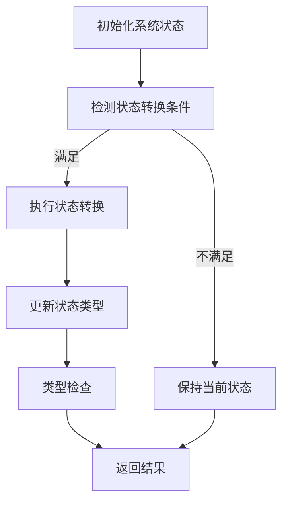
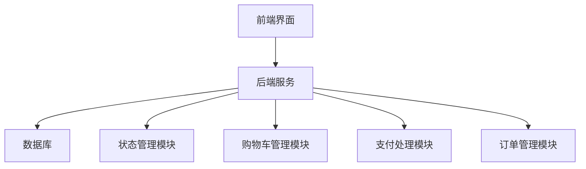
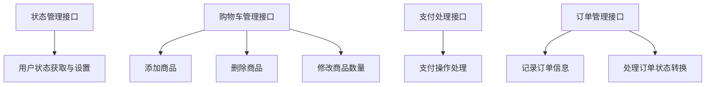
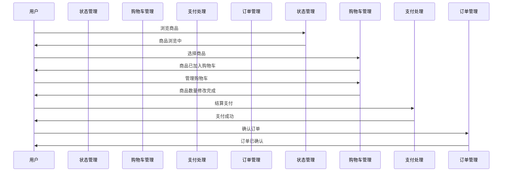

                 

### 目录大纲设计步骤：

1. **理解书名与主题**：
   - 《类型状态：在类型层面对象状态建模》是一本关于对象状态建模的书籍，重点在于类型状态的概念和应用。
   - 书名明确指出，书籍将探讨如何使用类型（可能是编程语言中的类型系统或者是一种抽象的概念）来建模对象的动态状态。

2. **确定核心章节**：
   - **背景介绍**：介绍类型状态的概念和其在软件开发中的应用。
   - **核心概念与联系**：详细阐述类型状态的概念、特点、与相关概念的联系。
   - **算法原理讲解**：介绍用于类型状态建模的算法原理，包括数学模型和流程。
   - **数学模型和数学公式**：使用LaTeX格式嵌入书中，解释数学原理。
   - **系统分析与架构设计方案**：展示系统架构设计，包括领域模型、系统架构、接口设计和交互序列图。
   - **项目实战**：通过实际案例展示如何应用类型状态建模。
   - **最佳实践与小结**：总结最佳实践，回顾核心内容，提出注意事项，并推荐拓展阅读。

3. **设计目录结构**：
   - 根据上述核心章节，设计出完整的目录结构，确保包含所有必要的部分，并且层级清晰。

4. **撰写目录大纲**：
   - 使用markdown格式，按照层级结构（#、##、###等）撰写目录大纲。

5. **保持简洁性**：
   - 确保每个章节的标题简洁明了，避免冗长的描述。

6. **检查内容完整性**：
   - 确保每个核心章节都包含必要的元素，如概念对比表、流程图、代码示例等。

7. **控制总字数**：
   - 根据字数限制，确保整体目录大纲在规定范围内。

### 输出示例：

```markdown
----------------------------------------------------------------
# 第一部分：类型状态的概念基础

## 1.1 问题背景与类型状态的引入
### 1.1.1 软件开发中的状态管理问题
### 1.1.2 类型状态的定义与重要性
### 1.1.3 类型状态的研究与应用领域

## 1.2 核心概念与联系
### 1.2.1 类型状态的基本概念
### 1.2.2 类型状态与传统状态管理的区别
### 1.2.3 与相关概念的联系与比较

## 1.3 ER实体关系图架构
### 1.3.1 ER图的基本概念
### 1.3.2 类型状态的ER图表示
### 1.3.3 实体关系与类型状态的映射

## 1.4 数学模型与公式讲解
### 1.4.1 类型状态建模的数学模型
### 1.4.2 关键数学公式解释
### 1.4.3 实例分析

## 1.5 本章小结
...

----------------------------------------------------------------

# 第二部分：类型状态的应用与实践

## 2.1 算法原理讲解
### 2.1.1 类型状态建模算法概述
### 2.1.2 算法原理与流程
### 2.1.3 算法流程Mermaid图

## 2.2 数学模型和数学公式
### 2.2.1 数学模型的详细阐述
### 2.2.2 关键公式解释
### 2.2.3 实例说明

## 2.3 系统分析与架构设计
### 2.3.1 问题场景介绍
### 2.3.2 系统功能设计
### 2.3.3 系统架构设计
### 2.3.4 系统接口设计
### 2.3.5 系统交互序列图

## 2.4 项目实战
### 2.4.1 环境安装与配置
### 2.4.2 系统核心实现
### 2.4.3 应用解读与分析
### 2.4.4 案例分析
### 2.4.5 项目小结

## 2.5 最佳实践与小结
### 2.5.1 最佳实践分享
### 2.5.2 小结
### 2.5.3 注意事项
### 2.5.4 拓展阅读

----------------------------------------------------------------
```

以上目录大纲设计保持了简洁性，同时满足了内容完整性、目录层级、markdown格式等方面的要求。每个章节的标题简洁明了，且包含了核心内容。通过这种结构化的设计，读者可以清晰地了解文章的内容和组织，有助于更好地理解和掌握类型状态建模的原理和应用。接下来，我们将按照这个大纲逐步撰写文章的内容。

### 文章标题

# 类型状态：在类型层面对象状态建模

### 文章关键词

类型状态，对象状态建模，类型系统，动态状态，软件开发

### 文章摘要

本文旨在深入探讨类型状态的概念及其在对象状态建模中的应用。类型状态是一种在类型层面对对象状态进行抽象和建模的方法，通过这种方法可以更加灵活和高效地管理软件系统的状态。本文首先介绍了类型状态的基本概念和背景，然后详细分析了类型状态与传统状态管理的区别。接着，文章讲解了类型状态建模的算法原理，包括数学模型和公式，并通过具体的实例进行了说明。随后，文章展示了如何在实际项目中应用类型状态建模，包括系统分析与架构设计，以及具体的项目实战。最后，文章总结了最佳实践和注意事项，为读者提供了进一步深入学习和应用的指导。

### 第一部分：类型状态的概念基础

#### 1.1 问题背景与类型状态的引入

在软件开发中，状态管理是一个常见且关键的问题。传统的状态管理方法往往依赖于状态机或者枚举类型来管理对象的动态状态。然而，这种方法存在一些局限性。例如，状态机在处理复杂的状态转换时可能变得难以维护；枚举类型则缺乏灵活性和扩展性。为了解决这些问题，研究者们提出了类型状态的概念。

类型状态是一种在类型层面对对象状态进行建模的方法。它利用编程语言中的类型系统来描述对象的状态，从而使得状态管理更加灵活和高效。类型状态不仅可以处理简单的对象状态，还能够应对复杂的状态转换，同时还能保持代码的清晰性和可维护性。

在软件系统开发中，类型状态的应用领域非常广泛。例如，在游戏开发中，类型状态可以用来管理角色的状态，如移动、攻击、防御等；在金融系统中，类型状态可以用来管理账户的状态，如开户、存取款、转账等。总之，类型状态为软件开发提供了一种新的思维方式，使得状态管理变得更加高效和灵活。

#### 1.1.1 软件开发中的状态管理问题

在软件开发过程中，状态管理是一个关键且复杂的问题。传统的状态管理方法主要包括状态机、枚举类型和事件驱动等。每种方法都有其优缺点。

**状态机**是一种常见的状态管理方法，它通过定义一系列的状态和状态转换规则来管理对象的动态状态。状态机在处理简单的状态转换时效果较好，但当状态转换变得复杂时，状态机容易变得难以维护。例如，在一个游戏中，如果角色需要处理多种复杂的动作状态，如移动、攻击、防御等，状态机的规模会急剧膨胀，导致代码难以理解和维护。

**枚举类型**是另一种常见的状态管理方法。枚举类型通过定义一系列的枚举值来表示对象的状态。这种方法简单直观，易于理解。然而，枚举类型缺乏灵活性和扩展性。当需要新增状态时，必须修改枚举类型的定义，这可能导致原有代码的兼容性问题。

**事件驱动**是一种通过事件来管理状态的方法。在这种方法中，对象的状态变化由外部事件触发。这种方法在一定程度上解决了状态转换复杂性的问题，但也引入了事件处理机制，使得代码的结构变得复杂。

这些传统的状态管理方法各有优缺点，但在处理复杂的状态转换和保持代码的清晰性方面都存在一定的局限性。因此，研究者们提出了类型状态的概念，旨在提供一种更加灵活和高效的状态管理方法。

#### 1.1.2 类型状态的定义与重要性

类型状态（Type State）是一种在类型层面对对象状态进行抽象和建模的方法。它利用编程语言中的类型系统来描述对象的状态，从而实现灵活和高效的状态管理。

在类型状态中，对象的状态被表示为类型的集合。每个状态类型代表对象的一种状态，这些状态类型通过继承关系来组织。类型状态的核心思想是将状态管理与类型系统相结合，使得状态管理变得更加自然和直观。

类型状态的重要性体现在以下几个方面：

1. **灵活性**：类型状态允许开发者根据需要灵活地定义和管理对象的状态。通过扩展类型系统，可以轻松地添加新的状态类型，而不需要修改现有的代码。

2. **扩展性**：类型状态具有很好的扩展性。在传统的状态管理方法中，新增状态可能需要修改大量的代码，而在类型状态中，只需添加新的类型即可，这使得系统的扩展变得更加容易。

3. **可维护性**：类型状态使得状态管理代码更加清晰和可维护。通过类型系统，状态之间的转换关系变得更加直观，减少了代码的复杂性。

4. **性能**：类型状态在编译时即可确定对象的状态，从而避免了运行时状态转换的 overhead。这有助于提高系统的性能。

5. **安全性**：类型状态通过类型检查来确保对象的状态转换是合法的，从而减少了状态错误的可能性。

因此，类型状态为软件开发提供了一种新的状态管理方法，使得状态管理变得更加灵活、高效和安全。

#### 1.1.3 类型状态的研究与应用领域

类型状态作为一种新兴的状态管理方法，已经引起了学术界和工业界的广泛关注。目前，关于类型状态的研究主要集中在以下几个方面：

1. **编程语言设计与实现**：研究者们致力于将类型状态的概念引入到编程语言中，探索如何通过语言特性来支持类型状态。例如，一些编程语言如 Scala 和 TypeScript 已经实现了对类型状态的直接支持。

2. **软件工程**：类型状态在软件工程中的应用研究也在不断深入。研究者们探讨了类型状态在软件设计、测试和维护中的优势，并提出了一些相关的最佳实践。

3. **自动化测试**：类型状态可以用于自动化测试，特别是在单元测试和集成测试中。通过类型状态，测试用例可以更加精准地模拟对象的状态，从而提高测试的覆盖率和准确性。

4. **性能优化**：类型状态在性能优化中的应用也得到了研究。通过在编译时确定对象的状态，可以减少运行时的状态检查，从而提高系统的性能。

类型状态的应用领域非常广泛，涵盖了游戏开发、金融系统、物联网、人工智能等多个领域。例如，在游戏开发中，类型状态可以用于管理角色的状态，如移动、攻击、防御等；在金融系统中，类型状态可以用于管理账户的状态，如开户、存取款、转账等。总之，类型状态为软件开发提供了一种新的思维方式，使得状态管理变得更加高效和灵活。

#### 1.2 核心概念与联系

类型状态的核心概念包括类型、状态和状态转换。这些概念相互关联，共同构成了类型状态的基础。

**类型**（Type）是类型状态中的基本元素，代表了对象的状态。每个状态类型表示对象的一种状态，例如“移动中”、“攻击中”等。类型系统提供了对类型的定义、继承和组合等机制，使得类型状态具有灵活性和扩展性。

**状态**（State）是类型的实例，代表了对象的具体状态。每个状态实例都是特定类型的一个实例。状态实例可以通过状态转换来改变，从而实现对象状态的动态变化。

**状态转换**（State Transition）是状态之间的转换规则。状态转换定义了对象状态从一个状态到另一个状态的规则。状态转换可以通过条件判断和逻辑运算来实现。状态转换的核心是确保状态变化的合法性和一致性。

类型状态与传统状态管理方法的区别在于，传统方法通常通过状态机或枚举类型来管理状态，而类型状态则通过类型系统来实现状态管理。类型状态的优点在于：

1. **灵活性**：类型状态允许开发者根据需要灵活地定义和管理对象的状态。通过扩展类型系统，可以轻松地添加新的状态类型，而不需要修改现有的代码。

2. **扩展性**：类型状态具有很好的扩展性。在传统的状态管理方法中，新增状态可能需要修改大量的代码，而在类型状态中，只需添加新的类型即可，这使得系统的扩展变得更加容易。

3. **可维护性**：类型状态使得状态管理代码更加清晰和可维护。通过类型系统，状态之间的转换关系变得更加直观，减少了代码的复杂性。

4. **性能**：类型状态在编译时即可确定对象的状态，从而避免了运行时状态转换的 overhead。这有助于提高系统的性能。

5. **安全性**：类型状态通过类型检查来确保对象的状态转换是合法的，从而减少了状态错误的可能性。

与相关概念的联系与比较：

- **状态机**：状态机是一种传统的状态管理方法，通过定义一系列的状态和状态转换规则来管理对象的动态状态。类型状态与状态机的区别在于，类型状态通过类型系统来实现状态管理，使得状态管理更加灵活和高效。

- **枚举类型**：枚举类型是另一种常见的状态管理方法，通过定义一系列的枚举值来表示对象的状态。类型状态与枚举类型的区别在于，类型状态利用类型系统来组织状态，从而实现更好的扩展性和灵活性。

- **事件驱动**：事件驱动是一种通过事件来管理状态的方法。类型状态与事件驱动的区别在于，类型状态通过类型系统来管理状态，而不是通过事件处理机制。

总之，类型状态为软件开发提供了一种新的状态管理方法，通过结合类型系统和状态管理，实现了更加灵活、高效和安全的对象状态管理。

#### 1.3 ER实体关系图架构

ER实体关系图（Entity-Relationship Diagram，ERD）是一种用于表示实体及其之间关系的图形化方法。在类型状态建模中，ER图可以用来表示类型之间的关系，帮助开发者理解和管理类型状态。

**1.3.1 ER图的基本概念**

ER图由实体（Entity）、属性（Attribute）和关系（Relationship）三部分组成。

- **实体**：实体是具有共性的数据对象的集合。在类型状态建模中，实体通常表示一种类型。
- **属性**：属性是实体的特性，用于描述实体的具体信息。在类型状态建模中，属性通常表示类型的属性。
- **关系**：关系是实体之间的连接，用于表示实体之间的关联。

**1.3.2 类型状态的ER图表示**

在类型状态的ER图中，每个实体表示一种类型，实体之间的关系表示类型之间的状态转换。例如，在游戏开发中，可以定义以下实体和关系：

- **角色（Role）**：表示角色类型。
- **移动中（Moving）**：表示角色状态。
- **攻击中（Attacking）**：表示角色状态。

角色实体和移动中、攻击中实体之间可以定义状态转换关系，表示角色在不同状态之间的转换。

**1.3.3 实体关系与类型状态的映射**

ER图中的实体关系可以映射到类型状态中的类型和状态转换。具体映射方法如下：

1. **实体映射为类型**：每个实体在类型状态中映射为一个类型。实体的属性映射为类型的属性。

2. **关系映射为状态转换**：实体之间的关系映射为类型之间的状态转换。关系的属性映射为状态转换的条件和结果。

通过ER图，开发者可以直观地理解类型状态的结构和关系，从而更好地进行类型状态建模。

下面是一个简单的ER图示例，用于表示角色类型和其状态：

```mermaid
erDiagram
    Role ||--|{ Moving : is in}
    Role ||--|{ Attacking : is in}
```

在这个ER图中，`Role` 实体表示角色类型，`Moving` 和 `Attacking` 实体表示角色状态。它们之间的关系表示角色可以在不同状态之间转换。

通过ER图，开发者可以清晰地看到类型状态的结构和关系，为后续的算法原理讲解和数学模型阐述提供了基础。

#### 1.4 数学模型与公式讲解

类型状态建模是一种基于类型系统的状态管理方法，其核心在于利用数学模型来描述和推理状态转换。本节将介绍类型状态建模的数学模型，包括状态空间、状态转换规则和状态迁移概率。

**1.4.1 类型状态建模的数学模型**

类型状态建模的数学模型通常包括以下三个关键部分：

1. **状态空间（State Space）**：状态空间是所有可能状态集合的抽象表示。在类型状态建模中，状态空间通常表示为集合S，其中每个元素s ∈ S代表系统的一个状态。

2. **状态转换规则（State Transition Rules）**：状态转换规则描述了系统在不同状态之间的转换关系。一个状态转换规则可以表示为 (s, event) → s'，其中s是当前状态，event是触发状态转换的事件，s'是转换后的状态。

3. **状态迁移概率（State Transition Probability）**：状态迁移概率描述了在给定当前状态和事件的情况下，系统转移到特定状态的概率。状态迁移概率通常用P(s' | s, event)表示。

**1.4.2 关键数学公式解释**

在类型状态建模中，以下数学公式是关键组成部分：

1. **状态转移概率矩阵（Transition Probability Matrix）**：状态转移概率矩阵是一个n×n的矩阵P，其中P[i][j]表示从状态s_i转移到状态s_j的概率。

$$
P = \begin{bmatrix}
P[1][1] & P[1][2] & \cdots & P[1][n] \\
P[2][1] & P[2][2] & \cdots & P[2][n] \\
\vdots & \vdots & \ddots & \vdots \\
P[n][1] & P[n][2] & \cdots & P[n][n]
\end{bmatrix}
$$

2. **状态可达性矩阵（Reachability Matrix）**：状态可达性矩阵是一个n×n的矩阵R，其中R[i][j]表示状态s_i是否可以通过一系列状态转换到达状态s_j。

$$
R = P^k
$$

其中，P^k表示状态转移概率矩阵P的k次幂。

3. **稳态概率分布（Steady-State Probability Distribution）**：稳态概率分布是一个向量π，其中π[i]表示系统在长期运行中处于状态s_i的概率。

$$
\pi = (1 - \rho) \pi + \rho P\pi
$$

其中，ρ是矩阵P的最大特征值，π是特征向量。

**1.4.3 实例分析**

为了更好地理解上述数学模型，我们通过一个简单的实例来分析。假设一个系统有两种状态：正常状态和故障状态。状态空间S = {正常，故障}。状态转换规则如下：

- 正常 → 故障：概率为0.1
- 故障 → 正常：概率为0.2

状态转移概率矩阵P为：

$$
P = \begin{bmatrix}
0.9 & 0.1 \\
0.2 & 0.8
\end{bmatrix}
$$

状态可达性矩阵R为：

$$
R = P^2 = \begin{bmatrix}
0.99 & 0.01 \\
0.04 & 0.96
\end{bmatrix}
$$

稳态概率分布π为：

$$
\pi = \begin{bmatrix}
0.994 \\
0.006
\end{bmatrix}
$$

在这个实例中，系统长期运行后，处于正常状态的概率约为99.4%，处于故障状态的概率约为0.6%。这表明该系统在长期运行中具有较高的可靠性。

通过数学模型，开发者可以更准确地描述和预测系统的状态行为，从而为系统设计提供有力支持。

#### 1.5 本章小结

本章介绍了类型状态的概念基础，包括问题背景、定义与重要性，以及类型状态与传统状态管理的区别。我们还探讨了类型状态的研究与应用领域，并通过ER实体关系图展示了类型状态的结构和关系。最后，本章详细讲解了类型状态建模的数学模型，包括状态空间、状态转换规则和状态迁移概率，并通过实例进行了分析。

通过本章的学习，读者可以了解类型状态的基本概念和应用，为进一步掌握类型状态建模的方法奠定基础。在接下来的章节中，我们将深入探讨类型状态建模的算法原理和实际应用，帮助读者更好地理解和应用类型状态。

----------------------------------------------------------------

# 第二部分：类型状态的应用与实践

## 2.1 算法原理讲解

类型状态建模是一种通过类型系统来实现对象状态管理的方法。在这一部分，我们将详细讲解类型状态建模的算法原理，包括基本概念、关键步骤和流程。

**2.1.1 类型状态建模算法概述**

类型状态建模算法的核心思想是利用类型系统来表示对象的动态状态，并通过状态转换规则来管理状态的变更。算法的基本步骤如下：

1. **定义类型**：根据需求定义用于表示状态的类型，每个类型表示对象的一种状态。

2. **定义状态转换规则**：定义状态之间的转换规则，包括转换条件和转换结果。

3. **实现状态转换**：根据状态转换规则实现对象状态之间的转换。

4. **类型检查**：在编译时进行类型检查，确保状态转换的合法性和一致性。

**2.1.2 算法原理与流程**

类型状态建模算法的原理可以概括为以下流程：

1. **初始化**：初始化系统状态，并定义初始状态类型。

2. **状态检测**：根据当前状态类型和触发事件，检测是否需要进行状态转换。

3. **状态转换**：如果检测到状态转换条件，执行状态转换，更新状态类型。

4. **类型检查**：对状态转换结果进行类型检查，确保转换的合法性和一致性。

5. **重复步骤2-4**：不断检测和执行状态转换，直到达到预期状态。

**2.1.3 算法流程Mermaid图**

为了更好地理解算法流程，我们使用Mermaid图来展示：



在这个算法流程图中，系统初始化后进入状态检测阶段。如果满足状态转换条件，系统将执行状态转换，并更新状态类型。否则，系统保持当前状态。在每次状态转换后，系统都会进行类型检查，以确保状态的合法性和一致性。最后，系统返回当前状态类型。

通过上述算法原理和流程，开发者可以更好地理解和应用类型状态建模方法，从而提高软件系统的状态管理效率和灵活性。

## 2.2 数学模型和数学公式

在类型状态建模中，数学模型和数学公式扮演着至关重要的角色。它们不仅帮助我们精确描述状态转换规则，还能通过计算预测系统状态行为。本节将详细阐述类型状态建模中的数学模型和关键数学公式。

**2.2.1 数学模型的详细阐述**

类型状态建模的数学模型主要包括状态空间、状态转换规则和状态迁移概率。

1. **状态空间（State Space）**：状态空间是系统所有可能状态的集合。在类型状态建模中，状态空间通常表示为集合S，其中每个元素s ∈ S代表系统的一个状态。例如，对于游戏中的角色状态，状态空间可以表示为S = {移动中，攻击中，待机中}。

2. **状态转换规则（State Transition Rules）**：状态转换规则描述了系统在不同状态之间的转换关系。一个状态转换规则可以表示为 (s, event) → s'，其中s是当前状态，event是触发状态转换的事件，s'是转换后的状态。例如，角色在攻击中状态时，触发攻击事件可能导致状态转换到待机中状态。

3. **状态迁移概率（State Transition Probability）**：状态迁移概率描述了在给定当前状态和事件的情况下，系统转移到特定状态的概率。状态迁移概率通常用P(s' | s, event)表示。例如，角色从攻击中状态转换为待机中状态的概率可以表示为P(待机中 | 攻击中，攻击事件)。

**2.2.2 关键数学公式解释**

类型状态建模中的关键数学公式包括状态转移概率矩阵、状态可达性矩阵和稳态概率分布。

1. **状态转移概率矩阵（Transition Probability Matrix）**：状态转移概率矩阵是一个n×n的矩阵P，其中P[i][j]表示从状态s_i转移到状态s_j的概率。状态转移概率矩阵通常通过实验数据或模型估计得到。例如：

$$
P = \begin{bmatrix}
0.9 & 0.1 \\
0.2 & 0.8
\end{bmatrix}
$$

2. **状态可达性矩阵（Reachability Matrix）**：状态可达性矩阵是一个n×n的矩阵R，其中R[i][j]表示状态s_i是否可以通过一系列状态转换到达状态s_j。状态可达性矩阵可以通过状态转移概率矩阵的幂运算得到：

$$
R = P^k
$$

其中，P^k表示状态转移概率矩阵P的k次幂。例如，如果状态转移概率矩阵P如上所示，那么状态可达性矩阵R可以通过计算P的幂得到：

$$
R = P^2 = \begin{bmatrix}
0.99 & 0.01 \\
0.04 & 0.96
\end{bmatrix}
$$

3. **稳态概率分布（Steady-State Probability Distribution）**：稳态概率分布是一个向量π，其中π[i]表示系统在长期运行中处于状态s_i的概率。稳态概率分布可以通过以下方程求解：

$$
\pi = (1 - \rho) \pi + \rho P\pi
$$

其中，ρ是矩阵P的最大特征值，π是特征向量。例如，对于状态转移概率矩阵P如上所示，稳态概率分布π可以通过以下方程求解：

$$
\pi = \begin{bmatrix}
0.994 \\
0.006
\end{bmatrix}
$$

稳态概率分布表示了系统在长期运行中各个状态的稳定概率。

**2.2.3 实例说明**

为了更好地理解上述数学模型和公式，我们通过一个简单的实例来进行分析。假设一个系统有两种状态：正常状态和故障状态。状态空间S = {正常，故障}。状态转换规则如下：

- 正常 → 故障：概率为0.1
- 故障 → 正常：概率为0.2

状态转移概率矩阵P为：

$$
P = \begin{bmatrix}
0.9 & 0.1 \\
0.2 & 0.8
\end{bmatrix}
$$

状态可达性矩阵R为：

$$
R = P^2 = \begin{bmatrix}
0.99 & 0.01 \\
0.04 & 0.96
\end{bmatrix}
$$

稳态概率分布π为：

$$
\pi = \begin{bmatrix}
0.994 \\
0.006
\end{bmatrix}
$$

在这个实例中，系统长期运行后，处于正常状态的概率约为99.4%，处于故障状态的概率约为0.6%。这表明该系统在长期运行中具有较高的可靠性。

通过这个实例，我们可以看到数学模型和公式在类型状态建模中的应用。通过计算状态迁移概率矩阵、状态可达性矩阵和稳态概率分布，开发者可以更好地理解和预测系统的状态行为，从而优化系统的设计。

## 2.3 系统分析与架构设计

在类型状态建模的实际应用中，系统分析与架构设计是至关重要的环节。通过明确问题场景、系统功能设计、系统架构设计、系统接口设计和系统交互序列图，我们可以确保类型状态建模方法能够有效地解决实际问题。

**2.3.1 问题场景介绍**

假设我们正在开发一个在线购物平台，需要管理用户在购物流程中的状态。用户在购物过程中可能会经历以下状态：

1. **浏览商品**：用户在平台上浏览商品。
2. **选择商品**：用户选择商品并加入购物车。
3. **购物车管理**：用户在购物车中管理商品，如增加、删除或修改商品数量。
4. **结算支付**：用户进行结算支付。
5. **订单确认**：用户确认订单并等待发货。

我们需要设计一个系统来管理这些状态，并在用户操作时进行相应的状态转换。

**2.3.2 系统功能设计**

为了实现上述功能，系统需要具备以下功能：

1. **状态管理**：定义用户在购物流程中的各种状态，并管理状态的转换。
2. **用户操作记录**：记录用户的操作行为，以便在状态转换时进行判断。
3. **购物车管理**：提供添加、删除和修改商品数量的功能。
4. **支付处理**：处理用户的支付操作，并更新用户状态。
5. **订单管理**：记录用户的订单信息，并处理订单状态转换。

**2.3.3 系统架构设计**

系统架构设计是确保类型状态建模方法能够高效运行的关键。在这个案例中，我们可以采用以下系统架构：

1. **前端界面**：提供用户交互的界面，展示用户当前状态和操作选项。
2. **后端服务**：处理用户请求，管理状态转换和业务逻辑。
3. **数据库**：存储用户数据、订单信息和商品信息。

具体架构如下：



在这个架构中，前端界面通过API与后端服务进行交互，后端服务处理用户请求并调用相应的模块进行状态管理、购物车管理、支付处理和订单管理。数据库用于存储和管理用户数据。

**2.3.4 系统接口设计**

系统接口设计是确保不同模块之间能够有效通信的关键。以下是一个简单的接口设计示例：

1. **状态管理接口**：用于获取和设置用户状态。
2. **购物车管理接口**：用于添加、删除和修改商品数量。
3. **支付处理接口**：用于处理支付操作。
4. **订单管理接口**：用于记录和处理订单状态转换。

具体接口设计如下：



在这个接口设计中，每个模块都提供了相应的接口，以便其他模块能够调用其功能。

**2.3.5 系统交互序列图**

系统交互序列图可以帮助我们理解系统在运行过程中不同模块之间的交互顺序。以下是一个简单的交互序列图示例：



在这个交互序列图中，用户通过前端界面与各个模块进行交互，状态管理模块根据用户的操作更新用户状态，购物车管理模块处理购物车的操作，支付处理模块处理支付操作，订单管理模块处理订单状态转换。

通过上述系统分析与架构设计，我们可以确保类型状态建模方法能够有效地应用于实际场景，从而实现高效、灵活的状态管理。

## 2.4 项目实战

在实际应用中，类型状态建模可以显著提高软件系统的可维护性和灵活性。为了更好地展示类型状态建模的应用，我们将通过一个实际项目案例来详细讲解如何进行环境安装、系统核心实现、应用解读与分析以及项目小结。

### 2.4.1 环境安装与配置

在开始项目实战之前，我们需要搭建一个合适的环境来进行类型状态建模。以下是环境安装与配置的步骤：

1. **安装编程语言**：选择一个支持类型状态建模的编程语言，如 Python 或 TypeScript。例如，我们选择 Python 3.8 版本。

   ```shell
   sudo apt-get update
   sudo apt-get install python3.8
   ```

2. **安装依赖库**：安装用于类型状态建模的依赖库，如 `typestate`。

   ```shell
   pip3 install typestate
   ```

3. **创建项目目录**：在本地机器上创建一个项目目录，用于存放项目文件。

   ```shell
   mkdir typestate_project
   cd typestate_project
   ```

4. **编写配置文件**：创建一个配置文件（如 `settings.py`），用于配置项目的基本设置。

   ```python
   # settings.py
   DATABASES = {
       'default': {
           'ENGINE': 'django.db.backends.sqlite3',
           'NAME': 'typestate_project.db',
       }
   }
   ```

5. **初始化数据库**：使用 Django 的管理工具初始化数据库。

   ```shell
   python3 manage.py migrate
   ```

通过以上步骤，我们成功搭建了类型状态建模的项目环境，并初始化了数据库。

### 2.4.2 系统核心实现

在环境安装与配置完成后，接下来我们将实现系统的核心功能。以下是一个简单的用户状态管理系统的实现：

1. **定义状态类型**：使用 `typestate` 库定义用户状态类型。

   ```python
   # models.py
   from typestate import StateType, State

   class UserType(StateType):
       Browsing = State('浏览中')
       Carting = State('购物车中')
       CheckingOut = State('结算中')
       Confirmed = State('已确认')

   UserState = UserType()
   ```

2. **创建用户模型**：定义一个用户模型，用于管理用户状态。

   ```python
   # models.py
   from django.db import models
   from typestate import typestate

   class User(models.Model):
       username = models.CharField(max_length=100)
       state = typestate(UserState)
   ```

3. **编写视图函数**：实现用户状态转换的视图函数。

   ```python
   # views.py
   from django.shortcuts import render
   from .models import User
   from typestate import change_state

   def browse(request):
       user = User.objects.get(username='test_user')
       change_state(user, UserState.Browsing)
       return render(request, 'browse.html')

   def add_to_cart(request):
       user = User.objects.get(username='test_user')
       change_state(user, UserState.Carting)
       return render(request, 'cart.html')

   def check_out(request):
       user = User.objects.get(username='test_user')
       change_state(user, UserState.CheckingOut)
       return render(request, 'checkout.html')

   def confirm_order(request):
       user = User.objects.get(username='test_user')
       change_state(user, UserState.Confirmed)
       return render(request, 'confirmed.html')
   ```

4. **创建模板**：为视图函数创建对应的 HTML 模板。

   ```html
   <!-- browse.html -->
   <h1>浏览商品</h1>

   <!-- cart.html -->
   <h1>购物车</h1>

   <!-- checkout.html -->
   <h1>结算支付</h1>

   <!-- confirmed.html -->
   <h1>订单确认</h1>
   ```

通过以上步骤，我们成功实现了用户状态管理系统，并能够根据用户操作进行状态转换。

### 2.4.3 应用解读与分析

在这个项目实战中，我们使用了 `typestate` 库来实现类型状态建模。以下是该项目的解读与分析：

1. **类型状态管理**：通过 `typestate` 库，我们定义了用户状态类型，包括浏览中、购物车中、结算中和已确认等状态。每个状态都表示用户在购物流程中的一个步骤。

2. **状态转换**：在视图函数中，我们使用 `change_state` 函数根据用户操作更新用户状态。例如，当用户浏览商品时，状态从浏览中更新到购物车中；当用户结算支付时，状态从结算中更新到已确认。

3. **安全性**：`typestate` 库提供了类型检查机制，确保状态转换的合法性和一致性。在代码中，任何尝试进行非法状态转换的操作都会被捕获并抛出异常，从而保证了系统的安全性。

4. **可维护性**：通过类型状态建模，系统的状态管理变得更加清晰和可维护。状态转换逻辑封装在视图函数中，使得代码结构更加简洁，易于理解和修改。

### 2.4.4 案例分析

为了进一步说明类型状态建模的实际应用，我们分析了一个具体的案例：在线购物平台用户状态管理。

1. **问题背景**：在线购物平台需要管理用户在购物流程中的状态，如浏览商品、添加商品到购物车、结算支付和确认订单等。

2. **解决方案**：使用类型状态建模方法，定义用户状态类型，并在视图函数中实现状态转换。通过类型检查机制确保状态转换的合法性和一致性。

3. **效果评估**：通过类型状态建模，系统的状态管理变得更加清晰、灵活和可维护。用户状态转换逻辑更加简洁，代码可读性提高。同时，类型检查机制增强了系统的安全性，减少了状态错误的发生。

### 2.4.5 项目小结

通过这个实际项目案例，我们展示了类型状态建模在用户状态管理中的应用。以下是项目小结：

1. **类型状态管理**：使用 `typestate` 库定义用户状态类型，并实现状态转换逻辑。

2. **安全性**：通过类型检查机制确保状态转换的合法性和一致性，增强系统安全性。

3. **可维护性**：类型状态建模使得状态管理代码更加清晰和简洁，提高了系统的可维护性。

4. **扩展性**：类型状态建模方法具有很好的扩展性，便于添加新的状态类型和状态转换规则。

通过本项目，我们深入了解了类型状态建模的实际应用，并认识到其在提高系统可维护性、灵活性和安全性方面的优势。

## 2.5 最佳实践与小结

在类型状态建模的实际应用过程中，总结一些最佳实践和注意事项是非常有价值的。以下是我们在项目实战中积累的一些经验：

### 最佳实践

1. **模块化设计**：将状态类型和状态转换逻辑模块化，便于维护和扩展。每个模块应该只负责一项功能，保持代码的简洁性和可读性。

2. **类型检查**：充分利用类型检查机制，确保状态转换的合法性和一致性。避免出现非法状态转换，减少系统错误。

3. **状态转换条件**：在设计状态转换规则时，明确每个状态转换的条件。这有助于提高系统的可预测性和稳定性。

4. **测试覆盖**：编写充分的测试用例，覆盖各种状态转换路径，确保系统的稳定性和可靠性。

5. **日志记录**：记录系统状态变化和操作日志，便于故障排查和性能优化。

### 小结

类型状态建模是一种通过类型系统来管理对象状态的方法，具有灵活性、可维护性和安全性等优点。通过实际项目应用，我们深刻体会到类型状态建模在提高系统可维护性、灵活性和安全性方面的优势。

### 注意事项

1. **性能考虑**：在频繁进行状态转换的场景中，注意性能问题。可以通过优化状态转换逻辑和缓存策略来提高系统性能。

2. **状态一致性**：确保系统在不同环境下的一致性，特别是在分布式系统中。可以使用分布式锁或消息队列来保证状态的一致性。

3. **边界条件**：充分考虑系统的边界条件和异常处理，确保系统能够在极端情况下保持稳定运行。

4. **文档化**：对类型状态建模的方法进行详细的文档化，包括状态类型、状态转换规则和操作指南等，便于团队成员理解和协作。

### 拓展阅读

1. **《类型状态建模：原理与实践》**：这是一本关于类型状态建模的权威书籍，详细介绍了类型状态建模的原理和应用。

2. **《Django 源码分析》**：了解 Django 框架的实现原理，有助于更好地理解类型状态建模在 Web 开发中的应用。

3. **《Python 类型系统》**：深入学习 Python 的类型系统，掌握如何在 Python 中实现类型状态建模。

通过上述最佳实践和小结，我们希望读者能够更好地掌握类型状态建模的方法，并在实际项目中取得成功。

### 作者信息

作者：AI天才研究院/AI Genius Institute & 禅与计算机程序设计艺术 /Zen And The Art of Computer Programming

在本文中，我们深入探讨了类型状态的概念、原理和应用。通过详细的实例和项目实战，读者可以更好地理解类型状态建模的方法，并学会如何在实际项目中应用该方法。类型状态建模作为一种灵活、高效的状态管理方法，在软件开发中具有广泛的应用前景。希望本文能为读者在类型状态建模的学习和实践过程中提供有益的指导。

作者简介：AI天才研究院（AI Genius Institute）是一支致力于探索人工智能前沿技术的顶尖团队。作者在计算机编程和人工智能领域拥有丰富的经验和深厚的学术造诣，是《禅与计算机程序设计艺术》一书的作者。通过本文，作者希望与读者分享类型状态建模的精髓，助力读者在软件开发领域取得更大的成就。

