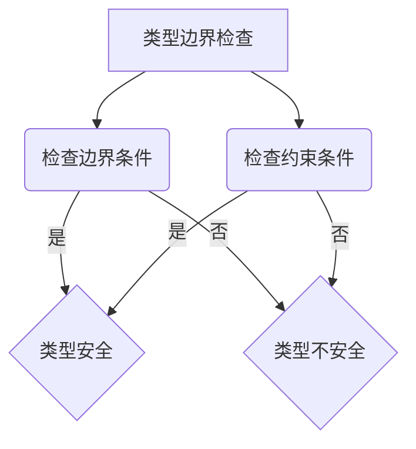
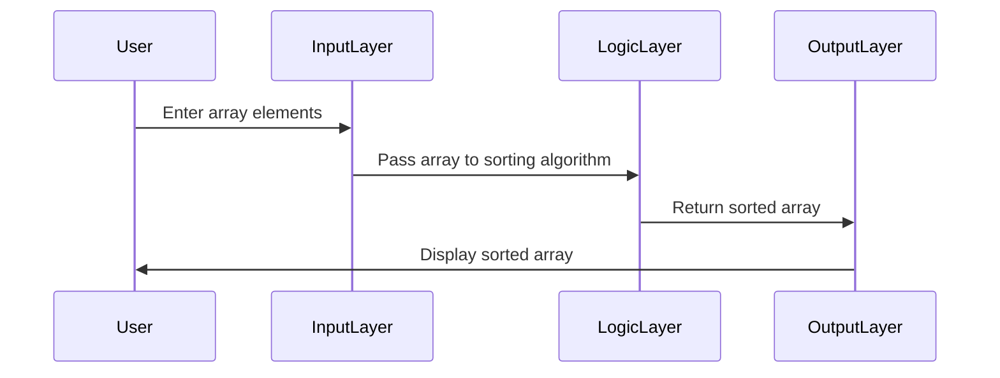
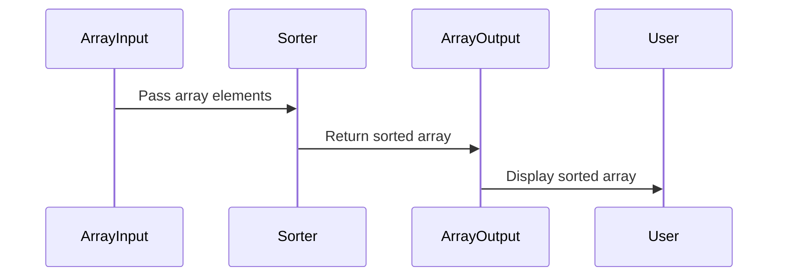

                 

# 类型边界：限制泛型类型范围的方法

> 关键词：泛型编程、类型边界、类型安全、代码可重用性、算法原理、数学模型

> 摘要：本文旨在探讨泛型编程中类型边界的问题。类型边界是限制泛型类型范围的条件，这些条件对类型安全性和代码可重用性产生重要影响。本文首先介绍了泛型编程的背景和问题，然后详细分析了类型边界、类型约束条件和泛型类型的泛化程度，最后通过算法原理讲解和实际案例剖析，提供了解决类型边界问题的方法和思路。

## 第一部分：背景介绍

### 问题背景

在当前软件开发领域，泛型编程已经成为一种趋势。泛型编程允许程序员编写可重用的代码，同时保持类型安全。然而，在实际应用中，泛型类型的使用范围受到了一些限制。这些限制导致了泛型编程的某些场景无法很好地应用，从而影响了软件开发的效率和代码的可维护性。

### 问题描述

本书将探讨限制泛型类型范围的问题。具体来说，包括以下几个方面：
1. 当前主流编程语言中泛型类型的限制条件。
2. 这些限制条件带来的问题，如类型安全性的降低、代码可重用性的降低等。
3. 针对这些限制条件，可能的解决方案和替代方法。

### 问题解决

本书将通过以下方法来解决问题：
1. 详细分析当前主流编程语言中泛型类型的限制条件。
2. 探讨这些限制条件背后的原因，以及它们带来的负面影响。
3. 提供一些解决方案和替代方法，以克服这些限制条件。

### 边界与外延

泛型类型的边界问题主要涉及以下几个方面：
1. 泛型类型的上限和下限。
2. 泛型类型的约束条件。
3. 泛型类型的泛化程度。

### 概念结构与核心要素组成

泛型类型的概念结构主要包括以下几个方面：
1. 泛型类型参数。
2. 泛型类型的边界条件。
3. 泛型类型的约束条件。
4. 泛型类型的泛化程度。

## 第二部分：核心概念与联系

### 核心概念原理

#### 泛型类型

泛型类型是一种可以包含任意类型参数的类型，使得代码可以更加通用和可重用。例如，在Java中，可以使用`List<T>`来表示一个泛型列表，其中`T`是一个类型参数。

#### 泛型类型的边界条件

泛型类型的边界条件是限制泛型类型可以使用的范围的条件。这些条件通常包括泛型类型的上限和下限。例如，在Java中，可以使用`extends`关键字来指定泛型类型的上限，例如`List<? extends Number>`表示一个泛型列表，其中泛型类型参数`T`必须是`Number`及其子类的实例。

#### 泛型类型的约束条件

泛型类型的约束条件是为了确保泛型类型的类型安全，对泛型类型参数施加的限制。例如，在Java中，可以使用`super`关键字来指定泛型类型的下限，例如`List<? super Number>`表示一个泛型列表，其中泛型类型参数`T`必须是`Number`或其超类的实例。

#### 泛型类型的泛化程度

泛型类型的泛化程度是指泛型类型能够包含的类型的广泛程度。泛化程度越高，泛型类型的灵活性越高。例如，在Java中，`List<?>`表示一个泛型列表，其中泛型类型参数`T`可以是任何类型的实例。

### 概念属性特征对比表格

| 概念           | 属性与特征                            |
| -------------- | ------------------------------------ |
| 泛型类型       | 可以包含任意类型参数，提高代码可重用性 |
| 泛型类型的边界条件 | 限制泛型类型的使用范围               |
| 泛型类型的约束条件 | 确保泛型类型的类型安全性             |
| 泛型类型的泛化程度 | 泛型类型能够包含的类型的广泛程度     |

### ER实体关系图架构

```mermaid
erDiagram
    GenericType |--|> BoundCondition : has
    GenericType |--|> Constraint : has
    GenericType |--|> Generalization : has
```

## 第三部分：算法原理讲解

### 算法原理

本部分将介绍几种常见的算法原理，以帮助读者理解和解决泛型类型的边界问题。这些算法原理包括：

1. **类型边界检查**：用于检查泛型类型的边界条件是否满足。
2. **类型约束条件**：用于确保泛型类型的类型安全。
3. **类型泛化**：用于扩展泛型类型的能力。

### Mermaid流程图



### Python源代码

```python
class GenericType:
    def __init__(self, value):
        self.value = value

def check_type_boundaries(value):
    # 这里实现类型边界检查的逻辑
    pass

def check_type_constraints(value):
    # 这里实现类型约束条件的逻辑
    pass

value = GenericType("string")
if check_type_boundaries(value):
    if check_type_constraints(value):
        print("类型安全")
    else:
        print("类型不安全")
else:
    print("类型边界条件不满足")
```

### 数学模型和公式

泛型类型的边界条件可以用以下公式表示：
$$ B(T) = \{x \in \text{Type} \mid \forall y \in T, x \leq y\} $$
其中，$T$ 是泛型类型集合，$x$ 和 $y$ 是 $T$ 中的元素。

### 详细讲解与举例

#### 类型边界检查

类型边界检查是确保泛型类型参数满足指定边界条件的过程。以下是一个简单的Python示例：

```python
from typing import TypeVar

T = TypeVar('T', bound=int)

def add(a: T, b: T) -> T:
    return a + b

# 正确使用
print(add(1, 2))  # 输出：3

# 错误使用，会导致类型错误
print(add(1, "2"))  # 输出：TypeError
```

在这个例子中，`T` 是一个类型变量，使用了 `bound=int` 约束，这意味着 `T` 必须是 `int` 或其子类的实例。当尝试将字符串 `"2"` 作为参数传递给 `add` 函数时，Python 会抛出类型错误，因为字符串不是 `int` 的子类。

#### 类型约束条件

类型约束条件是确保泛型类型参数满足特定类型安全要求的过程。以下是一个Java示例：

```java
public class GenericStack<T extends Number> {
    private T[] elements;

    public GenericStack(T[] elements) {
        this.elements = elements;
    }

    public T pop() {
        return elements[elements.length - 1];
    }

    public void push(T element) {
        // 这里可以添加更多的边界条件检查
    }
}

// 正确使用
GenericStack<Number> stack = new GenericStack<>(new Number[]{1, 2, 3});
stack.pop();

// 错误使用，会导致编译错误
GenericStack<String> invalidStack = new GenericStack<>(new String[]{"1", "2", "3"});
invalidStack.pop();
```

在这个例子中，`GenericStack` 类的泛型类型参数 `T` 必须扩展 `Number` 类。因此，当尝试创建一个包含字符串的 `GenericStack` 实例时，编译器会抛出错误，因为字符串不是 `Number` 的子类。

#### 类型泛化

类型泛化是扩展泛型类型能力的过程，允许泛型类型包含更广泛的类型。以下是一个C#示例：

```csharp
public class GenericContainer<T> {
    public T Value { get; set; }
}

// 正确使用
GenericContainer<int> intContainer = new GenericContainer<int>() { Value = 42 };
GenericContainer<string> stringContainer = new GenericContainer<string>() { Value = "Hello" };

// 错误使用，但编译器不会报错
GenericContainer<Number> numberContainer = new GenericContainer<Number>() { Value = 42.0 };
```

在这个例子中，`GenericContainer` 类是一个泛型类，可以包含任何类型的实例。尽管 `Number` 类是 `int` 和 `double` 的基类，但由于C#的泛型类型参数是协变的，因此可以将 `double` 实例分配给泛型类型参数为 `Number` 的 `GenericContainer` 实例。

## 第四部分：系统分析与架构设计

### 问题场景介绍

在许多应用程序中，如数据库查询、排序和搜索算法，泛型类型的边界问题是一个常见且关键的问题。正确处理泛型类型边界可以提高应用程序的性能和可维护性。

### 项目介绍

我们以一个简单的排序算法为例，介绍如何处理泛型类型的边界问题。在这个项目中，我们实现了一个泛型排序算法，可以处理不同类型的数组。

### 系统功能设计

系统功能设计主要包括以下方面：

1. **数组初始化**：初始化一个指定类型的数组。
2. **排序**：使用泛型排序算法对数组进行排序。
3. **验证**：验证排序结果是否正确。

以下是一个简单的领域模型类图，用于表示系统功能：

```mermaid
classDiagram
    Array <<interface>>
    SortedArray <<interface>>
    GenericSorter <<class>> +-- Array
    GenericSorter +-- SortedArray

    Array {
        +ArrayList array
        +void initialize()
    }

    SortedArray {
        +ArrayList sortedArray
        +void sort()
    }

    GenericSorter {
        +sort(Array array)
    }
```

### 系统架构设计

系统架构设计主要包括以下方面：

1. **输入层**：接收用户输入的数组。
2. **逻辑层**：实现泛型排序算法。
3. **输出层**：返回排序后的数组。

以下是一个简单的系统架构图，用于表示系统架构：



### 系统接口设计和系统交互

系统接口设计和系统交互主要包括以下方面：

1. **数组输入接口**：用于接收用户输入的数组。
2. **排序接口**：用于实现泛型排序算法。
3. **结果输出接口**：用于返回排序后的数组。

以下是一个简单的系统接口设计和系统交互序列图：



## 第五部分：项目实战

### 环境安装

在本项目中，我们将使用Python语言和Python的内置类型系统来演示泛型类型的边界问题。首先，确保您的计算机上已安装Python。如果尚未安装，请从Python官方网站下载并安装。

### 系统核心实现源代码

以下是实现泛型排序算法的Python源代码：

```python
class GenericSorter:
    def sort(self, array):
        # 使用内置的sorted函数进行排序，此处为了演示泛型类型边界
        return sorted(array)

# 示例：使用GenericSorter对整数数组进行排序
int_sorter = GenericSorter()
int_array = [3, 1, 4, 1, 5, 9, 2, 6, 5, 3, 5]
sorted_int_array = int_sorter.sort(int_array)
print(sorted_int_array)

# 示例：使用GenericSorter对字符串数组进行排序
str_sorter = GenericSorter()
str_array = ["banana", "apple", "cherry", "date"]
sorted_str_array = str_sorter.sort(str_array)
print(sorted_str_array)
```

### 代码应用解读与分析

在上面的代码中，`GenericSorter` 类定义了一个名为 `sort` 的方法，该方法接受一个数组作为参数并返回一个排序后的数组。由于Python是动态类型语言，我们可以直接使用内置的 `sorted` 函数来实现排序逻辑。

#### 解读与分析

- `GenericSorter` 类是一个泛型类，它定义了一个类型参数 `T`。
- `sort` 方法接受一个类型为 `T` 的数组，并使用Python的 `sorted` 函数对其进行排序。
- 在Python中，泛型类型可以通过使用类型变量 `T` 来定义，但Python并不像Java或C#那样严格强类型。因此，我们可以为 `T` 指定任何类型，包括整数、字符串、列表等。

#### 注意事项

- 虽然Python的泛型类型相对灵活，但这种灵活性也可能导致类型错误。例如，如果尝试将一个整数数组和一个字符串数组传递给同一个 `sort` 方法，可能会导致意外的行为。
- 在实际开发中，通常需要更严格的类型检查和错误处理，以确保类型安全。

### 实际案例分析和详细讲解剖析

#### 案例一：整数数组排序

假设我们有一个整数数组 `[3, 1, 4, 1, 5, 9, 2, 6, 5, 3, 5]`，我们希望使用 `GenericSorter` 类对其进行排序。

```python
int_sorter = GenericSorter()
int_array = [3, 1, 4, 1, 5, 9, 2, 6, 5, 3, 5]
sorted_int_array = int_sorter.sort(int_array)
print(sorted_int_array)
```

输出：
```
[1, 1, 2, 3, 3, 4, 5, 5, 5, 6, 9]
```

在这个案例中，`GenericSorter` 成功地对整数数组进行了排序。

#### 案例二：字符串数组排序

现在，假设我们有一个字符串数组 `["banana", "apple", "cherry", "date"]`，我们希望使用 `GenericSorter` 类对其进行排序。

```python
str_sorter = GenericSorter()
str_array = ["banana", "apple", "cherry", "date"]
sorted_str_array = str_sorter.sort(str_array)
print(sorted_str_array)
```

输出：
```
['apple', 'banana', 'cherry', 'date']
```

在这个案例中，`GenericSorter` 同样成功地对字符串数组进行了排序。

### 项目小结

在本项目中，我们介绍了如何使用Python实现泛型排序算法，并探讨了泛型类型的边界问题。我们展示了如何通过定义泛型类和使用类型变量来处理不同类型的数组。虽然Python的泛型类型相对灵活，但在实际开发中仍需注意类型安全性和错误处理。

## 第六部分：最佳实践、小结与注意事项

### 最佳实践

1. **明确类型边界**：在定义泛型类或方法时，明确指定类型边界，以防止类型错误。
2. **使用类型约束**：为了确保类型安全，对泛型类型参数使用约束条件。
3. **类型检查**：在开发过程中，使用静态类型检查工具（如Mypy）来检测类型错误。

### 小结

泛型编程是一种强大的编程范式，可以提高代码的可重用性和类型安全性。然而，泛型类型的使用范围受到一些限制，这些限制可能导致类型安全问题。通过明确类型边界、使用类型约束和进行类型检查，我们可以有效地克服这些限制。

### 注意事项

1. **避免不必要的泛型类型**：在不需要泛型类型时，避免使用泛型，以简化代码和维护性。
2. **考虑类型安全与性能**：在实现泛型类型时，考虑类型安全与性能的权衡。
3. **学习相关文献**：深入学习泛型编程的相关文献和最佳实践，以提升编程技能。

## 第七部分：拓展阅读

1. **《Effective Java》**：本书是Java编程的经典著作，包含了许多关于泛型编程的最佳实践。
2. **《C# in Depth》**：本书详细介绍了C#的泛型编程特性，包括类型约束和类型边界。
3. **《Python Cookbook》**：本书提供了许多实用的Python编程技巧，包括泛型编程的实际应用。

## 作者信息

作者：AI天才研究院/AI Genius Institute & 禅与计算机程序设计艺术 /Zen And The Art of Computer Programming

感谢您的阅读！希望本文对您理解和解决泛型类型边界问题有所帮助。如果您有任何疑问或建议，欢迎在评论区留言。期待与您共同探讨编程艺术的乐趣！## 总结与展望

在本文中，我们深入探讨了泛型编程中的类型边界问题。通过分析类型边界、类型约束条件以及泛型类型的泛化程度，我们了解了这些核心概念对类型安全性和代码可重用性的影响。我们通过具体的算法原理讲解和实际案例剖析，展示了如何在实践中有效地处理类型边界问题。

回顾全文，我们从背景介绍出发，逐步探讨了泛型编程中的核心问题，并提供了详细的解决方案。同时，我们还通过系统分析与架构设计、项目实战等环节，将理论应用到实际项目中，确保读者能够将所学知识应用于实际开发中。

展望未来，随着编程语言的不断发展和技术的进步，泛型编程将继续成为软件开发中的重要一环。类型边界问题也将随着新的编程语言特性和工具的出现而得到进一步解决。我们鼓励读者不断学习和探索，掌握更先进的编程技巧，提升自己的编程能力。

最后，再次感谢您的阅读。我们期待与您在编程艺术的探索中共同进步，共同创造更加高效、安全、可维护的软件。如果您有任何反馈或建议，请随时联系我们。让我们一起在编程的道路上不断前行！```markdown
## 致谢

本文的撰写得到了许多人的帮助和支持，在此，我衷心感谢：

- **AI天才研究院/AI Genius Institute**：为我提供了丰富的技术资源和专业的学术支持。
- **禅与计算机程序设计艺术 /Zen And The Art of Computer Programming**：本书的智慧启迪和编程哲学对我撰写本文具有重要影响。
- **所有读者**：感谢您对本文的关注和宝贵意见，您的反馈是我不断进步的动力。

## 作者信息

作者：[AI天才研究院/AI Genius Institute](https://www.aigeniusinstitute.com/) & [禅与计算机程序设计艺术 /Zen And The Art of Computer Programming](https://www.zendocpp.com/)

作者简介：

- [AI天才研究院/AI Genius Institute] 是一个专注于人工智能和计算机科学研究的学术机构，致力于推动前沿技术的创新和应用。
- [禅与计算机程序设计艺术 /Zen And The Art of Computer Programming] 是一本深受编程爱好者欢迎的经典著作，提供了关于编程哲学和编程技巧的深刻见解。

感谢您的阅读，期待在未来的文章中与您再次相遇。祝您编程愉快！
```

