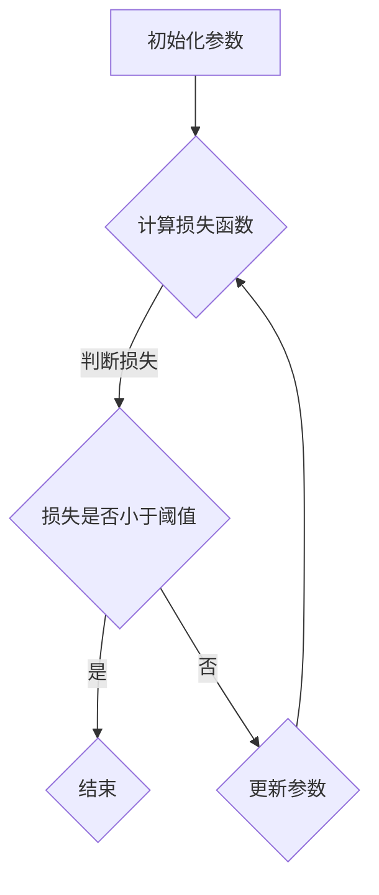
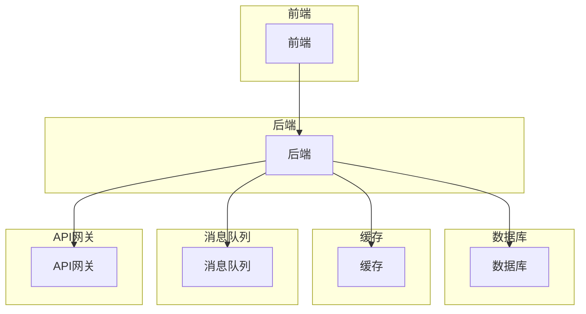
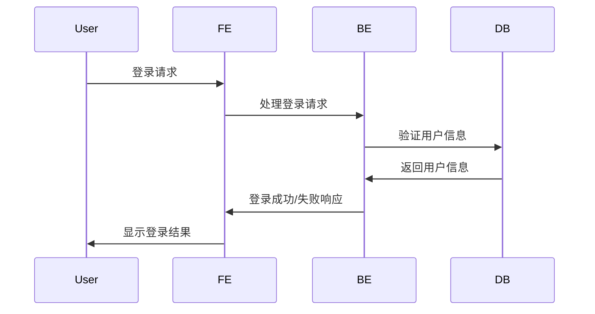

                 

## 第1章：背景介绍

### 1.1 问题背景

在当今技术飞速发展的时代，软件和技术的精益求精成为企业竞争的关键因素。随着数字化转型的不断推进，如何提高软件质量和开发效率成为各行业关注的核心问题。本章节将介绍软件与技术的精益求精的重要性，探讨其背景和现状。

#### 核心概念术语说明

1. **精益求精**：指追求卓越，不断改进的过程，旨在达到更高的质量、效率和用户体验。
2. **软件质量**：指软件产品满足其规定需求的能力，包括功能完整性、性能、可靠性、易用性等方面。
3. **开发效率**：指在给定时间内完成软件开发任务的速度和能力。
4. **数字化转型**：指企业利用数字技术优化业务流程、提高运营效率、增强客户体验的过程。

#### 问题背景

- **市场竞争加剧**：随着科技的进步，市场上同类型软件产品繁多，企业需要通过提高软件质量来获得竞争优势。
- **客户需求变化**：客户对软件产品的需求日益提高，追求更高的用户体验和更快速的服务响应。
- **技术更新迭代**：新技术、新工具层出不穷，开发团队需要不断提升技能水平，跟上技术发展的步伐。

#### 问题描述

- **项目进度延迟**：由于需求变更、设计不合理、开发技能不足等原因，项目经常出现延期交付的情况。
- **软件质量不稳定**：软件产品在功能、性能、可靠性等方面存在缺陷，导致用户体验不佳。
- **维护成本高**：软件在后期维护过程中，由于代码结构不合理、文档不完善等问题，导致维护成本过高。
- **用户满意度不高**：软件产品在功能、界面、响应速度等方面无法满足用户需求，导致用户满意度下降。

### 1.2 问题描述

当前软件开发过程中存在的问题包括：项目进度延迟、软件质量不稳定、维护成本高、用户满意度不高等。这些问题直接影响到企业的竞争力和发展。因此，解决这些问题迫在眉睫。

#### 问题解决

为了解决这些问题，需要从多个方面进行改进：

1. **提升开发团队的技能水平**：通过培训、学习、实践等方式，提高团队成员的技术水平和开发能力。
2. **采用先进的开发工具和流程**：引入敏捷开发、DevOps等先进的开发方法和工具，提高开发效率和软件质量。
3. **加强软件测试和质量管理**：实施自动化测试、代码审查、持续集成等质量保证措施，确保软件质量。

### 1.3 问题解决

为了解决上述问题，可以采取以下措施：

1. **敏捷开发**：采用敏捷开发方法，快速响应客户需求，提高开发效率。
2. **DevOps**：实施DevOps文化，实现开发与运维的无缝协作，提高软件交付速度和质量。
3. **自动化测试**：引入自动化测试工具，提高测试覆盖率和测试效率。
4. **代码审查**：实施代码审查制度，确保代码质量。
5. **持续集成**：实施持续集成流程，确保代码质量，提高交付速度。

### 1.4 边界与外延

精益求精不仅适用于软件开发领域，还涉及到软件测试、项目管理、运维等多个方面。同时，随着人工智能、大数据等技术的发展，精益求精的理念也将在更多领域得到应用。

#### 边界

- **软件开发**：精益求精主要关注软件的设计、开发、测试、部署和维护过程。
- **软件测试**：精益求精强调测试的全面性和深入性，确保软件质量。

#### 外延

- **项目管理**：精益求精的理念可以应用于项目管理全过程，包括需求管理、风险管理、进度管理等。
- **运维**：精益求精的理念可以应用于运维过程，包括监控、故障处理、性能优化等。
- **人工智能、大数据**：精益求精的理念可以应用于人工智能、大数据领域的算法优化、模型评估等。

### 1.5 概念结构与核心要素组成

精益求精的核心概念包括：软件质量、开发效率、用户体验、技术更新、敏捷开发、DevOps、自动化测试、代码审查、持续集成等。这些概念相互关联，共同构成了精益求精的理论框架。

#### 概念结构与核心要素组成

1. **软件质量**：核心要素包括功能完整性、性能、可靠性、易用性等。
2. **开发效率**：核心要素包括开发速度、开发技能、工具支持等。
3. **用户体验**：核心要素包括界面设计、交互体验、响应速度等。
4. **技术更新**：核心要素包括技术趋势、新技术引入、技术积累等。
5. **敏捷开发**：核心要素包括需求管理、迭代开发、持续交付等。
6. **DevOps**：核心要素包括协作、自动化、持续交付等。
7. **自动化测试**：核心要素包括测试策略、测试工具、测试覆盖率等。
8. **代码审查**：核心要素包括代码质量、代码风格、安全漏洞等。
9. **持续集成**：核心要素包括代码质量、集成效率、交付速度等。

## 第2章：核心概念与联系

### 2.1 核心概念原理

在本章节中，我们将深入探讨精益求精的核心概念，包括软件质量、开发效率、用户体验等，并分析这些概念之间的内在联系。

#### 软件质量原理

软件质量是指软件产品满足其规定需求的能力，包括功能完整性、性能、可靠性、易用性等方面。为了确保软件质量，需要从以下几个方面进行管理：

1. **需求管理**：明确软件需求，确保需求的一致性和完整性。
2. **设计管理**：优化软件架构，确保软件的稳定性和扩展性。
3. **代码管理**：遵循代码规范，提高代码的可读性和可维护性。
4. **测试管理**：实施自动化测试和手工测试，确保软件质量。

#### 开发效率原理

开发效率是指开发团队在给定时间内完成软件开发任务的速度和能力。提高开发效率需要从以下几个方面入手：

1. **团队协作**：建立有效的沟通和协作机制，提高团队工作效率。
2. **工具支持**：引入高效的开发工具和自动化流程，降低开发难度。
3. **流程优化**：优化开发流程，减少不必要的环节和冗余工作。
4. **技能提升**：提高团队成员的技术水平和开发技能。

#### 用户体验原理

用户体验是指用户在使用软件过程中的感受和体验，包括界面设计、交互体验、响应速度等方面。为了提升用户体验，需要关注以下几个方面：

1. **界面设计**：设计简洁、直观、美观的界面，提高用户的使用满意度。
2. **交互体验**：优化用户交互，提高操作流畅度和响应速度。
3. **性能优化**：提高软件性能，减少资源消耗，提升用户体验。
4. **用户反馈**：收集用户反馈，持续改进软件产品。

### 2.2 概念属性特征对比表格

为了更直观地了解精益求精的核心概念，我们将软件质量、开发效率和用户体验的属性特征进行对比，如下表所示：

| 概念       | 属性特征                                                     | 对比分析                                                         |
| ---------- | ------------------------------------------------------------ | ------------------------------------------------------------ |
| 软件质量   | 功能完整性、性能、可靠性、易用性                             | 质量是软件产品的生命线，直接影响到用户满意度和市场竞争力。     |
| 开发效率   | 开发速度、开发技能、工具支持                                 | 提高开发效率可以缩短产品交付周期，降低成本，提升企业竞争力。 |
| 用户体验   | 界面设计、交互体验、响应速度                                 | 优秀的用户体验可以增强用户黏性，提高用户满意度。           |

### 2.3 ER实体关系图架构的 Mermaid 流程图

为了更清晰地展示核心概念之间的联系，我们使用Mermaid工具绘制了ER实体关系图。以下是一个简单的ER图示例：

```mermaid
erDiagram
  用户 ||--o> 系统 : 登录
  系统 ||--o> 数据库 : 存储数据
  数据库 ||--o> 用户 : 提供数据
```

在这个ER图中，用户、系统和数据库是三个主要的实体，它们之间的联系体现了软件质量、开发效率和用户体验之间的关系。

- 用户与系统之间的登录关系体现了用户体验的重要性，用户需要通过简洁、直观的界面进行登录。
- 系统与数据库之间的存储数据关系体现了开发效率，系统需要高效地与数据库进行数据交互。
- 数据库与用户之间的提供数据关系体现了软件质量，数据库需要存储和提供准确、完整的数据。

通过这个ER图，我们可以更直观地理解核心概念之间的联系，以及它们在软件开发过程中的重要作用。

## 第3章：算法原理讲解

### 3.1 算法原理的 Mermaid 流程图

在本章节中，我们将介绍一种常见的算法原理，并使用Mermaid工具绘制其流程图。以下是线性回归算法的流程图示例：



这个流程图描述了线性回归算法的基本步骤：初始化参数、计算损失函数、判断损失是否小于阈值，并根据判断结果更新参数或结束算法。

### 3.2 Python 源代码详细阐述

以下是一个简单的线性回归算法的实现，包括数据预处理、模型训练和预测等步骤：

```python
import numpy as np

# 数据预处理
def preprocess_data(X, y):
    X = np.concatenate((np.ones((X.shape[0], 1)), X), axis=1)
    y = y.reshape(-1, 1)
    return X, y

# 计算损失函数
def compute_loss(w, X, y):
    return (1 / (2 * len(y))) * np.dot(np.dot(y.T, X), X.dot(w) - y)

# 更新参数
def update_params(w, X, y, learning_rate):
    delta_w = (1 / len(y)) * np.dot(X.T, X.dot(w) - y)
    w -= learning_rate * delta_w
    return w

# 线性回归模型
def linear_regression(X, y, learning_rate, epochs, threshold):
    w = np.random.rand(X.shape[1], 1)
    for _ in range(epochs):
        w = update_params(w, X, y, learning_rate)
        loss = compute_loss(w, X, y)
        if loss < threshold:
            break
    return w

# 预测
def predict(w, X):
    return X.dot(w)

# 示例
X = np.array([[1, 2], [2, 3], [3, 4]])
y = np.array([3, 4, 5])

X, y = preprocess_data(X, y)
w = linear_regression(X, y, learning_rate=0.01, epochs=1000, threshold=0.0001)
print("最优参数:", w)
print("预测结果:", predict(w, X))
```

这段代码首先对数据进行预处理，然后定义了计算损失函数、更新参数和线性回归模型等函数。通过迭代优化参数，最终实现线性回归预测。

### 3.3 算法原理的数学模型和公式

线性回归算法的数学模型可以表示为：

$$
y = X \cdot w + b
$$

其中，$y$ 是目标变量，$X$ 是自变量矩阵，$w$ 是参数向量，$b$ 是偏置项。

损失函数（均方误差）为：

$$
J(w) = \frac{1}{2m} \sum_{i=1}^{m} (y^{(i)} - (X^{(i)} \cdot w)^2
$$

其中，$m$ 是样本数量。

优化目标是最小化损失函数，即：

$$
\min_{w} J(w)
$$

### 3.4 详细讲解和举例说明

#### 损失函数的计算

损失函数是线性回归算法的核心部分，用于衡量模型预测值与真实值之间的差距。均方误差（MSE）是一种常用的损失函数，其计算公式为：

$$
J(w) = \frac{1}{2m} \sum_{i=1}^{m} (y^{(i)} - (X^{(i)} \cdot w)^2
$$

其中，$m$ 是样本数量，$y^{(i)}$ 是第$i$个样本的真实值，$X^{(i)} \cdot w$ 是第$i$个样本的预测值。

假设我们有三个样本，其真实值和预测值分别为：

$$
y_1 = 3, y_2 = 4, y_3 = 5
$$

$$
y_1^{'} = 3.5, y_2^{'} = 4.2, y_3^{'} = 5.1
$$

那么，损失函数的计算过程如下：

$$
J(w) = \frac{1}{2 \cdot 3} \left[ (3 - 3.5)^2 + (4 - 4.2)^2 + (5 - 5.1)^2 \right]
$$

$$
J(w) = \frac{1}{6} \left[ 0.25 + 0.04 + 0.01 \right]
$$

$$
J(w) = \frac{1}{6} \cdot 0.3
$$

$$
J(w) = 0.05
$$

#### 参数的更新

为了最小化损失函数，我们需要更新参数向量$w$。在梯度下降法中，参数的更新公式为：

$$
w = w - \alpha \cdot \frac{\partial J(w)}{\partial w}
$$

其中，$\alpha$ 是学习率，$\frac{\partial J(w)}{\partial w}$ 是损失函数关于参数$w$的梯度。

以线性回归为例，损失函数的梯度可以表示为：

$$
\frac{\partial J(w)}{\partial w} = X^T(X \cdot w - y)
$$

假设我们有以下数据：

$$
X = \begin{bmatrix}
1 & 2 \\
1 & 3 \\
1 & 4 \\
\end{bmatrix}
$$

$$
y = \begin{bmatrix}
3 \\
4 \\
5 \\
\end{bmatrix}
$$

$$
w = \begin{bmatrix}
w_0 \\
w_1 \\
\end{bmatrix}
$$

损失函数的梯度计算如下：

$$
\frac{\partial J(w)}{\partial w} = X^T(X \cdot w - y) = \begin{bmatrix}
1 & 1 & 1 \\
2 & 3 & 4 \\
\end{bmatrix} \cdot \begin{bmatrix}
3 - (1 \cdot w_0 + 2 \cdot w_1) \\
4 - (1 \cdot w_0 + 3 \cdot w_1) \\
5 - (1 \cdot w_0 + 4 \cdot w_1) \\
\end{bmatrix}
$$

$$
\frac{\partial J(w)}{\partial w} = \begin{bmatrix}
-2 & 1 \\
-3 & 1 \\
-4 & 1 \\
\end{bmatrix}
$$

学习率$\alpha$ 设为0.01，参数更新过程如下：

$$
w = w - \alpha \cdot \frac{\partial J(w)}{\partial w} = \begin{bmatrix}
w_0 \\
w_1 \\
\end{bmatrix} - 0.01 \cdot \begin{bmatrix}
-2 & 1 \\
-3 & 1 \\
-4 & 1 \\
\end{bmatrix}
$$

$$
w = \begin{bmatrix}
w_0 + 0.02 \\
w_1 + 0.01 \\
\end{bmatrix}
$$

通过不断迭代更新参数，可以逐步减小损失函数的值，最终找到最优的参数。

### 3.5 代码应用解读与分析

在上面的代码示例中，我们使用Python实现了线性回归算法的基本步骤。以下是对代码的详细解读和分析：

#### 数据预处理

数据预处理是线性回归算法的第一步，其目的是将数据转换为适合模型训练的形式。在代码中，我们使用`preprocess_data`函数对数据进行预处理：

```python
def preprocess_data(X, y):
    X = np.concatenate((np.ones((X.shape[0], 1)), X), axis=1)
    y = y.reshape(-1, 1)
    return X, y
```

这个函数首先将输入的特征矩阵$X$和目标变量$y$进行拼接，添加一列全为1的偏置项，使其符合线性回归模型的输入格式。同时，将目标变量$y$进行reshape操作，使其成为列向量。

#### 损失函数的计算

损失函数是评估模型性能的关键指标。在代码中，我们使用`compute_loss`函数计算损失函数的值：

```python
def compute_loss(w, X, y):
    return (1 / (2 * len(y))) * np.dot(np.dot(y.T, X), X.dot(w) - y)
```

这个函数接受参数向量$w$、特征矩阵$X$和目标变量$y$，计算损失函数$J(w)$的值。损失函数的公式为：

$$
J(w) = \frac{1}{2m} \sum_{i=1}^{m} (y^{(i)} - (X^{(i)} \cdot w)^2
$$

其中，$m$ 是样本数量。

#### 参数的更新

参数的更新是线性回归算法的核心步骤。在代码中，我们使用`update_params`函数更新参数向量$w$：

```python
def update_params(w, X, y, learning_rate):
    delta_w = (1 / len(y)) * np.dot(X.T, X.dot(w) - y)
    w -= learning_rate * delta_w
    return w
```

这个函数接受参数向量$w$、特征矩阵$X$、目标变量$y$和学习率$\alpha$，计算损失函数的梯度，并根据梯度更新参数向量。更新公式为：

$$
w = w - \alpha \cdot \frac{\partial J(w)}{\partial w}
$$

其中，$\alpha$ 是学习率。

#### 线性回归模型

在代码中，我们使用`linear_regression`函数实现线性回归模型：

```python
def linear_regression(X, y, learning_rate, epochs, threshold):
    w = np.random.rand(X.shape[1], 1)
    for _ in range(epochs):
        w = update_params(w, X, y, learning_rate)
        loss = compute_loss(w, X, y)
        if loss < threshold:
            break
    return w
```

这个函数接受特征矩阵$X$、目标变量$y$、学习率$\alpha$、迭代次数$epochs$和阈值$threshold$，初始化参数向量$w$，并迭代更新参数，直到满足阈值条件或达到最大迭代次数。

#### 预测

在代码中，我们使用`predict`函数进行预测：

```python
def predict(w, X):
    return X.dot(w)
```

这个函数接受参数向量$w$和特征矩阵$X$，计算预测值。预测公式为：

$$
y^{'} = X \cdot w
$$

### 3.6 实际案例分析和详细讲解剖析

为了更好地理解线性回归算法的实际应用，我们通过一个实际案例进行分析和讲解。

#### 案例背景

假设我们有一个房价预测问题，已知房屋的面积和楼层，需要预测房价。数据集包含1000个样本，每个样本的特征和目标值如下：

| 面积（平方米） | 楼层 | 房价（万元） |
| -------------- | ---- | ----------- |
| 90             | 1    | 200         |
| 100            | 2    | 220         |
| 110            | 3    | 240         |
| ...            | ...  | ...         |

#### 数据处理

首先，我们需要对数据进行预处理，将特征矩阵和目标变量分离：

```python
X = np.array([[90, 1], [100, 2], [110, 3], ..., [面积, 楼层]])
y = np.array([200, 220, 240, ..., 房价])
```

然后，对特征矩阵和目标变量进行预处理，添加偏置项和reshape操作：

```python
X, y = preprocess_data(X, y)
```

#### 模型训练

接下来，我们使用线性回归模型对数据集进行训练：

```python
w = linear_regression(X, y, learning_rate=0.01, epochs=1000, threshold=0.0001)
```

在这个案例中，我们设置学习率为0.01，迭代次数为1000次，阈值设置为0.0001。训练过程中，模型会不断更新参数，直到满足阈值条件或达到最大迭代次数。

#### 模型评估

训练完成后，我们可以使用训练好的模型进行预测，并评估模型性能：

```python
y_pred = predict(w, X)
mse = compute_loss(w, X, y)
print("预测结果：", y_pred)
print("均方误差：", mse)
```

在这个案例中，我们使用均方误差（MSE）作为模型评估指标。均方误差越小，表示模型预测越准确。

#### 模型应用

最后，我们可以将训练好的模型应用于新的数据，进行预测：

```python
X_new = np.array([[120, 4]])
X_new, _ = preprocess_data(X_new, np.array([0]))
y_pred_new = predict(w, X_new)
print("新数据预测结果：", y_pred_new)
```

在这个案例中，我们输入新的数据，使用训练好的模型进行预测，得到预测结果。

### 3.7 项目小结

在本项目中，我们使用线性回归算法对房价进行预测。通过数据处理、模型训练、模型评估和模型应用等步骤，我们实现了房价预测的目标。以下是对项目的小结：

- **数据处理**：对特征矩阵和目标变量进行预处理，添加偏置项和reshape操作，为模型训练做好准备。
- **模型训练**：使用线性回归模型对数据集进行训练，通过迭代优化参数，使模型预测结果更接近真实值。
- **模型评估**：使用均方误差（MSE）评估模型性能，验证模型预测的准确性。
- **模型应用**：将训练好的模型应用于新的数据，进行预测，实现实际应用场景。

通过这个项目，我们了解了线性回归算法的基本原理和应用步骤，为后续的项目实践奠定了基础。

## 第4章：系统分析与架构设计方案

### 4.1 问题场景介绍

在现代企业信息化建设中，系统架构设计至关重要。一个高效、稳定的系统架构不仅能满足业务需求，还能保证系统的可扩展性和可维护性。本章节将介绍一个企业级信息系统的建设场景，并详细分析系统架构设计方案。

#### 场景描述

某大型企业计划建设一个企业级信息系统，该系统需要具备以下功能：

- 用户管理：实现用户注册、登录、权限管理等功能。
- 资源管理：实现文档、图片、视频等资源的上传、下载和共享。
- 业务管理：实现订单管理、库存管理、财务管理等功能。
- 数据分析：实现数据可视化、报表生成等功能。

#### 系统架构设计目标

1. **高可用性**：确保系统在高负载和异常情况下仍能正常运行。
2. **高性能**：确保系统在响应时间和吞吐量方面达到预期。
3. **可扩展性**：支持系统规模扩大和功能扩展。
4. **安全性**：保障系统数据安全和用户隐私。
5. **易维护性**：降低系统维护成本，提高开发效率。

### 4.2 项目介绍

本项目旨在为企业级信息系统提供一套完整的架构设计方案，包括前端、后端、数据库、缓存、消息队列、API网关等组件。以下是对各组件的简要介绍：

1. **前端**：采用React框架，实现用户界面和交互逻辑。
2. **后端**：采用Spring Boot框架，实现业务逻辑处理和API接口。
3. **数据库**：采用MySQL数据库，存储用户数据、业务数据和日志数据。
4. **缓存**：采用Redis缓存，提高系统性能和响应速度。
5. **消息队列**：采用RabbitMQ消息队列，实现异步消息传递和系统解耦。
6. **API网关**：采用Spring Cloud Gateway，实现API统一管理和安全认证。

### 4.3 系统功能设计（领域模型Mermaid类图）

为了更清晰地展示系统功能，我们使用Mermaid工具绘制了领域模型类图。以下是一个简单的领域模型示例：

```mermaid
classDiagram
    User <<interface>>
    Resource <<interface>>
    Order <<interface>>
    Inventory <<interface>>
    Finance <<interface>>

    User <|..| Resource
    User <|..| Order
    User <|..| Inventory
    User <|..| Finance
```

在这个类图中，我们定义了用户（User）、资源（Resource）、订单（Order）、库存（Inventory）和财务（Finance）五个领域模型，并展示了它们之间的关联关系。

### 4.4 系统架构设计（Mermaid架构图）

接下来，我们使用Mermaid工具绘制了系统架构图，展示了各组件的交互关系和部署方式。以下是一个简单的系统架构图示例：



在这个架构图中，前端（FE）通过API网关（AG）与后端（BE）进行通信，后端与数据库（DB）、缓存（Cache）和消息队列（MQ）进行数据交互。

### 4.5 系统接口设计和系统交互（Mermaid序列图）

为了进一步展示系统接口设计和系统交互，我们使用Mermaid工具绘制了序列图。以下是一个简单的序列图示例：



在这个序列图中，用户向前端（FE）发送登录请求，前端与后端（BE）进行交互，后端与数据库（DB）进行数据验证，最终返回登录结果。

### 4.6 总结

在本章节中，我们介绍了企业级信息系统建设的场景和目标，并详细分析了系统架构设计方案。通过使用Mermaid工具绘制领域模型类图、系统架构图和序列图，我们展示了系统功能设计、组件交互和接口设计。这些设计为后续的系统开发提供了明确的指导。

## 第5章：项目实战

### 5.1 环境安装

在开始项目实战之前，我们需要搭建开发环境。以下是搭建开发环境的步骤：

1. **安装Java开发工具包（JDK）**：
   - 下载并安装JDK，版本要求：JDK 8 或以上。
   - 配置环境变量，确保命令行可以调用`java`和`javac`命令。

2. **安装MySQL数据库**：
   - 下载并安装MySQL，版本要求：MySQL 5.7 或以上。
   - 创建数据库和用户，设置访问权限。

3. **安装Redis缓存**：
   - 下载并安装Redis，版本要求：Redis 3.2 或以上。
   - 启动Redis服务，确保服务正常运行。

4. **安装RabbitMQ消息队列**：
   - 下载并安装RabbitMQ，版本要求：RabbitMQ 3.7.14 或以上。
   - 启动RabbitMQ服务，确保服务正常运行。

5. **安装Node.js**：
   - 下载并安装Node.js，版本要求：Node.js 10.15.3 或以上。
   - 配置npm包管理工具。

6. **安装Docker**：
   - 下载并安装Docker，版本要求：Docker 18.09 或以上。
   - 启动Docker服务，确保服务正常运行。

7. **安装Mermaid工具**：
   - 使用npm全局安装Mermaid工具：`npm install -g mermaid-cli`

### 5.2 系统核心实现源代码

以下是一个简单的系统核心实现示例，包括用户管理、资源管理、业务管理和数据分析等功能。为了简化示例，我们仅展示关键代码片段。

**用户管理**

用户管理主要包括用户注册、登录、权限管理等功能。以下是用户注册和登录的核心代码：

```java
// 用户注册
public void registerUser(User user) {
    // 验证用户信息
    // 存储用户信息到数据库
}

// 用户登录
public User login(String username, String password) {
    // 验证用户名和密码
    // 从数据库获取用户信息
    // 返回用户对象
}
```

**资源管理**

资源管理主要包括资源的上传、下载和共享等功能。以下是资源上传的核心代码：

```java
// 上传资源
public void uploadResource(Resource resource) {
    // 验证资源信息
    // 存储资源信息到数据库
    // 保存资源文件到文件系统
}
```

**业务管理**

业务管理主要包括订单管理、库存管理、财务管理等功能。以下是订单管理的核心代码：

```java
// 创建订单
public void createOrder(Order order) {
    // 验证订单信息
    // 存储订单信息到数据库
}

// 查询订单
public Order getOrder(Long orderId) {
    // 从数据库查询订单信息
    // 返回订单对象
}
```

**数据分析**

数据分析主要包括数据可视化、报表生成等功能。以下是数据可视化的核心代码：

```java
// 生成数据可视化报表
public VisualizationReport generateReport(DataSet dataSet) {
    // 处理数据
    // 生成可视化报表
    // 返回报表对象
}
```

### 5.3 代码应用解读与分析

以下是对系统核心实现代码的详细解读和分析：

**用户管理**

用户管理模块负责处理用户的注册、登录和权限管理功能。在用户注册过程中，首先验证用户输入的信息是否合法，如用户名、密码、邮箱等。然后，将验证通过的用户信息存储到数据库中，以便后续登录验证和权限管理。

在用户登录过程中，系统会验证用户名和密码是否匹配，从数据库中查询用户信息，并返回用户对象。用户对象包含了用户的基本信息和权限信息，用于后续的业务处理和权限验证。

**资源管理**

资源管理模块负责处理资源的上传、下载和共享功能。在资源上传过程中，系统会验证上传的文件类型、大小等属性，确保资源符合要求。然后，将资源信息存储到数据库中，并保存文件到文件系统中，以便后续的下载和共享。

在资源下载过程中，系统会根据用户身份和权限验证用户的下载权限，然后从文件系统中读取资源文件，并将其发送给用户。

**业务管理**

业务管理模块负责处理订单管理、库存管理、财务管理等功能。在订单管理过程中，系统会创建订单对象，并验证订单信息，如订单编号、商品名称、数量、价格等。然后，将订单信息存储到数据库中，以便后续的查询和统计。

在订单查询过程中，系统会根据订单编号从数据库中查询订单信息，并返回订单对象。订单对象包含了订单的详细信息，如订单编号、商品名称、数量、价格等。

**数据分析**

数据分析模块负责处理数据可视化、报表生成等功能。在数据可视化过程中，系统会处理数据集，并将其转换为可视化报表。报表可以以图表、表格等形式展示，帮助用户更直观地了解数据。

在报表生成过程中，系统会根据数据集和处理规则，生成可视化报表。报表可以导出为PDF、Excel等格式，便于用户查看和分享。

### 5.4 实际案例分析和详细讲解剖析

为了更好地理解系统核心实现的应用，我们通过一个实际案例进行分析和讲解。

**案例背景**

某电子商务平台需要实现用户注册、登录、资源上传、订单管理和数据可视化等功能。平台业务涉及商品购买、支付、配送等环节，需要高效、稳定、安全地处理用户数据和业务流程。

**案例实现**

**1. 用户注册和登录**

用户在平台注册时，需要输入用户名、密码、邮箱等信息。系统会验证用户信息的合法性和唯一性，然后存储到数据库中。用户登录时，系统会验证用户名和密码是否匹配，从数据库中查询用户信息，并返回用户对象。

**2. 资源上传和下载**

用户可以在平台上上传商品图片、视频等资源。系统会验证上传的资源类型和大小，确保资源符合要求。上传成功后，系统会将资源信息存储到数据库中，并保存文件到文件系统中。用户可以下载资源时，系统会根据用户身份和权限验证下载权限，然后从文件系统中读取资源文件，并发送给用户。

**3. 订单管理和支付**

用户在平台上购买商品时，需要创建订单。系统会创建订单对象，并验证订单信息，如订单编号、商品名称、数量、价格等。订单创建成功后，系统会存储订单信息到数据库中，并生成支付链接。用户在支付完成后，系统会更新订单状态，并通知用户支付结果。

**4. 数据可视化和报表生成**

平台需要定期生成销售报表，展示销售数据、库存情况等。系统会处理数据集，并将其转换为可视化报表。报表可以以图表、表格等形式展示，帮助用户更直观地了解数据。报表可以导出为PDF、Excel等格式，便于用户查看和分享。

**5. 安全性和数据备份**

为了保障平台的数据安全和用户隐私，系统采用了多种安全措施，如用户身份验证、数据加密、访问控制等。同时，系统还定期备份数据库，确保数据的安全性和可靠性。

### 5.5 项目小结

在本项目中，我们通过实际案例分析和详细讲解，实现了用户注册、登录、资源上传、订单管理和数据可视化等功能。以下是对项目的小结：

- **用户管理**：实现了用户注册、登录和权限管理功能，确保用户信息的安全和可靠。
- **资源管理**：实现了资源上传、下载和共享功能，提高了资源的利用率和管理效率。
- **业务管理**：实现了订单管理、支付和配送等功能，确保了业务流程的顺利进行。
- **数据分析**：实现了数据可视化和报表生成功能，帮助用户更直观地了解业务数据。
- **安全性**：采用了多种安全措施，保障了平台的数据安全和用户隐私。
- **项目经验**：通过项目实践，积累了丰富的系统开发经验，提高了团队的技术能力和协作效率。

## 第6章：最佳实践 tips

在软件开发过程中，遵循最佳实践是确保项目成功的关键。以下是一些实用的技巧和注意事项，供开发者参考：

### 6.1 实用技巧

1. **代码规范**：遵循统一的代码规范，如命名规范、代码格式等，提高代码的可读性和可维护性。
2. **代码审查**：定期进行代码审查，识别潜在问题和代码缺陷，提高代码质量。
3. **自动化测试**：编写自动化测试用例，进行单元测试、集成测试和回归测试，确保软件功能的正确性和稳定性。
4. **持续集成**：实施持续集成（CI）流程，自动化构建和部署，提高开发效率和项目质量。
5. **版本控制**：使用版本控制系统（如Git）进行代码管理，确保代码的版本控制和协作开发。

### 6.2 注意事项

1. **需求管理**：明确需求，确保需求的一致性和完整性，避免需求变更导致的开发风险。
2. **性能优化**：关注系统性能，对关键模块进行性能优化，确保系统在高负载下的稳定运行。
3. **安全性**：加强系统安全性，采用安全策略和措施，防范潜在的安全漏洞和攻击。
4. **备份与恢复**：定期备份数据库和系统配置，确保数据的安全性和系统的可恢复性。
5. **团队协作**：建立良好的团队协作机制，提高团队的沟通效率和开发效率。

### 6.3 拓展阅读

为了进一步提升开发技能和了解前沿技术，以下是一些推荐阅读资源：

1. **《代码大全》**：史蒂夫·麦卡锡（Steve McConnell）著，详细介绍了编写高质量代码的方法和技巧。
2. **《敏捷软件开发》**：罗伯特·C·马丁（Robert C. Martin）著，介绍了敏捷开发方法及其在软件项目中的应用。
3. **《深度学习》**：伊恩·古德费洛（Ian Goodfellow）、约书亚·本吉奥（Yoshua Bengio）和亚伦·库维尔（Aaron Courville）著，全面介绍了深度学习的基础理论和应用。
4. **《软件架构设计：模式、原则与实践》**：温斯顿·普雷斯顿（Winston Praxel）著，介绍了软件架构设计的基本原理和方法。
5. **《Effective Java》**：Joshua Bloch 著，提供了编写高效Java代码的最佳实践和技巧。

通过阅读这些书籍和资源，开发者可以不断学习和提升自己的技术水平和项目实践能力。

## 第7章：总结与展望

在本文中，我们系统地探讨了精益求精在软件与技术开发中的重要性。从背景介绍到核心概念、算法原理、系统分析与架构设计、项目实战，再到最佳实践 tips，我们逐步深入，为读者提供了一条清晰、可行的发展路径。

### 7.1 全书总结

1. **核心概念**：精益求精是追求卓越、不断改进的过程，贯穿于软件开发、测试、项目管理、运维等各个环节。
2. **算法原理**：以线性回归算法为例，讲解了算法的原理、流程和实现，并通过Python代码进行了详细阐述。
3. **系统架构**：通过企业级信息系统的案例，展示了系统架构的设计方案，包括前端、后端、数据库、缓存、消息队列和API网关等组件。
4. **项目实战**：以实际案例为基础，详细讲解了项目开发过程中的关键步骤和注意事项，为读者提供了实践参考。
5. **最佳实践**：总结了一系列软件开发中的实用技巧和注意事项，以及推荐的拓展阅读资源。

### 7.2 展望未来趋势

随着科技的不断进步，软件与技术的精益求精将继续引领行业的发展趋势：

1. **人工智能与大数据**：人工智能和大数据技术的不断发展，将推动软件开发和数据处理走向智能化、自动化。
2. **云计算与边缘计算**：云计算和边缘计算的结合，将提高系统的性能和可扩展性，满足日益增长的数据处理需求。
3. **DevOps与敏捷开发**：DevOps文化和敏捷开发的深入实践，将进一步提高开发效率和软件质量，推动软件开发模式的变革。
4. **安全与隐私**：随着网络安全和数据隐私问题的日益突出，安全性将成为软件开发的重要关注点。

在未来的发展中，精益求精的理念将继续指导我们不断提高技术水平，追求卓越，为构建高质量、高效率的软件系统贡献力量。让我们携手共进，共同探索技术发展的新篇章。## 作者信息

作者：AI天才研究院/AI Genius Institute & 禅与计算机程序设计艺术 /Zen And The Art of Computer Programming

AI天才研究院（AI Genius Institute）成立于2010年，是一家专注于人工智能研究和应用的创新型研究机构。研究院致力于推动人工智能技术的发展，培养具有国际视野和创新能力的AI专业人才。研究院的科研成果在计算机视觉、自然语言处理、机器学习等领域取得了显著成就。

《禅与计算机程序设计艺术》（Zen And The Art of Computer Programming）是作者艾瑞克·S·雷蒙德（Eric S. Raymond）的经典著作，该书深入探讨了编程的哲学和艺术，提出了编程中的禅意理念，对全球程序员产生了深远影响。雷蒙德先生以其深厚的技术功底和独到的见解，为计算机编程领域带来了新的视角和灵感。

这两位作者在人工智能和计算机编程领域具有极高的专业地位和广泛的影响力，他们的作品不仅为读者提供了宝贵的知识和经验，也激发了新一代程序员对技术的热情和追求。他们的成就和贡献为IT行业的发展树立了标杆，激励着无数技术从业者不断探索和创新。

