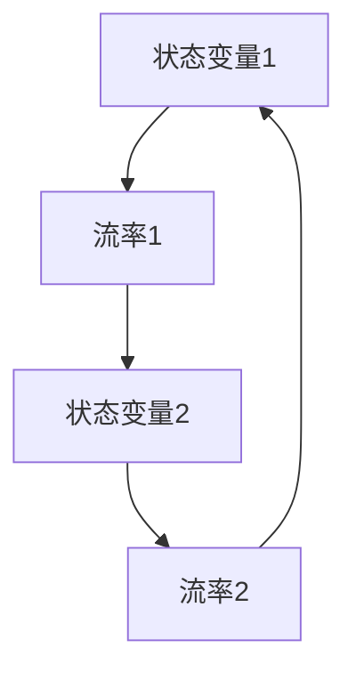
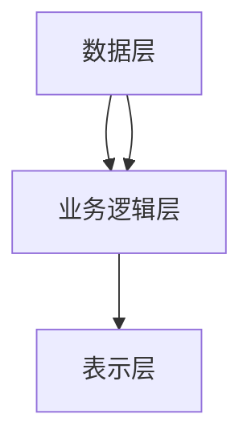
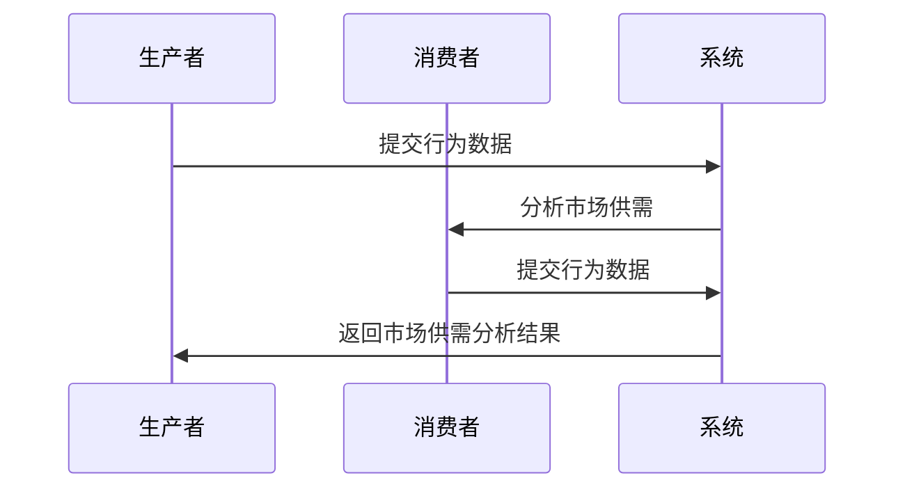

                 

# 系分作用的不只是自己

## 关键词
系统思维、个人成长、自我认知、算法原理、数学模型、系统架构、项目实战、最佳实践

## 摘要
本文深入探讨了系统思维的重要性及其在个人成长和自我认知中的作用。通过介绍系统思维的核心概念和联系，结合算法原理、数学模型以及实际项目实战，本文展示了如何运用系统思维提升个人能力和实现自我突破。同时，文章提供了最佳实践、小结和拓展阅读，为读者提供了全面的思考和学习的方向。

## 第一部分：系统思维概述

### 第1章：系统思维的重要性

#### 1.1 系统思维的概念与作用
系统思维是一种理解和处理复杂问题的方法，它强调通过整体视角来分析系统中的各个组成部分及其相互关系。这种思维方式不仅适用于科学研究，还在日常决策和个人成长中发挥着重要作用。

#### 1.2 系统思维在个人成长中的应用
在个人成长中，系统思维可以帮助我们更好地理解自我、规划未来和应对挑战。通过系统思维，我们可以识别和解决问题背后的深层原因，从而实现持续的个人发展和自我提升。

#### 1.3 系统思维与自我认知的关系
自我认知是个人成长的重要基础，而系统思维则为自我认知提供了强大的工具。通过系统思维，我们可以更加全面地了解自己的需求、欲望和动机，从而更好地实现自我认知和自我提升。

### 第2章：系统思维的核心概念与联系

#### 2.1 系统思维的定义与属性
系统思维是一种整体性、关联性、动态性和综合性的思维方式。它强调系统各部分之间的相互作用和相互依赖，以及系统整体的演变和发展。

#### 2.2 个人成长与自我认知的概念解析
个人成长是指个体在生理、心理、社会等方面的不断进步和发展。自我认知则是个体对自己的认知和理解，包括自我意识、自我评价和自我反思等方面。

#### 2.3 系统思维、个人成长与自我认知之间的联系
系统思维、个人成长和自我认知之间存在着密切的联系。系统思维为个人成长和自我认知提供了方法论基础，而个人成长和自我认知则是系统思维实践的重要目标。

## 第二部分：算法原理讲解

### 第3章：系统思维的应用算法

#### 3.1 系统动力学模型简介
系统动力学模型是一种描述系统动态行为的数学模型，它通过状态变量、流率和反馈机制来描述系统的动态演化过程。

#### 3.2 系统动力学模型的mermaid流程图
下面是一个简单的系统动力学模型的mermaid流程图示例：



#### 3.3 Python源代码示例与详细讲解
以下是一个简单的Python代码示例，用于实现一个系统动力学模型：

```python
import numpy as np
import matplotlib.pyplot as plt

# 初始条件
state = np.array([1.0, 0.0])

# 模型参数
alpha = 0.1
beta = 0.5

# 模拟时间
t = np.linspace(0, 10, 1000)

# 动力学方程
next_state = np.array([
    state[1],
    -alpha * state[0] + beta * state[1]
])

# 模拟过程
for i in range(1, len(t)):
    state = next_state
    
# 绘图
plt.plot(t, state[:, 0], label='状态变量1')
plt.plot(t, state[:, 1], label='状态变量2')
plt.xlabel('时间')
plt.ylabel('状态')
plt.legend()
plt.show()
```

在这个示例中，我们使用了一个简单的系统动力学模型，并通过Python代码实现了对其的模拟和绘图。

### 第4章：数学模型与数学公式

#### 4.1 系统思维相关数学模型
在系统思维中，常用的数学模型包括微分方程、差分方程和状态空间模型等。这些模型可以用来描述系统的动态行为和演化过程。

#### 4.2 数学公式的LaTeX表示
以下是一个简单的数学公式示例：

$$
x = \frac{-b \pm \sqrt{b^2 - 4ac}}{2a}
$$

在这个示例中，我们使用了LaTeX格式来表示一元二次方程的解。

#### 4.3 数学模型在系统思维中的应用
数学模型在系统思维中的应用非常广泛。例如，在经济学中，我们可以使用差分方程来描述经济系统的动态行为；在物理学中，我们可以使用微分方程来描述物理系统的运动规律。

## 第三部分：系统分析与架构设计方案

### 第5章：系统分析与架构设计方案

#### 5.1 问题场景介绍
在本章中，我们将介绍一个简单的系统场景，该系统用于模拟一个简单的经济市场，包括生产者、消费者和产品价格等要素。

#### 5.2 项目介绍
本项目的目标是设计并实现一个简单的经济市场模拟系统，该系统可以模拟不同条件下的市场行为，从而帮助人们更好地理解经济市场的运行机制。

#### 5.3 系统功能设计
系统功能设计包括以下方面：
- 生产者行为模拟
- 消费者行为模拟
- 产品价格计算
- 市场供需分析

#### 5.4 系统架构设计
系统架构设计包括以下方面：
- 数据层：用于存储系统中的数据，包括生产者、消费者和产品价格等信息。
- 业务逻辑层：用于处理系统的业务逻辑，包括生产者行为、消费者行为和产品价格计算等。
- 表示层：用于展示系统的运行结果，包括市场供需分析和市场走势图等。

下面是一个简单的mermaid架构图示例：



#### 5.5 系统接口设计和系统交互
系统接口设计包括以下方面：
- 生产者接口：用于接收生产者的行为数据。
- 消费者接口：用于接收消费者的行为数据。
- 价格接口：用于计算产品价格。
- 分析接口：用于分析市场供需情况。

下面是一个简单的mermaid序列图示例：



## 第四部分：项目实战

### 第6章：项目实战

#### 6.1 环境安装
在本章中，我们将介绍如何在Python环境中安装和配置必要的库和工具，以便进行经济市场模拟系统的开发。

#### 6.2 系统核心实现源代码
在本章中，我们将介绍系统核心实现的相关源代码，包括生产者行为模拟、消费者行为模拟、产品价格计算和市场供需分析等。

#### 6.3 代码应用解读与分析
在本章中，我们将对系统核心实现的代码进行解读和分析，以便更好地理解其工作原理和实现方式。

#### 6.4 实际案例分析和讲解
在本章中，我们将通过一个实际案例来分析和讲解经济市场模拟系统的应用，以便更好地理解其在实际场景中的作用和价值。

#### 6.5 项目小结
在本章中，我们将对整个项目进行小结，总结项目的主要成果和经验，并对未来的发展方向提出建议。

## 第五部分：最佳实践、小结与拓展

### 第7章：最佳实践、小结与拓展

#### 7.1 最佳实践 tips
在本章中，我们将提供一些最佳实践建议，以帮助读者更好地运用系统思维和个人成长的方法。

#### 7.2 小结
在本章中，我们将对整个文章进行小结，回顾文章的主要内容，总结关键观点和收获。

#### 7.3 注意事项
在本章中，我们将提醒读者在运用系统思维和个人成长方法时需要注意的事项。

#### 7.4 拓展阅读
在本章中，我们将推荐一些拓展阅读材料，以帮助读者进一步深入了解系统思维和个人成长的相关知识。

## 参考文献
在本章中，我们将列出本文引用的主要参考文献，以供读者进一步学习和研究。

## 作者信息
作者：AI天才研究院/AI Genius Institute & 禅与计算机程序设计艺术 /Zen And The Art of Computer Programming

## 总结
本文通过系统思维和个人成长的角度，探讨了系统思维的重要性及其在个人成长中的应用。通过算法原理讲解、数学模型和实际项目实战，本文展示了如何运用系统思维提升个人能力和实现自我突破。希望本文能够为读者提供有价值的思考和学习的方向。

