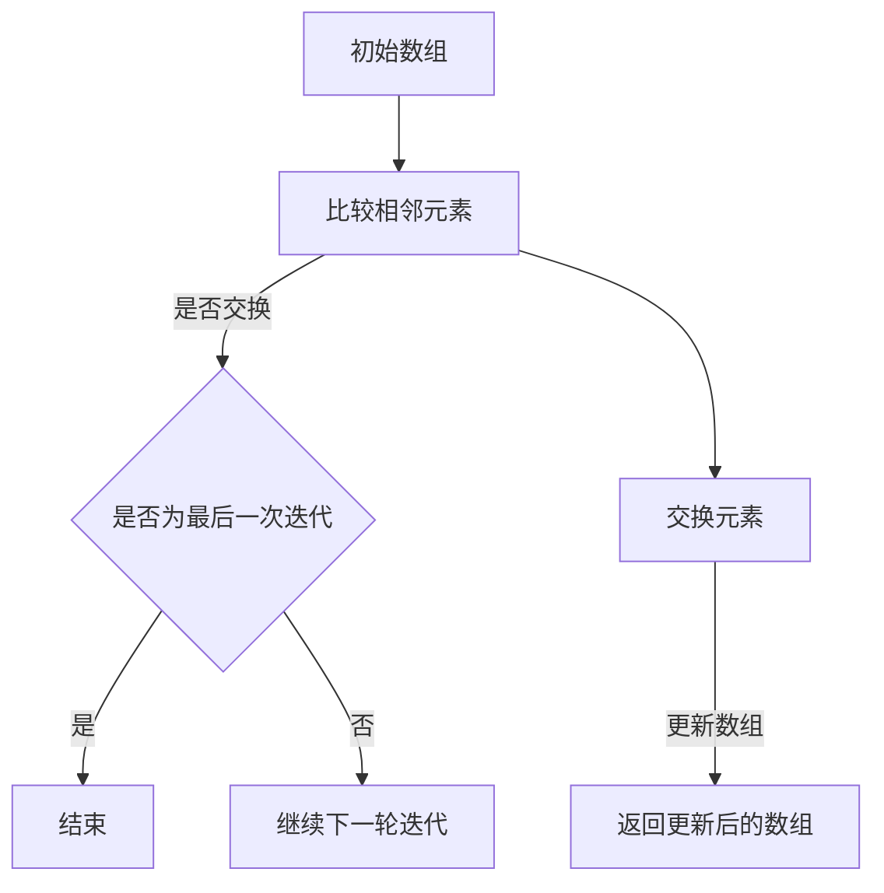
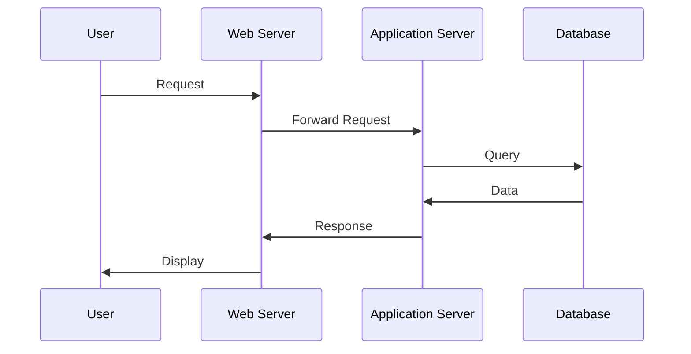

                 

# 系分的价值是达成共识

关键词：系统分析、共识达成、系统价值、架构设计、算法原理、项目实战

摘要：本文深入探讨了系统分析在达成共识中的核心作用，分析了系统分析的基本原理、共识达成的策略以及系统价值提升的方法。通过实际案例和项目实战，本文展示了如何通过系统分析和共识达成，实现系统价值的最大化。

## 第一部分：系统分析基础

### 第1章：系统分析概述

#### 1.1 问题背景与核心概念

在现代信息技术快速发展的背景下，系统分析成为了一种至关重要的技术手段。系统分析不仅仅是简单的软件开发过程，它涉及到对系统需求的深入理解、系统架构的设计、算法原理的应用等多个方面。因此，系统分析的核心概念和问题背景显得尤为重要。

首先，我们需要理解什么是系统。系统是由多个相互关联的组件组成的，具有特定功能和目标的整体。在计算机科学中，系统可以是软件系统、硬件系统，甚至可以是一个业务流程。了解系统的定义，有助于我们更好地理解系统分析的重要性。

系统分析的问题背景主要包括以下几个方面：

1. **需求不明确**：在软件开发过程中，需求的不明确会导致项目进度延误、功能缺失等问题。
2. **系统复杂性**：随着系统规模的扩大，系统的复杂性也随之增加，如何有效地管理和分析系统成为一个挑战。
3. **资源有限**：在资源和时间有限的情况下，如何最大化系统价值成为关键问题。

#### 1.2 系统分析的基本方法

系统分析的基本方法主要包括以下几种：

1. **需求分析**：通过调研、访谈等方式，收集用户需求，明确系统的功能和性能要求。
2. **架构设计**：设计系统的整体架构，包括硬件、软件、网络等各个层面的设计。
3. **算法分析**：分析并选择合适的算法，以实现系统的各项功能。
4. **测试与验证**：对系统进行测试，确保其满足设计要求。

#### 1.3 系统分析的边界与外延

系统分析的边界主要指系统分析的范围和深度。在系统分析过程中，我们需要明确分析的范围，避免过于泛泛而谈。同时，系统分析的深度也需要适度，既不能过于深入导致项目拖延，也不能过于浅显导致系统设计不合理。

系统分析的外延则涉及到系统分析与其他领域的关系。例如，系统分析与项目管理、软件工程、人工智能等领域有着密切的联系，需要综合考虑这些因素。

### 第2章：核心概念与联系

#### 2.1 系统构成要素

系统构成要素是系统分析的基础。一个完整的系统通常包括以下几个方面：

1. **硬件**：计算机、网络设备、存储设备等。
2. **软件**：操作系统、应用软件、数据库等。
3. **数据**：系统的数据资源，包括结构化和非结构化数据。
4. **人员**：系统的操作人员、维护人员等。
5. **流程**：系统的业务流程、操作流程等。

#### 2.2 系统属性特征对比表

为了更好地理解系统分析的核心概念，我们可以通过对比不同系统的属性特征，来展示它们之间的差异和联系。

| 系统属性 | 描述 | 对比 |
| --- | --- | --- |
| 功能性 | 系统能够实现的功能 | 软件系统与硬件系统的功能对比 |
| 性能 | 系统的性能指标，如响应时间、吞吐量等 | 不同系统性能指标的对比 |
| 可靠性 | 系统的可靠性指标，如故障率、恢复时间等 | 不同系统可靠性的对比 |
| 可维护性 | 系统的可维护性指标，如代码质量、文档完善程度等 | 不同系统可维护性的对比 |

#### 2.3 ER实体关系图

ER实体关系图是系统分析中的重要工具，用于描述系统中各个实体之间的关系。通过ER实体关系图，我们可以清晰地了解系统的数据结构和业务逻辑。

以下是一个简单的ER实体关系图的示例：

```mermaid
erDiagram
    User ||--|{ Order } : makes
    Product ||--|{ Order } : includes
    Category ||--|{ Product } : belongs_to
```

## 第二部分：共识达成与系统价值提升

### 第3章：算法原理讲解

#### 3.1 算法mermaid流程图

在系统分析中，算法的原理讲解是不可或缺的一部分。通过mermaid流程图，我们可以直观地展示算法的执行过程。

以下是一个简单的排序算法（冒泡排序）的mermaid流程图示例：



#### 3.2 Python源代码阐述

为了更好地理解算法原理，我们通过Python源代码来详细阐述冒泡排序算法。

```python
def bubble_sort(arr):
    n = len(arr)
    for i in range(n):
        for j in range(0, n-i-1):
            if arr[j] > arr[j+1]:
                arr[j], arr[j+1] = arr[j+1], arr[j]
    return arr

# 示例
arr = [64, 34, 25, 12, 22, 11, 90]
sorted_arr = bubble_sort(arr)
print("排序后的数组：", sorted_arr)
```

#### 3.3 数学模型与公式

在算法分析中，数学模型和公式是必不可少的。以下是一个简单的数学模型，用于描述冒泡排序算法的平均时间复杂度：

$$ T(n) = \sum_{i=1}^{n} \sum_{j=1}^{i} 1 $$

其中，$T(n)$ 表示算法执行时间，$n$ 表示数组长度。

#### 3.4 举例说明

为了更好地理解算法原理，我们通过一个简单的例子来说明冒泡排序算法。

假设有一个长度为5的数组：[64, 34, 25, 12, 22]，经过一次冒泡排序后，数组变为：[34, 25, 12, 22, 64]。

## 第三部分：共识达成与系统价值提升

### 第4章：共识达成的原则与策略

#### 4.1 共识达成的核心原则

共识达成是系统分析中的重要环节。在共识达成过程中，我们需要遵循以下核心原则：

1. **透明性**：确保所有相关方都能够清楚地了解系统的设计、实现和运行过程。
2. **参与性**：鼓励所有相关方参与到系统分析和设计中，确保系统的设计能够满足多方需求。
3. **协同性**：通过协同工作，确保系统分析的过程和结果是各方共识的产物。
4. **灵活性**：在共识达成过程中，需要保持灵活性，以适应不断变化的需求和环境。

#### 4.2 提升系统价值的策略

为了提升系统价值，我们可以采取以下策略：

1. **需求分析**：深入分析用户需求，确保系统能够满足用户的核心需求。
2. **架构优化**：通过优化系统架构，提高系统的性能、可靠性和可维护性。
3. **算法选择**：选择适合的算法，以实现系统的各项功能，并确保算法的效率。
4. **持续改进**：通过持续改进，不断优化系统的性能和用户体验。

#### 4.3 案例分析

以下是一个实际的案例分析，展示了如何通过共识达成和系统价值提升，实现项目的成功。

案例：某公司的企业资源规划（ERP）系统开发。

1. **需求分析**：通过调研和访谈，收集了各部门的需求，明确了系统的功能模块和性能要求。
2. **架构设计**：采用微服务架构，确保系统的可扩展性和可维护性。
3. **算法选择**：选择了高效的排序和搜索算法，提高了系统的性能。
4. **共识达成**：通过定期会议和讨论，确保各方对系统设计和实现达成共识。
5. **项目成果**：系统上线后，得到了用户的好评，提升了公司的运营效率。

## 第四部分：系统架构设计与实现

### 第5章：系统架构设计与实现

#### 5.1 问题场景介绍

在某一项目中，我们需要设计并实现一个在线购物平台。该平台需要支持用户注册、登录、购物车管理、订单处理等功能。

#### 5.2 系统功能设计

基于需求分析，我们确定了以下系统功能模块：

1. **用户管理**：包括用户注册、登录、个人信息管理等功能。
2. **商品管理**：包括商品分类、商品信息管理、库存管理等功能。
3. **购物车管理**：包括添加商品到购物车、修改购物车商品数量、删除购物车商品等功能。
4. **订单处理**：包括订单创建、订单状态更新、订单详情查询等功能。
5. **支付管理**：包括支付方式选择、支付信息验证、支付结果通知等功能。

#### 5.3 系统架构设计

基于上述功能模块，我们设计了以下系统架构：

1. **前端架构**：采用Vue.js框架，实现用户界面的展示和交互。
2. **后端架构**：采用Spring Boot框架，实现业务逻辑的处理和数据存储。
3. **数据库架构**：采用MySQL数据库，存储用户数据、商品数据、订单数据等。
4. **接口设计**：设计了一系列RESTful接口，用于前端和后端的数据交互。

#### 5.4 系统接口设计

以下是一个简单的系统接口设计示例：



#### 5.5 系统交互mermaid序列图

以下是一个简单的系统交互mermaid序列图示例：


## 第五部分：项目实战

### 第6章：项目实战

#### 6.1 环境安装

在开始项目实战之前，我们需要安装以下环境：

1. **Java开发工具包（JDK）**
2. **Spring Boot开发工具**
3. **MySQL数据库**

#### 6.2 系统核心实现源代码

以下是一个简单的系统核心实现源代码示例：

```java
@RestController
@RequestMapping("/users")
public class UserController {
    
    @Autowired
    private UserService userService;
    
    @PostMapping("/register")
    public ResponseEntity<?> registerUser(@RequestBody UserRegistrationRequest request) {
        User user = userService.registerUser(request);
        return ResponseEntity.ok().body(user);
    }
    
    @PostMapping("/login")
    public ResponseEntity<?> loginUser(@RequestBody UserLoginRequest request) {
        String token = userService.loginUser(request);
        return ResponseEntity.ok().body(token);
    }
}
```

#### 6.3 代码应用解读与分析

在上述代码中，我们定义了一个`UserController`类，用于处理用户注册和登录请求。通过注入`UserService`，我们可以方便地调用服务层的方法。

在`registerUser`方法中，我们接收一个`UserRegistrationRequest`对象，调用`userService`的`registerUser`方法，并将注册成功的用户对象返回。

在`loginUser`方法中，我们接收一个`UserLoginRequest`对象，调用`userService`的`loginUser`方法，获取登录令牌，并将其返回。

#### 6.4 实际案例分析和详细讲解剖析

以下是一个实际案例分析和详细讲解剖析：

假设有一个用户名为“alice”的用户，想要注册并登录到在线购物平台。

1. **注册过程**：

- 用户提交注册请求，包含用户名、密码、邮箱等信息。
- `UserController`接收到请求后，将请求参数转换为`UserRegistrationRequest`对象。
- `userService`调用`registerUser`方法，将用户信息存储到数据库，并生成用户ID。
- `userService`返回注册成功的用户对象，包含用户ID、用户名、邮箱等信息。
- `UserController`将用户对象转换为JSON格式，返回给前端。

2. **登录过程**：

- 用户提交登录请求，包含用户名和密码。
- `UserController`接收到请求后，将请求参数转换为`UserLoginRequest`对象。
- `userService`调用`loginUser`方法，验证用户名和密码，并生成登录令牌。
- `userService`返回登录令牌，包含用户ID、用户名、邮箱等信息。
- `UserController`将登录令牌转换为JSON格式，返回给前端。

通过上述实际案例分析和详细讲解剖析，我们可以清楚地了解系统核心实现的过程和关键点。

#### 6.5 项目小结

在本章中，我们通过一个实际案例，展示了如何进行系统分析、架构设计、代码实现和项目实战。通过这一过程，我们不仅加深了对系统分析、共识达成和系统价值提升的理解，也掌握了如何将理论知识应用到实际项目中。

## 第六部分：最佳实践与拓展

### 第7章：最佳实践与拓展

#### 7.1 最佳实践技巧

在系统分析和共识达成过程中，我们可以采取以下最佳实践技巧：

1. **需求管理**：建立完善的需求管理流程，确保需求的有效收集、分析和管理。
2. **版本控制**：使用版本控制工具，如Git，确保代码和文档的版本一致性和可追溯性。
3. **代码规范**：遵循统一的代码规范，提高代码的可读性和可维护性。
4. **测试与评审**：建立完善的测试和评审机制，确保系统的质量和可靠性。

#### 7.2 小结与注意事项

在系统分析和共识达成过程中，我们需要注意以下几点：

1. **明确目标**：在开始项目之前，明确项目的目标和需求，确保各方对项目的期望一致。
2. **团队合作**：建立有效的团队合作机制，确保团队成员之间的沟通和协作顺畅。
3. **持续学习**：随着技术的发展，我们需要不断学习新知识和技能，以适应不断变化的需求和环境。

#### 7.3 拓展阅读

为了更深入地了解系统分析和共识达成，我们可以参考以下拓展阅读资料：

1. 《系统分析与应用》
2. 《共识算法与区块链技术》
3. 《软件工程：实践者的研究方法》

通过阅读这些资料，我们可以进一步了解系统分析和共识达成的原理和方法。

## 结语

在本文中，我们深入探讨了系统分析在达成共识中的核心作用，分析了系统分析的基本原理、共识达成的策略以及系统价值提升的方法。通过实际案例和项目实战，我们展示了如何通过系统分析和共识达成，实现系统价值的最大化。希望本文能够为您的系统分析和共识达成提供有益的参考和启示。

作者：AI天才研究院/AI Genius Institute & 禅与计算机程序设计艺术 /Zen And The Art of Computer Programming

