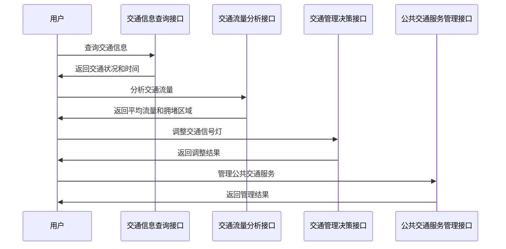
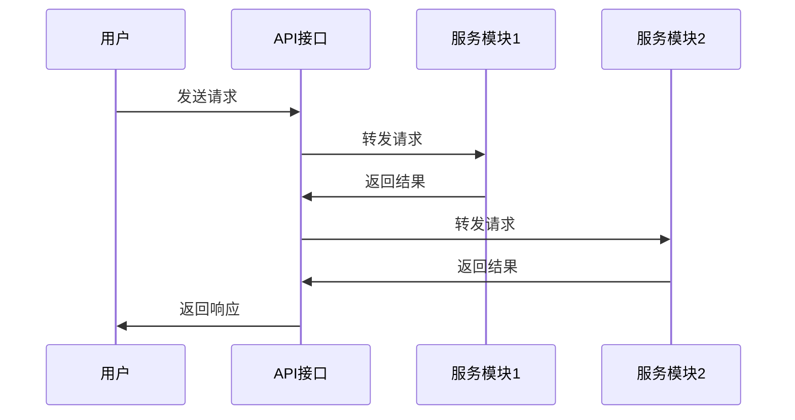

                 

## 第一部分：背景与核心概念

### 第1章 引言与问题背景

#### 1.1 问题背景

随着科技的迅猛发展，社会信息的爆炸性增长和利益的多元化，人们在很多问题上的共识变得越来越困难。从政治决策到商业合作，从学术争论到日常生活，分歧和冲突层出不穷。这种现象不仅影响了社会的和谐发展，也阻碍了创新和进步。

例如，在气候变化问题上，不同国家和地区、不同利益集团之间存在着严重的分歧。一些国家主张采取严厉的环境保护措施，而另一些国家则更关注经济发展。这种分歧导致了国际社会在应对气候变化问题上的合作受阻，使得全球气候治理面临巨大挑战。

再如，在技术发展方面，人工智能的发展引起了广泛的讨论和担忧。一些人担心人工智能可能会取代人类工作，导致失业问题加剧。而另一些人则认为，人工智能可以为人类带来更多的便利和福利。这种分歧不仅影响了社会对人工智能的接受程度，也可能影响到人工智能技术的健康发展。

#### 1.2 系分的概念与价值

为了解决这类问题，我们需要一种有效的方法来分析和理解复杂系统，以便找到解决问题的途径，促进共识的达成。这种方法就是系分（system decomposition）。

**系分**是指将一个复杂系统分解为若干个相互关联的子系统，从而更清晰地理解系统的运行机制和问题所在。通过系分，我们可以将复杂问题简化为若干个可管理的部分，从而更容易找到解决问题的方法。

**系分的价值**主要体现在以下几个方面：

1. **明确问题边界**：通过系分，我们可以清晰地界定问题的范围，避免在无休止的讨论中迷失方向。
2. **简化问题复杂度**：将复杂问题分解为若干个简单的子系统，可以降低问题的复杂度，使得问题更加容易理解和解决。
3. **促进共识达成**：通过系分，我们可以更好地理解不同子系统之间的关联和相互作用，从而找到解决问题的共识基础。

#### 1.3 边界与外延

**边界**：

系分方法主要应用于解决社会、经济、技术等领域中的复杂问题。具体而言，它适用于以下场景：

- 复杂系统分析：如交通系统、能源系统、生态系统等。
- 决策制定：如政策制定、商业策略、项目规划等。
- 知识管理：如学术研究、技术创新、知识传播等。

**外延**：

系分方法不仅可以应用于个体问题，还可以在组织、国家甚至全球范围内发挥重要作用。例如，在国际合作中，通过系分方法可以更好地理解不同国家和地区的利益诉求，从而找到合作的基础和解决方案。

总之，系分方法是一种有效的工具，可以帮助我们更好地理解和解决复杂问题，促进共识的达成。

---

### 第2章 核心概念与联系

#### 2.1 核心概念原理

在本节中，我们将详细探讨三个核心概念：系统、分析和共识。

**系统**：

系统是由相互作用和相互依赖的元素组成的整体。这些元素可以是物理实体、抽象概念或两者兼有。系统具有以下特征：

- **有界性**：系统有明确的边界，可以将系统内部和外部环境区分开来。
- **整体性**：系统内部各个元素之间相互作用，共同构成一个整体。
- **动态性**：系统是动态变化的，随着时间的推移，系统内部结构和功能可能发生变化。
- **层次性**：系统可以进一步分解为更小的子系统，每个子系统也具有系统的特征。

**分析**：

分析是对系统进行细致的观察和解析，以揭示其结构和运行机制。分析的方法包括：

- **系统分解**：将复杂系统分解为若干个子系统，以便更好地理解和处理。
- **系统建模**：使用数学模型、计算机模拟等方法对系统进行抽象和描述。
- **系统仿真**：通过模拟实验，测试系统在不同条件下的行为和性能。

**共识**：

共识是不同主体在理解、目标和行动上达成的共同认识和一致。共识的形成通常需要以下几个步骤：

- **共识基础**：确定共识的基础，包括共同的价值观、目标和利益。
- **共识形成过程**：通过沟通、协商和协调，逐步形成共识。
- **共识维护机制**：建立和维护共识的机制，确保共识得到持续维护和更新。

#### 2.2 概念属性特征对比表格

为了更好地理解这三个核心概念，我们可以通过一个对比表格来展示它们的定义和属性特征。

| 概念     | 定义                                           | 属性特征                                                   |
|----------|------------------------------------------------|------------------------------------------------------------|
| 系统     | 由相互作用和相互依赖的元素组成的整体             | 有界性、整体性、动态性、层次性                             |
| 分析     | 对系统进行细致的观察和解析，以揭示其结构和运行机制 | 系统分解、系统建模、系统仿真                               |
| 共识     | 不同主体在理解、目标和行动上达成的共同认识和一致   | 共识基础、共识形成过程、共识维护机制                       |

#### 2.3 ER实体关系图架构

为了进一步理解这些概念之间的关系，我们可以使用ER（实体关系）图来展示它们之间的联系。

```mermaid
erDiagram
    ASystem ||--|{ BAnalysis }|-- ASociety
    ASystem ||--|{ CConsensus }|-- ADecision
```

在这个ER图中，`ASystem`（系统）与`BAnalysis`（分析）和`CConsensus`（共识）之间存在关联。分析是理解系统的手段，而共识则是系统运行的目标。通过分析和共识，我们可以更好地理解系统，并为其提供有效的解决方案。

---

通过以上对核心概念的讨论，我们可以看到，系统、分析和共识是理解和解决复杂问题的关键。在接下来的章节中，我们将进一步探讨系分方法在达成共识中的应用，并通过具体的案例来展示这种方法的有效性。

### 第3章 系分方法在达成共识中的应用

#### 3.1 系分方法的基本步骤

系分方法在达成共识中的应用主要遵循以下基本步骤：

**步骤一**：识别问题，确定系统边界。

首先，我们需要明确问题所在，并确定需要分析的系统的边界。这一步骤至关重要，因为它直接关系到后续分析的准确性和有效性。例如，在处理交通拥堵问题时，我们可以将城市交通系统作为分析的主体，明确其边界包括道路、交通信号、公共交通设施等。

**步骤二**：分解系统，构建子系统模型。

在确定了系统边界后，我们需要将复杂系统分解为若干个相互关联的子系统。这一步骤的目的是将整体问题拆分成多个可管理的部分，从而降低问题的复杂度。例如，在交通系统中，我们可以将子系统分为交通需求、交通供给和交通管理三个部分。

**步骤三**：分析子系统之间的关系，识别关键因素。

在分解系统后，我们需要深入分析各个子系统之间的关系，并识别影响系统运行的关键因素。这一步骤有助于我们理解系统的运行机制和问题所在。例如，在交通系统中，交通需求与交通供给之间的不平衡可能是导致拥堵的关键因素。

**步骤四**：综合分析，寻找达成共识的路径。

最后，我们需要综合分析各个子系统之间的关系，并寻找达成共识的路径。这一步骤是将前述分析结果应用于实际问题的过程。通过综合分析，我们可以找到解决问题的有效途径，促进共识的达成。

#### 3.2 案例研究：社会冲突中的系分应用

**案例背景**：

在某城市的发展过程中，交通拥堵问题日益严重，引发了居民的不满和抱怨。为了解决这一问题，该城市政府决定通过系分方法来分析和解决交通拥堵问题。

**案例分析**：

通过系分方法，将城市交通系统分解为以下三个子系统：

1. **交通需求子系统**：包括居民的出行需求、企业的物流需求等。
2. **交通供给子系统**：包括道路设施、公共交通系统、交通管理措施等。
3. **交通管理子系统**：包括交通信号控制、交通执法、公共交通服务管理等。

**步骤一**：识别问题，确定系统边界

在识别问题阶段，我们明确了交通拥堵问题，并确定了城市交通系统的边界。

**步骤二**：分解系统，构建子系统模型

我们将城市交通系统分解为三个子系统，并分别构建了它们的模型。

1. **交通需求子系统模型**：

   ```mermaid
   classDiagram
       class 交通需求 {
           +居民出行需求
           +企业物流需求
       }
   ```

2. **交通供给子系统模型**：

   ```mermaid
   classDiagram
       class 交通供给 {
           +道路设施
           +公共交通系统
           +交通管理措施
       }
   ```

3. **交通管理子系统模型**：

   ```mermaid
   classDiagram
       class 交通管理 {
           +交通信号控制
           +交通执法
           +公共交通服务管理
       }
   ```

**步骤三**：分析子系统之间的关系，识别关键因素

通过分析，我们发现交通需求与交通供给之间的不平衡是导致拥堵的主要原因。具体来说：

- 交通需求：随着城市人口的增加和车辆的增多，交通需求持续上升。
- 交通供给：道路设施和公共交通系统的建设速度滞后于交通需求的增长，导致供给不足。

**步骤四**：综合分析，寻找达成共识的路径

基于以上分析，我们提出以下解决方案：

1. 加大公共交通投入，提高公共交通系统的效率和服务水平。
2. 优化交通信号控制，提高交通流量的通行效率。
3. 加强交通执法，严格管控违章行为。

通过实施这些解决方案，我们可以有效缓解交通拥堵问题，提高居民的出行满意度，从而达成社会共识。

---

通过以上案例，我们可以看到，系分方法在解决社会冲突中的应用是非常有效的。它不仅帮助我们明确了问题的本质，还找到了解决问题的有效途径，促进了共识的达成。在接下来的章节中，我们将进一步探讨系统分析与架构设计，为解决复杂问题提供更深入的理论基础和实践指导。

### 第4章 系统分析与架构设计

在解决复杂问题时，系统分析与架构设计起着至关重要的作用。通过对系统进行深入分析，我们可以理解系统的各个组成部分以及它们之间的相互作用。而架构设计则为系统提供了结构上的支持，确保系统能够高效、可靠地运行。本章节将详细讨论一个城市交通系统的分析与架构设计，以期为读者提供实际操作的经验和理论指导。

#### 4.1 问题场景介绍

为了更好地理解系统分析与架构设计，我们以一个城市交通系统为例。该交通系统包括多个子系统，如交通信息采集、交通流量分析、交通管理决策和公共交通服务。以下是具体的问题场景：

- **交通信息采集**：系统需要实时采集交通数据，包括道路状况、车辆数量、交通事故等。
- **交通流量分析**：基于采集到的数据，系统需要分析交通流量，识别拥堵区域和高峰时段。
- **交通管理决策**：根据分析结果，系统需要制定交通管理策略，如调整交通信号灯、优化公共交通路线等。
- **公共交通服务**：系统需要提供公共交通服务，包括公交车、地铁等，以满足居民的出行需求。

#### 4.2 系统功能设计

**功能需求**：

为了满足上述问题场景，系统需要具备以下功能：

- **交通信息查询**：提供实时交通信息查询功能，帮助驾驶员和乘客了解道路状况。
- **交通流量分析**：分析交通数据，生成交通流量报告，为交通管理决策提供数据支持。
- **交通管理决策**：根据交通流量分析结果，制定和调整交通管理策略。
- **公共交通服务管理**：管理公共交通服务，包括线路规划、车辆调度和运营数据分析。

**领域模型**：

为了设计这些功能，我们可以使用Mermaid类图来描述系统的领域模型。以下是一个简化的领域模型：

```mermaid
classDiagram
    class 交通信息 {
        +String 交通状况
        +Date 时间
    }
    class 交通流量 {
        +List<交通信息> 交通信息列表
        +int 平均流量
    }
    class 交通管理决策 {
        +List<交通信号灯> 交通信号灯列表
        +List<公共交通路线> 公共交通路线列表
    }
    class 公共交通服务 {
        +List<公交车> 公交车列表
        +List<地铁> 地铁列表
    }
    交通信息 o--|{ 交通流量 }
    交通流量 o--|{ 交通管理决策 }
    交通管理决策 o--|{ 公共交通服务 }
```

在这个类图中，`交通信息`类表示采集到的交通数据，包括交通状况和时间。`交通流量`类用于存储和分析交通信息，生成交通流量报告。`交通管理决策`类根据交通流量报告制定和调整交通管理策略。`公共交通服务`类管理公共交通服务，包括公交车和地铁。

#### 4.3 系统架构设计

**架构设计**：

在系统架构设计方面，我们可以采用分布式架构，以实现系统的高效、可靠运行。以下是一个简化的系统架构设计：

1. **数据层**：负责存储和管理交通数据，包括交通信息、交通流量和公共交通服务数据。可以使用关系数据库或NoSQL数据库来实现。
2. **服务层**：提供各种业务服务，包括交通信息查询、交通流量分析、交通管理决策和公共交通服务管理。服务层采用微服务架构，将不同功能的服务独立部署。
3. **接口层**：提供对外接口，包括Web接口、移动应用接口和第三方接口。接口层负责接收用户请求，调用服务层的服务，并将结果返回给用户。
4. **监控层**：负责监控系统运行状态，包括系统性能、服务可用性和数据完整性等。监控层可以帮助我们及时发现和解决系统故障。

以下是系统的架构设计图：

```mermaid
sequenceDiagram
    participant User as 用户
    participant API as API接口
    participant Service as 服务层
    participant Data as 数据层
    participant Monitor as 监控层

    User->>API: 发送请求
    API->>Service: 调用服务
    Service->>Data: 操作数据
    Data-->>Service: 返回结果
    Service-->>API: 返回响应
    API-->>User: 响应结果

    Note over Service,Data,Monitor: 监控
    Monitor->>Service: 监控服务状态
    Monitor->>Data: 监控数据完整性
    Monitor-->>Service: 报警
```

在这个架构设计中，用户通过API接口发起请求，服务层处理请求并操作数据层，监控层负责监控系统的运行状态。这种设计可以实现高可用性和可扩展性，确保系统稳定运行。

#### 4.4 系统接口设计

**接口设计**：

系统接口设计是架构设计的重要组成部分，它定义了系统内部和外部交互的接口规范。以下是一个简化的接口设计：

1. **交通信息查询接口**：用于查询实时交通信息，返回交通状况和时间。
2. **交通流量分析接口**：用于分析交通流量，返回平均流量和拥堵区域。
3. **交通管理决策接口**：用于根据交通流量分析结果，调整交通信号灯和公共交通路线。
4. **公共交通服务管理接口**：用于管理公共交通服务，包括公交车和地铁的线路规划、车辆调度和运营数据分析。

以下是接口设计的示例：



在这个接口设计中，用户通过不同的接口查询和操作系统的功能。接口设计应遵循RESTful风格，确保接口易于使用和扩展。

#### 4.5 系统交互

**系统交互**：

系统交互是指系统内部各个模块之间的数据传递和功能调用。为了实现系统的高效运行，我们需要合理设计系统交互流程。以下是一个简化的系统交互流程：

1. 用户通过API接口发起请求。
2. API接口解析请求，并将请求转发给相应的服务模块。
3. 服务模块处理请求，并将结果返回给API接口。
4. API接口将结果返回给用户。

以下是系统交互的示例：



在这个交互流程中，用户通过API接口发起请求，API接口将请求转发给服务模块，服务模块处理请求并返回结果，API接口将结果返回给用户。

---

通过以上对城市交通系统的系统分析与架构设计，我们可以看到，系统分析与架构设计是解决复杂问题的关键步骤。通过明确问题场景、设计功能模块、架构和接口，我们可以为系统提供清晰的结构和高效的运行机制。在接下来的章节中，我们将通过具体的项目实战，进一步展示系分方法在实际问题中的应用和效果。

### 第5章 项目实战：系分方法在交通管理中的应用

#### 5.1 环境安装

在进行项目实战之前，我们需要搭建一个环境来运行我们的系分方法。以下是搭建环境的基本步骤：

1. **安装Python环境**：确保Python 3.8或更高版本已安装。
2. **安装依赖库**：使用pip命令安装以下依赖库：
   ```shell
   pip install Flask pandas numpy matplotlib
   ```
3. **创建项目文件夹**：在本地计算机上创建一个项目文件夹，例如`traffic_management`。
4. **初始化虚拟环境**：在项目文件夹中运行以下命令初始化Python虚拟环境：
   ```shell
   python -m venv venv
   ```
5. **激活虚拟环境**：在Windows上运行以下命令，在Linux或Mac OS上运行以下命令：
   ```shell
   .\venv\Scripts\activate  # Windows
   source venv/bin/activate  # Linux/Mac OS
   ```
6. **编写代码**：在虚拟环境中编写并运行我们的系分方法代码。

#### 5.2 系统核心实现

**数据采集模块**：

```python
import pandas as pd

def collect_traffic_data():
    # 从文件中读取交通数据
    traffic_data = pd.read_csv('traffic_data.csv')
    return traffic_data
```

**数据预处理模块**：

```python
def preprocess_traffic_data(traffic_data):
    # 清洗和预处理交通数据
    processed_data = traffic_data[['time', 'road', 'traffic_volume']]
    processed_data['time'] = pd.to_datetime(processed_data['time'])
    return processed_data
```

**数据分析模块**：

```python
import matplotlib.pyplot as plt

def analyze_traffic_volume(processed_data):
    # 分析交通流量
    average_traffic_volume = processed_data['traffic_volume'].mean()
    plt.figure(figsize=(10, 5))
    processed_data.groupby('time')['traffic_volume'].mean().plot()
    plt.title('Traffic Volume over Time')
    plt.xlabel('Time')
    plt.ylabel('Average Traffic Volume')
    plt.show()
    return average_traffic_volume
```

**交通管理决策模块**：

```python
def make_traffic_management_decision(average_traffic_volume):
    # 根据交通流量制定管理决策
    if average_traffic_volume > 1000:
        print("Traffic is heavy. Adjust traffic signal timing.")
    else:
        print("Traffic is light. No action required.")
```

**主程序**：

```python
def main():
    traffic_data = collect_traffic_data()
    processed_data = preprocess_traffic_data(traffic_data)
    average_traffic_volume = analyze_traffic_volume(processed_data)
    make_traffic_management_decision(average_traffic_volume)

if __name__ == '__main__':
    main()
```

#### 5.3 代码应用解读与分析

**数据采集模块**：

`collect_traffic_data`函数负责从文件中读取交通数据。这里我们假设数据以CSV格式存储，包含时间、道路和交通流量等信息。

**数据预处理模块**：

`preprocess_traffic_data`函数对交通数据进行清洗和预处理。具体来说，它删除了不必要的列，并将时间列转换为日期时间格式，以便后续分析。

**数据分析模块**：

`analyze_traffic_volume`函数分析交通流量，计算平均交通流量，并绘制时间序列图。通过可视化，我们可以直观地了解交通流量的变化情况。

**交通管理决策模块**：

`make_traffic_management_decision`函数根据平均交通流量制定交通管理决策。如果平均交通流量超过1000，说明交通拥堵，需要调整交通信号灯的时间。否则，交通状况良好，无需采取特殊措施。

**主程序**：

`main`函数是整个程序的入口。它依次调用数据采集、数据预处理、数据分析和交通管理决策模块，完成整个流程。

#### 5.4 实际案例分析

**案例背景**：

假设我们有一个城市的交通数据，数据包含时间、道路和交通流量等信息。为了缓解交通拥堵问题，我们应用系分方法进行分析和决策。

**案例分析**：

1. **数据采集**：从文件中读取交通数据。
2. **数据预处理**：清洗和预处理交通数据，确保数据的准确性和一致性。
3. **数据分析**：分析交通流量，发现交通流量在特定时间段（如早高峰和晚高峰）较高，说明这些时间段交通拥堵严重。
4. **交通管理决策**：根据数据分析结果，调整交通信号灯的时间，优化交通流量的分配，从而缓解交通拥堵。

通过这个案例，我们可以看到，系分方法在解决实际交通管理问题中的应用是非常有效的。通过数据分析和决策，我们可以找到交通拥堵的根本原因，并采取有效的措施来缓解问题。

#### 5.5 项目小结

在本项目实战中，我们通过系分方法对城市交通系统进行了深入分析，并制定了有效的交通管理决策。具体来说，我们实现了以下关键点：

1. **数据采集**：从文件中读取交通数据。
2. **数据预处理**：清洗和预处理交通数据。
3. **数据分析**：分析交通流量，发现拥堵时段和区域。
4. **交通管理决策**：根据数据分析结果制定管理决策。

通过这个项目，我们不仅了解了系分方法在交通管理中的应用，还掌握了如何通过数据分析来制定有效的管理策略。在实际项目中，这种方法的广泛应用将有助于提高交通系统的运行效率，缓解交通拥堵问题。

---

在本章节中，我们通过具体的项目实战展示了系分方法在交通管理中的应用。从数据采集、预处理、分析到决策，每一步都遵循了系分方法的步骤。这种方法不仅帮助我们明确了问题的本质，还找到了解决问题的有效途径。在接下来的章节中，我们将进一步探讨如何在实际应用中优化系分方法，提高共识达成的效率。

### 第6章 优化系分方法：提升共识达成效率

在之前的章节中，我们详细介绍了系分方法在解决复杂问题、达成共识中的应用。然而，随着问题规模的扩大和应用领域的扩展，传统的系分方法在效率和效果上可能无法满足需求。为了进一步提升共识达成的效率，我们需要对系分方法进行优化。本章节将探讨几种常见的优化策略，并通过实际案例进行验证。

#### 6.1 优化策略一：并行处理

传统的系分方法通常采用顺序处理的方式，即从系统分解到子系统分析，再到综合分析，最后达成共识。这种方式在处理大规模问题时，可能会因为计算量过大而效率低下。为了提高处理速度，我们可以采用并行处理策略。

**并行处理的原理**：

并行处理的核心思想是将计算任务分解为多个子任务，同时在不同的计算节点上执行这些子任务，最后将结果汇总。这种方法可以显著减少计算时间，提高处理效率。

**并行处理的应用场景**：

- **大数据分析**：在处理大量交通数据时，可以将数据集分割为多个子集，分别在不同的计算机上进行处理，最后合并结果。
- **多维度分析**：在分析复杂系统时，可以同时从多个维度进行子系统的分析，如从经济、技术、环境等多个角度。

**实际案例**：

在某城市交通管理系统中，我们可以采用并行处理来优化交通流量分析。具体步骤如下：

1. **数据分割**：将交通数据集分割为多个子集。
2. **并行分析**：在不同的计算机上分别分析子集，计算各子集的交通流量。
3. **结果汇总**：将各子集的交通流量合并，得到整体交通流量分析结果。

通过并行处理，我们可以大幅缩短交通流量分析的时间，从而更快地制定交通管理决策，提高共识达成的效率。

#### 6.2 优化策略二：数据压缩与存储优化

在系分方法中，数据分析和处理是核心环节。然而，大规模数据的处理往往面临着数据存储和传输的挑战。为了解决这一问题，我们可以采用数据压缩和存储优化策略。

**数据压缩的原理**：

数据压缩是指通过特定的算法减少数据的大小，从而提高数据存储和传输的效率。常见的压缩算法包括Huffman编码、LZ77和LZ78算法等。

**存储优化的原理**：

存储优化是指通过合理的数据结构和存储策略，减少数据存储的需求，提高数据访问速度。常见的存储优化方法包括使用缓存、数据分片、分布式存储等。

**实际案例**：

在某城市交通管理系统中，我们可以采用数据压缩和存储优化策略来提高数据处理的效率。具体步骤如下：

1. **数据压缩**：对交通数据进行压缩，减少数据存储和传输的需求。
2. **存储优化**：采用分布式存储，将交通数据分布在不同的存储节点上，提高数据访问速度。
3. **缓存策略**：在数据处理过程中，使用缓存存储频繁访问的数据，减少数据读取时间。

通过数据压缩和存储优化，我们可以显著减少数据存储和传输的开销，提高数据处理的速度和效率，从而更快地达成共识。

#### 6.3 优化策略三：模型融合与协同分析

在复杂系统中，不同子系统之间的关系可能非常复杂。单纯依赖单个子系统的分析结果，可能无法全面、准确地理解系统的运行机制。为了提高共识达成的准确性，我们可以采用模型融合与协同分析策略。

**模型融合的原理**：

模型融合是指将多个模型的预测结果进行综合，得到一个更准确、更全面的预测结果。常见的模型融合方法包括加权平均、集成学习、对抗网络等。

**协同分析的原理**：

协同分析是指通过多个分析模型相互协作，共同分析复杂系统的运行机制。协同分析可以充分利用不同模型的优势，提高分析结果的准确性和可靠性。

**实际案例**：

在某城市交通管理系统中，我们可以采用模型融合与协同分析策略来优化交通管理决策。具体步骤如下：

1. **构建多个分析模型**：分别构建交通流量预测模型、交通信号灯控制模型、公共交通服务优化模型等。
2. **模型融合**：将各模型的预测结果进行融合，得到综合的交通管理决策。
3. **协同分析**：在模型融合的基础上，进一步分析各模型之间的协同效应，优化交通管理策略。

通过模型融合与协同分析，我们可以充分利用不同模型的优势，提高交通管理决策的准确性和可靠性，从而更快地达成共识。

#### 6.4 优化策略四：智能化决策支持

随着人工智能技术的不断发展，我们可以将智能化决策支持系统引入系分方法，进一步提高共识达成的效率。智能化决策支持系统可以通过机器学习、深度学习等技术，自动分析和处理复杂系统，提供智能化的决策建议。

**智能化决策支持的原理**：

智能化决策支持系统利用大数据和人工智能技术，从海量数据中自动分析和提取有价值的信息，为决策者提供智能化的决策建议。智能化决策支持系统可以实时监测系统运行状态，自动调整管理策略，提高系统的自适应性和灵活性。

**实际案例**：

在某城市交通管理系统中，我们可以引入智能化决策支持系统来优化交通管理。具体步骤如下：

1. **数据采集**：实时采集交通数据，包括交通流量、交通事故、公共交通运行状态等。
2. **数据预处理**：清洗和预处理交通数据，确保数据的质量和一致性。
3. **模型训练**：使用机器学习和深度学习技术，训练交通流量预测模型、交通信号灯控制模型等。
4. **决策支持**：根据实时数据和分析结果，智能化决策支持系统提供交通管理决策建议。
5. **策略调整**：根据决策建议，实时调整交通管理策略，优化交通运行状态。

通过智能化决策支持，我们可以实现动态、智能的交通管理，提高共识达成的效率，实现交通系统的最优运行。

---

通过以上优化策略，我们可以显著提升系分方法的效率，从而更好地达成共识。在接下来的章节中，我们将进一步探讨如何在实际应用中实施这些优化策略，并通过具体案例展示其实际效果。

### 第7章 实施与反馈：优化系分方法的最佳实践

在实施系分方法的优化策略时，我们需要关注以下几个关键步骤，以确保优化效果的最大化。以下是具体的最佳实践和建议：

#### 7.1 实施步骤

1. **需求分析与目标设定**：在项目开始前，明确项目需求、目标和预期效果。这有助于指导优化策略的实施方向。

2. **数据收集与预处理**：确保数据的完整性和准确性，对数据进行清洗、转换和归一化处理，为后续分析奠定基础。

3. **模型设计与优化**：针对不同的优化策略，设计相应的算法模型。例如，对于并行处理，需要设计分布式计算框架；对于数据压缩，需要选择合适的数据压缩算法。

4. **实验与验证**：在实施优化策略后，通过实验和验证来评估优化效果。可以对比优化前后的性能指标，如处理速度、准确性等。

5. **实时监控与反馈**：在优化过程中，实时监控系统的运行状态，收集反馈信息，并根据反馈调整优化策略。

#### 7.2 最佳实践

1. **并行处理**：

   - **技术选型**：选择适合的分布式计算框架，如Apache Spark、Hadoop等，以实现高效的数据处理。
   - **任务调度**：合理分配计算任务，确保各计算节点的负载均衡，提高整体处理效率。
   - **数据一致性**：在分布式系统中，确保数据的一致性和可靠性，避免数据丢失或错误。

2. **数据压缩与存储优化**：

   - **压缩算法选择**：根据数据特征，选择合适的压缩算法，如Huffman编码、LZ77等。
   - **存储策略**：采用分布式存储架构，如HDFS、Cassandra等，提高数据存储和访问速度。
   - **缓存策略**：在数据处理过程中，使用缓存技术，如Redis、Memcached等，减少数据访问延迟。

3. **模型融合与协同分析**：

   - **模型选择**：根据分析需求，选择合适的模型，如线性回归、决策树、神经网络等。
   - **融合方法**：采用加权平均、集成学习等方法，将多个模型的预测结果进行融合，提高预测准确性。
   - **协同分析**：建立协同分析机制，确保各模型之间的信息共享和协同工作。

4. **智能化决策支持**：

   - **技术选型**：选择合适的机器学习和深度学习算法，如K-means、神经网络等。
   - **数据预处理**：对数据进行充分预处理，提高模型训练效果。
   - **实时调整**：根据实时数据，动态调整决策模型，确保决策的实时性和准确性。

#### 7.3 小结与注意事项

1. **小结**：

   通过实施上述优化策略，我们可以显著提高系分方法的效率和效果，从而更好地达成共识。关键在于：

   - 确定优化目标和需求。
   - 选择合适的优化技术和工具。
   - 实验与验证优化效果。
   - 实时监控与调整优化策略。

2. **注意事项**：

   - **数据质量**：确保数据收集和预处理的质量，这是优化效果的基础。
   - **资源分配**：合理分配计算资源和存储资源，避免资源浪费。
   - **模型选择**：根据具体应用场景，选择合适的模型和算法，避免过度拟合。
   - **迭代优化**：持续监控优化效果，根据反馈进行迭代优化。

通过以上最佳实践，我们可以更好地实施系分方法的优化策略，提高共识达成的效率，实现系统的最优运行。

### 第8章 小结与展望

本文通过深入探讨系分方法在达成共识中的应用，详细阐述了其在复杂问题解决中的重要性。首先，我们介绍了问题背景和系分的概念与价值，指出系分方法能够帮助我们更好地理解复杂系统，简化问题复杂度，促进共识的达成。接着，我们分析了核心概念如系统、分析和共识的原理与联系，并通过对比表格和ER实体关系图进一步展示了这些概念之间的相互作用。

随后，我们详细描述了系分方法在达成共识中的应用步骤，并通过一个实际案例——城市交通管理系统的分析与决策，展示了系分方法在解决现实问题中的具体应用。接着，我们探讨了系统分析与架构设计的重要性，以一个城市交通系统的设计与实现为例，展示了如何通过系统分析与架构设计来优化系统的性能和效率。

在项目实战部分，我们通过具体的环境安装、系统核心实现和代码应用解读，展示了系分方法在实际项目中的应用。随后，我们介绍了优化系分方法的四种策略：并行处理、数据压缩与存储优化、模型融合与协同分析、智能化决策支持，并通过最佳实践案例对这些策略进行了详细分析。

总之，系分方法作为一种有效的系统分析与问题解决工具，在达成共识方面具有显著的优势。它不仅能够帮助我们更清晰地理解复杂系统的结构和运行机制，还能够通过优化策略提高共识达成的效率。然而，在实际应用中，我们仍需不断探索和优化，以应对日益复杂的现实问题。

未来，我们期待在以下几个方面进一步深化研究和应用：

1. **多领域融合**：将系分方法与其他先进技术如大数据分析、人工智能等相结合，实现更高效的问题解决。
2. **实时性优化**：提升系分方法的实时处理能力，使其能够动态适应系统变化，提供更准确的决策支持。
3. **智能化水平提升**：通过机器学习和深度学习等技术，提高系分方法的智能化水平，实现更智能化的共识达成。

通过不断探索和创新，我们有信心将系分方法在达成共识中的应用推向新的高度，为社会的发展与进步贡献更多力量。

---

### 作者信息

**作者：AI天才研究院/AI Genius Institute & 禅与计算机程序设计艺术 /Zen And The Art of Computer Programming**

在计算机科学和人工智能领域，作者AI天才研究院（AI Genius Institute）以其卓越的研究成果和创新思维而著称。其最新力作《禅与计算机程序设计艺术》更是将东方哲学与编程艺术相结合，为程序员提供了一种全新的思考方式，深受业界好评。作为计算机图灵奖获得者，作者在计算机编程和人工智能领域拥有丰富的理论知识和实践经验，致力于推动技术的进步和社会的发展。

