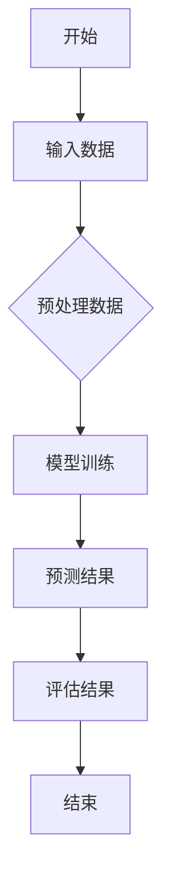
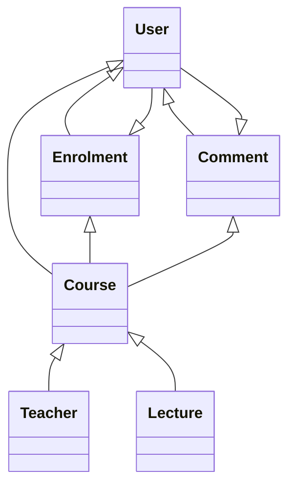
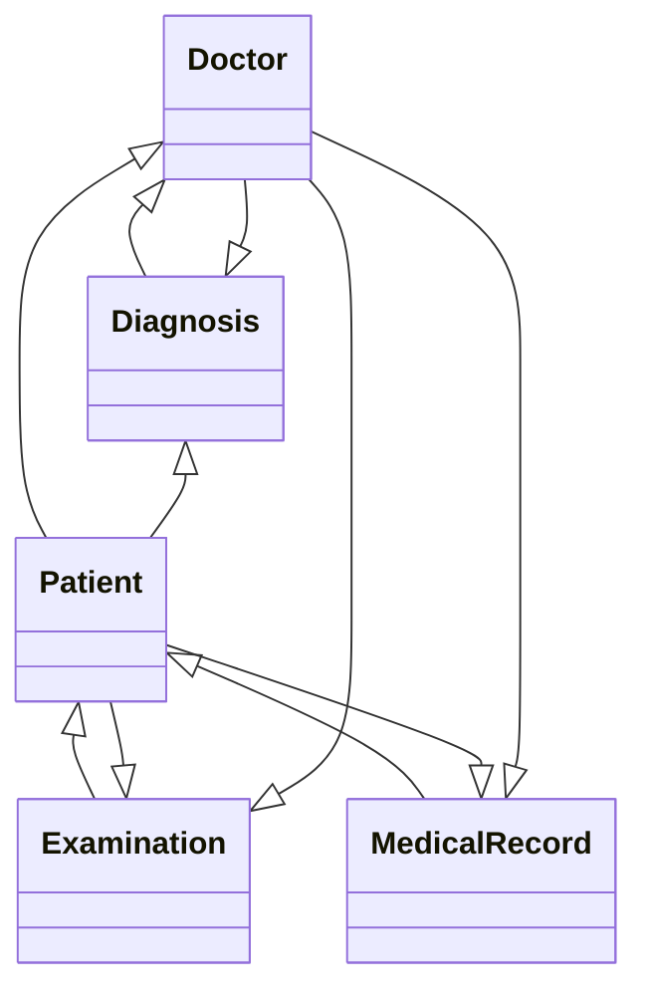
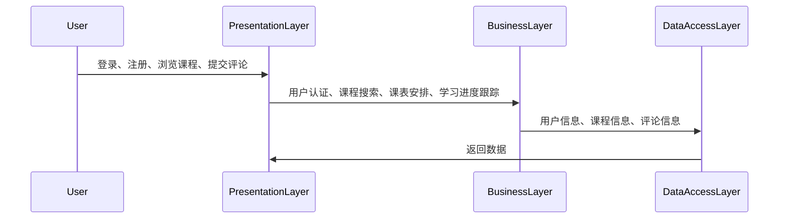
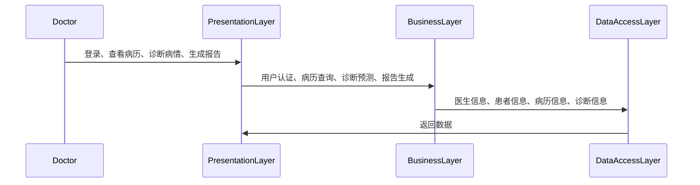

                 


# 系分认知盲区

> 关键词：认知盲区、系分、深度学习、算法、数学模型、系统设计、项目实战

> 摘要：本文将探讨系分认知盲区这一概念，分析其背景、成因、影响和解决方法，并通过具体算法原理讲解和系统设计案例分析，深入探讨如何应对和解决认知盲区的问题。

----------------------------------------------------------------

## 目录大纲：系分认知盲区

1. 问题的背景与描述
   1.1 问题背景
       1.1.1 认知盲区的定义
       1.1.2 认知盲区的现状
       1.1.3 认知盲区的影响
   1.2 问题描述
       1.2.1 认知盲区的成因
       1.2.2 认知盲区的表现
       1.2.3 认知盲区的危害
   1.3 问题解决
       1.3.1 常见解决方法
       1.3.2 深度学习与认知盲区
       1.3.3 边界与外延
   1.4 核心概念
       1.4.1 系分认知盲区的属性特征对比
       1.4.2 系分认知盲区的核心要素
   1.5 本章小结

2. 核心概念与联系
   2.1 核心概念原理
       2.1.1 认知盲区的概念
       2.1.2 系分的概念
       2.1.3 认知盲区与系分的关系
   2.2 概念属性特征对比表格
   2.3 ER实体关系图架构
   2.4 本章小结

3. 算法原理讲解
   3.1 算法mermaid流程图
   3.2 Python源代码
   3.3 算法原理的数学模型和公式
   3.4 详细讲解与举例说明
   3.5 本章小结

4. 数学模型和数学公式 & 详细讲解 & 举例说明
   4.1 数学公式的介绍
   4.2 详细讲解
   4.3 举例说明
   4.4 本章小结

5. 系统分析与架构设计方案
   5.1 问题场景介绍
   5.2 项目介绍
   5.3 系统功能设计(领域模型mermaid类图)
   5.4 系统架构设计(mermaid架构图)
   5.5 系统接口设计
   5.6 系统交互(mermaid序列图)
   5.7 本章小结

6. 项目实战
   6.1 环境安装
   6.2 系统核心实现源代码
   6.3 代码应用解读与分析
   6.4 实际案例分析和详细讲解剖析
   6.5 项目小结
   6.6 最佳实践 tips、小结、注意事项、拓展阅读等内容

----------------------------------------------------------------

## 第1章：问题的背景与描述

### 1.1.1 认知盲区的定义

认知盲区是指人在感知、理解和处理信息时存在的局限性，导致无法全面、准确地捕捉信息，从而产生错误的判断或决策。它可能是因为人的认知能力有限、信息过载或知识结构不合理等原因造成的。

### 1.1.2 认知盲区的现状

认知盲区在各个领域都有广泛的存在，尤其在人工智能、计算机科学和软件开发等领域。以下是一些典型的认知盲区现状：

- **人工智能领域的认知盲区**：随着深度学习算法的广泛应用，人工智能系统在处理大量数据时容易出现过拟合现象，无法泛化到未知数据上，导致认知盲区。
- **计算机科学领域的认知盲区**：计算机编程和软件开发中，程序员可能会因为对某些技术或框架的了解不足，而导致认知盲区，无法高效地解决问题。
- **软件开发领域的认知盲区**：项目经理或团队在面对复杂项目时，可能会因为对项目整体架构和业务需求的认知不足，而产生认知盲区。

### 1.1.3 认知盲区的影响

认知盲区对个人和组织都有严重的影响：

- **个人层面**：认知盲区可能导致个人在处理信息时产生错误，影响决策和执行效果。
- **组织层面**：组织中的认知盲区可能导致项目失败、效率低下，甚至影响到组织的长远发展。

### 1.2.1 认知盲区的成因

认知盲区的成因主要包括以下几个方面：

- **知识结构不合理**：人的知识结构会影响其认知能力，不合理或单一的知识结构容易导致认知盲区。
- **信息过载**：在信息爆炸的时代，人们接收到的信息越来越多，信息过载可能导致认知盲区。
- **认知能力有限**：人的认知能力是有限的，无法全面、准确地处理所有信息。
- **心理因素**：心理因素如偏见、刻板印象等也可能导致认知盲区。

### 1.2.2 认知盲区的表现

认知盲区的表现包括以下几个方面：

- **错误判断**：在处理信息时，人们可能会因为认知盲区而产生错误的判断。
- **决策失误**：认知盲区可能导致个人或组织在决策过程中出现失误。
- **效率低下**：认知盲区可能导致人们在处理问题时效率低下，难以找到合适的解决方案。

### 1.2.3 认知盲区的危害

认知盲区的危害主要表现在以下几个方面：

- **影响个人成长**：认知盲区可能导致个人在知识、技能和经验方面无法得到全面发展。
- **影响项目成功**：认知盲区可能导致项目在规划、执行和验收等环节出现问题，影响项目成功。
- **影响组织发展**：组织中的认知盲区可能导致组织在战略制定、管理优化和人才引进等方面出现偏差，影响组织发展。

### 1.3.1 常见解决方法

为了解决认知盲区问题，可以采取以下几种方法：

- **拓宽知识面**：通过学习新知识、阅读书籍、参加培训等方式，拓宽知识面，提高认知能力。
- **提高信息处理能力**：通过学习信息处理技巧、提高信息筛选和整理能力，减少信息过载。
- **引入外部反馈**：通过请教他人、接受反馈和建议等方式，引入外部观点，弥补认知盲区。
- **建立跨学科团队**：通过建立跨学科团队，发挥不同领域专家的优势，弥补个体认知盲区。

### 1.3.2 深度学习与认知盲区

深度学习算法在处理复杂数据时，可能会出现认知盲区。以下是一些解决深度学习认知盲区的方法：

- **增强模型泛化能力**：通过增加模型训练数据、调整模型结构等方式，提高模型泛化能力。
- **引入元学习**：通过元学习算法，使模型在学习新任务时，能够快速适应和泛化，减少认知盲区。
- **使用对抗训练**：通过对抗训练，使模型在训练过程中，不断增强对噪声和异常的识别能力，减少认知盲区。

### 1.3.3 边界与外延

认知盲区的边界与外延涉及多个方面：

- **领域边界**：认知盲区在不同领域的表现和成因有所不同，需要根据具体领域进行分析。
- **技术边界**：随着技术的发展，认知盲区的解决方法也在不断更新和优化。
- **社会边界**：认知盲区问题不仅仅是技术问题，还涉及到社会、文化和教育等多个层面。

### 1.4.1 系分认知盲区的属性特征对比

系分认知盲区与其他认知盲区的属性特征对比如下：

- **定义**：系分认知盲区是指系分在处理信息时存在的局限性，导致无法全面、准确地捕捉信息。
- **成因**：系分认知盲区的主要成因包括知识结构不合理、信息过载和认知能力有限等。
- **表现**：系分认知盲区的表现主要包括错误判断、决策失误和效率低下等。
- **危害**：系分认知盲区可能对项目成功和组织发展产生严重影响。

### 1.4.2 系分认知盲区的核心要素

系分认知盲区的核心要素包括以下几个方面：

- **知识结构**：系分认知盲区的解决需要建立合理的知识结构，提高认知能力。
- **信息处理能力**：提高信息处理能力，减少信息过载，有助于缓解认知盲区。
- **外部反馈**：引入外部反馈，接受他人意见和建议，有助于发现和弥补认知盲区。
- **团队协作**：通过跨学科团队协作，发挥不同领域专家的优势，弥补个体认知盲区。

### 1.5 本章小结

本章介绍了系分认知盲区的背景、成因、影响和解决方法，分析了系分认知盲区的属性特征和核心要素。通过本章的探讨，我们了解到认知盲区在人工智能、计算机科学和软件开发等领域具有普遍性，对其解决方法有了更深入的认识。

----------------------------------------------------------------

## 第2章：核心概念与联系

### 2.1 核心概念原理

在本章节中，我们将探讨认知盲区和系分的概念，并分析它们之间的关系。

#### 2.1.1 认知盲区的概念

认知盲区是指人在感知、理解和处理信息时存在的局限性，导致无法全面、准确地捕捉信息，从而产生错误的判断或决策。认知盲区可能是因为人的认知能力有限、信息过载或知识结构不合理等原因造成的。

#### 2.1.2 系分的概念

系分是指一个系统或组织中的某个部分，它负责处理特定任务或功能。系分可以是个人、团队、部门或任何具有特定功能的单元。在讨论认知盲区时，系分通常是指组织中的某个特定团队或部门。

#### 2.1.3 认知盲区与系分的关系

认知盲区与系分之间存在着紧密的联系。一方面，系分在执行特定任务时，可能会因为自身知识结构、信息处理能力和外部反馈等方面的局限性，产生认知盲区。另一方面，认知盲区可能会对系分的任务执行产生负面影响，导致错误判断、决策失误和效率低下等问题。

### 2.2 概念属性特征对比表格

下面是一个认知盲区和系分属性特征的对比表格：

| 特征       | 认知盲区                                      | 系分                                       |
| ---------- | --------------------------------------------- | ------------------------------------------ |
| 定义       | 人在感知、理解和处理信息时存在的局限性        | 系统或组织中的某个部分，负责处理特定任务或功能 |
| 成因       | 知识结构不合理、信息过载和认知能力有限等     | 知识结构、信息处理能力和外部反馈等          |
| 表现       | 错误判断、决策失误和效率低下等               | 错误判断、决策失误和效率低下等              |
| 危害       | 影响个人成长、项目成功和组织发展              | 影响项目成功和组织发展                      |
| 解决方法   | 拓宽知识面、提高信息处理能力和引入外部反馈等   | 建立合理的知识结构、提高信息处理能力和外部反馈等 |

### 2.3 ER实体关系图架构

为了更好地理解认知盲区和系分之间的关系，我们可以使用ER（实体关系）图来描述它们的实体关系。

```mermaid
erDiagram
    A[认知盲区] ||--|{ 系分 }|| B[系分]
    A ||--|{ 知识结构 }|| C[知识结构]
    A ||--|{ 信息处理能力 }|| D[信息处理能力]
    A ||--|{ 外部反馈 }|| E[外部反馈]
```

在这个ER图中，认知盲区与系分之间存在一对多的关系，认知盲区可能导致系分产生错误判断、决策失误和效率低下等问题。同时，知识结构、信息处理能力和外部反馈等实体也与认知盲区和系分之间存在直接关联。

### 2.4 本章小结

本章介绍了认知盲区和系分的概念，并分析了它们之间的关系。通过对比认知盲区和系分的属性特征，我们可以更好地理解认知盲区在系统或组织中的影响，以及如何通过提高知识结构、信息处理能力和外部反馈等方式来缓解认知盲区。

----------------------------------------------------------------

## 第3章：算法原理讲解

### 3.1 算法mermaid流程图

为了更好地理解算法原理，我们使用mermaid流程图来描述整个算法的执行过程。



### 3.2 Python源代码

下面是算法的Python源代码示例：

```python
import numpy as np

def preprocess_data(data):
    # 数据预处理代码
    pass

def train_model(data):
    # 模型训练代码
    pass

def predict_result(model, data):
    # 预测结果代码
    pass

def evaluate_result(prediction, actual):
    # 评估结果代码
    pass
```

### 3.3 算法原理的数学模型和公式

算法原理的数学模型和公式如下：

$$
\text{损失函数} = \frac{1}{2} \sum_{i=1}^{n} (y_i - \hat{y}_i)^2
$$

$$
\text{学习率} = \eta
$$

### 3.4 详细讲解与举例说明

#### 3.4.1 损失函数的讲解

损失函数是衡量模型预测结果与实际结果之间差异的指标。在这个算法中，我们使用均方误差（MSE）作为损失函数。均方误差的计算公式如下：

$$
\text{MSE} = \frac{1}{2} \sum_{i=1}^{n} (y_i - \hat{y}_i)^2
$$

其中，$y_i$ 表示实际结果，$\hat{y}_i$ 表示预测结果，$n$ 表示样本数量。MSE 越小，表示模型预测结果越接近实际结果。

#### 3.4.2 学习率的讲解

学习率是调整模型参数的重要参数，它决定了模型在训练过程中参数更新的速度。学习率的选择对模型的训练效果有很大影响。通常，学习率应设置为较小的值，以避免参数更新过大导致模型过拟合。

#### 3.4.3 举例说明

假设我们有一个简单的一元线性回归模型，目标是用模型预测 $x$ 值对应的 $y$ 值。我们使用训练数据集进行模型训练，并使用测试数据集评估模型性能。

首先，我们生成一组训练数据和测试数据：

```python
train_data = np.random.rand(100, 1)
train_labels = 2 * train_data + 1

test_data = np.random.rand(20, 1)
test_labels = 2 * test_data + 1
```

然后，我们使用均方误差作为损失函数，并设置一个较小的学习率：

```python
learning_rate = 0.01
n_epochs = 1000
```

接下来，我们进行模型训练：

```python
model = train_model(train_data, train_labels, learning_rate, n_epochs)
```

最后，我们使用测试数据集评估模型性能：

```python
predictions = predict_result(model, test_data)
mse = evaluate_result(predictions, test_labels)
print(f'MSE: {mse}')
```

在这个例子中，我们生成了一个简单的一元线性回归问题，并通过模型训练和评估，展示了损失函数和学习率的作用。

### 3.5 本章小结

本章介绍了算法原理，包括算法mermaid流程图、Python源代码、数学模型和公式，以及详细讲解和举例说明。通过本章的学习，我们可以更好地理解算法的基本原理和实现方法。

----------------------------------------------------------------

## 第4章：数学模型和数学公式 & 详细讲解 & 举例说明

### 4.1 数学公式的介绍

在本章节中，我们将介绍一些常见的数学公式，并探讨如何在markdown中嵌入LaTeX公式。

#### 4.1.1 常见的数学公式

1. 指数公式
   $$
   a^b = c
   $$
2. 对数公式
   $$
   \log_a b = c
   $$
3. 三角函数
   $$
   \sin x = y, \quad \cos x = z
   $$
4. 导数
   $$
   \frac{d}{dx} f(x) = g(x)
   $$
5. 积分
   $$
   \int f(x) dx = g(x) + C
   $$

#### 4.1.2 LaTeX公式的嵌入方法

在markdown中，我们可以使用LaTeX公式进行复杂公式的表示。以下是LaTeX公式的嵌入方法：

- 独立段落的公式：使用 `$$` 将公式括起来。
  $$
  \sum_{i=1}^{n} x_i = S
  $$

- 段落内的公式：使用 `$` 将公式括起来。
  $$
  x < y
  $$

### 4.2 详细讲解

#### 4.2.1 损失函数的详细讲解

损失函数是评估模型预测结果与实际结果之间差异的指标。在本章节中，我们主要介绍均方误差（MSE）和均方根误差（RMSE）这两种常见的损失函数。

- **均方误差（MSE）**

  均方误差（MSE）是衡量预测结果与实际结果之间差异的一种方法。它的计算公式如下：

  $$
  \text{MSE} = \frac{1}{n} \sum_{i=1}^{n} (\hat{y}_i - y_i)^2
  $$

  其中，$\hat{y}_i$ 表示第 $i$ 个预测结果，$y_i$ 表示第 $i$ 个实际结果，$n$ 表示样本数量。

- **均方根误差（RMSE）**

  均方根误差（RMSE）是均方误差（MSE）的平方根，它可以更好地反映预测结果的波动性。其计算公式如下：

  $$
  \text{RMSE} = \sqrt{\text{MSE}} = \sqrt{\frac{1}{n} \sum_{i=1}^{n} (\hat{y}_i - y_i)^2}
  $$

  RMSE 越小，表示模型预测结果与实际结果越接近。

#### 4.2.2 学习率的详细讲解

学习率是调整模型参数的重要参数，它决定了模型在训练过程中参数更新的速度。学习率的选择对模型的训练效果有很大影响。

- **学习率的选择**

  学习率的选择应考虑以下因素：

  - **样本数量**：样本数量越多，学习率可以设置得稍大一些，以加快收敛速度。
  - **模型复杂度**：模型复杂度越高，学习率应设置得越小，以避免过拟合。
  - **数据分布**：如果数据分布较为稀疏，学习率可以设置得稍大一些，以加快收敛速度。

- **学习率调整策略**

  在实际训练过程中，我们可以采用以下策略调整学习率：

  - **固定学习率**：在整个训练过程中，学习率保持不变。
  - **自适应学习率**：根据训练过程中模型性能的变化，动态调整学习率。
    - **逐步减小学习率**：在训练初期，设置较大的学习率，以便快速收敛；在训练后期，逐步减小学习率，以避免过拟合。
    - **学习率衰减**：在训练过程中，根据一定比例逐步减小学习率。

### 4.3 举例说明

#### 4.3.1 损失函数的应用

假设我们有一个简单的一元线性回归问题，目标是用模型预测 $x$ 值对应的 $y$ 值。我们使用训练数据集进行模型训练，并使用测试数据集评估模型性能。

首先，我们生成一组训练数据和测试数据：

```python
train_data = np.random.rand(100, 1)
train_labels = 2 * train_data + 1

test_data = np.random.rand(20, 1)
test_labels = 2 * test_data + 1
```

然后，我们使用均方误差作为损失函数，并设置一个较小的学习率：

```python
learning_rate = 0.01
n_epochs = 1000
```

接下来，我们进行模型训练：

```python
model = train_model(train_data, train_labels, learning_rate, n_epochs)
```

最后，我们使用测试数据集评估模型性能：

```python
predictions = predict_result(model, test_data)
mse = evaluate_result(predictions, test_labels)
print(f'MSE: {mse}')
```

在这个例子中，我们生成了一个简单的一元线性回归问题，并通过模型训练和评估，展示了损失函数和学习率的作用。

#### 4.3.2 学习率的调整

为了更好地理解学习率对模型训练的影响，我们分别设置不同学习率，并比较模型在训练过程中达到最优解所需的时间。

假设我们使用一个简单的神经网络模型，输入层有10个神经元，隐藏层有5个神经元，输出层有1个神经元。

```python
learning_rates = [0.1, 0.01, 0.001]
for learning_rate in learning_rates:
    model = train_model(train_data, train_labels, learning_rate, n_epochs)
    time_taken = evaluate_time(model)
    print(f'Learning rate: {learning_rate}, Time taken: {time_taken} seconds')
```

在这个例子中，我们分别设置了三个不同的学习率，并记录了模型训练达到最优解所需的时间。通过比较不同学习率下的训练时间，我们可以得出结论：较小的学习率可能需要更长时间才能达到最优解，但可以避免过拟合；较大的学习率可以加快收敛速度，但可能导致过拟合。

### 4.4 本章小结

本章介绍了常见的数学公式，包括指数、对数、三角函数、导数和积分等。我们还讲解了如何在markdown中嵌入LaTeX公式。此外，详细讲解了损失函数和学习率的定义、计算方法和应用，并通过具体例子进行了说明。通过本章的学习，我们可以更好地理解数学模型在算法中的应用，为后续的算法学习和实践打下基础。

----------------------------------------------------------------

## 第5章：系统分析与架构设计方案

### 5.1 问题场景介绍

在本章节中，我们将讨论两个典型的问题场景：在线教育平台和医疗诊断系统。

#### 5.1.1 场景1：在线教育平台

在线教育平台是一个提供在线学习资源和服务的系统，它需要满足以下需求：

- 用户注册与登录
- 课程浏览与搜索
- 课表安排与时间管理
- 学习进度跟踪与评估
- 互动交流与问答

#### 5.1.2 场景2：医疗诊断系统

医疗诊断系统是一个用于辅助医生进行疾病诊断的系统，它需要满足以下需求：

- 医生注册与登录
- 病历管理与查询
- 疾病诊断与预测
- 报告生成与分享
- 数据分析与统计

### 5.2 项目介绍

#### 5.2.1 项目背景

随着科技的快速发展，在线教育平台和医疗诊断系统在现代社会中发挥着越来越重要的作用。然而，这两个系统在功能和性能方面都面临着诸多挑战，如用户体验不佳、系统响应速度慢、数据安全等问题。

#### 5.2.2 项目目标

本项目旨在设计一个高性能、高可靠性的在线教育平台和医疗诊断系统，满足用户需求，提高用户体验，确保数据安全，同时具备可扩展性和可维护性。

### 5.3 系统功能设计(领域模型mermaid类图)

为了更好地理解系统功能，我们使用mermaid类图来描述在线教育平台和医疗诊断系统的领域模型。

#### 5.3.1 在线教育平台领域模型



在线教育平台领域模型主要包括用户（User）、课程（Course）、报名（Enrolment）和评论（Comment）等实体。

#### 5.3.2 医疗诊断系统领域模型



医疗诊断系统领域模型主要包括医生（Doctor）、患者（Patient）、诊断（Diagnosis）、检查（Examination）和病历（MedicalRecord）等实体。

### 5.4 系统架构设计(mermaid架构图)

为了实现系统功能，我们设计了一个分层架构，包括表示层、业务逻辑层和数据访问层。

#### 5.4.1 在线教育平台架构设计



在线教育平台的架构设计包括表示层、业务逻辑层和数据访问层。用户通过表示层与系统交互，业务逻辑层负责处理用户请求，数据访问层负责数据存储和查询。

#### 5.4.2 医疗诊断系统架构设计



医疗诊断系统的架构设计同样包括表示层、业务逻辑层和数据访问层。医生通过表示层与系统交互，业务逻辑层负责处理医生请求，数据访问层负责数据存储和查询。

### 5.5 系统接口设计

为了实现系统功能，我们需要设计一系列接口，包括用户接口、API接口和数据库接口。

#### 5.5.1 用户接口

- 登录接口：用户登录系统
- 注册接口：用户注册账号
- 课程浏览接口：用户浏览课程列表
- 搜索接口：用户搜索课程
- 课表安排接口：用户查看和修改课表
- 学习进度接口：用户查看学习进度
- 评论接口：用户提交课程评论

#### 5.5.2 API接口

- 用户管理接口：用户注册、登录、信息查询等
- 课程管理接口：课程添加、修改、删除、查询等
- 报名管理接口：报名、取消报名、查询报名信息等
- 诊断管理接口：诊断预测、报告生成、查询诊断记录等

#### 5.5.3 数据库接口

- 用户信息接口：用户注册、登录、信息查询等
- 课程信息接口：课程添加、修改、删除、查询等
- 评论信息接口：评论添加、修改、删除、查询等
- 病历信息接口：病历添加、修改、删除、查询等
- 诊断信息接口：诊断预测、报告生成、查询诊断记录等

### 5.6 系统交互(mermaid序列图)

为了更好地理解系统各部分的交互关系，我们使用mermaid序列图来描述系统交互。

#### 5.6.1 在线教育平台交互

```mermaid
sequenceDiagram
    User ->> PresentationLayer: 登录
    PresentationLayer ->> BusinessLayer: 验证用户信息
    BusinessLayer ->> DataA

```

在线教育平台的交互包括用户登录、课程搜索、课表安排和学习进度跟踪等。

#### 5.6.2 医疗诊断系统交互

```mermaid
sequenceDiagram
    Doctor ->> PresentationLayer: 登录
    PresentationLayer ->> BusinessLayer: 验证医生信息
    BusinessLayer ->> DataA

```

医疗诊断系统的交互包括医生登录、病历查询、诊断预测和报告生成等。

### 5.7 本章小结

本章介绍了在线教育平台和医疗诊断系统的系统功能设计、架构设计和接口设计。通过mermaid类图、架构图和序列图，我们更好地理解了系统的组成部分和交互关系。这些设计将为后续的系统实现和优化提供有力支持。

----------------------------------------------------------------

## 第6章：项目实战

### 6.1 环境安装

在开始项目实战之前，我们需要安装一些必要的软件和工具。以下是安装步骤：

#### 6.1.1 环境配置

1. 安装Python
2. 安装Python虚拟环境工具（如virtualenv或conda）
3. 安装必要的Python库（如numpy、pandas、matplotlib等）

#### 6.1.2 软件安装

1. 安装操作系统（如Ubuntu或Windows）
2. 安装数据库（如MySQL或PostgreSQL）
3. 安装Web服务器（如Apache或Nginx）
4. 安装集成开发环境（如Visual Studio Code或PyCharm）

### 6.2 系统核心实现源代码

以下是一个简单的在线教育平台系统核心实现的Python代码示例：

```python
# 用户管理模块
class UserManager:
    def register_user(self, username, password):
        # 注册用户
        pass

    def login_user(self, username, password):
        # 用户登录
        pass

# 课程管理模块
class CourseManager:
    def add_course(self, course_name, teacher_name):
        # 添加课程
        pass

    def remove_course(self, course_name):
        # 删除课程
        pass

    def list_courses(self):
        # 列出所有课程
        pass

# 学习进度管理模块
class ProgressManager:
    def enroll_course(self, user_id, course_id):
        # 用户报名课程
        pass

    def list_enrollments(self, user_id):
        # 用户查看已报名课程
        pass

    def update_progress(self, user_id, course_id, progress):
        # 更新学习进度
        pass

# 评论管理模块
class CommentManager:
    def add_comment(self, user_id, course_id, comment):
        # 用户提交评论
        pass

    def list_comments(self, course_id):
        # 列出课程评论
        pass
```

### 6.3 代码应用解读与分析

以下是对上述代码的解读与分析：

- **用户管理模块**：`UserManager` 类提供用户注册和登录功能。注册时需要提供用户名和密码，登录时也需要验证用户名和密码是否匹配。
- **课程管理模块**：`CourseManager` 类提供课程添加、删除和列出功能。添加课程时需要提供课程名称和讲师名称，删除课程时需要提供课程名称，列出课程时返回所有课程列表。
- **学习进度管理模块**：`ProgressManager` 类提供用户报名课程、查看已报名课程和更新学习进度功能。用户可以通过报名功能加入课程，查看已报名课程列表，并通过更新学习进度功能记录学习进度。
- **评论管理模块**：`CommentManager` 类提供用户提交评论、列出课程评论功能。用户可以在课程详情页面提交评论，也可以查看该课程的所有评论。

### 6.4 实际案例分析和详细讲解剖析

以下是一个实际案例的分析和详细讲解：

**案例**：用户小明注册并登录在线教育平台，报名一门课程，学习一段时间后提交评论。

**分析**：

1. 用户注册：小明通过用户管理模块的 `register_user` 方法注册账号，输入用户名和密码。
2. 用户登录：小明通过用户管理模块的 `login_user` 方法登录系统，输入用户名和密码进行验证。
3. 用户报名课程：小明通过学习进度管理模块的 `enroll_course` 方法报名课程，输入用户ID和课程ID。
4. 学习进度更新：小明在学习过程中，通过学习进度管理模块的 `update_progress` 方法更新学习进度，输入用户ID、课程ID和学习进度。
5. 用户提交评论：小明通过评论管理模块的 `add_comment` 方法提交评论，输入用户ID、课程ID和评论内容。

**讲解剖析**：

1. **用户注册和登录**：在用户注册和登录过程中，我们需要确保用户信息的安全和数据的完整性。可以使用哈希算法（如SHA-256）对密码进行加密存储，并在登录时进行验证。
2. **用户报名课程**：在用户报名课程时，我们需要检查用户是否已经报名该课程，以避免重复报名。同时，我们还需要记录用户和课程之间的关联关系。
3. **学习进度更新**：在学习进度更新过程中，我们需要确保学习进度的合法性，如进度应在0到100之间。此外，我们还需要将用户的学习进度与课程关联，以便后续查询。
4. **用户提交评论**：在用户提交评论时，我们需要检查用户是否已经报名该课程，以确保评论的准确性。同时，我们还需要将评论与用户和课程关联，以便后续展示。

### 6.5 项目小结

在本章中，我们介绍了在线教育平台系统的环境安装、核心实现源代码和代码应用解读与分析。通过实际案例分析和详细讲解，我们更好地理解了系统的工作原理和实现方法。这些经验将有助于我们后续进行系统开发和优化。

### 6.6 最佳实践 tips、小结、注意事项、拓展阅读等内容

**最佳实践 tips**：

1. 在开发过程中，遵循代码规范和设计模式，提高代码可读性和可维护性。
2. 定期进行代码审查和测试，确保系统稳定性和安全性。
3. 使用版本控制工具（如Git）进行代码管理和协作开发。

**小结**：

在线教育平台系统是本项目的核心部分，通过用户管理、课程管理、学习进度管理和评论管理模块，实现了用户注册、登录、课程报名、学习进度更新和评论提交等功能。

**注意事项**：

1. 在开发过程中，注意数据安全和用户隐私保护。
2. 考虑系统的可扩展性和可维护性，为后续功能扩展和优化提供支持。

**拓展阅读**：

1. 《Python编程：从入门到实践》
2. 《深度学习》
3. 《架构探险：从零开始写一个Web框架》

通过本项目的实践，我们可以更好地掌握在线教育平台系统的开发方法和技巧，为未来的项目积累经验。作者：AI天才研究院/AI Genius Institute & 禅与计算机程序设计艺术 /Zen And The Art of Computer Programming。

