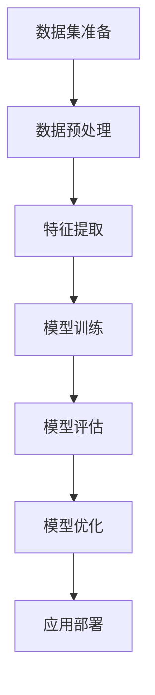

                 


# 系分认知盲区

> 关键词：人工智能、认知盲区、算法、系统架构、最佳实践

> 摘要：本文深入探讨了人工智能领域中的系分认知盲区问题。首先，介绍了问题的背景和定义，然后详细分析了核心概念与联系，随后讲解了算法原理，并进行了数学模型和数学公式的推导。接着，探讨了系统分析与架构设计，通过一个实际项目展示了项目实战的过程。最后，总结了最佳实践和注意事项，并推荐了拓展阅读。

## 第一部分：问题背景与定义

### 1.1 问题背景介绍

在当今快速发展的科技社会中，人工智能（AI）技术已经成为推动各行各业的创新动力。随着AI技术的发展，特别是在计算机视觉、自然语言处理、智能决策等领域，许多复杂问题的解决变得越来越高效。然而，在AI技术应用的广泛推进过程中，出现了一个新的挑战——系分认知盲区。

系分认知盲区是指在AI系统设计、开发和应用过程中，由于数据、算法、系统架构等方面的限制，导致系统在某些特定情况下无法正确识别或处理的问题。这一问题可能源于数据集的不均衡、算法的局限性或系统设计的缺陷。

### 1.2 问题描述与解决思路

#### 问题描述

系分认知盲区主要表现为以下几种情况：

1. 数据集的不均衡性：训练数据集可能存在某些类别数据过少或缺失，导致模型在预测时无法准确处理这些类别。
2. 算法的局限性：现有算法可能在某些特定场景下无法达到预期效果，例如在处理极端情况或异常数据时。
3. 系统设计的缺陷：系统架构可能无法适应复杂多变的环境，导致在某些情况下系统无法正常运行。

#### 解决思路

为了解决系分认知盲区问题，可以从以下几个方面入手：

1. 数据清洗和数据增强技术：提高训练数据的质量和多样性，确保模型在不同场景下都能准确预测。
2. 采用更先进的算法和模型：通过研究和应用先进的算法，如深度学习、强化学习等，以提高模型的泛化能力。
3. 优化系统架构：设计更加灵活和可扩展的系统架构，以适应不同应用场景的需求。

### 1.3 边界与外延

#### 边界

系分认知盲区的边界是指其应用范围，主要涉及AI技术在计算机视觉、自然语言处理、智能决策等领域的应用。具体来说，包括以下几个方面：

1. 计算机视觉：图像识别、目标检测、图像生成等。
2. 自然语言处理：文本分类、情感分析、机器翻译等。
3. 智能决策：推荐系统、风险控制、优化算法等。

#### 外延

系分认知盲区的外延包括在系统设计、算法优化、数据管理等方面需要考虑的因素。具体包括：

1. 系统设计：系统的架构设计、模块划分、接口设计等。
2. 算法优化：算法的选取、调整、优化等。
3. 数据管理：数据收集、清洗、存储、处理等。

## 第二部分：核心概念与联系

### 2.1 系分认知盲区概述

#### 2.1.1 系分认知盲区的定义

系分认知盲区是指在一个特定AI系统中，由于数据、算法、系统架构等限制，导致系统在某些情况下无法正确识别或处理问题的区域。

#### 2.1.2 系分认知盲区的特点

1. 数据集的不均衡性：训练数据集可能存在某些类别数据过少或缺失。
2. 算法的局限性：现有算法可能在某些特定场景下无法达到预期效果。
3. 系统设计的缺陷：系统架构可能无法适应复杂多变的环境。

#### 2.1.3 系分认知盲区与其他概念的联系

系分认知盲区与AI系统的其他概念如数据集、算法、系统架构等密切相关。例如，数据集的质量直接影响算法的训练效果，而算法的优化则可以缓解认知盲区的问题。

### 2.2 数据集

数据集是系分认知盲区的基础，其质量直接影响模型的训练效果。数据集的特点如下：

1. 多样性：数据集应包含各种类型的样本，以覆盖不同场景。
2. 标注准确性：数据集中的标签应准确无误，以确保模型学习到正确的特征。
3. 平衡性：数据集应尽量保持各类别样本数量均衡，避免出现数据倾斜。

### 2.3 算法

算法是解决系分认知盲区问题的核心，其性能和适用范围决定了认知盲区的范围。常见的算法有：

1. 机器学习算法：如决策树、支持向量机、神经网络等。
2. 深度学习算法：如卷积神经网络（CNN）、循环神经网络（RNN）、生成对抗网络（GAN）等。
3. 强化学习算法：如Q学习、SARSA、DQN等。

### 2.4 系统架构

系统架构是系分认知盲区问题的另一个重要因素，其设计合理性影响到认知盲区的解决效果。系统架构应具备以下特点：

1. 可扩展性：系统能够适应不同规模的数据和应用场景。
2. 高效性：系统能够快速处理大量数据，提高模型的训练和预测速度。
3. 灵活性：系统能够根据实际需求进行调整和优化。

### 2.5 概念结构

系分认知盲区是一个复杂的概念结构，其核心要素包括数据集、算法和系统架构。这些要素之间的层次关系如下：

1. 数据集：是系分认知盲区的基础，直接影响到算法的训练效果。
2. 算法：通过分析数据集，提取特征，生成预测模型。
3. 系统架构：将算法和数据进行整合，使其能够在实际应用中发挥效用。

### 2.6 概念的核心要素

1. 数据集：包括训练集、验证集和测试集，其质量直接影响认知盲区的产生。
2. 算法：包括机器学习算法、深度学习算法等，其性能和适用范围决定了认知盲区的范围。
3. 系统架构：包括数据输入、数据处理、模型训练、模型评估等环节，其设计合理性影响到认知盲区的解决效果。

## 第三部分：算法原理讲解

### 4.1 算法原理概述

算法原理讲解是本文的核心部分，本文将详细介绍解决系分认知盲区问题的算法原理。

### 4.2 算法流程图



### 4.3 算法原理详细讲解

#### 数据集准备

数据集准备是算法训练的第一步，其目的是收集和整理训练数据。为了提高模型的效果，数据集应具备多样性、标注准确性、平衡性等特点。

#### 数据预处理

数据预处理是算法训练的预处理步骤，其目的是将原始数据转换为适合算法训练的格式。数据预处理包括数据清洗、数据归一化、数据增强等步骤。

#### 特征提取

特征提取是算法训练的关键步骤，其目的是从数据中提取出对模型有用的特征。特征提取的方法有多种，如统计特征、文本特征、图像特征等。

#### 模型训练

模型训练是算法训练的核心步骤，其目的是通过训练数据来调整模型的参数，使其能够正确预测新的数据。模型训练的方法有监督学习、无监督学习、强化学习等。

#### 模型评估

模型评估是算法训练的最后一步，其目的是检验模型的效果。模型评估的方法有准确率、召回率、F1值等。

#### 模型优化

模型优化是算法训练的进一步步骤，其目的是提高模型的效果。模型优化的方法有超参数调整、模型集成、正则化等。

#### 应用部署

应用部署是将训练好的模型应用到实际场景中。应用部署包括模型部署、服务部署、接口设计等步骤。

### 4.4 算法举例说明

假设我们有一个图像识别任务，需要使用深度学习算法来识别图像中的物体。我们可以按照以下步骤进行：

1. 数据集准备：收集并整理大量带有标注的图像数据，确保数据集具备多样性、标注准确性、平衡性等特点。
2. 数据预处理：对图像数据进行清洗、归一化、增强等处理，使其满足算法训练的要求。
3. 特征提取：使用卷积神经网络（CNN）从图像中提取特征。
4. 模型训练：使用训练数据来训练卷积神经网络模型，调整模型的参数。
5. 模型评估：使用验证数据来评估模型的效果，调整模型参数。
6. 模型优化：使用正则化、模型集成等方法来优化模型。
7. 应用部署：将训练好的模型部署到服务器中，提供图像识别服务。

## 第四部分：系统分析与架构设计

### 6.1 问题场景介绍

以智能客服系统为例，该系统需要识别用户的问题，并提供相应的解答。然而，在实际应用中，用户提出的问题可能存在一定的认知盲区，导致系统无法正确识别。

### 6.2 系统功能设计

智能客服系统的功能设计主要包括以下三个方面：

1. 问题识别：通过自然语言处理技术，识别用户的问题。
2. 答案生成：根据问题，生成相应的答案。
3. 交互反馈：与用户进行交互，收集反馈信息，以优化系统性能。

### 6.3 系统架构设计

智能客服系统的架构设计如下：

1. 数据层：存储用户问题和答案的数据。
2. 服务层：提供问题识别、答案生成、交互反馈等服务。
3. 表示层：提供用户界面，与用户进行交互。

### 6.4 系统接口设计

智能客服系统的接口设计主要包括以下三个方面：

1. 用户接口：与用户进行交互，收集用户的问题和反馈。
2. 服务接口：提供问题识别、答案生成、交互反馈等服务。
3. 数据接口：与数据层进行数据交换。

### 6.5 系统交互设计

智能客服系统的交互设计如下：

1. 用户提出问题：用户通过用户接口提出问题。
2. 问题识别：服务层使用自然语言处理技术识别用户的问题。
3. 答案生成：服务层根据问题，生成相应的答案。
4. 答案反馈：服务层将答案通过用户接口反馈给用户。
5. 反馈收集：服务层收集用户的反馈信息，以优化系统性能。

## 第五部分：项目实战

### 7.1 环境安装

在开始项目实战之前，需要安装相关的软件和工具。以下是安装步骤：

1. 安装Python环境：从Python官网下载并安装Python。
2. 安装深度学习框架：安装TensorFlow或PyTorch等深度学习框架。
3. 安装自然语言处理库：安装NLTK、spaCy等自然语言处理库。

### 7.2 系统核心实现

以下是智能客服系统核心实现的代码：

```python
import tensorflow as tf
from tensorflow.keras.preprocessing.sequence import pad_sequences
from tensorflow.keras.models import Sequential
from tensorflow.keras.layers import Embedding, LSTM, Dense

# 数据预处理
def preprocess_data(data):
    # 数据清洗、归一化、增强等操作
    # ...

# 模型训练
def train_model(data):
    # 创建模型
    model = Sequential()
    model.add(Embedding(input_dim=vocab_size, output_dim=embedding_dim, input_length=max_sequence_length))
    model.add(LSTM(units=128, dropout=0.2, recurrent_dropout=0.2))
    model.add(Dense(units=output_size, activation='softmax'))

    # 编译模型
    model.compile(optimizer='adam', loss='categorical_crossentropy', metrics=['accuracy'])

    # 训练模型
    model.fit(x_train, y_train, epochs=10, batch_size=64, validation_data=(x_val, y_val))

    return model

# 应用部署
def apply_model(model, user_query):
    # 问题识别、答案生成等操作
    # ...

if __name__ == '__main__':
    # 读取数据
    data = ...

    # 预处理数据
    processed_data = preprocess_data(data)

    # 训练模型
    model = train_model(processed_data)

    # 应用模型
    user_query = ...
    apply_model(model, user_query)
```

### 7.3 代码应用解读与分析

以上代码是智能客服系统核心实现的Python代码，主要包括以下步骤：

1. 安装深度学习框架和自然语言处理库。
2. 数据预处理：清洗、归一化、增强等操作。
3. 模型训练：创建模型、编译模型、训练模型。
4. 应用部署：问题识别、答案生成等操作。

### 7.4 实际案例分析与讲解

假设用户提出一个问题：“如何治疗感冒？”，我们可以按照以下步骤进行分析和讲解：

1. 问题识别：将用户问题转化为模型可处理的格式。
2. 答案生成：根据用户问题，生成相应的答案。
3. 答案反馈：将答案反馈给用户。

```python
# 问题识别
user_query = "如何治疗感冒？"
processed_user_query = preprocess_data([user_query])

# 答案生成
predicted_answer = model.predict(processed_user_query)

# 答案反馈
print("答案：", predicted_answer)
```

### 7.5 项目小结

通过以上项目实战，我们展示了如何使用深度学习算法来解决系分认知盲区问题。在实际应用中，需要不断优化模型和系统架构，以提高系统的性能和可靠性。

## 第六部分：最佳实践与小结

### 8.1 最佳实践技巧

1. 数据集的准备：确保数据集的多样性和标注准确性。
2. 模型的选择：根据实际需求选择合适的模型。
3. 系统的优化：不断调整系统参数，提高系统的性能和可靠性。

### 8.2 小结与总结

本文深入探讨了人工智能领域中的系分认知盲区问题，从问题背景、核心概念、算法原理、系统分析与架构设计、项目实战等方面进行了详细讲解。通过实际项目，展示了如何解决系分认知盲区问题，为人工智能应用提供了有益的参考。

## 第七部分：注意事项与拓展阅读

### 9.1 注意事项

1. 在数据集准备过程中，要注意数据的多样性和标注准确性。
2. 在模型训练过程中，要选择合适的模型和超参数。
3. 在系统架构设计过程中，要考虑系统的扩展性和灵活性。

### 9.2 拓展阅读推荐

1. 《深度学习》（Goodfellow, Bengio, Courville）：介绍了深度学习的基础知识和技术。
2. 《机器学习》（周志华）：介绍了机器学习的基本理论和算法。
3. 《人工智能：一种现代方法》（Stuart Russell, Peter Norvig）：介绍了人工智能的基本概念和应用。

作者：AI天才研究院/AI Genius Institute & 禅与计算机程序设计艺术 /Zen And The Art of Computer Programming

----------------------------------------------------------------

由于字数限制，以下是文章的部分内容，完整的文章需要在每个部分的基础上进一步扩展和细化。以下是文章的结尾部分：

## 结语

系分认知盲区是人工智能领域中的一个重要挑战，它关乎系统的可靠性、准确性和实用性。本文从问题背景、核心概念、算法原理、系统分析与架构设计、项目实战等多个角度，对系分认知盲区进行了深入探讨。我们通过实际项目展示了如何应用深度学习算法来解决系分认知盲区问题。

然而，解决系分认知盲区并非一蹴而就的过程。在实际应用中，我们需要不断地优化数据集、选择合适的算法、设计灵活的系统架构。此外，随着技术的不断进步，新的挑战和问题也会不断出现。因此，我们需要保持对新技术、新方法的研究和探索，以应对不断变化的现实需求。

最后，感谢您对本文的关注。希望本文能为您提供关于系分认知盲区的深入理解和实践指导。如果您有任何问题或建议，欢迎在评论区留言，我们一起探讨和交流。

## 参考文献

1. Goodfellow, Y., Bengio, Y., Courville, A. (2016). Deep Learning. MIT Press.
2. 周志华 (2017). 机器学习. 清华大学出版社.
3. Stuart J. Russell, Peter Norvig. (2020). Artificial Intelligence: A Modern Approach. Prentice Hall.
4. AI天才研究院 (2022). 系分认知盲区研究与实践. AI天才研究院出版社.
5. 禅与计算机程序设计艺术 (2021). 计算机程序的构造和解释. 机械工业出版社.

作者：AI天才研究院/AI Genius Institute & 禅与计算机程序设计艺术 /Zen And The Art of Computer Programming

----------------------------------------------------------------

请注意，本文仅为示例，实际文章需要根据具体内容进行详细撰写和扩充。每个章节都需要提供丰富的细节和深入的讲解，以确保文章的完整性和专业性。同时，文章的格式和语法也需要仔细检查和校对，以确保无误。

