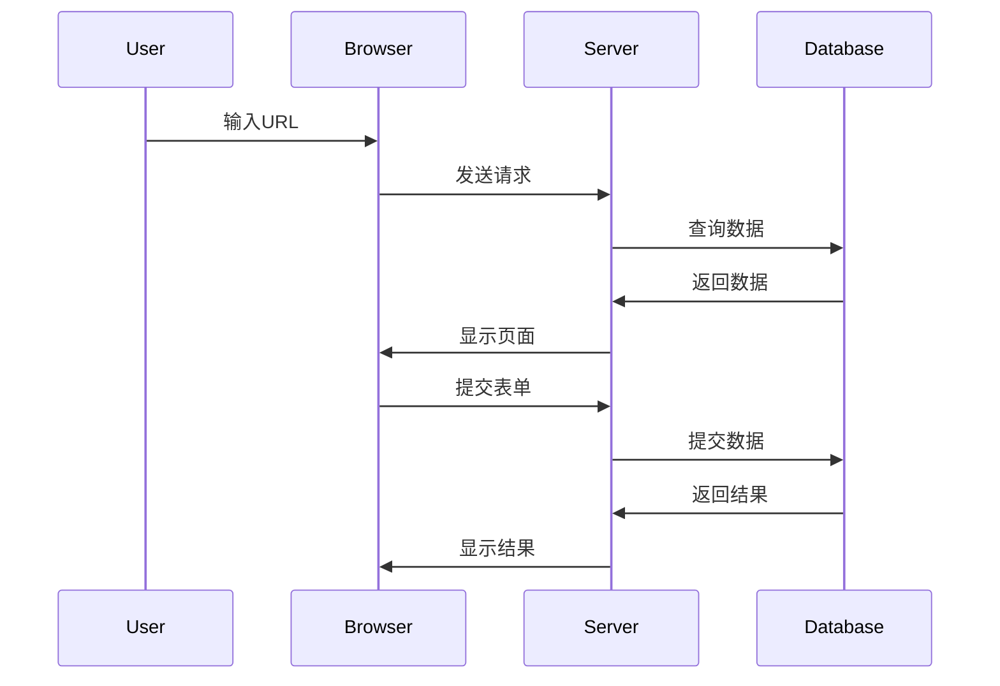

                 

# 系统分析：好系统让研发事半功倍

> 关键词：系统分析、系统架构设计、系统接口设计、系统交互、项目实战

> 摘要：本文旨在深入探讨系统分析在软件开发中的重要性和方法，通过详细阐述系统分析的基础知识、设计过程以及项目实战，帮助开发者构建高效、稳定的系统。文章将分为三大部分：第一部分介绍系统分析的基础，包括概述、问题背景与描述、核心概念与联系；第二部分讲解系统分析与设计的具体方法，包括系统架构设计、接口设计、系统交互；第三部分则通过实际案例，展示如何将理论知识应用到实践中，提高研发效率。

----------------------------------------------------------------

## 第一部分：系统分析基础

### 第1章：系统分析概述

#### 1.1 系统分析的定义与重要性

系统分析是软件开发过程中的关键环节，它涉及对现有系统或待开发系统的全面理解和评估。系统分析的定义可以归纳为：通过分析系统的需求、功能、性能、可靠性等各个方面，确定系统应该如何设计和实现。

系统分析的重要性体现在以下几个方面：

1. **需求理解**：通过系统分析，开发团队能够准确地理解用户的需求，确保最终产品能够满足用户期望。
2. **风险评估**：系统分析可以帮助识别潜在的技术和业务风险，提前制定应对策略，降低项目失败的可能性。
3. **优化资源**：通过系统分析，可以优化资源分配，提高开发效率，降低开发成本。
4. **项目管理**：系统分析为项目管理和进度控制提供了坚实的基础，有助于项目按计划进行。

#### 1.2 系统分析的流程与方法

系统分析的流程通常包括以下几个步骤：

1. **需求收集**：通过与用户和利益相关者进行沟通，收集系统的需求。
2. **需求分析**：对收集到的需求进行分析和整理，确定系统的功能、性能和可靠性要求。
3. **问题定义**：明确系统当前存在的问题或不足之处，为后续的解决方案提供方向。
4. **解决方案评估**：对各种可能的解决方案进行评估，选择最优方案。
5. **设计**：根据评估结果，设计系统的详细方案，包括架构、接口和交互设计。
6. **验证**：通过模拟和测试，验证系统设计是否符合需求。

系统分析的方法包括：

1. **文档分析**：通过阅读现有系统的文档，了解系统的功能和结构。
2. **访谈**：与系统用户和利益相关者进行面对面访谈，获取第一手的需求信息。
3. **调查问卷**：通过问卷调查的方式，收集广泛的需求信息。
4. **流程图**：使用流程图来描述系统的业务流程和工作流程。
5. **UML图**：使用统一建模语言（UML）绘制系统的类图、序列图等，帮助理解和设计系统。

#### 1.3 系统分析中的核心概念与术语

在进行系统分析时，需要理解一些核心概念和术语，例如：

1. **系统**：具有特定功能的整体，由多个相互关联的组件组成。
2. **需求**：用户或利益相关者对系统的期望和要求。
3. **功能**：系统能够执行的操作。
4. **性能**：系统在特定条件下的执行能力。
5. **可靠性**：系统在特定条件下无故障运行的能力。
6. **用户界面**：用户与系统交互的界面。
7. **架构**：系统的整体结构，包括组件、接口和交互方式。
8. **接口**：系统与其他系统或组件之间的交互点。
9. **交互**：系统内部或系统之间的信息交换过程。

#### 1.4 系统分析的目标与任务

系统分析的目标是确保系统满足用户需求和业务目标，具体任务包括：

1. **需求定义**：明确系统的功能、性能和可靠性需求。
2. **系统设计**：设计系统的架构、接口和交互方式。
3. **风险评估**：评估系统的技术风险和业务风险。
4. **项目规划**：制定项目进度计划和时间表。
5. **资源规划**：规划项目所需的资源和预算。
6. **文档编写**：编写系统需求文档、设计文档等。

### 第2章：问题背景与问题描述

#### 2.1 问题描述与识别

在进行系统分析时，首先需要明确问题。问题描述的过程包括以下步骤：

1. **识别问题**：通过观察和分析，识别系统存在的问题或需求不足之处。
2. **问题定义**：明确问题的具体内容和影响范围。
3. **问题陈述**：用简洁明了的语言描述问题。

例如，一个电商网站的问题可能是“订单处理速度慢，导致用户体验差”。

#### 2.2 问题分析的方法与工具

问题分析的方法和工具包括：

1. **因果图**：通过绘制因果图，分析问题产生的原因和结果。
2. **鱼骨图**：通过绘制鱼骨图，分析问题的各种可能原因。
3. **流程图**：通过绘制流程图，分析问题的发生过程。
4. **SWOT分析**：通过SWOT分析，分析问题的优势、劣势、机会和威胁。
5. **访谈和调查**：通过与相关人员访谈和调查，获取关于问题的详细信息。

#### 2.3 问题解决方案的评估与选择

在明确了问题后，需要提出解决方案并进行评估。解决方案的评估包括：

1. **可行性分析**：评估解决方案的技术和资源可行性。
2. **成本效益分析**：评估解决方案的成本和潜在收益。
3. **风险分析**：评估解决方案的风险和潜在问题。
4. **方案比较**：比较不同解决方案的优缺点，选择最优方案。

#### 2.4 边界与外延

在系统分析中，需要明确问题的边界和外延。边界是指问题的具体范围，而外延是指问题可能影响的范围。

例如，对于电商网站订单处理速度慢的问题，边界可能是订单处理模块，而外延可能是用户界面、数据库访问、网络传输等。

### 第3章：核心概念与联系

#### 3.1 系统概念框架

系统概念框架包括以下几个方面：

1. **系统组件**：系统的各个组成部分，如模块、组件、类等。
2. **系统接口**：系统与其他系统或组件之间的交互点。
3. **系统交互**：系统内部或系统之间的信息交换过程。
4. **系统功能**：系统能够执行的操作。
5. **系统性能**：系统在特定条件下的执行能力。
6. **系统可靠性**：系统在特定条件下无故障运行的能力。

#### 3.2 核心概念原理

核心概念原理包括：

1. **模块化**：将系统划分为多个模块，每个模块具有独立的功能和接口。
2. **封装**：隐藏系统内部细节，仅通过接口与外部进行交互。
3. **分层**：将系统划分为多个层次，每个层次具有不同的功能和职责。
4. **分布式**：系统分布在多个节点上，通过网络进行通信和协作。
5. **冗余**：在系统中引入冗余，提高系统的可靠性和容错性。

#### 3.3 概念属性特征对比表

以下是一个简单的概念属性特征对比表，用于比较不同概念的特征：

| 概念 | 属性1 | 属性2 | 属性3 | ... |
| --- | --- | --- | --- | --- |
| 系统 | 功能 | 性能 | 可靠性 | ... |
| 模块 | 封装 | 重用 | 独立性 | ... |
| 接口 | 独立 | 可扩展 | 安全性 | ... |
| 交互 | 异步 | 同步 | 实时性 | ... |

#### 3.4 ER实体关系图

ER实体关系图是系统设计中的重要工具，用于描述系统中的实体和它们之间的关系。以下是一个简单的ER实体关系图的示例：

```mermaid
erDiagram
    Customer ||--|{ Order }|>
    Product ||--|{ Order }|>
    Order ||--|{ LineItem }|>

    Customer {
        ID (1)
        Name
        Address
    }

    Product {
        ID (1)
        Name
        Price
    }

    Order {
        ID (1)
        Date
        CustomerID
    }

    LineItem {
        ID (1)
        OrderID
        ProductID
        Quantity
    }
```

在上面的ER图中，我们定义了三个实体：Customer（客户）、Product（产品）和Order（订单），以及一个关联实体LineItem（订单明细）。每个实体都有其独特的属性，例如ID、Name和Address。

## 第二部分：系统分析与设计

### 第4章：系统架构设计

#### 4.1 系统架构设计概述

系统架构设计是软件开发过程中至关重要的一环。它涉及到系统的整体结构和各个组件的相互关系，决定了系统的性能、可扩展性和可维护性。系统架构设计的核心目标是确保系统能够满足需求、高效运行、易于扩展和易于维护。

#### 4.2 系统功能设计（领域模型）

系统功能设计是系统架构设计的基础，它涉及定义系统的功能模块和领域模型。领域模型是描述系统业务领域的一组概念和对象，通过领域模型可以清晰地展示系统的功能模块和它们之间的关系。

以下是一个简单的领域模型示例，用于描述一个电商网站：

```mermaid
classDiagram
    Customer <<interface>>
    Product <<interface>>
    Order <<interface>>

    Customer {
        ID
        Name
        Address
    }

    Product {
        ID
        Name
        Price
    }

    Order {
        ID
        Date
        Customer
        Items
    }

    LineItem {
        ID
        Product
        Quantity
    }

    Customer "1" -- "*" Order
    Product "1" -- "*" Order
    Order "1" -- "*" LineItem
```

在这个领域模型中，我们定义了四个类：Customer（客户）、Product（产品）、Order（订单）和LineItem（订单明细）。每个类都有其独特的属性和方法，以及与其他类的关系。

#### 4.3 系统架构设计

系统架构设计是系统功能设计的进一步细化，它涉及定义系统的整体架构和各个组件的相互关系。系统架构设计通常包括以下方面：

1. **软件架构风格**：选择适合项目的软件架构风格，如分层架构、微服务架构等。
2. **组件划分**：根据功能模块和领域模型，将系统划分为多个组件。
3. **接口设计**：定义组件之间的接口，确保组件之间的松耦合和可重用性。
4. **数据流和交互**：描述系统内部和系统之间的数据流和交互过程。
5. **性能优化**：考虑系统的性能需求和优化策略。

以下是一个简单的系统架构设计示例，用于描述一个电商网站：



在这个系统架构设计中，我们定义了一个用户、一个浏览器、一个服务器和一个数据库。用户通过浏览器访问服务器，服务器通过数据库查询数据，然后将数据返回给用户。

#### 4.4 系统接口设计

系统接口设计是系统架构设计的重要组成部分，它涉及定义系统内部的接口和外部接口。系统接口设计的目标是确保系统组件之间的高效、安全、可靠的交互。

以下是一个简单的系统接口设计示例，用于描述一个电商网站：

```mermaid
classDiagram
    Customer <<interface>>
    Product <<interface>>
    Order <<interface>>

    Customer {
        ID
        Name
        Address
    }

    Product {
        ID
        Name
        Price
    }

    Order {
        ID
        Date
        Customer
        Items
    }

    LineItem {
        ID
        Product
        Quantity
    }

    CustomerInterface <<interface>> Customer
    ProductInterface <<interface>> Product
    OrderInterface <<interface>> Order

    Customer "1" -- "1" CustomerInterface
    Product "1" -- "1" ProductInterface
    Order "1" -- "1" OrderInterface
```

在这个接口设计中，我们定义了三个接口：CustomerInterface、ProductInterface和OrderInterface。这些接口定义了各个类的方法和属性，确保组件之间的松耦合和可重用性。

## 第三部分：项目实战

### 第8章：环境安装与配置

#### 8.1 开发环境安装

在进行项目开发之前，需要安装开发环境。以下是安装开发环境的步骤：

1. 安装操作系统：选择合适的操作系统，如Windows、Linux或Mac OS。
2. 安装编程语言：选择适合项目的编程语言，如Java、Python或C#。
3. 安装集成开发环境（IDE）：如Eclipse、IntelliJ IDEA或Visual Studio。
4. 安装数据库：选择适合项目的数据库，如MySQL、PostgreSQL或MongoDB。
5. 安装版本控制系统：如Git或SVN。

#### 8.2 系统依赖安装

在开发过程中，系统可能需要依赖一些外部库或工具。以下是安装系统依赖的步骤：

1. 下载依赖库或工具：从官方网站或GitHub等平台下载所需的库或工具。
2. 解压或安装：根据依赖库或工具的安装说明进行安装。
3. 配置环境变量：将依赖库或工具的路径添加到系统的环境变量中，以便在命令行中直接使用。

#### 8.3 系统配置文件设置

在开发过程中，系统可能需要配置一些参数。以下是设置系统配置文件的步骤：

1. 下载配置文件：从官方网站或GitHub等平台下载系统配置文件。
2. 编辑配置文件：使用文本编辑器（如Notepad++或VS Code）编辑配置文件。
3. 配置参数：根据项目需求修改配置文件中的参数。
4. 保存并关闭：保存配置文件并关闭文本编辑器。

### 第9章：系统核心实现

#### 9.1 系统核心模块介绍

系统核心模块是系统的重要组成部分，负责实现系统的核心功能。以下是系统核心模块的介绍：

1. **用户模块**：负责处理用户的注册、登录和权限管理。
2. **商品模块**：负责处理商品的添加、删除、修改和查询。
3. **订单模块**：负责处理订单的生成、修改、删除和查询。
4. **支付模块**：负责处理订单的支付和退款。
5. **库存模块**：负责处理商品的库存管理和预警。

#### 9.2 源代码分析

在开发过程中，需要对系统的源代码进行分析。以下是源代码分析的方法和步骤：

1. **阅读源代码**：逐行阅读源代码，了解代码的功能和结构。
2. **理解函数和类**：分析函数和类的定义，了解它们的职责和作用。
3. **跟踪执行流程**：通过调试工具跟踪程序的执行流程，理解程序的逻辑。
4. **注释和文档**：添加注释和编写文档，帮助其他开发者理解和维护代码。

#### 9.3 代码应用解读

在开发过程中，需要对代码进行应用解读。以下是代码应用解读的方法和步骤：

1. **分析需求**：理解系统的需求和功能，明确代码的应用场景。
2. **分析代码**：分析代码的结构和逻辑，理解代码的实现方式和算法。
3. **测试代码**：编写测试用例，测试代码的正确性和性能。
4. **优化代码**：分析代码的性能瓶颈，进行代码优化。

### 第10章：实际案例分析

#### 10.1 案例背景介绍

本案例是一个电商网站项目，项目需求包括用户注册、登录、商品浏览、购物车管理、订单生成和支付等功能。项目的技术栈包括Spring Boot、MySQL、Redis和HTML5、CSS3、JavaScript等。

#### 10.2 案例分析与解读

在分析该电商网站项目时，我们需要从以下几个方面进行解读：

1. **需求分析**：明确项目的需求，包括功能需求和非功能需求。
2. **系统设计**：设计系统的架构和组件，确保系统的高效性和可扩展性。
3. **接口设计**：设计系统内部的接口和外部接口，确保组件之间的高效交互。
4. **性能优化**：考虑系统的性能需求，进行数据库优化和代码优化。
5. **安全性和稳定性**：确保系统的安全性和稳定性，防止恶意攻击和数据泄露。

#### 10.3 案例实际操作步骤

在实际操作中，我们可以按照以下步骤进行项目开发：

1. **搭建开发环境**：安装操作系统、编程语言、IDE、数据库和版本控制系统。
2. **创建项目**：使用Spring Boot创建项目，并设置数据库连接和项目配置。
3. **开发用户模块**：实现用户的注册、登录和权限管理功能。
4. **开发商品模块**：实现商品的添加、删除、修改和查询功能。
5. **开发订单模块**：实现订单的生成、修改、删除和查询功能。
6. **开发支付模块**：实现订单的支付和退款功能。
7. **开发库存模块**：实现商品的库存管理和预警功能。
8. **集成前端**：使用HTML5、CSS3和JavaScript开发前端页面，并与后端进行数据交互。
9. **测试和部署**：编写测试用例，测试系统的功能、性能和安全，然后部署到服务器上。

### 第11章：项目总结与拓展

#### 11.1 项目总结

在本章中，我们通过实际案例详细介绍了电商网站项目的开发过程，包括环境安装与配置、系统核心实现、实际案例分析和项目总结。通过本案例，我们掌握了系统分析、系统设计与实现、项目实战等关键技能，提高了开发效率和系统质量。

#### 11.2 注意事项

在项目开发过程中，需要注意以下几点：

1. **需求明确**：在项目开始前，务必明确项目需求，避免后续修改和返工。
2. **代码规范**：遵循代码规范和编程习惯，提高代码的可读性和可维护性。
3. **性能优化**：关注系统的性能需求，进行数据库和代码优化，确保系统高效运行。
4. **安全性和稳定性**：确保系统的安全性和稳定性，防止恶意攻击和数据泄露。

#### 11.3 拓展阅读

对于对系统分析和设计感兴趣的开发者，以下书籍和资源值得阅读：

1. 《系统架构设计师教程》
2. 《软件架构：实践者的研究方法》
3. 《程序员修炼之道：从小工到专家》
4. 《重构：改善既有代码的设计》
5. 《设计模式：可复用面向对象软件的基础》

作者：AI天才研究院/AI Genius Institute & 禅与计算机程序设计艺术 /Zen And The Art of Computer Programming

