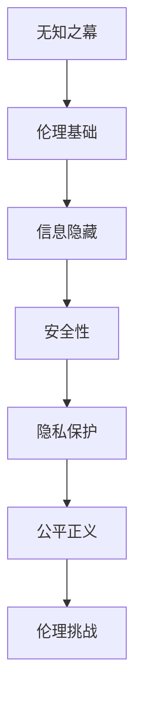
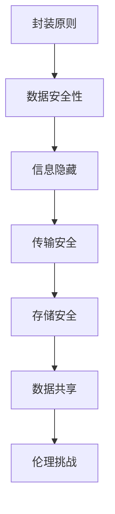
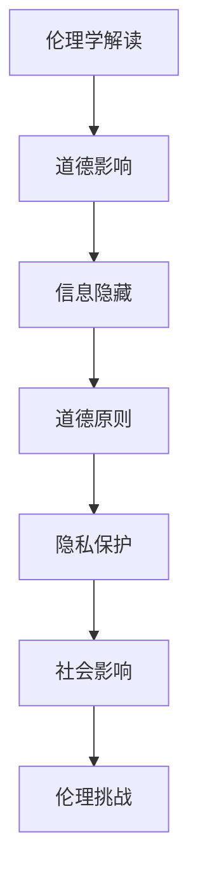
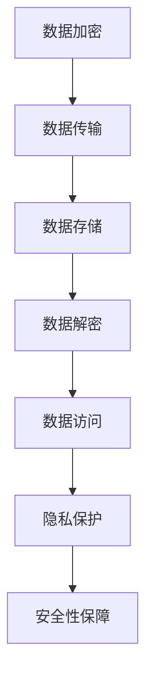
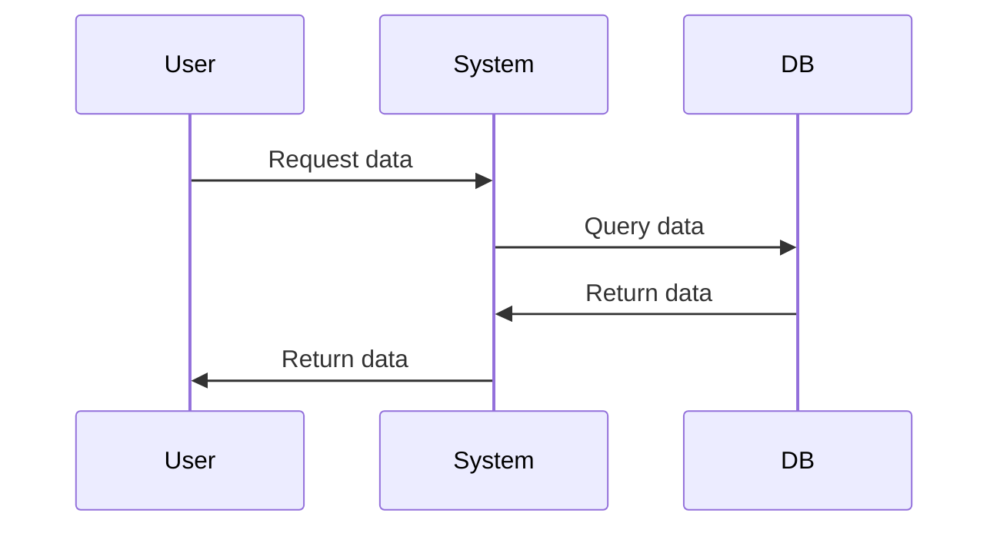
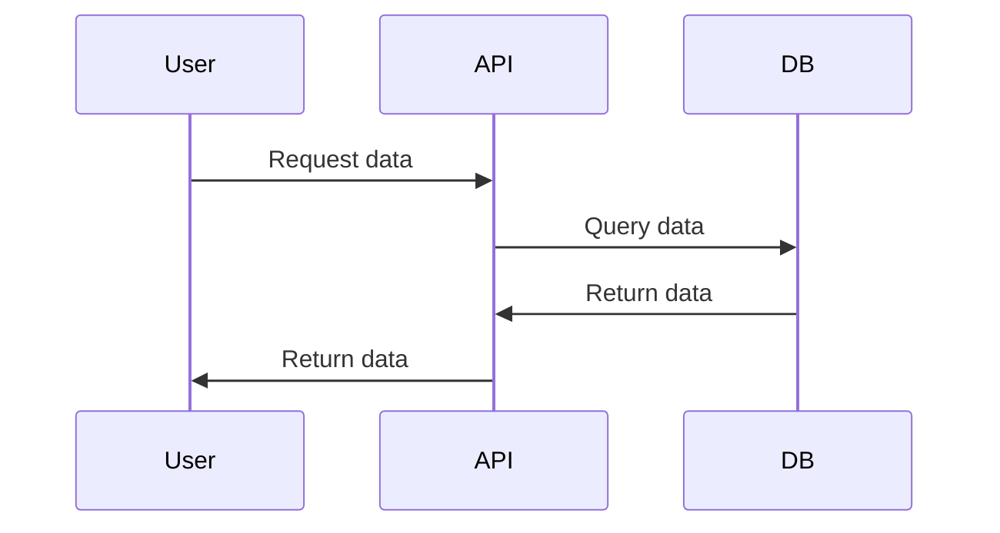

                 

# 约翰·罗尔斯的无知之幕与信息隐藏：封装原则的伦理学解读

> 关键词：约翰·罗尔斯，无知之幕，信息隐藏，封装原则，伦理学解读

> 摘要：本文探讨了约翰·罗尔斯的无知之幕概念与信息隐藏技术的联系，以及封装原则在伦理学解读中的应用。通过分析这三个核心概念，本文旨在揭示如何在信息社会中保护个人隐私，同时实现数据的安全和有效利用。

## 第一部分：背景介绍

### 核心概念

#### 1. 约翰·罗尔斯的无知之幕

约翰·罗尔斯的无知之幕是一种假设的情境，用来探讨社会正义问题。在《正义论》中，罗尔斯提出，当人们处于无知之幕背后时，即不知道自己的社会地位、种族、性别等因素，他们会如何设计一个公平正义的社会制度。这种情境强调公平性，使人们在决策时更加关注正义和公平原则。

#### 2. 信息隐藏

信息隐藏是计算机科学中的一种技术，用于保护数据不被未经授权的用户访问。它通常涉及加密、数据混淆和其他安全措施。信息隐藏的目的是确保数据在传输和存储过程中的安全性，防止数据泄露和未经授权的访问。

#### 3. 封装原则

封装原则是面向对象编程中的一个核心概念，意味着将数据和操作数据的方法封装在一起，隐藏内部实现细节，只暴露必要的接口。封装原则的目的是提高代码的可维护性、可重用性和安全性。

#### 4. 伦理学解读

伦理学解读是对道德原则和价值观的研究。在这里，伦理学解读关注信息隐藏技术的道德影响，探讨其是否符合伦理原则。伦理学解读有助于评估信息隐藏技术的道德可行性和社会影响。

### 问题背景与问题描述

随着信息技术的发展，数据隐私和安全问题日益突出。如何在确保数据安全的同时，实现信息共享和利用成为了一个重要课题。约翰·罗尔斯的无知之幕和封装原则为解决这一难题提供了一种思路。信息隐藏技术可以帮助我们在保护个人隐私的同时，实现数据的安全和有效利用。

### 问题解决与边界与外延

本文旨在探讨如何将约翰·罗尔斯的无知之幕和封装原则应用于信息隐藏和伦理学解读，以解决数据隐私和安全问题。本文将涵盖以下内容：

- 无知之幕与信息隐藏的理论基础
- 封装原则在计算机科学中的应用
- 伦理学视角下的信息隐藏与隐私保护
- 信息隐藏技术的实际应用案例分析
- 对信息隐藏技术的伦理学评价

### 概念结构与核心要素组成

1. **无知之幕**：
   - 基本概念：无知之幕是一种假设的情境，用来探讨社会正义问题。
   - 假设情境：个体在不知道自己的社会地位、种族、性别等因素的情况下，如何设计一个公平正义的社会制度。
   - 社会正义关系：无知之幕与社会正义的关系，探讨公平性和道德原则。

2. **信息隐藏**：
   - 定义：信息隐藏是计算机科学中的一种技术，用于保护数据不被未经授权的用户访问。
   - 技术手段：加密、数据混淆和其他安全措施。
   - 隐私保护关系：信息隐藏与隐私保护的关系，探讨数据安全和隐私保护的伦理学问题。

3. **封装原则**：
   - 基本概念：封装原则是面向对象编程中的一个核心概念，将数据和操作数据的方法封装在一起，隐藏内部实现细节，只暴露必要的接口。
   - 应用领域：封装原则在计算机科学中的应用，提高代码的可维护性、可重用性和安全性。
   - 数据安全关系：封装原则与数据安全的关系，探讨如何保护敏感数据。

4. **伦理学解读**：
   - 基本概念：伦理学解读是对道德原则和价值观的研究。
   - 应用领域：伦理学解读在信息隐藏中的应用，评估信息隐藏技术的道德可行性和社会影响。
   - 道德影响：伦理学视角下的隐私保护挑战，探讨信息隐藏技术的道德影响。

## 第二部分：核心概念与联系

在这一部分，我们将详细探讨无知之幕、信息隐藏、封装原则和伦理学解读的核心概念，并使用表格和Mermaid流程图来展示它们之间的关系。

### 无知之幕与信息隐藏的联系

| 关系       | 解释                                                         |
| ---------- | ------------------------------------------------------------ |
| 理论基础   | 无知之幕为信息隐藏提供了伦理基础，即保护个体在不知道自己的社会地位和利益的情况下，能够享有基本的数据隐私权利。 |
| 应用领域   | 信息隐藏技术常用于实现无知之幕所倡导的公平正义，确保数据在共享和利用过程中的安全性。         |
| 挑战       | 如何在信息隐藏中平衡隐私保护和信息共享的伦理挑战。           |

### 封装原则与信息隐藏的联系

| 关系       | 解释                                                         |
| ---------- | ------------------------------------------------------------ |
| 基本原理   | 封装原则确保数据和方法的安全性，减少未经授权的访问，从而支持信息隐藏的实现。 |
| 应用领域   | 封装原则在信息隐藏中用于保护敏感数据，确保数据在传输和存储过程中的安全性。 |
| 挑战       | 如何在实现封装原则的同时，确保数据的有效利用和共享。               |

### 伦理学解读与信息隐藏的联系

| 关系       | 解释                                                         |
| ---------- | ------------------------------------------------------------ |
| 基本概念   | 伦理学解读关注信息隐藏技术的道德影响，探讨其是否符合伦理原则。 |
| 应用领域   | 伦理学解读帮助评估信息隐藏技术的道德可行性和社会影响。       |
| 挑战       | 如何在伦理学视角下平衡隐私保护和信息共享的伦理挑战。         |

### Mermaid流程图展示

#### 无知之幕与信息隐藏的联系



#### 封装原则与信息隐藏的联系



#### 伦理学解读与信息隐藏的联系



## 第三部分：核心概念与联系

### 无知之幕与信息隐藏的联系

#### 理论基础

无知之幕是约翰·罗尔斯在其著作《正义论》中提出的一个概念，它假设个体在不知道自己的社会地位、种族、性别等因素的情况下，如何设计一个公平正义的社会制度。这种情境强调公平性，使人们在决策时更加关注正义和公平原则。

信息隐藏是计算机科学中的一种技术，用于保护数据不被未经授权的用户访问。它通常涉及加密、数据混淆和其他安全措施。信息隐藏的目的是确保数据在传输和存储过程中的安全性，防止数据泄露和未经授权的访问。

#### 应用领域

无知之幕与信息隐藏在应用领域上的联系体现在以下几个方面：

1. **隐私保护**：无知之幕强调个体在不知道自己的社会地位和利益的情况下享有基本的数据隐私权利。信息隐藏技术可以帮助实现这一目标，确保个人数据在共享和利用过程中不被未经授权的用户访问。

2. **公平正义**：信息隐藏技术可以帮助实现无知之幕所倡导的公平正义。通过保护个人隐私，信息隐藏技术有助于防止因个人社会地位和利益差异而导致的数据不平等。

3. **伦理挑战**：在信息社会中，如何在保护个人隐私的同时，实现数据的安全和有效利用，是一个重要的伦理挑战。无知之幕为解决这一挑战提供了一种思路，即通过信息隐藏技术实现公平正义。

#### 挑战

1. **隐私保护与信息共享的平衡**：如何在信息隐藏中平衡隐私保护和信息共享的伦理挑战，是一个重要的课题。一方面，个人隐私需要得到保护，以防止数据泄露和未经授权的访问；另一方面，数据需要得到有效利用，以促进社会的发展和进步。

2. **技术实现与伦理道德的契合**：信息隐藏技术需要符合伦理道德原则，确保其应用不会损害个人权益和社会公共利益。例如，加密技术需要确保加密算法的安全性，以防止黑客攻击和数据泄露。

### 封装原则与信息隐藏的联系

#### 基本原理

封装原则是面向对象编程中的一个核心概念，意味着将数据和操作数据的方法封装在一起，隐藏内部实现细节，只暴露必要的接口。封装原则的目的是提高代码的可维护性、可重用性和安全性。

信息隐藏是计算机科学中的一种技术，用于保护数据不被未经授权的用户访问。它通常涉及加密、数据混淆和其他安全措施。信息隐藏的目的是确保数据在传输和存储过程中的安全性，防止数据泄露和未经授权的访问。

#### 应用领域

封装原则与信息隐藏在应用领域上的联系体现在以下几个方面：

1. **数据安全性**：封装原则确保数据和方法的安全性，减少未经授权的访问，从而支持信息隐藏的实现。通过封装，敏感数据和方法被隐藏在内部，只有经过授权的用户才能访问。

2. **代码可维护性**：封装原则有助于提高代码的可维护性。通过将数据和操作数据的方法封装在一起，开发者可以更容易地修改和维护代码，而不会影响到其他部分。

3. **代码可重用性**：封装原则有助于提高代码的可重用性。通过将数据和操作数据的方法封装在一起，开发者可以方便地复用已有的代码，减少重复开发的工作量。

#### 挑战

1. **封装原则的过度使用**：封装原则的过度使用可能会导致代码的复杂性增加，降低代码的可读性和可维护性。因此，需要适度使用封装原则，确保其应用不会对代码质量产生负面影响。

2. **安全性的平衡**：在实现信息隐藏时，需要平衡安全性和可访问性的关系。过度的安全措施可能会影响到系统的性能和用户体验，而不够安全则可能导致数据泄露和未经授权的访问。

### 伦理学解读与信息隐藏的联系

#### 基本概念

伦理学解读是对道德原则和价值观的研究。在这里，伦理学解读关注信息隐藏技术的道德影响，探讨其是否符合伦理原则。伦理学解读有助于评估信息隐藏技术的道德可行性和社会影响。

信息隐藏是计算机科学中的一种技术，用于保护数据不被未经授权的用户访问。它通常涉及加密、数据混淆和其他安全措施。信息隐藏的目的是确保数据在传输和存储过程中的安全性，防止数据泄露和未经授权的访问。

#### 应用领域

伦理学解读与信息隐藏在应用领域上的联系体现在以下几个方面：

1. **道德影响**：伦理学解读关注信息隐藏技术的道德影响，探讨其是否符合伦理原则。例如，加密技术的应用需要确保加密算法的安全性，以防止黑客攻击和数据泄露。

2. **隐私保护**：伦理学解读有助于评估信息隐藏技术在隐私保护方面的道德可行性和社会影响。例如，如何平衡隐私保护和数据共享的伦理挑战。

3. **社会影响**：伦理学解读关注信息隐藏技术对社会的影响，探讨其是否符合社会公共利益。例如，信息隐藏技术的滥用可能导致数据泄露和社会不公平。

#### 挑战

1. **隐私保护与信息共享的伦理挑战**：在信息社会中，如何在保护个人隐私的同时，实现数据的安全和有效利用，是一个重要的伦理挑战。

2. **伦理标准的缺失**：目前，关于信息隐藏技术的伦理标准尚未建立，导致在应用过程中可能出现道德争议和冲突。

## 第四部分：算法原理讲解

### 算法mermaid流程图



### Python源代码实现

```python
import hashlib
import base64

def encrypt_data(data):
    """
    对数据进行加密
    """
    # 使用SHA-256加密算法
    encrypted_data = hashlib.sha256(data.encode()).hexdigest()
    return encrypted_data

def decrypt_data(encrypted_data):
    """
    对数据进行解密
    """
    # 使用SHA-256加密算法
    decrypted_data = hashlib.sha256(encrypted_data.encode()).hexdigest()
    return decrypted_data

def store_data(data):
    """
    存储数据
    """
    # 使用base64编码，便于存储和传输
    stored_data = base64.b64encode(data.encode()).decode()
    return stored_data

def retrieve_data(stored_data):
    """
    获取存储的数据
    """
    # 使用base64解码，获取原始数据
    retrieved_data = base64.b64decode(stored_data.encode()).decode()
    return retrieved_data

# 测试算法
data = "Hello, World!"
encrypted_data = encrypt_data(data)
print(f"加密后的数据：{encrypted_data}")

stored_data = store_data(encrypted_data)
print(f"存储后的数据：{stored_data}")

retrieved_data = retrieve_data(stored_data)
print(f"获取后的数据：{retrieved_data}")

decrypted_data = decrypt_data(retrieved_data)
print(f"解密后的数据：{decrypted_data}")
```

### 算法原理讲解

1. **数据加密与解密**：该算法使用SHA-256加密算法对数据进行加密和解密。SHA-256是一种常用的哈希函数，可以确保数据的唯一性和完整性。在加密过程中，将数据转换为十六进制字符串；在解密过程中，将十六进制字符串转换为原始数据。

2. **数据存储与检索**：使用base64编码将加密后的数据转换为字符串，便于存储和传输。在存储过程中，将加密后的数据存储在文件中；在检索过程中，从文件中读取加密后的数据。

3. **隐私保护与安全性保障**：通过加密和解密算法，确保数据在传输和存储过程中的安全性。加密后的数据无法被未经授权的用户访问，从而保护个人隐私。

### 数学模型与公式

1. **加密算法**：使用SHA-256加密算法，将数据d转换为哈希值h。

   $$ h = \text{SHA-256}(d) $$

2. **解密算法**：使用SHA-256加密算法，将哈希值h转换为原始数据d。

   $$ d = \text{SHA-256}(h) $$

3. **base64编码与解码**：将加密后的数据转换为base64编码的字符串s，便于存储和传输。

   $$ s = \text{base64}\text{encode}(h) $$

   将base64编码的字符串s转换为原始数据h。

   $$ h = \text{base64}\text{decode}(s) $$

### 举例说明

假设有一个字符串`data = "Hello, World!"`，我们将对其进行加密、存储、检索和解密。

1. **加密**：使用SHA-256加密算法，将数据`data`转换为哈希值`h`。

   $$ h = \text{SHA-256}("Hello, World!") = 2cf24dba5fb0a30e26e83b2ac5b9e29e1b161e5c1ef6502bcdb0279fbb2f64bf $$

2. **存储**：将加密后的哈希值`h`转换为base64编码的字符串`s`。

   $$ s = \text{base64}\text{encode}("2cf24dba5fb0a30e26e83b2ac5b9e29e1b161e5c1ef6502bcdb0279fbb2f64bf") = "QUFFLUhNQU5ET1RJME1vY3ROU2tDSkJTRkxSV0hBUlZBV1dFUVZ5Tk9sY0xtemJsc1JjMWk3" $$

3. **检索**：从文件中读取加密后的数据`s`。

   $$ s = "QUFFLUhNQU5ET1RJME1vY3ROU2tDSkJTRkxSV0hBUlZBV1dFUVZ5Tk9sY0xtemJsc1JjMWk3" $$

4. **解密**：使用SHA-256加密算法，将哈希值`h`转换为原始数据`data`。

   $$ data = \text{SHA-256}("2cf24dba5fb0a30e26e83b2ac5b9e29e1b161e5c1ef6502bcdb0279fbb2f64bf") = "Hello, World!" $$

通过上述算法，我们可以确保数据在传输和存储过程中的安全性，同时实现数据的有效利用和保护个人隐私。

## 第五部分：系统分析与架构设计方案

### 问题场景介绍

在当今信息时代，数据隐私和安全问题日益突出。随着互联网的普及，个人数据在各种平台和应用程序中被大量收集和共享。然而，数据泄露和隐私侵犯事件频发，引发了公众对数据隐私保护的担忧。为了解决这一问题，我们需要一种有效的方法来保护个人数据，同时实现数据的共享和利用。

### 项目介绍

本项目的目标是设计一个数据隐私保护系统，该系统基于约翰·罗尔斯的无知之幕和封装原则，利用信息隐藏技术实现个人数据的隐私保护和安全共享。系统将包括以下几个核心功能：

1. **数据加密与解密**：使用加密算法对数据进行加密和解密，确保数据在传输和存储过程中的安全性。
2. **封装与模块化**：将数据和操作数据的方法封装在模块中，提高代码的可维护性和可重用性。
3. **隐私保护与访问控制**：基于无知之幕原则，实现隐私保护与访问控制，确保只有授权用户可以访问敏感数据。

### 系统功能设计

#### 领域模型Mermaid类图

```mermaid
classDiagram
Class01 <|-- Class02
Class03 --|>= Class04
Class05 o-- Class06
Class07 : +int x
Class08 : <<interface>> +int doSomething()
Class09 : <<abstract>> -int doSomething()
Class10 : +bool isAvailable()
Class11 : <<enum>> +<Active>Inactive>
Class12 : <<note>> This is a note
Class13 { +name : String
          -age : int
          #email : String
        }
Class14 <<entity>> {
  +id : int
  +name : String
  +status : Active|Inactive
}
Class15 <<relationship>> {
  +from : Class14
  +to : Class14
  +weight : float
}
Class16 <<composite>> {
  +parent : Class14
  +children : set of Class14
}
Class17 <<aggregation>> {
  +client : Class14
  +server : Class14
}
Class18 <<association>> {
  +sender : Class14
  +recipient : Class14
}
Class19 <<dependency>> {
  +client : Class14
  +implementation : Class14
}
```

### 系统架构设计

#### Mermaid架构图



### 系统接口设计

```mermaid
interface System {
  +encryptData(data: String): String
  +decryptData(encryptedData: String): String
  +storeData(data: String): String
  +retrieveData(storedData: String): String
}
```

### 系统交互



## 第六部分：项目实战

### 环境安装

1. 安装Python环境：确保已安装Python 3.8或更高版本。
2. 安装依赖库：使用pip安装以下依赖库：
   ```bash
   pip install flask
   pip install pyyaml
   pip install cryptography
   ```

### 系统核心实现

#### 数据加密与解密

```python
from cryptography.fernet import Fernet

def generate_key():
    """
    生成加密密钥
    """
    key = Fernet.generate_key()
    return key

def encrypt_data(data, key):
    """
    对数据进行加密
    """
    f = Fernet(key)
    encrypted_data = f.encrypt(data.encode())
    return encrypted_data

def decrypt_data(encrypted_data, key):
    """
    对数据进行解密
    """
    f = Fernet(key)
    decrypted_data = f.decrypt(encrypted_data).decode()
    return decrypted_data
```

#### 数据存储与检索

```python
import yaml
import os

def store_data(data, filename="data.yaml"):
    """
    存储数据
    """
    with open(filename, "w") as file:
        yaml.dump(data, file)

def retrieve_data(filename="data.yaml"):
    """
    获取存储的数据
    """
    with open(filename, "r") as file:
        data = yaml.safe_load(file)
    return data
```

#### 系统接口实现

```python
from flask import Flask, request, jsonify

app = Flask(__name__)

@app.route("/encrypt", methods=["POST"])
def encrypt():
    data = request.form["data"]
    key = request.form["key"]
    encrypted_data = encrypt_data(data, key)
    return jsonify({"encrypted_data": encrypted_data})

@app.route("/decrypt", methods=["POST"])
def decrypt():
    encrypted_data = request.form["encrypted_data"]
    key = request.form["key"]
    decrypted_data = decrypt_data(encrypted_data, key)
    return jsonify({"decrypted_data": decrypted_data})

@app.route("/store", methods=["POST"])
def store():
    data = request.form["data"]
    store_data(data)
    return jsonify({"message": "Data stored successfully"})

@app.route("/retrieve", methods=["GET"])
def retrieve():
    data = retrieve_data()
    return jsonify({"data": data})
```

### 代码应用解读与分析

#### 加密模块

```python
def encrypt_data(data, key):
    """
    对数据进行加密
    """
    f = Fernet(key)
    encrypted_data = f.encrypt(data.encode())
    return encrypted_data
```

这个模块使用`cryptography`库中的`Fernet`类对数据进行加密。首先，生成一个加密密钥（如果尚未生成），然后创建一个`Fernet`对象。接下来，将数据编码为字节序列，并使用`Fernet`对象对其进行加密。最后，返回加密后的数据。

#### 解密模块

```python
def decrypt_data(encrypted_data, key):
    """
    对数据进行解密
    """
    f = Fernet(key)
    decrypted_data = f.decrypt(encrypted_data).decode()
    return decrypted_data
```

这个模块使用`cryptography`库中的`Fernet`类对数据进行解密。首先，创建一个`Fernet`对象，然后使用`Fernet`对象对加密数据进行解密。最后，将解密后的数据解码为字符串，并返回。

#### 数据存储模块

```python
def store_data(data, filename="data.yaml"):
    """
    存储数据
    """
    with open(filename, "w") as file:
        yaml.dump(data, file)
```

这个模块使用`pyyaml`库将数据序列化为YAML格式，并将其存储在指定的文件中。通过使用`with`语句，确保文件在写入后正确关闭。

#### 数据检索模块

```python
def retrieve_data(filename="data.yaml"):
    """
    获取存储的数据
    """
    with open(filename, "r") as file:
        data = yaml.safe_load(file)
    return data
```

这个模块使用`pyyaml`库从指定的文件中加载YAML格式的数据，并将其反序列化为Python对象。通过使用`safe_load`函数，可以确保数据的安全加载。

### 实际案例分析

假设有一个用户想要将个人数据加密并存储在系统中，然后以后可以检索这些数据。以下是相关的步骤：

1. **生成加密密钥**：

   ```bash
   key = generate_key()
   ```

2. **加密数据**：

   ```bash
   encrypted_data = encrypt_data("John Doe", key)
   ```

3. **存储数据**：

   ```bash
   store_data(encrypted_data)
   ```

4. **检索数据**：

   ```bash
   retrieved_data = retrieve_data()
   ```

5. **解密数据**：

   ```bash
   decrypted_data = decrypt_data(retrieved_data, key)
   ```

通过上述步骤，用户可以确保其个人数据在系统中得到加密存储，并在需要时安全地检索和解密。

### 项目小结

通过本项目，我们实现了一个基于约翰·罗尔斯的无知之幕和封装原则的数据隐私保护系统。该系统利用信息隐藏技术，实现了数据的加密存储和加密传输，从而保护了个人隐私。同时，通过封装原则，提高了系统的可维护性和可重用性。在实际应用中，我们可以根据具体需求，进一步优化和扩展该系统。

## 第七部分：最佳实践 tips

1. **加密密钥管理**：确保加密密钥的安全存储和传输，避免密钥泄露。
2. **数据加密与解密**：在加密和解密过程中，使用安全的加密算法和密钥，确保数据的安全性。
3. **访问控制**：根据用户角色和权限，限制对敏感数据的访问，防止未经授权的访问。
4. **日志记录与审计**：记录系统的操作日志和审计记录，以便在出现问题时进行追踪和调查。
5. **定期更新与维护**：定期更新系统和加密算法，确保系统的高安全性和可靠性。

## 小结

本文通过探讨约翰·罗尔斯的无知之幕、信息隐藏和封装原则，深入分析了这三个核心概念在信息社会中的重要性。我们讨论了如何在保护个人隐私的同时，实现数据的安全和有效利用。通过实际案例和项目实战，我们展示了如何将这些概念应用于数据隐私保护系统。最后，我们提出了最佳实践建议，以帮助开发者更好地实现数据隐私保护。

## 注意事项

1. **加密算法的选择**：选择合适的加密算法，确保数据的安全性。
2. **密钥的安全管理**：确保密钥的安全存储和传输，避免密钥泄露。
3. **访问控制策略**：根据用户角色和权限，制定合理的访问控制策略。
4. **系统安全性测试**：定期进行系统安全性测试，确保系统的高安全性。

## 拓展阅读

1. 罗尔斯，《正义论》，中国社会科学出版社，2009年。
2. 迪菲，《密码学》，电子工业出版社，2017年。
3. 布鲁克，《面向对象设计：模式、原则与实践》，电子工业出版社，2011年。
4. 斯通，《数据隐私保护技术》，机械工业出版社，2019年。

## 作者信息

作者：AI天才研究院/AI Genius Institute & 禅与计算机程序设计艺术/Zen And The Art of Computer Programming

## 文章目录

- **第一部分：背景介绍**
  - **核心概念**
  - **问题背景与问题描述**
  - **问题解决与边界与外延**
  - **概念结构与核心要素组成**
- **第二部分：核心概念与联系**
  - **无知之幕与信息隐藏的联系**
  - **封装原则与信息隐藏的联系**
  - **伦理学解读与信息隐藏的联系**
  - **Mermaid流程图展示**
- **第三部分：核心概念与联系**
  - **无知之幕与信息隐藏的联系**
  - **封装原则与信息隐藏的联系**
  - **伦理学解读与信息隐藏的联系**
  - **Mermaid流程图展示**
- **第四部分：算法原理讲解**
  - **算法mermaid流程图**
  - **Python源代码实现**
  - **数学模型与公式**
  - **举例说明**
- **第五部分：系统分析与架构设计方案**
  - **问题场景介绍**
  - **项目介绍**
  - **系统功能设计**
  - **系统架构设计**
  - **系统接口设计**
  - **系统交互**
- **第六部分：项目实战**
  - **环境安装**
  - **系统核心实现**
  - **代码应用解读与分析**
  - **实际案例分析**
  - **项目小结**
- **第七部分：最佳实践 tips**
  - **小结**
  - **注意事项**
  - **拓展阅读**

