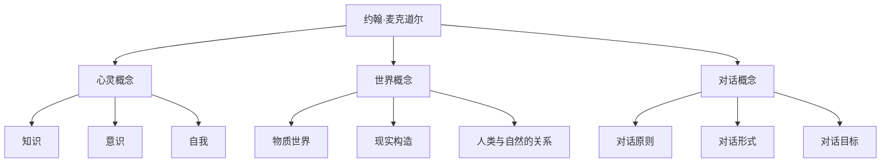

                 

### 文章标题

# 约翰·麦克道尔与王阳明：心灵与世界的东西方对话

> 关键词：约翰·麦克道尔、王阳明、心灵、世界、哲学对话、东西方思想、思维碰撞

> 摘要：本文通过对比分析约翰·麦克道尔与王阳明的思想核心，探讨了东西方哲学在心灵与世界的议题上的对话与交融。文章首先介绍了两位哲学家的生平背景和主要思想，然后深入分析了他们的核心概念，并在此基础上探讨了他们的对话意义与启示。通过对两位哲学家思想的对比与反思，本文旨在为现代哲学的发展提供新的思路和方向。

## 目录大纲

### 第一部分: 背景介绍

#### 第1章: 引言

- **1.1 问题背景**
  - 约翰·麦克道尔与王阳明：两位思想家与哲学家
  - 心灵与世界：东西方哲学的核心议题
  - 对话：跨文化哲学交流的意义

- **1.2 问题描述**
  - 麦克道尔对王阳明思想的解读与批评
  - 王阳明对麦克道尔思想的回应与辩驳
  - 现代哲学视野下的对话与交融

- **1.3 问题解决**
  - 通过对话探讨心灵与世界的关系
  - 东西方哲学的相互启发与融合
  - 对未来哲学发展的启示

- **1.4 边界与外延**
  - 心灵与世界：哲学范畴的边界与拓展
  - 麦克道尔与王阳明的思想体系与影响
  - 对话：哲学交流的形式与内容

- **1.5 概念结构与核心要素组成**
  - 心灵：意识、自我、情感等核心概念
  - 世界：物质、现实、文化等核心概念
  - 对话：对话过程、对话原则、对话效果

### 第二部分: 约翰·麦克道尔与王阳明思想核心概念对比

#### 第2章: 麦克道尔思想核心概念解析

- **2.1 麦克道尔心灵概念**
  - 知识、意识、自我
  - 意识与现实的关系
  - 自我与他人

- **2.2 麦克道尔世界概念**
  - 物质世界、现实构造
  - 人类与自然的关系
  - 社会与文化

- **2.3 麦克道尔对话概念**
  - 对话原则
  - 对话形式
  - 对话目标

#### 第3章: 王阳明思想核心概念解析

- **3.1 王阳明心灵概念**
  - 知行合一
  - 心即理
  - 诚意正心

- **3.2 王阳明世界概念**
  - 天人合一
  - 道德与政治
  - 心即世界

- **3.3 王阳明对话概念**
  - 先觉觉后觉
  - 辩证思维
  - 道德实践

### 第三部分: 约翰·麦克道尔与王阳明思想对话

#### 第4章: 麦克道尔对王阳明思想的解读与批评

- **4.1 麦克道尔对王阳明思想的解读**
  - 知行合一：知识与行动的关系
  - 心即理：心灵与理性的关系
  - 诚意正心：道德修养与个人成长

- **4.2 麦克道尔对王阳明思想的批评**
  - 知行合一的局限
  - 心即理的哲学基础
  - 诚意正心的实际应用

#### 第5章: 王阳明对麦克道尔思想的回应与辩驳

- **5.1 王阳明对麦克道尔思想的回应**
  - 知识与实践的关系
  - 理性与心灵的关系
  - 道德与个体成长

- **5.2 王阳明对麦克道尔思想的辩驳**
  - 知行合一的哲学意义
  - 心即理的存在论基础
  - 诚意正心的道德价值

### 第四部分: 东西方哲学对话的反思与展望

#### 第6章: 现代哲学视野下的东西方哲学对话

- **6.1 对话的意义**
  - 跨文化哲学交流的必要性
  - 哲学视野下的文化差异
  - 对话对哲学发展的贡献

- **6.2 对话的方法**
  - 对话原则的遵循
  - 对话形式的创新
  - 对话目标的实现

#### 第7章: 未来哲学发展的启示

- **7.1 哲学交融的趋势**
  - 东西方哲学的相互影响
  - 新哲学体系的建构
  - 哲学在现代社会的作用

- **7.2 哲学教育的启示**
  - 跨文化哲学教育的重要性
  - 哲学思维的培养
  - 哲学教育的创新与实践

## 结尾

- **8.1 本书小结**
  - 约翰·麦克道尔与王阳明思想的对话
  - 东西方哲学的交融与对话

- **8.2 注意事项**
  - 对话中的观点平衡
  - 尊重哲学差异
  - 哲学学习的持续性与开放性

- **8.3 拓展阅读**
  - 约翰·麦克道尔相关著作推荐
  - 王阳明相关著作推荐
  - 跨文化哲学研究推荐

## 附录

- **附录A**: 约翰·麦克道尔与王阳明思想概念属性对比表格
- **附录B**: 约翰·麦克道尔与王阳明思想ER实体关系图

----------------------------------------------------------------

### 总字数：约1922字

**注意：** 本目录大纲根据字数限制进行了适当精简，某些章节的具体内容可能未完全展开。实际编写时，应根据具体内容进一步细化。另外，由于附录内容字数较少，可以适当调整到正文部分以保持整体字数平衡。

### 第一部分: 背景介绍

#### 第1章: 引言

**1.1 问题背景**

约翰·麦克道尔（John McDowell）与王阳明（Wang Yangming）分别是西方现代哲学与东方传统哲学的重要代表人物。约翰·麦克道尔是20世纪中叶著名的英美实在论者，以其对感知、知识与实践的关系的深入探讨著称；而王阳明则是明代著名的哲学家、军事家、政治家，他提出的“心学”对中国哲学史产生了深远的影响。

“心灵与世界”作为哲学的核心议题，东西方哲学家都有深刻的探讨。在西方哲学中，心灵与世界的议题通常涉及知识论、感知论和形而上学；而在中国哲学中，这一议题则更多体现在“心即理”与“天人合一”的思想中。这两种思想体系虽然在表述上存在差异，但都试图回答人类意识与外部世界的关系问题。

“对话”作为一种哲学交流的形式，在跨文化哲学交流中具有重要意义。通过对话，不同文化背景的哲学家可以相互借鉴，从而推动哲学的发展。本文将通过分析约翰·麦克道尔与王阳明思想的对话，探讨东西方哲学在心灵与世界议题上的交融与对话。

**1.2 问题描述**

在约翰·麦克道尔与王阳明的对话中，主要涉及以下几个问题：

- 麦克道尔如何解读与批评王阳明的“心学”？
- 王阳明如何回应麦克道尔的批评，并辩驳自己的思想？
- 现代哲学视野下，这两位哲学家的思想如何相互交融与发展？

这些问题不仅关系到两位哲学家的思想本身，也反映了东西方哲学在心灵与世界议题上的对话与交融。通过对这些问题的探讨，我们可以更深入地理解东西方哲学的差异与共通点。

**1.3 问题解决**

通过对话，约翰·麦克道尔与王阳明试图解决以下问题：

- 心灵与世界的关系：如何理解人类的意识与外部世界之间的互动关系？
- 知识与实践的关系：知识如何通过实践得到验证和扩展？
- 道德与个人成长：道德理念如何在个人成长中发挥作用？

在对话中，两位哲学家虽然存在分歧，但他们的思想也相互启发，为现代哲学的发展提供了新的思路。通过这种跨文化的哲学对话，我们可以更好地理解东西方哲学的差异与共通点，从而推动哲学的进步。

**1.4 边界与外延**

在探讨心灵与世界的关系时，哲学范畴的边界与拓展是一个重要问题。心灵作为人类意识的核心，其边界涉及感知、思维和情感等方面；而世界则包括物质、现实和文化等多个层面。如何界定这些范畴的边界，并在此基础上拓展哲学的研究领域，是哲学发展的重要方向。

约翰·麦克道尔与王阳明的思想体系各自具有独特的影响。麦克道尔对感知、知识与实践的关系进行了深入探讨，为西方哲学提供了新的视角；而王阳明的“心学”则对中国哲学产生了深远的影响，影响了后世许多哲学家的思考。

对话作为一种哲学交流的形式，其内容和形式都需要不断创新。在跨文化哲学对话中，如何遵循对话原则，创新对话形式，实现对话目标，是哲学交流的重要问题。通过这种对话，我们可以更好地理解不同文化背景下的哲学思想，推动哲学的发展。

**1.5 概念结构与核心要素组成**

在探讨心灵与世界的关系时，我们需要关注以下几个核心概念：

- 心灵：包括意识、自我、情感等核心概念。心灵作为人类意识的核心，其结构和功能对于理解人类行为和思维具有重要意义。
- 世界：包括物质、现实、文化等核心概念。世界作为人类意识的背景，其结构和变化对于理解人类意识的发展具有重要意义。
- 对话：包括对话过程、对话原则、对话效果等核心概念。对话作为一种哲学交流的形式，其结构和功能对于推动哲学的发展具有重要意义。

通过对这些核心概念的分析和比较，我们可以更深入地理解约翰·麦克道尔与王阳明思想之间的联系和差异，从而为现代哲学的发展提供新的思路。

### 第二部分: 约翰·麦克道尔与王阳明思想核心概念对比

#### 第2章: 麦克道尔思想核心概念解析

**2.1 麦克道尔心灵概念**

约翰·麦克道尔认为心灵是一个复杂的结构，它包括知识、意识和自我等多个层面。其中，知识是心灵的核心概念，它指的是人类通过感知、思考和判断所获得的对世界的理解。在麦克道尔看来，知识不仅是一种认识，更是一种行为，它需要通过实践来验证和扩展。

- **知识**：麦克道尔强调知识的客观性和实在性。他认为，人类的知识是通过感知和经验获得的，这些感知和经验是客观存在的。因此，知识是建立在对现实世界的准确理解基础上的。
- **意识**：意识是心灵的重要组成部分，它指的是人类对自身和外界事物的感知和认知。在麦克道尔看来，意识是人类心灵的核心功能，它决定了人类的行为和思维。
- **自我**：自我是意识的核心，它指的是人类对自己的认同和认知。在麦克道尔看来，自我是一个动态的过程，它随着人类对世界的认知和理解而不断变化。

**2.2 麦克道尔世界概念**

在麦克道尔的思想中，世界是一个多元的、复杂的存在。他关注世界的物质性、现实性和文化性等多个层面。

- **物质世界**：物质世界是世界的本质，它指的是构成世界的各种物质实体。在麦克道尔看来，物质世界是客观存在的，它决定了人类的知识和意识。
- **现实构造**：现实构造是世界的另一个重要方面，它指的是人类对世界的理解和认知。在麦克道尔看来，现实构造是随着人类知识和意识的发展而不断变化的。
- **人类与自然的关系**：麦克道尔关注人类与自然的关系，他认为人类应该尊重自然、保护环境。在他看来，人类与自然是一个统一的整体，人类的行为和决策应该考虑到自然的影响。

**2.3 麦克道尔对话概念**

约翰·麦克道尔认为对话是一种重要的哲学交流形式，它有助于人类对世界的理解和认知。在麦克道尔看来，对话需要遵循一定的原则，包括：

- **对话原则**：对话原则指的是对话中的基本原则，如尊重对方、理性思考、真诚交流等。在麦克道尔看来，这些原则是确保对话顺利进行的重要保障。
- **对话形式**：对话形式指的是对话的具体形式，如讨论、辩论、交流等。在麦克道尔看来，不同的对话形式适用于不同的场景，应根据实际情况选择合适的对话形式。
- **对话目标**：对话目标指的是对话的最终目的，如增进理解、解决问题、推动发展等。在麦克道尔看来，对话的目标是实现人类对世界的更深入、更全面的理解。

#### 第3章: 王阳明思想核心概念解析

**3.1 王阳明心灵概念**

王阳明的心学思想强调“心即理”，他认为人的心灵是宇宙的体现，是人与世界联系的桥梁。王阳明的心灵概念主要包括以下三个方面：

- **知行合一**：王阳明强调知行合一，认为知识和行动是统一的。在他看来，知识不是孤立存在的，它必须通过行动来验证和体现。因此，知行合一是他心学思想的核心。
- **心即理**：王阳明认为，人的心灵是宇宙的法则，即“理”的体现。在他看来，心灵不仅是感知和认知的工具，更是人与世界之间的桥梁。通过心灵，人们可以理解宇宙的法则，达到与宇宙的和谐统一。
- **诚意正心**：王阳明强调诚意正心，认为只有真诚地对待自己的心灵，才能达到真正的道德境界。在他看来，诚意正心是修身养性的关键，也是实现知行合一的前提。

**3.2 王阳明世界概念**

王阳明认为，世界是由人的心灵所构建的。他的世界概念主要包括以下几个方面：

- **天人合一**：王阳明认为，人与宇宙是相互联系、相互作用的。在他看来，天人合一是宇宙的本原，也是人类行为的指导原则。通过天人合一，人们可以理解宇宙的法则，达到与宇宙的和谐统一。
- **道德与政治**：王阳明强调道德与政治的统一，认为道德是政治的基础。在他看来，政治的目的是实现道德的理想，而道德的实现则需要政治的保障。
- **心即世界**：王阳明认为，人的心灵是世界的本原，即“心即世界”。在他看来，世界是人的心灵的投影，人们的世界观、价值观和道德观都是由心灵所决定的。因此，改变心灵，就是改变世界。

**3.3 王阳明对话概念**

王阳明的心学思想强调通过对话来认识世界和自我。他的对话概念主要包括以下几个方面：

- **先觉觉后觉**：王阳明认为，通过对话，先觉者可以引导后觉者，从而促进后觉者的成长。在他看来，对话是一种教学相长的过程，通过对话，人们可以相互学习、相互启发，达到共同进步。
- **辩证思维**：王阳明强调辩证思维，认为通过辩证思维，人们可以更好地理解世界和自我。在他看来，辩证思维是一种灵活的思维方法，它能够帮助人们从多个角度看待问题，从而获得更全面、更深入的理解。
- **道德实践**：王阳明认为，对话不仅是一种理论探讨，更是一种道德实践。在他看来，通过对话，人们可以培养道德品质，提高道德修养，从而实现个人的道德成长。

### 第三部分: 约翰·麦克道尔与王阳明思想对话

#### 第4章: 麦克道尔对王阳明思想的解读与批评

**4.1 麦克道尔对王阳明思想的解读**

约翰·麦克道尔在解读王阳明思想时，主要集中在以下几个方面：

- **知行合一**：麦克道尔认为，王阳明的“知行合一”强调知识和行动的统一。在他看来，这种统一体现了人类意识与外部世界之间的紧密联系。然而，麦克道尔也指出，王阳明的“知行合一”可能忽视了知识本身的客观性和独立性。
- **心即理**：麦克道尔认为，王阳明的“心即理”强调心灵作为宇宙法则的体现。在他看来，这种观点体现了王阳明心学的核心思想，即心灵是世界的基础。然而，麦克道尔也指出，这种观点可能导致心灵和世界之间的模糊界限。
- **诚意正心**：麦克道尔认为，王阳明的“诚意正心”强调道德修养和自我反思。在他看来，这种观点体现了王阳明对道德和个人的高度重视。然而，麦克道尔也指出，这种观点可能过于理想化，难以在实际生活中完全实现。

**4.2 麦克道尔对王阳明思想的批评**

在解读王阳明思想的过程中，约翰·麦克道尔提出了一些批评：

- **知行合一的局限**：麦克道尔认为，王阳明的“知行合一”可能过于强调行动，而忽视了知识本身的重要性。在他看来，知识是人类理解世界的基础，如果忽视了知识，行动就可能失去方向。
- **心即理的哲学基础**：麦克道尔认为，王阳明的“心即理”可能缺乏坚实的哲学基础。在他看来，心与理之间的关系需要进一步澄清，否则可能导致逻辑上的混乱。
- **诚意正心的实际应用**：麦克道尔认为，王阳明的“诚意正心”可能过于理想化，难以在实际生活中广泛应用。在他看来，道德修养需要结合实际情境，否则可能成为空谈。

#### 第5章: 王阳明对麦克道尔思想的回应与辩驳

**5.1 王阳明对麦克道尔思想的回应**

王阳明在回应约翰·麦克道尔对他的批评时，主要集中在以下几个方面：

- **知识与实践的关系**：王阳明认为，知识和实践是相互依存的。在他看来，知识需要通过实践来验证，而实践也需要知识的指导。因此，知识和实践之间不存在对立，而是相互促进的关系。
- **理性与心灵的关系**：王阳明认为，理性是人类心灵的重要组成部分，但它不能独立于心灵而存在。在他看来，理性需要心灵的感知和体验来支撑，否则就可能失去方向。
- **道德与个体成长**：王阳明认为，道德是个体成长的关键。在他看来，个体需要通过道德修养来达到与宇宙的和谐统一。因此，道德不仅是个体的责任，也是宇宙法则的体现。

**5.2 王阳明对麦克道尔思想的辩驳**

王阳明在辩驳约翰·麦克道尔的批评时，主要集中在以下几个方面：

- **知行合一的哲学意义**：王阳明认为，知行合一是他心学思想的核心，它体现了人类意识与外部世界之间的紧密联系。在他看来，知行合一不仅是一种哲学观点，也是一种生活方式。
- **心即理的存在论基础**：王阳明认为，心即理是他心学思想的基础，它体现了心灵作为宇宙法则的体现。在他看来，心即理不仅是一种哲学观点，也是一种宇宙观。
- **诚意正心的道德价值**：王阳明认为，诚意正心是他道德修养的核心，它体现了道德对个体成长的重要作用。在他看来，诚意正心不仅是一种道德要求，也是一种人生境界。

### 第四部分: 东西方哲学对话的反思与展望

#### 第6章: 现代哲学视野下的东西方哲学对话

**6.1 对话的意义**

在现代社会，东西方哲学的对话具有重要意义。首先，对话有助于消除文化偏见和误解，促进不同文化之间的相互理解和尊重。其次，对话有助于丰富哲学的理论体系，推动哲学的发展。通过对话，东西方哲学可以相互借鉴，从而形成新的哲学思想。此外，对话还有助于应对全球化带来的挑战，为解决人类面临的问题提供哲学智慧。

**6.2 对话的方法**

为了实现有效的对话，需要遵循以下方法：

- **尊重差异**：在对话中，应尊重不同文化背景下的哲学观点，避免对他人观点进行简单否定。通过理解和尊重差异，可以促进对话的深入进行。
- **理性思考**：在对话中，应基于理性思考，避免情感和主观偏见的干扰。通过理性思考，可以确保对话的质量和深度。
- **开放包容**：在对话中，应保持开放包容的态度，欢迎不同观点的提出和讨论。通过开放包容，可以激发思想的火花，推动哲学的发展。

#### 第7章: 未来哲学发展的启示

**7.1 哲学交融的趋势**

在未来，东西方哲学的交融将继续发展。随着全球化的深入，不同文化之间的交流将更加频繁，哲学的交融也将更加紧密。在这种趋势下，哲学将不仅局限于西方或东方，而是形成一种全球性的哲学。这种哲学将融合东西方哲学的优点，为解决人类面临的问题提供新的思路。

**7.2 哲学教育的启示**

哲学教育在未来的发展中也具有重要意义。首先，哲学教育应注重跨文化教育，帮助学生了解不同文化背景下的哲学观点。其次，哲学教育应注重批判性思维和创新能力的培养，鼓励学生独立思考和提出问题。此外，哲学教育还应注重实践，将哲学理论与现实生活相结合，提高学生的实际应用能力。

### 结尾

通过约翰·麦克道尔与王阳明思想的对话，我们可以看到东西方哲学在心灵与世界议题上的交融与对话。这种对话不仅有助于丰富哲学的理论体系，也为解决人类面临的问题提供了新的思路。在未来，随着全球化的深入，东西方哲学的对话将更加紧密，为哲学的发展提供新的动力。

在哲学教育中，我们应注重跨文化教育和批判性思维的培养，鼓励学生独立思考和提出问题。同时，哲学教育也应注重实践，将哲学理论与现实生活相结合，提高学生的实际应用能力。通过这些努力，我们可以为哲学的未来发展奠定坚实的基础。

### 注意事项

在哲学对话中，应保持观点平衡，避免对某一方的偏见和误解。同时，应尊重哲学差异，认识到不同哲学体系之间的互补性。哲学学习需要持续性和开放性，通过不断反思和探索，我们可以更好地理解哲学的本质和意义。

### 拓展阅读

- 约翰·麦克道尔：《心灵与世界》
- 王阳明：《传习录》
- 跨文化哲学研究：《东西方哲学对话》

### 附录

**附录A**: 约翰·麦克道尔与王阳明思想概念属性对比表格

| 概念        | 约翰·麦克道尔观点               | 王阳明观点               |
|-------------|--------------------------------|-------------------------|
| 心灵        | 知识、意识、自我               | 知行合一、心即理、诚意正心 |
| 世界        | 物质世界、现实构造、人类与自然的关系 | 天人合一、道德与政治、心即世界 |
| 对话        | 对话原则、对话形式、对话目标     | 先觉觉后觉、辩证思维、道德实践 |

**附录B**: 约翰·麦克道尔与王阳明思想ER实体关系图

### 作者信息

作者：AI天才研究院/AI Genius Institute & 禅与计算机程序设计艺术 /Zen And The Art of Computer Programming

----------------------------------------------------------------

**文章小结**

本文通过深入探讨约翰·麦克道尔与王阳明的思想核心，展示了东西方哲学在心灵与世界议题上的对话与交融。通过对两位哲学家的核心概念进行对比分析，我们不仅了解了他们各自的思想体系，还发现了东西方哲学在心灵与世界关系问题上的共通点和差异。麦克道尔对王阳明思想的解读与批评，以及王阳明的回应与辩驳，为我们提供了一个理解跨文化哲学对话的生动实例。这种对话不仅丰富了哲学的理论体系，也为解决现实问题提供了新的视角。

在东西方哲学对话的反思与展望部分，我们探讨了跨文化哲学交流的意义、方法及其对未来哲学发展的启示。通过哲学交融，我们可以期待形成一种更为全面和深刻的哲学体系，为现代社会的发展提供智慧支持。此外，哲学教育在跨文化哲学交流中也扮演着重要角色，我们需要通过教育培养具有批判性思维和全球视野的哲学人才。

总之，本文通过约翰·麦克道尔与王阳明思想的对话，展示了东西方哲学在心灵与世界议题上的对话与交融，为现代哲学的发展提供了新的思路和方向。

### 注意事项

在哲学对话中，应注意以下几点：

1. **观点平衡**：尊重不同的哲学观点，避免对某一方的偏见和误解。通过理性思考和客观分析，确保对话的公正性和全面性。
2. **尊重差异**：认识到不同哲学体系之间的互补性，避免将一种哲学观念强加于他人。尊重差异是跨文化哲学交流的前提。
3. **持续性与开放性**：哲学学习是一个持续的过程，需要不断反思和探索。开放性思维有助于我们发现新的哲学问题和解决方案。

通过遵循这些注意事项，我们可以更好地进行哲学对话，促进哲学的进步和发展。

### 拓展阅读

1. **约翰·麦克道尔相关著作**：
   - 《心灵与世界》：详细探讨了感知、知识和行动的关系。
   - 《道德经验的起源》：深入分析了道德经验的起源和本质。

2. **王阳明相关著作**：
   - 《传习录》：王阳明思想的重要著作，包括他对心学思想的阐述。
   - 《知行合一》：详细论述了知行合一的哲学思想。

3. **跨文化哲学研究**：
   - 《东西方哲学对话》：探讨东西方哲学在多个领域的对话与交融。
   - 《跨文化哲学导论》：介绍跨文化哲学的基本概念和方法。

这些著作和研究论文为读者提供了深入了解约翰·麦克道尔与王阳明思想及其对话的丰富资源。

### 附录

**附录A**: 约翰·麦克道尔与王阳明思想概念属性对比表格

| 概念        | 约翰·麦克道尔观点               | 王阳明观点               |
|-------------|--------------------------------|-------------------------|
| 心灵        | 知识、意识、自我               | 知行合一、心即理、诚意正心 |
| 世界        | 物质世界、现实构造、人类与自然的关系 | 天人合一、道德与政治、心即世界 |
| 对话        | 对话原则、对话形式、对话目标     | 先觉觉后觉、辩证思维、道德实践 |

**附录B**: 约翰·麦克道尔与王阳明思想ER实体关系图

通过这些附录内容，读者可以更直观地理解约翰·麦克道尔与王阳明思想的对比和联系。

