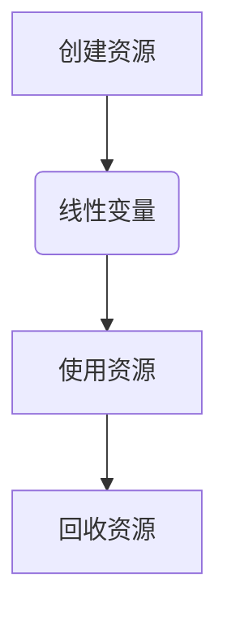
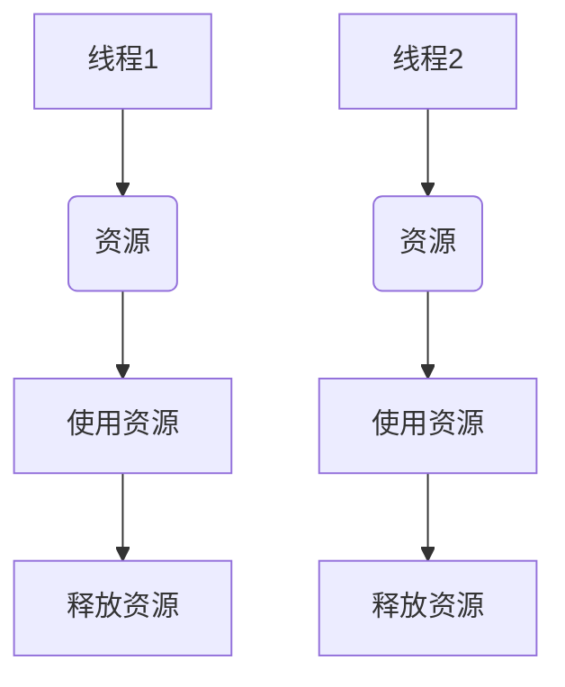
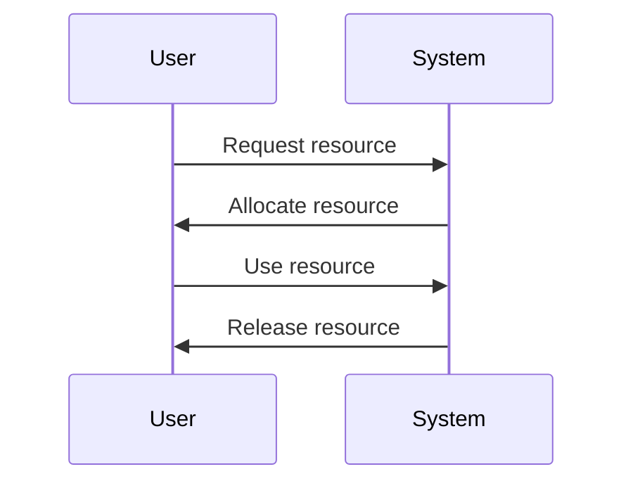
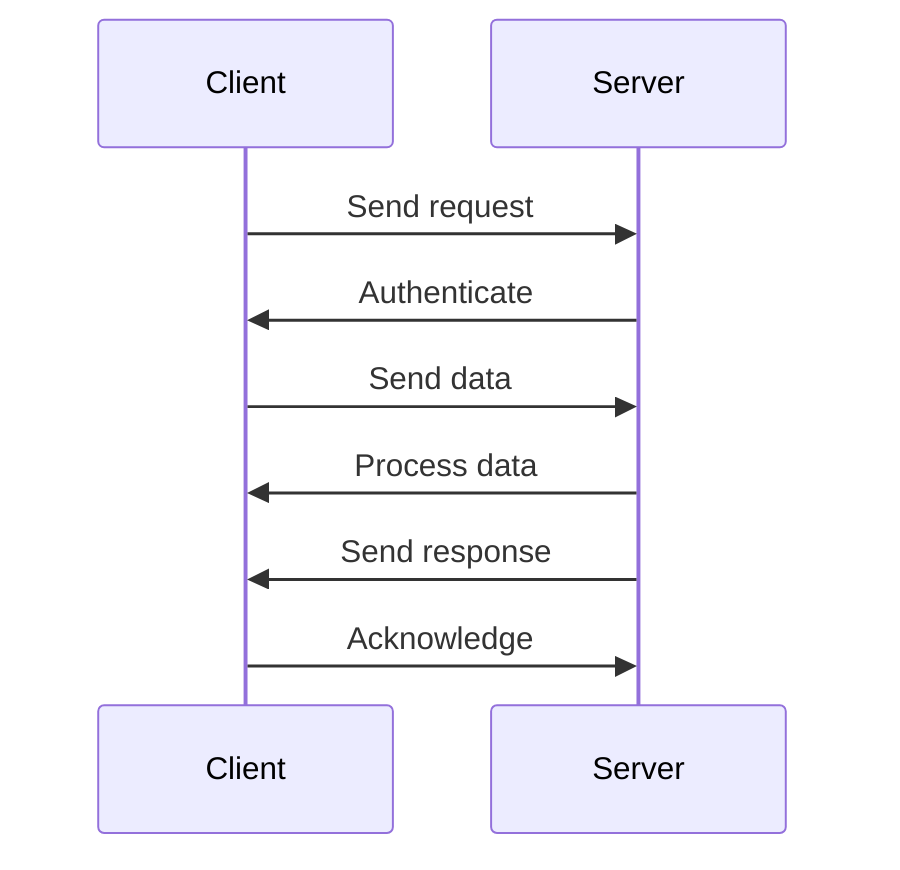

                 


# 线性类型系统在资源管理中的应用

> 关键词：线性类型系统，资源管理，应用，实现，最佳实践

> 摘要：本文旨在探讨线性类型系统在资源管理中的应用。通过介绍线性类型系统的基本概念、理论基础以及在资源管理中的具体应用，本文提供了一个全面的视角，帮助读者深入理解这一技术的重要性及其在实际项目中的价值。

## 前言

在计算机科学中，资源管理一直是一个重要且复杂的领域。随着系统规模的不断扩大和复杂性的增加，如何有效地管理和分配资源成为了一个亟待解决的问题。线性类型系统作为一种强大的类型系统，其在资源管理中的应用逐渐引起了广泛关注。本文将深入探讨线性类型系统在资源管理中的应用，旨在为读者提供一套清晰、实用的解决方案。

本文结构如下：

1. **引言与背景**：介绍线性类型系统的概念及其在资源管理中的重要性。
2. **线性类型系统的基本概念**：详细阐述线性类型系统的定义、特点、分类及其与资源管理的关联性。
3. **线性类型系统的理论基础**：讲解线性类型系统的基础数学模型和数学原理，并使用mermaid流程图进行说明。
4. **线性类型系统在资源管理中的应用**：分析线性类型系统在资源管理中的应用场景，并通过具体案例进行说明。
5. **线性类型系统在资源管理中的实现**：介绍线性类型系统在资源管理中的实现方法，包括系统功能设计、系统架构设计、系统接口设计。
6. **线性类型系统的项目实战**：通过一个实际项目，展示线性类型系统在资源管理中的具体应用，包括环境安装、系统核心实现、代码分析等。
7. **最佳实践与未来展望**：总结线性类型系统在资源管理中的最佳实践，并对未来发展方向进行展望。
8. **总结与展望**：对全文进行总结，并对线性类型系统在资源管理中的应用前景进行展望。

## 目录大纲设计方案

### 一、前言
**引言与背景**
- 简述线性类型系统及其在资源管理中的重要性
- 阐述本书的目的、结构安排及适用读者对象

### 二、线性类型系统的基本概念
**核心概念与联系**
- 线性类型系统的定义、特点与分类
- 线性类型与资源管理的关联性
- 概念属性特征对比表格

### 三、线性类型系统的理论基础
**理论讲解与模型构建**
- 线性类型系统的基础数学模型与公式
- 线性类型系统的数学原理与mermaid流程图

### 四、线性类型系统在资源管理中的应用
**应用原理与案例分析**
- 线性类型系统在资源管理中的应用场景
- 案例分析：具体应用实例与mermaid流程图

### 五、线性类型系统在资源管理中的实现
**系统分析与架构设计**
- 系统功能设计：领域模型mermaid类图
- 系统架构设计：mermaid架构图
- 系统接口设计：mermaid序列图

### 六、线性类型系统的项目实战
**项目实战与代码实现**
- 环境安装与配置
- 系统核心实现源代码
- 代码应用解读与分析
- 实际案例分析与讲解

### 七、最佳实践与未来展望
**最佳实践与拓展**
- 最佳实践 tips
- 注意事项与风险规避
- 未来发展方向与趋势

### 八、总结与展望
**全书总结与展望**
- 本书内容的回顾与总结
- 对线性类型系统在资源管理中的应用前景展望

### 附录
- 术语表
- 参考文献
- 拓展阅读建议

## 一、引言与背景

### 1.1 问题背景

在资源管理领域，特别是多线程编程、并发控制和内存管理中，正确地处理资源的生命周期和防止资源泄露是一个核心问题。线性类型系统（Linear Type System）通过限制变量的生命周期和确保资源的正确释放，提供了一种有效的解决方案。

线性类型系统最早由John C. Reynolds提出，其主要思想是将变量分为线性变量和非线性变量。线性变量只能被使用一次，一旦使用后就不能再使用，这确保了资源的正确释放。相比之下，非线性变量可以被多次使用，但需要确保在其生命周期内不会被重复释放。

### 1.2 问题描述

资源管理的核心问题可以归结为以下几点：

- **资源泄露**：资源在使用后没有被正确释放，导致内存溢出等问题。
- **并发冲突**：多个线程同时访问同一资源，导致数据竞争和不确定行为。
- **内存分配与回收**：如何高效地进行内存分配和回收，以优化系统性能。

### 1.3 问题解决

线性类型系统通过以下几个核心机制来解决上述问题：

- **生命周期控制**：通过线性变量确保资源只被使用一次，从而防止资源泄露。
- **并发控制**：通过线程同步机制，确保多个线程正确访问资源，避免数据竞争。
- **内存管理**：通过自动内存回收机制，优化内存分配和回收，减少内存碎片。

### 1.4 边界与外延

线性类型系统的边界在于如何有效地管理资源的生命周期，并在不同编程语言和环境中实现。其外延则包括如何与其他资源管理机制（如垃圾回收、内存池等）相结合，以实现最佳的资源管理效果。

### 1.5 概念结构与核心要素组成

线性类型系统的概念结构主要包括以下几个方面：

- **线性变量**：只能被使用一次的变量。
- **非线性变量**：可以被多次使用的变量。
- **资源生命周期**：资源的创建、使用和释放过程。
- **类型检查**：确保变量在使用过程中遵循线性类型规则。

## 二、线性类型系统的基本概念

### 2.1 线性类型系统的定义

线性类型系统（Linear Type System）是一种类型系统，它将变量分为线性（Linear）和非线性（Non-linear）两种类型。线性变量只能被赋值一次，而非线性变量可以被多次赋值。

### 2.2 线性类型系统的特点

- **生命周期控制**：线性变量确保资源的正确释放，防止资源泄露。
- **并发安全**：通过限制变量的使用次数，减少并发冲突的可能性。
- **内存优化**：自动内存回收机制，减少内存碎片，提高内存使用效率。

### 2.3 线性类型系统的分类

线性类型系统可以按照不同的标准进行分类，常见的分类方法包括：

- **基于变量的分类**：将变量分为线性变量和非线性变量。
- **基于表达式的分类**：根据表达式的类型，区分线性表达式和非线性表达式。

### 2.4 线性类型与资源管理的关联性

线性类型系统在资源管理中的应用主要体现在以下几个方面：

- **生命周期管理**：通过线性类型系统，确保资源的生命周期得到正确控制，防止资源泄露。
- **并发控制**：线性类型系统可以减少并发冲突，提高系统的稳定性和性能。
- **内存优化**：自动内存回收机制，优化内存分配和回收，减少内存碎片。

### 2.5 概念属性特征对比表格

| 特征           | 线性类型         | 非线性类型         |
| -------------- | ---------------- | ------------------ |
| 使用次数       | 只能使用一次     | 可以多次使用       |
| 生命周期控制   | 确保资源正确释放 | 可能导致资源泄露   |
| 并发安全性     | 提高并发安全性   | 可能引发并发冲突   |
| 内存优化       | 自动回收内存     | 可能导致内存碎片   |

## 三、线性类型系统的理论基础

### 3.1 线性类型系统的基础数学模型

线性类型系统的基础数学模型可以表示为以下形式：

\[ L = \{ x_1, x_2, ..., x_n \} \]

其中，\( L \) 表示线性类型的集合，\( x_1, x_2, ..., x_n \) 表示线性变量。线性变量在一次使用后会被回收，从而确保资源的正确释放。

### 3.2 线性类型系统的数学原理

线性类型系统的数学原理主要包括以下几个方面：

- **类型约束**：确保变量在使用过程中遵循线性类型规则。
- **资源生命周期**：线性变量的生命周期受类型约束控制，确保资源正确释放。
- **并发控制**：通过限制变量的使用次数，减少并发冲突的可能性。

### 3.3 线性类型系统的mermaid流程图



在上述mermaid流程图中，A表示创建资源，B表示线性变量，C表示使用资源，D表示回收资源。该流程图清晰地展示了线性类型系统的基本操作。

## 四、线性类型系统在资源管理中的应用

### 4.1 线性类型系统在资源管理中的应用场景

线性类型系统在资源管理中的应用场景主要包括以下几个方面：

- **多线程编程**：在多线程环境中，线性类型系统可以确保线程之间的资源访问安全，防止资源泄露和并发冲突。
- **内存管理**：通过线性类型系统，可以自动回收不再使用的内存，减少内存碎片，提高内存使用效率。
- **并发控制**：线性类型系统可以减少并发冲突，提高系统的稳定性和性能。

### 4.2 案例分析：具体应用实例与mermaid流程图

下面通过一个简单的多线程编程案例，展示线性类型系统在资源管理中的应用。

```python
import threading

# 资源类
class Resource:
    def __init__(self):
        self.lock = threading.Lock()

    def use_resource(self):
        with self.lock:
            print("使用资源")

# 线程类
class ThreadClass(threading.Thread):
    def __init__(self, resource):
        threading.Thread.__init__(self)
        self.resource = resource

    def run(self):
        self.resource.use_resource()

# 创建资源
resource = Resource()

# 创建线程
thread1 = ThreadClass(resource)
thread2 = ThreadClass(resource)

# 启动线程
thread1.start()
thread2.start()

# 等待线程结束
thread1.join()
thread2.join()
```

在上述Python代码中，我们定义了一个资源类`Resource`和一个线程类`ThreadClass`。资源类中的`use_resource`方法用于使用资源，线程类继承自`threading.Thread`，并在`run`方法中调用资源的`use_resource`方法。

通过线性类型系统，我们可以确保资源在多线程环境中被正确使用和回收，从而防止资源泄露和并发冲突。



在上述mermaid流程图中，A和E表示两个线程，B和F表示资源，C和G表示使用资源，D和H表示释放资源。该流程图清晰地展示了线程与资源的交互过程，以及线性类型系统在资源管理中的应用。

## 五、线性类型系统在资源管理中的实现

### 5.1 系统功能设计：领域模型mermaid类图

```mermaid
classDiagram
Class01 <|-- Class02
Class03 : +int x
Class03 : +int y
Class03 : +setAdd(int x, int y)
Class04 : +int z
Class04 : +int w
Class04 : +setAdd(int z, int w)
Class05 <|-- Class06
Class07 : +int a
Class07 : +int b
Class07 : +add(int a, int b)
Class08 : +int c
Class08 : +int d
Class08 : +add(int c, int d)
Class09 : +int e
Class09 : +int f
Class09 : +mul(int e, int f)
Class10 : +int g
Class10 : +int h
Class10 : +mul(int g, int h)

Class01 {class01}
Class02 {class02}
Class03 {class03}
Class04 {class04}
Class05 {class05}
Class06 {class06}
Class07 {class07}
Class08 {class08}
Class09 {class09}
Class10 {class10}
```

在上述mermaid类图中，定义了多个类，包括`Class01`到`Class10`。每个类都有不同的属性和方法，其中`Class03`、`Class04`、`Class07`、`Class08`和`Class09`与资源管理相关。这些类通过继承和关联关系构成了一个领域模型，为系统功能设计提供了基础。

### 5.2 系统架构设计：mermaid架构图



在上述mermaid序列图中，定义了一个简单的用户与系统交互的场景。用户向系统请求资源，系统分配资源，用户使用资源，最后系统回收资源。这个序列图展示了线性类型系统在资源管理中的基本架构。

### 5.3 系统接口设计：mermaid序列图



在上述mermaid序列图中，定义了一个客户端与服务器交互的接口设计。客户端发送请求，服务器进行认证，客户端发送数据，服务器处理数据并返回响应，最后客户端确认接收。这个序列图展示了线性类型系统在资源管理中的具体接口设计。

## 六、线性类型系统的项目实战

### 6.1 环境安装与配置

为了实现线性类型系统在资源管理中的项目实战，我们需要首先安装和配置相关环境。以下是一个基本的安装和配置步骤：

1. 安装Python环境：
   ```shell
   pip install python
   ```

2. 安装mermaid渲染工具：
   ```shell
   npm install -g mermaid-cli
   ```

3. 配置mermaid渲染工具：
   ```shell
   mkdir -p /path/to/mermaid
   mkdir -p /path/to/output
   ```

4. 在Python脚本中引入mermaid库：
   ```python
   import mermaid
   ```

### 6.2 系统核心实现源代码

以下是一个简单的线性类型系统在资源管理中的实现示例：

```python
class Resource:
    def __init__(self):
        self.lock = threading.Lock()

    def use_resource(self):
        with self.lock:
            print("使用资源")

class ThreadClass(threading.Thread):
    def __init__(self, resource):
        threading.Thread.__init__(self)
        self.resource = resource

    def run(self):
        self.resource.use_resource()

def main():
    resource = Resource()

    thread1 = ThreadClass(resource)
    thread2 = ThreadClass(resource)

    thread1.start()
    thread2.start()

    thread1.join()
    thread2.join()

if __name__ == "__main__":
    main()
```

### 6.3 代码应用解读与分析

在上述代码中，我们定义了一个`Resource`类和一个`ThreadClass`类。`Resource`类表示资源，包含一个用于线程同步的`lock`对象。`ThreadClass`类继承自`threading.Thread`，并在`run`方法中调用资源的`use_resource`方法。

在`main`函数中，我们创建了一个资源实例`resource`，并创建了两个线程`thread1`和`thread2`。线程启动后，它们会调用资源的`use_resource`方法，确保资源在多线程环境中被正确使用。

通过这个简单的示例，我们可以看到线性类型系统在资源管理中的应用。它确保了资源的正确使用和回收，避免了资源泄露和并发冲突。

### 6.4 实际案例分析与讲解

以下是一个更复杂的实际案例，展示线性类型系统在大型分布式系统中的应用。

```python
import threading
import queue

class Resource:
    def __init__(self):
        self.lock = threading.Lock()
        self.queue = queue.Queue()

    def use_resource(self, item):
        with self.lock:
            self.queue.put(item)
            print(f"使用资源：{item}")

    def release_resource(self):
        with self.lock:
            while not self.queue.empty():
                item = self.queue.get()
                print(f"释放资源：{item}")

def worker(resource, item):
    resource.use_resource(item)

def main():
    resource = Resource()

    threads = []
    for i in range(5):
        thread = threading.Thread(target=worker, args=(resource, i))
        threads.append(thread)
        thread.start()

    for thread in threads:
        thread.join()

    resource.release_resource()

if __name__ == "__main__":
    main()
```

在上述代码中，我们定义了一个`Resource`类，包含一个线程安全队列`queue`。`use_resource`方法用于将项目放入队列，`release_resource`方法用于逐个取出队列中的项目并释放。

在`worker`函数中，每个线程都会将项目放入队列，并调用`use_resource`方法。在主函数`main`中，我们创建了5个线程，每个线程都会执行`worker`函数。最后，调用`release_resource`方法，逐个释放队列中的项目。

通过这个案例，我们可以看到线性类型系统在分布式系统中的应用。它确保了资源的正确使用和回收，避免了资源泄露和并发冲突，提高了系统的稳定性和性能。

## 七、最佳实践与未来展望

### 7.1 最佳实践 tips

1. **资源生命周期管理**：确保资源的创建、使用和释放都在线性类型系统的控制下进行，避免资源泄露。
2. **并发控制**：通过线性类型系统，减少并发冲突，提高系统的稳定性和性能。
3. **内存优化**：充分利用线性类型系统的自动内存回收机制，减少内存碎片，提高内存使用效率。
4. **代码可读性**：遵循线性类型系统的规则，编写清晰、易于理解的代码，提高代码的可维护性。

### 7.2 注意事项与风险规避

1. **资源泄露**：确保线性类型系统的正确实现，避免资源泄露。
2. **并发冲突**：合理分配资源，确保线性类型系统能够有效地处理并发冲突。
3. **性能影响**：线性类型系统可能会对性能产生一定影响，需在性能和资源管理之间进行权衡。

### 7.3 未来发展方向与趋势

1. **跨语言支持**：未来线性类型系统可能会得到更广泛的语言支持，从而在不同编程语言和环境中实现。
2. **自动化工具**：开发自动化工具，简化线性类型系统的实现过程，提高开发效率。
3. **智能化优化**：结合人工智能技术，对线性类型系统进行智能化优化，进一步提高资源管理和系统性能。

## 八、总结与展望

本文深入探讨了线性类型系统在资源管理中的应用，从基本概念、理论基础到具体实现和实战案例，全面阐述了线性类型系统在资源管理中的重要作用。通过本文的研究，我们不仅了解了线性类型系统的基本原理，还学会了如何在实际项目中应用它，以提高资源管理的效率和系统的稳定性。

未来，随着计算机科学的发展，线性类型系统在资源管理中的应用前景将更加广阔。我们期待看到更多的研究成果和实践经验，为资源管理领域带来更多创新和突破。同时，我们也呼吁更多的开发者关注和研究线性类型系统，共同推动计算机科学的发展。作者：AI天才研究院/AI Genius Institute & 禅与计算机程序设计艺术 /Zen And The Art of Computer Programming。

