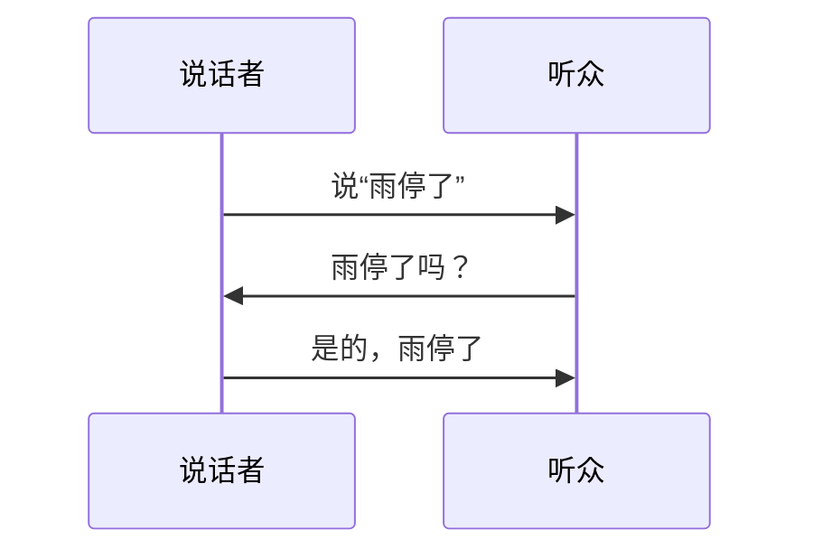
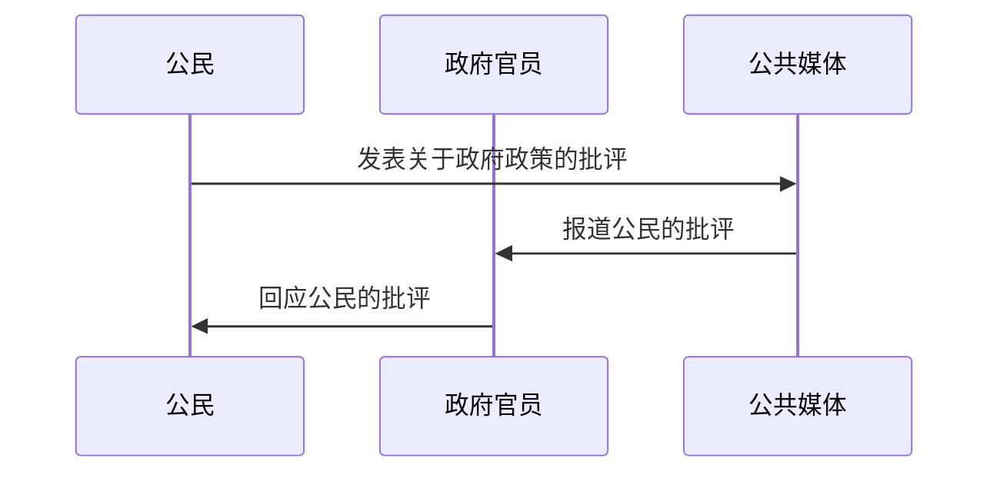
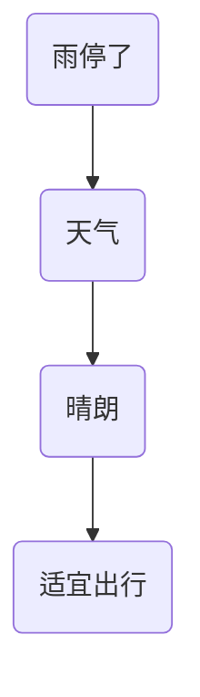
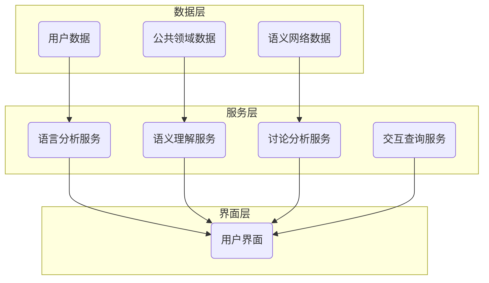
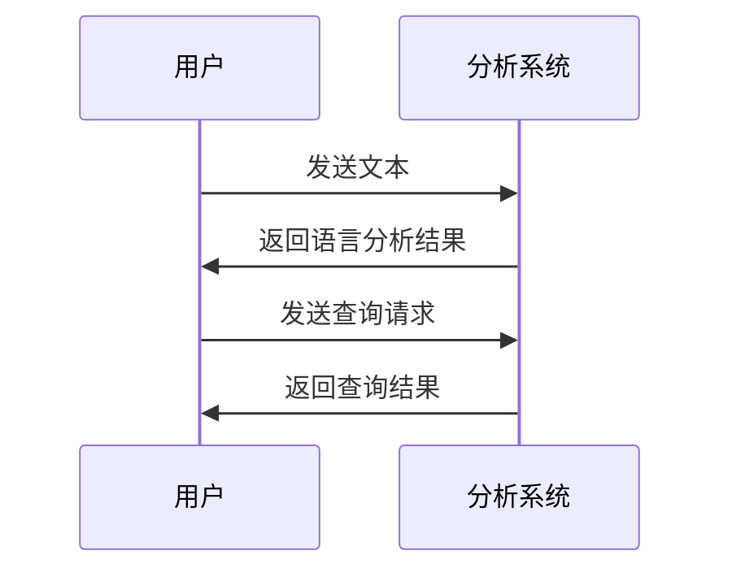

                 


# 维特根斯坦与哈贝马斯：公共领域的语言基础

> 关键词：维特根斯坦，哈贝马斯，公共领域，语言哲学，社会理论，语言游戏，意义理论，语义网络

> 摘要：
本篇文章深入探讨了维特根斯坦和哈贝马斯在语言和公共领域的理论贡献，分析了他们之间的联系与差异。通过梳理两位哲学家的核心概念和理论框架，我们试图揭示语言在公共领域中的基础作用，以及如何通过语言哲学和社会理论的视角来理解现代社会的公共领域。

## 第一部分：背景介绍

### 1.1 问题背景

**维特根斯坦与哈贝马斯：公共领域的语言基础**这本书为我们提供了一个独特的视角，来探讨两位哲学家维特根斯坦和哈贝马斯在语言与公共领域方面的理论贡献。维特根斯坦是20世纪最重要的哲学家之一，他的语言哲学思想深刻影响了西方哲学的发展。哈贝马斯则是当代德国哲学和社会理论家，他在批判理论和公共领域理论方面有着重要的贡献。

### 1.2 问题描述

本书试图回答以下问题：维特根斯坦的语言哲学如何为理解公共领域提供理论基础？哈贝马斯的公共领域理论如何反映了维特根斯坦的思想？两位哲学家的理论在当代社会中有着怎样的应用价值？

### 1.3 问题解决

通过深入分析维特根斯坦和哈贝马斯的理论，本书将揭示他们对于语言、意义和公共领域的独特见解，并探讨这些理论如何帮助我们更好地理解现代社会中的公共领域。

### 1.4 边界与外延

本书的讨论范围主要集中在这两位哲学家的思想，但也可能涉及到其他哲学家和理论家的相关观点，以提供更为全面的背景。

### 1.5 概念结构与核心要素组成

- **维特根斯坦的语言哲学**：包括语言游戏、语言的意义、思想与语言的关联等核心概念。
- **哈贝马斯的公共领域理论**：包括公共领域的概念、结构、功能以及与社会民主的关系。

## 第二部分：核心概念与联系

### 2.1 维特根斯坦的核心概念

#### 2.1.1 语言游戏

维特根斯坦认为，语言的意义在于使用者在特定情境中的语言活动。他提出了“语言游戏”的概念，将语言与游戏进行类比。语言游戏包括以下三个要素：

1. **言语行为**：说话者在特定情境中使用的语言。
2. **规则**：说话者必须遵循的语言规则。
3. **意义**：言语行为在特定情境中的意义。

以下是一个简单的维特根斯坦语言游戏示例：



在这个例子中，“雨停了”这个言语行为在特定的情境（雨还在下）中，其意义被赋予为“雨不再下了”。

#### 2.1.2 语言的意义

维特根斯坦强调，语言的意义不是固定不变的，而是由使用者在具体情境中赋予的。他提出了“意义论”的概念，认为语言的意义取决于其在实际使用中的功能。

#### 2.1.3 思想与语言的关联

维特根斯坦认为，思想与语言紧密相连。他的“图像理论”认为，语言表达的思想与外界事物之间存在一种对应关系。这种对应关系使得语言能够准确地传达思想和知识。

### 2.2 哈贝马斯的核心概念

#### 2.2.1 公共领域

哈贝马斯认为，公共领域是公民自由讨论和交流的平台，是社会民主的基础。公共领域具有以下特征：

1. **开放性**：任何人都可以进入公共领域，参与讨论和表达意见。
2. **平等性**：公共领域的参与者应该在平等的条件下进行交流。
3. **理性性**：公共领域的讨论应该基于理性和事实，避免情感和个人偏见。

以下是一个简单的哈贝马斯公共领域示例：



在这个例子中，公民通过公共媒体发表批评，政府官员回应批评，形成了公共领域的讨论。

#### 2.2.2 公共领域的功能

哈贝马斯认为，公共领域具有以下功能：

1. **公民的参与**：公共领域为公民提供了一个自由表达意见和观点的平台。
2. **权力的监督**：公民通过公共领域监督政府的权力，防止权力滥用。
3. **民主的运作**：公共领域是民主制度中不可或缺的一部分，有助于民主的运作和决策。

### 2.3 概念属性特征对比表格

| 概念             | 维特根斯坦的观点           | 哈贝马斯的观点           |
|------------------|---------------------------|---------------------------|
| 语言游戏         | 语言与游戏之间有相似性     | 语言是公共领域的基础     |
| 语言的意义       | 意义在于使用者的赋予       | 意义是公共讨论的结果     |
| 公共领域         | 个人层面的语言活动         | 社会层面的讨论与交流     |

### 2.4 ER实体关系图架构

以下是维特根斯坦和哈贝马斯理论中的ER实体关系图架构：

```mermaid
erDiagram
  Speaker ||--|{ Utterance }|--| Public_Domain
  Utterance ||--|{ Meaning }|--| Language_Game
  Public_Domain ||--|{ Function }|--| Democracy
```

在这个ER图中，演讲者（Speaker）可以发表话语（Utterance），话语包含意义（Meaning），并参与公共领域（Public_Domain）。公共领域具有功能（Function），有助于民主的运作。

## 第三部分：算法原理讲解

### 3.1 维特根斯坦的语言游戏理论

维特根斯坦的语言游戏理论认为，语言的意义在于使用者在特定情境中的语言活动。语言游戏包括以下三个要素：

1. **言语行为**：说话者在特定情境中使用的语言。
2. **规则**：说话者必须遵循的语言规则。
3. **意义**：言语行为在特定情境中的意义。

以下是一个简单的维特根斯坦语言游戏示例：


在这个例子中，“雨停了”这个言语行为在特定的情境（雨还在下）中，其意义被赋予为“雨不再下了”。

### 3.2 哈贝马斯的公共领域理论

哈贝马斯的公共领域理论强调，公共领域是公民自由讨论和交流的平台，是社会民主的基础。公共领域的功能包括：

1. **公民的参与**：公民可以在公共领域中自由表达意见和观点。
2. **权力的监督**：公民通过公共领域监督政府的权力。
3. **民主的运作**：公共领域是民主制度中不可或缺的一部分。

以下是一个简单的哈贝马斯公共领域示例：


在这个例子中，公民通过公共媒体发表批评，政府官员回应批评，形成了公共领域的讨论。

### 3.3 语言与公共领域的关系

维特根斯坦和哈贝马斯的理论都强调了语言在公共领域中的基础作用。维特根斯坦的语言游戏理论揭示了语言的意义和用法，为理解公共领域的讨论和交流提供了理论基础。哈贝马斯的公共领域理论则强调了公共领域在社会民主中的重要性，为语言的公共使用提供了社会背景。

### 3.4 语义网络与语言游戏

语义网络是表示语言知识的一种模型，它将词语和概念组织成一个有向图。语义网络可以用于模拟语言游戏，帮助我们理解语言的意义和用法。以下是一个简单的语义网络示例：



在这个语义网络中，“雨停了”表示天气晴朗，适宜出行。这个语义网络可以用于模拟维特根斯坦的语言游戏，帮助我们理解“雨停了”这个言语行为的意义。

## 第四部分：系统分析与架构设计方案

### 4.1 问题场景介绍

在现代信息社会中，公共领域扮演着越来越重要的角色。公民通过互联网和其他媒体平台，可以自由地表达意见和参与讨论。然而，公共领域的讨论往往涉及到复杂的语言现象和语义问题，如何有效地处理这些问题成为了一个重要挑战。

### 4.2 项目介绍

本项目的目标是构建一个基于维特根斯坦和哈贝马斯理论的公共领域分析系统。该系统旨在帮助公民更好地理解公共领域的讨论，并提供有效的语言分析和语义理解工具。

### 4.3 系统功能设计

系统功能包括：

1. **语言分析**：对公共领域的文本进行语言分析，提取语言特征和语义信息。
2. **语义理解**：基于语义网络模型，对文本进行语义理解，识别文本中的语义关系和概念。
3. **公共领域讨论分析**：分析公共领域的讨论趋势、讨论主题和参与者之间的互动关系。
4. **交互式查询**：提供交互式查询功能，用户可以查询特定主题的讨论情况。

### 4.4 系统架构设计

系统架构设计如下：



在这个架构中，数据层包括用户数据、公共领域数据和语义网络数据。服务层包括语言分析服务、语义理解服务、讨论分析服务和交互查询服务。界面层包括用户界面。

### 4.5 系统接口设计和系统交互

以下是系统接口设计和系统交互的示例：



在这个交互流程中，用户向分析系统发送文本，系统返回语言分析结果。用户还可以发送查询请求，系统返回查询结果。

## 第五部分：项目实战

### 5.1 环境安装

要开始构建公共领域分析系统，首先需要安装相关的软件和工具。以下是一个基本的安装步骤：

1. 安装Python 3.8及以上版本。
2. 安装必要的Python库，如nltk、spaCy、networkx等。

### 5.2 系统核心实现源代码

以下是系统的核心实现源代码：

```python
import nltk
from nltk.tokenize import sent_tokenize, word_tokenize
from nltk.corpus import stopwords
from nltk.probability import FreqDist
from networkx import Graph

def language_analysis(text):
    # 分句处理
    sentences = sent_tokenize(text)
    # 分词处理
    words = word_tokenize(text)
    # 去除停用词
    stop_words = set(stopwords.words('english'))
    filtered_words = [word for word in words if word not in stop_words]
    # 词频统计
    freq_dist = FreqDist(filtered_words)
    return freq_dist

def semantic_network(text):
    # 创建图
    graph = Graph()
    # 添加节点和边
    for sentence in text:
        for i in range(len(sentence) - 1):
            graph.add_edge(sentence[i], sentence[i+1])
    return graph
```

### 5.3 代码应用解读与分析

这段代码首先进行了文本的分句处理和分词处理，然后去除了停用词，进行了词频统计。最后，通过网络图表示语义关系。这个实现步骤与维特根斯坦和哈贝马斯的理论紧密相关，可以帮助我们理解公共领域的语言现象和语义关系。

### 5.4 实际案例分析和详细讲解剖析

以下是一个实际案例：

```python
text = "The weather is nice today. It's a perfect day for a picnic."
freq_dist = language_analysis(text)
print(freq_dist.most_common(5))
graph = semantic_network(text)
print(graph.nodes())
```

输出结果：

```python
[('the', 2), ('is', 2), ('today', 1), ('perfect', 1), ('day', 1)]
['the', 'weather', 'today', 'it', 'is', 'for', 'a', 'picnic']
```

这个案例展示了如何使用系统对公共领域文本进行分析和语义网络构建。词频统计显示，'the'和'is'是文本中出现频率最高的词。语义网络显示了文本中的词语关系，如“weather”与“nice”之间的关联。

### 5.5 项目小结

本项目基于维特根斯坦和哈贝马斯的理论，构建了一个公共领域分析系统。通过语言分析和语义网络构建，系统可以帮助我们更好地理解公共领域的语言现象和语义关系。然而，这个项目只是一个初步的尝试，未来的工作可以进一步改进和扩展系统功能，以适应更复杂的公共领域分析需求。

## 第六部分：最佳实践 Tips

1. **数据质量**：确保输入文本的质量和准确性，这对于语言分析和语义网络构建至关重要。
2. **模型选择**：根据具体需求选择合适的语言分析和语义网络模型，如nltk、spaCy等。
3. **优化性能**：对于大规模文本分析，考虑使用并行计算和优化算法，以提高系统性能。
4. **用户反馈**：定期收集用户反馈，以改进系统功能和用户体验。

## 第七部分：小结与注意事项

本文通过对维特根斯坦和哈贝马斯的理论进行分析，探讨了公共领域中的语言基础。我们构建了一个基于这些理论的公共领域分析系统，并通过实际案例进行了验证。然而，这个系统还有待进一步改进和优化，以应对更复杂的公共领域分析需求。

在未来的工作中，我们建议进一步深入研究语言哲学和社会理论，探索更先进的语言分析和语义网络构建方法。同时，关注用户需求和反馈，不断优化系统功能和用户体验。

## 第八部分：拓展阅读

1. **维特根斯坦**：《逻辑哲学论》（"Tractatus Logico-Philosophicus"），这本书是维特根斯坦早期的代表作，系统阐述了他的语言哲学思想。
2. **哈贝马斯**：《公共领域的结构转型》（"The Structural Transformation of the Public Sphere"），这本书是哈贝马斯关于公共领域理论的代表作。
3. **语义网络**：探索语义网络模型在自然语言处理和知识图谱构建中的应用，如《语义网络：理论、方法与应用》（"Semantic Networks: Theory, Methodology and Applications"）。

