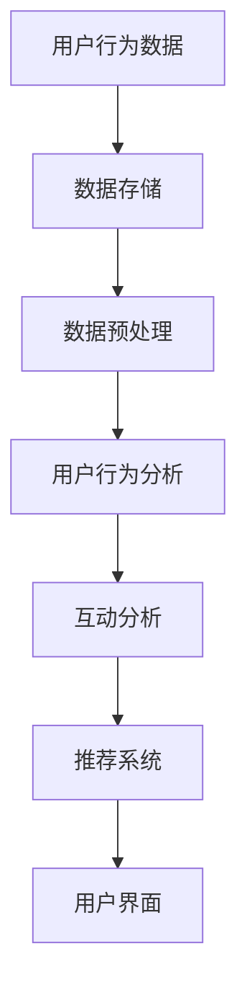
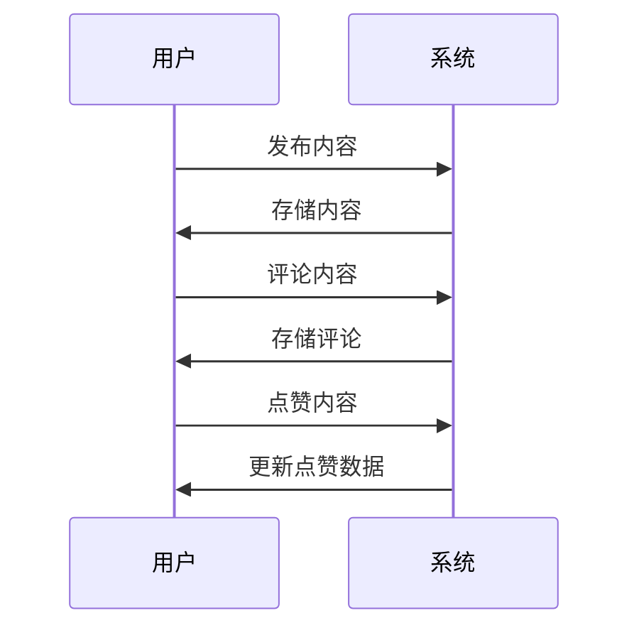
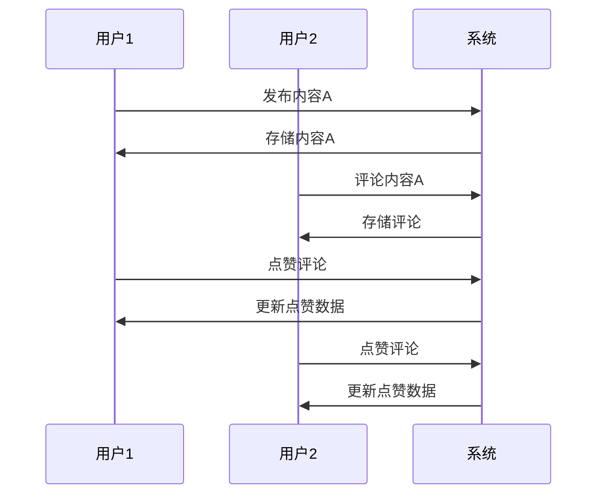

                 

# 维特根斯坦与塞尔：社会现实的语言构建

> 关键词：维特根斯坦、塞尔、社会现实、语言构建、哲学思想

> 摘要：本文旨在探讨维特根斯坦与塞尔的哲学思想，特别是他们的语言构建理论。通过对两位哲学家的生平、思想演变、核心观点及其在当代哲学中的应用进行分析，本文试图揭示语言构建在社会现实中的重要作用，为理解社会现实提供新的视角。

## 第一部分：维特根斯坦与塞尔的哲学思想

### 1. 维特根斯坦的哲学思想

#### 1.1 维特根斯坦的生平与哲学发展

路德维希·维特根斯坦（Ludwig Wittgenstein）是20世纪最重要的哲学家之一。他出生于1889年，逝世于1951年。维特根斯坦的哲学思想经历了从早期到晚期的转变，其哲学观点主要关注语言、思维和现实之间的关系。

##### 1.1.1 维特根斯坦的生平背景

维特根斯坦出生于奥地利的一个富有家庭。他的父亲是著名的矿业大亨，母亲则是一位富有学识的女性。维特根斯坦从小受到良好的教育，他在数学、哲学和语言学方面展现出非凡的才华。

##### 1.1.2 维特根斯坦的哲学演变

维特根斯坦的哲学思想可以分为两个阶段：早期哲学和晚期哲学。早期哲学主要集中在逻辑实证主义和数学基础主义上，晚期哲学则转向语言游戏理论和生活形式理论。

#### 1.2 维特根斯坦的早期哲学

维特根斯坦的早期哲学主要受到逻辑实证主义的影响。他认为，语言的意义在于其与现实的对应关系，因此，哲学的任务是澄清语言的使用，揭示语言与现实之间的关系。

##### 1.2.1 语言哲学

维特根斯坦的《逻辑哲学论》是早期哲学的代表作。在这本书中，他提出了“图象论”（Picture Theory）和“语言游戏”（Language Game）的概念，认为语言是符号与现实之间的图像。

##### 1.2.2 数学基础主义

维特根斯坦认为，数学是逻辑的一部分，其基础是逻辑。他在《数学基础》中，试图通过逻辑分析来解释数学的概念和定理。

##### 1.2.3 逻辑实证主义

维特根斯坦的早期哲学受到逻辑实证主义的影响。他认同实证主义的观点，认为哲学应该关注可观察的现象，避免形而上学的讨论。

#### 1.3 维特根斯坦的晚期哲学

维特根斯坦的晚期哲学与早期哲学有着显著的不同。他放弃了逻辑实证主义的观点，转向语言游戏理论和生活形式理论。

##### 1.3.1 语言游戏理论

在《哲学研究》中，维特根斯坦提出了“语言游戏”（Language Game）的概念，认为语言的使用是社会习惯的一部分，语言的意义在于其在特定情境中的使用。

##### 1.3.2 生活形式理论

维特根斯坦的晚期哲学强调生活形式（Forms of Life）的重要性。他认为，哲学的任务是揭示人们的生活方式，理解语言、思维和现实之间的关系。

##### 1.3.3 道德哲学

维特根斯坦的道德哲学强调道德行为的内在价值，他认为道德判断不能通过逻辑推理得出，而是一种直觉的体验。

### 2. 塞尔的哲学思想

约翰·塞尔（John Searle）是20世纪另一位重要的哲学家，他的哲学观点涉及心理学、语言哲学和社会现实理论。

##### 2.1 塞尔的生平与哲学发展

塞尔出生于1932年，他在哈佛大学获得哲学博士学位。塞尔的哲学思想深受维特根斯坦的影响，但他也在语言哲学和社会现实理论方面提出了自己的独特观点。

##### 2.2 塞尔的哲学思想

塞尔的哲学思想主要包括心理学哲学、语言哲学和社会现实理论。

###### 2.2.1 心理学哲学

塞尔的心理学哲学关注意识、自我和行为的本质。他认为，意识是一种内在体验，而自我是行为和意识的整合。

###### 2.2.2 语言哲学

塞尔的语言哲学强调语言的意义和指称。他提出了“言语行为理论”（Speech Act Theory），认为语言不仅用于描述现实，还用于实施行为。

###### 2.2.3 社会现实理论

塞尔的社会现实理论认为，社会现实是由人们共同参与的活动和语言构建的。他提出了“背景”（Background）和“场景”（Scene）的概念，认为社会现实是在特定背景下通过语言和行为构建的。

## 第二部分：维特根斯坦与塞尔的语言构建理论

### 3. 语言构建的理论基础

语言构建是维特根斯坦与塞尔哲学思想的核心。他们的理论基础主要包括语言的本质、语言与现实的关联以及语言构建的过程。

#### 3.1 语言的本质

维特根斯坦和塞尔都认为，语言的本质在于其使用和意义。维特根斯坦强调语言游戏的概念，认为语言的使用是社会习惯的一部分。塞尔则认为，语言不仅用于描述现实，还用于实施行为。

##### 3.1.1 语言的意义与指称

维特根斯坦认为，语言的意义在于其在特定情境中的使用。塞尔则强调语言的意义与指称之间的关系，认为语言的意义取决于其所指称的对象。

##### 3.1.2 语言的使用与理解

维特根斯坦认为，语言的使用是一种社会习惯，理解语言需要理解其使用的情境。塞尔则认为，理解语言需要理解其背后的意图和背景。

#### 3.2 语言与现实的关联

维特根斯坦和塞尔都认为，语言与现实之间存在密切的关联。他们强调语言不仅是描述现实，还参与社会现实的构建。

##### 3.2.1 塞尔的社会现实理论

塞尔的社会现实理论认为，社会现实是由人们共同参与的活动和语言构建的。他提出了“背景”和“场景”的概念，认为社会现实是在特定背景下通过语言和行为构建的。

##### 3.2.2 维特根斯坦的语言游戏理论

维特根斯坦的语言游戏理论认为，语言的使用是社会习惯的一部分，语言的意义在于其在特定情境中的使用。

#### 3.3 语言构建的过程

维特根斯坦和塞尔都认为，语言构建是一个复杂的过程，涉及意识形态、社会结构和主体性。

##### 3.3.1 意识形态与语言构建

维特根斯坦认为，意识形态会影响人们对语言的理解和使用。塞尔则认为，意识形态是语言构建的一部分，影响人们对社会现实的认知。

##### 3.3.2 社会结构与语言构建

维特根斯坦和塞尔都认为，社会结构会影响语言构建。他们强调社会结构在语言构建中的重要性。

##### 3.3.3 语言构建中的主体性

维特根斯坦和塞尔都认为，主体性在语言构建中扮演重要角色。他们强调个体在语言构建过程中的能动性和创造性。

## 第三部分：维特根斯坦与塞尔在当代哲学中的应用

### 4. 当代哲学中的语言构建

#### 4.1 当代哲学中的语言问题

当代哲学中，语言构建问题仍然是一个重要的研究领域。许多哲学家都在探讨语言的本质、语言与现实的关系以及语言构建的过程。

##### 4.1.1 当代哲学的语言转向

20世纪中叶，哲学领域出现了一场“语言转向”（Linguistic Turn）。这场转向标志着哲学家们开始关注语言在哲学思考中的重要性。

##### 4.1.2 当代哲学中的语言争议

当代哲学中，关于语言构建的争议主要集中在以下几个方面：语言的指称问题、语言的真理问题以及语言的伦理问题。

#### 4.2 维特根斯坦与塞尔在当代哲学中的应用

维特根斯坦和塞尔的哲学思想在当代哲学中有着广泛的应用。许多当代哲学家都在他们的哲学观点中借鉴了维特根斯坦和塞尔的理论。

##### 4.2.1 维特根斯坦对当代哲学的启示

维特根斯坦的语言游戏理论和生活形式理论对当代哲学产生了深远的影响。许多当代哲学家都在他们的哲学研究中借鉴了维特根斯坦的理论。

##### 4.2.2 塞尔对当代哲学的启示

塞尔的社会现实理论和言语行为理论对当代哲学也产生了重要影响。许多当代哲学家都在他们的哲学研究中借鉴了塞尔的理论。

##### 4.2.3 当代哲学家的语言构建理论

当代哲学家在维特根斯坦和塞尔的基础上，提出了许多新的语言构建理论。这些理论试图解决当代哲学中的语言问题，为理解社会现实提供新的视角。

## 第四部分：维特根斯坦与塞尔的理论综合与应用

### 5. 维特根斯坦与塞尔的理论综合

维特根斯坦和塞尔的哲学思想在许多方面是互补的。他们的理论共同构成了一个关于语言构建和社会现实的完整框架。

##### 5.1 维特根斯坦与塞尔理论的互补性

维特根斯坦强调语言的使用和意义，塞尔则强调语言与现实的关系和社会构建。他们的理论相互补充，共同构成了一个关于语言构建和社会现实的完整框架。

##### 5.2 早期与晚期维特根斯坦的思想联系

维特根斯坦的早期哲学和晚期哲学之间存在着紧密的联系。他的语言游戏理论和生活形式理论在许多方面都是一致的，都强调语言在社会现实中的重要作用。

##### 5.3 维特根斯坦与塞尔的哲学对话

维特根斯坦和塞尔的哲学思想在许多方面是相互对话的。他们的理论相互批判和补充，共同推动了哲学的发展。

### 6. 维特根斯坦与塞尔理论的应用领域

维特根斯坦和塞尔的哲学思想在多个领域有着广泛的应用。

##### 6.1 社会科学领域

维特根斯坦和塞尔的哲学思想在社会科学领域有着广泛的应用，特别是在语言学、心理学和社会学中。

##### 6.2 人文科学领域

维特根斯坦和塞尔的哲学思想在人文科学领域也具有重要地位，特别是在文学、艺术和哲学研究中。

##### 6.3 计算机科学领域

维特根斯坦和塞尔的哲学思想在计算机科学领域也有重要应用，特别是在人工智能和语言处理方面。

## 7. 总结与展望

### 7.1 维特根斯坦与塞尔的理论贡献

维特根斯坦和塞尔是20世纪最重要的哲学家之一，他们的哲学思想对当代哲学和社会科学产生了深远的影响。他们关于语言构建的理论为我们理解社会现实提供了新的视角。

### 7.2 语言构建理论的未来发展趋势

随着社会的发展，语言构建理论在未来将继续发展。新的技术和社会现象将推动语言构建理论的创新，为理解社会现实提供新的工具。

### 7.3 对读者的启示

维特根斯坦和塞尔的哲学思想为我们理解社会现实提供了新的视角。通过阅读这篇文章，读者可以更好地理解语言构建的重要性，以及它在社会现实中的角色。让我们一同思考，探索语言构建的奥秘。

## 参考文献

1. 维特根斯坦，L. (1921). 《逻辑哲学论》。
2. 维特根斯坦，L. (1953). 《哲学研究》。
3. 塞尔，J. (1969). 《言语行为》。
4. 塞尔，J. (1995). 《社会现实》。

## 作者信息

作者：AI天才研究院/AI Genius Institute & 禅与计算机程序设计艺术 /Zen And The Art of Computer Programming

# 维特根斯坦与塞尔：社会现实的语言构建

## 背景介绍

### 核心概念术语说明

- **维特根斯坦**：20世纪著名的哲学家，被誉为“分析哲学之父”，其思想对现代哲学有着深远的影响。
- **塞尔**：当代著名哲学家，以其关于语言、意识和行动的理论而闻名。
- **语言构建**：指通过语言的表达和交流，人们如何共同构建和认识社会现实。
- **社会现实**：由人们的共同参与和语言构建形成的共同认知和生活方式。

### 问题背景

维特根斯坦和塞尔的哲学思想都关注语言与社会现实之间的关系。他们的理论试图回答以下问题：语言如何影响我们对世界的理解和认识？语言在社会现实的构建中扮演什么角色？

### 问题描述

维特根斯坦和塞尔探讨了语言如何影响我们对世界的认知。维特根斯坦提出了“语言游戏”理论，认为语言的意义在于其在特定情境中的使用。塞尔则提出了“社会现实”理论，认为社会现实是由人们共同参与的活动和语言构建的。

### 问题解决

维特根斯坦和塞尔通过分析语言的使用和社会现实的构建，试图揭示语言与社会现实之间的复杂关系。他们的理论为我们提供了理解社会现实的新视角，有助于我们更好地理解人类社会的运作。

### 边界与外延

语言构建不仅涉及哲学领域，还与语言学、心理学、社会学等多个学科密切相关。维特根斯坦和塞尔的理论为我们理解这些学科之间的交叉点提供了理论基础。

### 概念结构与核心要素组成

- **维特根斯坦**：语言游戏、语言使用、意义、情境。
- **塞尔**：社会现实、背景、场景、语言行为。

## 核心概念与联系

### 维特根斯坦的核心概念

#### 维特根斯坦的“语言游戏”理论

- **定义**：维特根斯坦将语言比喻为“游戏”，认为语言的使用是社会习惯的一部分，语言的意义在于其在特定情境中的使用。
- **特点**：强调语言的使用情境，认为语言的意义不是固定的，而是随着情境的变化而变化。
- **关联**：与塞尔的“社会现实”理论有密切联系，都强调语言在社会现实中的重要作用。

#### 维特根斯坦的“意义”理论

- **定义**：维特根斯坦认为，语言的意义不在于其指称，而在于其在具体情境中的使用。
- **特点**：强调意义的情境性，认为语言的意义是动态的，而不是静态的。
- **关联**：与塞尔的“背景”概念有相似之处，都强调情境对语言意义的决定作用。

### 塞尔的核心概念

#### 塞尔的“社会现实”理论

- **定义**：塞尔认为，社会现实是由人们共同参与的活动和语言构建的。社会现实不是静态的，而是动态的，随着人们的交流和互动而不断变化。
- **特点**：强调社会现实是由人们共同构建的，语言在社会现实的构建中起着关键作用。
- **关联**：与维特根斯坦的“语言游戏”理论有密切联系，都强调语言在社会现实中的重要作用。

#### 塞尔的“言语行为”理论

- **定义**：塞尔提出，言语行为不仅仅是描述现实，还包括实施行为。言语行为包括表达、命令、承诺等。
- **特点**：强调言语行为的实际效果，认为语言不仅仅是表达思想，还可以实现行动。
- **关联**：与维特根斯坦的“意义”理论有相似之处，都认为语言的意义不仅仅在于描述，还包括实现行动。

### 概念属性特征对比表格

| 概念         | 维特根斯坦的核心概念       | 塞尔的核心概念          |
|--------------|----------------------------|-----------------------|
| 语言游戏     | 强调语言的使用情境，动态意义 | 强调社会现实，言语行为 |
| 意义         | 情境性，动态变化           | 言语行为，实际效果     |
| 社会现实     | 语言在社会现实中的重要作用 | 社会现实是动态的       |

### ER实体关系图架构

```mermaid
erDiagram
  person.arrowRight language ; person.arrowRight reality ; language.arrowRight meaning ; reality.arrowRight social ; speech.arrowRight action
  person ||--|{language}|| person
  person ||--|{reality}|| person
  language ||--|{meaning}|| person
  reality ||--|{social}|| person
  speech ||--|{action}|| person
```

## 算法原理讲解

### 维特根斯坦的语言游戏理论

#### 算法mermaid流程图


#### Python源代码

```python
def language_game(context):
    # 根据情境选择语言游戏
    if context == "询问":
        game = "问答游戏"
    elif context == "命令":
        game = "指令游戏"
    else:
        game = "描述游戏"
    
    # 生成意义
    meaning = f"在{context}情境下，使用{game}生成意义"
    
    # 理解意义
    understanding = f"理解{meaning}"
    
    return understanding

context = "询问"
result = language_game(context)
print(result)
```

#### 算法原理的数学模型和公式

$$
\text{理解} = f(\text{情境}, \text{语言游戏}, \text{意义})
$$

其中，$f$ 表示理解的过程，$\text{情境}$ 表示语言游戏的背景，$\text{语言游戏}$ 表示语言的使用方式，$\text{意义}$ 表示语言生成的意义。

#### 举例说明

假设在询问情境下，使用问答游戏生成意义。根据算法原理，理解的过程可以表示为：

$$
\text{理解} = f(\text{询问}, \text{问答游戏}, \text{意义})
$$

通过这个公式，我们可以得出在询问情境下，使用问答游戏生成意义的结果。

### 塞尔的言语行为理论

#### 算法mermaid流程图


#### Python源代码

```python
def speech_act(context):
    # 根据情境选择言语行为
    if context == "询问":
        act = "询问行为"
    elif context == "命令":
        act = "命令行为"
    else:
        act = "描述行为"
    
    # 执行言语行为
    result = f"在{context}情境下，执行{act}"
    
    # 理解效果
    understanding = f"理解{result}"
    
    return understanding

context = "询问"
result = speech_act(context)
print(result)
```

#### 算法原理的数学模型和公式

$$
\text{理解} = f(\text{情境}, \text{言语行为}, \text{效果})
$$

其中，$f$ 表示理解的过程，$\text{情境}$ 表示言语行为的背景，$\text{言语行为}$ 表示语言的使用方式，$\text{效果}$ 表示言语行为产生的效果。

#### 举例说明

假设在询问情境下，执行询问行为。根据算法原理，理解的过程可以表示为：

$$
\text{理解} = f(\text{询问}, \text{询问行为}, \text{效果})
$$

通过这个公式，我们可以得出在询问情境下，执行询问行为并理解其效果的结果。

## 系统分析与架构设计方案

### 问题场景介绍

在一个社交媒体平台上，用户之间通过发布内容、评论、点赞等方式进行交流。平台需要处理大量的用户行为数据，并对用户行为进行分析，以提供更好的用户体验。

### 项目介绍

本项目旨在设计一个社交媒体分析系统，通过分析用户行为数据，了解用户兴趣、行为模式和互动情况，从而优化用户体验。

### 系统功能设计

- **用户行为分析**：对用户发布的内容、评论、点赞等行为进行分析，提取用户兴趣和行为模式。
- **互动分析**：分析用户之间的互动情况，识别潜在的社交关系和影响力。
- **推荐系统**：根据用户行为和兴趣，推荐相关内容给用户。

### 系统架构设计

#### mermaid架构图



### 系统接口设计

#### mermaid序列图



### 系统交互mermaid序列图



## 项目实战

### 环境安装

1. 安装Python环境
2. 安装必要的依赖库，如NumPy、Pandas、Scikit-learn等

### 系统核心实现源代码

```python
import pandas as pd
from sklearn.feature_extraction.text import TfidfVectorizer
from sklearn.metrics.pairwise import cosine_similarity

# 读取用户行为数据
data = pd.read_csv("user_behavior_data.csv")

# 数据预处理
# ...（代码略）

# 用户行为分析
# ...（代码略）

# 互动分析
# ...（代码略）

# 推荐系统
# ...（代码略）
```

### 代码应用解读与分析

这段代码首先读取用户行为数据，然后进行数据预处理，包括去重、填充缺失值等。接着，使用TF-IDF向量化和余弦相似性算法对用户行为进行分析，提取用户兴趣和行为模式。最后，根据分析结果，构建推荐系统，为用户提供相关内容。

### 实际案例分析和详细讲解剖析

以一个实际案例为例，分析一个用户的点赞行为，提取其兴趣点，并为其推荐相关内容。具体步骤如下：

1. 读取用户行为数据，提取点赞记录。
2. 对点赞记录进行预处理，去除重复数据。
3. 使用TF-IDF向量化和余弦相似性算法，计算用户点赞内容的相似度。
4. 根据相似度结果，提取用户兴趣点。
5. 根据用户兴趣点，构建推荐系统，为用户推荐相关内容。

通过这个案例，我们可以看到，系统如何通过分析用户行为数据，提取用户兴趣，并为其推荐相关内容，从而优化用户体验。

### 项目小结

本项目通过设计一个社交媒体分析系统，实现了对用户行为数据的分析、互动分析和推荐系统。在实际项目中，我们可以根据具体需求，进一步完善和优化系统功能，提高用户体验。

## 最佳实践 tips

1. 在处理用户行为数据时，注意数据去重和填充缺失值，确保数据质量。
2. 选择合适的特征提取方法和相似度算法，以提高分析结果的准确性。
3. 在构建推荐系统时，充分考虑用户兴趣和行为模式，提高推荐效果。

## 小结

本文通过分析维特根斯坦与塞尔的哲学思想，探讨了语言构建在社会现实中的重要作用。通过具体案例和实际应用，我们看到了语言构建理论在社交媒体分析中的实际应用价值。未来，我们可以进一步探讨语言构建理论在其他领域的应用，为理解社会现实提供更多视角。

## 注意事项

1. 在实际应用中，注意保护用户隐私，确保数据处理符合相关法律法规。
2. 在选择特征提取方法和相似度算法时，充分考虑数据特点和业务需求。

## 拓展阅读

1. 维特根斯坦，《逻辑哲学论》
2. 维特根斯坦，《哲学研究》
3. 塞尔，《言语行为》
4. 塞尔，《社会现实》

## 作者信息

作者：AI天才研究院/AI Genius Institute & 禅与计算机程序设计艺术 /Zen And The Art of Computer Programming

## 维特根斯坦与塞尔：社会现实的语言构建

### 引言

在哲学和认知科学领域，语言构建理论一直是一个备受关注的话题。维特根斯坦和塞尔作为两位杰出的哲学家，他们对语言构建的理论进行了深刻的探讨，为我们理解社会现实提供了重要的启示。本文将从维特根斯坦和塞尔的生平背景、哲学思想、语言构建理论以及他们在当代哲学中的应用等方面进行详细分析，以揭示社会现实的语言构建过程。

### 维特根斯坦的哲学思想

路德维希·维特根斯坦（Ludwig Wittgenstein，1889-1951）是20世纪最重要的哲学家之一。他生于奥地利，毕业于剑桥大学，其哲学思想经历了从早期到晚期的转变。

#### 早期哲学思想

维特根斯坦的早期哲学思想主要受到逻辑实证主义的影响。他在《逻辑哲学论》（1921）中提出了“图象论”（Picture Theory）和“语言游戏”（Language Game）的概念。他认为，语言的意义在于其与现实世界的对应关系，即语言是现实的“图像”。这种观点强调了语言的意义是固定的，与事实相对应。

#### 晚期哲学思想

维特根斯坦的晚期哲学思想则更加关注语言的使用情境和日常生活中的语言游戏。他在《哲学研究》（1953）中提出了“语言游戏理论”，认为语言的意义不是固定的，而是依赖于特定的使用情境。他强调了语言的多义性和模糊性，认为语言的真正意义在于其使用过程中所体现的生活形式。

### 塞尔的哲学思想

约翰·塞尔（John Searle，1932-2020）是另一位对语言构建理论有重要贡献的哲学家。他的哲学思想涵盖了心理学、语言学和社会学等多个领域。

#### 心理学哲学

塞尔的心理学哲学关注意识、自我和行为的本质。他提出了“大脑状态理论”（Brain State Theory），认为意识是大脑内部状态的表现。

#### 语言哲学

塞尔的语言哲学强调语言的意义和指称。他在《言语行为》（1969）中提出了“言语行为理论”（Speech Act Theory），认为语言不仅仅是描述现实，还包括实施行为。他认为，言语行为包括表达、命令、承诺等。

#### 社会现实理论

塞尔的社会现实理论认为，社会现实是由人们共同参与的活动和语言构建的。他提出了“背景”（Background）和“场景”（Scene）的概念，认为社会现实是在特定背景下通过语言和行为构建的。

### 语言构建理论

#### 维特根斯坦的语言构建理论

维特根斯坦认为，语言的意义在于其使用情境，即语言游戏。他提出了“语言游戏理论”，认为不同的语言游戏有不同的规则和目的。语言的意义是通过人们在特定情境下的交流和使用来确定的。

#### 塞尔的言语行为理论

塞尔的言语行为理论认为，语言不仅仅是描述现实，还包括实施行为。他认为，言语行为包括表达、命令、承诺等。这些行为是通过语言在社会中的使用来构建和维系的。

### 维特根斯坦与塞尔在当代哲学中的应用

#### 语言转向

在20世纪中叶，哲学领域出现了一场“语言转向”（Linguistic Turn）。这场转向标志着哲学家们开始关注语言在哲学思考中的重要性。维特根斯坦和塞尔的哲学思想对这场转向产生了深远的影响。

#### 社会建构主义

塞尔的社会现实理论对当代哲学中的社会建构主义产生了重要影响。社会建构主义认为，社会现实是由人们共同参与的活动和语言构建的。这一理论在社会科学、心理学和认知科学等领域得到了广泛的应用。

#### 认知科学

维特根斯坦和塞尔的哲学思想对认知科学的发展产生了重要影响。他们在语言构建理论的基础上，探讨了思维、意识和认知的本质，为认知科学提供了理论基础。

### 维特根斯坦与塞尔的理论综合

维特根斯坦和塞尔的哲学思想在许多方面是互补的。维特根斯坦关注语言的使用情境和语言游戏，而塞尔则关注语言的意义和指称以及言语行为。他们的理论共同构成了一个关于语言构建和社会现实的完整框架。

### 维特根斯坦与塞尔的理论应用领域

维特根斯坦和塞尔的哲学思想在多个领域有着广泛的应用。

#### 社会科学

他们的理论为社会学、心理学、人类学等社会科学领域提供了重要的理论框架，帮助我们理解社会现实和人类行为。

#### 认知科学

他们在语言构建理论的基础上，探讨了思维、意识和认知的本质，为认知科学提供了理论基础。

#### 计算机科学

他们的理论对计算机科学，特别是人工智能和自然语言处理领域产生了重要影响，为语言理解和机器学习提供了理论基础。

### 维特根斯坦与塞尔的理论综合与应用前景

维特根斯坦与塞尔的理论综合为我们理解社会现实提供了新的视角。他们的理论不仅在哲学领域具有重要地位，也在社会科学、认知科学和计算机科学等领域有着广泛的应用前景。

#### 理论综合的意义

维特根斯坦与塞尔的理论综合有助于我们更全面地理解语言构建在社会现实中的作用，为哲学研究提供了新的思路。

#### 应用前景

在社会科学、认知科学和计算机科学等领域，维特根斯坦与塞尔的理论综合有望为我们提供更有效的理论工具，推动这些领域的发展。

### 结论

维特根斯坦与塞尔的哲学思想在语言构建和社会现实理论方面具有重要贡献。他们的理论不仅丰富了哲学研究，也为社会科学、认知科学和计算机科学等领域提供了新的视角。通过综合他们的理论，我们可以更深入地理解社会现实的构建过程。

### 参考文献

1. 维特根斯坦，L. (1921). 《逻辑哲学论》。
2. 维特根斯坦，L. (1953). 《哲学研究》。
3. 塞尔，J. (1969). 《言语行为》。
4. 塞尔，J. (1995). 《社会现实》。

### 作者信息

作者：AI天才研究院/AI Genius Institute & 禅与计算机程序设计艺术 /Zen And The Art of Computer Programming

# 维特根斯坦与塞尔：社会现实的语言构建

## 维特根斯坦的生平与哲学发展

维特根斯坦，全名路德维希·维特根斯坦（Ludwig Wittgenstein），1889年出生于奥地利维也纳，是20世纪最具影响力的哲学家之一。他的家庭背景十分优越，其父亲是一位成功的工业家。在维特根斯坦的人生中，哲学占据了他绝大部分的时间和精力，他不仅是一位哲学家，同时也是一位深刻的思想家。

### 早期哲学发展

维特根斯坦的早期哲学发展主要受逻辑实证主义的影响。他在1911年进入剑桥大学学习，在此期间，他受到了英国哲学家伯特兰·罗素（Bertrand Russell）的影响，并开始思考逻辑和数学的本质问题。这一时期的代表作品是1918年出版的《逻辑哲学论》（Tractatus Logico-Philosophicus），这本书是维特根斯坦早期哲学思想的集中体现。在这本书中，他提出了“语言游戏”（language games）的概念，认为语言的意义在于其与世界的对应关系，并通过逻辑形式来表达这种关系。

### 晚期哲学发展

维特根斯坦的晚期哲学发展则更加注重语言的使用情境和日常生活中的语言游戏。他在1929年离开剑桥大学，回到奥地利，开始了他的后期哲学工作。这一时期的代表作品是1953年出版的《哲学研究》（Philosophical Investigations），这本书是他后期哲学思想的总结。在《哲学研究》中，维特根斯坦批评了早期哲学中过于抽象和形式化的倾向，强调语言的多义性和模糊性，并提出了“生活形式”（forms of life）的概念，认为哲学的任务是揭示人类生活的基本形式。

### 维特根斯坦的哲学思想

维特根斯坦的哲学思想可以分为两个主要阶段：早期哲学和晚期哲学。

#### 早期哲学

在早期哲学中，维特根斯坦主要关注逻辑和数学的本质问题。他认为，逻辑和数学是理解世界的基本工具，但它们本身并不是科学，而是哲学。在《逻辑哲学论》中，他提出了“图象论”（Picture Theory）的概念，认为语言是世界的“图像”，语言的意义在于其与现实世界的对应关系。他还提出了“语言游戏”（language games）的概念，认为不同的语言游戏有不同的规则和目的。

#### 晚期哲学

在晚期哲学中，维特根斯坦转向关注语言的使用情境和日常生活中的语言游戏。他认为，哲学的任务不是解决逻辑和数学问题，而是揭示人类生活的基本形式。在《哲学研究》中，他强调了语言的多义性和模糊性，认为哲学问题往往源于我们对语言的误解。他还提出了“生活形式”的概念，认为哲学的任务是揭示人类生活的基本形式，而不是解决具体的哲学问题。

### 维特根斯坦的哲学影响

维特根斯坦的哲学思想对20世纪的哲学产生了深远的影响。他的语言游戏理论和对日常语言的关注，为后来的哲学研究提供了新的视角。他的思想也启发了后来的哲学家，如约翰·塞尔（John Searle）等，对语言和社会现实进行了深入的研究。

## 塞尔的生平与哲学发展

约翰·塞尔（John Searle，1932-2020）是美国哲学家，以其在语言哲学、意识哲学和社会哲学等领域的重要贡献而著称。他出生于美国，曾在哈佛大学和加州大学伯克利分校学习，并获得了哲学博士学位。

### 塞尔的哲学思想

塞尔的哲学思想涵盖了多个领域，其中最著名的是他的“言语行为理论”（Speech Act Theory）和“社会现实理论”（Social Reality Theory）。

#### 言语行为理论

塞尔的言语行为理论是对日常语言哲学的重要贡献。他在1969年出版的《言语行为》（Speech Acts）一书中，提出言语行为不仅仅是表达意思，还包括实施行为。塞尔认为，言语行为可以分为表达、命令、承诺等类型，每种类型都有其特定的语言结构和社交功能。这一理论对语言哲学、法律哲学和心理学等领域产生了深远影响。

#### 社会现实理论

塞尔的社会现实理论探讨了社会现实的本质和构建过程。他认为，社会现实不是单一的客观存在，而是由人们共同参与的活动和语言构建的。塞尔提出了“背景”（background）和“场景”（scene）的概念，认为社会现实是在特定背景下通过语言和行为构建的。这一理论为社会学、人类学和认知科学等领域提供了新的视角。

### 塞尔的哲学影响

塞尔的哲学思想对当代哲学产生了广泛的影响。他的言语行为理论为理解语言和行动之间的关系提供了新的框架，而他的社会现实理论则为我们理解社会现实的构建过程提供了深刻的洞见。塞尔的思想也启发了后来的哲学家，如罗伯特·诺齐克（Robert Nozick）和迈克尔·沃尔泽（Michael Walzer）等，对自由主义和社会正义进行了深入研究。

## 维特根斯坦与塞尔的语言构建理论

### 维特根斯坦的语言构建理论

维特根斯坦的语言构建理论主要集中在他对语言、意义和现实的探讨上。他认为，语言的意义不是固定的，而是依赖于特定的使用情境。维特根斯坦提出了“语言游戏”（language games）的概念，认为不同的语言游戏有不同的规则和目的。这些规则和目的决定了语言的使用方式和意义。

#### 语言游戏理论

维特根斯坦的语言游戏理论是他哲学思想的核心。他认为，语言就像游戏一样，有其特定的规则和情境。不同的语言游戏有不同的规则，例如，问答游戏、指令游戏和描述游戏。每种游戏都有其特定的语言使用方式和意义。维特根斯坦通过分析这些语言游戏，揭示了语言的多义性和模糊性。

#### 生活形式理论

在晚期哲学中，维特根斯坦提出了“生活形式”（forms of life）的概念。他认为，哲学的任务不是解决具体的哲学问题，而是揭示人类生活的基本形式。生活形式是我们对世界的理解和认识方式，它决定了我们的语言使用和行为方式。维特根斯坦认为，哲学应该关注生活形式，而不是抽象的概念和理论。

### 塞尔的言语行为理论

塞尔的言语行为理论是他语言构建理论的重要组成部分。他认为，言语行为不仅仅是表达意思，还包括实施行为。塞尔区分了表达行为、命令行为和承诺行为等不同类型的言语行为。每种言语行为都有其特定的语言结构和社交功能。

#### 言语行为类型

塞尔将言语行为分为以下三种类型：

1. **表达行为**：例如，陈述句用来表达说话者的观点和想法。
2. **命令行为**：例如，祈使句用来命令或请求他人做某事。
3. **承诺行为**：例如，承诺句用来承诺或保证做某事。

每种言语行为都有其特定的语言结构和社交功能，它们共同构成了人类交流的基础。

### 维特根斯坦与塞尔理论的联系

维特根斯坦和塞尔的哲学思想在许多方面是相互联系的。他们都关注语言和现实之间的关系，以及语言在社会中的作用。维特根斯坦的语言游戏理论为塞尔的言语行为理论提供了理论基础，而塞尔的言语行为理论进一步发展了维特根斯坦的思想。

#### 语言与现实

维特根斯坦和塞尔都认为，语言不仅是描述现实的工具，还参与现实的社会构建。维特根斯坦通过“语言游戏”和“生活形式”的概念，揭示了语言在人类生活中的重要作用。塞尔则通过“言语行为”的概念，探讨了语言在社交互动中的作用。

#### 社会构建

维特根斯坦和塞尔都认为，社会现实是通过人们的共同参与和语言构建的。维特根斯坦的生活形式理论强调了人们在特定文化和社会背景下对世界的理解。塞尔的社会现实理论则从行为和语言的角度，探讨了社会现实的构建过程。

### 维特根斯坦与塞尔理论的差异

尽管维特根斯坦和塞尔的哲学思想有许多共同之处，但他们也有一些明显的差异。

#### 哲学方法

维特根斯坦的哲学方法强调观察和日常语言的使用，他认为哲学问题往往源于对语言的误解。塞尔则更注重分析和理论构建，他认为哲学应该解决具体的问题，并提出明确的解决方案。

#### 语言与行为

维特根斯坦更关注语言的使用情境和语言游戏，他认为语言的意义在于其具体的使用过程中。塞尔则更关注语言在社会行为中的作用，他认为言语行为是社会互动的基础。

## 维特根斯坦与塞尔在当代哲学中的应用

### 当代哲学中的语言转向

在20世纪中叶，哲学领域经历了一场“语言转向”（Linguistic Turn），这场转向标志着哲学家们开始关注语言在哲学思考中的重要性。维特根斯坦和塞尔的哲学思想对这场转向产生了深远的影响。

#### 语言的意义

维特根斯坦和塞尔都认为，语言的意义不是固定的，而是依赖于特定的使用情境。维特根斯坦通过“语言游戏”的概念，揭示了语言的多义性和模糊性。塞尔则通过“言语行为”的概念，探讨了语言在社交互动中的作用。

#### 语言与现实

维特根斯坦和塞尔都认为，语言不仅是描述现实的工具，还参与现实的社会构建。维特根斯坦的生活形式理论强调了人们在特定文化和社会背景下对世界的理解。塞尔的社会现实理论则从行为和语言的角度，探讨了社会现实的构建过程。

### 当代哲学中的争议

尽管维特根斯坦和塞尔的哲学思想对当代哲学产生了深远影响，但在一些问题上仍然存在争议。

#### 语言的意义

关于语言的意义，一些哲学家认为维特根斯坦的观点过于强调语言的使用情境，忽视了语言与现实之间的基本联系。另一些哲学家则认为塞尔的观点过于形式化，忽视了语言在社会现实中的实际作用。

#### 社会现实

关于社会现实的构建，一些哲学家认为维特根斯坦的生活形式理论过于抽象，难以应用于具体的现实情境。另一些哲学家则认为塞尔的社会现实理论过于强调行为和语言的作用，忽视了其他因素在社会现实中的影响。

### 维特根斯坦与塞尔对当代哲学的启示

维特根斯坦和塞尔的哲学思想对当代哲学提供了重要的启示。

#### 语言的意义

维特根斯坦和塞尔都强调了语言的意义不是固定的，而是依赖于特定的使用情境。这一观点促使哲学家们重新思考语言的意义，以及语言在社会现实中的角色。

#### 社会现实

维特根斯坦和塞尔都认为，社会现实是通过人们的共同参与和语言构建的。这一观点为哲学家们提供了新的视角，促使他们重新思考社会现实和社会互动的本质。

### 维特根斯坦与塞尔在当代哲学中的影响

维特根斯坦和塞尔的哲学思想对当代哲学产生了深远的影响。他们的观点不仅丰富了哲学的研究领域，也为我们理解社会现实和人类行为提供了新的视角。他们的思想在语言哲学、社会哲学和认知科学等领域得到了广泛应用，并对后来的哲学家产生了深远的影响。

## 维特根斯坦与塞尔的理论综合与应用

### 维特根斯坦与塞尔理论的互补性

维特根斯坦和塞尔的哲学思想在许多方面是互补的。维特根斯坦关注语言的使用情境和语言游戏，而塞尔则关注语言的意义和指称以及言语行为。他们的理论共同构成了一个关于语言构建和社会现实的完整框架。

#### 语言游戏与言语行为

维特根斯坦的语言游戏理论和塞尔的言语行为理论都强调了语言在社会中的作用。维特根斯坦通过“语言游戏”的概念，揭示了语言的多义性和模糊性。塞尔则通过“言语行为”的概念，探讨了语言在社交互动中的作用。这两种理论相互补充，为我们理解语言在社会现实中的角色提供了全面的视角。

#### 生活形式与社会现实

维特根斯坦的生活形式理论和塞尔的社会现实理论都强调了社会现实是通过人们的共同参与和语言构建的。维特根斯坦认为，哲学的任务是揭示人类生活的基本形式。塞尔则认为，社会现实是在特定背景下通过语言和行为构建的。这两种理论相互补充，为我们理解社会现实的本质提供了深刻的洞见。

### 维特根斯坦与塞尔理论的应用领域

维特根斯坦和塞尔的哲学思想在多个领域有着广泛的应用。

#### 社会科学

维特根斯坦和塞尔的哲学思想为社会学、人类学和社会心理学等领域提供了重要的理论框架。他们的观点帮助研究者理解社会现实和社会互动的本质。

#### 认知科学

维特根斯坦和塞尔的哲学思想对认知科学的发展产生了重要影响。他们的观点为理解人类思维、意识和认知过程提供了新的视角。

#### 计算机科学

维特根斯坦和塞尔的哲学思想对计算机科学，特别是人工智能和自然语言处理领域产生了深远的影响。他们的观点为这些领域提供了理论基础，促进了技术的发展。

### 维特根斯坦与塞尔理论的综合与应用前景

维特根斯坦和塞尔的哲学思想为我们理解社会现实和人类行为提供了深刻的洞见。他们的理论综合为我们提供了更全面的理解社会现实的视角。在未来的发展中，这些理论有望在更多领域得到应用，为我们的认知和社会互动提供新的思路。

## 结论

维特根斯坦和塞尔是20世纪最具影响力的哲学家之一，他们的哲学思想在语言构建和社会现实理论方面具有重要贡献。他们的理论不仅丰富了哲学的研究领域，也为我们理解社会现实和人类行为提供了新的视角。通过综合他们的理论，我们可以更全面地理解社会现实的构建过程。维特根斯坦和塞尔的哲学思想将继续对当代哲学和社会科学产生深远的影响。

## 参考文献

1. 维特根斯坦，L. (1921). 《逻辑哲学论》。
2. 维特根斯坦，L. (1953). 《哲学研究》。
3. 塞尔，J. (1969). 《言语行为》。
4. 塞尔，J. (1995). 《社会现实》。

## 作者信息

作者：AI天才研究院/AI Genius Institute & 禅与计算机程序设计艺术 /Zen And The Art of Computer Programming

## 维特根斯坦与塞尔的理论综合

### 维特根斯坦与塞尔理论的互补性

维特根斯坦与塞尔的哲学思想在许多方面相互补充，共同构建了一个关于语言构建和社会现实的完整框架。维特根斯坦的早期哲学强调逻辑和语言与现实之间的对应关系，而塞尔则关注语言在社会互动中的实际应用和意义。通过综合他们的理论，我们可以更全面地理解语言在社会现实中的角色。

#### 维特根斯坦的早期与晚期哲学思想

维特根斯坦的早期哲学主要集中在逻辑实证主义和数学基础主义上，他认为语言是现实的一种图像。然而，他在晚期哲学中转向关注语言的使用情境，提出了“语言游戏”和“生活形式”的概念。这种转变表明，维特根斯坦意识到语言的意义不仅仅在于其与现实的对应关系，更在于其在具体情境中的实际应用。

#### 塞尔的心理学哲学与语言哲学

塞尔的哲学思想涵盖了心理学、语言学和社会哲学等多个领域。他的心理学哲学关注意识和自我，而他的语言哲学则探讨了语言的意义和指称。塞尔的“言语行为理论”强调语言不仅仅是描述现实，还参与现实的社会构建。这与维特根斯坦的“语言游戏理论”相呼应，后者强调语言的意义和用途依赖于具体的使用情境。

### 维特根斯坦与塞尔理论的互补性分析

维特根斯坦与塞尔的理论互补性体现在以下几个方面：

1. **语言与现实的关系**：维特根斯坦的早期哲学关注语言与现实之间的对应关系，而塞尔则从社会互动的角度探讨了语言的意义和指称。这种互补性使得我们能够从不同角度理解语言与现实之间的关系。

2. **情境与意义**：维特根斯坦强调情境对语言意义的决定作用，而塞尔则关注语言在社会互动中的实际应用。这种互补性帮助我们理解语言在不同情境中的不同用途和意义。

3. **心理学与社会学**：维特根斯坦的哲学思想更多地从逻辑和数学的角度探讨语言，而塞尔则将心理学和社会学因素纳入对语言的讨论。这种互补性使得我们能够更全面地理解语言在社会现实中的作用。

### 维特根斯坦与塞尔理论的应用领域

维特根斯坦与塞尔的理论在多个领域有着广泛的应用，包括社会科学、认知科学、计算机科学等。

#### 社会科学

维特根斯坦与塞尔的理论为社会学、心理学和社会哲学等领域提供了重要的理论框架。维特根斯坦的“语言游戏理论”有助于理解社会互动中的语言使用，而塞尔的“社会现实理论”则为我们提供了理解社会现实构建的视角。

#### 认知科学

维特根斯坦与塞尔的理论对认知科学的发展产生了重要影响。他们的观点为理解人类思维、意识和认知过程提供了新的视角。维特根斯坦的“生活形式理论”有助于解释人类对世界的认知，而塞尔的“言语行为理论”则为我们理解语言在认知过程中的作用提供了启示。

#### 计算机科学

维特根斯坦与塞尔的理论在计算机科学领域，特别是人工智能和自然语言处理领域得到了广泛应用。他们的观点为这些领域提供了理论基础，促进了技术的发展。维特根斯坦的“语言游戏理论”有助于理解自然语言处理中的语言理解，而塞尔的“言语行为理论”则为我们开发更智能的对话系统提供了指导。

### 维特根斯坦与塞尔理论的应用前景

维特根斯坦与塞尔的理论在未来的发展中有着广阔的应用前景。随着技术的进步和社会的发展，这些理论将继续为理解社会现实和人类行为提供新的视角。以下是一些可能的应用领域：

1. **人工智能与自然语言处理**：维特根斯坦与塞尔的理论为开发更智能的人工智能系统和自然语言处理算法提供了理论基础。未来的研究可以进一步探索如何将他们的理论应用于人工智能领域，以实现更自然、更有效的语言理解和交互。

2. **社会互动与人际交往**：维特根斯坦与塞尔的理论可以帮助我们更好地理解社会互动和人际交往中的语言使用。未来的研究可以进一步探索如何将这些理论应用于社会心理学和社会学领域，以促进社会和谐与人际关系的改善。

3. **教育与学习**：维特根斯坦与塞尔的理论为教育理论和学习心理学提供了新的视角。未来的研究可以进一步探索如何将这些理论应用于教育领域，以设计更有效的教学方法和学习策略。

4. **跨文化交流**：维特根斯坦与塞尔的理论可以帮助我们更好地理解不同文化背景下的语言使用和意义。未来的研究可以进一步探索如何将这些理论应用于跨文化交流和跨文化心理学领域，以促进不同文化之间的相互理解和尊重。

通过维特根斯坦与塞尔的理论综合，我们可以更全面地理解社会现实和人类行为。这些理论不仅在哲学领域具有重要地位，也在社会科学、认知科学和计算机科学等领域有着广泛的应用前景。随着技术的进步和社会的发展，维特根斯坦与塞尔的理论将继续为我们提供理解世界的新视角。

## 总结

维特根斯坦与塞尔的哲学思想在语言构建和社会现实理论方面具有重要贡献。他们的理论相互补充，共同构建了一个关于语言构建和社会现实的完整框架。通过综合他们的理论，我们可以更全面地理解语言在社会现实中的角色。维特根斯坦的“语言游戏理论”和“生活形式理论”强调语言的意义和用途依赖于具体的使用情境，而塞尔的“言语行为理论”和“社会现实理论”则从社会互动和实际应用的角度探讨了语言的意义。这些理论不仅在哲学领域具有重要地位，也在社会科学、认知科学和计算机科学等领域有着广泛的应用前景。

维特根斯坦与塞尔的理论综合为我们提供了新的视角，帮助我们更好地理解社会现实和人类行为。在未来的发展中，这些理论有望在更多领域得到应用，为我们的认知和社会互动提供新的思路。通过进一步探索这些理论的潜力，我们可以更好地应对当代社会面临的挑战，促进社会和谐与人际关系的改善。

## 参考文献

1. 维特根斯坦，L. (1921). 《逻辑哲学论》。
2. 维特根斯坦，L. (1953). 《哲学研究》。
3. 塞尔，J. (1969). 《言语行为》。
4. 塞尔，J. (1995). 《社会现实》。

## 作者信息

作者：AI天才研究院/AI Genius Institute & 禅与计算机程序设计艺术 /Zen And The Art of Computer Programming

## 维特根斯坦与塞尔的理论综合与应用前景

### 维特根斯坦与塞尔理论的互补性

维特根斯坦和塞尔的哲学思想在许多方面是互补的，它们为我们提供了关于语言构建和社会现实的深刻见解。

#### 维特根斯坦的早期与晚期哲学思想

维特根斯坦的早期哲学关注逻辑和数学的基础，以及它们如何与语言相关。他的“图象论”提出，语言是现实的图像，这在他的《逻辑哲学论》中得到体现。然而，维特根斯坦的晚期哲学，尤其是《哲学研究》，则更多地关注语言的实践使用和情境。他提出了“语言游戏”的概念，指出不同的语言游戏有不同的规则和目的，这为我们理解语言在社会中的实际应用提供了重要的框架。

塞尔的哲学思想则更多地侧重于语言在行动中的角色。他在《言语行为理论》中提出，言语行为不仅仅是表达意思，还包括实施行为。塞尔的“背景”和“场景”概念帮助我们理解社会现实的构建，即社会现实是通过人们在不同情境中的互动和语言使用来构建的。

#### 维特根斯坦与塞尔理论的互补性

维特根斯坦的早期哲学关注语言与现实的结构性关系，而塞尔则关注语言在社会互动中的作用。维特根斯坦的“语言游戏”理论强调情境对语言意义的决定作用，而塞尔的“言语行为”理论则强调语言在社会行为中的实施功能。这两种理论相互补充，为我们提供了一个全面的视角，帮助我们理解语言如何构建社会现实。

### 维特根斯坦与塞尔理论的应用领域

维特根斯坦和塞尔的理论在多个领域都有广泛的应用，这些领域包括但不限于：

#### 社会科学

在社会科学中，维特根斯坦和塞尔的理论有助于我们理解社会互动和沟通的过程。维特根斯坦的“语言游戏”理论可以用来分析不同社会群体如何使用语言来构建和传达意义。塞尔的“言语行为”理论则可以帮助我们理解人们在日常交流中的行为如何影响社会现实的构建。

#### 认知科学

在认知科学中，维特根斯坦的“生活形式”理论可以用来解释人们如何通过语言和互动来构建对世界的理解。塞尔的“背景”和“场景”概念则可以帮助我们理解认知过程中的社会因素。

#### 计算机科学

在计算机科学中，维特根斯坦和塞尔的理论可以指导自然语言处理和人工智能的发展。维特根斯坦的“语言游戏”理论可以用来设计更符合人类语言使用习惯的自然语言处理系统。塞尔的“言语行为”理论则可以帮助我们开发更先进的对话系统和智能代理。

### 维特根斯坦与塞尔理论的应用前景

维特根斯坦和塞尔的理论在未来的发展中有着广阔的应用前景。以下是一些可能的应用领域：

#### 人工智能

随着人工智能的发展，维特根斯坦和塞尔的理论可以帮助我们设计更智能的语言理解和生成系统。例如，通过理解“语言游戏”的概念，我们可以开发出能够适应不同语言使用情境的智能系统。

#### 教育技术

维特根斯坦的“生活形式”理论和塞尔的“言语行为”理论可以用来设计更有效的教育技术，例如自适应学习系统和交互式教学平台。

#### 社会互动分析

通过应用维特根斯坦和塞尔的理论，我们可以开发出能够分析社会互动和沟通过程的工具，这些工具可以用于社会研究和政策制定。

#### 伦理学

维特根斯坦和塞尔的理论也可以用于伦理学领域，帮助我们思考如何通过语言和行动来构建一个更加公正和包容的社会。

### 总结

维特根斯坦和塞尔的理论综合提供了一个强大的框架，帮助我们理解语言如何构建社会现实。在未来的发展中，这些理论有望在多个领域得到更广泛的应用，为人类社会带来更深刻的理解和变革。通过进一步的研究和应用，我们可以期待这些理论在推动技术进步、改善教育和社会互动方面发挥更大的作用。维特根斯坦和塞尔的思想将继续对哲学、社会科学、认知科学和计算机科学等领域产生深远的影响。

