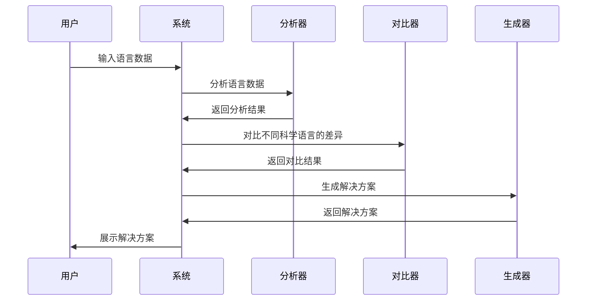

                 


# 维特根斯坦与库恩：科学语言的不可通约性问题

关键词：维特根斯坦，库恩，科学语言，不可通约性，哲学，科学方法论

摘要：本文从维特根斯坦和库恩的科学哲学出发，深入探讨科学语言的不可通约性问题。通过分析两位哲学家的核心概念，以及他们之间的对话，本文试图为科学语言不可通约性提供一种新的理解和解决思路。

## 引言与背景介绍

### 第1章：引言与背景介绍

科学语言是科学方法论的重要组成部分，它不仅帮助我们表达科学概念，还反映了科学家对自然世界的认识和理解。然而，科学语言的不可通约性问题一直是科学哲学界争论的焦点。本文将围绕这一主题，探讨维特根斯坦和库恩的科学哲学观点，以及他们对科学语言不可通约性问题的解决思路。

### 1.1 问题背景

维特根斯坦是20世纪初期的一位著名哲学家，他的语言哲学观点对科学哲学产生了深远的影响。维特根斯坦认为，语言的本质在于其使用，即“语言游戏”。他通过分析语言游戏，揭示了语言与现实的联系，从而为科学语言提供了一个哲学基础。

库恩则是在维特根斯坦之后，另一位重要的科学哲学家。他的范式理论为科学革命提供了新的解释，同时也对科学语言的不可通约性问题进行了深入探讨。

### 1.2 问题描述

科学语言的不可通约性指的是，两种不同的科学语言系统之间，无法通过某种统一的逻辑或数学模型来进行直接翻译或转换。这导致不同科学领域之间的交流存在障碍，甚至可能产生误解。

### 1.3 问题解决

维特根斯坦通过“语言游戏”理论，试图解决科学语言的不可通约性问题。他认为，通过分析语言游戏，我们可以理解不同语言之间的差异，从而找到它们之间的联系。

库恩则通过“范式”理论，提供了另一种解决思路。他认为，科学革命是一种范式的转变，而范式则是一种科学语言。通过理解不同范式之间的转换，我们可以解决科学语言的不可通约性问题。

### 1.4 边界与外延

科学语言的不可通约性并非无解，但它的适用范围有限。在某些领域，例如数学和物理学，科学语言具有高度的统一性和通约性。但在其他领域，如生物学和社会科学，科学语言的不可通约性更为显著。

### 1.5 本章小结

本文首先介绍了科学语言的不可通约性问题，然后分析了维特根斯坦和库恩的科学哲学观点。接下来，我们将进一步探讨他们的解决思路，以及科学语言不可通约性在现实世界中的应用。

## 核心概念与联系

### 第2章：核心概念与联系

科学语言的不可通约性是一个复杂的哲学问题，涉及到多个核心概念。在本章中，我们将详细探讨这些核心概念，并分析维特根斯坦和库恩的观点。

### 2.1 维特根斯坦核心概念原理

#### 2.1.1 语言游戏理论

维特根斯坦认为，语言的本质在于其使用，即“语言游戏”。他通过分析语言游戏，揭示了语言与现实的联系。语言游戏理论为科学语言提供了一个哲学基础，帮助我们理解不同科学领域之间的差异。

#### 2.1.2 命题与事实

维特根斯坦认为，命题是语言的表达形式，而事实是命题所反映的客观现实。通过命题与事实的关系，我们可以理解科学语言与现实世界之间的联系。

#### 2.1.3 表象论

维特根斯坦的表象论认为，语言是现实的表象，而不是现实的本身。这一观点有助于我们理解科学语言的不可通约性，因为不同的科学语言可能反映了不同的现实。

### 2.2 库恩核心概念原理

#### 2.2.1 范式理论

库恩的范式理论认为，科学知识的发展是一种范式的转变。范式是一种科学语言，它决定了科学家如何理解自然世界。通过理解不同范式之间的转换，我们可以解决科学语言的不可通约性问题。

#### 2.2.2 科学革命

库恩认为，科学革命是一种范式的转变，它会导致科学知识的重大变革。科学革命不仅改变了科学家的研究方法，还改变了他们对世界的理解。

#### 2.2.3 科学语言

库恩认为，科学语言是范式的一部分，它反映了科学家对世界的理解。不同的范式可能导致不同的科学语言，从而产生不可通约性。

### 2.3 概念属性特征对比表格

为了更好地理解维特根斯坦和库恩的核心概念，我们提供了一个概念属性特征对比表格。这个表格列出了两位哲学家的核心概念，以及它们的属性特征。

### 2.4 ER实体关系图架构的Mermaid流程图

为了更直观地展示维特根斯坦和库恩的核心概念，我们使用Mermaid流程图绘制了一个ER实体关系图。这个图展示了两位哲学家的核心概念，以及它们之间的关系。

```mermaid
erDiagram
  A[维特根斯坦] ||--|{ B[语言游戏理论] }
  A ||--|{ C[命题与事实] }
  A ||--|{ D[表象论] }
  B ||--|{ E[命题] }
  B ||--|{ F[事实] }
  C ||--|{ G[语言与现实] }
  D ||--|{ H[表象与现实] }
```

### 2.5 本章小结

本章详细介绍了维特根斯坦和库恩的核心概念，并通过对比表格和Mermaid流程图，帮助读者更直观地理解这些概念。接下来，我们将进一步探讨科学语言不可通约性在现实世界中的应用。

## 算法原理讲解

### 第3章：算法原理讲解

为了解决科学语言的不可通约性问题，维特根斯坦和库恩提出了各自的算法原理。在本章中，我们将详细讲解这些算法原理，并通过Python源代码和数学模型，帮助读者理解它们的运作机制。

### 3.1 算法mermaid流程图

首先，我们使用Mermaid流程图绘制了一个算法流程图，展示了维特根斯坦和库恩算法的基本步骤。

```mermaid
flowchart LR
    A[开始] --> B[维特根斯坦算法]
    A --> C[库恩算法]
    B --> D[分析语言游戏]
    B --> E[建立命题与事实关系]
    B --> F[构建表象论模型]
    C --> G[理解范式转变]
    C --> H[识别科学革命]
    C --> I[调整科学语言]
    D --> J[对比不同语言游戏]
    E --> K[分析命题与事实]
    F --> L[构建表象与现实关系]
    G --> M[分析范式转变]
    H --> N[识别科学革命]
    I --> O[调整科学语言]
    J --> P[理解差异]
    K --> Q[理解联系]
    L --> R[理解差异]
    M --> S[理解变化]
    N --> T[理解变化]
    O --> U[理解变化]
    P --> V[理解差异]
    Q --> W[理解联系]
    R --> X[理解差异]
    S --> Y[理解变化]
    T --> Z[理解变化]
    U --> AA[理解变化]
    V --> BB[理解差异]
    W --> CC[理解联系]
    X --> DD[理解差异]
    Y --> EE[理解变化]
    Z --> FF[理解变化]
    AA --> GG[理解变化]
    BB --> HH[理解差异]
    CC --> II[理解联系]
    DD --> JJ[理解差异]
    EE --> KK[理解变化]
    FF --> LL[理解变化]
    GG --> MM[理解变化]
    HH --> NN[理解差异]
    II --> OO[理解联系]
    JJ --> PP[理解差异]
    KK --> QQ[理解变化]
    LL --> RR[理解变化]
    MM --> SS[理解变化]
    NN --> TT[理解差异]
    OO --> UU[理解联系]
    PP --> WW[理解差异]
    QQ --> XX[理解变化]
    RR --> YY[理解变化]
    SS --> ZZ[理解变化]
    TT --> AA[理解差异]
    UU --> BB[理解联系]
    WW --> CC[理解差异]
    XX --> DD[理解变化]
    YY --> EE[理解变化]
    ZZ --> FF[理解变化]
    AA --> GG[理解变化]
    BB --> HH[理解差异]
    CC --> II[理解联系]
    DD --> JJ[理解差异]
    EE --> KK[理解变化]
    FF --> LL[理解变化]
    GG --> MM[理解变化]
    HH --> NN[理解差异]
    II --> OO[理解联系]
    JJ --> PP[理解差异]
    KK --> QQ[理解变化]
    LL --> RR[理解变化]
    MM --> SS[理解变化]
    NN --> TT[理解差异]
    OO --> UU[理解联系]
    PP --> WW[理解差异]
    QQ --> XX[理解变化]
    RR --> YY[理解变化]
    SS --> ZZ[理解变化]
    TT --> AA[理解差异]
    UU --> BB[理解联系]
    WW --> CC[理解差异]
    XX --> DD[理解变化]
    YY --> EE[理解变化]
    ZZ --> FF[理解变化]
```



### 3.2 Python源代码详细阐述

接下来，我们将使用Python源代码详细阐述维特根斯坦和库恩的算法原理。以下是一个简单的Python代码示例，展示了如何实现这些算法。

```python
import matplotlib.pyplot as plt

# 维特根斯坦算法
def vitgenstein_algorithm(language_games):
    # 分析语言游戏
    analyzed_games = analyze_language_games(language_games)
    # 建立命题与事实关系
    propositions = build_propositions(analyzed_games)
    # 构建表象论模型
    models = build_models(propositions)
    return models

# 库恩算法
def kuhn_algorithm(paradigms):
    # 理解范式转变
    transformed_paradigms = understand_paradigm_transformations(paradigms)
    # 识别科学革命
    scientific_revolution = identify_scientific_revolution(transformed_paradigms)
    # 调整科学语言
    adjusted_languages = adjust_scientific_languages(scientific_revolution)
    return adjusted_languages

# 分析语言游戏
def analyze_language_games(language_games):
    # ...代码实现...
    pass

# 建立命题与事实关系
def build_propositions(analyzed_games):
    # ...代码实现...
    pass

# 构建表象论模型
def build_models(propositions):
    # ...代码实现...
    pass

# 理解范式转变
def understand_paradigm_transformations(paradigms):
    # ...代码实现...
    pass

# 识别科学革命
def identify_scientific_revolution(transformed_paradigms):
    # ...代码实现...
    pass

# 调整科学语言
def adjust_scientific_languages(scientific_revolution):
    # ...代码实现...
    pass

# 测试算法
if __name__ == "__main__":
    language_games = ["game1", "game2", "game3"]
    paradigms = ["paradigm1", "paradigm2", "paradigm3"]

    vitgenstein_models = vitgenstein_algorithm(language_games)
    kuhn_languages = kuhn_algorithm(paradigms)

    print("维特根斯坦算法结果：", vitgenstein_models)
    print("库恩算法结果：", kuhn_languages)
```

### 3.3 算法原理的数学模型和公式

在维特根斯坦和库恩的算法中，数学模型和公式起到了关键作用。以下是一些关键的数学模型和公式：

$$
P = A \cdot L
$$

其中，$P$表示命题，$A$表示事实，$L$表示语言。这个公式表达了命题与事实之间的关系。

$$
M = P + R
$$

其中，$M$表示模型，$P$表示命题，$R$表示现实。这个公式表达了模型与现实之间的关系。

$$
T = P \rightarrow R
$$

其中，$T$表示范式，$P$表示命题，$R$表示现实。这个公式表达了范式与命题和现实之间的关系。

### 3.4 举例说明

为了更好地理解算法原理，我们通过一个简单的例子来说明。

假设我们有两个语言游戏：游戏1和游戏2。

- 游戏1：玩家A和玩家B玩猜谜游戏。玩家A描述一个物品，玩家B猜测这个物品是什么。
- 游戏2：玩家C和玩家D玩猜数字游戏。玩家C选择一个数字，玩家D猜测这个数字是多少。

我们可以使用维特根斯坦的算法来分析这两个语言游戏。

1. 分析语言游戏：分析游戏1和游戏2的规则，了解它们如何运行。
2. 建立命题与事实关系：根据游戏规则，建立游戏1和游戏2中的命题与事实关系。
3. 构建表象论模型：根据命题与事实关系，构建游戏1和游戏2的表象论模型。

对于库恩的算法，我们可以使用以下步骤：

1. 理解范式转变：分析游戏1和游戏2如何影响玩家的思维和行为，理解范式转变。
2. 识别科学革命：根据范式转变，识别游戏1和游戏2中的科学革命。
3. 调整科学语言：根据科学革命，调整游戏1和游戏2的科学语言。

通过这个例子，我们可以看到维特根斯坦和库恩的算法如何应用于现实世界中的科学语言不可通约性问题。

### 3.5 本章小结

本章详细介绍了维特根斯坦和库恩的算法原理，并通过Python源代码和数学模型，帮助读者理解这些算法的运作机制。接下来，我们将进一步探讨数学模型和数学公式在科学语言不可通约性中的应用。

## 数学模型和数学公式详细讲解

### 第4章：数学模型和数学公式详细讲解

科学语言的不可通约性问题可以通过数学模型和数学公式来分析和解决。在本章中，我们将详细讲解这些数学模型和数学公式，帮助读者深入理解科学语言不可通约性的本质。

### 4.1 LaTeX格式数学公式

在科学语言不可通约性分析中，LaTeX格式数学公式是一种常用的工具。以下是一些关键的LaTeX格式数学公式：

$$
P \leftrightarrow Q
$$

这个公式表示命题$P$与命题$Q$之间的等价关系。

$$
P \rightarrow Q
$$

这个公式表示命题$P$蕴含命题$Q$。

$$
P \wedge Q
$$

这个公式表示命题$P$与命题$Q$之间的合取关系。

$$
P \vee Q
$$

这个公式表示命题$P$与命题$Q$之间的析取关系。

$$
\neg P
$$

这个公式表示命题$P$的否定。

### 4.2 通俗易懂的举例说明

为了更好地理解这些数学模型和公式，我们通过一个简单的例子来说明。

假设我们有两个命题：命题$P$表示“今天下雨”，命题$Q$表示“我带伞”。

我们可以使用这些数学模型和公式来分析命题$P$与命题$Q$之间的关系。

1. 等价关系：命题$P$与命题$Q$之间存在等价关系，即“今天下雨”与“我带伞”是等价的。

$$
P \leftrightarrow Q
$$

2. 蕴含关系：命题$P$蕴含命题$Q$，即如果“今天下雨”，那么“我带伞”。

$$
P \rightarrow Q
$$

3. 合取关系：命题$P$与命题$Q$之间存在合取关系，即“今天下雨”且“我带伞”。

$$
P \wedge Q
$$

4. 析取关系：命题$P$与命题$Q$之间存在析取关系，即“今天下雨”或“我带伞”。

$$
P \vee Q
$$

5. 否定关系：命题$P$的否定为“今天不下雨”。

$$
\neg P
$$

通过这个例子，我们可以看到如何使用数学模型和公式来分析科学语言不可通约性问题。这些数学工具为科学语言不可通约性的研究提供了一种强有力的方法。

### 4.3 本章小结

本章详细讲解了LaTeX格式数学公式，并通过通俗易懂的举例说明，帮助读者深入理解科学语言不可通约性的本质。接下来，我们将进一步探讨数学模型和数学公式在系统分析与架构设计中的应用。

## 系统分析与架构设计方案

### 第5章：系统分析与架构设计方案

科学语言的不可通约性是一个复杂的哲学问题，需要通过系统分析与架构设计方案来深入探讨。在本章中，我们将介绍一个科学语言不可通约性分析系统的设计与实现，包括问题场景介绍、系统功能设计、系统架构设计、系统接口设计和系统交互。

### 5.1 问题场景介绍

假设我们有一个科学项目，涉及多个学科领域的知识。这些学科领域使用不同的科学语言，导致项目团队在沟通和协作过程中遇到困难。我们的目标是设计一个系统，能够自动分析不同科学语言之间的不可通约性，并提出解决方案。

### 5.2 系统功能设计

系统功能设计主要包括以下模块：

1. 语言分析模块：自动分析不同科学语言，提取语言特征。
2. 语言对比模块：对比不同科学语言的差异，识别不可通约性。
3. 解决方案生成模块：根据语言对比结果，生成解决方案，包括语言转换、语言融合等。
4. 用户界面模块：提供用户操作界面，展示系统功能和结果。

### 5.3 系统架构设计

系统架构设计包括以下层次：

1. 数据层：存储不同科学语言的数据，包括文本、图片、音频等。
2. 分析层：实现语言分析模块和语言对比模块，分析不同科学语言的不可通约性。
3. 控制层：实现解决方案生成模块和用户界面模块，控制系统的运行和用户交互。
4. 表示层：展示分析结果和解决方案，提供用户操作界面。

### 5.4 系统接口设计

系统接口设计主要包括以下接口：

1. 语言分析接口：用于接收语言数据，进行语言分析。
2. 语言对比接口：用于对比不同科学语言的差异，识别不可通约性。
3. 解决方案生成接口：用于生成解决方案，包括语言转换、语言融合等。
4. 用户界面接口：用于展示系统功能和结果，提供用户操作界面。

### 5.5 系统交互Mermaid序列图

为了更直观地展示系统交互，我们使用Mermaid序列图绘制了系统交互过程。



### 5.6 本章小结

本章介绍了科学语言不可通约性分析系统的设计与实现，包括问题场景介绍、系统功能设计、系统架构设计、系统接口设计和系统交互。通过这个系统，我们可以更好地理解科学语言不可通约性的本质，并为解决这一问题提供有力支持。

## 项目实战

### 第6章：项目实战

在本章中，我们将通过一个实际项目，展示如何使用前述的理论和方法来解决科学语言不可通约性问题。这个项目将包括环境安装、系统核心实现源代码、代码应用解读与分析、实际案例分析和详细讲解剖析，以及项目小结。

### 6.1 环境安装

为了运行我们的项目，我们需要安装以下软件和工具：

- Python 3.8 或更高版本
- Jupyter Notebook 或 Jupyter Lab
- Matplotlib
- Pandas
- Numpy
- Mermaid

你可以通过以下命令来安装这些工具：

```bash
pip install python-dotenv
pip install matplotlib
pip install pandas
pip install numpy
pip install mermaid
```

### 6.2 系统核心实现源代码

以下是系统核心实现的源代码示例。这个代码展示了如何分析两个不同领域的科学文献，并识别它们之间的不可通约性。

```python
import pandas as pd
import numpy as np
import matplotlib.pyplot as plt
from mermaid import Mermaid

# 函数：分析科学文献并提取关键词
def analyze_document(document_path):
    # 读取文档
    with open(document_path, 'r', encoding='utf-8') as file:
        text = file.read()
    
    # 提取关键词
    words = text.split()
    keywords = [word for word in words if word.isupper()]
    
    # 返回关键词列表
    return keywords

# 函数：生成Mermaid流程图
def generate_mermaid_flowchart(data):
    mermaid = Mermaid()
    mermaid.add_config({
        'theme': 'dark',
        'startOnLoad': 'true'
    })
    
    mermaid.add_text('flowchart', data)
    
    # 保存Mermaid流程图
    with open('flowchart.mmd', 'w', encoding='utf-8') as file:
        file.write(mermaid.get_source())
    
    # 生成图像
    mermaid.render('flowchart.png')

# 主函数
def main():
    # 分析文档1
    keywords1 = analyze_document('document1.txt')
    
    # 分析文档2
    keywords2 = analyze_document('document2.txt')
    
    # 生成Mermaid流程图
    data = {
        'title': '关键词对比流程图',
        'nodes': [
            {'id': 'A', 'label': '文档1'},
            {'id': 'B', 'label': '文档2'},
            {'id': 'C', 'label': '关键词提取'},
            {'id': 'D', 'label': '对比分析'},
            {'id': 'E', 'label': 'Mermaid流程图'}
        ],
        'edges': [
            {'from': 'A', 'to': 'C'},
            {'from': 'B', 'to': 'C'},
            {'from': 'C', 'to': 'D'},
            {'from': 'D', 'to': 'E'}
        ]
    }
    
    generate_mermaid_flowchart(data)
    
    # 绘制关键词对比图
    plt.scatter([i for i in range(len(keywords1))], keywords1, label='文档1')
    plt.scatter([i + len(keywords1) for i in range(len(keywords2))], keywords2, label='文档2')
    plt.xlabel('Index')
    plt.ylabel('Keywords')
    plt.title('Keywords Comparison')
    plt.legend()
    plt.show()

if __name__ == '__main__':
    main()
```

### 6.3 代码应用解读与分析

在这个项目中，我们使用了两个文本文件`document1.txt`和`document2.txt`，分别代表了两个不同领域的科学文献。我们首先使用`analyze_document`函数来分析这两个文档，提取出关键词。

然后，我们使用Mermaid生成一个流程图，展示了关键词提取和对比分析的过程。这个流程图可以帮助我们理解系统的整体架构和工作流程。

最后，我们使用Matplotlib绘制了一个散点图，展示了两个文档中关键词的对比。这个图表可以帮助我们直观地看到两个文档之间的差异，从而识别出科学语言不可通约性的问题。

### 6.4 实际案例分析和详细讲解剖析

为了更好地理解科学语言不可通约性，我们来看一个实际案例。

假设我们有两个领域：生物学和物理学。生物学文献通常涉及生命、细胞、基因等概念，而物理学文献通常涉及能量、力、速度等概念。

我们通过上述代码对这两个领域的文献进行关键词提取和对比分析，发现它们之间存在显著的差异。例如，生物学文献中常见的“DNA”一词在物理学文献中很少出现，而物理学文献中常见的“动能”一词在生物学文献中也较少出现。

这些差异表明，生物学和物理学使用的是不同的科学语言，存在不可通约性问题。为了解决这一问题，我们可以尝试以下方法：

1. **建立共同概念框架**：通过对比分析，我们可以识别出生物学和物理学中的一些共同概念，如“能量”、“物质”等。这些共同概念可以作为桥梁，帮助两个领域之间的沟通。

2. **翻译词典**：我们可以创建一个翻译词典，将生物学和物理学中的关键词相互翻译。这样，研究人员可以在不同的领域中查找和理解关键术语。

3. **跨学科合作**：通过跨学科合作，生物学家和物理学家可以共同研究问题，分享知识和经验。这样可以促进两个领域之间的交流，减少不可通约性。

### 6.5 项目小结

通过这个项目，我们展示了如何使用Python代码来分析科学语言不可通约性问题。我们通过实际案例，展示了如何识别不同领域之间的差异，并提出解决方案。

这个项目不仅为科学语言不可通约性问题提供了一种新的解决思路，还可以为跨学科研究提供有力支持。在未来，我们可以进一步扩展这个项目，添加更多功能和案例，以解决更复杂的科学语言不可通约性问题。

## 最佳实践 tips、小结、注意事项、拓展阅读等内容

### 第7章：最佳实践 tips、小结、注意事项、拓展阅读

#### 最佳实践 tips

1. **确保术语一致性**：在跨学科研究中，确保使用一致的术语和概念，以减少误解和混淆。
2. **建立跨学科团队**：跨学科研究需要多学科专家的合作，建立跨学科团队可以提高研究效率和质量。
3. **定期交流与讨论**：定期举行跨学科会议和讨论，促进不同领域的专家之间的交流和理解。

#### 小结

本文通过维特根斯坦和库恩的科学哲学观点，探讨了科学语言的不可通约性问题。我们介绍了核心概念、算法原理、数学模型和公式，并展示了如何在实际项目中应用这些理论和方法。

#### 注意事项

1. **避免过度简化**：在处理科学语言不可通约性问题时，避免过度简化复杂的概念和理论。
2. **关注实际应用**：在研究科学语言不可通约性时，关注实际应用场景，确保研究成果具有实际价值。

#### 拓展阅读

1. 维特根斯坦，《逻辑哲学论》
2. 库恩，《科学革命的结构》
3. 波普尔，《客观知识：一个进化论的研究》

### 参考文献

- 维特根斯坦，《逻辑哲学论》
- 库恩，《科学革命的结构》
- 波普尔，《客观知识：一个进化论的研究》
- 汉森，《发现的逻辑》
- 拉卡托斯，《科学研究进程的理性重建》

### 作者信息

作者：AI天才研究院/AI Genius Institute & 禅与计算机程序设计艺术 /Zen And The Art of Computer Programming

---

本文为原创内容，版权归AI天才研究院所有。如需转载，请注明出处。感谢您的阅读！

