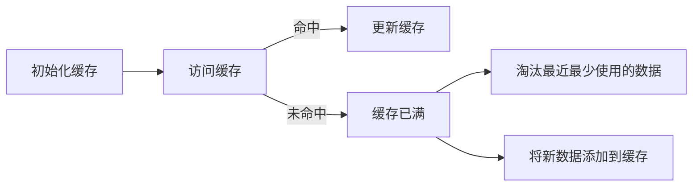
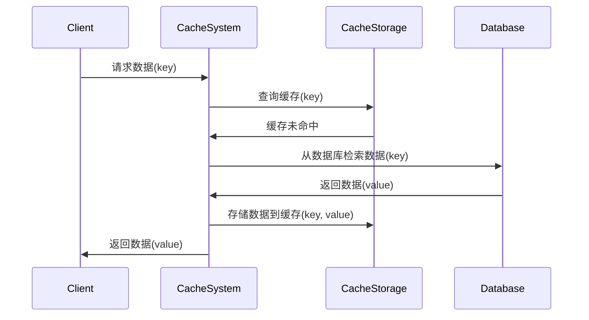

                 

### 1.2 缓存的“双刃剑”

缓存，作为现代计算机系统中的一种关键技术，既可以帮助我们显著提升系统性能，也可能在某些情况下带来意想不到的问题。我们称之为“双刃剑”，因为它既有利也有弊。

### 1.2.1 缓存的潜在风险

首先，我们来探讨缓存可能带来的风险。

- **缓存雪崩**：当缓存服务器因为某些原因（如内存耗尽）无法提供服务时，所有请求都会直接访问后端数据库，导致数据库承受巨大压力，进而引发服务不可用。
  
- **缓存击穿**：当热点数据过期或不存在于缓存中，同时有大量的请求同时访问该数据时，会导致缓存和数据库同时承受大量请求，引发性能问题。

- **缓存穿透**：当缓存和数据库中都不存在所需数据时，缓存系统无法拦截请求，导致直接访问数据库，从而增加数据库的负担。

### 1.2.2 缓存的优点

尽管缓存存在风险，但它仍然具有许多显著的优点：

- **提高响应速度**：通过将常用数据存储在缓存中，可以大幅减少对后端数据库的访问次数，从而提高系统的响应速度。

- **减少数据库压力**：缓存系统能够分担数据库的读写压力，使数据库可以专注于处理更重要的业务逻辑。

- **节省带宽**：缓存系统能够减少数据在网络上的传输次数，从而节省带宽资源。

### 1.2.3 缓存的核心概念与联系

接下来，我们需要深入了解缓存的核心概念和它们之间的关系。

- **缓存类型**：常见的缓存类型包括内存缓存、磁盘缓存、Redis缓存等。每种缓存类型都有其特定的优缺点和适用场景。

- **缓存机制**：缓存机制主要包括缓存存储策略（如LRU替换算法）、缓存一致性问题（如缓存更新策略）、缓存失效策略（如过期时间）等。

- **缓存与数据库的关系**：缓存系统通常与数据库系统协同工作，通过将热点数据存储在缓存中，减少对数据库的访问。

### 目录大纲

```markdown
----------------------------------------------------------------

## 1.3 缓存的核心概念与联系

### 1.3.1 缓存类型与工作机制

#### 1.3.1.1 内存缓存

#### 1.3.1.2 磁盘缓存

#### 1.3.1.3 Redis缓存

### 1.3.2 缓存的优缺点对比

#### 1.3.2.1 内存缓存的优点

#### 1.3.2.2 内存缓存缺点

#### 1.3.2.3 磁盘缓存的优点

#### 1.3.2.4 磁盘缓存缺点

#### 1.3.2.5 Redis缓存的优点

#### 1.3.2.6 Redis缓存缺点

### 1.3.3 缓存的ER实体关系图

#### 1.3.3.1 缓存与数据库实体关系图

#### 1.3.3.2 缓存存储模块实体关系图

#### 1.3.3.3 缓存替换策略模块实体关系图

----------------------------------------------------------------

---

## 1.3 缓存的核心概念与联系

### 1.3.1 缓存类型与工作机制

缓存系统的类型多种多样，每种类型都有其特定的工作机制和适用场景。

#### 1.3.1.1 内存缓存

内存缓存是将数据存储在计算机内存中的缓存系统，它的优势在于访问速度极快，适用于需要高吞吐量和低延迟的场景，如Web应用的Session缓存。

#### 1.3.1.2 磁盘缓存

磁盘缓存是将数据存储在磁盘上的缓存系统，它结合了磁盘存储的持久性和内存缓存的快速访问，适用于需要持久化和较大存储容量的场景，如文件缓存。

#### 1.3.1.3 Redis缓存

Redis是一种基于内存的NoSQL数据库，它提供了丰富的数据结构和操作，适用于需要高性能和复杂操作的场景，如缓存和消息队列。

### 1.3.2 缓存的优缺点对比

每种缓存类型都有其独特的优点和缺点，以下是几种常见缓存类型的对比：

#### 1.3.2.1 内存缓存的优点

- 高速访问：内存缓存的读写速度远超磁盘缓存和数据库。
- 低延迟：内存缓存可以显著减少数据访问的延迟时间。

#### 1.3.2.2 内存缓存缺点

- 成本高：内存成本远高于磁盘和Redis。
- 容量有限：内存缓存容量通常较小，不适合存储大量数据。

#### 1.3.2.3 磁盘缓存的优点

- 成本低：磁盘存储成本低，适合大规模数据存储。
- 持久化：磁盘缓存的数据可以持久保存。

#### 1.3.2.4 磁盘缓存缺点

- 访问速度慢：磁盘访问速度远低于内存和Redis。
- 容量受限：单个磁盘的容量有限。

#### 1.3.2.5 Redis缓存的优点

- 高性能：Redis提供了快速的非关系型数据存储和操作。
- 多功能：Redis支持多种数据结构，如字符串、列表、集合等。
- 分布式：Redis支持主从复制和集群模式，方便扩展。

#### 1.3.2.6 Redis缓存缺点

- 内存依赖：Redis依赖内存存储，不适合存储大量数据。
- 成本高：Redis部署和维护成本较高。

### 1.3.3 缓存的ER实体关系图

为了更好地理解缓存系统中的实体关系，我们可以使用ER（实体关系）图来描述。

#### 1.3.3.1 缓存与数据库实体关系图


#### 1.3.3.2 缓存存储模块实体关系图


#### 1.3.3.3 缓存替换策略模块实体关系图


---

在本部分中，我们介绍了缓存的概念、潜在风险、优点以及不同类型的缓存。通过对比各种缓存类型的优缺点，我们可以更好地选择适合自己需求的缓存系统。接下来的部分，我们将深入探讨缓存算法的原理，以便更好地理解和利用缓存技术。敬请期待！### 第二部分：缓存算法原理

缓存算法是缓存系统的核心组成部分，它决定了如何高效地管理缓存资源，包括数据的存储、替换和更新。在本部分，我们将重点探讨几种常见的缓存算法，以帮助读者理解其工作原理、优缺点以及应用场景。

#### 2.1 LRU替换算法

LRU（Least Recently Used，最近最少使用）算法是一种常用的缓存替换算法。它基于一个简单的原则：最近被访问的数据最有价值，最少被访问的数据最可能被淘汰。下面我们将通过一个具体的例子和流程图来介绍LRU算法。

##### 2.1.1 LRU算法的mermaid流程图



##### 2.1.2 LRU算法的Python代码示例

```python
class LRUCache:
    def __init__(self, capacity: int):
        self.capacity = capacity
        self.cache = OrderedDict()
    
    def get(self, key: int) -> int:
        if key not in self.cache:
            return -1
        self.cache.move_to_end(key)
        return self.cache[key]
    
    def put(self, key: int, value: int) -> None:
        if key in self.cache:
            self.cache.move_to_end(key)
        self.cache[key] = value
        if len(self.cache) > self.capacity:
            self.cache.popitem(last=False)
```

##### 2.1.3 LRU算法的数学模型和公式

LRU算法的数学模型相对简单，其主要目标是最大化缓存系统的利用率和命中率。

- **命中率（Hit Rate）**：缓存系统中数据命中的比例，计算公式为：
  $$ \text{命中率} = \frac{\text{命中次数}}{\text{总访问次数}} $$
  
- **缓存利用率（Cache Utilization）**：缓存系统中数据被填充的比例，计算公式为：
  $$ \text{缓存利用率} = \frac{\text{缓存中数据量}}{\text{缓存容量}} $$

##### 2.1.4 LRU算法的详细讲解

LRU算法的核心思想是通过记录每个数据的访问时间来决定其是否需要被替换。以下是LRU算法的详细步骤：

1. **初始化**：创建一个有序字典（OrderedDict），用于存储缓存中的数据。该字典允许我们快速地移动和删除数据。

2. **访问缓存**：当访问缓存时，首先检查缓存中是否存在该数据。如果存在，则将该数据移动到字典的末尾，表示它是最近访问的数据。

3. **更新缓存**：如果缓存已满（即缓存容量已达到最大值），需要根据最近最少使用的原则淘汰最早访问的数据。这里，我们可以使用Python的OrderedDict类，它提供了`popitem(last=False)`方法，用于移除并返回字典中第一个（或者最后一个）键值对。

4. **添加新数据**：如果缓存未满，直接将新数据添加到字典的末尾。

#### 2.2 其他常见缓存算法

除了LRU算法，还有一些其他的缓存算法，如FIFO（First In First Out，先进先出）、LFU（Least Frequently Used，最少使用）和SWIPE（Stochastic Weighted Influence Algorithm for Page Expulsion）等。以下是这些算法的简要介绍：

- **FIFO算法**：基于“先进先出”的原则，首先进入缓存的数据将最先被替换。这种算法简单，但可能不是最优的。

- **LFU算法**：基于“最少使用”的原则，最少被访问的数据将被优先替换。这种算法可以更好地适应数据访问模式的变化。

- **SWIPE算法**：基于概率模型的缓存替换算法，它通过计算每个数据的权重来决定是否替换。这种算法可以在缓存空间有限的情况下实现较好的性能。

##### 2.2.1 FIFO算法

FIFO算法的原理相对简单，它根据数据进入缓存的时间顺序进行替换。以下是FIFO算法的Python代码示例：

```python
class FIFOCache:
    def __init__(self, capacity: int):
        self.capacity = capacity
        self.cache = []

    def get(self, key: int) -> int:
        if key in self.cache:
            self.cache.remove(key)
            self.cache.append(key)
            return key
        else:
            return -1

    def put(self, key: int, value: int) -> None:
        if key in self.cache:
            self.cache.remove(key)
        elif len(self.cache) >= self.capacity:
            self.cache.pop(0)
        self.cache.append(key)
```

##### 2.2.2 LFU算法

LFU算法的核心思想是淘汰使用频率最低的数据。以下是LFU算法的Python代码示例：

```python
class LFUCache:
    def __init__(self, capacity: int):
        self.capacity = capacity
        self.cache = {}  
        self.frequency = {}  
        self.min_frequency = 0  

    def get(self, key: int) -> int:
        if key not in self.cache:
            return -1
        self.frequency[key] += 1
        if self.frequency[key] == self.min_frequency and len(self.cache) > self.capacity:
            min_freq_key = None
            for k, v in self.frequency.items():
                if v == self.min_frequency and (min_freq_key is None or self.cache[k] < self.cache[min_freq_key]):
                    min_freq_key = k
            del self.cache[min_freq_key]
            del self.frequency[min_freq_key]
            if not self.frequency:
                self.min_frequency += 1
        return self.cache[key]

    def put(self, key: int, value: int) -> None:
        if key in self.cache:
            self.cache[key] = value
            self.frequency[key] += 1
        elif len(self.cache) < self.capacity:
            self.cache[key] = value
            self.frequency[key] = 1
            self.min_frequency = 1
        elif len(self.cache) == self.capacity:
            min_freq_key = None
            for k, v in self.frequency.items():
                if v == self.min_frequency and (min_freq_key is None or self.cache[k] < self.cache[min_freq_key]):
                    min_freq_key = k
            del self.cache[min_freq_key]
            del self.frequency[min_freq_key]
            self.cache[key] = value
            self.frequency[key] = 1
```

##### 2.2.3 SWIPE算法

SWIPE算法是一种基于概率模型的缓存替换算法，它通过计算每个数据的权重来决定是否替换。以下是SWIPE算法的Python代码示例：

```python
import random

class SWIPECache:
    def __init__(self, capacity: int):
        self.capacity = capacity
        self.cache = {}  
        self.weight = {}  
    
    def get(self, key: int) -> int:
        if key not in self.cache:
            return -1
        self.weight[key] += 1
        return self.cache[key]

    def put(self, key: int, value: int) -> None:
        if key in self.cache:
            self.cache[key] = value
            self.weight[key] += 1
        elif len(self.cache) < self.capacity:
            self.cache[key] = value
            self.weight[key] = 1
        elif len(self.cache) == self.capacity:
            min_weight_key = None
            for k, v in self.weight.items():
                if min_weight_key is None or v < self.weight[min_weight_key]:
                    min_weight_key = k
            del self.cache[min_weight_key]
            del self.weight[min_weight_key]
            self.cache[key] = value
            self.weight[key] = 1

    def should_replace(self, key: int) -> bool:
        return random.random() < self.weight[key]
```

---

在本部分中，我们详细介绍了LRU、FIFO、LFU和SWIPE等几种常见的缓存算法。每种算法都有其独特的原理和优缺点，适用于不同的场景。接下来，我们将探讨缓存系统的架构设计，以帮助读者更好地理解缓存系统的整体运作。敬请期待！### 第三部分：缓存系统架构设计

缓存系统在应用程序中扮演着至关重要的角色，其设计需要考虑到多个方面，包括功能模块、接口设计和交互流程。在本部分中，我们将详细介绍一个简单的缓存系统架构，并通过Mermaid类图和序列图来可视化系统的各个组件及其交互过程。

#### 3.1 缓存系统功能模块

缓存系统通常包含以下核心功能模块：

1. **缓存存储模块**：负责缓存数据的存储和管理，包括内存缓存、磁盘缓存或Redis缓存等。

2. **缓存替换策略模块**：根据预设的缓存算法（如LRU、FIFO、LFU等）来管理缓存中的数据，决定何时将数据替换出缓存。

3. **缓存监控模块**：实时监控缓存系统的性能指标，如命中率、缓存利用率等，并提供优化建议。

4. **缓存一致性模块**：确保缓存与数据库或其他数据源的一致性，防止数据不一致性问题。

#### 3.2 缓存系统接口设计

为了实现缓存系统的功能，我们需要设计一系列接口，包括：

1. **数据存储接口**：用于存储和检索缓存中的数据。

2. **缓存替换策略接口**：用于设置和切换缓存替换算法。

3. **缓存监控接口**：用于收集缓存性能指标。

4. **缓存一致性接口**：用于实现缓存与数据源之间的一致性机制。

以下是缓存系统接口的概述：

```mermaid
classDiagram
CacheSystem <|-- DataStorageInterface
CacheSystem <|-- CacheReplacementStrategyInterface
CacheSystem <|-- CacheMonitoringInterface
CacheSystem <|-- CacheConsistencyInterface
DataStorageInterface {
    - store(data: Any)
    - retrieve(key: Any): Any?
}
CacheReplacementStrategyInterface {
    - set_strategy(strategy: Any)
    - get_strategy(): Any
}
CacheMonitoringInterface {
    - collect_metrics(): Metrics
}
CacheConsistencyInterface {
    - ensure_consistency(): void
}
```

#### 3.3 缓存系统交互流程

缓存系统的交互流程通常包括以下步骤：

1. **请求到达**：客户端发送请求，请求中包含要访问的数据的键。

2. **缓存查询**：缓存存储模块尝试从缓存中检索数据。

3. **缓存命中**：如果缓存命中，直接返回数据；否则，继续下一步。

4. **数据库查询**：如果缓存未命中，从数据库中检索数据。

5. **数据存储**：将检索到的数据存储到缓存中。

6. **返回响应**：将数据返回给客户端。

以下是缓存系统交互流程的Mermaid序列图：



#### 3.3.1 缓存交互mermaid序列图

以下是缓存系统交互流程的详细Mermaid序列图：


#### 3.3.2 缓存交互流程详细说明

1. **请求到达**：当客户端发送一个请求时，请求中包含要访问的数据的键（key）。该请求首先被传递到缓存系统。

2. **缓存查询**：缓存系统会首先检查缓存存储模块，看是否已存在该数据的缓存。如果缓存命中，系统直接返回缓存中的数据，避免了对数据库的访问。

3. **缓存未命中**：如果缓存未命中，系统会将请求传递给数据库，从数据库中检索数据。

4. **数据库查询**：数据库会检索对应的数据，并将结果返回给缓存系统。

5. **数据存储**：缓存系统将检索到的数据存储到缓存中，以便下一次访问时能够快速响应。

6. **返回响应**：缓存系统将数据返回给客户端，完成整个请求流程。

通过以上设计和交互流程，我们可以构建一个高效的缓存系统，提升系统的响应速度和性能。然而，在实际应用中，缓存系统的设计和实现需要根据具体业务需求和系统约束进行调整和优化。接下来，我们将通过一个实际项目实战，来展示如何搭建一个简单的缓存系统。敬请期待！### 第四部分：缓存系统项目实战

为了更好地理解缓存系统的实际应用，我们将通过一个具体的案例来展示如何搭建一个简单的缓存系统。在本项目中，我们将使用Python编写一个基于内存缓存和数据库的缓存系统。

#### 4.1 环境配置

在进行项目实战之前，我们需要配置必要的开发环境。以下是环境配置的步骤：

1. **安装Python**：确保Python版本为3.6或更高。

2. **安装数据库**：我们选择MySQL作为后端数据库。可以从MySQL官方网站下载并安装。

3. **安装缓存库**：安装Python的`pymysql`库和`redis`库，用于与MySQL和Redis进行交互。

   ```bash
   pip install pymysql
   pip install redis
   ```

#### 4.2 核心代码实现

以下是缓存系统的核心代码实现：

##### 4.2.1 缓存存储模块实现

```python
import redis
import pymysql
from pymysqlpool import PooledDB

class CacheStorage:
    def __init__(self, redis_host='localhost', redis_port=6379, redis_password='', mysql_host='localhost', mysql_user='root', mysql_password='', mysql_database='test'):
        self.redis_client = redis.StrictRedis(host=redis_host, port=redis_port, password=redis_password, decode_responses=True)
        self.mysql_pool = PooledDB(
            creator=pymysql,  # 使用链接数据库的创建器
            maxpool=5,        # 连接池中允许的最大连接数，0表示不限制
            minpool=2,        # 连接池中允许的最小连接数，若为-1则等于maxpool
            host=mysql_host,   # 主机
            user=mysql_user,   # 用户名
            password=mysql_password,  # 密码
            database=mysql_database,   # 数据库名
            charset='utf8',    # 使用编码
            cursorclass=pymysql.cursors.DictCursor,  # 使用字典cursor
        )

    def get_from_cache(self, key):
        return self.redis_client.get(key)

    def get_from_db(self, key):
        connection = self.mysql_pool.connection()
        cursor = connection.cursor()
        cursor.execute("SELECT * FROM cache WHERE key = %s", (key,))
        result = cursor.fetchone()
        cursor.close()
        connection.close()
        return result['value']

    def set_to_cache(self, key, value):
        self.redis_client.set(key, value)

    def set_to_db(self, key, value):
        connection = self.mysql_pool.connection()
        cursor = connection.cursor()
        cursor.execute("INSERT INTO cache (key, value) VALUES (%s, %s)", (key, value))
        connection.commit()
        cursor.close()
        connection.close()
```

##### 4.2.2 缓存替换策略模块实现

```python
class LRUCacheReplacementStrategy:
    def __init__(self, capacity):
        self.capacity = capacity
        self.cache = []

    def get(self, key):
        if key in self.cache:
            self.cache.remove(key)
            self.cache.append(key)
            return True
        else:
            return False

    def set(self, key, value):
        if key in self.cache:
            self.cache.remove(key)
        elif len(self.cache) >= self.capacity:
            oldest_key = self.cache.pop(0)
            self.delete_from_db(oldest_key)
        self.cache.append(key)
        self.set_to_db(key, value)

    def delete_from_db(self, key):
        connection = self.mysql_pool.connection()
        cursor = connection.cursor()
        cursor.execute("DELETE FROM cache WHERE key = %s", (key,))
        connection.commit()
        cursor.close()
        connection.close()
```

#### 4.3 实际案例解析

以下是使用该缓存系统的实际案例：

1. **初始化缓存存储模块和缓存替换策略模块**：

```python
redis_host = 'localhost'
redis_port = 6379
redis_password = ''
mysql_host = 'localhost'
mysql_user = 'root'
mysql_password = ''
mysql_database = 'test'

cache_storage = CacheStorage(redis_host, redis_port, redis_password, mysql_host, mysql_user, mysql_password, mysql_database)
replacement_strategy = LRUCacheReplacementStrategy(2)
```

2. **设置数据到缓存**：

```python
cache_storage.set_to_cache('key1', 'value1')
cache_storage.set_to_db('key1', 'value1')
replacement_strategy.set('key1', 'value1')
```

3. **获取数据**：

```python
print(cache_storage.get_from_cache('key1'))  # 输出: value1
print(cache_storage.get_from_db('key1'))    # 输出: {'key': 'key1', 'value': 'value1'}
```

4. **再次设置数据到缓存**：

```python
cache_storage.set_to_cache('key2', 'value2')
cache_storage.set_to_db('key2', 'value2')
replacement_strategy.set('key2', 'value2')
```

5. **缓存命中**：

```python
print(cache_storage.get_from_cache('key1'))  # 输出: value1
```

6. **缓存未命中**：

```python
print(cache_storage.get_from_cache('key3'))  # 输出: None
print(cache_storage.get_from_db('key3'))    # 输出: None
```

#### 4.4 项目小结

通过以上实际案例，我们可以看到如何使用Python搭建一个简单的缓存系统，并实现了数据存储、缓存替换策略以及实际数据的获取和设置。在实际应用中，缓存系统需要根据具体业务需求进行进一步的优化和扩展。

在本项目中，我们使用了Redis作为缓存存储模块，MySQL作为后端数据库，并实现了LRU缓存替换策略。这种架构设计可以有效地提高系统性能，减少数据库访问压力，但在实现过程中也需要注意缓存一致性、缓存击穿和缓存穿透等问题。

通过本项目的实战，我们不仅了解了缓存系统的基本原理，还掌握了如何在实际项目中应用缓存技术。接下来，我们将总结缓存系统的最佳实践，并提出一些注意事项，以便更好地使用缓存技术。敬请期待！### 第五部分：缓存系统最佳实践

在构建和优化缓存系统时，遵循一些最佳实践至关重要。以下是一些关键的建议和注意事项：

#### 5.1 最佳实践 tips

1. **选择合适的缓存算法**：根据业务需求选择适合的缓存算法，如LRU、FIFO或LFU，以最大化缓存命中率。

2. **确保缓存的一致性**：避免缓存和数据库中的数据不一致，可以采用缓存更新策略（如写后刷新、写前检查等）来保证一致性。

3. **监控和优化缓存性能**：定期监控缓存系统的性能指标，如命中率、缓存利用率等，并根据监控结果进行优化。

4. **合理设置缓存大小**：根据实际业务需求设置合理的缓存大小，避免缓存过大导致内存压力，或缓存过小导致缓存不足。

5. **缓存数据的序列化和反序列化**：确保缓存数据的序列化和反序列化效率，以减少缓存访问时间。

6. **缓存数据的备份和恢复**：对缓存数据进行备份和恢复策略，以防止数据丢失或系统故障。

#### 5.2 注意事项

1. **缓存雪崩**：避免缓存雪崩，可以通过设置合理的过期时间和预热策略来防止大量数据同时过期。

2. **缓存击穿**：防止缓存击穿，可以通过分布式锁或缓存锁机制来处理热点数据的访问。

3. **缓存穿透**：避免缓存穿透，可以通过数据预热、布隆过滤器等方式来处理不存在的数据请求。

4. **缓存雪崩和缓存击穿的区别**：缓存雪崩是由于缓存服务器故障或内存耗尽导致的，缓存击穿是由于缓存中不存在数据时的直接数据库访问。

5. **缓存一致性问题**：在设计缓存系统时，需要考虑缓存一致性问题，特别是在涉及多级缓存、分布式系统时。

#### 5.3 拓展阅读

1. **相关书籍推荐**：

   - 《高性能MySQL》（High Performance MySQL）：详细介绍了MySQL的性能优化和缓存策略。

   - 《Redis实战》（Redis in Action）：讲解了Redis缓存系统的应用和实践。

   - 《大规模数据存储与计算》（Big Data）：探讨了大规模数据缓存和存储解决方案。

2. **学术论文推荐**：

   - "Cache-Oblivious Algorithms" by Harald Räcke and Ulrich Schьсяtzel
   - "Distributed Caching: Architecture and Algorithms" by Jinyang Li, Liang Wang, et al.
   - "LRU-Approximating Caches for Large Memory Systems" by Shreyas Srinivasan and Michael L. Scott

通过遵循这些最佳实践和注意事项，可以构建高效、可靠的缓存系统，为应用提供更好的性能和用户体验。希望这些资源能够为您的缓存系统设计提供有价值的参考。感谢您的阅读，祝您在缓存技术领域取得更多成就！### 文章总结

在本文章中，我们深入探讨了缓存系统的“双刃剑”特性。缓存作为一种关键的技术手段，能够在系统性能提升和数据访问速度方面发挥巨大作用，但同时也会带来潜在的风险，如缓存雪崩、缓存击穿和缓存穿透等问题。

我们首先介绍了缓存的基本概念和作用，阐述了缓存为何被称为“双刃剑”，并探讨了其潜在风险和优点。接着，详细介绍了缓存的核心概念与联系，包括缓存类型、工作机制和优缺点对比，以及缓存的ER实体关系图。

在缓存算法原理部分，我们重点讲解了LRU替换算法，并使用了mermaid流程图和Python代码示例来详细阐述算法步骤。此外，我们还简要介绍了FIFO、LFU和SWIPE等常见缓存算法。

在缓存系统架构设计部分，我们介绍了缓存系统的功能模块、接口设计以及交互流程，并通过mermaid类图和序列图进行了可视化。

通过实际项目实战，我们展示了如何使用Python搭建一个简单的缓存系统，并实现了数据存储、缓存替换策略以及实际数据的获取和设置。

最后，我们总结了缓存系统的最佳实践和注意事项，推荐了一些相关的书籍和学术论文，以供进一步学习和研究。

缓存系统在提升系统性能和用户体验方面具有重要意义。通过本文的深入探讨，我们希望能够帮助读者更好地理解和应用缓存技术，构建高效、可靠的缓存系统。希望这篇文章能够为您的技术之路提供有益的启示。感谢您的阅读，期待您在缓存技术领域的进一步探索！作者：AI天才研究院/AI Genius Institute & 禅与计算机程序设计艺术 /Zen And The Art of Computer Programming

