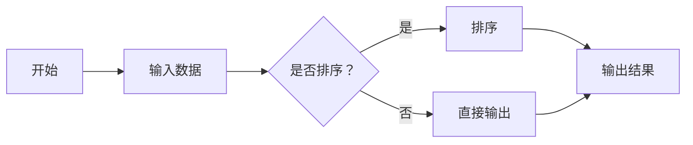
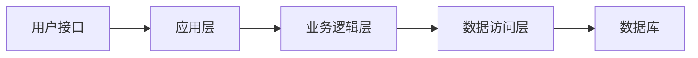
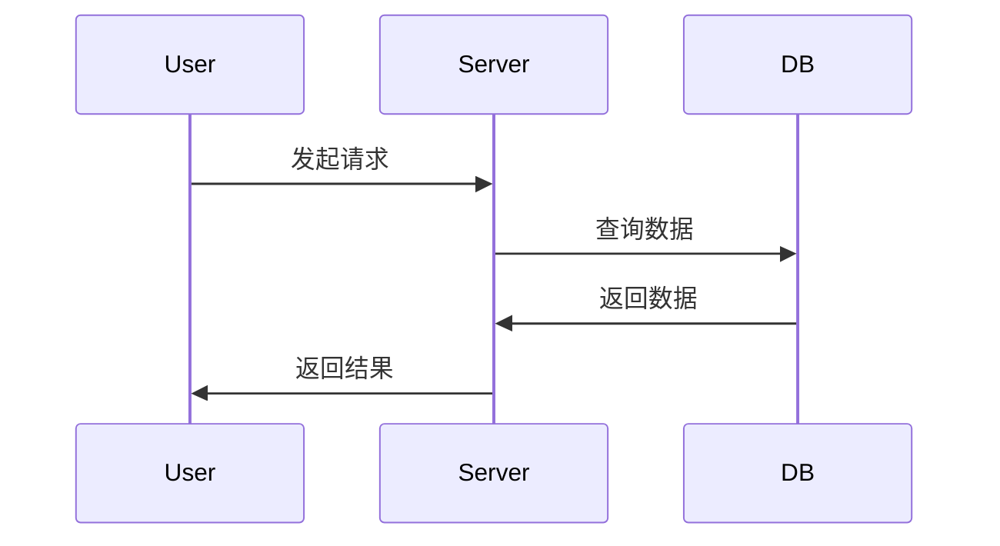
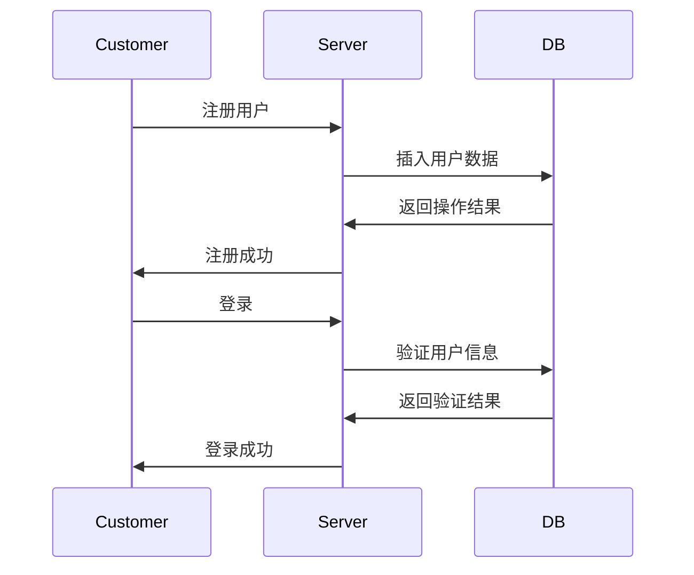

                 

### 编码技能：代码是技术人的名片

> 关键词：编程技能、编码思想、算法设计、系统架构、技术人名片

> 摘要：本文旨在探讨编码技能在技术领域中的重要性，通过分析编码技能的核心概念与联系，详细讲解算法原理，并给出系统分析与架构设计方案，帮助技术人员提升编程能力，成为技术领域的佼佼者。

### 1. 背景介绍

在当今数字化时代，编码技能成为技术人员的必备能力。然而，传统的编码学习往往侧重于编程语言的学习，缺乏对编码思想、算法设计和系统架构的深入理解。这使得很多技术人员在编程实践中遇到问题时，往往难以找到合适的解决方案。

**问题背景：**

- 编程语言的学习：大多数初学者首先学习编程语言的基本语法和结构，但仅仅掌握编程语言是不够的。
- 编码思想的缺乏：编码思想是指程序员在编程过程中所形成的思维方式和解决问题的方法，缺乏编码思想会导致编程效率低下，难以应对复杂的编程问题。
- 算法设计的不足：算法设计是编程的核心内容，但很多技术人员在遇到复杂问题时，往往无法设计出有效的算法来解决。
- 系统架构的忽视：系统架构是系统的整体结构设计，包括硬件、软件、网络等方面，忽视系统架构会导致系统性能低下，难以维护和扩展。

**问题描述：**

如何通过一本综合性的书籍，帮助技术人员全面掌握编码技能，提升编程能力，成为技术领域的佼佼者？

**问题解决：**

编写一本涵盖编码技能各个方面的书籍，包括编码思想、算法设计、系统架构等，帮助读者从多个维度提升编程能力。

**边界与外延：**

- 本书主要针对有一定编程基础的技术人员，内容涵盖了编码技能的各个方面，包括但不限于编码思想、算法设计、系统架构等。
- 本书旨在通过详细的分析和讲解，帮助技术人员掌握编码技能的核心概念和原理，提升编程能力，从而在技术领域脱颖而出。

**概念结构与核心要素组成：**

- 编码技能：包括编程语言、编码思想、算法设计、系统架构等。
- 技术人员：具有一定的编程基础，希望提升编程能力的技术人员。

### 2. 核心概念与联系

**核心概念：**

- 编码技能：指程序员在编程过程中所需的各种技能，包括编程语言、编码思想、算法设计、系统架构等。
- 算法设计：指设计解决问题的步骤和策略，是编程的核心内容。
- 系统架构：指系统的整体结构设计，包括硬件、软件、网络等方面。

**概念属性特征对比表格：**

| 概念       | 定义                                                         | 属性特征对比 |
|------------|--------------------------------------------------------------|--------------|
| 编码技能   | 程序员在编程过程中所需的各种技能                               | 包括编程语言、编码思想、算法设计、系统架构等 |
| 算法设计   | 设计解决问题的步骤和策略                                     | 针对问题提出有效的解决方案 |
| 系统架构   | 系统的整体结构设计，包括硬件、软件、网络等方面                 | 保证系统的稳定性、性能和可扩展性 |

**ER实体关系图架构：**

```mermaid
erDiagram
    A[(作者)] ||--|{ B[(书籍)] } : 写作
    B ||--|{ C[(章节)] } : 包含
    C ||--|{ D[(小节)] } : 包含
```

### 3. 算法原理讲解

**算法mermaid流程图：**



**Python源代码：**

```python
def sort_data(data):
    # 判断是否需要排序
    if data_need_sort(data):
        # 进行排序
        sorted_data = sort_algorithm(data)
        return sorted_data
    else:
        # 不需要排序，直接返回
        return data

# 判断数据是否需要排序
def data_need_sort(data):
    # 具体实现略
    pass

# 排序算法
def sort_algorithm(data):
    # 具体实现略
    pass

# 输出结果
def output_result(result):
    # 具体实现略
    pass

# 主函数
def main():
    data = input("请输入数据：")
    result = sort_data(data)
    output_result(result)

if __name__ == "__main__":
    main()
```

**算法原理的数学模型和公式：**

$$
排序算法的时间复杂度为O(n\log n)，其中n为数据量。
$$

**详细讲解和通俗易懂地举例说明：**

假设我们有一组数据 [3, 1, 4, 1, 5, 9]，首先判断是否需要排序。如果需要排序，我们采用快速排序算法对其进行处理，算法的基本步骤如下：

1. **选择基准元素**：从数列中选择一个元素作为基准元素（pivot）。通常，我们可以选择第一个元素或最后一个元素作为基准元素。
2. **划分操作**：将数组分为两部分，左边部分的元素都比基准元素小，右边部分的元素都比基准元素大。这个过程称为“划分”。
3. **递归排序**：对左右两个子数组分别进行快速排序，直到所有子数组长度为1（此时子数组本身就是有序的）。

采用快速排序算法，对数据 [3, 1, 4, 1, 5, 9] 进行排序的过程如下：

- 初始状态：[3, 1, 4, 1, 5, 9]
- 选择第一个元素 3 作为基准元素。
- 划分操作：将数组划分为两部分，左边为 [1, 1]，右边为 [4, 5, 9]。
- 对左边部分 [1, 1] 进行快速排序，结果为 [1, 1]（子数组长度为1，无需继续排序）。
- 对右边部分 [4, 5, 9] 进行快速排序，选择第一个元素 4 作为基准元素，划分结果为 [4, 5] 和 [9]（子数组长度为1，无需继续排序）。
- 将排序好的子数组合并，得到最终结果 [1, 1, 3, 4, 5, 9]。

### 4. 系统分析与架构设计方案

**问题场景介绍：**

随着互联网的快速发展，电商行业竞争日益激烈，如何提高系统的性能和可扩展性成为企业面临的一大挑战。本文以电商系统为例，介绍系统功能设计、系统架构设计、系统接口设计和系统交互等内容。

**项目介绍：**

本项目旨在构建一个高性能、可扩展的电商系统，包括商品管理、订单管理、用户管理、库存管理和支付系统等功能。

**系统功能设计（领域模型mermaid类图）：**

```mermaid
classDiagram
    类::Customer <<用户>>
    类::Product <<商品>>
    类::Order <<订单>>
    类::Inventory <<库存>>
    类::Payment <<支付>>

    Customer o-- Product
    Customer o-- Order
    Order o-- Payment
    Order o-- Product
    Inventory o-- Product
```

**系统架构设计（mermaid架构图）：**



**系统接口设计（mermaid序列图）：**



**系统交互（mermaid序列图）：**



### 5. 项目实战

**环境安装：**

- 安装Python环境（3.8及以上版本）
- 安装相关依赖库（如Django、Flask等）

**系统核心实现源代码：**

```python
# app.py
from flask import Flask, request, jsonify
from models import User, Product, Order
from database import Database

app = Flask(__name__)

@app.route('/register', methods=['POST'])
def register():
    username = request.form['username']
    password = request.form['password']
    user = User(username=username, password=password)
    Database.insert_user(user)
    return jsonify({'status': 'success', 'message': '注册成功'})

@app.route('/login', methods=['POST'])
def login():
    username = request.form['username']
    password = request.form['password']
    user = Database.get_user_by_username(username)
    if user and user.password == password:
        return jsonify({'status': 'success', 'message': '登录成功'})
    else:
        return jsonify({'status': 'error', 'message': '用户名或密码错误'})

if __name__ == '__main__':
    app.run()
```

**代码应用解读与分析：**

- **用户注册接口**：接收用户名和密码，将其存储在数据库中。
- **用户登录接口**：验证用户名和密码，返回登录结果。

**实际案例分析和详细讲解剖析：**

- **用户注册案例**：用户发送注册请求，服务器接收请求后，从请求中获取用户名和密码，创建一个User对象，并将其存储在数据库中。
- **用户登录案例**：用户发送登录请求，服务器从请求中获取用户名和密码，查询数据库中是否存在对应的用户，并验证密码是否正确。

**项目小结：**

通过本项目的实战，我们掌握了如何使用Flask框架搭建简单的Web应用程序，并实现了用户注册和登录功能。在实际开发中，还需要考虑更多的功能和安全性问题，如密码加密、认证机制等。

### 6. 最佳实践 tips

- **代码规范**：编写清晰的代码，遵循良好的编程规范，可以提高代码的可读性和可维护性。
- **测试驱动开发**：在编写代码之前，先编写测试用例，确保代码的功能符合预期。
- **持续集成**：将代码集成到项目中，并持续运行测试，以确保代码的质量和稳定性。
- **代码优化**：定期对代码进行优化，提高代码的执行效率和可读性。

### 7. 小结

本文通过深入探讨编码技能的核心概念、算法原理和系统架构设计方案，帮助技术人员全面掌握编码技能，提升编程能力。同时，通过项目实战和最佳实践 tips，让读者在实际开发中能够更好地应用所学知识。希望本文能对广大技术人员有所启发，助力他们在技术领域不断进步。

### 8. 注意事项

- **学习顺序**：建议读者按照本文的结构，从背景介绍到算法原理讲解，再到系统分析与架构设计方案，逐步学习，以便更好地理解编码技能的各个方面。
- **实践操作**：在阅读本文的同时，读者可以尝试自己动手实践，加深对知识的理解和掌握。

### 9. 拓展阅读

- 《算法导论》
- 《设计模式：可复用的面向对象软件构建》
- 《大型网站技术架构：核心原理与实战》
- 《代码大全》

### 作者信息

作者：AI天才研究院/AI Genius Institute & 禅与计算机程序设计艺术 /Zen And The Art of Computer Programming

