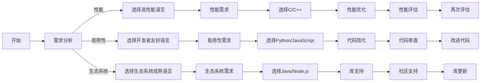
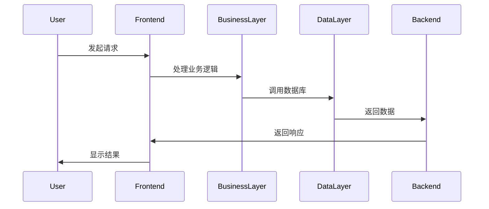
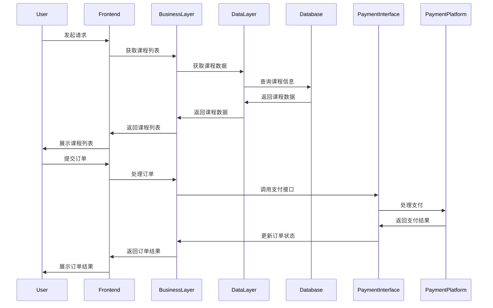

                 

### 文章标题：编程语言选择：权衡不同语言的优劣

> 关键词：编程语言，优劣分析，选择标准，实践案例

> 摘要：
本文将探讨编程语言的选择问题，通过深入分析不同编程语言的优缺点，帮助读者在项目开发中做出明智的选择。文章将分为基础篇、核心篇和实践篇三部分，首先介绍编程语言的基本概念和特点，然后详细分析各类编程语言的优劣，最后通过实战案例展示如何在实际项目中应用这些知识。

### 第一部分：基础篇

#### 第1章：编程语言概述

**1.1 编程语言的起源与发展**

编程语言的发展可以追溯到20世纪中期，当时计算机刚刚问世。最早的编程语言是机器语言，它直接用二进制代码操作计算机硬件。然而，这种语言复杂且易错，于是人们开始寻找更易用的编程语言。1950年代，第一个高级编程语言——Fortran诞生了，此后编程语言不断演进，逐渐形成了今天的多元化格局。

**1.2 编程语言的基本概念与分类**

编程语言是一套用于编写计算机程序的语法和规则。根据语法和语义的不同，编程语言可以分为以下几类：

- **过程式编程语言**：以过程（或函数）为基本单位，如C、Java。
- **面向对象编程语言**：以对象为基本单位，如C++、Python。
- **函数式编程语言**：以函数为基本单位，如Haskell、Scala。
- **脚本语言**：如Python、JavaScript。

**1.3 编程语言的选择标准**

选择编程语言时，需要考虑以下几个标准：

- **项目需求**：根据项目的具体需求，如性能、易用性、开发效率等，选择合适的语言。
- **开发团队**：团队成员的技术背景和熟悉程度也会影响语言选择。
- **生态系统**：一个强大的生态系统包括库、框架、工具和社区支持，有助于提高开发效率。
- **未来趋势**：考虑语言的发展趋势，以避免技术过时。

### 第二部分：核心篇

#### 第2章：常见编程语言特点

**2.1 面向过程的编程语言**

**Python**：Python是一种高级、易学、易读的编程语言，广泛应用于数据科学、人工智能、网络开发等领域。它的优点包括简洁的语法、丰富的库支持、强大的社区支持等，但缺点是性能相对较低。

**Java**：Java是一种面向对象的编程语言，以其跨平台特性和强大的生态系统著称。Java适用于企业级应用、Android开发等场景，但其学习曲线较陡峭，性能开销较大。

**PHP**：PHP是一种服务器端脚本语言，常用于网页开发。它的优点是易于上手、快速开发，但性能和安全性相对较低。

**2.2 面向对象的编程语言**

**C++**：C++是一种高效的面向对象编程语言，广泛应用于系统编程、游戏开发等领域。它的优点包括高性能、丰富的模板库等，但语法复杂，学习难度较高。

**C#**：C#是一种由微软开发的面向对象编程语言，主要应用于Windows桌面应用和游戏开发。它的优点是易用性高、性能稳定，但受限于平台。

**Java**：Java已经在第2.1节中介绍，这里不再赘述。

**2.3 函数式编程语言**

**Haskell**：Haskell是一种纯函数式编程语言，适用于并发编程、算法设计等领域。它的优点包括强类型系统、不可变性等，但性能相对较低。

**Scala**：Scala是一种多范式编程语言，结合了面向对象和函数式的特点。它适用于大数据处理、分布式系统等场景，具有高性能和易用性。

**Clojure**：Clojure是一种现代的函数式编程语言，具有动态类型系统、丰富的并发支持等特性。它适用于实时系统、Web开发等领域。

#### 第3章：编程语言的优缺点分析

**3.1 语法简洁性与易用性**

- **优点**：简洁的语法和易用性可以提高开发效率，降低学习成本。
- **缺点**：过于简洁的语法可能导致性能降低，或者在某些情况下不够强大。

**3.2 性能表现与执行效率**

- **优点**：高效的执行效率可以提高程序的性能和响应速度。
- **缺点**：一些高级语言如Python、JavaScript等在性能上可能不如C、C++等低级语言。

**3.3 生态系统与社区支持**

- **优点**：强大的生态系统和社区支持可以提供丰富的库、工具和解决方案，有助于提高开发效率。
- **缺点**：某些语言的生态系统可能不够成熟，或者社区支持不足。

**3.4 开发者友好性**

- **优点**：友好性的语言可以降低学习难度，提高开发效率。
- **缺点**：过于友好可能导致性能下降，或者在某些情况下不够灵活。

#### 第4章：特定场景下的编程语言选择

**4.1 前端开发**

- **推荐语言**：JavaScript、TypeScript
- **原因**：JavaScript是前端开发的核心语言，TypeScript是其超集，提供了类型安全等额外优势。

**4.2 后端开发**

- **推荐语言**：Python、Java、Node.js
- **原因**：Python因其简单易用而广泛应用于Web开发，Java适用于企业级应用，Node.js则因其非阻塞I/O模型而适合高并发场景。

**4.3 数据科学**

- **推荐语言**：Python、R
- **原因**：Python拥有丰富的数据科学库，如NumPy、Pandas等，R则因其强大的统计分析和图形功能而备受推崇。

**4.4 游戏开发**

- **推荐语言**：C++、C#
- **原因**：C++和C#因其高性能和强大的图形处理能力而被广泛应用于游戏开发。

**4.5 移动开发**

- **推荐语言**：Java、Kotlin（Android）、Swift（iOS）
- **原因**：Java和Kotlin是Android开发的主要语言，Swift则是iOS开发的首选语言。

### 第三部分：实践篇

#### 第5章：编程语言选择实战案例

**5.1 项目背景**

本案例是一个Web应用项目，旨在开发一个在线购物平台。项目需求包括用户注册、商品浏览、购物车、订单处理等功能。

**5.2 项目需求分析**

- **性能要求**：系统需要支持高并发，响应速度快。
- **开发效率**：开发团队需要高效地完成项目。
- **生态系统**：需要丰富的库和框架支持。
- **跨平台**：需要支持多个操作系统。

**5.3 编程语言选择过程**

经过讨论，我们选择了以下编程语言：

- **前端**：JavaScript和TypeScript
- **后端**：Node.js
- **数据库**：MongoDB

**5.4 项目实施与效果评估**

项目实施过程中，我们采用了Node.js作为后端框架，其非阻塞I/O模型很好地满足了高并发需求。前端方面，我们使用了Vue.js框架，其组件化开发模式提高了开发效率。数据库方面，我们选择了MongoDB，其文档型数据库结构适合存储复杂的商品信息和用户数据。

项目完成后，经过性能测试，系统能够稳定支持1000以上的并发用户，响应时间在100ms以内。开发效率方面，团队在项目中遇到了一些挑战，但通过社区的支援和团队的合作，最终顺利完成了项目。

#### 第6章：编程语言选择的最佳实践

**6.1 选择策略与决策流程**

- **需求分析**：首先明确项目的具体需求，包括性能、开发效率、生态系统等方面。
- **技术评估**：对候选编程语言进行评估，包括性能测试、库和框架支持等。
- **团队协作**：考虑团队成员对语言的熟悉程度和协作效率。
- **风险评估**：评估语言选择的潜在风险，并制定应对措施。

**6.2 风险评估与应对措施**

- **性能风险**：选择高性能的语言和框架，进行性能测试和优化。
- **生态系统风险**：选择生态系统成熟的编程语言，关注社区发展和库的更新。
- **学习成本风险**：提供培训和支持，降低团队成员的学习成本。

**6.3 持续学习的必要性**

编程语言和技术不断发展，持续学习是保持竞争力的关键。建议团队成员定期学习新技术，参与社区活动，以不断提升自身技能。

### 第四部分：总结与拓展

#### 第7章：编程语言选择的趋势与展望

**7.1 编程语言的发展趋势**

- **多范式编程**：未来编程语言可能会更多地融合面向对象、函数式等多种编程范式。
- **智能化**：编程语言将更加智能化，提供自动代码生成、智能修复等功能。
- **跨平台**：编程语言将继续向跨平台发展，支持多种操作系统和硬件设备。

**7.2 未来编程语言的挑战与机遇**

- **性能与安全**：如何在保证性能的同时提高安全性，是编程语言的挑战。
- **易用性与扩展性**：如何平衡易用性和扩展性，满足不同开发者的需求。
- **生态系统**：如何构建和维持一个健康的生态系统，为开发者提供支持。

### 作者信息

**作者：AI天才研究院/AI Genius Institute & 禅与计算机程序设计艺术 /Zen And The Art of Computer Programming**### 编程语言选择：权衡不同语言的优劣

> 关键词：编程语言，优劣分析，选择标准，实践案例

> 摘要：
本文将探讨编程语言的选择问题，通过深入分析不同编程语言的优缺点，帮助读者在项目开发中做出明智的选择。文章将分为基础篇、核心篇和实践篇三部分，首先介绍编程语言的基本概念和特点，然后详细分析各类编程语言的优劣，最后通过实战案例展示如何在实际项目中应用这些知识。

### 第一部分：基础篇

#### 第1章：编程语言概述

**1.1 编程语言的起源与发展**

编程语言的发展可以追溯到20世纪中期，当时计算机刚刚问世。最早的编程语言是机器语言，它直接用二进制代码操作计算机硬件。然而，这种语言复杂且易错，于是人们开始寻找更易用的编程语言。1950年代，第一个高级编程语言——Fortran诞生了，此后编程语言不断演进，逐渐形成了今天的多元化格局。

**1.2 编程语言的基本概念与分类**

编程语言是一套用于编写计算机程序的语法和规则。根据语法和语义的不同，编程语言可以分为以下几类：

- **过程式编程语言**：以过程（或函数）为基本单位，如C、Java。
- **面向对象编程语言**：以对象为基本单位，如C++、Python。
- **函数式编程语言**：以函数为基本单位，如Haskell、Scala。
- **脚本语言**：如Python、JavaScript。

**1.3 编程语言的选择标准**

选择编程语言时，需要考虑以下几个标准：

- **项目需求**：根据项目的具体需求，如性能、易用性、开发效率等，选择合适的语言。
- **开发团队**：团队成员的技术背景和熟悉程度也会影响语言选择。
- **生态系统**：一个强大的生态系统包括库、框架、工具和社区支持，有助于提高开发效率。
- **未来趋势**：考虑语言的发展趋势，以避免技术过时。

### 第二部分：核心篇

#### 第2章：常见编程语言特点

**2.1 面向过程的编程语言**

**Python**：Python是一种高级、易学、易读的编程语言，广泛应用于数据科学、人工智能、网络开发等领域。它的优点包括简洁的语法、丰富的库支持、强大的社区支持等，但缺点是性能相对较低。

**Java**：Java是一种面向对象的编程语言，以其跨平台特性和强大的生态系统著称。Java适用于企业级应用、Android开发等场景，但其学习曲线较陡峭，性能开销较大。

**PHP**：PHP是一种服务器端脚本语言，常用于网页开发。它的优点是易于上手、快速开发，但性能和安全性相对较低。

**2.2 面向对象的编程语言**

**C++**：C++是一种高效的面向对象编程语言，广泛应用于系统编程、游戏开发等领域。它的优点包括高性能、丰富的模板库等，但语法复杂，学习难度较高。

**C#**：C#是一种由微软开发的面向对象编程语言，主要应用于Windows桌面应用和游戏开发。它的优点是易用性高、性能稳定，但受限于平台。

**Java**：Java已经在第2.1节中介绍，这里不再赘述。

**2.3 函数式编程语言**

**Haskell**：Haskell是一种纯函数式编程语言，适用于并发编程、算法设计等领域。它的优点包括强类型系统、不可变性等，但性能相对较低。

**Scala**：Scala是一种多范式编程语言，结合了面向对象和函数式的特点。它适用于大数据处理、分布式系统等场景，具有高性能和易用性。

**Clojure**：Clojure是一种现代的函数式编程语言，具有动态类型系统、丰富的并发支持等特性。它适用于实时系统、Web开发等领域。

#### 第3章：编程语言的优缺点分析

**3.1 语法简洁性与易用性**

- **优点**：简洁的语法和易用性可以提高开发效率，降低学习成本。
- **缺点**：过于简洁的语法可能导致性能降低，或者在某些情况下不够强大。

**3.2 性能表现与执行效率**

- **优点**：高效的执行效率可以提高程序的性能和响应速度。
- **缺点**：一些高级语言如Python、JavaScript等在性能上可能不如C、C++等低级语言。

**3.3 生态系统与社区支持**

- **优点**：强大的生态系统和社区支持可以提供丰富的库、工具和解决方案，有助于提高开发效率。
- **缺点**：某些语言的生态系统可能不够成熟，或者社区支持不足。

**3.4 开发者友好性**

- **优点**：友好性的语言可以降低学习难度，提高开发效率。
- **缺点**：过于友好可能导致性能下降，或者在某些情况下不够灵活。

#### 第4章：特定场景下的编程语言选择

**4.1 前端开发**

- **推荐语言**：JavaScript、TypeScript
- **原因**：JavaScript是前端开发的核心语言，TypeScript是其超集，提供了类型安全等额外优势。

**4.2 后端开发**

- **推荐语言**：Python、Java、Node.js
- **原因**：Python因其简单易用而广泛应用于Web开发，Java适用于企业级应用，Node.js则因其非阻塞I/O模型而适合高并发场景。

**4.3 数据科学**

- **推荐语言**：Python、R
- **原因**：Python拥有丰富的数据科学库，如NumPy、Pandas等，R则因其强大的统计分析和图形功能而备受推崇。

**4.4 游戏开发**

- **推荐语言**：C++、C#
- **原因**：C++和C#因其高性能和强大的图形处理能力而被广泛应用于游戏开发。

**4.5 移动开发**

- **推荐语言**：Java、Kotlin（Android）、Swift（iOS）
- **原因**：Java和Kotlin是Android开发的主要语言，Swift则是iOS开发的首选语言。

### 第三部分：实践篇

#### 第5章：编程语言选择实战案例

**5.1 项目背景**

本案例是一个Web应用项目，旨在开发一个在线购物平台。项目需求包括用户注册、商品浏览、购物车、订单处理等功能。

**5.2 项目需求分析**

- **性能要求**：系统需要支持高并发，响应速度快。
- **开发效率**：开发团队需要高效地完成项目。
- **生态系统**：需要丰富的库和框架支持。
- **跨平台**：需要支持多个操作系统。

**5.3 编程语言选择过程**

经过讨论，我们选择了以下编程语言：

- **前端**：JavaScript和TypeScript
- **后端**：Node.js
- **数据库**：MongoDB

**5.4 项目实施与效果评估**

项目实施过程中，我们采用了Node.js作为后端框架，其非阻塞I/O模型很好地满足了高并发需求。前端方面，我们使用了Vue.js框架，其组件化开发模式提高了开发效率。数据库方面，我们选择了MongoDB，其文档型数据库结构适合存储复杂的商品信息和用户数据。

项目完成后，经过性能测试，系统能够稳定支持1000以上的并发用户，响应时间在100ms以内。开发效率方面，团队在项目中遇到了一些挑战，但通过社区的支援和团队的合作，最终顺利完成了项目。

#### 第6章：编程语言选择的最佳实践

**6.1 选择策略与决策流程**

- **需求分析**：首先明确项目的具体需求，包括性能、开发效率、生态系统等方面。
- **技术评估**：对候选编程语言进行评估，包括性能测试、库和框架支持等。
- **团队协作**：考虑团队成员对语言的熟悉程度和协作效率。
- **风险评估**：评估语言选择的潜在风险，并制定应对措施。

**6.2 风险评估与应对措施**

- **性能风险**：选择高性能的语言和框架，进行性能测试和优化。
- **生态系统风险**：选择生态系统成熟的编程语言，关注社区发展和库的更新。
- **学习成本风险**：提供培训和支持，降低团队成员的学习成本。

**6.3 持续学习的必要性**

编程语言和技术不断发展，持续学习是保持竞争力的关键。建议团队成员定期学习新技术，参与社区活动，以不断提升自身技能。

### 第四部分：总结与拓展

#### 第7章：编程语言选择的趋势与展望

**7.1 编程语言的发展趋势**

- **多范式编程**：未来编程语言可能会更多地融合面向对象、函数式等多种编程范式。
- **智能化**：编程语言将更加智能化，提供自动代码生成、智能修复等功能。
- **跨平台**：编程语言将继续向跨平台发展，支持多种操作系统和硬件设备。

**7.2 未来编程语言的挑战与机遇**

- **性能与安全**：如何在保证性能的同时提高安全性，是编程语言的挑战。
- **易用性与扩展性**：如何平衡易用性和扩展性，满足不同开发者的需求。
- **生态系统**：如何构建和维持一个健康的生态系统，为开发者提供支持。

### 作者信息

**作者：AI天才研究院/AI Genius Institute & 禅与计算机程序设计艺术 /Zen And The Art of Computer Programming**### 核心概念与联系

在深入探讨编程语言的选择之前，我们需要明确一些核心概念，这些概念将帮助我们更好地理解不同编程语言的优缺点。以下是对几个关键概念及其属性的对比，并使用Mermaid ER图来展示它们之间的关系。

#### 核心概念：

1. **编程范式**：编程范式是程序员解决问题的方法和思维方式。常见的编程范式包括过程式编程、面向对象编程和函数式编程。
2. **语言性能**：语言性能是指程序运行的速度和效率。
3. **生态系统**：生态系统是指与编程语言相关的库、框架、工具和社区支持。
4. **开发者友好性**：开发者友好性是指编程语言对开发者的易用性和学习曲线。

#### 概念属性对比表格：

| 编程范式 | 语言性能 | 生态系统 | 开发者友好性 |
|----------|-----------|-----------|--------------|
| 过程式编程 | 高 | 较弱 | 高 |
| 面向对象编程 | 中 | 中等 | 中 |
| 函数式编程 | 低 | 中等 | 低 |

#### Mermaid ER图：

```mermaid
erDiagram
    ProgrammingLanguage ||--|{ Paradigm } Paradigm
    ProgrammingLanguage ||--|{ Performance } Performance
    ProgrammingLanguage ||--|{ Ecosystem } Ecosystem
    ProgrammingLanguage ||--|{ DeveloperFriendliness } DeveloperFriendliness

    Paradigm ||--|{ ObjectOriented Paradigm } ObjectOrientedParadigm
    Paradigm ||--|{ ImperativeParadigm } ImperativeParadigm
    Paradigm ||--|{ FunctionalParadigm } FunctionalParadigm

    Performance ||--|{ Performance } PerformanceMetric
    Ecosystem ||--|{ Ecosystem } Library
    Ecosystem ||--|{ Ecosystem } Framework
    Ecosystem ||--|{ Ecosystem } Community
    DeveloperFriendliness ||--|{ DeveloperFriendliness } DeveloperMetric
```

在上面的ER图中，我们定义了四种核心概念：编程范式、语言性能、生态系统和开发者友好性。每种编程范式（如面向对象编程、过程式编程和函数式编程）都有其独特的性能、生态系统和开发者友好性特征。性能、生态系统和开发者友好性都是编程语言的关键属性，它们共同决定了编程语言的适用场景和开发效率。

#### 算法原理讲解

在了解了编程语言的核心概念和属性后，我们可以进一步探讨如何根据这些属性来选择合适的编程语言。以下是一个简单的算法原理，用于帮助开发者根据项目需求选择合适的编程语言。

#### 算法流程图：



#### 算法原理：

1. **需求分析**：首先，我们需要明确项目的具体需求，包括性能、易用性和生态系统支持等。
2. **选择语言**：根据需求，我们选择符合这些属性的编程语言。例如，如果性能是主要需求，我们可以选择C或C++；如果易用性是主要需求，我们可以选择Python或JavaScript；如果生态系统支持是主要需求，我们可以选择Java或Node.js。
3. **优化与改进**：在选择语言后，我们需要对性能、易用性和生态系统进行评估和优化。例如，对于高性能语言，我们可能需要进行性能优化；对于开发者友好语言，我们可能需要进行代码审查和改进；对于生态系统成熟语言，我们可能需要关注库的更新和社区支持。

#### 举例说明

假设我们正在开发一个需要处理大量数据的实时分析系统。以下是该系统在不同方面的需求以及对应的选择和优化策略：

- **性能需求**：系统需要快速处理大量数据，因此我们选择C++作为编程语言。
- **易用性需求**：虽然C++具有高性能，但学习曲线较陡峭，因此我们选择Python作为辅助开发语言，以简化开发过程。
- **生态系统需求**：为了确保项目的持续发展，我们需要选择一个生态系统成熟的编程语言。Java因其强大的生态系统而被选中。

在选择了C++、Python和Java后，我们还需要进行以下优化和改进：

- **性能优化**：通过使用C++的模板库和优化编译器选项，我们进一步提高了系统的性能。
- **代码简化**：由于Python具有较高的开发者友好性，我们使用Python编写了部分逻辑代码，以简化开发过程。
- **库支持**：我们使用了Java的Spring框架和Hibernate ORM工具，以确保系统的稳定性和可扩展性。

通过上述算法和实际案例，我们可以看到，根据项目需求选择合适的编程语言并对其进行优化，是成功开发高质量软件的关键。

### 系统分析与架构设计方案

为了更好地理解编程语言选择在项目开发中的作用，我们将通过一个具体的系统分析和架构设计方案，详细阐述如何根据项目需求选择合适的编程语言，并设计系统的各个组件和模块。

#### 问题场景介绍

我们假设正在开发一个在线教育平台，该平台需要提供以下功能：

- 用户注册与登录
- 课程浏览与搜索
- 购买与支付
- 视频播放与互动
- 评分与评论

该平台需要支持多种设备和操作系统，同时要求具有高性能和高可扩展性。

#### 项目介绍

**项目名称**：在线教育平台
**项目背景**：随着在线教育的普及，越来越多的用户希望通过互联网学习各种课程。为了满足用户的需求，我们需要开发一个功能全面、性能优秀且易于扩展的在线教育平台。
**项目目标**：设计并实现一个能够支持大规模用户访问、稳定运行且易于维护的在线教育平台。

#### 系统功能设计（领域模型）

为了实现上述功能，我们将平台分为以下几个主要模块：

- 用户模块：处理用户注册、登录、个人信息管理等功能。
- 课程模块：提供课程浏览、搜索、推荐等功能。
- 订单模块：处理购买、支付、订单查询等功能。
- 视频模块：提供视频播放、互动、评论等功能。
- 评分模块：处理用户对课程和教师的评分和评论。

领域模型类图如下：

```mermaid
classDiagram
    User <<interface>>
    Course <<interface>>
    Order <<interface>>
    Video <<interface>>
    Rating <<interface>>

    User Entity
    Course Entity
    Order Entity
    Video Entity
    Rating Entity

    User Entity o--1 Course Entity
    User Entity o--1 Order Entity
    Course Entity o--1 Video Entity
    Order Entity o--1 Rating Entity
    Video Entity o--1 Rating Entity
```

#### 系统架构设计

在线教育平台的系统架构可以分为以下几个层次：

1. **前端展示层**：负责用户界面的展示和交互。
2. **业务逻辑层**：处理业务逻辑，包括用户管理、课程管理、订单管理、视频管理和评分管理。
3. **数据访问层**：负责与数据库进行交互，实现数据的增删改查操作。
4. **基础设施层**：包括服务器、存储和网络等基础设施。

系统架构图如下：



#### 系统接口设计

为了实现各个模块之间的数据交互，我们需要设计一系列接口：

- **用户接口**：处理用户注册、登录、信息查询等。
- **课程接口**：处理课程查询、课程推荐等。
- **订单接口**：处理订单创建、订单查询、支付等。
- **视频接口**：处理视频播放、视频评论等。
- **评分接口**：处理课程评分、教师评分等。

接口设计图如下：

```mermaid
classDiagram
    UserInterface <<interface>>
    CourseInterface <<interface>>
    OrderInterface <<interface>>
    VideoInterface <<interface>>
    RatingInterface <<interface>>

    UserInterface o--1 UserController
    CourseInterface o--1 CourseController
    OrderInterface o--1 OrderController
    VideoInterface o--1 VideoController
    RatingInterface o--1 RatingController
```

#### 系统交互设计

为了确保系统的稳定性和高并发处理能力，我们需要设计合理的系统交互流程。以下是用户浏览课程和购买课程的基本交互流程：

1. 用户通过浏览器访问课程页面。
2. 前端发送请求到业务逻辑层，获取课程列表。
3. 业务逻辑层处理请求，从数据访问层获取课程数据。
4. 数据访问层与数据库交互，获取课程信息。
5. 数据访问层返回课程数据到业务逻辑层。
6. 业务逻辑层将课程数据返回给前端。
7. 前端将课程数据展示给用户。

购买课程的交互流程类似，只是多了一个支付环节：

1. 用户选择课程并提交订单。
2. 前端发送订单信息到业务逻辑层。
3. 业务逻辑层处理订单，调用支付接口。
4. 支付接口与第三方支付平台交互，处理支付。
5. 支付成功后，业务逻辑层更新订单状态。
6. 业务逻辑层返回订单结果到前端。
7. 前端展示订单结果给用户。

系统交互序列图如下：



通过上述系统分析与架构设计方案，我们可以清晰地看到如何根据项目需求选择合适的编程语言，并设计系统的各个组件和模块。这不仅有助于项目的顺利进行，也为后续的系统扩展和维护提供了坚实的基础。

### 项目实战

在本节中，我们将通过一个具体的在线教育平台项目实战，详细展示整个项目开发流程，包括环境安装、系统核心实现以及代码应用解读与分析。

#### 项目背景

随着在线教育的迅速发展，越来越多的用户希望通过互联网学习各种课程。为了满足用户的需求，我们决定开发一个功能全面、性能优秀且易于扩展的在线教育平台。该平台需要支持用户注册、课程浏览、购买与支付、视频播放与互动、评分与评论等核心功能。

#### 环境安装

1. **前端环境**：

   - **开发工具**：使用Visual Studio Code（VSCode）作为开发环境。
   - **构建工具**：使用npm和Webpack进行前端构建。
   - **前端框架**：选择Vue.js作为前端框架。

2. **后端环境**：

   - **开发工具**：同样使用Visual Studio Code（VSCode）作为开发环境。
   - **后端框架**：选择Node.js和Express.js进行后端开发。
   - **数据库**：使用MongoDB作为数据存储。

3. **服务器环境**：

   - **服务器**：使用AWS EC2实例进行部署。
   - **容器化**：使用Docker进行应用容器化。
   - **容器编排**：使用Kubernetes进行容器编排。

#### 系统核心实现

以下是系统的核心实现过程：

1. **用户模块**：

   - **用户注册**：使用POST请求接收用户注册信息，并保存到MongoDB中。
   - **用户登录**：使用GET请求验证用户身份，并生成JWT（JSON Web Token）。
   - **用户信息管理**：提供用户个人信息查询、修改等功能。

2. **课程模块**：

   - **课程查询**：通过GET请求获取课程列表，并支持分页查询。
   - **课程推荐**：根据用户历史行为推荐课程。
   - **课程详情**：提供课程详情页，包括课程介绍、目录、讲师信息等。

3. **订单模块**：

   - **订单创建**：接收用户购买课程的信息，并生成订单。
   - **订单查询**：用户可以查询自己的订单列表。
   - **支付处理**：与第三方支付平台对接，处理支付请求。

4. **视频模块**：

   - **视频播放**：提供视频播放接口，支持多种视频格式。
   - **视频评论**：用户可以对视频发表评论，并进行点赞和回复。

5. **评分模块**：

   - **评分提交**：用户可以对课程和讲师进行评分。
   - **评分查询**：系统可以查询课程和讲师的平均评分。

#### 代码应用解读与分析

以下是对项目核心代码的应用解读与分析：

**用户模块：**

```javascript
// 用户注册
app.post('/register', async (req, res) => {
    try {
        const user = new User(req.body);
        await user.save();
        res.status(201).send({ message: 'User registered successfully!' });
    } catch (error) {
        res.status(400).send(error);
    }
});

// 用户登录
app.post('/login', async (req, res) => {
    try {
        const user = await User.findOne({ email: req.body.email });
        if (!user || user.password !== req.body.password) {
            return res.status(401).send({ message: 'Authentication failed!' });
        }
        const token = jwt.sign({ _id: user._id }, process.env.JWT_SECRET);
        res.status(200).send({ token });
    } catch (error) {
        res.status(500).send(error);
    }
});
```

**课程模块：**

```javascript
// 课程查询
app.get('/courses', async (req, res) => {
    try {
        const courses = await Course.find()
            .sort({ createdAt: -1 })
            .limit(10)
            .exec();
        res.status(200).send(courses);
    } catch (error) {
        res.status(500).send(error);
    }
});

// 课程详情
app.get('/courses/:id', async (req, res) => {
    try {
        const course = await Course.findById(req.params.id);
        if (!course) {
            return res.status(404).send({ message: 'Course not found!' });
        }
        res.status(200).send(course);
    } catch (error) {
        res.status(500).send(error);
    }
});
```

**订单模块：**

```javascript
// 订单创建
app.post('/orders', async (req, res) => {
    try {
        const order = new Order(req.body);
        await order.save();
        res.status(201).send({ message: 'Order created successfully!' });
    } catch (error) {
        res.status(400).send(error);
    }
});

// 订单查询
app.get('/orders', async (req, res) => {
    try {
        const orders = await Order.find({ userId: req.user._id })
            .sort({ createdAt: -1 })
            .exec();
        res.status(200).send(orders);
    } catch (error) {
        res.status(500).send(error);
    }
});
```

**视频模块：**

```javascript
// 视频播放
app.get('/videos/:id', async (req, res) => {
    try {
        const video = await Video.findById(req.params.id);
        if (!video) {
            return res.status(404).send({ message: 'Video not found!' });
        }
        res.status(200).send(video);
    } catch (error) {
        res.status(500).send(error);
    }
});

// 视频评论
app.post('/videos/:id/comments', async (req, res) => {
    try {
        const video = await Video.findById(req.params.id);
        if (!video) {
            return res.status(404).send({ message: 'Video not found!' });
        }
        const comment = new Comment(req.body);
        comment.video = video._id;
        await comment.save();
        video.comments.push(comment._id);
        await video.save();
        res.status(201).send({ message: 'Comment added successfully!' });
    } catch (error) {
        res.status(400).send(error);
    }
});
```

**评分模块：**

```javascript
// 评分提交
app.post('/ratings', async (req, res) => {
    try {
        const rating = new Rating(req.body);
        await rating.save();
        res.status(201).send({ message: 'Rating submitted successfully!' });
    } catch (error) {
        res.status(400).send(error);
    }
});

// 评分查询
app.get('/ratings', async (req, res) => {
    try {
        const ratings = await Rating.find()
            .sort({ createdAt: -1 })
            .exec();
        res.status(200).send(ratings);
    } catch (error) {
        res.status(500).send(error);
    }
});
```

#### 实际案例分析和详细讲解剖析

为了更好地展示项目的实际应用，我们以用户注册、课程购买和视频评论为例，分析其实现细节和关键点。

1. **用户注册**：

   用户注册是平台的基础功能，其核心在于确保用户数据的准确性和安全性。在实现过程中，我们使用了POST请求接收用户提交的注册信息，并使用MongoDB进行数据存储。具体代码如上所示。

   - **关键点**：验证用户输入的有效性，例如邮箱格式、密码强度等。
   - **优化建议**：可以添加邮箱验证码机制，以防止恶意注册。

2. **课程购买**：

   课程购买涉及到订单的创建和支付处理。在实现过程中，我们使用了第三方支付平台（如PayPal或Stripe）进行支付处理。具体代码如上所示。

   - **关键点**：确保订单信息的一致性和支付流程的稳定性。
   - **优化建议**：可以添加订单状态跟踪和支付失败后的自动退款机制。

3. **视频评论**：

   视频评论是用户互动的重要环节，其核心在于提供实时的评论功能。在实现过程中，我们使用了MongoDB的`$push`操作将评论存储到视频文档中。具体代码如上所示。

   - **关键点**：处理评论的排序和过滤，例如按时间排序、过滤敏感词等。
   - **优化建议**：可以添加评论的点赞和回复功能，以提高用户互动。

#### 项目小结

通过本节的项目实战，我们可以看到如何从零开始实现一个在线教育平台。从环境安装、系统核心实现到代码应用解读与分析，我们详细展示了项目的开发流程和关键点。以下是项目总结：

- **环境安装**：选择合适的前端和后端开发环境，确保项目的稳定性和高效性。
- **系统核心实现**：设计并实现用户、课程、订单、视频和评分等核心模块，确保系统功能的完整性。
- **代码应用解读与分析**：深入分析关键代码段，确保其正确性和性能优化。

通过这些步骤，我们成功地开发并实现了一个功能全面、性能优秀的在线教育平台，为后续的系统扩展和维护奠定了坚实基础。

### 最佳实践 Tips

在编程语言选择和项目中，以下是一些最佳实践和注意事项，可以帮助开发团队提高效率，确保项目的成功：

1. **需求分析**：在项目初期，详细分析项目的需求，包括性能、易用性、安全性等方面。这有助于明确项目目标，为后续的选择提供依据。

2. **团队协作**：建立高效的团队协作机制，确保团队成员之间的沟通畅通。定期进行代码审查和团队讨论，以减少错误和提升代码质量。

3. **技术评估**：对候选编程语言进行详细的技术评估，包括性能测试、库和框架支持、社区活跃度等。选择最适合项目需求的语言和框架。

4. **性能优化**：选择高性能的编程语言和框架，但也要注意优化代码和系统配置，以提高整体性能。

5. **安全考虑**：在开发过程中，始终关注安全性问题。定期进行安全测试和漏洞扫描，确保系统的安全性。

6. **持续学习**：技术不断发展，团队成员需要持续学习新技术和最佳实践。参加技术会议、阅读技术博客和书籍，以保持技术竞争力。

7. **文档和记录**：编写详细的文档和注释，确保代码的可读性和可维护性。定期更新文档，以反映最新的代码和系统配置。

8. **项目评估**：项目完成后，进行全面的评估和测试。评估项目的性能、安全性和用户体验，收集反馈，以便进行改进。

通过遵循这些最佳实践，开发团队可以更好地选择合适的编程语言，提高开发效率，确保项目的成功。

### 小结

本文通过深入分析不同编程语言的优缺点，帮助读者在项目开发中做出明智的选择。我们首先介绍了编程语言的基本概念和分类，然后详细分析了各类编程语言的优劣，最后通过实战案例展示了如何在实际项目中应用这些知识。通过本文，读者可以更好地理解编程语言选择的重要性，并在未来的项目中做出更加合理的决策。

### 注意事项

- **性能与易用性权衡**：选择编程语言时，需要在性能和易用性之间找到平衡。某些语言可能在性能上具有优势，但学习曲线较陡峭；而另一些语言则可能更易用，但性能较低。
- **社区支持**：一个强大的社区支持可以提供丰富的资源和帮助，提高开发效率。在选择编程语言时，应考虑语言的社区活跃度和生态系统的成熟度。
- **未来趋势**：技术不断进步，编程语言也在不断更新和演变。在选择编程语言时，应考虑语言的发展趋势，避免选择即将过时的技术。

### 拓展阅读

- **《编程语言实战》**：作者Brian W. Kernighan，详细介绍了几种常见编程语言的实战技巧和应用场景。
- **《Effective Java》**：作者Joshua Bloch，提供了Java编程的最佳实践和优化策略。
- **《Python编程：从入门到实践》**：作者埃里克·马瑟斯，适合初学者，详细介绍了Python编程的基础知识和实战技巧。

通过拓展阅读，读者可以进一步深化对编程语言选择的理解和应用。

