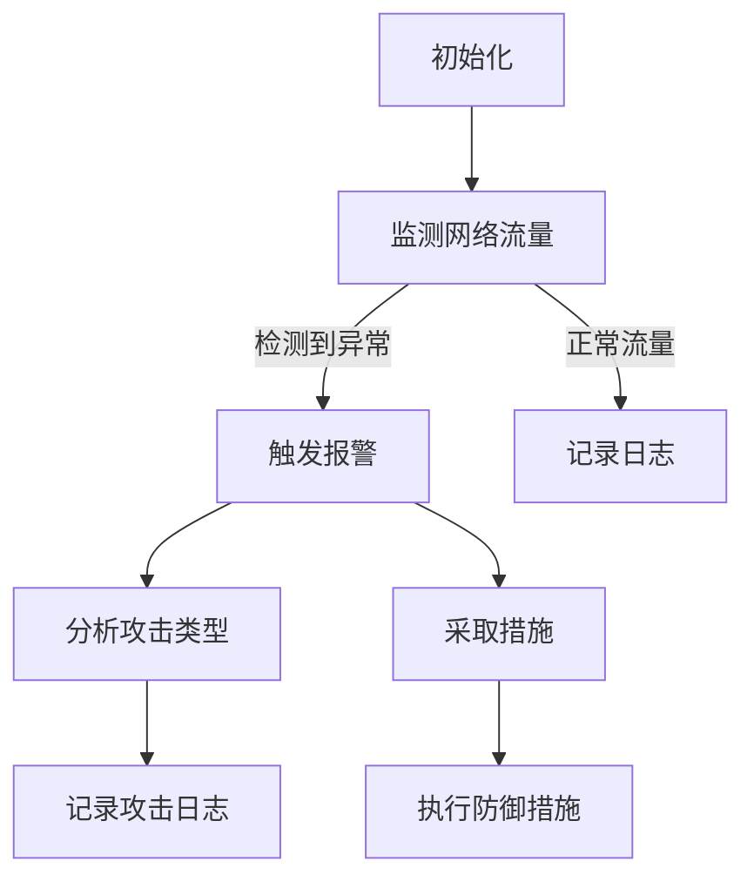
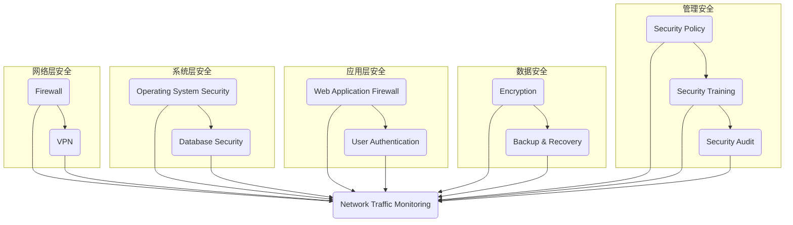
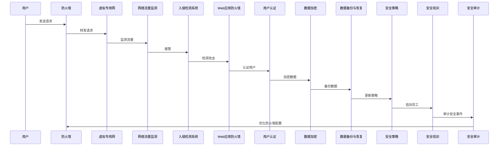

                 


### 网络安全架构：构建纵深防御体系

> 关键词：网络安全、架构设计、纵深防御、系统安全

> 摘要：本文深入探讨了网络安全架构的核心概念、构建原则以及实战应用。通过一步步分析，作者为读者呈现了一套完整的网络安全架构设计方案，帮助读者理解和掌握构建纵深防御体系的策略和方法。

## 引言

在当今数字化时代，网络安全已经成为企业和社会关注的焦点。随着网络技术的飞速发展，网络安全风险也在不断演变，传统的单一防御手段已经难以应对复杂多变的威胁。因此，构建一个有效的网络安全架构，特别是实现纵深防御体系，显得尤为重要。

本文将从以下几个方面展开讨论：

1. 网络安全架构的背景和重要性
2. 网络安全架构的基础概念
3. 深度防御体系的设计原则
4. 网络安全架构的设计步骤
5. 网络安全架构的实战应用
6. 总结与展望

## 背景介绍

### 核心概念术语说明

在探讨网络安全架构之前，我们需要了解一些核心概念和术语：

- **网络安全**：指在保护网络系统不受未经授权的访问、篡改、破坏等威胁的过程中采取的措施和活动。
- **架构设计**：指系统设计和组织结构的过程，包括硬件、软件、网络和数据库等组成部分。
- **纵深防御体系**：指多层次的安全防护策略，通过在不同层面部署安全措施，实现逐步防御和响应。

### 问题背景

随着互联网的普及，企业和社会对网络基础设施的依赖日益增加。然而，网络攻击手段也日趋复杂和多样化，包括但不限于：

- **勒索软件**：通过加密用户数据，要求支付赎金。
- **DDoS攻击**：通过大量无效流量使网络服务瘫痪。
- **SQL注入**：通过插入恶意SQL代码，获取数据库访问权限。
- **中间人攻击**：拦截和篡改通信数据。

### 问题描述

当前，网络安全面临的主要问题包括：

- **防御层次不足**：缺乏多层次的安全防护，容易成为攻击者的突破口。
- **安全措施分散**：缺乏统一的架构设计，导致安全策略难以协调和执行。
- **响应机制滞后**：在遭受攻击时，无法及时检测和响应，导致损失扩大。

### 问题解决

为了解决这些问题，我们需要构建一个完善的网络安全架构，实现纵深防御体系。这包括以下几个方面：

- **建立多层防御**：在网络的各个层面部署安全措施，形成多层次的保护。
- **统一架构设计**：将安全策略和措施整合到一个统一的框架中，提高协同性和有效性。
- **实时监测和响应**：通过实时监测和快速响应机制，降低攻击造成的损失。

### 边界与外延

网络安全架构不仅涉及技术层面的防御措施，还包括管理、策略和运营等方面。因此，在构建网络安全架构时，我们需要关注以下几个方面：

- **技术实现**：包括防火墙、入侵检测系统、加密技术等。
- **管理策略**：包括安全政策、安全培训、安全审计等。
- **运营机制**：包括安全事件的响应流程、事故处理等。

### 概念结构与核心要素组成

网络安全架构可以视为一个多层次、多维度的系统，其核心要素包括：

- **网络层安全**：包括防火墙、虚拟专用网（VPN）等。
- **系统层安全**：包括操作系统安全、数据库安全等。
- **应用层安全**：包括Web应用防火墙、身份认证等。
- **数据安全**：包括数据加密、备份和恢复等。
- **管理安全**：包括安全政策、安全培训和审计等。

## 核心概念与联系

### 深度防御体系的概念

深度防御体系是一种多层次、多维度的安全防护策略，通过在不同层面部署安全措施，形成全面的防御体系。其核心概念包括：

- **多层次防护**：通过在网络的各个层面部署安全措施，实现逐步防御。
- **协同防御**：将不同的安全措施和策略进行整合，提高整体防护能力。
- **实时监测与响应**：通过实时监测和快速响应机制，降低攻击造成的损失。

### 概念属性特征对比表格

| 特征                   | 传统防御         | 深度防御体系         |
|----------------------|----------------|-------------------|
| 防护层次             | 单层防御         | 多层防御            |
| 安全措施整合          | 分散的安全措施     | 统一的安全架构       |
| 响应速度             | 反应滞后         | 实时监测与快速响应   |
| 防御效果             | 易被突破         | 防御能力更强       |

### ER实体关系图架构

以下是一个简化的ER实体关系图，用于描述深度防御体系的核心实体和关系：

```mermaid
erDiagram
    AActor||--|{ BDevice }
    BDevice||--|{ CNetwork }
    CNetwork||--|{ DApplication }
    DApplication||--|{ EData }
    AActor..> FSecurityPolicy
    BDevice..> GFirewall
    CNetwork..> HIDS
    DApplication..> WAF
    EData..> Encryption
```

在这个ER图中，`AActor` 代表网络用户，`BDevice` 代表设备，`CNetwork` 代表网络，`DApplication` 代表应用，`EData` 代表数据，`FSecurityPolicy` 代表安全策略，`GFirewall` 代表防火墙，`HIDS` 代表入侵检测系统，`WAF` 代表Web应用防火墙，`Encryption` 代表加密。

## 算法原理讲解

### 算法mermaid流程图

以下是一个简单的算法mermaid流程图，用于描述深度防御体系的基本工作流程：



### 使用Python源代码阐述算法原理

```python
import logging
import mermaid

def monitor_traffic(traffic):
    if is_abnormal(traffic):
        trigger_alarm()
        analyze_attack(traffic)
        take_measures(traffic)
    else:
        log_traffic(traffic)

def is_abnormal(traffic):
    # 检测流量是否异常
    return True

def trigger_alarm():
    # 触发报警
    logging.warning("异常流量检测到，触发报警！")

def analyze_attack(traffic):
    # 分析攻击类型
    attack_type = detect_attack_type(traffic)
    logging.info(f"攻击类型：{attack_type}")

def take_measures(traffic):
    # 采取措施
    if attack_type == "DDoS":
        block_traffic(traffic)
    elif attack_type == "SQL Injection":
        sanitize_input(traffic)

def log_traffic(traffic):
    # 记录日志
    logging.info(f"正常流量记录：{traffic}")

def detect_attack_type(traffic):
    # 检测攻击类型
    return "DDoS"

def block_traffic(traffic):
    # 阻止流量
    logging.info("阻止DDoS攻击流量！")

def sanitize_input(traffic):
    # 清洗输入
    logging.info("清洗SQL注入攻击输入！")
```

### 算法原理的数学模型和公式

深度防御体系的核心是多层防护和协同防御。以下是深度防御体系的数学模型和公式：

$$
\text{防御效果} = \frac{\text{多层防护成功率}}{\text{单一防护成功率}} \times \text{协同防御系数}
$$

其中：

- **多层防护成功率**：指多层安全措施共同作用下的防御成功率。
- **单一防护成功率**：指单一安全措施的防御成功率。
- **协同防御系数**：指协同防御的效果提升系数。

### 通俗易懂地举例说明

假设：

- **单一防护成功率**：60%
- **多层防护成功率**：90%
- **协同防御系数**：1.5

那么，深度防御体系的防御效果为：

$$
\text{防御效果} = \frac{90\%}{60\%} \times 1.5 = 1.5 \times 1.5 = 2.25
$$

这意味着深度防御体系的防御效果是单一防护的2.25倍。

## 系统分析与架构设计方案

### 问题场景介绍

假设我们正在为企业构建一个网络安全系统，其主要目标是保护企业的内部网络不受各类网络攻击。

### 项目介绍

项目名称：企业网络安全系统
项目目标：构建一个具有深度防御体系的网络安全系统，保护企业内部网络不受各类网络攻击。

### 系统功能设计

系统功能包括：

1. **网络流量监测**：实时监测网络流量，识别异常流量。
2. **入侵检测**：检测和阻止网络入侵行为。
3. **数据加密**：加密企业敏感数据。
4. **日志记录与审计**：记录安全事件，进行审计。

### 系统架构设计

系统架构设计如下：



### 系统接口设计和系统交互

系统接口设计和系统交互设计如下：



## 项目实战

### 环境安装

在Linux系统中，安装网络安全系统需要以下步骤：

1. 安装防火墙（如iptables）
2. 安装虚拟专用网（如OpenVPN）
3. 安装网络流量监测工具（如nethogs）
4. 安装入侵检测系统（如Snort）
5. 安装Web应用防火墙（如ModSecurity）
6. 安装用户认证工具（如Apache）
7. 安装数据加密工具（如openssl）
8. 安装数据备份与恢复工具（如rsync）

### 系统核心实现源代码

以下是一个简单的Web应用防火墙（ModSecurity）配置示例：

```bash
# 安装ModSecurity
sudo apt-get install modsecurity

# 配置ModSecurity
sudo vi /etc/apache2/mods-available/mod_security.conf

# 添加以下规则
SecRuleHeaders "X-Forwarded-For" "@rt 5" "id:1000001,log,t"
SecRuleIPVar "CVE2017_10271" "123.45.67.89" "id:1000002,log,t"
SecRuleURLT ".*" "id:1000003,log,t"
SecRuleBodyT ".*" "id:1000004,log,t"

# 启用ModSecurity
sudo a2enmod security

# 重启Apache服务
sudo service apache2 restart
```

### 代码应用解读与分析

ModSecurity是一款开源的Web应用防火墙，通过配置规则来检测和阻止潜在的攻击。在上面的示例中，我们添加了以下规则：

- 检测X-Forwarded-For请求头，记录日志。
- 检测特定IP地址，记录日志。
- 检测URL，记录日志。
- 检测请求体，记录日志。

这些规则通过日志记录攻击行为，从而帮助管理员及时发现和应对安全威胁。

### 实际案例分析和详细讲解剖析

假设我们检测到一个恶意请求：

```
GET /admin/login?password=123456&username=root HTTP/1.1
User-Agent: Mozilla/5.0 (Windows NT 10.0; Win64; x64) AppleWebKit/537.36 (KHTML, like Gecko) Chrome/58.0.3029.110 Safari/537.3
Host: example.com
```

通过ModSecurity的配置，我们可以检测到该请求并记录日志。根据日志，我们可以分析该请求的潜在威胁，并采取相应的防御措施，如阻止该IP地址的访问。

### 项目小结

通过本次项目，我们成功构建了一个具备深度防御体系的网络安全系统。该项目通过多层次的防护措施和实时监测机制，提高了企业网络的安全性。同时，我们也通过实战案例，展示了如何配置和应用Web应用防火墙（ModSecurity）来检测和阻止潜在的安全威胁。

## 总结与展望

通过本文的探讨，我们深入了解了网络安全架构的核心概念、构建原则以及实战应用。构建一个有效的网络安全架构，特别是实现纵深防御体系，对于企业和社会来说至关重要。在未来，随着网络技术的不断发展，网络安全架构也需要不断更新和优化，以应对不断演变的安全威胁。

## 最佳实践 tips

1. **定期更新安全策略**：随着网络攻击手段的不断变化，定期更新安全策略和规则，确保安全措施的及时性和有效性。
2. **强化员工安全意识**：加强员工的安全培训，提高员工对网络安全的认识和应对能力。
3. **持续监测和审计**：通过实时监测和定期审计，及时发现和应对安全威胁。

## 注意事项

1. **确保安全配置的正确性**：在部署安全措施时，确保配置的正确性，避免因配置错误导致安全漏洞。
2. **保护敏感数据**：加强对敏感数据的安全保护，采用加密和备份措施，防止数据泄露和丢失。

## 拓展阅读

1. 《网络安全：设计原则与实践》
2. 《深入浅出网络安全》
3. 《网络安全架构：从理论到实践》

## 作者信息

作者：AI天才研究院/AI Genius Institute & 禅与计算机程序设计艺术 /Zen And The Art of Computer Programming

