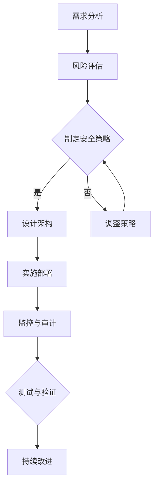

                 

### 《网络安全架构：构建纵深防御体系》——文章核心关键词和主题思想

本文将围绕“网络安全架构”、“构建纵深防御体系”、“核心技术”、“防御策略”和“实战案例”这五个核心关键词展开讨论。网络安全架构是确保网络系统安全的基础，而构建纵深防御体系则是实现网络安全的终极目标。本文将详细解析网络安全架构设计原理、核心技术、防御策略以及实战案例，旨在为读者提供一套全面、易懂、实用的网络安全解决方案。

文章的主题思想在于：

1. **全面解析**：通过详细探讨网络安全架构的各个方面，帮助读者全面了解网络安全的基本概念、核心技术、防御策略和实战应用。
2. **深入浅出**：文章采用逻辑清晰、结构紧凑的叙述方式，通过一步一步的分析推理，将复杂的技术原理和架构设计讲解得通俗易懂。
3. **实战导向**：结合实际案例，展示网络安全架构设计的具体实现方法和策略，使读者能够将理论知识应用于实际项目中。
4. **理论与实践相结合**：不仅阐述理论，还通过Python源代码和LaTeX公式等工具，深入讲解算法原理和数学模型，使读者能够理解并应用理论知识。

通过本文的阅读，读者将能够：

- **掌握网络安全架构设计的基本原则和方法**。
- **了解网络安全的核心技术和防御策略**。
- **掌握网络安全实战技巧，提升实战能力**。
- **形成一套完整的网络安全体系思维，为实际项目提供指导**。

本文将以系统性的视角，深入探讨网络安全架构的各个方面，旨在为读者提供一份具有深度、广度和实用性的技术指南。

### 目录大纲设计思路

为了设计出《网络安全架构：构建纵深防御体系》这本书的目录大纲，我们首先明确了核心章节，确保涵盖网络安全基础理论、架构设计原理、核心技术、防御策略和实战应用等内容。接下来，我们对每个章节进行了细化，确保内容的深度和广度。在确保逻辑清晰的前提下，我们采用了Mermaid和LaTeX等工具来增强内容的可读性和专业性。

具体来说，目录大纲设计遵循以下步骤：

1. **确定核心章节**：确定书籍的核心章节，确保覆盖网络安全的基本概念、架构设计、核心技术、防御策略和实战应用等内容。
2. **细化每个章节**：在每个核心章节下，进一步细化出子章节，确保每个章节都能详细探讨其主题，避免内容过于笼统。
3. **逻辑清晰**：确保目录大纲的层次清晰，逻辑连贯，便于读者理解。每个章节的标题都要能够吸引读者，让读者一眼看出该章节的内容重点。
4. **使用Mermaid和LaTeX**：在适当的地方，使用Mermaid绘制流程图和类图，以及LaTeX格式化数学公式，以增强内容的可读性和专业性。

通过上述步骤，我们设计出了《网络安全架构：构建纵深防御体系》的目录大纲。这个大纲不仅结构紧凑、逻辑清晰，而且能够帮助读者系统地学习和理解网络安全架构的各个方面。接下来，我们将详细解读每个章节的内容，以帮助读者更好地掌握网络安全知识。

### 第一部分：网络安全基础理论

#### 第1章：网络安全概述

网络安全是现代信息技术中不可或缺的一环，它关乎个人、企业乃至整个国家信息系统的安全稳定。本章将详细介绍网络安全的重要性、基本概念以及常见威胁类型。

**1.1 网络安全的重要性**

网络安全的重要性不言而喻。随着互联网的普及和信息技术的快速发展，网络安全问题日益突出。网络安全不仅关系到个人隐私的保护，也影响到企业的商业机密和国家关键信息基础设施的安全。一个不安全的网络环境可能会导致以下严重后果：

- **数据泄露**：个人敏感信息、企业商业机密和国家机密可能被不法分子窃取。
- **经济损失**：企业可能因网络安全问题导致大量经济损失，包括设备损坏、业务中断、赔偿费用等。
- **声誉受损**：网络安全事件可能导致企业或个人声誉受损，影响长期的商业合作和个人信任。
- **社会影响**：严重的网络安全事件可能对社会稳定造成威胁，影响社会秩序。

**1.2 网络安全的基本概念**

网络安全包含多个基本概念，以下是一些重要的基本概念：

- **威胁**：指试图攻击、入侵、破坏或干扰计算机系统或网络的行为。
- **漏洞**：指系统中的弱点，攻击者可以利用这些弱点进行攻击。
- **攻击**：指针对计算机系统或网络的恶意行为，包括窃取信息、破坏数据、拒绝服务等。
- **防御**：指通过各种手段阻止、检测和响应攻击，保护系统不受侵害。
- **安全策略**：指组织或个人为保护信息安全而制定的一系列规则和措施。

**1.3 网络安全的威胁类型**

网络安全威胁种类繁多，以下是一些常见的威胁类型：

- **恶意软件**：包括病毒、蠕虫、木马等，可以通过网络传播，窃取信息或破坏系统。
- **网络钓鱼**：通过伪造网站或邮件，骗取用户的敏感信息，如用户名、密码和信用卡号。
- **拒绝服务攻击（DoS）**：通过大量无效请求使网络或系统资源过载，导致服务无法正常提供。
- **分布式拒绝服务攻击（DDoS）**：通过多个恶意节点向目标系统发送大量请求，造成网络瘫痪。
- **内部威胁**：由内部用户或员工恶意或无意识地造成的威胁，如内部泄露或误操作。

通过对网络安全基础理论的详细探讨，读者可以更好地理解网络安全的重要性、基本概念和常见威胁类型，为后续章节的学习打下坚实的基础。

#### 第2章：网络安全架构设计原理

网络安全架构设计是确保网络系统安全稳定的关键。本章将深入探讨网络安全架构的核心要素、设计原则和设计方法，帮助读者理解并掌握网络安全架构的基本原理。

**2.1 网络安全架构的核心要素**

网络安全架构的核心要素包括以下几个方面：

- **安全策略**：定义了网络安全的总体目标和原则，是网络安全架构设计的基础。
- **防护机制**：包括防火墙、入侵检测系统（IDS）、入侵防御系统（IPS）等，用于阻止和检测恶意行为。
- **安全设备**：如防火墙、VPN网关、加密设备等，是实施网络安全策略的重要工具。
- **安全控制**：包括身份验证、访问控制、审计和监控等，用于确保只有授权用户才能访问受保护的资源。
- **安全意识培训**：提高用户的安全意识和知识，减少因人为因素导致的网络安全事件。

**2.2 网络安全架构设计的原则**

在网络安全架构设计过程中，应遵循以下原则：

- **防御深度原则**：采用多层次、多维度的安全防护措施，确保在网络被攻击时仍有足够的防御能力。
- **最小权限原则**：用户和程序应仅获得完成任务所需的最低权限，减少恶意行为的机会。
- **安全性与可用性平衡原则**：在确保安全的同时，尽可能减少对系统可用性的影响，避免因安全措施导致系统瘫痪。
- **安全性分化原则**：将安全责任和权限分散到多个独立的系统和人员，防止因单点故障导致整个网络系统的不安全。
- **持续更新与维护原则**：定期更新安全策略、防护机制和安全设备，以应对不断变化的威胁环境。

**2.3 网络安全架构的设计方法**

设计网络安全架构通常采用以下步骤：

1. **需求分析**：了解网络系统的业务需求、用户需求和安全需求，确定安全架构的目标和功能。
2. **风险评估**：识别网络系统中的潜在风险，评估风险的可能性和影响，确定防护重点。
3. **策略制定**：根据风险评估结果，制定网络安全策略，明确安全措施和责任分工。
4. **架构设计**：基于安全策略，设计网络安全架构，包括安全设备、防护机制和监控体系等。
5. **实施与部署**：根据架构设计，安装和配置安全设备，部署防护机制，确保安全架构能够正常运行。
6. **测试与验证**：对安全架构进行测试，验证其防护能力和有效性，确保安全措施能够应对实际威胁。
7. **持续改进**：根据测试结果和安全事件，不断优化和改进安全架构，以适应新的威胁环境。

通过深入理解和应用这些原则和方法，设计出的网络安全架构能够有效地抵御各种安全威胁，保障网络系统的安全稳定运行。

#### 第3章：网络安全的核心技术

网络安全的核心技术是确保网络系统安全稳定的关键。本章将详细介绍防火墙技术、VPN技术、入侵检测系统（IDS）和安全信息和事件管理（SIEM）等核心技术，帮助读者全面了解并掌握这些技术的基本原理和应用。

**3.1 防火墙技术**

防火墙是网络安全架构中的基石，它通过监控和控制网络流量，防止未经授权的访问和攻击。防火墙技术主要包括以下几种：

- **包过滤防火墙**：根据包的源地址、目的地址、端口号等特征进行过滤，允许或拒绝网络包通过。
- **状态检测防火墙**：在包过滤的基础上，增加状态跟踪功能，记录网络连接的状态，根据状态信息进行更细粒度的访问控制。
- **应用层防火墙**：基于应用层协议和内容进行过滤，可以识别和阻止特定类型的应用层攻击。
- **下一代防火墙（NGFW）**：结合传统防火墙功能，增加了入侵防御、病毒防护、深度包检查（DPI）等高级功能。

防火墙的工作原理可以概括为以下步骤：

1. **接收网络包**：防火墙接收来自网络的数据包。
2. **检查源地址和目的地址**：根据防火墙规则，检查数据包的源地址和目的地址是否允许通信。
3. **应用安全策略**：根据安全策略，允许或拒绝数据包通过。
4. **记录和日志**：防火墙记录所有的流量信息，以便后续审计和分析。

**3.2 VPN技术**

虚拟专用网络（VPN）是一种通过公用网络建立安全的连接，实现远程数据传输的技术。VPN技术在以下几个方面发挥了重要作用：

- **数据加密**：VPN使用加密算法对数据进行加密，确保数据在传输过程中不被窃听和篡改。
- **身份认证**：VPN通过用户名、密码或数字证书等方式对用户进行身份认证，确保只有授权用户才能访问网络资源。
- **隧道技术**：VPN使用隧道技术在公共网络上创建一个加密通道，将数据封装在隧道中传输。

VPN的工作原理可以概括为以下步骤：

1. **建立加密连接**：客户端和服务器通过VPN协议（如IPSec、SSL等）建立加密连接。
2. **数据加密传输**：客户端发送的数据被加密，通过VPN隧道传输到服务器。
3. **解密数据**：服务器接收到的加密数据在解密后恢复原始内容。
4. **数据访问**：客户端通过加密连接访问服务器上的资源，确保数据传输的安全性和隐私。

**3.3 入侵检测系统（IDS）**

入侵检测系统（IDS）是用于监控网络和系统活动，识别和响应恶意行为的安全设备。IDS主要分为以下几种类型：

- **基于签名的入侵检测系统**：通过预定义的攻击签名来检测和识别已知攻击。
- **基于异常的入侵检测系统**：通过建立正常行为模型，识别与正常行为显著偏离的活动。
- **混合型入侵检测系统**：结合基于签名和基于异常检测的方法，提高检测的准确性和全面性。

IDS的工作原理可以概括为以下步骤：

1. **数据采集**：IDS从网络流量、系统日志和其他来源采集数据。
2. **预处理**：对采集到的数据进行分析和预处理，提取有用的特征信息。
3. **检测和报警**：通过算法和规则库对预处理后的数据进行检测，发现潜在的攻击行为并生成报警。
4. **响应和应对**：根据安全策略和响应规则，采取措施阻止攻击或隔离受感染的系统。

**3.4 安全信息和事件管理（SIEM）**

安全信息和事件管理（SIEM）是一种集成多种安全信息和事件数据的系统，用于收集、存储、分析和可视化安全事件。SIEM系统具有以下功能：

- **日志管理**：收集和存储各种来源的日志数据，包括网络设备、服务器、应用程序和用户活动等。
- **事件关联**：通过分析日志数据和事件信息，识别潜在的安全威胁和异常行为。
- **威胁情报**：整合外部威胁情报，增强安全事件分析和响应能力。
- **可视化报表**：生成可视化报表，帮助安全团队快速了解安全状况和事件趋势。

SIEM系统的工作原理可以概括为以下步骤：

1. **数据采集**：SIEM系统从各种来源（如防火墙、IDS、日志服务器等）采集安全事件数据。
2. **数据存储**：将采集到的数据存储在集中的数据库中，以便后续分析和查询。
3. **数据处理**：对采集到的数据进行预处理和关联分析，识别安全事件和威胁。
4. **事件响应**：根据分析结果，生成报警和响应建议，协助安全团队采取行动。
5. **报表生成**：生成可视化报表，提供安全事件的全面视图和趋势分析。

通过对这些核心技术的详细讲解，读者可以深入了解网络安全的技术基础，为实际应用和安全架构设计提供有力支持。

#### 第4章：网络安全防御策略

网络安全防御策略是确保网络系统安全的重要手段。本章将深入探讨网络安全防御策略的制定、威胁情报的应用以及安全培训和意识提升等内容，帮助读者全面了解并掌握网络安全防御策略的实施方法和技巧。

**4.1 防护策略制定**

制定有效的网络安全防护策略是保障网络系统安全的关键步骤。以下步骤有助于制定全面的防护策略：

1. **需求分析**：了解网络系统的业务需求、用户需求和安全需求，明确防护的重点和目标。
2. **风险评估**：识别网络系统中的潜在威胁和风险，评估威胁的可能性和影响，确定防护的重点区域。
3. **策略制定**：根据风险评估结果，制定网络安全防护策略，包括防护措施、责任分工和安全流程等。
4. **文档化**：将制定的防护策略文档化，确保所有相关人员都能理解和遵循。
5. **定期更新**：根据网络安全威胁的变化和新技术的应用，定期更新防护策略，确保其持续有效性。

**4.2 威胁情报**

威胁情报是网络安全防御策略的重要组成部分。通过收集、分析和利用威胁情报，可以提前了解潜在威胁，制定针对性的防御措施。以下步骤有助于有效利用威胁情报：

1. **数据收集**：从多个来源（如安全日志、网络流量、第三方情报源等）收集威胁情报数据。
2. **数据分析**：对收集到的数据进行处理和分析，识别潜在威胁和攻击模式。
3. **威胁建模**：基于分析结果，建立威胁模型，明确威胁的来源、类型和可能影响。
4. **情报共享**：与其他组织、行业和政府机构共享威胁情报，提高整体的防御能力。
5. **响应计划**：根据威胁情报，制定和更新应急响应计划，确保能够快速应对新型威胁。

**4.3 安全培训和意识提升**

提高用户的安全意识和技能是网络安全防御策略的重要组成部分。以下措施有助于提升安全意识和技能：

1. **安全培训**：定期组织安全培训，向员工普及网络安全知识和基本技能。
2. **演习和演练**：通过模拟攻击和应急响应演练，提高员工应对网络攻击的能力。
3. **宣传和教育**：利用宣传材料、培训课程和内部讲座等方式，加强网络安全宣传和教育。
4. **安全意识测试**：定期进行安全意识测试，评估员工的安全意识和知识水平。
5. **激励措施**：设立安全奖励制度，激励员工积极参与网络安全工作，提高安全意识。

通过制定有效的网络安全防御策略、利用威胁情报以及提升安全意识和技能，可以显著提高网络系统的安全防护能力，确保网络环境的安全稳定。

#### 第5章：网络安全管理和合规性

网络安全管理和合规性是确保网络系统安全稳定运行的重要保障。本章将深入探讨网络安全管理框架、合规性要求以及安全评估与风险管理等内容，帮助读者了解并掌握网络安全管理和合规性的基本原则和实施方法。

**5.1 网络安全管理框架**

网络安全管理框架是指导网络安全工作的基础，它提供了一个系统化的方法和流程，确保网络安全策略能够得到有效执行。以下是一些常见的网络安全管理框架：

- **ISO/IEC 27001**：国际标准化组织（ISO）发布的关于信息安全管理的标准，提供了全面的信息安全管理框架。
- **NIST SP 800-53**：美国国家标准与技术研究所（NIST）发布的信息安全控制框架，涵盖了从风险管理到物理安全、网络安全、应用程序安全和访问控制等多个方面。
- **CSA Star**：云安全联盟（CSA）推出的针对云服务的安全认证框架，提供了云服务提供商在安全管理方面的最佳实践。

网络安全管理框架通常包括以下关键要素：

- **风险管理**：识别和评估网络系统中的潜在风险，制定相应的风险管理策略。
- **控制措施**：根据风险评估结果，实施具体的控制措施，如访问控制、加密和监控等。
- **合规性审计**：定期进行内部和外部审计，确保网络安全控制措施符合相关法规和标准。
- **持续改进**：通过持续的监控和评估，不断优化网络安全管理流程和措施。

**5.2 网络安全合规性要求**

网络安全合规性要求是指网络系统在设计和运营过程中必须遵循的法律、法规和行业标准。以下是一些常见的网络安全合规性要求：

- **数据保护法规**：如欧盟的通用数据保护条例（GDPR）、美国的《健康保险可携性和责任法案》（HIPAA）等，规定了数据收集、存储、处理和传输过程中的安全要求。
- **行业特定标准**：如支付卡行业数据安全标准（PCI DSS）、健康信息技术标准委员会（HITRUST）等，针对特定行业的网络安全要求。
- **信息安全管理体系（ISMS）**：通过建立和实施信息安全管理体系，确保组织的网络安全措施符合相关法规和标准。

**5.3 安全评估与风险管理**

安全评估与风险管理是确保网络安全有效性的关键环节。以下步骤有助于进行安全评估与风险管理：

1. **风险评估**：识别网络系统中的潜在威胁和风险，评估其可能性和影响，确定优先级。
2. **控制措施**：根据风险评估结果，制定并实施相应的安全控制措施，降低风险到可接受水平。
3. **监控与审计**：建立监控机制，定期审计安全措施的有效性，确保持续符合合规性要求。
4. **应急响应**：制定和演练应急响应计划，确保在发生安全事件时能够迅速响应和恢复。
5. **持续改进**：通过定期的安全评估和反馈机制，不断优化网络安全策略和管理流程。

通过遵循网络安全管理框架、满足合规性要求以及进行安全评估与风险管理，可以确保网络系统的安全性和稳定性，降低潜在风险对组织的影响。

### 第二部分：网络安全架构设计实战

#### 第6章：网络安全架构设计案例分析

在实际应用中，网络安全架构设计是一个复杂且多层次的过程，需要充分考虑业务需求、技术环境和安全威胁。本章将通过具体案例，分析网络安全架构设计的实际应用，帮助读者理解网络安全架构设计的过程和方法。

**6.1 案例背景**

我们选择一个大型互联网公司的网络安全架构设计案例。该公司提供多种在线服务，包括电子商务、社交媒体、在线支付和云存储等。随着用户数量和业务规模的不断增长，公司面临的网络安全威胁也日益复杂和多样化。

**6.2 案例分析**

在案例中，我们需要解决以下问题：

1. **用户数据保护**：确保用户的个人信息和交易数据在传输和存储过程中不被窃取和篡改。
2. **业务连续性**：确保在遭受网络攻击或系统故障时，业务能够迅速恢复，减少对用户的影响。
3. **合规性**：确保公司遵守相关法律法规和行业标准，如PCI DSS和GDPR等。

为了解决这些问题，我们采取了以下步骤：

1. **需求分析**：与业务团队和安全团队紧密合作，了解业务需求和安全需求，明确架构设计的目标和功能。
2. **风险评估**：识别潜在的安全威胁，如DDoS攻击、SQL注入、跨站脚本攻击（XSS）等，评估其可能性和影响。
3. **策略制定**：根据风险评估结果，制定网络安全策略，包括数据加密、访问控制、入侵检测和响应等。
4. **架构设计**：设计网络安全架构，包括防火墙、VPN、入侵检测系统（IDS）、安全信息和事件管理（SIEM）等。
5. **实施与部署**：根据架构设计，部署安全设备和防护机制，并进行配置和测试。
6. **测试与验证**：通过模拟攻击和漏洞扫描，验证安全架构的有效性，确保能够抵御实际威胁。

**6.3 架构设计**

该公司的网络安全架构设计主要包括以下几个关键组成部分：

1. **边界防护**：在互联网边界部署防火墙和入侵检测系统（IDS），阻止外部攻击和恶意流量进入内部网络。
2. **内部防护**：部署入侵防御系统（IPS）、安全信息和事件管理（SIEM）系统，监控内部网络流量和日志，及时发现和处理异常行为。
3. **数据加密**：使用VPN和TLS/SSL加密技术，确保数据在传输过程中不被窃听和篡改。
4. **访问控制**：实施多因素认证（MFA）和最小权限原则，确保只有授权用户才能访问敏感数据和系统资源。
5. **日志管理**：部署集中日志管理系统，记录所有的安全事件和操作日志，便于审计和监控。

通过这个案例分析，读者可以了解网络安全架构设计在实际业务中的应用，掌握从需求分析到架构设计、实施和测试的完整过程。这为读者在实际项目中设计和实施网络安全架构提供了宝贵的经验和参考。

#### 第7章：网络安全架构实现技术

网络安全架构的实现是确保网络安全的关键环节，涉及到多种技术的综合应用。本章将深入探讨网络安全架构实现的关键技术、网络安全设备的选型与配置，以及网络安全架构的运维与优化。

**7.1 网络安全架构实现的关键技术**

在网络安全架构实现过程中，以下关键技术至关重要：

1. **防火墙技术**：防火墙是网络安全的第一道防线，通过包过滤、状态检测和深度包检查（DPI）等手段，阻止未经授权的访问和攻击。实现防火墙技术需要配置防火墙规则、设置访问控制列表（ACL）以及定期更新防火墙策略。

2. **VPN技术**：虚拟专用网络（VPN）通过加密和隧道技术，保障数据在公共网络中的安全传输。实现VPN技术需要部署VPN服务器和客户端，配置加密算法和隧道协议（如IPSec、SSL/TLS），并确保VPN连接的稳定性和安全性。

3. **入侵检测系统（IDS）/入侵防御系统（IPS）**：入侵检测系统（IDS）和入侵防御系统（IPS）用于监控网络流量和系统活动，识别和响应恶意行为。实现IDS/IPS需要部署相应的设备，配置传感器和规则库，确保能够实时检测和阻止攻击。

4. **安全信息和事件管理（SIEM）**：安全信息和事件管理（SIEM）系统用于收集、存储、分析和可视化安全事件，提供全局的安全监控和响应能力。实现SIEM需要部署SIEM平台，配置数据源和事件分析规则，确保能够及时捕捉和处理安全事件。

5. **加密技术**：数据加密是保障数据安全的重要手段，包括对称加密和非对称加密。实现加密技术需要选择合适的加密算法（如AES、RSA），配置加密设备和工具，确保数据在传输和存储过程中的安全性。

**7.2 网络安全设备的选型与配置**

在网络安全设备选型过程中，需要考虑以下几个方面：

1. **需求分析**：根据业务需求和安全需求，确定需要部署的设备类型和数量，如防火墙、VPN网关、IDS/IPS、SIEM等。
2. **性能指标**：考虑设备的处理能力、吞吐量、并发连接数等性能指标，确保设备能够满足业务需求。
3. **兼容性**：选择与现有网络设备和操作系统兼容的设备，确保设备的顺利集成和运行。
4. **品牌和厂商**：选择知名度高、技术成熟和售后服务良好的品牌和厂商，确保设备的长期稳定性和可靠性。

在设备配置过程中，需要遵循以下步骤：

1. **初始配置**：根据设备手册和配置指南，进行设备的初始配置，包括设置管理接口、IP地址、默认网关等基本参数。
2. **安全配置**：配置防火墙规则、访问控制列表（ACL）、加密策略等安全参数，确保设备能够有效抵御网络攻击和入侵。
3. **监控和日志**：配置设备监控和日志功能，确保能够实时监控设备状态和安全事件，及时进行日志分析和响应。
4. **更新和升级**：定期更新设备固件和软件，确保设备能够及时应对新的安全威胁和漏洞。

**7.3 网络安全架构的运维与优化**

网络安全架构的运维与优化是保障网络安全稳定运行的关键环节。以下措施有助于提升网络安全架构的运维效率和安全性：

1. **监控与审计**：建立全面的监控体系，实时监控网络流量、系统状态和安全事件，定期进行审计和漏洞扫描，确保网络安全架构的有效性。
2. **事件响应**：制定和演练应急响应计划，确保在发生安全事件时能够迅速响应和恢复，降低事件对业务的影响。
3. **日志管理**：集中管理和分析日志数据，确保日志的完整性和可追溯性，为安全事件分析和合规性审计提供支持。
4. **持续优化**：通过定期的安全评估和反馈机制，不断优化网络安全架构和管理流程，提高安全防护能力。
5. **人员培训**：定期组织安全培训和意识提升活动，提高运维团队的安全意识和技能，确保网络安全架构的顺利实施和维护。

通过深入理解和应用这些实现技术和运维优化措施，可以构建一个高效、稳定和安全的网络安全架构，为业务持续运行提供坚实保障。

#### 第8章：深度防御策略与实战

深度防御策略是网络安全架构设计中的重要组成部分，旨在通过多层次、多维度的方法，构建一个坚固的防御体系，抵御各种潜在的安全威胁。本章将详细探讨深度防御策略的概念、实施步骤以及实战应用案例，帮助读者理解和掌握如何有效实施深度防御策略。

**8.1 深度防御的概念**

深度防御策略，又称为多层防御策略，其核心思想是通过在网络安全架构中部署多层次的防护措施，形成一个立体化的防御体系。这种策略不仅包括传统的防火墙、入侵检测系统（IDS）、入侵防御系统（IPS）等基础防护措施，还涵盖了更高级的防护手段，如加密、身份认证、访问控制、安全信息和事件管理（SIEM）等。通过多层防护，即使某一层防护失效，其他层也能提供额外的保护，从而最大限度地降低安全风险。

**8.2 实施深度防御的关键步骤**

实施深度防御策略需要以下关键步骤：

1. **需求分析与风险评估**：首先，对网络系统进行全面的需求分析，了解业务需求、用户需求和安全需求。接着，进行风险评估，识别潜在的安全威胁和风险，确定防护的重点和优先级。

2. **制定安全策略**：根据需求分析和风险评估结果，制定详细的网络安全策略。安全策略应包括防护目标、防护措施、责任分工和安全流程等，确保策略的全面性和可操作性。

3. **架构设计与实现**：根据安全策略，设计深度防御架构。架构设计应涵盖边界防护、内部防护、数据加密、身份认证、访问控制等多个方面。在实现过程中，选择合适的安全设备和工具，并进行合理的配置和部署。

4. **监控与审计**：部署监控和审计工具，实时监控网络流量、系统状态和安全事件。通过日志分析、威胁情报共享和自动化响应，确保能够及时发现和处理安全威胁。

5. **测试与验证**：定期进行安全测试和演练，验证深度防御策略的有效性。通过模拟攻击、漏洞扫描和渗透测试，发现潜在的弱点并进行优化。

6. **持续改进与优化**：深度防御策略不是一成不变的，需要根据新的安全威胁和技术发展，不断进行更新和优化。通过定期的安全评估和反馈机制，确保防御策略始终处于最佳状态。

**8.3 深度防御的实战应用案例**

以下是一个深度防御策略的实战应用案例：

某大型电子商务公司在实施深度防御策略时，采取了以下措施：

1. **边界防护**：在互联网边界部署防火墙和入侵检测系统（IDS），阻止外部攻击和恶意流量进入内部网络。通过配置防火墙规则和访问控制列表（ACL），确保只有合法流量能够进入内部网络。

2. **内部防护**：部署入侵防御系统（IPS），监控内部网络流量和系统活动，及时发现和处理恶意行为。同时，部署安全信息和事件管理（SIEM）系统，集中收集和分析安全事件，提供全局的安全监控和响应能力。

3. **数据加密**：在数据传输过程中，使用VPN和TLS/SSL加密技术，确保数据在公共网络中的安全传输。在数据存储方面，使用加密磁盘和数据库加密，保护敏感数据不被窃取和篡改。

4. **身份认证与访问控制**：实施多因素认证（MFA）和最小权限原则，确保只有授权用户才能访问敏感数据和系统资源。通过访问控制列表（ACL）和角色权限管理，确保用户只能访问其授权的资源。

5. **日志管理**：部署集中日志管理系统，记录所有的安全事件和操作日志，便于审计和监控。通过日志分析，及时发现和处理异常行为。

6. **测试与演练**：定期进行安全测试和应急响应演练，包括模拟攻击、漏洞扫描和渗透测试，发现潜在的弱点并进行优化。

通过实施深度防御策略，该电子商务公司显著提升了网络安全性，降低了安全事件的发生概率和影响。这个案例展示了深度防御策略在实践中的应用，为其他组织提供了宝贵的经验和参考。

#### 第9章：网络安全架构的设计原则和最佳实践

在网络安全架构设计中，遵循科学的设计原则和最佳实践是确保架构有效性和稳定性的关键。本章将详细介绍网络安全架构的设计原则、最佳实践，以及总结和展望网络安全架构的发展趋势。

**9.1 设计原则**

网络安全架构设计应遵循以下基本原则：

1. **最小权限原则**：用户和程序应仅获得完成任务所需的最低权限，减少恶意行为和误操作的可能性。
2. **防御深度原则**：采用多层次、多角度的防御措施，形成一个立体化的安全防护体系，确保在单一防护失效时，其他层能够提供额外的保护。
3. **安全性分化原则**：将安全责任和权限分散到多个独立的系统和人员，防止因单点故障导致整个网络系统的不安全。
4. **安全性与可用性平衡原则**：在确保安全的同时，尽可能减少对系统可用性的影响，避免因安全措施导致系统瘫痪。
5. **标准化和规范化原则**：遵循行业标准和最佳实践，确保网络安全架构的一致性和可维护性。

**9.2 最佳实践**

在实际的网络安全架构设计中，以下最佳实践值得借鉴：

1. **需求分析**：深入了解业务需求和用户需求，明确网络安全架构的目标和功能。
2. **风险评估**：全面评估网络系统中的潜在威胁和风险，确定防护的重点和优先级。
3. **策略制定**：根据风险评估结果，制定详细的网络安全策略，明确安全措施和责任分工。
4. **架构设计**：设计多层次、多角度的安全防护体系，包括边界防护、内部防护、数据加密、身份认证、访问控制等。
5. **实施与部署**：根据架构设计，选择合适的安全设备和工具，进行合理的配置和部署。
6. **监控与审计**：建立全面的监控体系，实时监控网络流量、系统状态和安全事件，确保能够及时发现和处理异常行为。
7. **测试与验证**：定期进行安全测试和演练，验证网络安全架构的有效性，确保能够抵御实际威胁。
8. **持续改进**：通过定期的安全评估和反馈机制，不断优化网络安全架构和管理流程，提高安全防护能力。

**9.3 小结与展望**

网络安全架构的设计原则和最佳实践为构建一个坚固、高效的网络安全体系提供了指导。在未来的发展中，网络安全架构将面临以下趋势：

1. **智能化和自动化**：随着人工智能和自动化技术的发展，网络安全架构将更加智能化和自动化，能够实时检测和响应安全威胁。
2. **云安全**：随着云计算的普及，网络安全架构需要针对云环境进行优化和设计，确保云服务器的安全性和数据保护。
3. **零信任架构**：零信任架构强调“永不信任，始终验证”，通过严格的身份认证和访问控制，确保只有经过验证的用户和设备才能访问网络资源。
4. **威胁情报共享**：通过建立威胁情报共享机制，实现跨组织、跨行业的威胁情报共享，提高整体的防御能力。

通过遵循设计原则和最佳实践，不断优化和更新网络安全架构，组织可以构建一个坚固、高效的网络安全体系，应对日益复杂的网络安全威胁。

### 附录

#### 附录A：网络安全架构设计流程图

为了更直观地展示网络安全架构设计的过程，我们使用Mermaid绘制了以下流程图：

这张流程图展示了从需求分析到持续改进的完整流程，各步骤之间的逻辑关系清晰明了，有助于读者理解网络安全架构设计的全流程。

#### 附录B：常用网络安全术语和缩写

为了方便读者查阅和理解，我们列举了一些常用的网络安全术语及其缩写：

- **APT（高级持续性威胁）**：指针对特定目标进行长期、有组织的攻击行为。
- **DDoS（分布式拒绝服务攻击）**：通过大量无效请求使网络或系统资源过载，导致服务无法正常提供。
- **VPN（虚拟专用网络）**：通过公用网络建立安全的连接，实现远程数据传输。
- **IDS（入侵检测系统）**：用于监控网络和系统活动，识别和响应恶意行为的安全设备。
- **IPS（入侵防御系统）**：结合入侵检测系统（IDS）和防火墙功能，提供更高级的入侵防御能力。
- **SIEM（安全信息和事件管理）**：集成多种安全信息和事件数据的系统，用于收集、存储、分析和可视化安全事件。
- **MFA（多因素认证）**：通过多个认证因素（如密码、指纹、手机验证码等）确保用户身份的准确性。
- **DDoS Mitigation（DDoS缓解）**：通过技术手段减少DDoS攻击对网络和系统的影响。
- **Encryption（加密）**：将数据转换为密文，确保数据在传输和存储过程中的安全性。
- **Access Control（访问控制）**：确保只有授权用户才能访问受保护的资源。
- **Phishing（网络钓鱼）**：通过伪造网站或邮件，骗取用户的敏感信息。

#### 附录C：网络安全参考资源

为了帮助读者进一步学习和了解网络安全知识，我们推荐以下参考资源：

- **书籍**：
  - 《网络安全基础与实战》
  - 《网络安全架构：设计、实现与运维》
  - 《深入浅出网络安全》

- **在线课程**：
  - Coursera上的《网络安全基础》
  - Udemy上的《网络安全：从入门到专业》

- **专业网站**：
  - [OWASP（开放网络应用安全项目）](https://owasp.org/)
  - [NIST（国家标准与技术研究所）](https://www.nist.gov/)
  - [CNSS（美国国家安全局）](https://www.nsa.gov/)

- **社区和论坛**：
  - [Stack Overflow](https://stackoverflow.com/)
  - [Reddit上的r/netsec](https://www.reddit.com/r/netsec/)

这些参考资源涵盖了从基础知识到高级技术实践的各个方面，为读者提供了丰富的学习材料和实践机会。

### 总结与致谢

在本文中，我们系统地探讨了网络安全架构的各个方面，从基础理论到核心设计原则，再到实战应用和最佳实践，全面展示了构建纵深防御体系的方法和技巧。通过详细的案例分析和技术讲解，读者可以深入理解网络安全架构的复杂性及其在保护网络系统中的重要性。

网络安全是一个不断演进和发展的领域，随着技术的进步和攻击手段的多样化，网络安全架构也需要持续优化和更新。本文希望为读者提供一份有深度、有见解、有实用性的技术指南，帮助读者在网络安全领域取得更好的成果。

在此，我要特别感谢AI天才研究院（AI Genius Institute）和《禅与计算机程序设计艺术》（Zen And The Art of Computer Programming）的作者，他们的智慧和贡献为本文提供了宝贵的灵感和知识支持。

最后，再次感谢所有读者的关注和支持。希望本文能够为您的网络安全学习之旅带来帮助，也期待在未来的网络安全实践中与您共同进步。感谢您的阅读！

**作者：AI天才研究院（AI Genius Institute） & 禅与计算机程序设计艺术（Zen And The Art of Computer Programming）**

