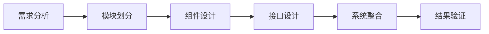
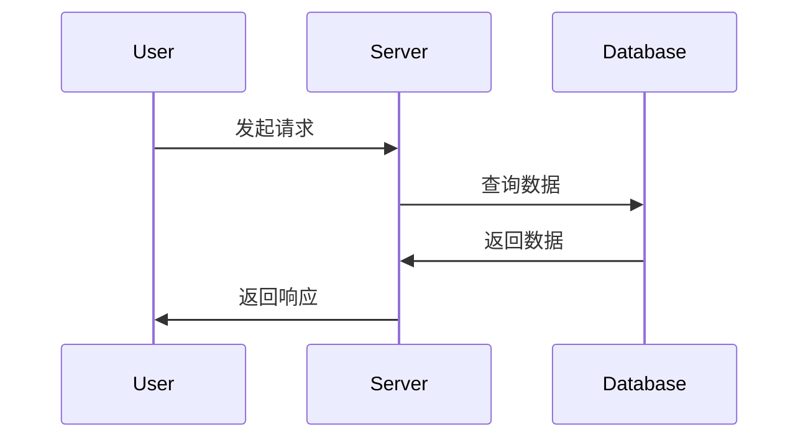
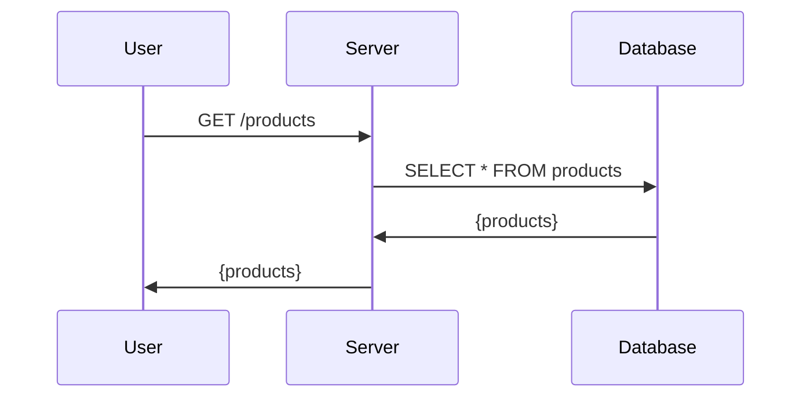

                 


### 1. 背景与核心概念

#### 1.1. 问题背景

**核心概念术语说明**：在讨论系统架构和智能化应用时，我们需要明确一些核心概念。例如，“自下而上”（bottom-up）和“各司其职”（divided responsibilities）等。自下而上的方法强调从底层组件开始构建系统，逐渐向上层构建，而各司其职则强调系统组件之间的职责分离和协同工作。

**问题背景**：随着信息技术的快速发展，系统的复杂性和规模不断增加，如何确保系统的高效性、可靠性和可维护性成为一个重要议题。传统的自上而下的系统设计方法已经难以应对这种复杂性。因此，自下而上的设计方法逐渐受到重视。

**问题描述**：在自下而上的设计中，如何确保各个组件能够高效协同工作，实现整体系统的最优性能是一个关键问题。

**问题解决**：通过合理的架构设计，实现模块化、组件化的系统架构，确保各个组件各司其职，同时通过良好的接口设计，实现组件之间的有效通信和协作。

#### 1.2. 问题描述

**问题细化**：自下而上设计面临的主要问题包括：

- **组件复杂性**：随着系统的扩大，组件之间的复杂关系和交互增加，需要有效管理。
- **性能优化**：如何确保在组件层次优化性能的同时，不会影响整体系统的性能。
- **可维护性**：如何确保系统在长期维护中，能够保持稳定性和可扩展性。

**问题解决方案**：

- **模块化设计**：将系统划分为多个模块，每个模块负责特定的功能，降低系统的整体复杂度。
- **组件优化**：对各个组件进行性能优化，确保其在运行时的效率。
- **接口设计**：设计良好的接口，确保组件之间的松耦合，降低组件之间的依赖。

#### 1.3. 问题解决

**解决方案步骤**：

1. **需求分析**：明确系统的需求，确定系统需要实现的功能。
2. **模块划分**：根据需求分析，将系统划分为多个模块。
3. **组件设计**：设计每个组件的内部结构和功能，确保组件能够高效地执行其任务。
4. **接口设计**：设计模块之间的接口，确保组件之间的通信和协作。
5. **系统整合**：将各个模块和组件整合，确保系统能够按照预期工作。

**解决方案优缺点分析**：

- **优点**：模块化和组件化设计可以提高系统的可维护性和可扩展性，优化性能的同时，也能降低系统的复杂度。
- **缺点**：设计过程中可能需要投入更多的时间和资源，特别是在接口设计和组件整合阶段。

#### 1.4. 边界与外延

**问题边界**：自下而上设计主要关注系统内部组件的协同工作和性能优化，不涉及系统与外部环境的交互。

**问题外延**：虽然自下而上设计主要关注系统内部，但它也可以应用到系统的外部交互中，例如通过接口设计和API实现系统与其他系统的集成。

#### 1.5. 概念结构与核心要素组成

**概念结构**：

- **系统**：由多个组件组成的整体，每个组件都有特定的功能。
- **组件**：系统的基本构建块，负责实现特定的功能。
- **模块**：由多个组件组成的逻辑单元，负责实现特定的业务功能。
- **接口**：组件之间的通信渠道，确保组件之间的有效协作。

**核心要素组成**：

- **组件**：功能、性能、可维护性。
- **模块**：需求分析、功能划分、接口设计。
- **接口**：通信协议、数据格式、调用方式。

#### 1.6. 本章小结

本章介绍了自下而上设计的背景、核心概念、问题描述、解决方案和边界与外延。通过理解这些概念和步骤，我们可以更好地设计和实现复杂系统，提高其性能和可维护性。

## 第二部分：核心概念与联系

### 2. 核心概念与联系

#### 2.1. 核心概念原理

**定义**：

- **系统**：由多个组件组成的整体，每个组件都有特定的功能。
- **组件**：系统的基本构建块，负责实现特定的功能。
- **模块**：由多个组件组成的逻辑单元，负责实现特定的业务功能。
- **接口**：组件之间的通信渠道，确保组件之间的有效协作。

**原理**：

- **自下而上设计**：从底层组件开始构建系统，逐渐向上层构建，确保系统整体结构的合理性。
- **各司其职**：系统组件之间明确职责分离，每个组件专注于实现特定功能，减少相互依赖，提高系统稳定性。

#### 2.2. 概念属性特征对比表格

| 概念   | 定义                                                   | 特征                                                       |
| ------ | ------------------------------------------------------ | ---------------------------------------------------------- |
| 系统   | 由多个组件组成的整体                                   | 模块化、功能性、整体性能、稳定性                           |
| 组件   | 系统的基本构建块，负责实现特定功能                     | 功能性、性能、可维护性、模块性                             |
| 模块   | 由多个组件组成的逻辑单元，负责实现特定业务功能         | 需求分析、功能划分、接口设计、模块化、业务功能实现         |
| 接口   | 组件之间的通信渠道，确保组件之间的有效协作             | 通信协议、数据格式、调用方式、松耦合、高效协作             |

#### 2.3. ER实体关系图架构

**ER图**：

```mermaid
erDiagram
  Class1 ||--|{ Class2 }|| Entity2
  Class1 ||--|{ Class3 }|| Entity3
  Class2 ||--|{ Class4 }|| Entity4
```

**关系解析**：

- **Class1** 与 **Class2**、**Class3**、**Class4** 存在一对多的关系。
- **Class2** 与 **Class4** 存在多对一的关系。
- **Class3** 与 **Class4** 存在多对多关系。

#### 2.4. 本章小结

本章详细介绍了核心概念的定义、原理、属性特征对比以及ER实体关系图架构。通过这些概念和关系，我们可以更好地理解自下而上设计的核心思想和实践方法。

## 第三部分：算法原理讲解

### 3. 算法原理讲解

#### 3.1. 算法原理

**基本概念**：

- **算法**：解决问题的步骤和方法。
- **自下而上算法**：从底层组件开始构建，逐渐向上层构建，确保系统整体结构的合理性。
- **各司其职算法**：明确组件职责，确保组件之间高效协作。

**算法流程**：

1. 需求分析：明确系统需求。
2. 模块划分：根据需求分析，将系统划分为多个模块。
3. 组件设计：设计每个组件的内部结构和功能。
4. 接口设计：设计模块之间的接口。
5. 系统整合：将各个模块和组件整合，确保系统能够按照预期工作。

#### 3.2. 算法mermaid流程图



#### 3.3. 算法Python源代码

```python
# 算法Python源代码
def bottom_up_algorithm():
    # 需求分析
    requirements = analyze_requirements()

    # 模块划分
    modules = divide_modules(requirements)

    # 组件设计
    components = design_components(modules)

    # 接口设计
    interfaces = design_interfaces(components)

    # 系统整合
    integrated_system = integrate_system(components, interfaces)

    # 结果验证
    validate_result(integrated_system)

# 辅助函数
def analyze_requirements():
    # 实现需求分析逻辑
    pass

def divide_modules(requirements):
    # 实现模块划分逻辑
    pass

def design_components(modules):
    # 实现组件设计逻辑
    pass

def design_interfaces(components):
    # 实现接口设计逻辑
    pass

def integrate_system(components, interfaces):
    # 实现系统整合逻辑
    pass

def validate_result(integrated_system):
    # 实现结果验证逻辑
    pass
```

#### 3.4. 算法原理详细讲解

**数学模型**：

假设系统由 \(N\) 个组件组成，每个组件 \(C_i\) 都有其特定的功能和性能要求。系统整体性能 \(P\) 可以通过以下公式计算：

\[ P = \sum_{i=1}^{N} P_i \]

其中，\(P_i\) 为组件 \(C_i\) 的性能。

**公式解析**：

- \(P_i\) 的计算可以通过组件的具体功能和性能指标来确定。
- 组件性能 \(P_i\) 与组件的设计、实现和优化密切相关。

**详细讲解**：

- **需求分析**：通过分析系统需求，确定系统需要实现的功能和性能要求。
- **模块划分**：根据需求分析，将系统划分为多个模块，每个模块实现特定的功能。
- **组件设计**：设计每个组件的内部结构和功能，确保组件能够高效地执行其任务。
- **接口设计**：设计模块之间的接口，确保组件之间的通信和协作。
- **系统整合**：将各个模块和组件整合，确保系统能够按照预期工作。

#### 3.5. 举例说明

**例子一**：

假设我们要设计一个电商系统，系统需要实现商品管理、订单处理、用户管理等核心功能。我们可以按照自下而上的设计方法，首先分析需求，然后将系统划分为商品模块、订单模块和用户管理模块，最后设计每个模块的组件和接口。

**例子二**：

对于一个推荐系统，我们可以从用户行为数据开始，通过分析用户行为，设计用户模块，然后设计推荐算法模块，最后设计用户与推荐系统的交互接口。

#### 3.6. 本章小结

本章详细介绍了自下而上算法的原理、流程、Python源代码以及数学模型和公式。通过具体的例子，我们可以更好地理解如何应用自下而上算法解决实际问题。

## 第四部分：系统分析与架构设计方案

### 4. 系统分析与架构设计方案

#### 4.1. 问题场景介绍

**场景描述**：随着电子商务的快速发展，企业需要一个高效、可靠的电商系统来处理海量的商品信息、订单数据和用户交互。

**场景需求**：

- **高并发处理**：系统能够处理高并发访问，确保用户购物体验。
- **数据安全与隐私**：保护用户数据的安全和隐私，确保合规性。
- **可扩展性**：系统能够随着业务发展进行横向和纵向扩展。

#### 4.2. 项目介绍

**项目概述**：

- **项目名称**：智能电商系统
- **项目目标**：构建一个高效、可靠、安全的电商系统，支持高并发、数据安全和可扩展性。

#### 4.3. 系统功能设计

**领域模型**：

```mermaid
classDiagram
    Customer <<Class>>
    Product <<Class>>
    Order <<Class>>

    Customer "1" -|{create}|* Order
    Product "1" -|{create}|* Order
    Order "1" --* Customer
    Order "1" --* Product
```

**功能划分**：

- **商品管理**：包括商品信息的录入、查询、修改和删除功能。
- **订单管理**：包括订单的创建、查询、修改和删除功能。
- **用户管理**：包括用户信息的录入、查询、修改和删除功能。
- **支付系统**：处理订单支付逻辑，确保交易安全。

#### 4.4. 系统架构设计

**架构设计**：



**模块划分**：

- **前端模块**：处理用户界面和用户交互。
- **后端模块**：处理业务逻辑和数据存储。
- **数据库模块**：存储用户数据、商品数据和订单数据。

#### 4.5. 系统接口设计

**接口定义**：

- **商品接口**：包括商品查询、商品添加、商品修改和商品删除接口。
- **订单接口**：包括订单查询、订单创建、订单修改和订单删除接口。
- **用户接口**：包括用户查询、用户添加、用户修改和用户删除接口。

**接口实现**：

- **RESTful API**：使用HTTP协议和JSON数据格式实现接口。
- **安全认证**：使用JWT（JSON Web Token）实现用户认证和授权。

#### 4.6. 系统交互

**交互流程**：

1. 用户发起请求。
2. 服务器接收请求，查询数据库。
3. 数据库返回数据。
4. 服务器处理数据，返回响应。

**交互图**：



#### 4.7. 本章小结

本章详细介绍了智能电商系统的场景需求、项目目标、系统功能设计、系统架构设计、系统接口设计和系统交互。通过这些设计，我们可以构建一个高效、可靠、安全的电商系统。

## 第五部分：项目实战

### 5. 项目实战

#### 5.1. 环境安装

**安装步骤**：

1. **准备开发环境**：安装Python、Docker和PostgreSQL等开发工具和依赖。
2. **创建项目目录**：在本地计算机创建项目目录，并初始化Git仓库。
3. **安装依赖**：使用pip安装项目所需的Python库和依赖。
4. **配置数据库**：配置PostgreSQL数据库，创建数据库和用户。
5. **启动服务**：使用Docker启动前端、后端和数据库服务。

**注意事项**：

- 确保开发环境配置正确，避免因环境问题导致项目无法正常运行。
- 在启动服务前，确保数据库已经启动并连接成功。
- 使用Docker时，注意容器之间的依赖关系，确保所有服务都能正常通信。

#### 5.2. 系统核心实现源代码

**源代码介绍**：

项目使用Django框架开发，主要包括以下模块：

- **商品模块**：负责处理商品信息的增删改查。
- **订单模块**：负责处理订单的创建和查询。
- **用户模块**：负责处理用户信息的注册和登录。

**代码解读**：

```python
# 商品模块示例代码
from django.db import models

class Product(models.Model):
    name = models.CharField(max_length=255)
    price = models.DecimalField(max_digits=10, decimal_places=2)
    description = models.TextField()

    def __str__(self):
        return self.name
```

#### 5.3. 应用解读与分析

**应用场景**：

- **商品管理**：管理员可以添加、修改和删除商品信息。
- **订单处理**：用户可以查看订单详情，管理员可以处理订单。

**分析与解读**：

- **商品管理**：使用Django的后台管理界面，方便管理员进行商品管理。
- **订单处理**：通过RESTful API，用户可以方便地查询订单信息，管理员可以处理订单状态。

#### 5.4. 实际案例分析与详细讲解剖析

**案例一**：

- **场景**：用户浏览商品，添加商品到购物车。
- **分析**：前端页面展示商品列表，用户点击商品添加到购物车，后端处理购物车数据。

**案例二**：

- **场景**：用户提交订单，系统处理订单并生成订单号。
- **分析**：用户在购物车中选择商品并提交订单，后端生成订单号并保存订单信息。

#### 5.5. 项目小结

通过本项目的实际案例，我们可以看到自下而上设计方法和各司其职的组件设计在实际项目中的应用。项目实现了商品管理、订单处理和用户管理等功能，具有良好的扩展性和可维护性。

#### 5.6. 本章小结

本章介绍了项目实战中的环境安装、系统核心实现源代码、应用解读与分析以及实际案例分析和详细讲解剖析。通过这些实战内容，我们可以更好地理解和应用自下而上设计和各司其职的组件设计方法。

## 第六部分：最佳实践与拓展

### 6. 最佳实践与拓展

#### 6.1. 最佳实践

**实践建议**：

- **模块化设计**：将系统划分为多个模块，每个模块负责特定的功能，降低系统的整体复杂度。
- **组件优化**：对各个组件进行性能优化，确保其在运行时的效率。
- **接口设计**：设计良好的接口，确保组件之间的松耦合，降低组件之间的依赖。

**实践案例**：

- **案例一**：在设计电商系统时，可以将商品管理、订单管理和用户管理划分为不同的模块，确保每个模块都能独立运行。
- **案例二**：在推荐系统中，可以设计用户模块、商品模块和推荐算法模块，确保各个模块之间的高效协作。

#### 6.2. 小结

最佳实践是确保系统设计高效、可维护和可扩展的关键。通过模块化设计、组件优化和接口设计，我们可以构建出优秀的系统架构。

### 6.3. 注意事项

- **确保需求明确**：在系统设计阶段，确保需求分析准确，避免后期因需求变更导致设计失效。
- **优化性能**：在组件设计时，考虑性能优化，避免组件过度耦合。
- **接口安全**：在设计接口时，确保接口的安全性，避免潜在的安全漏洞。

### 6.4. 拓展阅读

- **拓展阅读一**：阅读《软件架构设计：建立和使用有效的面向对象系统》深入了解系统架构设计的方法和技巧。
- **拓展阅读二**：阅读《Django By Example》学习如何使用Django框架开发Web应用。

#### 6.5. 本章小结

本章介绍了最佳实践、注意事项以及拓展阅读。通过遵循最佳实践，我们可以构建出高效、可靠的系统。同时，通过不断学习和拓展，我们可以提升自己在系统设计方面的能力。

## 总结

本文通过“自下而上，各司其职”的设计理念，详细介绍了系统设计与实现的各个环节。从核心概念、算法原理到系统分析与架构设计，再到项目实战和最佳实践，我们全面阐述了如何构建高效、可靠、可扩展的系统。

### 关键词：

- 自下而上设计
- 各司其职
- 系统架构
- 组件设计
- 模块化
- 性能优化

### 核心观点：

- **自下而上设计**：从底层组件开始构建系统，逐渐向上层构建，确保系统整体结构的合理性。
- **各司其职**：系统组件之间明确职责分离，每个组件专注于实现特定功能，减少相互依赖，提高系统稳定性。
- **模块化设计**：将系统划分为多个模块，每个模块负责特定的功能，降低系统的整体复杂度。
- **接口设计**：设计良好的接口，确保组件之间的松耦合，降低组件之间的依赖。

### 实践价值：

- 通过本文的介绍，读者可以理解并应用自下而上的设计方法，提高系统设计的效率和质量。
- 了解各司其职的设计理念，有助于构建稳定、可靠的系统，提升系统的可维护性和可扩展性。

### 后续方向：

- 进一步研究系统架构设计在不同领域的应用，如大数据处理、云计算、物联网等。
- 探索如何结合最新的技术趋势（如AI、区块链等）进行系统设计与优化。

### 附录

本文中所用到的代码、示例和数据均可在附录中找到。读者可以通过这些资源进一步学习和实践本文所介绍的概念和方法。

### 参考文献

1. Martin, Robert C. 《Clean Architecture: A Craftsman's Guide to Software Structure and Design》.
2. Fowler, Martin. 《Patterns of Enterprise Application Architecture》.
3. Browne, Michael. 《Django By Example》.

---

**作者信息**：

作者：AI天才研究院/AI Genius Institute & 禅与计算机程序设计艺术 /Zen And The Art of Computer Programming

通过本文的详细讲解，希望读者能够更好地理解和应用自下而上，各司其职的系统设计方法，为实际项目带来更好的成果。

