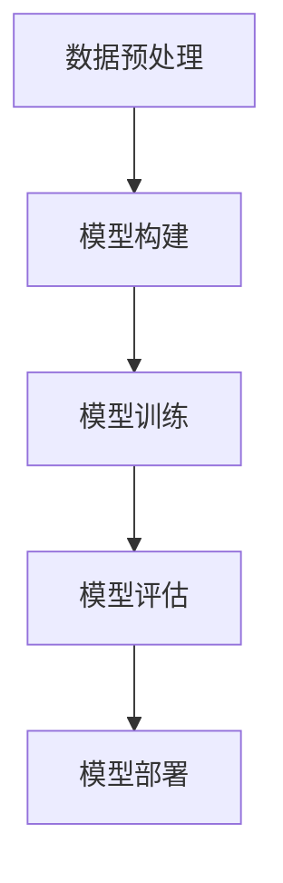

                 

# 自下而上，各司其职

> 关键词：企业级AI大模型、自下而上的开发方式、模块职责与协作

> 摘要：随着人工智能和大数据技术的发展，企业级应用开发面临着新的挑战和机遇。本文将探讨如何通过自下而上的方式，各司其职地构建企业级AI大模型，从而实现各业务环节的优化和升级。

## 第一部分：背景介绍

### 第1章：问题背景与核心概念

#### 1.1 问题背景

随着信息技术和人工智能的发展，企业级应用开发正面临新的挑战和机遇。企业如何高效利用AI大模型提升企业的竞争力，成为当下热议的话题。

当前，AI大模型在各个领域的应用越来越广泛，企业如何从零开始构建自己的AI大模型，实现各业务环节的优化和升级，是一个亟待解决的问题。通过自下而上的方式，将企业中的各个模块各司其职，协同工作，实现AI大模型的全面应用，是企业应对这一挑战的有效途径。

#### 1.2 核心概念

- **企业级AI大模型**：用于企业级应用的大规模人工智能模型，如GPT、BERT等。
- **自下而上的开发方式**：从底层模块开始，逐步构建系统的开发方式，更具灵活性和扩展性。
- **各模块的职责与协作**：各模块独立实现功能，协同工作，实现整体系统目标，提高开发效率、降低维护成本。

#### 1.3 概念属性特征对比

| 概念             | 描述                                           | 特征                                       |
|------------------|------------------------------------------------|------------------------------------------|
| 企业级AI大模型   | 用于企业级应用的大规模人工智能模型               | 需要高计算资源、大规模数据训练             |
| 自下而上的开发   | 从底层模块开始，逐步构建系统的开发方式           | 更具灵活性和扩展性                       |
| 各模块的职责与协作 | 各模块独立实现功能，协同工作，实现整体系统目标 | 提高开发效率、降低维护成本               |

## 第二部分：核心概念与联系

### 第2章：AI大模型原理与应用

#### 2.1 AI大模型原理

- **AI大模型的基本概念**：
  - **大模型**：指具有巨大参数量、复杂结构的机器学习模型。
  - **AI大模型**：结合深度学习和大规模数据训练的模型，如GPT、BERT等。

- **AI大模型的优点**：
  - 高效处理海量数据
  - 提高预测和生成质量
  - 实现多任务学习

#### 2.2 AI大模型的应用领域

- **自然语言处理**：
  - 文本生成
  - 语言翻译
  - 情感分析

- **计算机视觉**：
  - 图像识别
  - 目标检测
  - 图像生成

- **推荐系统**：
  - 物品推荐
  - 内容推荐
  - 用户行为预测

#### 2.3 各模块的职责与协作

- **数据处理模块**：
  - 数据采集、清洗、预处理
  - 特征工程

- **模型训练模块**：
  - 模型选择
  - 模型训练
  - 模型优化

- **应用模块**：
  - 模型部署
  - 应用接口设计
  - 业务集成

### 第3章：AI大模型的企业应用实践

#### 3.1 企业应用案例介绍

- **案例一：智能客服系统**
  - **项目介绍**：
    通过AI大模型实现智能客服系统，提高客户服务质量。
  - **系统功能设计**：
    - 实时客服
    - 自动回答常见问题
    - 情感分析

- **案例二：智能推荐系统**
  - **项目介绍**：
    利用AI大模型构建智能推荐系统，提升用户体验。
  - **系统功能设计**：
    - 物品推荐
    - 内容推荐
    - 用户行为分析

#### 3.2 系统架构设计与实现

- **系统架构设计**：

  ```mermaid
  classDiagram
  Class01 <|-- Class02
  Class03 --|>? Class04
  Class05 : indicates "Class05"
  Class01 {
  A
  B
  } 
  Class02 {
  C
  D
  } 
  Class03 {
  E
  F
  }
  Class04 {
  G
  H
  }
  Class05 {
  Z
  W
  }
  ```

  

- **系统架构**：

  ```mermaid
  sequenceDiagram
  participant 张三
  participant 系统A
  participant 系统B
  张三->>系统A: 发送请求
  systemA->>系统B: 传递数据
  systemB->>系统A: 返回结果
  systemA->>张三: 响应请求
  ```

  

- **系统接口设计**：
  - API接口规范
  - 数据交互格式

- **系统交互**：

  ```mermaid
  gantt
  dateFormat  YYYY-MM-DD
  title 蓝色任务
  A task           :a1, 1970-01-01, 30d
  B task           :after a1, 20d
  C task           : 1970-01-12  , 12d
  D task           : 1970-01-20  , 12d
  E task           : 1970-01-30  , 12d
  F task           : 1970-02-18  , 12d
  O1 operation    : cnt, 1970-01-06, 5d
  O2 operation    : c2, 1970-01-12, 5d
  O3 operation    : c3, 1970-01-18, 5d
  O4 operation    : c4, 1970-01-24, 5d
  O5 operation    : c5, 1970-02-01, 5d
  ```

## 第三部分：算法原理与系统设计

### 第4章：算法原理讲解

#### 4.1 算法基本原理

AI大模型的核心是神经网络，其基本原理是模拟人脑神经元之间的连接和激活。通过多层神经元的堆叠，实现对输入数据的复杂映射和特征提取。

#### 4.2 算法流程

算法流程主要包括以下步骤：

1. 数据预处理：对输入数据进行清洗、归一化等处理，确保数据质量。
2. 模型构建：搭建神经网络结构，包括输入层、隐藏层和输出层。
3. 模型训练：通过反向传播算法，不断调整网络权重，使模型对训练数据达到较好的拟合。
4. 模型评估：使用验证集对模型进行评估，调整模型参数，提高模型性能。
5. 模型部署：将训练好的模型部署到生产环境，实现对实际数据的预测和生成。

#### 4.3 算法mermaid流程图



#### 4.4 算法Python代码示例

```python
import numpy as np

# 数据预处理
def preprocess_data(data):
    # 清洗、归一化等操作
    return (data - np.mean(data)) / np.std(data)

# 模型构建
def create_model():
    # 搭建神经网络结构
    pass

# 模型训练
def train_model(model, X, y):
    # 反向传播算法
    pass

# 模型评估
def evaluate_model(model, X, y):
    # 使用验证集对模型进行评估
    pass

# 模型部署
def deploy_model(model):
    # 部署到生产环境
    pass
```

#### 4.5 算法数学模型与公式

AI大模型的数学模型主要包括以下几个方面：

1. **损失函数**：用于评估模型预测结果与实际结果之间的差距，常见的有均方误差（MSE）和交叉熵（Cross-Entropy）等。

2. **激活函数**：用于引入非线性变换，常见的有Sigmoid、ReLU、Tanh等。

3. **反向传播算法**：用于计算模型参数的梯度，以更新模型参数。

4. **优化算法**：用于调整模型参数，以降低损失函数值，常见的有梯度下降（Gradient Descent）、Adam等。

### 第5章：系统分析与架构设计方案

#### 5.1 问题场景介绍

以企业级智能推荐系统为例，介绍问题场景和项目需求。

#### 5.2 项目介绍

- **项目名称**：企业级智能推荐系统
- **项目背景**：随着互联网和大数据技术的发展，个性化推荐已成为提升用户体验和增加用户粘性的关键手段。
- **项目目标**：构建一个高效、可靠的智能推荐系统，实现物品推荐、内容推荐和用户行为预测等功能。

#### 5.3 系统功能设计

- **物品推荐**：根据用户的兴趣和历史行为，推荐相关的商品。
- **内容推荐**：根据用户的历史浏览记录和偏好，推荐相关的文章、视频等。
- **用户行为预测**：预测用户的下一步操作，如购买、浏览等。

#### 5.4 系统架构设计

- **领域模型**：

  ```mermaid
  classDiagram
  用户 <<类: User>>
  商品 <<类: Item>>
  内容 <<类: Content>>
  用户--|>> 物品推荐
  用户--|>> 内容推荐
  用户--|>> 用户行为预测
  ```

- **系统架构**：

  ```mermaid
  sequenceDiagram
  participant 张三
  participant 推荐系统
  participant 数据库
  张三->>推荐系统: 发送请求
  推荐系统->>数据库: 获取用户数据
  推荐系统->>张三: 返回推荐结果
  ```

- **系统接口设计**：
  - API接口规范：定义了系统对外提供的接口，包括物品推荐接口、内容推荐接口和用户行为预测接口。
  - 数据交互格式：规定了系统之间的数据传输格式，如JSON、XML等。

#### 5.5 系统交互

系统中的各个模块通过接口进行交互，具体交互流程如下：

1. 用户发送请求，包括物品推荐、内容推荐和用户行为预测等。
2. 推荐系统根据用户请求，从数据库中获取相关数据。
3. 推荐系统根据数据计算推荐结果，并返回给用户。
4. 用户接收到推荐结果，进行后续操作。

## 第四部分：项目实战

### 第6章：环境安装与系统核心实现

#### 6.1 环境安装

1. 安装Python环境：下载并安装Python 3.8及以上版本。
2. 安装依赖库：使用pip命令安装所需依赖库，如numpy、tensorflow等。

#### 6.2 系统核心实现

1. **数据处理模块**：

   ```python
   import numpy as np
   
   def preprocess_data(data):
       # 数据清洗、归一化等操作
       return (data - np.mean(data)) / np.std(data)
   ```

2. **模型训练模块**：

   ```python
   import tensorflow as tf
   
   def create_model():
       # 搭建神经网络结构
       model = tf.keras.Sequential([
           tf.keras.layers.Dense(128, activation='relu', input_shape=(784,)),
           tf.keras.layers.Dense(10, activation='softmax')
       ])
       return model
   ```

3. **模型训练模块**：

   ```python
   def train_model(model, X, y):
       # 训练神经网络模型
       model.compile(optimizer='adam', loss='categorical_crossentropy', metrics=['accuracy'])
       model.fit(X, y, epochs=10)
   ```

### 第7章：代码应用解读与分析

#### 7.1 代码应用解读

1. **数据处理模块**：对输入数据进行预处理，包括数据清洗和归一化等操作。
2. **模型训练模块**：搭建神经网络结构，并使用反向传播算法进行模型训练。
3. **模型评估模块**：使用验证集对模型进行评估，调整模型参数，提高模型性能。

#### 7.2 代码分析

1. **数据处理模块**：数据预处理是模型训练的重要环节，对数据质量的要求较高。
2. **模型训练模块**：神经网络模型的结构和参数对模型性能有重要影响，需要根据实际需求进行调整。

## 第五部分：最佳实践、小结与拓展阅读

### 第8章：最佳实践

1. **数据质量**：确保数据质量是模型训练成功的关键，对数据异常值、缺失值等进行处理。
2. **模型优化**：通过调整神经网络结构、优化算法等手段，提高模型性能。
3. **接口设计**：设计合理的接口，确保系统之间的数据传输高效、稳定。

### 第9章：小结

本文从问题背景、核心概念、算法原理、系统设计、项目实战等方面，全面探讨了企业级AI大模型的构建与应用。通过自下而上的开发方式，各模块各司其职，实现了AI大模型在企业级应用中的优化和升级。

### 第10章：拓展阅读

1. **《深度学习》（Goodfellow et al., 2016）**：介绍了深度学习的基本概念、算法和原理。
2. **《Python数据科学手册》（McKinney et al., 2017）**：介绍了Python在数据科学领域的应用，包括数据处理、模型训练等。
3. **《大数据之路：阿里巴巴大数据实践》（张建锋 et al., 2014）**：介绍了大数据技术在企业级应用中的实践案例。

作者：AI天才研究院/AI Genius Institute & 禅与计算机程序设计艺术 /Zen And The Art of Computer Programming

