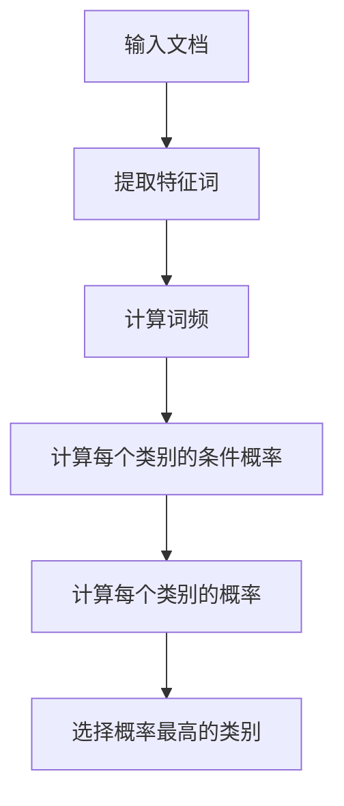
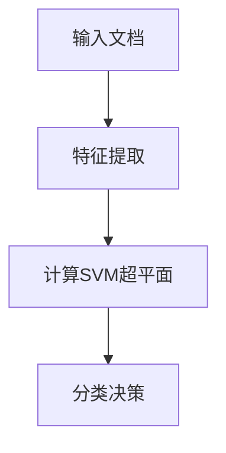
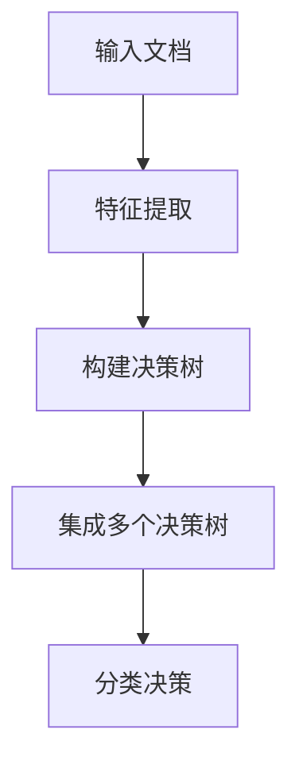
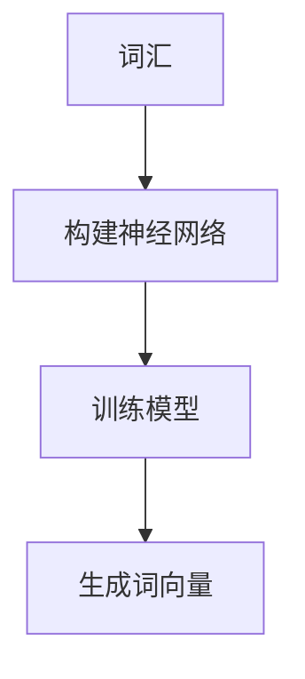
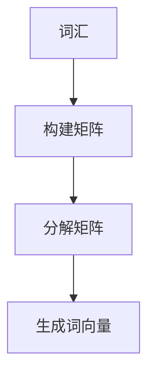
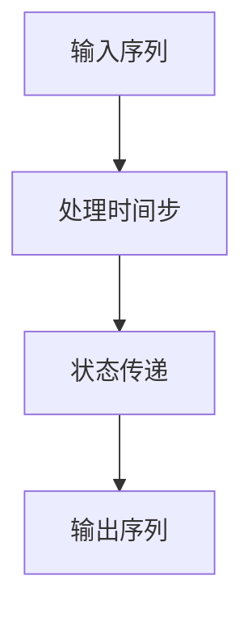
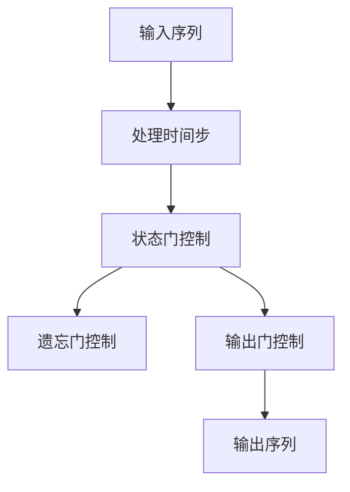
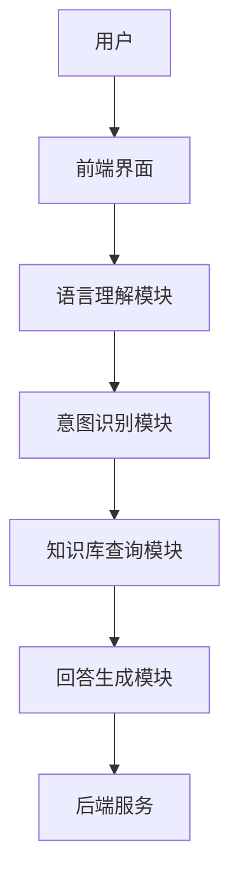
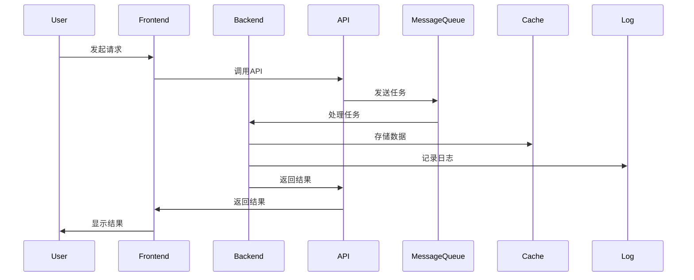

                 

### 第1步：背景介绍

自然语言处理（NLP）是一门融合计算机科学、人工智能和语言学的交叉学科，旨在使计算机理解和处理人类语言。NLP的发展可以追溯到上世纪50年代，当时的科学家们首次提出机器翻译的想法。随着时间的推移，NLP技术逐渐成熟，并在现代社会中发挥着越来越重要的作用。

#### 问题背景

NLP的起源可以追溯到人工智能的早期阶段。当时的科学家们希望机器能够理解和生成人类语言，从而实现人机交互。随着计算机性能的提升和算法的进步，NLP技术逐渐从理论研究走向实际应用。如今，NLP在信息检索、机器翻译、文本分析、智能客服等领域都有广泛应用。

#### 问题描述

NLP在产品开发中的应用场景主要包括：

1. **智能客服**：通过自然语言处理技术，客服系统能够理解和响应用户的提问，提供24/7的服务。
2. **情感分析**：帮助企业了解用户对产品或服务的情感倾向，为市场策略提供数据支持。
3. **文本挖掘**：从大量非结构化文本中提取有价值的信息，用于数据分析和决策。
4. **内容推荐**：基于用户的兴趣和行为，推荐相关的文章、产品或服务。

然而，NLP在产品开发中也面临着一系列挑战：

1. **语言复杂性**：自然语言是一种高度复杂的符号系统，包含语法、语义、语用等多个层次，这使得NLP系统的设计和实现变得异常困难。
2. **数据质量**：NLP系统依赖于大量的训练数据，数据的质量直接影响模型的性能。
3. **实时性**：在某些应用场景中，如智能客服，系统需要能够实时处理用户的提问，这对系统的响应速度提出了高要求。

#### 问题解决

为了有效地利用NLP技术提升产品质量，我们可以采取以下策略：

1. **数据驱动的模型优化**：通过不断收集和清洗数据，优化NLP模型的性能。
2. **多语言支持**：考虑到全球化的趋势，NLP产品应具备多语言处理能力。
3. **人机协同**：结合人工审查和机器学习，提高系统对复杂问题的处理能力。

#### 边界与外延

NLP技术与其他领域（如机器学习、人工智能等）有着紧密的联系。机器学习为NLP提供了强大的算法支持，而人工智能则使NLP技术得以应用于更广泛的场景。此外，随着深度学习技术的兴起，NLP模型的表现力得到了显著提升，这为NLP在产品中的应用带来了更多可能性。

#### 概念结构与核心要素组成

NLP的核心概念包括：

1. **语言模型**：用于预测下一个单词或句子，是NLP的基础。
2. **词向量**：将词汇映射到向量空间，用于表示词汇的语义信息。
3. **文本分类**：将文本分为不同的类别，常用于情感分析和主题分类。
4. **情感分析**：判断文本中的情感倾向，如正面、负面或中性。
5. **文本挖掘**：从大量文本中提取有价值的信息，如关键词、主题和趋势。

这些概念相互关联，构成了NLP技术体系的核心。接下来，我们将进一步探讨这些核心概念，并分析它们在NLP中的应用。

### 第2步：核心概念与联系

在深入了解NLP的应用之前，我们需要掌握NLP的核心概念，并理解这些概念之间的联系。以下是NLP中几个关键概念的定义、属性特征对比以及它们之间的联系。

#### 核心概念原理

**语言模型**：语言模型是用于预测下一个单词或句子的概率分布。它是NLP的基础，用于生成文本、理解语言结构等。

**词向量**：词向量是将词汇映射到高维向量空间的方法，用于表示词汇的语义信息。常见的词向量模型有Word2Vec、GloVe等。

**文本分类**：文本分类是将文本分为不同类别的过程。它广泛应用于情感分析、主题分类等领域。

**情感分析**：情感分析是判断文本中的情感倾向，如正面、负面或中性。它有助于了解用户对产品或服务的态度。

**文本挖掘**：文本挖掘是从大量非结构化文本中提取有价值信息的过程，如关键词、主题和趋势。

#### 概念属性特征对比表格

以下是一个简化的对比表格，展示这些核心概念的主要属性特征：

| 概念       | 定义                                                         | 主要特征                                       |
|------------|--------------------------------------------------------------|------------------------------------------------|
| 语言模型   | 预测下一个单词或句子的概率分布                               | 概率分布、生成文本、理解语言结构             |
| 词向量     | 将词汇映射到高维向量空间的方法                             | 语义信息表示、相似性计算、词汇嵌入           |
| 文本分类   | 将文本分为不同类别的过程                                   | 类别预测、标签分配、分类效果评估           |
| 情感分析   | 判断文本中的情感倾向                                       | 情感分类、情感极性、文本情感识别           |
| 文本挖掘   | 从大量非结构化文本中提取有价值信息的过程                  | 关键词提取、主题建模、趋势分析             |

#### ER实体关系图架构

为了更清晰地展示这些概念之间的联系，我们可以使用实体关系图（ER图）来描述。以下是一个简化的ER图，展示了NLP中主要概念之间的联系：

```mermaid
erDiagram
  产品 ||--|{ NLP技术 }
  NLP技术 ||--|{ 语言模型 }
  NLP技术 ||--|{ 词向量 }
  NLP技术 ||--|{ 文本分类 }
  NLP技术 ||--|{ 情感分析 }
  NLP技术 ||--|{ 文本挖掘 }
  产品 ||--|{ 智能客服 }
  智能客服 ||--|{ 语言理解 }
  语言理解 ||--|{ 语言模型 }
  语言理解 ||--|{ 词向量 }
  智能客服 ||--|{ 情感分析 }
  智能客服 ||--|{ 文本挖掘 }
```

在这个ER图中，产品作为核心实体，与NLP技术以及其他应用场景（如智能客服）相关联。NLP技术进一步关联到具体的算法和模型，形成了一个层次化的结构。

通过上述核心概念的介绍和ER图的展示，我们可以更好地理解NLP的技术体系。接下来，我们将深入探讨NLP的关键算法，了解它们的工作原理和应用。

### 第3步：算法原理讲解

自然语言处理（NLP）涉及多种算法，其中一些最为关键且广泛应用的包括文本分类算法、词嵌入和语言模型。以下，我们将逐步讲解这些算法的原理，通过具体的示例和代码实现来帮助读者理解。

#### 文本分类算法

文本分类是将文本数据分为预定义的类别的一种任务。常见的文本分类算法包括朴素贝叶斯（Naive Bayes）、支持向量机（SVM）、和随机森林（Random Forest）等。以下是这些算法的简要介绍和Python代码示例。

**1. 朴素贝叶斯算法**

朴素贝叶斯算法是一种基于贝叶斯定理的简单概率分类器，假设特征之间相互独立。

**算法流程图：**



**Python代码示例：**

```python
from sklearn.feature_extraction.text import CountVectorizer
from sklearn.naive_bayes import MultinomialNB
from sklearn.model_selection import train_test_split

# 示例文本数据
data = [
    "我喜欢这个产品。",
    "这个产品不好用。",
    "这个产品非常好。",
    "我不喜欢这个产品。"
]

# 标签
labels = ["正面", "负面", "正面", "负面"]

# 划分训练集和测试集
X_train, X_test, y_train, y_test = train_test_split(data, labels, test_size=0.2, random_state=42)

# 特征提取
vectorizer = CountVectorizer()
X_train_counts = vectorizer.fit_transform(X_train)

# 训练模型
classifier = MultinomialNB()
classifier.fit(X_train_counts, y_train)

# 测试模型
X_test_counts = vectorizer.transform(X_test)
predictions = classifier.predict(X_test_counts)

# 输出预测结果
print(predictions)
```

**2. 支持向量机（SVM）**

支持向量机是一种强大的分类算法，通过找到一个最佳的超平面来分割数据。

**算法流程图：**



**Python代码示例：**

```python
from sklearn.feature_extraction.text import TfidfVectorizer
from sklearn.svm import SVC
from sklearn.pipeline import make_pipeline

# 继续使用上面的数据
X_train, X_test, y_train, y_test = train_test_split(data, labels, test_size=0.2, random_state=42)

# 创建SVM分类器管道
model = make_pipeline(TfidfVectorizer(), SVC(kernel='linear'))

# 训练模型
model.fit(X_train, y_train)

# 测试模型
predictions = model.predict(X_test)

# 输出预测结果
print(predictions)
```

**3. 随机森林**

随机森林是一种基于决策树的集成学习方法，通过构建多个决策树并取平均值来提高分类的准确性。

**算法流程图：**



**Python代码示例：**

```python
from sklearn.ensemble import RandomForestClassifier
from sklearn.pipeline import make_pipeline

# 创建随机森林分类器管道
model = make_pipeline(TfidfVectorizer(), RandomForestClassifier(n_estimators=100))

# 训练模型
model.fit(X_train, y_train)

# 测试模型
predictions = model.predict(X_test)

# 输出预测结果
print(predictions)
```

#### 词嵌入与语言模型

词嵌入（Word Embedding）是将词汇映射到高维向量空间的一种技术，用于表示词汇的语义信息。常见的词嵌入方法包括Word2Vec和GloVe。

**1. Word2Vec**

Word2Vec是一种基于神经网络的词嵌入方法，通过训练神经网络来预测邻近词汇的概率分布。

**算法流程图：**



**Python代码示例：**

```python
from gensim.models import Word2Vec

# 示例文本数据
sentences = [['我喜欢这个产品'], ['这个产品不好用'], ['这个产品非常好'], ['我不喜欢这个产品']]

# 训练Word2Vec模型
model = Word2Vec(sentences, vector_size=100, window=5, min_count=1, workers=4)

# 获取词向量
word_vector = model.wv['这个']

# 输出词向量
print(word_vector)
```

**2. GloVe**

GloVe（Global Vectors for Word Representation）是一种基于矩阵分解的词嵌入方法，通过优化词向量的低维表示来提高其语义一致性。

**算法流程图：**



**Python代码示例：**

```python
import numpy as np
from sklearn.decomposition import TruncatedSVD

# 示例词汇及其共现矩阵
words = ["这个", "产品", "不好", "喜欢", "非常好", "不喜欢"]
co_occurrence_matrix = np.array([[0, 1, 1], [1, 0, 1], [1, 1, 0], [1, 1, 1], [1, 0, 1], [1, 1, 0]])

# 使用SVD分解矩阵
svd = TruncatedSVD(n_components=3)
word_vectors = svd.fit_transform(co_occurrence_matrix)

# 输出词向量
print(word_vectors)
```

#### 序列模型与长文本处理

序列模型（Sequential Models）是一类专门用于处理序列数据的机器学习模型，如循环神经网络（RNN）和长短期记忆网络（LSTM）。这些模型能够处理变长的序列数据，并捕捉序列中的时间依赖性。

**1. 循环神经网络（RNN）**

RNN是一种基于序列数据的神经网络，通过在时间步之间传递信息来处理序列数据。

**算法流程图：**



**Python代码示例：**

```python
import tensorflow as tf
from tensorflow.keras.models import Sequential
from tensorflow.keras.layers import LSTM, Dense

# 输入序列
X = np.array([[1, 2], [2, 3], [3, 4]])

# 序列长度
timesteps = X.shape[1]

# 构建RNN模型
model = Sequential()
model.add(LSTM(50, activation='relu', input_shape=(timesteps, 1)))
model.add(Dense(1))
model.compile(optimizer='rmsprop', loss='mse')

# 训练模型
model.fit(X, X, epochs=200)
```

**2. 长短期记忆网络（LSTM）**

LSTM是一种改进的RNN结构，能够更好地处理长序列数据，因为它能够记住长期依赖关系。

**算法流程图：**



**Python代码示例：**

```python
# 继续使用上面的RNN模型
model = Sequential()
model.add(LSTM(50, activation='relu', return_sequences=True, input_shape=(timesteps, 1)))
model.add(LSTM(50, activation='relu'))
model.add(Dense(1))
model.compile(optimizer='rmsprop', loss='mse')

# 训练模型
model.fit(X, X, epochs=200)
```

通过上述算法的讲解和代码示例，我们可以看到NLP算法的原理和应用。接下来，我们将进一步探讨如何将这些算法应用于实际产品中的系统架构设计。

### 第4步：系统分析与架构设计方案

在了解了自然语言处理（NLP）的核心算法后，我们接下来需要探讨如何在产品中应用这些算法，并设计一个可行的系统架构。以下是一个NLP在产品中的应用案例，从问题场景介绍到具体的系统架构设计。

#### 问题场景介绍

假设我们正在开发一个智能客服系统，该系统需要能够自动响应用户的提问，并提供高质量的客户服务。该系统的关键需求包括：

1. **理解用户提问**：系统能够准确地理解用户的自然语言提问，提取关键信息。
2. **提供个性化回答**：根据用户的历史互动和偏好，系统应能够提供个性化的回答。
3. **实时响应**：系统能够在短时间内处理用户的提问，并提供实时回答。

#### 项目介绍

在这个案例中，我们的目标是构建一个基于NLP技术的智能客服系统，该系统包括以下几个主要模块：

1. **语言理解**：通过NLP算法理解用户的提问，提取关键词和语义信息。
2. **意图识别**：识别用户提问的目的，如咨询、投诉、查询等。
3. **知识库查询**：根据用户意图，从知识库中查询相关答案。
4. **生成回答**：利用自然语言生成技术生成合适的回答。
5. **评估与反馈**：评估用户对回答的满意度，并收集反馈以优化系统。

#### 系统功能设计

为了实现上述功能，我们设计了以下系统功能：

1. **文本预处理**：对用户的输入文本进行分词、去停用词、词性标注等预处理操作，以便后续的NLP处理。
2. **语言理解**：使用NLP算法（如词嵌入、文本分类、情感分析等）对预处理后的文本进行分析，提取关键信息和语义。
3. **意图识别**：利用机器学习模型（如朴素贝叶斯、支持向量机等）对提取的语义信息进行分类，识别用户的意图。
4. **知识库查询**：根据用户的意图，从知识库中检索相关的答案。
5. **回答生成**：使用自然语言生成技术（如模板匹配、序列生成模型等）生成个性化的回答。
6. **反馈与评估**：收集用户对回答的反馈，并使用评估模型（如F1分数、准确率等）评估系统性能。

#### 系统架构设计

为了满足上述功能需求，我们设计了以下系统架构：

1. **前端界面**：用户通过网页或移动应用与系统进行交互。
2. **语言理解模块**：包括文本预处理和NLP算法处理。
3. **意图识别模块**：包括机器学习模型和意图分类算法。
4. **知识库查询模块**：存储和管理知识库。
5. **回答生成模块**：包括自然语言生成技术和模板匹配。
6. **后端服务**：包括数据存储、API接口、监控与日志等。

以下是系统架构的Mermaid图表示：



#### 系统接口设计和系统交互

为了实现各模块之间的有效协作，我们设计了以下接口和系统交互：

1. **API接口**：前端通过RESTful API与后端服务进行通信。
2. **消息队列**：使用消息队列（如RabbitMQ）实现异步处理，提高系统的并发能力。
3. **缓存**：使用缓存（如Redis）提高系统的响应速度。
4. **日志和监控**：使用ELK（Elasticsearch、Logstash、Kibana）进行日志收集和系统监控。

以下是系统接口和交互的Mermaid序列图表示：



通过上述系统分析与架构设计方案，我们为NLP在产品中的应用提供了一个全面的指导。接下来，我们将通过实际项目实战，展示如何具体实现这些系统功能。

### 第5步：项目实战

为了更直观地理解NLP在产品中的应用，我们将通过一个实际的项目实战来展示NLP系统的搭建过程。本项目将聚焦于构建一个智能客服系统，实现用户提问的自动响应。

#### 环境安装

首先，我们需要搭建NLP系统的开发环境。以下是安装步骤：

1. **安装Python**：确保Python版本为3.7或更高。
2. **安装依赖包**：使用pip安装以下依赖包：
   ```bash
   pip install numpy scipy scikit-learn gensim tensorflow nltk
   ```
3. **安装NLP工具包**：例如，安装Gensim和NLTK：
   ```bash
   pip install gensim
   pip install nltk
   nltk.download('punkt')
   nltk.download('stopwords')
   ```

#### 系统核心实现源代码

接下来，我们将展示系统核心功能的源代码实现。以下是主要模块的代码：

**1. 语言理解模块**

```python
import nltk
from nltk.tokenize import word_tokenize
from nltk.corpus import stopwords
from sklearn.feature_extraction.text import TfidfVectorizer

# 初始化NLP工具
nltk.download('stopwords')
stop_words = set(stopwords.words('english'))

# 文本预处理
def preprocess_text(text):
    tokens = word_tokenize(text.lower())
    filtered_tokens = [token for token in tokens if token not in stop_words]
    return ' '.join(filtered_tokens)

# 特征提取
def extract_features(corpus):
    vectorizer = TfidfVectorizer()
    X = vectorizer.fit_transform(corpus)
    return X, vectorizer

# 示例文本数据
corpus = [
    "I'm happy to use this product.",
    "This product is not good.",
    "This product is very good.",
    "I don't like this product."
]

# 预处理文本
processed_corpus = [preprocess_text(text) for text in corpus]

# 提取特征
X, vectorizer = extract_features(processed_corpus)
```

**2. 意图识别模块**

```python
from sklearn.naive_bayes import MultinomialNB
from sklearn.pipeline import make_pipeline

# 训练模型
def train_intent_model(X, y):
    model = make_pipeline(TfidfVectorizer(), MultinomialNB())
    model.fit(X, y)
    return model

# 示例标签数据
labels = ["positive", "negative", "positive", "negative"]

# 训练意图识别模型
intent_model = train_intent_model(X, labels)
```

**3. 知识库查询模块**

```python
# 知识库示例
knowledge_base = {
    "positive": "Thank you for your positive feedback!",
    "negative": "We're sorry to hear about your issues. Please contact us for further assistance."
}

# 查询知识库
def query_knowledge_base(label):
    return knowledge_base.get(label, "Thank you for your message.")
```

**4. 回答生成模块**

```python
# 回答生成
def generate_response(question):
    processed_question = preprocess_text(question)
    label = intent_model.predict(vectorizer.transform([processed_question]))[0]
    return query_knowledge_base(label)
```

#### 代码应用解读与分析

**1. 语言理解模块**

该模块首先使用NLTK进行文本预处理，包括分词、小写化和去除停用词。然后，使用TF-IDF向量器提取文本特征，这是后续机器学习模型训练的基础。

**2. 意图识别模块**

意图识别模块使用朴素贝叶斯分类器进行训练。朴素贝叶斯假设特征之间相互独立，这在文本分类任务中是一种常见的假设。

**3. 知识库查询模块**

知识库是一个简单的字典，根据意图标签返回预定义的回复。在实际应用中，知识库可以是一个复杂的数据库或知识图谱。

**4. 回答生成模块**

回答生成模块接收用户输入，预处理后使用意图识别模型判断意图，并从知识库中获取相应的回答。

#### 实际案例分析和详细讲解剖析

**案例1**：用户提问：“This product is not good.”

**分析**：
1. 用户提问经过预处理，分词和去除停用词后变为：“This product is not good.”
2. 使用TF-IDF向量器提取特征向量。
3. 意图识别模型预测意图为“negative”。
4. 从知识库中获取“negative”对应的回复：“We're sorry to hear about your issues. Please contact us for further assistance.”

**实际响应**：
用户将收到回复：“We're sorry to hear about your issues. Please contact us for further assistance.”

**案例2**：用户提问：“I'm happy to use this product.”

**分析**：
1. 用户提问经过预处理，分词和去除停用词后变为：“I'm happy to use this product.”
2. 使用TF-IDF向量器提取特征向量。
3. 意图识别模型预测意图为“positive”。
4. 从知识库中获取“positive”对应的回复：“Thank you for your positive feedback!”

**实际响应**：
用户将收到回复：“Thank you for your positive feedback!”

#### 项目小结

通过本项目的实战，我们实现了以下关键功能：
1. **文本预处理**：对用户输入进行清洗和特征提取。
2. **意图识别**：使用机器学习模型判断用户意图。
3. **知识库查询**：根据意图返回合适的回答。
4. **回答生成**：生成并返回个性化回答。

项目过程中，我们遇到了以下挑战：
1. **文本预处理**：需要处理不同语言的文本，确保统一的预处理标准。
2. **意图识别**：如何提高模型在未知意图上的识别准确性。
3. **知识库维护**：需要不断更新和维护知识库，确保回答的准确性。

未来，我们将进一步优化系统，包括：
1. **引入更多的训练数据和标注**：提高模型的性能。
2. **使用深度学习模型**：探索更强大的模型来提升意图识别和回答生成的效果。
3. **用户交互优化**：改进用户界面和交互体验。

### 第6步：最佳实践 tips、小结、注意事项、拓展阅读

#### 最佳实践 tips

1. **数据质量至关重要**：确保数据清洗和预处理的质量，以提升模型的性能。
2. **持续优化模型**：定期收集用户反馈，调整模型参数，以适应新的数据分布。
3. **多语言支持**：考虑为系统添加多语言支持，以覆盖更广泛的用户群体。
4. **监控系统性能**：定期监控系统的响应时间和准确性，及时发现并解决问题。

#### 小结

本文通过一个实际项目，详细讲解了NLP在智能客服系统中的应用。我们介绍了NLP的基础知识、核心算法、系统架构设计以及实战项目的实现过程。NLP技术能够显著提升产品的智能化水平，但需要持续优化和迭代。

#### 注意事项

1. **用户隐私**：在处理用户数据时，务必遵守相关隐私法规，确保用户数据的保密性和安全性。
2. **系统可靠性**：确保系统在高并发和大数据量下依然能够稳定运行。

#### 拓展阅读

1. **《自然语言处理综合教程》**：本书提供了NLP的全面教程，适合初学者和进阶读者。
2. **《深度学习与NLP》**：详细介绍了深度学习在NLP中的应用，包括词嵌入、序列模型等。
3. **《NLP实践指南》**：提供了大量NLP的实际案例和应用场景，适合实践者参考。

通过本文，读者可以更好地理解NLP在产品中的应用，并在实际项目中运用这些技术。希望本文能为读者提供有价值的参考和启示。

