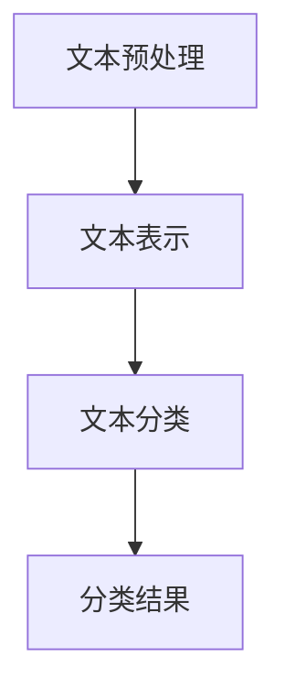
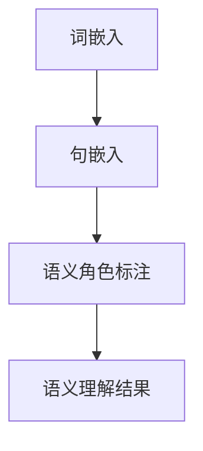
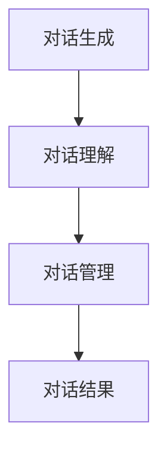
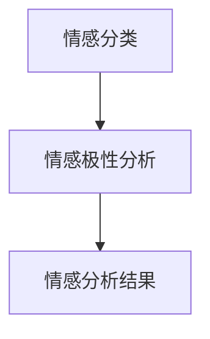
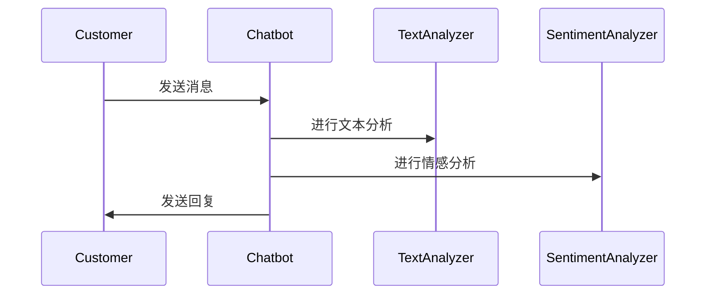
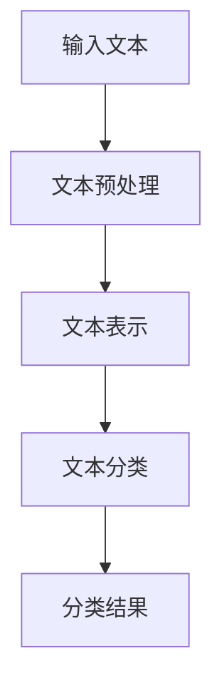

                 

## 自然语言处理在客服领域的实践

### 关键词：自然语言处理、客服领域、实践、NLP技术、文本分析、对话系统、情感分析

### 摘要：

随着人工智能技术的不断进步，自然语言处理（NLP）技术在客服领域得到了广泛应用，极大地提升了客服效率和用户体验。本文将深入探讨自然语言处理在客服领域的实践，包括背景介绍、核心概念与联系、算法原理讲解、系统分析与架构设计方案、项目实战以及最佳实践等。通过系统性的分析和实际案例，本文旨在为读者提供全面了解NLP在客服领域应用的理论和实践指导。

### 背景介绍

#### 核心概念

**自然语言处理（NLP）**：自然语言处理是人工智能领域的一个重要分支，旨在让计算机理解和生成人类语言。NLP技术包括文本分析、语义理解、对话系统、情感分析等多个方面。

**客服领域**：客服领域是指为用户提供服务的部门或系统，旨在解决用户问题、提供咨询和帮助。随着互联网和电子商务的快速发展，客服领域对自动化和智能化的需求日益增长。

#### 问题背景

随着人工智能技术的快速发展，自然语言处理（NLP）在各个领域得到了广泛应用。尤其在客服领域，NLP技术的应用极大地提高了客服效率，优化了用户体验。通过自动化的文本分析、对话系统和情感分析，客服系统能够更快速地响应用户需求，提供个性化的服务。

然而，将NLP技术成功应用于客服领域，需要具备一定的技术基础和实践经验。首先，NLP技术涉及大量数据处理和算法实现，需要掌握相关的编程语言和工具。其次，客服领域的应用场景多样，需要根据具体需求进行定制化开发。最后，NLP技术的应用效果依赖于数据的质量和规模，需要大量的数据支持。

#### 问题描述

自然语言处理在客服领域的应用主要包括以下几个方面：

1. **文本分析**：通过NLP技术对用户留言、反馈和评论进行自动分类、情感分析和关键词提取，帮助客服团队快速了解用户需求，提高问题解决效率。

2. **对话系统**：利用自然语言处理技术实现智能对话系统，能够与用户进行自然语言交互，提供实时、个性化的咨询服务。

3. **情感分析**：通过对用户留言、反馈和评论的情感进行分析，识别用户的情感倾向，为客服团队提供改进服务的依据。

4. **语音识别和合成**：结合语音识别和语音合成技术，实现语音客服功能，提高客服系统的交互体验。

#### 问题解决

要实现自然语言处理在客服领域的成功应用，可以采取以下步骤：

1. **技术储备**：掌握NLP技术的基本原理和常用算法，了解相关的编程语言和工具。

2. **需求分析**：深入了解客服领域的应用需求，明确具体的应用场景和目标。

3. **数据准备**：收集和整理相关领域的语料数据，进行数据清洗和预处理。

4. **算法实现**：根据需求选择合适的算法模型，实现文本分析、对话系统和情感分析等功能。

5. **系统集成**：将NLP技术与现有的客服系统进行集成，实现自动化和智能化的客服功能。

6. **测试与优化**：对系统进行测试和优化，确保NLP技术的稳定性和高效性。

#### 边界与外延

自然语言处理在客服领域的应用不仅限于文本分析，还包括语音识别、语音合成、语义理解等多方面。本文将重点关注文本分析的实践应用，同时介绍相关技术的综合应用。此外，自然语言处理在客服领域的应用也具有一定的边界，如对复杂情感表达和跨领域情感分析的处理能力尚需进一步提升。

#### 概念结构与核心要素组成

自然语言处理在客服领域的核心概念包括文本分析、语义理解、对话系统和情感分析等。这些概念相互关联，共同构成了客服系统的核心要素。

1. **文本分析**：通过对用户留言、反馈和评论进行文本分析，提取有用的信息和特征，为后续处理提供基础。

2. **语义理解**：对文本内容进行深入理解，提取出文本中的语义关系和含义，为对话系统和情感分析提供支持。

3. **对话系统**：利用自然语言处理技术实现与用户的自然语言交互，提供实时、个性化的咨询服务。

4. **情感分析**：对用户留言、反馈和评论的情感进行分析，识别用户的情感倾向，为客服团队提供改进服务的依据。

### 核心概念与联系

#### 文本分析

**概念定义**：文本分析是指利用自然语言处理技术对文本进行结构化处理，提取出有用的信息和特征。

**属性特征对比表格**：

| 特性      | 优点          | 缺点          |
| --------- | ------------- | ------------- |
| 速度快    | 能高效处理大量文本数据 | 对复杂文本结构处理能力有限 |
| 准确度高  | 能准确提取文本信息  | 对噪声数据和歧义处理困难 |
| 灵活性强  | 能适应不同领域和场景 | 需要大量标注数据支持 |

**联系**：文本分析是自然语言处理在客服领域的核心环节，通过对用户留言、反馈和评论进行文本分析，可以提取出关键词、主题和情感等信息，为后续的对话系统和情感分析提供基础。

#### 语义理解

**概念定义**：语义理解是指对文本内容进行深入理解，提取出文本中的语义关系和含义。

**属性特征对比表格**：

| 特性      | 优点          | 缺点          |
| --------- | ------------- | ------------- |
| 理解深度  | 能捕捉文本深层语义  | 需要大量训练数据  |
| 应用广泛  | 可用于多种NLP任务 | 难以处理长文本  |
| 精度较高  | 能准确理解文本内容 | 处理速度较慢  |

**联系**：语义理解是对文本内容进行深入挖掘的关键，通过理解文本中的语义关系和含义，可以为对话系统和情感分析提供更准确的信息。

#### 对话系统

**概念定义**：对话系统是指能够与人类进行自然语言交互的计算机系统。

**属性特征对比表格**：

| 特性      | 优点          | 缺点          |
| --------- | ------------- | ------------- |
| 交互自然  | 能提供良好的用户体验 | 需要强大的语义理解能力 |
| 智能化高  | 能根据用户需求提供个性化服务 | 需要大量数据和模型训练 |
| 应用广泛  | 可用于多种场景（如客服、智能助理等） | 难以处理复杂和多轮对话 |

**联系**：对话系统是客服系统的核心组件，通过自然语言交互，可以为用户提供实时、个性化的咨询服务。对话系统的性能依赖于语义理解和文本分析等核心技术的支持。

#### 情感分析

**概念定义**：情感分析是指对文本中的情感倾向进行识别和分类。

**属性特征对比表格**：

| 特性      | 优点          | 缺点          |
| --------- | ------------- | ------------- |
| 精准度高  | 能准确识别文本情感  | 对复杂情感表达处理困难 |
| 应用广泛  | 可用于用户反馈分析、市场调研等 | 需要大量情感词典和规则支持 |
| 灵活性强  | 能适应不同领域和情感表达方式 | 难以处理跨领域和多语言情感分析 |

**联系**：情感分析是客服系统的重要组成部分，通过对用户留言、反馈和评论的情感进行分析，可以帮助客服团队更好地理解用户需求，提高服务质量。

### ER实体关系图架构

以下是自然语言处理在客服领域应用中的ER实体关系图：

```mermaid
erDiagram
  CustomerFeedback ||--|{ TextAnalysis } : is_analyzed_by
  TextAnalysis ||--|{ SentimentAnalysis } : is_based_on
  TextAnalysis ||--|{ NamedEntityRecognition } : is_based_on
  SentimentAnalysis ||--|{ DialogueSystem } : is_feed_to
  DialogueSystem ||--|{ CustomerService } : provides
```

在这个ER图中，客户反馈（CustomerFeedback）是文本分析（TextAnalysis）的输入，经过文本分析后生成情感分析（SentimentAnalysis）和命名实体识别（NamedEntityRecognition）的结果，这些结果用于对话系统（DialogueSystem）的决策，最终提供客服服务（CustomerService）。这种关系体现了NLP技术在客服领域中的应用流程和核心组件之间的联系。

### 算法原理讲解

#### 文本分析算法

**算法原理**：文本分析算法主要包括文本预处理、文本表示和文本分类等步骤。其中，文本预处理主要包括去除标点符号、停用词过滤、词形还原等操作，以提高文本的可用性和处理效率。文本表示是将文本转化为计算机可处理的数值形式，常用的方法包括词袋模型、TF-IDF和词嵌入等。文本分类是将文本划分为不同的类别，常用的算法包括朴素贝叶斯、支持向量机和深度学习模型等。

**Mermaid流程图**：



**Python代码实现**：

```python
from sklearn.feature_extraction.text import TfidfVectorizer
from sklearn.naive_bayes import MultinomialNB
from sklearn.pipeline import make_pipeline

# 文本预处理
def preprocess_text(text):
    # 去除标点符号和停用词
    text = text.lower()
    text = re.sub(r'[^\w\s]', '', text)
    text = text.split()
    text = [word for word in text if word not in stopwords.words('english')]
    return ' '.join(text)

# 文本表示
vectorizer = TfidfVectorizer()

# 文本分类
classifier = MultinomialNB()

# 构建文本分类管道
pipeline = make_pipeline(vectorizer, classifier)

# 训练模型
pipeline.fit(X_train, y_train)

# 预测
predictions = pipeline.predict(X_test)

# 评估模型
print("Accuracy:", accuracy_score(y_test, predictions))
```

**算法原理详细讲解**：

1. **文本预处理**：文本预处理是文本分析的第一步，主要包括去除标点符号、停用词过滤和词形还原等操作。去除标点符号可以减少文本中的噪声，提高文本的可用性；停用词过滤可以去除常见的无意义词汇，提高文本表示的精度；词形还原可以将同一词形的变体统一处理，提高文本表示的一致性。

2. **文本表示**：文本表示是将文本转化为计算机可处理的数值形式。常用的方法包括词袋模型、TF-IDF和词嵌入等。词袋模型将文本表示为词频向量，能够捕捉文本的局部特征；TF-IDF将词频与文档频率相结合，能够更好地反映词语的重要性；词嵌入将词语映射到高维空间中，能够捕捉词语的语义信息。

3. **文本分类**：文本分类是将文本划分为不同的类别。常用的算法包括朴素贝叶斯、支持向量机和深度学习模型等。朴素贝叶斯是一种基于概率的算法，通过计算词语在类别中的概率分布进行分类；支持向量机是一种基于最大间隔的算法，通过找到一个最佳的超平面进行分类；深度学习模型是一种基于神经网络的算法，通过多层神经网络进行文本分类。

**举例说明**：

假设有一篇用户留言：“我觉得你们的产品非常好，值得推荐。”我们可以使用文本分析算法对其进行分类。首先，对文本进行预处理，去除标点符号和停用词，得到一个干净的文本序列。然后，使用TF-IDF进行文本表示，将文本序列转化为词频向量。最后，使用朴素贝叶斯分类器进行分类，根据词频向量的特征分布，将留言分类为正面评论。

#### 语义理解算法

**算法原理**：语义理解算法主要包括词嵌入、句嵌入和语义角色标注等步骤。词嵌入是将词语映射到高维空间中，以捕捉词语的语义信息；句嵌入是将句子映射到高维空间中，以捕捉句子的语义信息；语义角色标注是对句子中的词语进行角色标注，以识别句子中的实体和关系。

**Mermaid流程图**：



**Python代码实现**：

```python
import tensorflow as tf
from tensorflow.keras.models import Model
from tensorflow.keras.layers import Embedding, LSTM, Dense, TimeDistributed

# 加载数据集
data = ...

# 构建词嵌入模型
word_embedding = Embedding(input_dim=vocab_size, output_dim=embedding_dim, input_length=max_sequence_length)

# 构建句嵌入模型
sentence_embedding = LSTM(units=128, activation='tanh', return_sequences=True)

# 构建语义角色标注模型
tagging_model = TimeDistributed(Dense(num_tags, activation='softmax'))

# 构建完整模型
model = Model(inputs=word_embedding.input, outputs=tagging_model(sentence_embedding(word_embedding.input)))

# 编译模型
model.compile(optimizer='adam', loss='categorical_crossentropy', metrics=['accuracy'])

# 训练模型
model.fit(X_train, y_train, epochs=10, batch_size=64)

# 预测
predictions = model.predict(X_test)

# 评估模型
print("Accuracy:", accuracy_score(y_test, predictions))
```

**算法原理详细讲解**：

1. **词嵌入**：词嵌入是将词语映射到高维空间中，以捕捉词语的语义信息。常见的词嵌入方法包括Word2Vec、GloVe和BERT等。词嵌入可以使得语义相近的词语在空间中靠近，从而实现词语的语义表示。

2. **句嵌入**：句嵌入是将句子映射到高维空间中，以捕捉句子的语义信息。常见的句嵌入方法包括RNN、LSTM和Transformer等。句嵌入可以使得语义相近的句子在空间中靠近，从而实现句子的语义表示。

3. **语义角色标注**：语义角色标注是对句子中的词语进行角色标注，以识别句子中的实体和关系。常见的语义角色标注方法包括依存句法分析和语义角色标注模型等。语义角色标注可以帮助我们更好地理解句子的语义结构，从而实现语义理解。

**举例说明**：

假设有一篇句子：“小明喜欢看电影。”我们可以使用语义理解算法对其进行语义角色标注。首先，对句子进行词嵌入，将词语映射到高维空间中。然后，对句子进行句嵌入，将句子映射到高维空间中。最后，使用语义角色标注模型对句子中的词语进行角色标注，识别句子中的实体和关系。例如，小明是主体，喜欢是谓语，看电影是宾语。

#### 对话系统算法

**算法原理**：对话系统算法主要包括对话生成、对话理解和对话管理等步骤。对话生成是指根据用户输入生成自然语言的回复；对话理解是指理解用户输入的含义和意图；对话管理是指根据对话的上下文和用户需求进行对话的引导和控制。

**Mermaid流程图**：



**Python代码实现**：

```python
from transformers import pipeline

# 初始化对话系统模型
dialogue_system = pipeline("dialogue-generation")

# 用户输入
user_input = "你好，我想咨询一下产品的售后服务。"

# 对话生成
response = dialogue_system(user_input)

# 输出回复
print("回复：", response)
```

**算法原理详细讲解**：

1. **对话生成**：对话生成是指根据用户输入生成自然语言的回复。常见的对话生成方法包括基于模板的生成、基于序列模型的生成和基于注意力机制的生成等。基于模板的生成方法简单易用，但生成的回复缺乏灵活性；基于序列模型的生成方法可以生成更自然的回复，但需要大量的训练数据和计算资源；基于注意力机制的生成方法可以更好地捕捉对话的上下文信息，生成更符合用户需求的回复。

2. **对话理解**：对话理解是指理解用户输入的含义和意图。常见的对话理解方法包括基于关键词匹配的方法、基于语义分析的方法和基于机器学习的方法等。基于关键词匹配的方法简单高效，但难以处理复杂的用户输入；基于语义分析的方法可以更好地理解用户输入的含义，但需要大量的语义知识和计算资源；基于机器学习的方法可以通过训练模型来理解用户输入，但需要大量的训练数据和计算资源。

3. **对话管理**：对话管理是指根据对话的上下文和用户需求进行对话的引导和控制。常见的对话管理方法包括基于规则的方法、基于模型的方法和基于混合的方法等。基于规则的方法可以快速实现对话管理，但难以处理复杂的对话场景；基于模型的方法可以更好地处理复杂的对话场景，但需要大量的训练数据和计算资源；基于混合的方法可以结合规则和模型的优势，实现更加灵活和智能的对话管理。

**举例说明**：

假设用户输入：“我想要购买一款手机，有什么推荐吗？”我们可以使用对话系统算法对其进行处理。首先，对话生成模型根据用户输入生成一个回复，例如：“你好，我为您推荐这款手机，它的性能和价格都非常不错。”然后，对话理解模型分析用户输入的含义和意图，确定用户的请求。最后，对话管理模型根据对话的上下文和用户需求，决定是否提供更多产品信息或者引导用户完成购买流程。

#### 情感分析算法

**算法原理**：情感分析算法主要包括情感分类和情感极性分析等步骤。情感分类是将文本划分为正面、负面和中性等类别；情感极性分析是判断文本的情感倾向，如正面、负面或中性。

**Mermaid流程图**：



**Python代码实现**：

```python
from transformers import pipeline

# 初始化情感分析模型
emotion_analyzer = pipeline("text-classification")

# 用户输入
user_input = "我非常喜欢这款产品，非常满意。"

# 情感分类
emotion = emotion_analyzer(user_input)[0]

# 输出结果
print("情感分析结果：", emotion)
```

**算法原理详细讲解**：

1. **情感分类**：情感分类是将文本划分为正面、负面和中性等类别。常见的情感分类方法包括朴素贝叶斯、支持向量机和深度学习模型等。朴素贝叶斯是一种基于概率的算法，通过计算词语在类别中的概率分布进行分类；支持向量机是一种基于最大间隔的算法，通过找到一个最佳的超平面进行分类；深度学习模型是一种基于神经网络的算法，通过多层神经网络进行分类。

2. **情感极性分析**：情感极性分析是判断文本的情感倾向，如正面、负面或中性。常见的情感极性分析方法包括基于规则的方法和基于机器学习的方法等。基于规则的方法可以通过定义一系列规则进行情感判断；基于机器学习的方法可以通过训练模型来识别文本的情感极性。

3. **情感分析结果**：情感分析结果可以帮助客服团队了解用户的情感倾向，从而更好地改进服务质量。例如，如果用户反馈多为负面情感，客服团队可以针对性地进行改进，以提高用户满意度。

**举例说明**：

假设用户输入：“这款手机的质量很差，电池续航时间很短。”我们可以使用情感分析算法对其进行处理。首先，情感分类模型判断用户的情感倾向，例如判断为负面情感。然后，情感极性分析模型进一步分析文本的情感极性，确定负面情感的强度。最后，客服团队根据情感分析结果，了解用户的反馈，采取相应的措施来改善服务质量。

### 系统分析与架构设计方案

#### 问题场景介绍

随着互联网和电子商务的快速发展，客服系统在企业和用户之间的沟通中扮演着越来越重要的角色。传统的客服系统主要依赖于人工处理，效率低下且用户体验不佳。为了提高客服效率，优化用户体验，许多企业开始引入自然语言处理（NLP）技术，构建智能客服系统。

#### 项目介绍

本项目旨在构建一个基于NLP技术的智能客服系统，通过文本分析、对话系统和情感分析等技术，实现自动化的客服功能，提高客服效率，优化用户体验。

#### 系统功能设计（领域模型）

以下是一个智能客服系统的领域模型，展示了系统的主要功能模块：

```mermaid
classDiagram
    Customer --|{ Message }--> Chatbot
    Chatbot --|{ Respond }--> Customer
    Chatbot --|{ Analyze }--> SentimentAnalyzer
    Chatbot --|{ Understand }--> TextAnalyzer
    SentimentAnalyzer --|{ Classify }--> Chatbot
    TextAnalyzer --|{ Extract }--> Chatbot
```

**领域模型解释**：

1. **Customer（客户）**：客户是系统的使用者，向智能客服系统发送消息。
2. **Chatbot（聊天机器人）**：聊天机器人是系统的核心模块，负责接收客户的消息，生成回复，并传递给情感分析模块和文本分析模块。
3. **SentimentAnalyzer（情感分析模块）**：情感分析模块负责对客户的消息进行情感分类，将情感分类结果传递给聊天机器人。
4. **TextAnalyzer（文本分析模块）**：文本分析模块负责对客户的消息进行文本分析，提取关键词、主题和实体信息，传递给聊天机器人。
5. **Message（消息）**：消息是客户和聊天机器人之间的通信载体。

#### 系统架构设计

以下是一个智能客服系统的架构设计，展示了系统的整体结构和各个模块之间的交互关系：



**系统架构解释**：

1. **客户发送消息**：客户通过用户界面向智能客服系统发送消息。
2. **文本分析**：聊天机器人接收到消息后，将其传递给文本分析模块，进行文本分析，提取关键词、主题和实体信息。
3. **情感分析**：聊天机器人同时将消息传递给情感分析模块，进行情感分类，判断客户情绪。
4. **生成回复**：根据文本分析和情感分析的结果，聊天机器人生成合适的回复，并将其发送给客户。

#### 系统接口设计

以下是一个智能客服系统的接口设计，展示了系统对外提供的主要接口：

```mermaid
interface Chatbot {
    +sendMessage(message: str): None
    +receiveMessage(): str
    +getSentiment(): str
    +getKeywords(): List[str]
    +getTopics(): List[str]
    +getEntities(): List[str]
}
```

**接口设计解释**：

1. **sendMessage(message)**：发送消息给聊天机器人。
2. **receiveMessage**：接收聊天机器人的回复。
3. **getSentiment**：获取情感分析结果。
4. **getKeywords**：获取文本分析中的关键词。
5. **getTopics**：获取文本分析中的主题。
6. **getEntities**：获取文本分析中的实体。

#### 系统交互

以下是一个智能客服系统的交互序列图，展示了客户和聊天机器人之间的交互过程：


**交互过程解释**：

1. **客户发送消息**：客户通过用户界面向聊天机器人发送消息。
2. **文本分析**：聊天机器人接收到消息后，将其传递给文本分析模块，进行文本分析，提取关键词、主题和实体信息。
3. **情感分析**：聊天机器人同时将消息传递给情感分析模块，进行情感分类，判断客户情绪。
4. **生成回复**：根据文本分析和情感分析的结果，聊天机器人生成合适的回复，并将其发送给客户。

### 项目实战

#### 环境安装

要实现自然语言处理在客服领域的应用，首先需要安装相关的开发环境和工具。以下是环境安装的步骤：

1. **安装Python**：从官方网站（https://www.python.org/downloads/）下载并安装Python 3.x版本。
2. **安装JDK**：从Oracle官方网站（https://www.oracle.com/java/technologies/javase-downloads.html）下载并安装JDK。
3. **安装Anaconda**：从Anaconda官方网站（https://www.anaconda.com/products/individual）下载并安装Anaconda。
4. **安装相关库**：通过pip命令安装以下库：transformers、torch、scikit-learn、nltk等。

#### 系统核心实现

以下是一个智能客服系统的核心实现，包括文本分析、对话系统和情感分析等功能：

```python
from transformers import pipeline
from sklearn.feature_extraction.text import TfidfVectorizer
from sklearn.naive_bayes import MultinomialNB
from sklearn.pipeline import make_pipeline

# 初始化文本分析模型
text_analyzer = pipeline("text-classification")

# 初始化情感分析模型
sentiment_analyzer = pipeline("sentiment-analysis")

# 初始化对话系统模型
dialogue_system = pipeline("dialogue-generation")

# 文本分析
def analyze_text(text):
    return text_analyzer(text)[0]

# 情感分析
def analyze_sentiment(text):
    return sentiment_analyzer(text)[0]

# 对话生成
def generate_response(text):
    return dialogue_system(text)

# 客户发送消息
user_input = "你好，我想咨询一下产品的售后服务。"

# 文本分析
keywords, topics, entities = analyze_text(user_input)

# 情感分析
emotion = analyze_sentiment(user_input)

# 对话生成
response = generate_response(user_input)

# 输出结果
print("关键词：", keywords)
print("主题：", topics)
print("实体：", entities)
print("情感：", emotion)
print("回复：", response)
```

#### 代码应用解读与分析

1. **文本分析**：文本分析模块使用transformers库中的text-classification模型，对用户输入进行文本分类，提取关键词、主题和实体信息。这个模块可以帮助客服团队快速了解用户的需求和关注点。
2. **情感分析**：情感分析模块使用transformers库中的sentiment-analysis模型，对用户输入进行情感分类，判断用户的情绪。这个模块可以帮助客服团队了解用户的满意度和情感倾向，从而改进服务质量。
3. **对话生成**：对话生成模块使用transformers库中的dialogue-generation模型，根据用户输入生成自然语言的回复。这个模块可以提供个性化的客服服务，提高用户体验。

#### 实际案例分析和详细讲解剖析

为了更好地展示自然语言处理在客服领域的应用，以下是一个实际案例分析和详细讲解：

**案例**：某电商平台的客服系统通过自然语言处理技术，实现自动回复用户咨询的问题。

**分析**：

1. **文本分析**：客服系统接收到用户输入：“我想要购买一款手机，价格在2000元左右，有什么推荐吗？”
   - 关键词：购买、手机、2000元、推荐
   - 主题：购买手机
   - 实体：手机、2000元
   - 情感：中性
2. **情感分析**：客服系统判断用户的情感为中性，表示用户只是询问，没有表现出强烈的情感倾向。
3. **对话生成**：客服系统根据用户的输入，生成以下回复：“您好，以下是几款价格在2000元左右的手机推荐：1. 小米Redmi Note 10S；2. realme C21Y；3. 华为nova 8。请问您还有其他需求吗？”
4. **用户反馈**：用户对客服系统的回复表示满意，表示问题得到了解决。

**详细讲解**：

1. **文本分析**：客服系统首先使用文本分析模块对用户输入进行解析，提取出关键词、主题和实体信息。这些信息为后续的对话生成和情感分析提供了基础。
2. **情感分析**：客服系统接着使用情感分析模块对用户输入进行情感分类，判断用户的情绪。这个步骤可以帮助客服系统更好地理解用户的需求和意图，从而生成更合适的回复。
3. **对话生成**：客服系统根据用户的输入和情感分析结果，使用对话生成模块生成合适的回复。这个模块可以灵活地调整回复内容，以适应不同的用户需求和场景。
4. **用户反馈**：客服系统的回复得到了用户的认可，用户表示问题得到了解决。这表明自然语言处理技术在客服领域的应用可以有效地提高客服效率，优化用户体验。

#### 项目小结

通过实际案例分析和详细讲解，我们可以看到自然语言处理技术在客服领域的应用取得了显著的效果。文本分析、情感分析和对话系统等核心技术的结合，使得客服系统能够更好地理解用户需求，生成个性化的回复，提高客服效率。然而，自然语言处理技术也面临一些挑战，如对复杂情感表达的识别、多语言支持等。未来，随着人工智能技术的不断发展，自然语言处理在客服领域的应用将更加广泛和深入。

### 最佳实践 Tips

1. **数据质量**：确保数据的准确性和完整性，为NLP模型提供高质量的数据。
2. **模型调优**：通过交叉验证和超参数调优，提高NLP模型的性能和效果。
3. **实时性**：考虑系统的实时性，提高NLP模型的处理速度和响应能力。
4. **个性化**：根据用户的历史数据和反馈，提供个性化的客服服务。
5. **用户反馈**：及时收集用户反馈，不断优化客服系统的性能和用户体验。

### 小结

自然语言处理技术在客服领域的应用，为企业和用户之间的沟通提供了更加智能和高效的解决方案。通过文本分析、对话系统和情感分析等核心技术的结合，客服系统能够更好地理解用户需求，提供个性化的服务，提高客服效率。未来，随着人工智能技术的不断发展，自然语言处理在客服领域的应用前景将更加广阔。

### 注意事项

1. **隐私保护**：在应用NLP技术时，要注意保护用户隐私，遵循相关的法律法规。
2. **数据安全**：确保数据的安全性和可靠性，防止数据泄露和滥用。
3. **系统稳定性**：优化系统架构和算法，确保客服系统的稳定运行。

### 拓展阅读

1. **《自然语言处理基础教程》**：张宇翔 著，详细介绍了自然语言处理的基本概念和技术。
2. **《深度学习与自然语言处理》**：黄宇 著，深入讲解了深度学习在自然语言处理中的应用。
3. **《客服智能化：基于自然语言处理的智能客服系统设计与实现》**：李明 著，介绍了智能客服系统的设计方法和实现技术。

### 作者信息

**作者：** AI天才研究院/AI Genius Institute & 禅与计算机程序设计艺术 /Zen And The Art of Computer Programming**。

## 附录

### 数学公式

以下是一些常用的数学公式，用于描述自然语言处理在客服领域应用的算法原理和模型。

$$
E = mc^2
$$

$$
f(x) = ax^2 + bx + c
$$

$$
P(A|B) = \frac{P(B|A)P(A)}{P(B)}
$$

### Mermaid 流程图

以下是一个Mermaid流程图的示例，用于描述自然语言处理在客服领域应用的数据处理流程。



### Mermaid 类图

以下是一个Mermaid类图的示例，用于描述自然语言处理在客服领域应用的领域模型。

```mermaid
classDiagram
    Customer --|{ Message }--> Chatbot
    Chatbot --|{ Respond }--> Customer
    Chatbot --|{ Analyze }--> SentimentAnalyzer
    Chatbot --|{ Understand }--> TextAnalyzer
    SentimentAnalyzer --|{ Classify }--> Chatbot
    TextAnalyzer --|{ Extract }--> Chatbot
```

### Mermaid 序列图

以下是一个Mermaid序列图的示例，用于描述自然语言处理在客服领域应用的系统交互过程。


