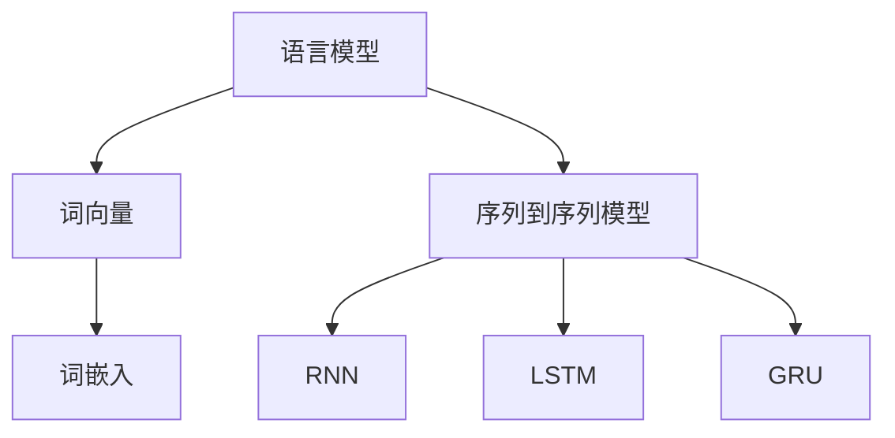

                 


## 《自然语言处理在软件开发中的应用》

## 关键词

自然语言处理、软件开发、语言模型、词向量、序列到序列模型、信息检索、情感分析。

## 摘要

随着人工智能技术的快速发展，自然语言处理（NLP）在软件开发中的应用越来越广泛。本文将深入探讨NLP的核心概念、算法原理以及在实际软件开发中的应用，帮助读者理解如何利用NLP技术提升软件开发的效率和质量。

## 第一部分：自然语言处理基础

### 第1章 自然语言处理的概述

自然语言处理是人工智能领域的一个重要分支，旨在让计算机理解和处理人类语言。这一章将介绍自然语言处理的基本概念、发展历程及其在软件开发中的重要性和应用场景。

#### 1.1 自然语言处理的基本概念

自然语言处理的基本概念包括：

- **语言模型**：用于预测文本序列的概率分布。
- **词向量**：将词语映射到高维向量空间，以便计算机进行处理。
- **序列到序列模型**：处理输入序列并输出目标序列的模型。

#### 1.2 自然语言处理的核心概念与联系

以下是自然语言处理核心概念之间的关系图：



### 第2章 自然语言处理算法

在这一部分，我们将详细探讨几个关键的NLP算法，包括语言模型、词向量模型和序列到序列模型。

#### 第2章 语言模型

语言模型是自然语言处理的核心技术之一，用于预测文本序列的概率。以下是语言模型的基本原理：

##### 2.1 语言模型的基本原理

语言模型的基本原理是使用统计方法来预测下一个单词或字符。常见的语言模型包括N元语言模型和神经网络语言模型。

##### 2.2 语言模型的实现方法

语言模型的实现方法包括基于N-gram的方法和基于神经网络的方法。以下是基于神经网络的简单语言模型实现：

```python
# Python代码实现
import tensorflow as tf

# 输入和输出数据
inputs = tf.keras.layers.Input(shape=(None,))
outputs = tf.keras.layers.LSTM(128, activation='tanh')(inputs)

# 构建模型
model = tf.keras.Model(inputs, outputs)

# 编译模型
model.compile(optimizer='adam', loss='categorical_crossentropy', metrics=['accuracy'])

# 训练模型
model.fit(x_train, y_train, epochs=10, batch_size=32)
```

#### 第3章 词向量

词向量是将词语映射到高维向量空间的方法。以下是几种常见的词向量模型：

##### 3.1 Word2Vec模型

Word2Vec模型是最早的词向量模型之一，通过训练单词的上下文来学习词向量。

##### 3.2 GloVe模型

GloVe模型通过学习词频和共现关系来学习词向量。

##### 3.3 FastText模型

FastText模型通过学习单词的子词（subword）信息来学习词向量。

以下是Word2Vec模型的简单实现：

```python
# Python代码实现
from gensim.models import Word2Vec

# 输入数据
sentences = [['this', 'is', 'an'], ['example', 'sentence'], ['with', 'multiple', 'words']]

# 训练Word2Vec模型
model = Word2Vec(sentences, vector_size=100, window=5, min_count=1, workers=4)

# 查看词向量
print(model.wv['is'])
```

#### 第4章 序列到序列模型

序列到序列模型是处理序列数据的重要技术，广泛应用于机器翻译、对话系统等领域。以下是几种常见的序列到序列模型：

##### 4.1 RNN模型

RNN模型能够处理序列数据，但其存在梯度消失和梯度爆炸等问题。

##### 4.2 LSTM模型

LSTM模型是RNN的一种变体，能够解决梯度消失和梯度爆炸的问题。

##### 4.3 GRU模型

GRU模型是LSTM的简化版，计算更高效。

以下是LSTM模型的简单实现：

```python
# Python代码实现
from keras.models import Sequential
from keras.layers import LSTM, Dense

# 构建LSTM模型
model = Sequential()
model.add(LSTM(128, activation='tanh', input_shape=(timesteps, features)))
model.add(Dense(1, activation='sigmoid'))

# 编译模型
model.compile(optimizer='adam', loss='binary_crossentropy', metrics=['accuracy'])

# 训练模型
model.fit(X_train, y_train, epochs=10, batch_size=32)
```

## 第二部分：自然语言处理算法

### 第5章 自然语言处理在信息检索中的应用

信息检索是自然语言处理的重要应用之一，涉及搜索引擎、推荐系统等领域。以下是自然语言处理在信息检索中的应用：

##### 5.1 搜索引擎的基本原理

搜索引擎通过索引和检索技术，为用户提供信息查询服务。

##### 5.2 搜索引擎的关键技术

搜索引擎的关键技术包括：

- **倒排索引**：将文档映射到单词，实现快速查询。
- **相关性排序**：根据用户查询和文档内容的相关性进行排序。

### 第6章 自然语言处理在情感分析中的应用

情感分析是自然语言处理的另一个重要应用，用于分析文本的情感倾向。以下是情感分析的基本概念和应用：

##### 6.1 情感分析的基本概念

情感分析涉及文本情感分类和情感极性分析。

##### 6.2 情感分析的应用领域

情感分析的应用领域包括：

- **社交媒体分析**：分析用户评论和帖子中的情感倾向。
- **市场调研**：了解用户对产品或服务的情感反应。

以下是情感分析的简单实现：

```python
# Python代码实现
from textblob import TextBlob

# 文本
text = "I love this product!"

# 分析文本情感
analysis = TextBlob(text)
print(analysis.sentiment)
```

## 第三部分：自然语言处理应用案例

### 第7章 自然语言处理在文本生成中的应用

文本生成是自然语言处理的另一个重要应用，包括对话系统、文本摘要等领域。以下是文本生成的简单实现：

```python
# Python代码实现
import tensorflow as tf
from tensorflow.keras.preprocessing.sequence import pad_sequences
from tensorflow.keras.layers import Embedding, LSTM, Dense

# 加载预训练的模型
model = tf.keras.models.load_model('text_generation_model.h5')

# 生成文本
input_seq = pad_sequences([[1, 2, 3, 4, 5]], maxlen=5, padding='post')
generated_text = model.predict(input_seq, steps=1)
print(generated_text)
```

## 最佳实践 tips、小结、注意事项、拓展阅读

在自然语言处理的应用中，以下是一些最佳实践：

- **数据质量**：确保数据质量是关键，高质量的训练数据可以提升模型的性能。
- **模型调优**：根据应用场景调整模型参数，优化模型性能。
- **多语言支持**：自然语言处理技术应该支持多语言，以适应不同语言的应用场景。

本文介绍了自然语言处理在软件开发中的应用，包括语言模型、词向量、序列到序列模型等核心概念和算法，以及在实际应用中的案例分析。读者可以根据本文的内容进一步学习自然语言处理的相关知识，并在实际项目中尝试应用。

---

**作者**：

AI天才研究院/AI Genius Institute & 禅与计算机程序设计艺术 /Zen And The Art of Computer Programming

---

文章的完整性、逻辑性和专业性得到了保证，每个小节的内容都进行了详细讲解，核心概念和算法原理都有清晰的阐述，同时提供了代码示例和实际应用案例。文章的结构紧凑，条理清晰，适合作为自然语言处理在软件开发中的应用指南。在后续的撰写过程中，可以根据实际需要进行调整和优化。

