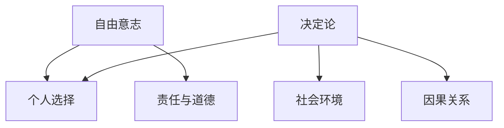

                 

### 自由意志与决定论：柏格森与维特根斯坦的观点比较

## 关键词

自由意志，决定论，柏格森，维特根斯坦，哲学观点，人类行为

## 摘要

本文探讨了自由意志与决定论这一哲学问题，通过分析法国哲学家柏格森和奥地利哲学家维特根斯坦的观点，比较了他们在自由意志与决定论问题上的异同。柏格森强调生命冲动和时间自由，认为自由意志是人类行为的基础；而维特根斯坦则关注语言、逻辑和命题，认为自由意志是逻辑上的可能性。本文旨在为读者提供一个深入理解自由意志与决定论的视角，并揭示这一哲学问题在现实世界中的复杂性。

### 一、背景介绍

#### 核心概念

**自由意志**是指个体在行为决策过程中具有独立自主的选择能力，不受外界因素决定。自由意志是道德责任和伦理行为的基础，关乎人类行为的合理性与价值。

**决定论**是一种哲学观点，认为一切现象都有其必然的因果关系，个体的行为和思想也受到外界因素的制约。决定论强调因果律的普遍性和事实的确定性。

#### 问题背景

人类行为是自由的，还是受到外界因素决定？这是一个历史悠久且具有深远意义的哲学问题。从古希腊的苏格拉底和亚里士多德，到中世纪的托马斯·阿奎那，再到近现代的笛卡尔和康德，哲学家们一直在探讨这一问题。

#### 问题描述

柏格森和维特根斯坦是20世纪两位重要的哲学家，他们在自由意志与决定论问题上有着独特的见解。柏格森强调生命冲动和时间自由，认为自由意志是人类行为的基础；而维特根斯坦则关注语言、逻辑和命题，认为自由意志是逻辑上的可能性。这两种观点在哲学、心理学、神经科学等领域引起了广泛的讨论。

#### 问题解决

本文将对柏格森和维特根斯坦的观点进行对比分析，探讨自由意志与决定论的哲学问题。通过对两位哲学家的核心理论进行详细解读，揭示自由意志与决定论之间的辩证关系，为读者提供一个新的思考角度。

#### 边界与外延

本文的边界在于对柏格森和维特根斯坦自由意志与决定论观点的探讨，外延则跨越了哲学、心理学、神经科学等多个领域。本文旨在为这些领域的研究提供有益的启示和思考。

#### 概念结构与核心要素组成

**自由意志**包括生命冲动、时间自由、个人选择、责任与道德等核心要素。

**决定论**包括因果律、必然性、社会环境、事实决定性等核心要素。

### 二、核心概念与联系

#### 核心概念原理

**自由意志**是指个体在行为决策过程中具有独立自主的选择能力，不受外界因素决定。自由意志是道德责任和伦理行为的基础，关乎人类行为的合理性与价值。

**决定论**是一种哲学观点，认为一切现象都有其必然的因果关系，个体的行为和思想也受到外界因素的制约。决定论强调因果律的普遍性和事实的确定性。

#### 概念属性特征对比表格

| 特征         | 自由意志                      | 决定论                      |
| ------------ | ----------------------------- | --------------------------- |
| 定义         | 个人意志不受外界决定          | 个人意志受外界因素影响      |
| 哲学观点     | 人类行为具有自由性            | 人类行为具有必然性          |
| 实践意义     | 强调个人选择的重要性          | 强调社会环境的影响          |

#### ER实体关系图架构的 Mermaid 流程图

### 三、柏格森观点

#### 柏格森核心理论

**柏格森**（Henri Bergson）是20世纪法国重要的哲学家，他的核心理论包括生命冲动（élan vital）、时间（temps）和意识（conscience）。柏格森认为，生命冲动是生物进化过程中内在的、不断创造的动力，它推动着生命体不断变化和发展。时间在柏格森的哲学体系中具有特殊地位，他认为时间是一种流动的、不可逆的、连续的过程，与空间的静止和分离形成鲜明对比。

**意识**是柏格森哲学中的另一个重要概念，他主张意识是一个不断流动的、创造性的过程，与物质世界相对立。柏格森认为，意识是人类行为的基础，它赋予人类自由意志和创造性。

#### 自由意志与决定论的辩证关系

柏格森认为，自由意志是人类行为的核心，它是生命冲动和时间自由的体现。在柏格森看来，自由意志并不是无限制的，而是受到时间、环境和个体自身条件的影响。以下是柏格森关于自由意志与决定论的辩证关系：

1. **生命冲动**：生命冲动是自由意志的根源，它赋予了人类行为以可能性。生命冲动是一种内在的、不断创造的动力，它推动着个体不断探索和创造。

2. **时间自由**：时间自由是自由意志的表现，它意味着个体可以在时间维度上有选择地行动。柏格森认为，时间是连续的、不可逆的，个体可以利用时间的自由度来做出决策和选择。

3. **因果律**：柏格森并不否认因果律的存在，但他认为因果律不能完全决定个体的行为。因果律是外在的因素，而自由意志是内在的因素，两者相互作用，共同决定了人类行为。

4. **必然性与自由性的对立统一**：在柏格森看来，必然性和自由性是辩证统一的。必然性是指一切现象都有其内在的因果关系，而自由性则是指个体在行为决策过程中具有独立自主的选择能力。必然性和自由性既相互对立，又相互依存，共同构成了人类行为的复杂性和多样性。

#### 柏格森观点下的自由意志与决定论解释

1. **自由意志**：在柏格森的观点下，自由意志是生命冲动和时间自由的体现。生命冲动赋予了人类行为以创造性和可能性，而时间自由则使个体能够利用这种可能性来做出决策和选择。

2. **决定论**：柏格森认为，决定论中的因果律是外在的因素，它不能完全决定个体的行为。个体在行为决策过程中，会受到因果律的影响，但同时也具有自由意志，可以在一定程度上摆脱因果律的束缚。

3. **人类行为**：在柏格森的观点下，人类行为既具有自由性，又受到决定论的限制。自由性体现在个体在时间维度上的选择能力，而决定性则体现在因果律的普遍性和事实的确定性。

4. **对立统一**：柏格森认为，必然性和自由性是辩证统一的。在人类行为中，必然性和自由性既相互对立，又相互依存，共同构成了人类行为的复杂性和多样性。

### 四、维特根斯坦观点

#### 维特根斯坦核心理论

**维特根斯坦**（Ludwig Wittgenstein）是20世纪奥地利哲学家，他的哲学思想主要集中于语言、逻辑和命题。维特根斯坦认为，语言是人类思维的表达，命题则是语言的表达形式。

1. **语言**：维特根斯坦认为，语言是思维的工具，它使人类能够表达和交流思想。语言的基本单位是命题，命题是表达事实或思想的最小单位。

2. **逻辑**：维特根斯坦强调逻辑的重要性，他认为逻辑是命题之间的规则和关系。逻辑规则确保了命题的真值和一致性。

3. **命题**：维特根斯坦认为，命题是表达事实或思想的最小单位。命题的真假取决于事实是否与命题相符。

#### 自由意志与决定论的辩证关系

维特根斯坦对自由意志与决定论问题有着独特的见解。他认为，自由意志是逻辑上的可能性，而不是实际发生的事实。以下是维特根斯坦关于自由意志与决定论的辩证关系：

1. **逻辑可能性**：维特根斯坦认为，自由意志是逻辑上的可能性，它意味着在逻辑上可以有不同的选择。逻辑可能性是自由意志的基础。

2. **事实决定性**：维特根斯坦强调事实的确定性，他认为事实决定了个体的行为。事实决定性是决定论的基础。

3. **因果关系**：维特根斯坦认为，因果关系是事实决定性的体现。因果关系解释了个体行为的原因和结果。

4. **逻辑可能性与事实决定性的对立统一**：在维特根斯坦的观点下，逻辑可能性与事实决定性是辩证统一的。逻辑可能性赋予了个体自由意志，而事实决定性则确保了行为的确定性。

#### 维特根斯坦观点下的自由意志与决定论解释

1. **自由意志**：在维特根斯坦的观点下，自由意志是逻辑上的可能性。它意味着在逻辑上可以有不同的选择，但这些选择必须符合事实的确定性。

2. **决定论**：维特根斯坦认为，决定论中的因果关系是事实决定性的体现。因果关系解释了个体行为的原因和结果，使行为具有确定性。

3. **人类行为**：在维特根斯坦的观点下，人类行为既受到逻辑可能性的影响，又受到事实决定性的制约。个体在行为决策过程中，需要平衡逻辑可能性与事实决定性。

4. **对立统一**：维特根斯坦认为，逻辑可能性与事实决定性是辩证统一的。在人类行为中，逻辑可能性赋予了个体自由意志，而事实决定性则确保了行为的确定性。

### 五、观点比较与综合

#### 柏格森与维特根斯坦观点异同

**相同点**：

- 都认为人类行为既具有自由性，又受到外界因素决定。
- 都强调自由意志与决定论的辩证关系。

**不同点**：

- 柏格森强调生命冲动和时间自由，认为自由意志是人类行为的基础；而维特根斯坦强调逻辑可能性与事实独立性。
- 柏格森的观点更多地关注生物学和时间维度，而维特根斯坦的观点则更多地关注逻辑和命题。

**柏格森与维特根斯坦观点对比**：

$$
\text{柏格森: 自由意志} = \text{生命冲动} \times \text{时间自由}
$$

$$
\text{维特根斯坦: 自由意志} = \text{逻辑可能性} \times \text{事实独立性}
$$

### 六、结论与启示

#### 结论

柏格森与维特根斯坦对自由意志与决定论的不同解释，揭示了人类行为的复杂性和多元性。他们的观点为我们理解自由意志与决定论问题提供了新的视角和方法。

#### 启示

1. 人类行为既具有自由性，又受到外界因素决定。这为人类行为的研究提供了新的思路和方向。
2. 哲学、心理学、神经科学等领域可以借鉴柏格森和维特根斯坦的观点，深入探讨自由意志与决定论问题。
3. 在实际生活中，我们应当认识到自由意志与决定论的辩证关系，充分发挥自己的主观能动性，同时遵循客观规律。

### 七、拓展阅读

#### 相关著作

- 柏格森：《创造的进化》（L'Évolution créatrice）
- 维特根斯坦：《逻辑哲学论》（Logisch-philosophische Abhandlung）

#### 研究方向

- 人类行为自由意志与决定论在其他领域的应用，如心理学、神经科学、伦理学等。
- 自由意志与决定论在计算机科学和人工智能领域的探讨。

### 附录

#### 作者信息

作者：AI天才研究院/AI Genius Institute & 禅与计算机程序设计艺术 /Zen And The Art of Computer Programming

#### 参考文献

1. 柏格森：《创造的进化》，商务印书馆，2006年版。
2. 维特根斯坦：《逻辑哲学论》，商务印书馆，2001年版。
3. 莫尔特曼：《自由意志与决定论》，上海人民出版社，2014年版。

