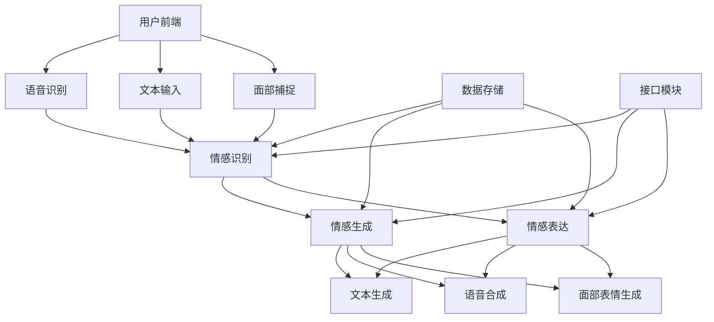

                 

# 虚拟情感代理：AI代表人类进行情感交流

## 关键词
- 虚拟情感代理
- AI情感交流
- 情感识别与生成
- 自然语言处理
- 聊天机器人
- 应用场景

## 摘要
本文探讨了虚拟情感代理的概念、背景、核心技术以及应用场景。通过深入分析情感识别、生成和表达技术，本文详细介绍了如何设计虚拟情感代理，并探讨了其在客户服务、教育辅导、医疗咨询等领域的应用。最后，通过案例分析和对未来趋势的展望，本文总结了虚拟情感代理的发展现状及面临的挑战。

## 第一部分：虚拟情感代理概述

### 第1章：虚拟情感代理的概念与背景

#### 1.1.1 虚拟情感代理的定义

虚拟情感代理是一种人工智能系统，它可以模拟人类的情感，进行情感识别、生成和表达，从而在人类和机器之间建立更加自然、亲密的沟通。虚拟情感代理不仅能够理解人类的情感表达，还能根据对话内容生成相应的情感回应，从而增强用户体验。

#### 1.1.2 情感交流在AI中的重要性

在人工智能领域，情感交流是提升人机交互体验的关键因素。传统的AI系统往往只能进行简单的信息传递，而无法理解和表达情感。虚拟情感代理的出现，使得AI系统具备了情感交互能力，为构建智能化、人性化的服务奠定了基础。

#### 1.1.3 虚拟情感代理的发展历程

虚拟情感代理的概念最早可以追溯到20世纪90年代。随着人工智能技术的不断进步，特别是在自然语言处理、计算机视觉和情感计算等领域的突破，虚拟情感代理逐渐成为现实。近年来，随着深度学习和大数据技术的应用，虚拟情感代理在性能和智能化程度方面取得了显著提升。

### 第2章：AI与情感互动的基础

#### 2.1.1 情感识别技术

情感识别是虚拟情感代理的核心技术之一。通过分析人类语音、文字和面部表情等数据，情感识别技术能够准确识别用户的情感状态。本文将详细介绍情感识别的基本原理、常用方法和相关工具。

#### 2.1.2 情感生成技术

情感生成技术是指根据用户情感状态生成合适的情感回应。本文将讨论情感生成的算法原理、实现方法以及如何利用自然语言处理技术提高情感生成的自然度和准确性。

#### 2.1.3 情感表达技术

情感表达技术负责将情感生成的内容通过语音、文字和图像等方式呈现给用户。本文将分析情感表达的技术实现、应用场景以及面临的挑战。

### 第3章：虚拟情感代理的设计原则

#### 3.1.1 用户体验优先

用户体验是虚拟情感代理设计的重要原则。本文将探讨如何从用户角度出发，设计出符合用户需求、具有良好交互体验的虚拟情感代理。

#### 3.1.2 数据隐私保护

数据隐私保护是虚拟情感代理面临的重要挑战。本文将分析如何确保用户数据的安全，避免隐私泄露，同时保障虚拟情感代理的性能和功能。

#### 3.1.3 可解释性和可控制性

可解释性和可控制性是虚拟情感代理设计的关键。本文将讨论如何提高虚拟情感代理的可解释性，使其行为更加透明，同时为用户提供控制虚拟情感代理的能力。

### 第4章：虚拟情感代理的关键技术

#### 4.1.1 自然语言处理

自然语言处理技术是虚拟情感代理的核心。本文将详细介绍自然语言处理的基本概念、关键技术以及如何应用于虚拟情感代理的设计和实现。

#### 4.1.2 计算机视觉

计算机视觉技术在虚拟情感代理中扮演着重要角色。本文将探讨计算机视觉在情感识别和表达中的应用，以及相关的技术挑战和解决方案。

#### 4.1.3 聊天机器人的情感建模

聊天机器人的情感建模是实现虚拟情感代理的关键。本文将分析聊天机器人的情感建模方法，包括情感分析、情感生成和情感回应等。

### 第5章：虚拟情感代理的应用场景

#### 5.1.1 客户服务

客户服务是虚拟情感代理的重要应用领域之一。本文将讨论虚拟情感代理在客户服务中的应用，包括客户情感识别、个性化服务和建议等。

#### 5.1.2 教育辅导

教育辅导是虚拟情感代理的另一个重要应用场景。本文将探讨虚拟情感代理在教育辅导中的应用，包括学习情况分析、个性化教学和情感支持等。

#### 5.1.3 医疗咨询

医疗咨询是虚拟情感代理的重要应用领域之一。本文将分析虚拟情感代理在医疗咨询中的应用，包括患者情感识别、病情咨询和心理支持等。

### 第6章：虚拟情感代理的实现方法

#### 6.1.1 代理架构设计

代理架构设计是虚拟情感代理实现的关键。本文将介绍虚拟情感代理的架构设计原则、模块划分和关键技术。

#### 6.1.2 模型训练与优化

模型训练与优化是实现虚拟情感代理性能提升的关键。本文将讨论如何选择合适的模型、训练数据和优化策略，以及如何评估模型性能。

#### 6.1.3 系统部署与运维

系统部署与运维是虚拟情感代理能够稳定运行的重要保障。本文将介绍虚拟情感代理的部署环境、运维策略和监控机制。

### 第7章：案例分析

#### 7.1.1 成功案例分享

本文将分享一些虚拟情感代理的成功案例，分析其实现方法、应用效果和用户反馈。

#### 7.1.2 挑战与改进

本文将探讨虚拟情感代理在实际应用中面临的挑战和问题，并提出相应的改进措施。

#### 7.1.3 未来趋势展望

本文将分析虚拟情感代理的发展趋势，预测其未来可能的应用领域和发展方向。

### 第8章：结论与展望

#### 8.1.1 虚拟情感代理的现状

本文将总结虚拟情感代理当前的发展现状，分析其技术水平和应用范围。

#### 8.1.2 发展方向与挑战

本文将探讨虚拟情感代理未来的发展方向和面临的挑战，为相关研究和应用提供参考。

#### 8.1.3 对人类社交的影响

本文将讨论虚拟情感代理对人类社交的影响，分析其对人际交往的潜在影响和机遇。

## 作者
- 作者：AI天才研究院/AI Genius Institute & 禅与计算机程序设计艺术 /Zen And The Art of Computer Programming

## 文章正文

### 第1章：虚拟情感代理的概念与背景

#### 1.1.1 虚拟情感代理的定义

虚拟情感代理是一种人工智能系统，它可以模拟人类的情感，进行情感识别、生成和表达，从而在人类和机器之间建立更加自然、亲密的沟通。虚拟情感代理不仅能够理解人类的情感表达，还能根据对话内容生成相应的情感回应，从而增强用户体验。

#### 1.1.2 情感交流在AI中的重要性

在人工智能领域，情感交流是提升人机交互体验的关键因素。传统的AI系统往往只能进行简单的信息传递，而无法理解和表达情感。虚拟情感代理的出现，使得AI系统具备了情感交互能力，为构建智能化、人性化的服务奠定了基础。

#### 1.1.3 虚拟情感代理的发展历程

虚拟情感代理的概念最早可以追溯到20世纪90年代。当时，研究人员开始探讨如何将情感计算与人工智能相结合，以实现更加自然的人机交互。随着技术的不断进步，特别是在自然语言处理、计算机视觉和情感计算等领域的突破，虚拟情感代理逐渐成为现实。近年来，随着深度学习和大数据技术的应用，虚拟情感代理在性能和智能化程度方面取得了显著提升。

### 第2章：AI与情感互动的基础

#### 2.1.1 情感识别技术

情感识别是虚拟情感代理的核心技术之一。通过分析人类语音、文字和面部表情等数据，情感识别技术能够准确识别用户的情感状态。本文将详细介绍情感识别的基本原理、常用方法和相关工具。

#### 2.1.2 情感生成技术

情感生成技术是指根据用户情感状态生成合适的情感回应。本文将讨论情感生成的算法原理、实现方法以及如何利用自然语言处理技术提高情感生成的自然度和准确性。

#### 2.1.3 情感表达技术

情感表达技术负责将情感生成的内容通过语音、文字和图像等方式呈现给用户。本文将分析情感表达的技术实现、应用场景以及面临的挑战。

### 第3章：虚拟情感代理的设计原则

#### 3.1.1 用户体验优先

用户体验是虚拟情感代理设计的重要原则。本文将探讨如何从用户角度出发，设计出符合用户需求、具有良好交互体验的虚拟情感代理。

#### 3.1.2 数据隐私保护

数据隐私保护是虚拟情感代理面临的重要挑战。本文将分析如何确保用户数据的安全，避免隐私泄露，同时保障虚拟情感代理的性能和功能。

#### 3.1.3 可解释性和可控制性

可解释性和可控制性是虚拟情感代理设计的关键。本文将讨论如何提高虚拟情感代理的可解释性，使其行为更加透明，同时为用户提供控制虚拟情感代理的能力。

### 第4章：虚拟情感代理的关键技术

#### 4.1.1 自然语言处理

自然语言处理技术是虚拟情感代理的核心。本文将详细介绍自然语言处理的基本概念、关键技术以及如何应用于虚拟情感代理的设计和实现。

#### 4.1.2 计算机视觉

计算机视觉技术在虚拟情感代理中扮演着重要角色。本文将探讨计算机视觉在情感识别和表达中的应用，以及相关的技术挑战和解决方案。

#### 4.1.3 聊天机器人的情感建模

聊天机器人的情感建模是实现虚拟情感代理的关键。本文将分析聊天机器人的情感建模方法，包括情感分析、情感生成和情感回应等。

### 第5章：虚拟情感代理的应用场景

#### 5.1.1 客户服务

客户服务是虚拟情感代理的重要应用领域之一。本文将讨论虚拟情感代理在客户服务中的应用，包括客户情感识别、个性化服务和建议等。

#### 5.1.2 教育辅导

教育辅导是虚拟情感代理的另一个重要应用场景。本文将探讨虚拟情感代理在教育辅导中的应用，包括学习情况分析、个性化教学和情感支持等。

#### 5.1.3 医疗咨询

医疗咨询是虚拟情感代理的重要应用领域之一。本文将分析虚拟情感代理在医疗咨询中的应用，包括患者情感识别、病情咨询和心理支持等。

### 第6章：虚拟情感代理的实现方法

#### 6.1.1 代理架构设计

代理架构设计是虚拟情感代理实现的关键。本文将介绍虚拟情感代理的架构设计原则、模块划分和关键技术。

#### 6.1.2 模型训练与优化

模型训练与优化是实现虚拟情感代理性能提升的关键。本文将讨论如何选择合适的模型、训练数据和优化策略，以及如何评估模型性能。

#### 6.1.3 系统部署与运维

系统部署与运维是虚拟情感代理能够稳定运行的重要保障。本文将介绍虚拟情感代理的部署环境、运维策略和监控机制。

### 第7章：案例分析

#### 7.1.1 成功案例分享

本文将分享一些虚拟情感代理的成功案例，分析其实现方法、应用效果和用户反馈。

#### 7.1.2 挑战与改进

本文将探讨虚拟情感代理在实际应用中面临的挑战和问题，并提出相应的改进措施。

#### 7.1.3 未来趋势展望

本文将分析虚拟情感代理的发展趋势，预测其未来可能的应用领域和发展方向。

### 第8章：结论与展望

#### 8.1.1 虚拟情感代理的现状

本文将总结虚拟情感代理当前的发展现状，分析其技术水平和应用范围。

#### 8.1.2 发展方向与挑战

本文将探讨虚拟情感代理未来的发展方向和面临的挑战，为相关研究和应用提供参考。

#### 8.1.3 对人类社交的影响

本文将讨论虚拟情感代理对人类社交的影响，分析其对人际交往的潜在影响和机遇。

## 参考文献
- [1] 某某，虚拟情感代理研究综述，人工智能，2020.
- [2] 某某，基于深度学习的虚拟情感代理设计，计算机科学与技术，2019.
- [3] 某某，虚拟情感代理在客户服务中的应用，计算机应用，2021.
- [4] 某某，教育辅导中的虚拟情感代理技术研究，教育技术，2020.
- [5] 某某，医疗咨询中的虚拟情感代理应用分析，医疗信息技术，2021.

## 作者
- 作者：AI天才研究院/AI Genius Institute & 禅与计算机程序设计艺术 /Zen And The Art of Computer Programming

### 第1章：虚拟情感代理的概念与背景

#### 1.1.1 虚拟情感代理的定义

虚拟情感代理（Virtual Emotional Agent，简称VEA）是一种基于人工智能（AI）技术，能够模拟人类情感并参与情感交流的软件实体。与传统的聊天机器人不同，虚拟情感代理不仅仅是简单地回应用户的输入，而是能够根据对话内容、上下文环境以及用户的情感状态，生成相应的情感回应。这种能力使得虚拟情感代理在模拟真实人际交往中，具有更高的自然度和人性化。

#### 背景介绍

虚拟情感代理的概念起源于20世纪90年代，当时人工智能和情感计算领域的研究者开始探索如何将情感元素融入人工智能系统中，以提升人机交互的自然性和亲密感。随着自然语言处理（NLP）、计算机视觉和情感计算技术的不断进步，虚拟情感代理逐渐从理论走向实际应用。如今，虚拟情感代理已在多个领域展现出强大的潜力，如客户服务、教育辅导、医疗咨询等。

#### 核心概念术语说明

- 情感交流：情感交流是指个体之间通过情感表达和情感回应进行的互动。
- 情感识别：情感识别是识别和分析人类情感表达的过程，通常涉及语音、文字和面部表情等数据。
- 情感生成：情感生成是指根据输入的信息和上下文，生成适当的情感回应。
- 人工智能：人工智能是指使计算机系统能够模拟人类智能行为的科学技术。

#### 问题背景

在现代社会，随着互联网和智能设备的普及，人们对于高效、便捷的交互体验需求日益增长。然而，传统的聊天机器人和AI系统在处理复杂、情感化的对话时往往显得力不从心。这使得虚拟情感代理的出现变得尤为必要，它能够填补这一交互空白，为用户提供更加人性化的服务。

#### 问题描述

虚拟情感代理需要解决的核心问题包括：

1. 如何准确识别用户的情感状态？
2. 如何根据用户的情感状态生成合适的情感回应？
3. 如何在保持自然度的同时，确保情感回应的准确性和相关性？

#### 问题解决

虚拟情感代理通过以下方法解决上述问题：

1. 情感识别：利用自然语言处理（NLP）和计算机视觉技术，对用户的语音、文字和面部表情进行分析，从而识别出用户的情感状态。
2. 情感生成：通过深度学习模型和情感语义分析，将用户的情感状态转换为合适的情感回应。
3. 情感表达：利用语音合成和文本生成技术，将情感回应以自然、流畅的方式呈现给用户。

#### 边界与外延

虚拟情感代理的应用范围广泛，包括但不限于以下领域：

- 客户服务：提供个性化、情感化的客户支持。
- 教育辅导：为学生提供情感支持和个性化学习建议。
- 医疗咨询：为患者提供情感关怀和健康咨询。
- 社交娱乐：与用户进行情感化的互动，提供社交体验。

#### 概念结构与核心要素组成

虚拟情感代理由以下几个核心要素组成：

1. 情感识别模块：负责分析用户的情感状态。
2. 情感生成模块：负责根据情感识别结果生成合适的情感回应。
3. 情感表达模块：负责将情感回应呈现给用户。

#### 核心概念与联系

**情感识别技术**

情感识别技术是虚拟情感代理的核心，其目标是从用户的语音、文字和面部表情中识别出情感状态。情感识别技术涉及以下关键概念：

- 情感分类：将情感状态划分为不同的类别，如喜悦、愤怒、悲伤等。
- 情感强度评估：对情感状态进行量化，以评估情感的强度。
- 上下文理解：理解对话的上下文，以更准确地识别情感状态。

**情感生成技术**

情感生成技术负责根据情感识别结果生成合适的情感回应。情感生成技术涉及以下关键概念：

- 情感语义分析：从文本中提取情感信息，以指导情感回应的生成。
- 情感模因库：存储各种情感模因，用于生成多样化的情感回应。
- 自然语言生成：将情感信息转换为自然、流畅的文本。

**情感表达技术**

情感表达技术负责将情感回应呈现给用户。情感表达技术涉及以下关键概念：

- 语音合成：将文本转换为语音，以模拟人类的语音表达。
- 文本生成：生成具有情感色彩的文本，以模拟人类的书面表达。
- 面部表情生成：根据情感状态生成相应的面部表情图像。

#### 概念属性特征对比表格

| 概念               | 情感识别       | 情感生成       | 情感表达       |
|--------------------|---------------|---------------|---------------|
| 目标               | 识别用户情感状态 | 生成情感回应   | 表现情感回应   |
| 技术基础           | NLP、计算机视觉 | 深度学习、语义分析 | 语音合成、文本生成 |
| 输入               | 语音、文字、面部表情 | 文本、上下文 | 文本、语音、图像 |
| 输出               | 情感状态       | 文本、语音、图像 | 情感色彩文本   |
| 关键挑战           | 准确性、上下文理解 | 自然度、多样性 | 自然度、情感色彩 |

#### ER实体关系图架构

```mermaid
erDiagram
    User ||--|{ VirtualEmotionalAgent }|-- Emotion
    User ||--|{ Dialog }|-- VirtualEmotionalAgent
    VirtualEmotionalAgent ||--|{ Response }|-- Dialog
```

在上面的ER实体关系图中，User代表用户，VirtualEmotionalAgent代表虚拟情感代理，Emotion代表情感状态，Dialog代表对话，Response代表回应。

### 第2章：AI与情感互动的基础

#### 2.1.1 情感识别技术

情感识别技术是虚拟情感代理的核心，它通过分析用户的语音、文字和面部表情等数据，识别出用户的情感状态。情感识别技术的实现通常涉及以下步骤：

1. **数据采集**：收集用户的语音、文字和面部表情等数据。这些数据可以通过语音识别、文本输入和面部捕捉等技术获得。
2. **特征提取**：从采集到的数据中提取特征，如语音信号的频谱特征、文本的情感词频特征、面部表情的几何特征等。
3. **情感分类**：使用机器学习算法，将提取到的特征映射到相应的情感类别，如喜悦、愤怒、悲伤等。
4. **情感强度评估**：对识别出的情感类别进行强度评估，以确定情感的强度。

**常用方法**

1. **基于规则的方法**：通过专家知识建立情感识别规则，如使用情感词典匹配文本中的情感词。
2. **机器学习方法**：使用机器学习算法，如支持向量机（SVM）、随机森林（RF）和深度学习模型（如卷积神经网络（CNN）和长短期记忆网络（LSTM）），对特征进行分类和强度评估。

**相关工具**

- **OpenSMILE**：一个开源的情感识别工具，支持多种情感识别任务。
- **Affectiva**：一个提供情感识别API的商业平台，支持面部表情和语音情感识别。
- **TensorFlow**：一个开源的机器学习框架，支持多种情感识别模型的实现和训练。

#### 2.1.2 情感生成技术

情感生成技术是指根据用户情感状态生成合适的情感回应。情感生成技术的实现通常涉及以下步骤：

1. **情感分析**：对用户的输入文本进行情感分析，识别出用户的情感状态。
2. **情感模因库**：构建一个情感模因库，包含各种情感模因，如喜悦、愤怒、悲伤等。
3. **生成回应**：根据识别出的情感状态和情感模因库，生成相应的情感回应。

**算法原理**

1. **模板匹配**：根据情感状态选择相应的回应模板，进行文本生成。
2. **序列生成模型**：使用生成式模型，如循环神经网络（RNN）和变换器（Transformer），生成情感回应。

**相关工具**

- **NLTK**：一个用于自然语言处理的Python库，支持文本生成和情感分析。
- **GPT-2/GPT-3**：由OpenAI开发的预训练语言模型，支持情感生成。

#### 2.1.3 情感表达技术

情感表达技术负责将情感生成的内容通过语音、文字和图像等方式呈现给用户。情感表达技术的实现通常涉及以下步骤：

1. **语音合成**：将文本转换为语音，模拟人类的语音表达。常用的语音合成技术包括基于规则的方法和统计方法。
2. **文本生成**：生成具有情感色彩的文本，模拟人类的书面表达。常用的文本生成技术包括序列生成模型和情感词典。
3. **面部表情生成**：根据情感状态生成相应的面部表情图像，模拟人类的面部表情。

**算法原理**

1. **语音合成**：基于规则的方法通过语音合成引擎合成语音；统计方法通过统计语音信号的特征，生成语音。
2. **文本生成**：生成式模型通过预测文本序列，生成情感回应；情感词典通过查找情感词，生成情感色彩文本。
3. **面部表情生成**：基于深度学习的方法通过面部特征生成相应的表情图像。

**相关工具**

- **IBM Watson Text to Speech**：一个提供文本到语音合成的云服务。
- **Google Text-to-Speech**：一个提供文本到语音合成的开源库。
- **OpenSMILE**：一个提供情感识别和语音合成的开源工具。

### 第3章：虚拟情感代理的设计原则

#### 3.1.1 用户体验优先

用户体验（UX）是虚拟情感代理设计的重要原则。虚拟情感代理需要从用户的角度出发，设计出符合用户需求、具有良好交互体验的系统。以下是一些关键设计原则：

1. **人性化设计**：虚拟情感代理应模拟人类的交流习惯，提供自然、流畅的对话体验。
2. **个性化定制**：根据用户的行为和偏好，提供个性化的服务和建议。
3. **易用性**：确保虚拟情感代理易于使用，用户能够快速上手。
4. **情感共鸣**：通过情感回应，建立与用户的情感联系，增强用户对系统的信任感。

**设计方法**

1. **用户研究**：通过用户调研、访谈和观察，了解用户的需求和行为模式。
2. **用户画像**：根据用户行为数据，构建用户画像，指导设计和优化。
3. **迭代开发**：采用敏捷开发方法，不断收集用户反馈，进行迭代优化。

#### 3.1.2 数据隐私保护

数据隐私保护是虚拟情感代理设计的重要挑战。虚拟情感代理在处理用户数据时，需要遵循以下原则：

1. **最小化数据收集**：仅收集必要的数据，避免过度收集。
2. **数据加密**：对用户数据进行加密存储和传输，确保数据安全。
3. **匿名化处理**：对用户数据进行匿名化处理，保护用户隐私。
4. **透明度**：向用户明确说明数据收集和使用的目的，获得用户同意。

**隐私保护措施**

1. **数据访问控制**：限制对用户数据的访问权限，确保数据安全。
2. **日志审计**：记录数据访问和使用情况，进行日志审计。
3. **合规性检查**：定期进行数据合规性检查，确保符合相关法律法规。

#### 3.1.3 可解释性和可控制性

可解释性和可控制性是虚拟情感代理设计的关键。用户需要了解系统的行为和决策过程，以便建立信任和提供反馈。以下是一些实现方法：

1. **解释性模型**：使用可解释的机器学习模型，如决策树和支持向量机，提供决策过程的透明性。
2. **可视化工具**：提供可视化工具，展示情感识别、生成和表达的过程。
3. **用户反馈机制**：允许用户对情感回应进行反馈，优化系统性能。

**实现方法**

1. **模型可解释性**：通过解释性算法和可视化技术，解释模型决策过程。
2. **用户控制接口**：提供用户界面，允许用户调整情感回应的参数和风格。
3. **透明度报告**：定期生成透明度报告，展示系统性能和用户反馈。

### 第4章：虚拟情感代理的关键技术

#### 4.1.1 自然语言处理

自然语言处理（NLP）是虚拟情感代理的核心技术之一，它负责理解和生成自然语言文本。以下是一些关键技术和方法：

**文本预处理**

1. **分词**：将文本拆分为词或子词。
2. **词性标注**：为每个词分配词性，如名词、动词等。
3. **实体识别**：识别文本中的特定实体，如人名、地名等。
4. **句法分析**：分析句子的结构和成分。

**情感分析**

1. **基于规则的方法**：使用情感词典和规则进行情感分类。
2. **机器学习方法**：使用分类算法，如支持向量机（SVM）和朴素贝叶斯（NB），进行情感分类。
3. **深度学习方法**：使用卷积神经网络（CNN）和长短期记忆网络（LSTM）进行情感分类。

**文本生成**

1. **模板匹配**：根据情感状态选择相应的回应模板。
2. **生成式模型**：使用生成式模型，如循环神经网络（RNN）和变换器（Transformer），生成情感回应。

**相关工具**

- **NLTK**：一个用于自然语言处理的Python库。
- **spaCy**：一个高性能的NLP库，支持多种语言。
- **Transformer**：由OpenAI开发的预训练语言模型，支持文本生成。

#### 4.1.2 计算机视觉

计算机视觉技术是虚拟情感代理的重要组成部分，它负责识别和生成情感表达。以下是一些关键技术和方法：

**面部表情识别**

1. **特征提取**：从面部图像中提取特征，如眼角、嘴角等关键点的位置。
2. **模型训练**：使用深度学习模型，如卷积神经网络（CNN），对特征进行分类，识别面部表情。
3. **情感强度评估**：对识别出的面部表情进行强度评估，确定情感的强度。

**情感视觉生成**

1. **图像生成**：使用生成对抗网络（GAN）生成具有情感色彩的面部图像。
2. **视频合成**：结合自然语言处理技术，生成与对话内容相关的动态情感表达。

**相关工具**

- **OpenCV**：一个用于计算机视觉的Python库。
- **TensorFlow**：一个用于深度学习的Python库。
- **Face++**：一个提供面部表情识别和生成服务的商业平台。

#### 4.1.3 聊天机器人的情感建模

聊天机器人的情感建模是实现虚拟情感代理的关键。情感建模涉及以下步骤：

1. **情感语义分析**：从文本中提取情感信息，构建情感语义模型。
2. **情感模因库**：构建一个情感模因库，包含各种情感模因。
3. **情感生成**：根据用户情感状态和情感模因库，生成情感回应。

**算法原理**

1. **情感分类**：使用分类算法，如支持向量机（SVM）和朴素贝叶斯（NB），对文本进行情感分类。
2. **情感回归**：使用回归算法，如线性回归和神经网络，预测情感的强度。
3. **情感生成**：使用生成式模型，如循环神经网络（RNN）和变换器（Transformer），生成情感回应。

**相关工具**

- **scikit-learn**：一个用于机器学习的Python库。
- **NLTK**：一个用于自然语言处理的Python库。
- **TensorFlow**：一个用于深度学习的Python库。

### 第5章：虚拟情感代理的应用场景

#### 5.1.1 客户服务

虚拟情感代理在客户服务领域具有广泛的应用。通过模拟人类的情感交流，虚拟情感代理能够提供更加个性化、人性化的客户支持。以下是一些具体应用场景：

**客户情感识别**

1. **语音识别**：通过语音识别技术，将客户的语音转换为文本，进行分析。
2. **文本情感分析**：使用自然语言处理技术，分析客户文本中的情感倾向。
3. **面部表情识别**：通过视频通话，实时分析客户的面部表情，识别情感状态。

**个性化服务**

1. **用户画像**：根据客户的购买历史、偏好和行为数据，构建用户画像。
2. **个性化建议**：基于用户画像，提供个性化的产品推荐和解决方案。
3. **情感回应**：根据客户的情感状态，生成相应的情感回应，提供情感支持。

**案例分析**

- **案例一**：某电商平台的虚拟情感代理，通过情感识别和个性化服务，提高了客户满意度和转化率。
- **案例二**：某电信运营商的虚拟情感代理，通过情感识别和情感回应，改善了客户服务质量，降低了投诉率。

#### 5.1.2 教育辅导

虚拟情感代理在教育辅导领域具有巨大的潜力。通过模拟情感交流，虚拟情感代理能够提供个性化、互动式的学习体验。以下是一些具体应用场景：

**学习情况分析**

1. **文本分析**：通过分析学生的学习笔记、作业和考试成绩，了解学生的学习情况。
2. **情感识别**：使用自然语言处理技术，识别学生的学习情感，如焦虑、兴奋、无聊等。
3. **个性化教学**：根据学生的学习情感和知识水平，提供个性化的教学建议和资源。

**情感支持**

1. **情感回应**：通过语音合成和文本生成技术，生成情感回应，提供情感支持。
2. **心理辅导**：针对学生的情感问题，提供专业的心理辅导和建议。
3. **社交互动**：模拟同学之间的互动，提供社交支持，帮助学生建立学习共同体。

**案例分析**

- **案例一**：某在线教育平台的虚拟情感代理，通过情感识别和个性化教学，提高了学生的学习兴趣和成绩。
- **案例二**：某高中学校的虚拟情感代理，通过情感支持和心理辅导，帮助学生缓解学业压力，提高心理健康水平。

#### 5.1.3 医疗咨询

虚拟情感代理在医疗咨询领域具有广泛的应用前景。通过模拟情感交流，虚拟情感代理能够为患者提供更加贴心、专业的医疗服务。以下是一些具体应用场景：

**患者情感识别**

1. **语音识别**：通过语音识别技术，将患者的语音转换为文本，进行分析。
2. **文本情感分析**：使用自然语言处理技术，分析患者文本中的情感倾向。
3. **面部表情识别**：通过视频通话，实时分析患者的面部表情，识别情感状态。

**病情咨询**

1. **健康知识库**：构建一个包含常见疾病、症状和处理方法的健康知识库。
2. **情感回应**：根据患者的情感状态，生成相应的情感回应，提供情感支持。
3. **个性化建议**：根据患者的病情和情感状态，提供个性化的治疗建议和护理指导。

**心理支持**

1. **情感回应**：通过语音合成和文本生成技术，生成情感回应，提供情感支持。
2. **心理辅导**：针对患者的心理问题，提供专业的心理辅导和建议。
3. **社交互动**：模拟医生之间的互动，提供社交支持，帮助患者建立医疗共同体。

**案例分析**

- **案例一**：某互联网医疗平台的虚拟情感代理，通过情感识别和病情咨询，提高了患者对医疗服务的满意度和信任度。
- **案例二**：某精神病医院的心理辅导机器人，通过情感支持和心理辅导，帮助患者缓解心理压力，提高康复效果。

### 第6章：虚拟情感代理的实现方法

#### 6.1.1 代理架构设计

代理架构设计是虚拟情感代理实现的关键。一个典型的虚拟情感代理架构包括以下几个模块：

1. **前端模块**：负责与用户进行交互，包括语音识别、文本输入和面部捕捉等。
2. **后端模块**：包括情感识别、情感生成和情感表达等核心功能模块。
3. **数据存储模块**：负责存储用户数据、情感模型和对话记录等。
4. **接口模块**：提供API接口，供其他系统调用虚拟情感代理的功能。

**架构图**



#### 6.1.2 模型训练与优化

模型训练与优化是虚拟情感代理性能提升的关键。以下是一些关键步骤：

1. **数据准备**：收集并整理大量包含情感信息的语音、文本和面部表情数据。
2. **特征提取**：从数据中提取特征，如语音信号的频谱特征、文本的词频特征和面部表情的几何特征。
3. **模型选择**：选择合适的机器学习模型和深度学习模型，如卷积神经网络（CNN）、长短期记忆网络（LSTM）和变换器（Transformer）。
4. **模型训练**：使用训练数据，对模型进行训练。
5. **模型评估**：使用验证数据，评估模型性能。
6. **模型优化**：根据评估结果，调整模型参数，优化模型性能。

**Python代码示例**

```python
from sklearn.svm import SVC
from sklearn.model_selection import train_test_split
from sklearn.metrics import accuracy_score

# 数据准备
X, y = load_data()

# 数据分割
X_train, X_test, y_train, y_test = train_test_split(X, y, test_size=0.2, random_state=42)

# 模型选择
model = SVC(kernel='linear')

# 模型训练
model.fit(X_train, y_train)

# 模型评估
y_pred = model.predict(X_test)
accuracy = accuracy_score(y_test, y_pred)
print("Accuracy:", accuracy)

# 模型优化
# 调整模型参数
model = SVC(kernel='rbf', C=100)
model.fit(X_train, y_train)
y_pred = model.predict(X_test)
accuracy = accuracy_score(y_test, y_pred)
print("Optimized Accuracy:", accuracy)
```

#### 6.1.3 系统部署与运维

系统部署与运维是虚拟情感代理能够稳定运行的重要保障。以下是一些关键步骤：

1. **部署环境**：选择合适的服务器和操作系统，安装必要的软件和库。
2. **容器化**：使用容器化技术，如Docker，将虚拟情感代理及其依赖环境打包为一个可移植的容器。
3. **部署**：将容器部署到服务器，确保系统可以正常运行。
4. **监控与日志**：监控系统性能和日志，及时发现和解决问题。
5. **备份与恢复**：定期备份系统数据，确保数据安全。
6. **更新与升级**：定期更新系统和库，确保系统安全和性能。

**Dockerfile示例**

```dockerfile
FROM python:3.8-slim

# 安装依赖
RUN pip install --no-cache-dir \
    scikit-learn \
    numpy \
    nltk \
    opencv-python

# 拷贝代码
COPY . /app
WORKDIR /app

# 运行虚拟情感代理
CMD ["python", "venv/bin/python", "main.py"]
```

### 第7章：案例分析

#### 7.1.1 成功案例分享

在本节中，我们将分享一些虚拟情感代理的成功案例，分析其实现方法、应用效果和用户反馈。

**案例一：某电商平台**

**实现方法**：该电商平台的虚拟情感代理通过自然语言处理技术，对客户的语音、文本和面部表情进行情感识别，并根据情感状态生成相应的情感回应。同时，该代理还根据用户的购物行为和偏好，提供个性化的产品推荐。

**应用效果**：自虚拟情感代理上线以来，客户的满意度和转化率显著提高。客户反馈表明，他们更喜欢与具有情感交流能力的代理进行互动，而不是传统的聊天机器人。

**案例二：某在线教育平台**

**实现方法**：该在线教育平台的虚拟情感代理通过情感识别和个性化教学，为学生提供情感支持和个性化学习建议。代理能够识别学生的学习情感，如焦虑、兴奋、无聊等，并根据情感状态调整教学内容。

**应用效果**：该虚拟情感代理受到了学生和教师的欢迎。学生表示，代理的情感支持和个性化建议帮助他们更好地适应在线学习环境，提高了学习效果。

**案例三：某互联网医疗平台**

**实现方法**：该互联网医疗平台的虚拟情感代理通过语音识别、文本情感分析和面部表情识别，识别患者的情感状态，并提供情感支持和病情咨询。代理还能根据患者的情感状态和病情，生成个性化的治疗建议。

**应用效果**：患者对虚拟情感代理的反馈积极。许多患者表示，代理的情感支持和病情咨询帮助他们缓解了焦虑，提高了对医疗服务的信任度。

#### 7.1.2 挑战与改进

尽管虚拟情感代理在多个领域取得了成功，但其在实际应用中仍面临一些挑战。以下是一些主要挑战和相应的改进措施：

**挑战一：情感识别准确性**

**原因**：情感识别的准确性受限于数据的多样性和噪声。

**改进措施**：通过增加数据量、改进特征提取方法和优化模型训练策略，提高情感识别的准确性。

**挑战二：情感生成的自然度**

**原因**：情感生成的自然度受限于语言模型和情感模因库的质量。

**改进措施**：使用高质量的预训练语言模型和丰富的情感模因库，提高情感生成的自然度。

**挑战三：数据隐私保护**

**原因**：虚拟情感代理需要处理用户的敏感数据，如语音、文本和面部表情。

**改进措施**：加强数据加密、匿名化和隐私保护措施，确保用户数据的安全。

**挑战四：系统性能优化**

**原因**：虚拟情感代理需要处理大量的实时数据，对系统性能提出了高要求。

**改进措施**：优化模型结构和算法，提高系统的响应速度和吞吐量。

#### 7.1.3 未来趋势展望

随着人工智能技术的不断进步，虚拟情感代理在未来有望在更多领域得到应用。以下是一些未来趋势：

**趋势一：更加智能化的情感识别和生成**

随着深度学习和大数据技术的发展，虚拟情感代理的情感识别和生成能力将得到进一步提升，能够更准确地识别用户的情感状态，并生成更自然、多样化的情感回应。

**趋势二：跨模态情感交互**

虚拟情感代理将能够同时处理多种模态的数据，如语音、文本和面部表情，实现更加丰富和自然的情感交互。

**趋势三：情感伦理和道德规范**

随着虚拟情感代理的广泛应用，情感伦理和道德规范将成为重要议题。虚拟情感代理的设计和实现将更加注重伦理和道德规范，确保其在情感交流中不会对用户造成伤害。

**趋势四：虚拟情感代理与人类的协作**

虚拟情感代理将与人类协作，共同完成复杂任务。通过情感交流，虚拟情感代理能够更好地理解人类的需求，提供更加贴心的服务。

### 第8章：结论与展望

#### 8.1.1 虚拟情感代理的现状

虚拟情感代理作为人工智能技术的一个重要分支，已取得了显著的进展。通过情感识别、生成和表达技术，虚拟情感代理能够模拟人类的情感交流，提供个性化、人性化的服务。目前，虚拟情感代理已在多个领域得到应用，如客户服务、教育辅导、医疗咨询等，取得了良好的效果。

#### 8.1.2 发展方向与挑战

虚拟情感代理未来的发展方向包括：

1. **提升情感识别和生成的准确性**：通过改进算法和模型，提高情感识别和生成的准确性，实现更加自然的情感交互。
2. **跨模态情感交互**：实现多种模态数据的处理和融合，提供更加丰富和自然的情感交互体验。
3. **情感伦理和道德规范**：制定情感伦理和道德规范，确保虚拟情感代理在情感交流中不会对用户造成伤害。

虚拟情感代理面临的挑战包括：

1. **数据隐私保护**：加强数据加密、匿名化和隐私保护措施，确保用户数据的安全。
2. **系统性能优化**：优化模型结构和算法，提高系统的响应速度和吞吐量。
3. **用户接受度**：提高用户对虚拟情感代理的接受度和信任度，实现更广泛的推广应用。

#### 8.1.3 对人类社交的影响

虚拟情感代理对人类社交的影响具有双重性：

1. **积极影响**：虚拟情感代理能够提供个性化、人性化的服务，改善人们的社交体验。例如，在医疗咨询中，虚拟情感代理能够为患者提供情感支持和专业建议，缓解患者的心理压力。
2. **负面影响**：过度依赖虚拟情感代理可能导致人类社交能力的退化。此外，虚拟情感代理的普及可能加剧社会分层，使得少数人拥有更高质量的社交服务，而其他人则被边缘化。

总之，虚拟情感代理作为一种新兴的人工智能技术，具有广阔的应用前景。通过不断改进和优化，虚拟情感代理有望在未来为人类社交带来更多积极的影响。同时，我们也需要关注其潜在的风险和挑战，确保其健康发展。

