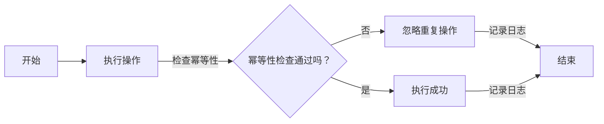
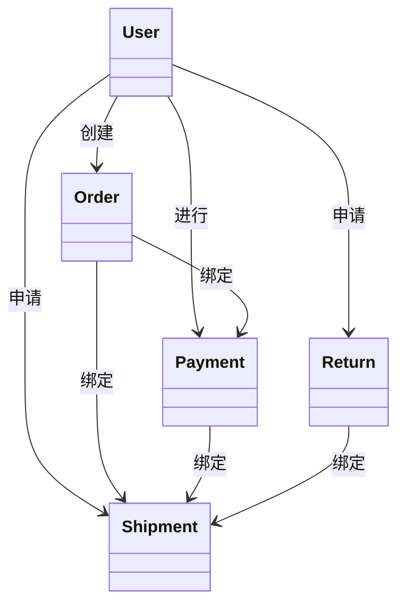
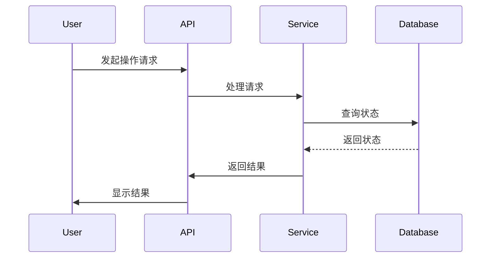
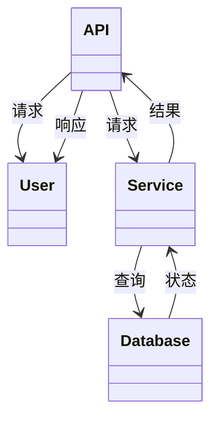
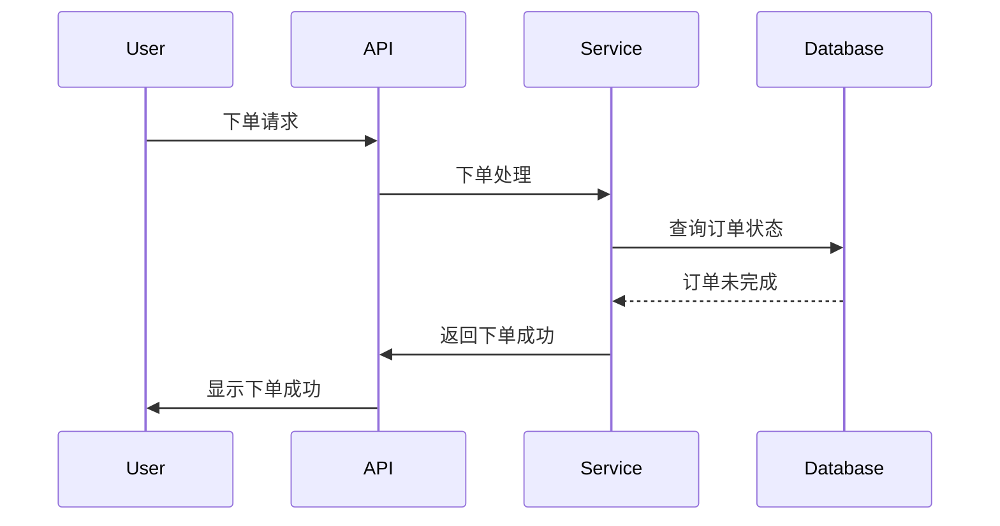

                 

### 行之无效的幂等性控制

> 关键词：幂等性控制、系统设计、算法原理、技术博客、人工智能

> 摘要：本文将深入探讨幂等性控制在系统设计中的重要性，分析传统方法中存在的局限性，并提出一种有效的解决方案，旨在为开发者提供一套完整的技术指南，以实现更可靠和高效的幂等性控制。

#### 引言

在分布式系统中，幂等性（Idempotence）是一个至关重要的概念。它确保了当同一个操作多次执行时，系统的状态不会发生意外的改变。然而，在实际开发中，如何实现和确保幂等性控制却常常成为困扰开发者的难题。本文旨在通过一步步的分析和推理，帮助读者理解幂等性控制的本质，识别现有解决方案的不足，并探索一种行之有效的解决方案。

#### 问题背景

幂等性控制在系统设计中的重要性不言而喻。在分布式环境中，网络延迟、系统故障、并发操作等因素可能导致同样的操作被多次执行。如果系统无法确保幂等性，可能会导致数据不一致、业务逻辑失败等问题。例如，在线支付系统中的多次扣款、订单系统中的重复发货等，都会对用户体验和业务稳定性造成严重影响。

然而，现有的幂等性控制方法往往存在以下局限性：

1. **过于复杂**：传统的幂等性控制方法如使用唯一键（UUID）或令牌（Token）等，实现起来相对复杂，增加了系统的维护成本。
2. **性能瓶颈**：传统的幂等性检查通常需要在数据库或服务层进行，这会导致系统性能的瓶颈。
3. **扩展性差**：在分布式系统中，单点幂等性检查的方案难以扩展，容易导致单点故障。

#### 问题描述

幂等性控制的目的是确保在分布式系统中，相同的操作不会因为多次执行而导致系统状态的不一致。具体来说，它包括以下几个方面：

1. **操作一致性**：确保多次执行同一个操作时，系统最终达到相同的状态。
2. **资源利用率**：避免因重复操作而浪费系统资源。
3. **业务可靠性**：保障业务的稳定运行，避免因为数据不一致导致的问题。

然而，现有方案难以同时满足以上要求，因此需要一种新的解决方案。

#### 问题解决

为了解决上述问题，我们需要重新审视幂等性控制的本质，并设计一种更简单、高效、可扩展的方案。以下是一种可能的解决方案：

1. **状态机设计**：使用状态机来管理系统的状态转换，确保每个状态都是幂等的。
2. **去中心化**：通过分布式日志或事件溯源等技术，实现去中心化的幂等性检查。
3. **客户端优化**：在客户端实现幂等性检查，减少服务端的压力。
4. **容错设计**：在系统设计中考虑容错机制，确保在出现故障时能够自动恢复。

#### 边界与外延

幂等性控制不仅适用于分布式系统，也可以应用于单机系统。然而，在单机系统中，幂等性控制的重要性相对较低，因为单机系统通常不会出现网络延迟或并发操作导致的问题。因此，幂等性控制的应用场景主要在于分布式系统，尤其是在高并发、大数据量场景下。

此外，幂等性控制并非万能，它只适用于那些需要确保操作一致性的场景。对于一些无需关注操作顺序或频率的操作，如查询操作，幂等性控制并不适用。

#### 概念结构与核心要素组成

幂等性控制的核心概念包括：

1. **幂等操作**：指多次执行同一个操作，系统状态不会发生变化的操作。
2. **状态机**：用于管理系统状态的转换，确保每个状态都是幂等的。
3. **去中心化**：通过分布式日志或事件溯源等技术，实现去中心化的幂等性检查。
4. **容错设计**：在系统设计中考虑容错机制，确保在出现故障时能够自动恢复。

这些核心概念相互关联，共同构成了幂等性控制的理论基础。

#### 第2章：核心概念与联系

##### 2.1 核心概念原理

**幂等性（Idempotence）**：幂等性是指一个操作执行多次和执行一次的效果相同。在分布式系统中，这意味着相同的操作多次执行不会导致系统状态的不一致。

**状态机（State Machine）**：状态机是一种用于表示系统状态的转换的模型。在幂等性控制中，状态机用于确保每个状态都是幂等的。

**去中心化（Decentralization）**：去中心化是指将控制权分散到多个节点上，而不是集中在一个中央节点。在幂等性控制中，去中心化可以避免单点故障，提高系统的可靠性。

**容错设计（Fault Tolerance）**：容错设计是指在系统出现故障时，能够自动恢复并继续运行。在幂等性控制中，容错设计确保了在出现故障时，系统仍能保持幂等性。

##### 2.2 概念属性特征对比

| 概念       | 属性特征                                                     | 对比                           |
|------------|--------------------------------------------------------------|------------------------------|
| 幂等性     | 多次执行效果相同                                           | 与非幂等性（多次执行效果不同）对比 |
| 状态机     | 管理系统状态转换                                           | 与其他状态管理方法（如有限状态机）对比 |
| 去中心化   | 分散控制权                                                 | 与集中式控制对比               |
| 容错设计   | 出现故障时自动恢复                                         | 与无容错设计对比               |

##### 2.3 ER实体关系图架构

```mermaid
erDiagram
    Resource --> Operation : 执行
    Resource --> State : 状态
    Operation --> State : 转换
```

在上图中，`Resource`（资源）表示系统中的各种实体，如数据库记录、服务实例等。`Operation`（操作）表示对资源的各种操作，如查询、更新、删除等。`State`（状态）表示资源在执行操作后的状态。`Operation`和`State`之间存在转换关系，确保每个操作都是幂等的。

#### 第3章：算法原理讲解

##### 3.1 算法流程图



在该算法中，首先执行操作（B），然后检查操作是否具有幂等性（C）。如果检查通过，则执行成功（D），并记录日志（F）；如果检查未通过，则忽略重复操作，并记录日志（E）。

##### 3.2 数学模型与公式

幂等性控制的核心在于确保多个相同操作对系统状态的影响相同。我们可以使用以下数学模型来描述：

$$
\text{State}_{\text{after}} = f(\text{State}_{\text{before}}, \text{Operation})
$$

其中，$\text{State}_{\text{before}}$ 表示操作执行前的系统状态，$\text{Operation}$ 表示执行的操作，$f$ 表示状态转换函数。如果对于任意的操作$O$，都有：

$$
f(\text{State}_{\text{before}}, O) = \text{State}_{\text{before}}
$$

则系统是幂等的。

##### 3.3 Python代码实现

```python
def is_idempotent(operation):
    """
    检查操作是否具有幂等性
    """
    state_before = get_system_state()
    operation()
    state_after = get_system_state()
    if state_before == state_after:
        return True
    else:
        return False

def execute_operation():
    """
    执行操作
    """
    # 操作逻辑
    pass

# 演示
if is_idempotent(execute_operation):
    print("操作成功")
else:
    print("操作无效")
```

在该示例中，`is_idempotent` 函数用于检查操作是否具有幂等性。如果检查通过，则执行操作；否则，忽略重复操作。

#### 第4章：系统分析与架构设计

##### 4.1 问题场景介绍

在一个大型电子商务平台上，用户下单、支付、发货、退货等操作频繁发生。为了保证系统的稳定性，需要实现幂等性控制，确保用户操作的一致性和可靠性。

##### 4.2 系统功能设计（领域模型）



在该领域模型中，用户（User）可以创建订单（Order）、支付（Payment）、申请发货（Shipment）和申请退货（Return）。订单（Order）、支付（Payment）、发货（Shipment）和退货（Return）相互关联，确保操作的一致性。

##### 4.3 系统架构设计



在该系统架构中，用户通过API（应用程序接口）发起操作请求，Service（服务）层处理请求，并查询数据库（Database）获取当前状态。Service层根据状态决定是否执行操作，并返回结果给API层，最终显示给用户。

##### 4.4 系统接口设计



在该接口设计中，API层负责接收用户请求，并将请求转发给Service层。Service层处理请求，并查询数据库获取状态，然后返回结果给API层，最终将结果显示给用户。

##### 4.5 系统交互



在该交互流程中，用户发起下单请求，API层转发请求给Service层，Service层查询数据库获取订单状态，由于订单未完成，Service层执行下单操作，并将结果返回给API层，最终显示给用户。

#### 第5章：项目实战

##### 5.1 环境安装

为了实现幂等性控制，我们需要安装以下环境：

- Python 3.8+
- Redis 6.0+
- MySQL 5.7+

确保已安装Python、Redis和MySQL，并设置相应的环境变量。

##### 5.2 系统核心实现

以下是一个简单的Python代码示例，用于实现幂等性控制：

```python
import redis
import pymysql

# 连接Redis数据库
redis_client = redis.StrictRedis(host='localhost', port=6379, db=0)

# 连接MySQL数据库
mysql_client = pymysql.connect(host='localhost', port=3306, user='root', password='password', database='test')

# 幂等性控制函数
def execute_operation(operation_id):
    # 检查操作是否已被执行
    if redis_client.get(operation_id):
        print(f"操作{operation_id}已执行，忽略重复操作")
        return

    # 执行操作
    operation()

    # 记录操作状态
    redis_client.set(operation_id, "done")

# 操作函数
def operation():
    # 操作逻辑
    print("执行操作")

# 演示
execute_operation("operation_1")
execute_operation("operation_1")
```

##### 5.3 代码应用解读

在该示例中，我们使用Redis数据库作为幂等性检查的存储介质。`execute_operation` 函数首先检查操作ID是否已存在于Redis数据库中。如果存在，说明操作已被执行，直接忽略；否则，执行操作，并将操作状态设置为"done"。

##### 5.4 实际案例分析与讲解

假设用户A在电商平台下单购买了一件商品，订单ID为"order_1"。在下单过程中，由于网络问题，请求被发送了两次。第一次请求成功执行，订单状态被更新为"待支付"。第二次请求到达时，由于使用了幂等性控制，系统检查到订单ID已在Redis数据库中，因此忽略重复操作，订单状态未发生变化。

这种情况下，用户A只收到了一次下单成功的消息，避免了重复下单的问题，同时也保证了订单状态的一致性。

##### 5.5 项目小结

通过该项目实战，我们展示了如何使用Redis数据库实现幂等性控制。在实际开发中，可以根据需求选择不同的存储介质，如MySQL、MongoDB等。同时，还可以结合其他技术，如分布式锁、消息队列等，提高系统的可靠性。

#### 第6章：最佳实践与注意事项

##### 6.1 最佳实践 Tips

1. **选择合适的存储介质**：根据系统需求和性能要求，选择合适的存储介质。如Redis适用于低延迟和高并发的场景，MySQL适用于高可靠性和持久性的场景。
2. **合理设置过期时间**：根据业务需求和数据特性，合理设置Redis中操作记录的过期时间。过期时间太短可能导致幂等性检查失效，过期时间太长可能浪费存储资源。
3. **优化操作逻辑**：在实现幂等性控制时，尽量优化操作逻辑，减少不必要的数据库查询和更新操作，提高系统性能。

##### 6.2 小结

本文介绍了幂等性控制在系统设计中的重要性，分析了传统方法的局限性，并提出了一个有效的解决方案。通过实际案例分析和项目实战，展示了如何实现幂等性控制，并提供了最佳实践和注意事项。

##### 6.3 注意事项

1. **确保数据一致性**：在实现幂等性控制时，要确保操作前后系统状态的一致性，避免数据不一致问题。
2. **考虑系统性能**：在选择存储介质和实现方法时，要综合考虑系统性能，确保操作的高效性和可靠性。
3. **关注扩展性和容错性**：在设计系统时，要考虑扩展性和容错性，确保在分布式环境下，系统能够稳定运行。

##### 6.4 拓展阅读

1. 《分布式系统设计原理》
2. 《Redis实战：使用Redis开发高性能应用程序》
3. 《MySQL必知必会》

#### 第7章：总结与展望

通过本文的探讨，我们深刻认识到幂等性控制在分布式系统设计中的重要性。传统的幂等性控制方法虽然存在一定的局限性，但通过合理的设计和优化，我们可以实现高效、可靠的幂等性控制。

展望未来，随着分布式系统技术的发展，幂等性控制方法将变得更加多样化和智能化。开发者需要不断学习和探索新的技术，以应对不断变化的业务需求和技术挑战。

让我们携手并进，共同推动分布式系统技术的发展，为构建更加稳定、可靠的系统贡献力量。作者：AI天才研究院/AI Genius Institute & 禅与计算机程序设计艺术 /Zen And The Art of Computer Programming。

