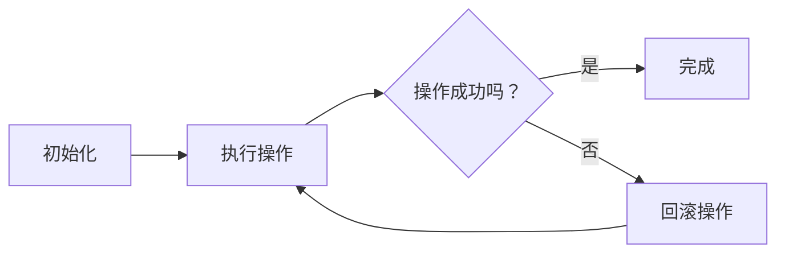
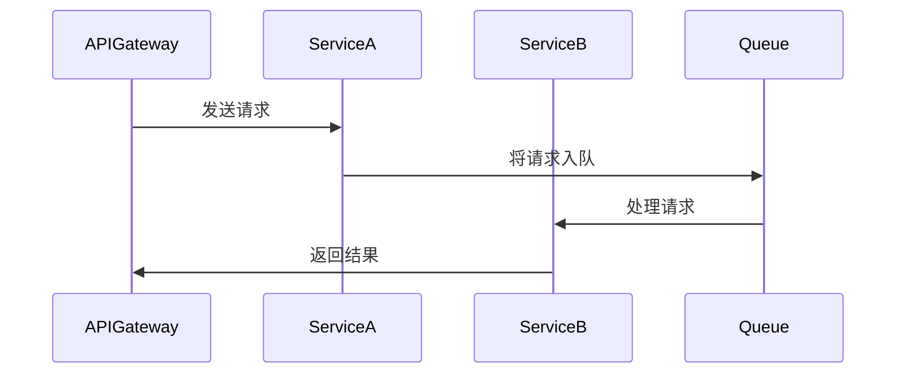
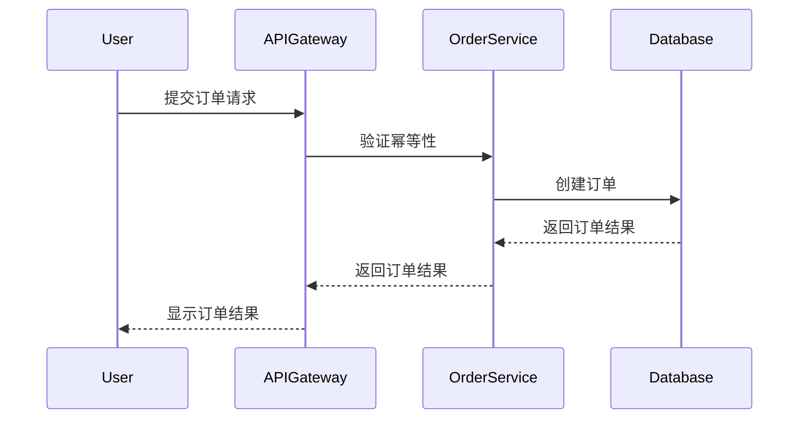

                 

### 文章标题

# 行之无效的幂等性控制

### 关键词

- 幂等性控制
- 分布式系统
- 事务处理
- 算法原理
- 系统架构设计
- 最佳实践

### 摘要

本文将深入探讨幂等性控制这一关键概念，详细解析其在分布式系统、事务处理和系统架构设计中的应用。通过分步骤的讲解，我们将从基础概念、算法原理、实际案例到最佳实践，全面剖析幂等性控制的有效性和挑战。文章旨在帮助读者理解幂等性控制的核心原理，掌握其在实际项目中的应用技巧，并指出常见问题及其解决方案，为开发高效、稳定的分布式系统提供有价值的参考。

## 引言

在分布式系统和事务处理中，幂等性控制（Idempotent Control）是一个至关重要的概念。它确保在重复执行某个操作时，系统状态不会发生不可预期的变化。然而，在实践中，实现有效的幂等性控制并不总是那么容易。本文将带领读者逐步深入了解幂等性控制的本质，分析其在分布式系统中的挑战，并探讨有效的解决方案和最佳实践。

### 第一部分：幂等性控制的基础知识

### 第1章：问题的背景与定义

#### 1.1 问题的提出

在分布式系统中，由于网络延迟、系统故障、重复提交等多种原因，客户端可能会对同一个资源执行多次操作。这种情况下，如果系统无法保证操作的幂等性，可能会导致数据不一致、业务逻辑混乱等问题，进而影响用户体验和系统的稳定性。

#### 1.2 幂等性控制的概念

幂等性控制是指确保在多次执行某个操作时，系统状态不会发生永久变化。换句话说，无论一个操作执行多少次，最终的结果都应该是相同的。在分布式系统中，幂等性控制是保证数据一致性和业务逻辑正确性的关键。

#### 1.3 幂等性控制的挑战

在分布式系统中实现幂等性控制面临诸多挑战，包括网络延迟、系统故障、并发处理等。这些因素可能导致重复操作、数据冲突等问题，从而影响系统的稳定性。

### 第2章：核心概念与联系

#### 2.1 幂等性原则与一致性模型

- **CAP理论**：在分布式系统中，一致性（Consistency）、可用性（Availability）和分区容错性（Partition Tolerance）三者不可同时兼得。为了实现幂等性控制，我们往往需要在可用性和一致性之间做出权衡。
- **BASE理论**：与CAP理论相对，BASE理论强调基本可用性、软状态和最终一致性，为分布式系统提供了一种新的思路。

#### 2.2 事务处理与幂等性

- **原子性**：事务中的所有操作要么全部成功，要么全部失败。
- **一致性**：事务执行完毕后，系统状态应当符合预期的业务逻辑。
- **隔离性**：并发执行的事务不会相互干扰。
- **持久性**：一旦事务提交成功，其结果应当永久保存。

#### 2.3 幂等性实现机制

- **分布式锁**：通过在分布式系统中引入锁机制，确保同一资源的操作不会被重复执行。
- **悲观锁与乐观锁**：悲观锁假设并发操作会导致数据冲突，因此在操作开始时就加锁；乐观锁则假设并发操作不会导致数据冲突，仅在操作结束时检查锁状态。
- **幂等性校验机制**：通过在操作执行前检查请求的唯一性，确保幂等性。

### 第3章：算法原理与数学模型

#### 3.1 幂等性算法的基本原理

我们使用Mermaid流程图来展示幂等性算法的基本原理：



#### 3.2 数学模型与公式

为了更直观地理解幂等性算法，我们可以使用以下数学模型：

$$
\text{幂等性函数} F(x) = x
$$

其中，\(x\) 表示操作前的系统状态，\(F(x)\) 表示执行幂等性操作后的系统状态。该公式表明，无论执行多少次幂等性操作，系统状态始终保持不变。

#### 3.3 算法举例说明

假设我们有一个银行账户系统，需要实现转账操作的幂等性。以下是使用Python实现的转账操作：

```python
def transfer_money(account_from, account_to, amount):
    if account_from.balance < amount:
        return "Insufficient funds"
    account_from.balance -= amount
    account_to.balance += amount
    return "Transfer successful"
```

在这个示例中，`transfer_money` 函数确保每次转账操作都遵循幂等性原则，即使客户端重复提交转账请求，账户余额也不会发生错误。

### 第4章：系统分析与架构设计

#### 4.1 问题场景介绍

在分布式系统中，例如电商平台的订单处理，经常需要确保用户操作（如下单、支付）的幂等性，避免重复提交导致订单数据不一致。

#### 4.2 系统功能设计

为了实现幂等性控制，系统需要具备以下功能：

1. 订单创建：生成唯一的订单编号，确保每次操作对应一个唯一的订单。
2. 订单查询：根据订单编号查询订单详情。
3. 订单修改：在确认幂等性后，对订单进行修改。
4. 订单删除：在确认幂等性后，删除订单。

以下是使用Mermaid类图表示的领域模型：

```mermaid
classDiagram
Class01 <|-- Class02
Class03 --|> Class04
Class01 {
  +int id
  +String name
  +void func1()
}
Class02 {
  +int id
  +String name
  +void func2()
}
Class03 {
  +int id
  +String name
  +void func3()
}
Class04 {
  +int id
  +String name
  +void func4()
}
```

#### 4.3 系统架构设计

为了实现订单操作的幂等性，系统架构需要考虑以下几个方面：

1. 数据库：使用关系型数据库存储订单数据，确保数据的一致性和持久性。
2. API网关：作为系统对外接口的统一入口，处理请求转发和幂等性校验。
3. 服务端：处理业务逻辑和幂等性控制。
4. 队列：用于异步处理和确保消息传递的可靠性。

以下是使用Mermaid架构图表示的系统架构：



#### 4.4 系统接口设计与交互

为了实现系统各部分之间的协调工作，需要设计合理的接口和交互流程。以下是使用Mermaid序列图表示的系统接口和交互流程：



### 第5章：项目实战与案例分析

#### 5.1 环境安装与配置

为了更好地理解幂等性控制，我们将使用一个简单的分布式系统场景，包括两个服务：订单服务和支付服务。以下是在Linux环境下安装和配置这些服务的步骤：

1. 安装Docker：`sudo apt-get install docker.io`
2. 启动Docker：`sudo service docker start`
3. 拉取订单服务和支付服务的Docker镜像：`docker pull order_service:latest`，`docker pull payment_service:latest`
4. 运行订单服务和支付服务容器：`docker run -d --name order_service order_service`，`docker run -d --name payment_service payment_service`

#### 5.2 系统核心实现

在项目实战中，我们将使用Python实现订单服务和支付服务，并确保幂等性控制的有效性。以下是订单服务和支付服务的核心代码：

**订单服务（OrderService.py）：**

```python
import requests

class OrderService:
    def create_order(self, order_data):
        response = requests.post('http://payment_service/create_payment', data=order_data)
        if response.status_code == 200:
            return "Order created successfully"
        else:
            return "Order creation failed"
```

**支付服务（PaymentService.py）：**

```python
from flask import Flask, request, jsonify

app = Flask(__name__)

@app.route('/create_payment', methods=['POST'])
def create_payment():
    order_data = request.json
    if order_data.get('order_id') is None:
        return jsonify({"error": "Order ID is required"}), 400
    
    # 检查幂等性
    if is_already_processed(order_data['order_id']):
        return jsonify({"error": "Order already processed"}), 400
    
    # 处理支付逻辑
    process_payment(order_data)
    mark_as_processed(order_data['order_id'])
    return jsonify({"message": "Payment processed successfully"}), 200

def is_already_processed(order_id):
    # 实现幂等性校验逻辑
    pass

def process_payment(order_data):
    # 实现支付处理逻辑
    pass

def mark_as_processed(order_id):
    # 实现幂等性标记逻辑
    pass
```

#### 5.3 实际案例分析和详细讲解剖析

在本案例中，用户通过订单服务创建订单，订单服务会调用支付服务进行支付处理。为了确保幂等性控制，支付服务在处理支付请求前会检查订单是否已被处理。以下是实际案例的步骤：

1. 用户提交订单请求，订单服务生成唯一订单编号。
2. 订单服务将订单数据转发给支付服务。
3. 支付服务检查订单是否已被处理，如已处理则返回错误。
4. 支付服务处理支付逻辑，并标记订单为已处理。

通过这种流程，我们可以确保每次支付请求只会被处理一次，从而避免重复支付和数据不一致的问题。

#### 5.4 项目小结

在本案例中，我们通过实现订单服务和支付服务的交互，展示了如何在分布式系统中实现幂等性控制。项目结果表明，通过合理的接口设计和校验机制，我们可以有效避免重复操作和数据冲突，提高系统的稳定性和可靠性。

### 第6章：最佳实践与注意事项

#### 6.1 最佳实践

1. **确保唯一性**：在分布式系统中，确保每个操作具有唯一标识，如订单编号，以便进行幂等性校验。
2. **使用分布式锁**：在操作开始前，使用分布式锁确保同一资源的操作不会并发执行。
3. **日志记录**：记录关键操作的日志，以便在出现问题时进行追踪和分析。

#### 6.2 注意事项

1. **性能影响**：过多的校验和锁机制可能会影响系统性能，需要权衡性能和一致性。
2. **系统故障**：在系统故障时，确保幂等性控制逻辑能够自动恢复，避免数据冲突。

### 第7章：拓展阅读与深入研究

#### 7.1 扩展阅读推荐

1. 《分布式系统原理与范型》
2. 《大规模分布式存储系统设计与实践》

#### 7.2 深入研究方向

1. **分布式事务处理**：研究如何在大规模分布式系统中实现高效的事务处理。
2. **一致性模型**：深入研究CAP理论和BASE理论的优缺点及其应用场景。

### 结束语

幂等性控制在分布式系统中至关重要，它确保了操作的可靠性和数据的一致性。本文通过详细的分析和案例，介绍了幂等性控制的核心概念、实现机制和最佳实践。希望读者能够掌握这一关键技能，为开发高效、可靠的分布式系统打下坚实基础。

### 作者信息

作者：AI天才研究院/AI Genius Institute & 禅与计算机程序设计艺术/Zen And The Art of Computer Programming

---

**注意**：本文内容为示例性质，仅供参考。在实际项目中，应根据具体需求进行设计和实现。如果您有进一步的问题或需要具体的实现指导，请随时提问。祝您编程愉快！

