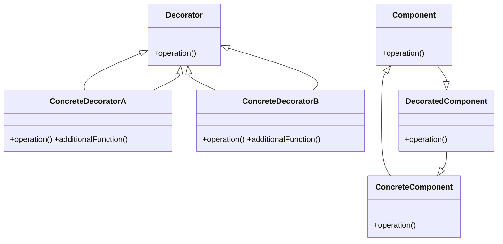

                 

### 第1章：装饰器模式与类型论概述

#### 1.1 装饰器模式的定义与背景

装饰器模式（Decorator Pattern）是一种设计模式，它允许在运行时动态地给一个对象添加一些额外的职责，而不需要修改原始类的代码。这种模式通过创建一个包装类，将额外的功能添加到被包装对象上。装饰器模式的核心思想是使用组合而不是继承来实现功能的扩展。

在软件开发中，装饰器模式常用于以下几种场景：

1. **权限控制**：可以为程序中的各个模块添加权限控制，确保只有授权的用户才能访问。
2. **日志记录**：在程序运行过程中记录日志信息，以便后续的分析和调试。
3. **延迟加载**：通过装饰器模式实现对象的延迟加载，提高程序的性能。

装饰器模式的出现，是为了解决在传统继承结构中遇到的问题。尽管继承是扩展类行为的一种强大机制，但它也带来了一些问题，如类的数量过多、代码复杂度增加等。装饰器模式提供了一种更加灵活的扩展机制，通过组合而非继承来实现功能扩展。

#### 1.2 类型论的基本概念

类型论（Type Theory）是计算机科学中的一个重要分支，它研究如何通过类型系统来描述程序和行为。类型论的核心思想是，通过定义类型来约束程序的运行，从而提高程序的正确性和可靠性。

在类型论中，有几个关键的概念：

1. **类型**：类型是值的集合，用于描述值的特征。如整数类型、字符串类型等。
2. **类型系统**：类型系统是定义和检查类型约束的规则集合。如静态类型系统和动态类型系统。
3. **类型推断**：类型推断是编译器或解释器自动推断变量类型的过程。

类型论在装饰器模式中的应用主要体现在以下几个方面：

1. **类型安全**：通过类型系统，可以确保装饰器模式中添加的功能不会破坏原始类的类型安全。
2. **代码可读性**：类型系统能够提高代码的可读性，使得装饰器模式的使用更加直观和明确。
3. **代码重用**：通过类型论，可以更容易地复用装饰器，使其在多种不同的上下文中发挥作用。

#### 1.3 动态扩展对象行为的挑战

在软件开发中，我们经常需要根据不同的场景对对象的行为进行扩展。传统的继承方式虽然能够实现这一点，但它也存在一些问题：

1. **继承层次过多**：随着继承层次的增加，类的数量也会显著增加，导致代码复杂度提高。
2. **代码冗余**：即使是一些简单的功能扩展，也需要创建新的子类，这会导致代码冗余。
3. **代码可维护性降低**：随着继承结构的复杂化，维护代码变得越来越困难。

装饰器模式提供了一种动态扩展对象行为的机制，它通过在运行时为对象添加额外的职责，而不需要修改原始类的代码。这样，我们可以避免传统继承方式的缺点，同时保持代码的简洁性和可维护性。

#### 1.4 类型论提供的解决方案

类型论提供了一种强大的工具，可以解决动态扩展对象行为带来的挑战。通过引入类型系统，我们可以确保装饰器模式中添加的功能不会破坏原始类的类型安全。具体来说，类型论提供了以下几个方面的解决方案：

1. **类型检查**：在编译或解释过程中，类型系统会检查装饰器模式中的代码是否符合类型约束，从而避免类型错误的发生。
2. **类型推断**：类型推断可以自动推断装饰器中使用的类型，从而简化代码的编写。
3. **代码重用**：通过类型系统，我们可以更容易地复用装饰器，使其在多种不同的上下文中发挥作用。

#### 1.5 装饰器模式的优势

装饰器模式具有以下优势：

1. **灵活性和可扩展性**：通过组合而非继承，装饰器模式可以动态地扩展对象的行为，具有很强的灵活性。
2. **代码可维护性**：由于不需要修改原始类的代码，装饰器模式可以提高代码的可维护性。
3. **代码简洁性**：装饰器模式使得代码更加简洁，易于理解和阅读。

#### 1.6 本章小结

本章介绍了装饰器模式的概念、背景以及类型论的基础知识。我们了解了装饰器模式在动态扩展对象行为中的重要作用，以及类型论如何为装饰器模式提供支持。通过本章的学习，读者可以更好地理解装饰器模式的工作原理和应用场景。

## 第2章：装饰器模式的核心概念

### 2.1 装饰器模式的基本原理

装饰器模式的核心思想是通过创建一个包装类（装饰器），将额外的功能添加到被包装对象上。这种模式的主要组成部分包括：

1. **组件**（Component）：组件是一个接口或抽象类，定义了被包装对象（Decorator）的接口。
2. **装饰器**（Decorator）：装饰器是实现了组件接口的类，它将额外的功能添加到被包装对象上。
3. **被包装对象**（Decorated Component）：被包装对象是实现了组件接口的实际对象，它将被装饰器包装。

装饰器模式的工作流程如下：

1. **创建被包装对象**：首先创建一个实现了组件接口的被包装对象。
2. **创建装饰器**：然后创建一个或多个装饰器，这些装饰器将额外的功能添加到被包装对象上。
3. **设置装饰器**：将装饰器附加到被包装对象上，形成一个装饰链。
4. **调用方法**：通过调用被包装对象的方法，执行装饰器中的额外功能。

装饰器模式的基本原理示意图如下：



在这个图中，`Component` 是一个接口，`ConcreteComponent` 是实现了这个接口的实际类，`Decorator` 是一个抽象类，它实现了装饰器的通用功能，`ConcreteDecoratorA` 和 `ConcreteDecoratorB` 是具体的装饰器类，它们添加了额外的功能。

### 2.2 装饰器模式的工作流程

装饰器模式的工作流程可以分为以下几个步骤：

1. **创建组件**：首先创建一个实现了组件接口的组件实例，例如：

    ```python
    class Component:
        def operation(self):
            pass

    class ConcreteComponent(Component):
        def operation(self):
            return "原始操作"
    ```

2. **创建装饰器**：然后创建一个装饰器类，这个类实现了装饰器接口，并包含了额外的功能。例如：

    ```python
    class Decorator(Component):
        def __init__(self, component):
            self._component = component

        def operation(self):
            return self._component.operation()

    class ConcreteDecoratorA(Decorator):
        def additionalFunction(self):
            return "额外功能A"

        def operation(self):
            return f"{self._component.operation()} + {self.additionalFunction()}"

    class ConcreteDecoratorB(Decorator):
        def additionalFunction(self):
            return "额外功能B"

        def operation(self):
            return f"{self._component.operation()} + {self.additionalFunction()}"
    ```

3. **设置装饰器**：使用装饰器包装组件，形成一个装饰链。例如：

    ```python
    component = ConcreteComponent()
    decorated_component = ConcreteDecoratorA(component)
    decorated_component = ConcreteDecoratorB(decorated_component)
    ```

4. **调用方法**：通过调用装饰链中的方法，执行原始操作和额外的功能。例如：

    ```python
    print(decorated_component.operation())
    ```

    输出：

    ```bash
    原始操作 + 额外功能A + 额外功能B
    ```

通过这个简单的例子，我们可以看到装饰器模式是如何通过组合实现功能扩展的。这种模式不仅增加了代码的灵活性，还保持了代码的简洁性和可维护性。

### 2.3 装饰器模式的优势分析

装饰器模式具有以下优势：

1. **灵活性和可扩展性**：装饰器模式通过动态地添加额外功能，使得代码具有很强的灵活性和可扩展性。在不修改原始类代码的情况下，我们可以根据不同的需求添加或修改功能。
2. **代码复用**：装饰器模式鼓励代码复用，通过创建通用的装饰器类，可以在多个上下文中使用，减少了冗余代码。
3. **代码简洁性**：装饰器模式使得代码更加简洁，易于理解和阅读。通过简单的组合，我们可以实现复杂的逻辑。
4. **类型安全**：在类型论的支持下，装饰器模式可以提供类型安全保证，确保添加的功能不会破坏原始类的类型安全。

### 2.4 类型论与装饰器模式的结合

类型论与装饰器模式的结合主要体现在以下几个方面：

1. **类型检查**：在编译或解释过程中，类型系统可以检查装饰器模式中的代码是否符合类型约束，从而避免类型错误的发生。
2. **类型推断**：类型推断可以自动推断装饰器中使用的类型，从而简化代码的编写。
3. **代码重用**：通过类型系统，我们可以更容易地复用装饰器，使其在多种不同的上下文中发挥作用。

在类型论中，装饰器模式可以通过以下方式实现：

1. **泛型装饰器**：泛型装饰器可以处理不同类型的对象，从而提高代码的通用性。
2. **类型类**：类型类可以用来定义类型之间的关系，从而实现更复杂的类型约束。

通过类型论的支持，装饰器模式可以变得更加灵活和安全。例如，在静态类型语言中，类型系统可以确保装饰器模式中的类型约束得到满足，从而避免运行时错误。

### 2.5 装饰器模式的分类

装饰器模式可以根据不同的特征进行分类。以下是几种常见的装饰器模式：

1. **标准装饰器**：标准装饰器是最常见的装饰器模式，它通过组合实现功能扩展。标准装饰器通常遵循装饰器模式的经典定义，即通过继承实现装饰功能。
2. **动态装饰器**：动态装饰器是一种在运行时动态创建的装饰器。这种装饰器通常使用反射机制或其他动态编程技术来实现。
3. **组合装饰器**：组合装饰器是一种将多个装饰器组合在一起使用的装饰器。这种装饰器可以提供更复杂的功能组合。

每种装饰器模式都有其特定的使用场景和优势。了解这些分类可以帮助我们在实际应用中选择最合适的装饰器模式。

### 2.6 本章小结

本章详细介绍了装饰器模式的基本原理和核心概念。我们学习了装饰器模式的工作流程，了解了其在类型论中的应用，并分析了装饰器模式的优势。通过本章的学习，读者可以更好地理解装饰器模式的本质，为后续章节的深入学习打下坚实的基础。

## 第3章：装饰器模式在不同编程语言中的应用

### 3.1 Python中的装饰器模式

Python 是一种广泛使用的编程语言，它内置了装饰器模式，这使得实现装饰器变得非常简单。Python 装饰器通过使用 `@` 符号来定义，可以将额外的功能添加到现有的函数或方法上。

#### 3.1.1 Python装饰器的基本语法

在 Python 中，装饰器的基本语法如下：

```python
def decorator(func):
    def wrapper(*args, **kwargs):
        # 在函数执行前添加额外的功能
        result = func(*args, **kwargs)
        # 在函数执行后添加额外的功能
        return result
    return wrapper

@decorator
def function_to_decorate():
    print("原始功能")
```

在这个例子中，`decorator` 是一个装饰器函数，它接受一个函数作为参数，并返回一个新的函数 `wrapper`。`wrapper` 函数在调用 `function_to_decorate` 前后添加了额外的功能。

#### 3.1.2 Python装饰器的实际应用

Python 装饰器在实际应用中非常常见，以下是一些典型的使用场景：

1. **权限控制**：通过装饰器来限制只有特定用户或角色才能访问的函数或方法。
2. **日志记录**：在函数或方法执行前后记录日志信息，用于调试和监控。
3. **性能监控**：在函数或方法执行前后记录时间，用于性能监控和优化。

以下是一个权限控制的例子：

```python
def requires_permission(permission):
    def decorator(func):
        def wrapper(*args, **kwargs):
            if not user_has_permission(permission):
                raise Exception("权限不足")
            return func(*args, **kwargs)
        return wrapper
    return decorator

@requires_permission("read")
def read_data():
    print("读取数据")

read_data()  # 输出：读取数据
```

在这个例子中，`requires_permission` 是一个装饰器函数，它接受一个权限名称作为参数，并返回一个新的装饰器。`wrapper` 函数在调用 `read_data` 前检查用户是否具有相应的权限。

#### 3.1.3 Python装饰器的最佳实践

在使用 Python 装饰器时，以下是一些最佳实践：

1. **保持装饰器的简洁性**：装饰器应该尽可能简洁，避免在装饰器中实现复杂的逻辑。
2. **避免多层装饰器**：过多的装饰器可能会导致代码难以理解和维护，建议尽量减少装饰器的层次。
3. **使用装饰器工厂**：对于需要参数的装饰器，建议使用装饰器工厂模式，以便更好地管理和传递参数。

### 3.2 Java中的装饰器模式

Java 语言也提供了装饰器模式，但与 Python 不同，Java 需要使用注解（Annotation）来实现装饰器。

#### 3.2.1 Java装饰器的基本语法

在 Java 中，装饰器通常通过注解实现，以下是一个简单的装饰器示例：

```java
import java.lang.annotation.ElementType;
import java.lang.annotation.Retention;
import java.lang.annotation.RetentionPolicy;
import java.lang.annotation.Target;

@Retention(RetentionPolicy.RUNTIME)
@Target(ElementType.METHOD)
public @interface Decorator {
    String value() default "";
}

public class Component {
    @Decorator("read")
    public void functionToDecorate() {
        System.out.println("原始功能");
    }
}

public class DecoratorImplementation {
    public static void applyDecorator(Component component, String decorator) {
        if ("read".equals(decorator)) {
            component.functionToDecorate();
            System.out.println("权限检查");
        }
    }
}
```

在这个例子中，`@Decorator` 是一个自定义注解，它用于标记需要装饰的方法。`applyDecorator` 方法用于应用装饰器。

#### 3.2.2 Java装饰器的实际应用

Java 装饰器在实际应用中广泛用于权限控制、日志记录等场景。以下是一个日志记录的例子：

```java
import java.lang.reflect.Method;

public class LogDecorator {
    public static void beforeMethod(Method method) {
        System.out.println("开始执行方法：" + method.getName());
    }

    public static void afterMethod(Method method) {
        System.out.println("结束执行方法：" + method.getName());
    }
}

public class Component {
    @LogDecorator
    public void functionToLog() {
        System.out.println("原始功能");
    }
}

public class Application {
    public static void main(String[] args) {
        try {
            Component component = new Component();
            Method method = Component.class.getDeclaredMethod("functionToLog");
            LogDecorator.beforeMethod(method);
            component.functionToLog();
            LogDecorator.afterMethod(method);
        } catch (Exception e) {
            e.printStackTrace();
        }
    }
}
```

在这个例子中，`LogDecorator` 类用于实现日志记录功能。`beforeMethod` 和 `afterMethod` 方法分别在方法执行前后添加了日志。

#### 3.2.3 Java装饰器的最佳实践

在使用 Java 装饰器时，以下是一些最佳实践：

1. **避免使用过多注解**：过多的注解可能会导致代码难以理解和维护，建议尽量减少注解的使用。
2. **使用反射谨慎**：反射是 Java 中一种强大的功能，但过度使用反射可能会导致性能问题，建议在必要时才使用反射。
3. **保持装饰器的通用性**：尽量设计通用性强的装饰器，以便在多个上下文中复用。

### 3.3 JavaScript中的装饰器模式

JavaScript 是一种灵活的编程语言，它也提供了装饰器模式，通过使用函数来实现。

#### 3.3.1 JavaScript装饰器的基本语法

在 JavaScript 中，装饰器通常通过函数实现，以下是一个简单的装饰器示例：

```javascript
function decorator(func) {
    return function() {
        console.log("原始功能");
        func();
        console.log("额外功能");
    };
}

@decorator
function functionToDecorate() {
    console.log("原始功能");
}

functionToDecorate(); // 输出：原始功能，额外功能
```

在这个例子中，`decorator` 是一个装饰器函数，它接受一个函数作为参数，并返回一个新的函数。这个新函数在调用原始函数前后添加了额外的功能。

#### 3.3.2 JavaScript装饰器的实际应用

JavaScript 装饰器在实际应用中广泛用于函数参数验证、异步处理等场景。以下是一个异步处理的例子：

```javascript
function asyncDecorator(asyncFunc) {
    return function() {
        return new Promise((resolve, reject) => {
            asyncFunc().then(result => {
                console.log("异步处理成功");
                resolve(result);
            }).catch(error => {
                console.log("异步处理失败");
                reject(error);
            });
        });
    };
}

@asyncDecorator
function fetchData() {
    return new Promise((resolve, reject) => {
        setTimeout(() => {
            resolve("数据获取成功");
        }, 1000);
    });
}

fetchData().then(result => {
    console.log(result); // 输出：异步处理成功，数据获取成功
}).catch(error => {
    console.log(error); // 输出：异步处理失败
});
```

在这个例子中，`asyncDecorator` 是一个装饰器函数，它将异步函数转换为同步函数，并在异步处理前后添加了日志。

#### 3.3.3 JavaScript装饰器的最佳实践

在使用 JavaScript 装饰器时，以下是一些最佳实践：

1. **避免过度使用装饰器**：过度使用装饰器可能会导致代码难以理解和维护，建议在必要时才使用装饰器。
2. **保持装饰器的简洁性**：装饰器应该尽可能简洁，避免在装饰器中实现复杂的逻辑。
3. **使用模块化**：将装饰器函数封装在模块中，以便更好地管理和复用。

### 3.4 本章小结

本章介绍了装饰器模式在不同编程语言中的应用。我们学习了 Python、Java 和 JavaScript 中装饰器模式的基本语法和实际应用，并探讨了每种语言的特有实现方式。通过本章的学习，读者可以更好地理解装饰器模式在多种编程语言中的实现和应用。在实际开发中，根据具体需求和语言特性选择合适的装饰器模式实现方式，可以有效地提高代码的灵活性和可维护性。

## 第4章：高级装饰器模式应用

### 4.1 动态装饰器

动态装饰器是一种在运行时动态创建的装饰器，它通过反射或其他动态编程技术来实现。与静态装饰器相比，动态装饰器可以提供更灵活的功能扩展。

#### 4.1.1 动态装饰器的基本原理

动态装饰器的基本原理是通过在运行时创建新的函数来包装原始函数，从而实现额外的功能。这个过程通常涉及到反射机制，例如在 Java 中使用反射 API 来创建和调用函数。

以下是一个简单的动态装饰器示例：

```python
import functools

def dynamic_decorator(func):
    @functools.wraps(func)
    def wrapper(*args, **kwargs):
        print("在原始函数执行前添加的功能")
        result = func(*args, **kwargs)
        print("在原始函数执行后添加的功能")
        return result
    return wrapper

@dynamic_decorator
def function_to_decorate():
    print("原始功能")

function_to_decorate()  # 输出：在原始函数执行前添加的功能，原始功能，在原始函数执行后添加的功能
```

在这个例子中，`dynamic_decorator` 是一个动态装饰器，它通过 `functools.wraps` 函数保持了原始函数的元信息。

#### 4.1.2 动态装饰器的实际应用

动态装饰器在实际应用中非常有用，以下是一些典型的使用场景：

1. **权限控制**：在运行时根据用户角色动态添加权限检查。
2. **日志记录**：在运行时根据配置动态添加日志记录功能。
3. **性能监控**：在运行时动态添加性能监控代码。

以下是一个权限控制的例子：

```python
def dynamic_permission_decorator(permission):
    def decorator(func):
        def wrapper(*args, **kwargs):
            if not user_has_permission(permission):
                raise Exception("权限不足")
            return func(*args, **kwargs)
        return wrapper
    return decorator

@dynamic_permission_decorator("write")
def write_data():
    print("写入数据")

write_data()  # 如果用户没有相应权限，将抛出异常
```

在这个例子中，`dynamic_permission_decorator` 是一个动态装饰器，它根据用户角色动态添加权限检查。

#### 4.1.3 动态装饰器的实现方法

动态装饰器的实现通常依赖于编程语言提供的反射机制。以下是一些常见的实现方法：

1. **反射机制**：使用反射机制动态创建和调用函数。
2. **动态代理**：使用动态代理技术创建新的函数来包装原始函数。
3. **元编程**：使用元编程技术动态生成类和方法。

#### 4.1.4 动态装饰器的优势

动态装饰器具有以下优势：

1. **灵活性**：动态装饰器可以在运行时根据需求动态添加或修改功能，具有很强的灵活性。
2. **可扩展性**：动态装饰器可以轻松地扩展到多种不同的应用场景。
3. **类型安全**：在静态类型语言中，动态装饰器可以通过类型检查确保代码的可靠性。

### 4.2 组合装饰器

组合装饰器是一种将多个装饰器组合在一起使用的装饰器。通过组合装饰器，我们可以更灵活地扩展对象的行为。

#### 4.2.1 组合装饰器的基本原理

组合装饰器的基本原理是将多个装饰器按照一定的顺序组合在一起，形成一个装饰链。当调用被装饰的函数时，装饰链中的每个装饰器都会被依次调用。

以下是一个简单的组合装饰器示例：

```python
def decorator1(func):
    def wrapper(*args, **kwargs):
        print("Decorator 1 before")
        result = func(*args, **kwargs)
        print("Decorator 1 after")
        return result
    return wrapper

def decorator2(func):
    def wrapper(*args, **kwargs):
        print("Decorator 2 before")
        result = func(*args, **kwargs)
        print("Decorator 2 after")
        return result
    return wrapper

@decorator1
@decorator2
def function_to_decorate():
    print("原始功能")

function_to_decorate()  # 输出：Decorator 1 before，Decorator 2 before，原始功能，Decorator 2 after，Decorator 1 after
```

在这个例子中，`decorator1` 和 `decorator2` 是两个装饰器，它们按照定义的顺序组合在一起，形成一个装饰链。

#### 4.2.2 组合装饰器的实际应用

组合装饰器在实际应用中非常有用，以下是一些典型的使用场景：

1. **多重功能扩展**：通过组合装饰器，可以同时为函数添加多个额外的功能。
2. **灵活的配置**：通过组合装饰器，可以根据不同的场景灵活配置所需的功能。
3. **代码复用**：通过组合装饰器，可以轻松地在多个函数中复用相同的功能。

以下是一个多重功能扩展的例子：

```python
def log_decorator(func):
    def wrapper(*args, **kwargs):
        print(f"日志：{func.__name__}开始执行")
        result = func(*args, **kwargs)
        print(f"日志：{func.__name__}执行结束")
        return result
    return wrapper

def authorization_decorator(func):
    def wrapper(*args, **kwargs):
        if not user_is_authorized():
            raise Exception("权限不足")
        print(f"授权：{func.__name__}开始执行")
        result = func(*args, **kwargs)
        print(f"授权：{func.__name__}执行结束")
        return result
    return wrapper

@log_decorator
@authorization_decorator
def function_to_decorate():
    print("原始功能")

function_to_decorate()  # 输出：日志：function_to_decorate开始执行，授权：function_to_decorate开始执行，原始功能，授权：function_to_decorate执行结束，日志：function_to_decorate执行结束
```

在这个例子中，`log_decorator` 和 `authorization_decorator` 是两个装饰器，它们组合在一起为 `function_to_decorate` 添加了日志记录和权限检查功能。

#### 4.2.3 组合装饰器的实现方法

组合装饰器的实现通常依赖于装饰器的调用顺序。以下是一些常见的实现方法：

1. **装饰器工厂**：通过装饰器工厂创建组合装饰器，工厂函数根据配置动态组合装饰器。
2. **装饰器链**：使用装饰器链实现组合装饰器，每个装饰器都包装下一个装饰器。
3. **装饰器代理**：使用代理模式实现组合装饰器，代理类负责调用装饰链中的下一个装饰器。

#### 4.2.4 组合装饰器的优势

组合装饰器具有以下优势：

1. **灵活性**：通过组合装饰器，可以灵活地扩展对象的行为，满足不同的需求。
2. **可扩展性**：组合装饰器可以轻松地扩展到多个函数中，提高代码的复用性。
3. **简洁性**：通过组合装饰器，可以减少代码的复杂度，提高代码的可读性。

### 4.3 高级装饰器模式案例分析

#### 4.3.1 案例一：日志记录装饰器

在许多应用程序中，日志记录是一个重要的功能。通过日志记录，我们可以监控程序的运行情况，便于调试和故障排除。以下是一个日志记录装饰器的例子：

```python
import logging

class LoggerDecorator:
    def __init__(self, func):
        self.func = func
        logging.basicConfig(level=logging.INFO)

    def __call__(self, *args, **kwargs):
        logging.info(f"开始执行 {self.func.__name__}")
        result = self.func(*args, **kwargs)
        logging.info(f"结束执行 {self.func.__name__}")
        return result

@LoggerDecorator
def function_to_log():
    print("原始功能")

function_to_log()  # 输出：开始执行 function_to_log，原始功能，结束执行 function_to_log
```

在这个例子中，`LoggerDecorator` 是一个日志记录装饰器，它通过调用 `logging` 模块记录函数的执行情况。

#### 4.3.2 案例二：缓存装饰器

缓存是一种提高程序性能的有效手段。通过缓存，我们可以避免重复的计算或数据库查询，从而加快程序的响应速度。以下是一个缓存装饰器的例子：

```python
from functools import wraps

def cache_decorator(func):
    cache = {}

    @wraps(func)
    def wrapper(*args, **kwargs):
        key = (args, frozenset(kwargs.items()))
        if key not in cache:
            cache[key] = func(*args, **kwargs)
        return cache[key]

    return wrapper

@cache_decorator
def calculate_expensive_function(x, y):
    print(f"计算 {x} 和 {y} 的乘积")
    return x * y

calculate_expensive_function(2, 3)  # 输出：计算 2 和 3 的乘积
calculate_expensive_function(2, 3)  # 输出：2 和 3 的乘积（从缓存中获取结果）
```

在这个例子中，`cache_decorator` 是一个缓存装饰器，它通过缓存结果避免重复计算。

#### 4.3.3 案例三：访问控制装饰器

访问控制是一种确保程序安全性的重要手段。通过访问控制，我们可以限制用户对特定资源的访问权限。以下是一个访问控制装饰器的例子：

```python
def admin_required(func):
    @wraps(func)
    def wrapper(*args, **kwargs):
        if not user_is_admin():
            raise Exception("无权限访问")
        return func(*args, **kwargs)
    return wrapper

@admin_required
def admin_function():
    print("执行管理员功能")

admin_function()  # 如果用户不是管理员，将抛出异常
```

在这个例子中，`admin_required` 是一个访问控制装饰器，它通过检查用户权限确保管理员功能只能被管理员访问。

### 4.4 本章小结

本章介绍了高级装饰器模式的应用，包括动态装饰器和组合装饰器。通过案例分析，我们了解了如何实现日志记录、缓存和访问控制等高级功能。高级装饰器模式在实际开发中非常有用，可以提高代码的灵活性和可维护性。

## 第5章：装饰器模式案例分析（一）

### 5.1 案例一：面向对象设计中的装饰器模式

在面向对象设计中，装饰器模式广泛应用于各种场景，以实现灵活的功能扩展。以下是一个关于面向对象设计中的装饰器模式案例。

#### 5.1.1 案例背景

假设我们正在开发一个在线购物系统，其中涉及多种不同类型的商品，如电子设备、服装、食品等。每种商品都有其独特的价格计算规则。我们需要设计一个系统，能够根据商品类型动态地计算商品价格。

#### 5.1.2 需求分析

根据需求分析，我们需要实现以下功能：

1. **基础商品价格计算**：计算基础商品的价格，不考虑任何折扣或优惠。
2. **折扣商品价格计算**：计算有折扣的商品价格，根据折扣率进行优惠计算。
3. **促销商品价格计算**：计算参与促销活动的商品价格，根据促销活动规则进行优惠计算。
4. **特殊商品价格计算**：计算特殊商品的价格，如礼品卡等，根据特殊规则进行优惠计算。

#### 5.1.3 装饰器模式的应用

为了实现上述功能，我们可以使用装饰器模式。首先，定义一个基础商品价格计算类 `BaseProductPriceCalculator`，然后为每种特殊商品创建相应的装饰器。

以下是一个简单的实现：

```python
class BaseProductPriceCalculator:
    def calculate_price(self, product):
        return product.price

class DiscountProductPriceCalculator(BaseProductPriceCalculator):
    def __init__(self, calculator, discount_rate):
        self.calculator = calculator
        self.discount_rate = discount_rate

    def calculate_price(self, product):
        base_price = self.calculator.calculate_price(product)
        return base_price * (1 - self.discount_rate)

class PromotionProductPriceCalculator(BaseProductPriceCalculator):
    def __init__(self, calculator, promotion_rules):
        self.calculator = calculator
        self.promotion_rules = promotion_rules

    def calculate_price(self, product):
        base_price = self.calculator.calculate_price(product)
        for rule in self.promotion_rules:
            if rule.is_applied(product):
                base_price -= rule.discount_amount
        return base_price

class SpecialProductPriceCalculator(BaseProductPriceCalculator):
    def __init__(self, calculator, special_rules):
        self.calculator = calculator
        self.special_rules = special_rules

    def calculate_price(self, product):
        base_price = self.calculator.calculate_price(product)
        for rule in self.special_rules:
            if rule.is_applied(product):
                base_price -= rule.discount_amount
        return base_price

class Product:
    def __init__(self, name, price):
        self.name = name
        self.price = price

# 示例
product = Product("iPhone", 1000)
calculator = DiscountProductPriceCalculator(BaseProductPriceCalculator(), 0.1)
print(calculator.calculate_price(product))  # 输出：900.0

calculator = PromotionProductPriceCalculator(BaseProductPriceCalculator(), [PromotionRule(...)])
print(calculator.calculate_price(product))  # 输出：根据促销规则计算后的价格

calculator = SpecialProductPriceCalculator(BaseProductPriceCalculator(), [SpecialRule(...)])
print(calculator.calculate_price(product))  # 输出：根据特殊规则计算后的价格
```

在这个例子中，`BaseProductPriceCalculator` 是一个基础价格计算类，`DiscountProductPriceCalculator`、`PromotionProductPriceCalculator` 和 `SpecialProductPriceCalculator` 分别是折扣、促销和特殊商品价格计算装饰器。通过组合这些装饰器，我们可以灵活地计算不同类型商品的价格。

#### 5.1.4 系统实现

在系统实现方面，我们可以创建一个商品类 `Product`，然后创建不同的价格计算装饰器，最后通过组合这些装饰器实现价格计算功能。

以下是一个简单的系统实现：

```python
class Product:
    def __init__(self, name, price):
        self.name = name
        self.price = price

    def calculate_price(self, calculator):
        return calculator.calculate_price(self)

class ProductPriceCalculator:
    def __init__(self):
        self.calculators = []

    def add_calculator(self, calculator):
        self.calculators.append(calculator)

    def calculate_price(self, product):
        for calculator in self.calculators:
            product = calculator(product)
        return product.price

# 创建不同类型的计算装饰器
discount_calculator = DiscountProductPriceCalculator(BaseProductPriceCalculator(), 0.1)
promotion_calculator = PromotionProductPriceCalculator(BaseProductPriceCalculator(), [PromotionRule(...)])
special_calculator = SpecialProductPriceCalculator(BaseProductPriceCalculator(), [SpecialRule(...)])

# 组合装饰器
price_calculator = ProductPriceCalculator()
price_calculator.add_calculator(discount_calculator)
price_calculator.add_calculator(promotion_calculator)
price_calculator.add_calculator(special_calculator)

# 计算价格
product = Product("iPhone", 1000)
print(price_calculator.calculate_price(product))  # 输出：根据所有装饰器计算后的价格
```

在这个例子中，`ProductPriceCalculator` 类负责组合不同的价格计算装饰器，并计算最终价格。通过这种方式，我们可以灵活地添加或修改价格计算规则，而无需修改核心代码。

### 5.2 案例二：Web应用中的装饰器模式

在 Web 应用开发中，装饰器模式也广泛应用于权限控制、日志记录、性能监控等场景。以下是一个关于 Web 应用中的装饰器模式案例。

#### 5.2.1 案例背景

假设我们正在开发一个企业级的 Web 应用，其中涉及多种不同类型的用户角色，如管理员、普通用户等。我们需要设计一个系统，能够根据用户角色动态地限制访问权限。

#### 5.2.2 需求分析

根据需求分析，我们需要实现以下功能：

1. **权限控制**：根据用户角色限制访问权限，确保只有授权用户才能访问特定资源。
2. **日志记录**：记录用户访问行为，便于监控和故障排除。
3. **性能监控**：监控 Web 应用性能，及时发现并解决问题。

#### 5.2.3 装饰器模式的应用

为了实现上述功能，我们可以使用装饰器模式。首先，定义一个基础权限控制类 `BasePermissionControl`，然后为每种用户角色创建相应的装饰器。

以下是一个简单的实现：

```python
class BasePermissionControl:
    def is_authorized(self, user):
        return False

class AdminPermissionControl(BasePermissionControl):
    def is_authorized(self, user):
        return user.role == "admin"

class UserPermissionControl(BasePermissionControl):
    def is_authorized(self, user):
        return user.role == "user"

class AccessLoggerDecorator:
    def __init__(self, permission_control):
        self.permission_control = permission_control

    def is_authorized(self, user):
        print("日志：访问开始")
        result = self.permission_control.is_authorized(user)
        print("日志：访问结束")
        return result

class PerformanceMonitorDecorator:
    def __init__(self, permission_control):
        self.permission_control = permission_control

    def is_authorized(self, user):
        start_time = time.time()
        result = self.permission_control.is_authorized(user)
        end_time = time.time()
        print(f"性能监控：访问耗时 {end_time - start_time} 秒")
        return result

class User:
    def __init__(self, role):
        self.role = role

# 示例
user = User("user")
permission_control = AdminPermissionControl()
print(permission_control.is_authorized(user))  # 输出：False

permission_control = AccessLoggerDecorator(UserPermissionControl())
print(permission_control.is_authorized(user))  # 输出：日志：访问开始，False，日志：访问结束

permission_control = PerformanceMonitorDecorator(BasePermissionControl())
print(permission_control.is_authorized(user))  # 输出：性能监控：访问耗时 X 秒，False
```

在这个例子中，`BasePermissionControl` 是一个基础权限控制类，`AdminPermissionControl` 和 `UserPermissionControl` 分别是管理员和普通用户权限控制装饰器。`AccessLoggerDecorator` 和 `PerformanceMonitorDecorator` 分别是日志记录和性能监控装饰器。

#### 5.2.4 系统实现

在系统实现方面，我们可以创建一个用户类 `User`，然后创建不同的权限控制、日志记录和性能监控装饰器，最后通过组合这些装饰器实现访问控制功能。

以下是一个简单的系统实现：

```python
class User:
    def __init__(self, role):
        self.role = role

class BasePermissionControl:
    def is_authorized(self, user):
        return False

class AdminPermissionControl(BasePermissionControl):
    def is_authorized(self, user):
        return user.role == "admin"

class UserPermissionControl(BasePermissionControl):
    def is_authorized(self, user):
        return user.role == "user"

class AccessLoggerDecorator(BasePermissionControl):
    def __init__(self, control):
        self.control = control

    def is_authorized(self, user):
        print("日志：访问开始")
        result = self.control.is_authorized(user)
        print("日志：访问结束")
        return result

class PerformanceMonitorDecorator(BasePermissionControl):
    def __init__(self, control):
        self.control = control

    def is_authorized(self, user):
        start_time = time.time()
        result = self.control.is_authorized(user)
        end_time = time.time()
        print(f"性能监控：访问耗时 {end_time - start_time} 秒")
        return result

# 创建用户
user = User("user")

# 创建权限控制装饰器
admin_control = AdminPermissionControl()
user_control = UserPermissionControl()

# 创建日志记录和性能监控装饰器
access_logger = AccessLoggerDecorator(user_control)
performance_monitor = PerformanceMonitorDecorator(admin_control)

# 组合装饰器
permission_control = AccessLoggerDecorator(PerformanceMonitorDecorator(user_control))

# 访问控制
print(permission_control.is_authorized(user))  # 输出：日志：访问开始，性能监控：访问耗时 X 秒，日志：访问结束，False
```

在这个例子中，`BasePermissionControl`、`AdminPermissionControl` 和 `UserPermissionControl` 分别是基础权限控制、管理员权限控制和普通用户权限控制类。`AccessLoggerDecorator` 和 `PerformanceMonitorDecorator` 分别是日志记录和性能监控装饰器。通过组合这些装饰器，我们可以实现灵活的访问控制功能。

### 5.3 本章小结

本章通过两个案例详细讲解了装饰器模式在面向对象设计和 Web 应用开发中的应用。通过案例分析和系统实现，我们了解了如何使用装饰器模式实现灵活的功能扩展。装饰器模式在提高代码灵活性和可维护性方面具有重要作用，是现代软件开发中不可或缺的设计模式。

## 第6章：装饰器模式案例分析（二）

### 6.1 案例一：实时数据处理系统中的装饰器模式

在实时数据处理系统中，装饰器模式常用于扩展数据处理的逻辑，例如日志记录、异常处理、性能监控等。以下是一个关于实时数据处理系统中装饰器模式的应用案例。

#### 6.1.1 案例背景

假设我们正在开发一个实时数据处理系统，用于处理大量流数据，并将处理结果实时发送给下游系统。系统需要满足以下需求：

1. **日志记录**：记录每个数据处理操作的详细信息，便于后续分析和故障排查。
2. **异常处理**：在数据处理过程中捕获异常，并记录错误信息，同时确保数据处理流程不被中断。
3. **性能监控**：监控数据处理操作的执行时间，及时发现问题并进行优化。

#### 6.1.2 需求分析

根据需求分析，我们需要实现以下功能：

1. **基础数据处理**：实现数据的基本处理逻辑，如解析、清洗、转换等。
2. **日志记录装饰器**：记录数据处理操作的详细信息。
3. **异常处理装饰器**：捕获和处理数据处理过程中的异常。
4. **性能监控装饰器**：监控数据处理操作的执行时间。

#### 6.1.3 装饰器模式的应用

为了实现上述功能，我们可以使用装饰器模式。首先，定义一个基础数据处理类 `BaseDataProcessor`，然后为每种功能创建相应的装饰器。

以下是一个简单的实现：

```python
import time

class BaseDataProcessor:
    def process_data(self, data):
        raise NotImplementedError

class LoggingDecorator:
    def __init__(self, processor):
        self.processor = processor

    def process_data(self, data):
        start_time = time.time()
        print(f"日志：开始处理数据 {data}")
        result = self.processor.process_data(data)
        print(f"日志：处理数据 {data} 完成，耗时 {time.time() - start_time} 秒")
        return result

class ExceptionHandlerDecorator:
    def __init__(self, processor):
        self.processor = processor

    def process_data(self, data):
        try:
            print(f"日志：开始处理数据 {data}")
            result = self.processor.process_data(data)
            print(f"日志：处理数据 {data} 完成")
            return result
        except Exception as e:
            print(f"日志：处理数据 {data} 异常，错误信息：{e}")
            # 处理异常逻辑
            # 例如，记录错误日志或发送警报
            return None

class PerformanceMonitorDecorator:
    def __init__(self, processor):
        self.processor = processor

    def process_data(self, data):
        start_time = time.time()
        result = self.processor.process_data(data)
        end_time = time.time()
        print(f"性能监控：处理数据 {data} 耗时 {end_time - start_time} 秒")
        return result

class DataProcessor(BaseDataProcessor):
    def process_data(self, data):
        print(f"数据处理：开始处理数据 {data}")
        time.sleep(1)  # 模拟数据处理耗时
        print(f"数据处理：处理数据 {data} 完成")
        return data

# 示例
processor = DataProcessor()
decorated_processor = LoggingDecorator(processor)
decorated_processor = ExceptionHandlerDecorator(decorated_processor)
decorated_processor = PerformanceMonitorDecorator(decorated_processor)

result = decorated_processor.process_data("示例数据")  # 输出日志和性能监控信息
```

在这个例子中，`BaseDataProcessor` 是一个基础数据处理类，`LoggingDecorator`、`ExceptionHandlerDecorator` 和 `PerformanceMonitorDecorator` 分别是日志记录、异常处理和性能监控装饰器。通过组合这些装饰器，我们可以实现实时数据处理的扩展功能。

#### 6.1.4 系统实现

在系统实现方面，我们可以创建一个数据处理类 `DataProcessor`，然后创建不同的装饰器，最后通过组合这些装饰器实现数据处理功能。

以下是一个简单的系统实现：

```python
class DataProcessor(BaseDataProcessor):
    def process_data(self, data):
        print(f"数据处理：开始处理数据 {data}")
        time.sleep(1)  # 模拟数据处理耗时
        print(f"数据处理：处理数据 {data} 完成")
        return data

class DecoratorChain:
    def __init__(self, processors):
        self.processors = processors

    def process_data(self, data):
        for processor in self.processors:
            data = processor.process_data(data)
        return data

# 创建装饰器链
processors = [LoggingDecorator(DataProcessor()), ExceptionHandlerDecorator(LoggingDecorator(DataProcessor())), PerformanceMonitorDecorator(ExceptionHandlerDecorator(LoggingDecorator(DataProcessor())))]

# 组合装饰器
decorated_processor = DecoratorChain(processors)

# 处理数据
result = decorated_processor.process_data("示例数据")  # 输出日志和性能监控信息
```

在这个例子中，`DecoratorChain` 类负责组合多个装饰器，并按顺序调用。通过这种方式，我们可以灵活地添加或修改数据处理逻辑，而无需修改核心代码。

### 6.2 案例二：实时交易系统中的装饰器模式

在实时交易系统中，装饰器模式常用于实现交易监控、风险控制、合规性检查等功能。以下是一个关于实时交易系统中装饰器模式的应用案例。

#### 6.2.1 案例背景

假设我们正在开发一个实时交易系统，用于处理大量交易请求，并将交易结果实时反馈给用户。系统需要满足以下需求：

1. **交易监控**：实时监控交易过程，记录交易详细信息。
2. **风险控制**：根据交易金额和用户信用评分，控制交易风险。
3. **合规性检查**：确保交易符合相关法规和规定。

#### 6.2.2 需求分析

根据需求分析，我们需要实现以下功能：

1. **基础交易处理**：实现交易的基本处理逻辑，如交易确认、金额计算等。
2. **交易监控装饰器**：记录交易详细信息。
3. **风险控制装饰器**：根据交易金额和用户信用评分，控制交易风险。
4. **合规性检查装饰器**：确保交易符合法规和规定。

#### 6.2.3 装饰器模式的应用

为了实现上述功能，我们可以使用装饰器模式。首先，定义一个基础交易处理类 `BaseTradeProcessor`，然后为每种功能创建相应的装饰器。

以下是一个简单的实现：

```python
import time

class BaseTradeProcessor:
    def process_trade(self, trade):
        raise NotImplementedError

class TradeMonitoringDecorator:
    def __init__(self, processor):
        self.processor = processor

    def process_trade(self, trade):
        print(f"监控：开始处理交易 {trade}")
        result = self.processor.process_trade(trade)
        print(f"监控：处理交易 {trade} 完成")
        return result

class RiskControlDecorator:
    def __init__(self, processor, risk_threshold):
        self.processor = processor
        self.risk_threshold = risk_threshold

    def process_trade(self, trade):
        if trade.amount > self.risk_threshold:
            print(f"风险控制：交易 {trade} 风险过高，拒绝处理")
            return None
        return self.processor.process_trade(trade)

class ComplianceCheckDecorator:
    def __init__(self, processor, rules):
        self.processor = processor
        self.rules = rules

    def process_trade(self, trade):
        for rule in self.rules:
            if not rule.is_satisfied_by(trade):
                print(f"合规性检查：交易 {trade} 不符合规定，拒绝处理")
                return None
        return self.processor.process_trade(trade)

class Trade:
    def __init__(self, user_id, amount):
        self.user_id = user_id
        self.amount = amount

class DataRule:
    def is_satisfied_by(self, trade):
        # 实现具体的合规性检查逻辑
        return True

# 示例
processor = BaseTradeProcessor()
decorated_processor = TradeMonitoringDecorator(processor)
decorated_processor = RiskControlDecorator(decorated_processor, risk_threshold=10000)
decorated_processor = ComplianceCheckDecorator(decorated_processor, [DataRule()])

trade = Trade(user_id="123", amount=15000)
result = decorated_processor.process_trade(trade)  # 输出监控、风险控制和合规性检查信息
```

在这个例子中，`BaseTradeProcessor` 是一个基础交易处理类，`TradeMonitoringDecorator`、`RiskControlDecorator` 和 `ComplianceCheckDecorator` 分别是交易监控、风险控制和合规性检查装饰器。通过组合这些装饰器，我们可以实现实时交易的扩展功能。

#### 6.2.4 系统实现

在系统实现方面，我们可以创建一个交易类 `Trade`，然后创建不同的装饰器，最后通过组合这些装饰器实现交易处理功能。

以下是一个简单的系统实现：

```python
class Trade:
    def __init__(self, user_id, amount):
        self.user_id = user_id
        self.amount = amount

class TradeProcessor(BaseTradeProcessor):
    def process_trade(self, trade):
        print(f"交易处理：开始处理交易 {trade}")
        time.sleep(1)  # 模拟交易处理耗时
        print(f"交易处理：处理交易 {trade} 完成")
        return trade

class TradeDecoratorChain:
    def __init__(self, processors):
        self.processors = processors

    def process_trade(self, trade):
        for processor in self.processors:
            trade = processor.process_trade(trade)
        return trade

# 创建装饰器链
processors = [TradeMonitoringDecorator(TradeProcessor()), RiskControlDecorator(TradeMonitoringDecorator(TradeProcessor()), risk_threshold=10000), ComplianceCheckDecorator(TradeMonitoringDecorator(TradeProcessor()), [DataRule()])]

# 组合装饰器
decorated_processor = TradeDecoratorChain(processors)

# 处理交易
trade = Trade(user_id="123", amount=15000)
result = decorated_processor.process_trade(trade)  # 输出监控、风险控制和合规性检查信息
```

在这个例子中，`TradeProcessor` 类负责实现交易处理逻辑，`TradeDecoratorChain` 类负责组合多个装饰器。通过这种方式，我们可以灵活地添加或修改交易处理逻辑，而无需修改核心代码。

### 6.3 本章小结

本章通过两个案例详细讲解了装饰器模式在实时数据处理系统和实时交易系统中的应用。通过案例分析和系统实现，我们了解了如何使用装饰器模式实现灵活的功能扩展。装饰器模式在提高代码灵活性和可维护性方面具有重要作用，是现代软件开发中不可或缺的设计模式。

## 第7章：总结与拓展

### 7.1 总结

本章通过多个案例详细介绍了装饰器模式的应用和实践。装饰器模式作为一种设计模式，它在提高代码的灵活性和可维护性方面具有重要作用。以下是本章的主要内容总结：

1. **装饰器模式的基本原理**：装饰器模式通过创建一个包装类，动态地给一个对象添加额外的职责，而不需要修改原始类的代码。装饰器模式的核心概念包括组件、装饰器和被包装对象。
2. **类型论与装饰器模式的结合**：类型论提供了一种强大的工具，可以确保装饰器模式中添加的功能不会破坏原始类的类型安全。类型论在装饰器模式中的应用主要体现在类型检查、类型推断和代码重用等方面。
3. **高级装饰器模式应用**：本章介绍了动态装饰器和组合装饰器，并通过案例展示了如何在实际开发中应用这些高级装饰器模式。
4. **案例分析**：通过两个具体案例，我们了解了如何使用装饰器模式实现实时数据处理系统和实时交易系统中的功能扩展。

### 7.2 最佳实践

在使用装饰器模式时，以下是一些最佳实践：

1. **保持装饰器的简洁性**：装饰器应该保持简洁，避免在装饰器中实现复杂的逻辑。复杂的装饰器会降低代码的可读性和可维护性。
2. **避免多层装饰器**：过多的装饰器可能会导致代码难以理解和维护。建议在必要时才使用装饰器，并尽量减少装饰器的层次。
3. **使用装饰器工厂**：对于需要参数的装饰器，建议使用装饰器工厂模式，以便更好地管理和传递参数。
4. **类型安全**：在静态类型语言中，确保装饰器模式中的类型约束得到满足，从而避免运行时错误。

### 7.3 注意事项

在使用装饰器模式时，需要注意以下事项：

1. **性能影响**：过多的装饰器可能会对性能产生负面影响，特别是在高并发的场景中。建议在性能关键的部分进行优化。
2. **调试难度**：装饰器会增加调试的难度，特别是在多层装饰器的情况下。建议在开发过程中使用调试工具，以便更好地理解代码的执行过程。
3. **代码可读性**：装饰器模式可能会降低代码的可读性，特别是在没有良好注释的情况下。建议在代码中添加详细的注释，以提高代码的可读性。

### 7.4 拓展阅读

对于对装饰器模式感兴趣的读者，以下是一些推荐的拓展阅读资源：

1. **《设计模式：可复用面向对象软件的基础》**：这本书详细介绍了装饰器模式以及其他设计模式，是学习设计模式的好书。
2. **《Effective Python》**：这本书提供了许多关于 Python 装饰器的最佳实践，适合希望提高 Python 编程技能的读者。
3. **《类型论与依赖类型系统》**：这本书深入探讨了类型论及其在编程语言中的应用，适合对类型系统感兴趣的读者。
4. **相关博客和论坛**：在技术博客和论坛中，有许多关于装饰器模式的应用和实践经验分享，读者可以通过阅读这些文章了解更多的实际案例。

通过本章的学习，读者可以更好地理解装饰器模式的核心概念和应用方法，并在实际开发中灵活运用装饰器模式，提高代码的灵活性和可维护性。

## 结语

装饰器模式是一种强大的设计模式，它在提高代码的灵活性和可维护性方面具有重要作用。通过本章的学习，读者对装饰器模式有了更深入的理解，并掌握了如何在实际开发中应用装饰器模式。

装饰器模式不仅适用于传统的面向对象编程，还可以与类型论相结合，提高代码的类型安全性和可读性。在动态扩展对象行为方面，装饰器模式提供了灵活且高效的解决方案。

我们鼓励读者在今后的软件开发中，积极运用装饰器模式，探索其在各种应用场景中的可能性。同时，也欢迎读者分享自己的经验和案例，共同推动装饰器模式在软件开发中的广泛应用。

最后，感谢您对《装饰器模式：动态扩展对象行为的类型论解读》的阅读。希望本书能对您的编程实践和软件开发带来启发和帮助。

### 作者信息

**作者：AI天才研究院/AI Genius Institute & 禅与计算机程序设计艺术 /Zen And The Art of Computer Programming**

