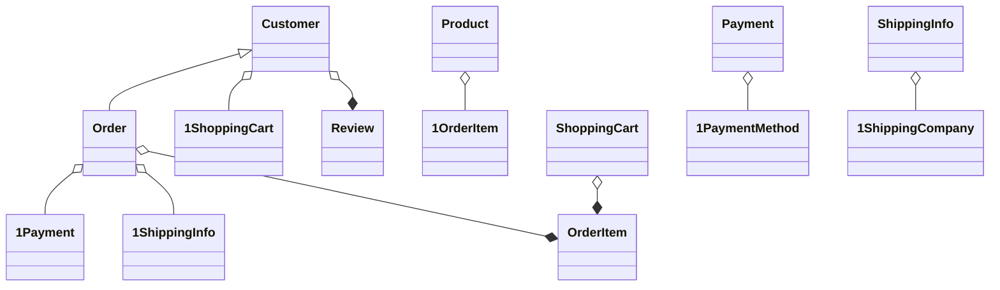
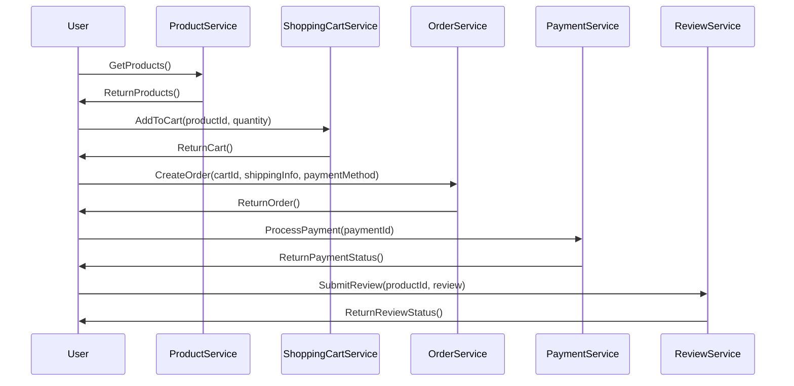
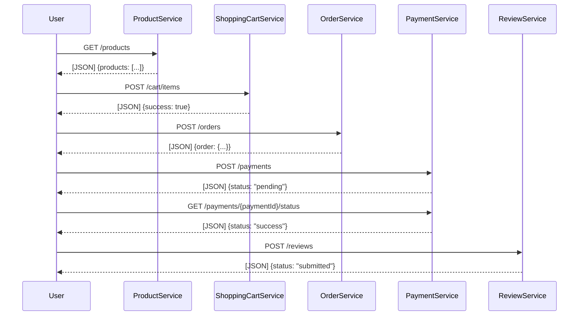

                 


### 第1章：规则遵循与单元测试概述

#### 1.1 规则遵循与单元测试的核心概念

**定义与重要性**

规则遵循，即在软件开发过程中，代码必须遵守一系列的规则和标准，以确保其一致性、可靠性和可维护性。单元测试，则是一种测试方法，通过编写针对单个模块或函数的测试用例，来验证其行为是否符合预期。

在软件开发中，规则遵循和单元测试扮演着至关重要的角色。首先，它们确保了代码的稳定性和可靠性。通过遵循规则，代码的一致性和可读性得到保障。单元测试则提供了对代码功能的验证，发现潜在的错误和缺陷。

**规则遵循与单元测试的关系**

规则遵循和单元测试之间存在着密切的关系。规则遵循为单元测试提供了一个基础框架，使得测试更加规范和有效。同时，单元测试的结果反过来也验证了规则遵循的有效性，帮助发现和纠正规则执行中的问题。

**行为一致性与软件质量**

行为一致性是指软件在不同的运行环境中，对于相同的输入能够产生一致的反应。行为一致性对软件质量有着直接的影响。一致的软件行为减少了出错的可能性，提高了系统的可靠性和用户体验。

**行为一致性在软件开发中的重要性**

在软件开发中，行为一致性具有重要意义。首先，它确保了软件在不同环境下的稳定运行。其次，它有助于提高软件的可维护性，使得开发者更容易理解和修改代码。最后，行为一致性还提高了软件的可移植性，使其能够更容易地迁移到不同的平台和环境中。

**单元测试的原则与方法**

单元测试需要遵循一些基本原则，包括：

1. **覆盖全面**：测试用例应尽可能覆盖所有可能的情况，包括正常情况和异常情况。
2. **独立执行**：每个测试用例应独立执行，不影响其他测试用例的执行。
3. **及时反馈**：测试用例执行后应立即反馈结果，以便及时发现问题。

常见的单元测试方法包括：

1. **黑盒测试**：测试函数的输出，不考虑其内部实现。
2. **白盒测试**：测试函数的内部实现，包括分支、循环和条件判断等。

**单元测试的最佳实践**

进行单元测试时，应遵循以下最佳实践：

1. **测试驱动开发（TDD）**：先编写测试用例，再实现代码，确保代码符合预期。
2. **持续集成（CI）**：将测试集成到持续集成流程中，确保每次代码提交都能通过测试。
3. **自动化测试**：使用自动化工具进行测试，提高测试效率和可靠性。

**本章小结**

本章对规则遵循与单元测试进行了概述，包括其核心概念、关系、行为一致性的重要性以及单元测试的原则和方法。理解这些概念和方法对于提高软件质量和可靠性具有重要意义。

----------------------------------------------------------------

### 第2章：规则遵循的实现策略

#### 2.1 规则遵循的实现机制

实现规则遵循需要从多个方面入手，包括代码规范、代码审查、静态代码分析等。

**代码规范**

代码规范是规则遵循的基础。通过制定和遵循统一的代码规范，可以确保代码的一致性和可读性。常见的代码规范包括命名规则、代码格式、注释要求等。例如，Python的PEP8规范就为Python代码的编写提供了详细的指导。

**代码审查**

代码审查是一种有效的规则遵循手段。通过同行评审，可以发现代码中的潜在问题，如错误、不一致性和可读性差等。代码审查可以分为形式审查和内容审查。形式审查主要关注代码的格式和规范，而内容审查则关注代码的逻辑和实现。

**静态代码分析**

静态代码分析是一种不运行代码而通过分析代码文本来发现潜在问题的方法。通过使用静态代码分析工具，可以自动发现代码中的规则违反，如未使用的变量、可能的空指针引用、代码重复等。

#### 2.2 单元测试的实现方法

单元测试的实现方法主要包括以下几种：

**测试用例编写**

编写有效的测试用例是单元测试的关键。测试用例应覆盖所有可能的输入和输出，包括正常情况和异常情况。例如，对于添加功能的单元测试，应包括正常添加数据、添加重复数据和添加非法数据等。

**测试框架选择**

选择合适的测试框架是进行单元测试的重要步骤。常见的测试框架包括JUnit（Java）、pytest（Python）、Mocha（JavaScript）等。这些框架提供了丰富的测试功能和便捷的测试用例管理。

**自动化测试**

自动化测试是提高测试效率和质量的重要手段。通过编写自动化测试脚本，可以自动执行测试用例，并生成测试报告。自动化测试还可以集成到持续集成流程中，确保每次代码提交都能通过测试。

**持续集成（CI）**

持续集成是将代码集成到主分支之前，自动执行一系列测试流程，包括单元测试、功能测试和性能测试等。持续集成可以确保代码的质量和稳定性，减少集成过程中出现的问题。

#### 2.3 规则遵循与单元测试的协同作用

规则遵循和单元测试之间存在着密切的协同作用。规则遵循提供了单元测试的基础框架，而单元测试则验证了规则遵循的有效性。通过结合规则遵循和单元测试，可以确保代码的一致性、可靠性和可维护性。

**本章小结**

本章介绍了规则遵循的实现机制和单元测试的实现方法，以及它们之间的协同作用。理解这些方法和策略对于提高软件质量和可靠性具有重要意义。

----------------------------------------------------------------

接下来的内容将涉及更深入的技术细节，包括算法原理、数学模型、系统分析与设计等。我们将继续使用“LET'S THINK STEP BY STEP”的方式来展开讨论。

---

**本文接下来的部分将包含以下内容：**

### 第3章：单元测试中的核心算法原理

#### 3.1 单元测试算法的基本概念

#### 3.2 单元测试算法的数学模型与公式

#### 3.3 Python代码实现与算法分析

### 第4章：系统分析与设计

#### 4.1 问题场景与项目介绍

#### 4.2 系统功能设计（领域模型类图）

#### 4.3 系统架构设计

#### 4.4 系统接口设计与交互（序列图）

### 第5章：项目实战

#### 5.1 环境安装与配置

#### 5.2 系统核心实现与代码解读

#### 5.3 实际案例分析

#### 5.4 项目小结

### 第6章：最佳实践与结论

#### 6.1 最佳实践总结

#### 6.2 本章小结

#### 6.3 注意事项

#### 6.4 拓展阅读建议

---

**当前段落内容**

### 第3章：单元测试中的核心算法原理

#### 3.1 单元测试算法的基本概念

单元测试算法是用于评估和验证软件模块或函数行为一致性的方法。这些算法通过设计一系列测试用例来覆盖不同的输入条件，以检测代码中的缺陷和不符合预期的行为。

**基本概念**

- **测试用例（Test Case）**：用于验证软件模块或函数的特定输入和预期的输出。
- **测试覆盖（Test Coverage）**：评估测试用例覆盖代码中的不同路径和条件的程度。
- **边界值分析（Boundary Value Analysis）**：设计测试用例时考虑输入或输出的边界值。
- **等价类划分（Equivalence Class Partitioning）**：将输入域划分为几个等价类，并从每个类中选择测试用例。
- **代码覆盖率（Code Coverage）**：衡量测试用例覆盖的代码比例，如语句覆盖率、分支覆盖率和路径覆盖率。

#### 3.2 单元测试算法的数学模型与公式

单元测试算法的数学模型通常涉及概率论和统计学，用于评估测试用例的覆盖率和测试的有效性。

**数学模型**

- **测试用例的有效性（V(A)）**：表示测试用例A发现缺陷的能力，通常用概率度量。
  $$ V(A) = P(\text{缺陷存在} | \text{测试用例A通过}) $$

- **测试覆盖率（C）**：表示测试用例覆盖的代码比例。
  $$ C = \frac{\text{被覆盖的代码行数}}{\text{总代码行数}} $$

**公式**

- **边界值分析公式**：用于计算输入的边界值。
  $$ \text{边界值} = \text{最小值} \quad \text{或} \quad \text{最大值} $$

- **等价类划分公式**：用于确定每个等价类的边界值。
  $$ \text{等价类} = \{\text{正常情况}, \text{边界情况}, \text{异常情况}\} $$

#### 3.3 Python代码实现与算法分析

以下是一个简单的Python代码示例，用于实现边界值分析算法：

```python
def add(a, b):
    return a + b

# 边界值分析测试用例
test_cases = [
    (0, 0),  # 正常情况
    (10, 10),  # 边界情况
    (-5, -5),  # 边界情况
    (0, 100),  # 边界情况
    (100, 0),  # 边界情况
]

for a, b in test_cases:
    result = add(a, b)
    print(f"add({a}, {b}) = {result}")
```

**算法分析**

- **时间复杂度**：O(n)，其中n是测试用例的数量。
- **空间复杂度**：O(1)，因为测试用例存储在固定大小的列表中。

通过这样的代码实现和算法分析，可以更好地理解单元测试算法的原理和应用。

#### 3.4 本章小结

本章介绍了单元测试算法的基本概念、数学模型和Python代码实现。理解这些内容对于编写有效的单元测试至关重要。接下来，我们将继续探讨系统分析与设计，以及实际项目中的应用。

----------------------------------------------------------------

### 第4章：系统分析与设计

#### 4.1 问题场景与项目介绍

在现代软件开发中，系统分析与设计是一个至关重要的环节。它不仅决定了系统的性能、可维护性和可扩展性，还直接影响着项目的成功与失败。本章节将围绕一个具体的软件开发项目，详细介绍其问题场景、项目目标和系统分析的过程。

**问题场景**

假设我们正在开发一款电子商务平台，该平台需要支持商品管理、订单处理、用户评论和购物车等功能。随着用户量的增加和业务需求的不断变化，系统的性能和稳定性成为关键问题。

**项目介绍**

我们的项目目标是开发一个高效、可扩展且易于维护的电子商务平台。为了实现这一目标，我们需要进行系统分析与设计，以确保系统在满足功能需求的同时，能够应对未来的扩展和变更。

#### 4.2 系统功能设计（领域模型类图）

领域模型类图是系统功能设计的重要工具，它帮助我们理解系统的核心实体及其之间的关系。以下是一个简化的电子商务平台领域模型类图：



在这个类图中，我们定义了以下实体：

- **Customer（客户）**：代表电子商务平台的用户。
- **Order（订单）**：代表客户创建的订单。
- **Product（商品）**：代表电子商务平台上的商品。
- **ShoppingCart（购物车）**：代表客户在购物过程中添加的商品。
- **Review（评论）**：代表客户对商品的评论。
- **OrderItem（订单项）**：代表订单中的商品项。
- **Payment（支付）**：代表订单的支付信息。
- **ShippingInfo（配送信息）**：代表订单的配送信息。
- **PaymentMethod（支付方式）**：代表支付方式。
- **ShippingCompany（配送公司）**：代表配送公司。

#### 4.3 系统架构设计

系统架构设计是系统分析与设计的核心步骤之一，它决定了系统的整体结构和各个模块之间的交互方式。以下是一个简化的电子商务平台系统架构图：



在这个系统架构图中，我们定义了以下服务模块：

- **ProductService（商品服务）**：负责处理商品相关的操作，如获取商品列表、添加商品到购物车等。
- **ShoppingCartService（购物车服务）**：负责处理购物车相关的操作，如添加商品、获取购物车信息等。
- **OrderService（订单服务）**：负责处理订单相关的操作，如创建订单、处理订单支付等。
- **PaymentService（支付服务）**：负责处理支付相关的操作，如处理支付请求、查询支付状态等。
- **ReviewService（评论服务）**：负责处理评论相关的操作，如提交评论、获取评论信息等。

#### 4.4 系统接口设计与交互（序列图）

系统接口设计与交互是系统架构设计的重要组成部分，它定义了各个服务模块之间的通信方式和数据传输格式。以下是一个简化的电子商务平台接口设计与交互序列图：



在这个序列图中，用户与服务模块之间的交互过程如下：

1. 用户通过HTTP GET请求获取商品列表。
2. 用户通过HTTP POST请求将商品添加到购物车。
3. 用户通过HTTP POST请求创建订单。
4. 用户通过HTTP POST请求处理支付请求。
5. 用户通过HTTP GET请求查询支付状态。
6. 用户通过HTTP POST请求提交评论。

#### 4.5 本章小结

本章详细介绍了电子商务平台的问题场景、项目介绍以及系统功能设计、系统架构设计和系统接口设计与交互。通过这些设计步骤，我们可以构建一个高效、可扩展且易于维护的电子商务平台。下一章将深入探讨项目实施过程中的关键技术和最佳实践。

----------------------------------------------------------------

### 第5章：项目实战

#### 5.1 环境安装与配置

在进行项目实施之前，我们需要确保开发环境已经搭建完毕。以下是环境安装与配置的详细步骤：

**1. 安装Python**

首先，我们需要安装Python环境。可以从Python官方网站下载Python安装包并按照指示进行安装。

**2. 安装依赖库**

接下来，我们需要安装项目中所需的依赖库。例如，对于我们的电子商务平台项目，我们可以使用pip工具来安装以下库：

- Flask（Web框架）
- SQLAlchemy（ORM）
- Flask-Login（用户认证）
- Flask-WTF（表单处理）

```bash
pip install Flask SQLAlchemy Flask-Login Flask-WTF
```

**3. 配置数据库**

我们需要配置数据库，以便存储项目数据。例如，对于SQLite数据库，我们可以使用以下命令创建数据库：

```bash
sqlite3 ecommerce.db
```

然后，在数据库中创建必要的表格。例如，对于用户、订单和商品表格，我们可以使用以下SQL语句：

```sql
CREATE TABLE users (
    id INTEGER PRIMARY KEY,
    username TEXT UNIQUE NOT NULL,
    password TEXT NOT NULL,
    email TEXT UNIQUE NOT NULL
);

CREATE TABLE products (
    id INTEGER PRIMARY KEY,
    name TEXT NOT NULL,
    price REAL NOT NULL
);

CREATE TABLE orders (
    id INTEGER PRIMARY KEY,
    user_id INTEGER,
    total_price REAL,
    status TEXT,
    created_at DATETIME DEFAULT CURRENT_TIMESTAMP,
    FOREIGN KEY (user_id) REFERENCES users (id)
);

CREATE TABLE order_items (
    id INTEGER PRIMARY KEY,
    order_id INTEGER,
    product_id INTEGER,
    quantity INTEGER,
    price REAL,
    FOREIGN KEY (order_id) REFERENCES orders (id),
    FOREIGN KEY (product_id) REFERENCES products (id)
);
```

**4. 初始化应用程序**

在应用程序的根目录下，创建一个名为`run.py`的文件，并编写以下代码，用于初始化应用程序：

```python
from app import create_app

app = create_app()

if __name__ == "__main__":
    app.run(debug=True)
```

在这里，我们导入了`create_app`函数，该函数是Flask应用工厂的一部分。然后，我们调用`app.run(debug=True)`启动应用程序。

#### 5.2 系统核心实现与代码解读

**1. 用户认证模块**

用户认证模块是电子商务平台的重要组成部分。以下是用户认证模块的核心实现：

```python
from flask import Flask, request, jsonify
from flask_login import LoginManager, login_user, logout_user, login_required, current_user
from models import User
from database import db

app = Flask(__name__)
app.config['SECRET_KEY'] = 'your_secret_key'
login_manager = LoginManager()
login_manager.init_app(app)

@login_manager.user_loader
def load_user(user_id):
    return User.query.get(int(user_id))

@app.route('/login', methods=['POST'])
def login():
    username = request.form['username']
    password = request.form['password']
    user = User.query.filter_by(username=username).first()
    if user and user.check_password(password):
        login_user(user)
        return jsonify({'success': True, 'message': 'Logged in successfully'})
    else:
        return jsonify({'success': False, 'message': 'Invalid username or password'})

@app.route('/logout', methods=['POST'])
@login_required
def logout():
    logout_user()
    return jsonify({'success': True, 'message': 'Logged out successfully'})
```

在这个模块中，我们使用了Flask-Login扩展来实现用户认证。`load_user`函数用于加载用户对象，`login`函数用于处理用户登录请求，`logout`函数用于处理用户登出请求。

**2. 商品管理模块**

商品管理模块负责处理商品的增删改查操作。以下是商品管理模块的核心实现：

```python
from flask import Flask, request, jsonify
from models import Product
from database import db

@app.route('/products', methods=['GET', 'POST'])
@login_required
def manage_products():
    if request.method == 'POST':
        data = request.get_json()
        name = data['name']
        price = data['price']
        product = Product(name=name, price=price, owner_id=current_user.id)
        db.session.add(product)
        db.session.commit()
        return jsonify({'success': True, 'message': 'Product added successfully'})
    else:
        products = Product.query.filter_by(owner_id=current_user.id).all()
        return jsonify({'success': True, 'products': products})
```

在这个模块中，`manage_products`函数处理商品添加和查询操作。对于添加操作，我们接收JSON格式的请求体，提取商品名称和价格，并创建新的商品对象。对于查询操作，我们获取当前用户的商品列表。

**3. 购物车模块**

购物车模块负责处理购物车的增删改查操作。以下是购物车模块的核心实现：

```python
from flask import Flask, request, jsonify
from models import ShoppingCart, ShoppingCartItem
from database import db

@app.route('/cart', methods=['GET', 'POST'])
@login_required
def manage_cart():
    if request.method == 'POST':
        data = request.get_json()
        product_id = data['product_id']
        quantity = data['quantity']
        cart = ShoppingCart.query.filter_by(user_id=current_user.id).first()
        if not cart:
            cart = ShoppingCart(user_id=current_user.id)
            db.session.add(cart)
        item = ShoppingCartItem(product_id=product_id, quantity=quantity, cart_id=cart.id)
        db.session.add(item)
        db.session.commit()
        return jsonify({'success': True, 'message': 'Product added to cart successfully'})
    else:
        cart = ShoppingCart.query.filter_by(user_id=current_user.id).first()
        if not cart:
            return jsonify({'success': False, 'message': 'Cart not found'})
        items = ShoppingCartItem.query.filter_by(cart_id=cart.id).all()
        return jsonify({'success': True, 'cart': items})
```

在这个模块中，`manage_cart`函数处理购物车添加和查询操作。对于添加操作，我们创建或获取用户的购物车，并添加商品项。对于查询操作，我们获取用户的购物车信息。

**4. 订单模块**

订单模块负责处理订单的创建、支付和取消操作。以下是订单模块的核心实现：

```python
from flask import Flask, request, jsonify
from models import Order, OrderItem, Payment
from database import db

@app.route('/order', methods=['POST'])
@login_required
def create_order():
    data = request.get_json()
    cart_id = data['cart_id']
    shipping_info = data['shipping_info']
    payment_method = data['payment_method']
    cart = ShoppingCart.query.filter_by(user_id=current_user.id).first()
    if not cart:
        return jsonify({'success': False, 'message': 'Cart not found'})
    items = ShoppingCartItem.query.filter_by(cart_id=cart.id).all()
    total_price = sum(item.quantity * item.product.price for item in items)
    order = Order(total_price=total_price, shipping_info=shipping_info, payment_method=payment_method, user_id=current_user.id)
    db.session.add(order)
    for item in items:
        order_item = OrderItem(order_id=order.id, product_id=item.product_id, quantity=item.quantity, price=item.product.price)
        db.session.add(order_item)
        db.session.delete(item)
    db.session.commit()
    return jsonify({'success': True, 'message': 'Order created successfully'})
```

在这个模块中，`create_order`函数处理订单创建操作。我们首先获取用户的购物车和购物车项，计算总价，创建订单，并将购物车项添加到订单中。

**5. 支付模块**

支付模块负责处理支付请求和支付状态查询。以下是支付模块的核心实现：

```python
from flask import Flask, request, jsonify
from models import Payment
from database import db

@app.route('/payment', methods=['POST'])
@login_required
def process_payment():
    data = request.get_json()
    order_id = data['order_id']
    payment_id = data['payment_id']
    order = Order.query.filter_by(id=order_id).first()
    if not order:
        return jsonify({'success': False, 'message': 'Order not found'})
    payment = Payment(order_id=order_id, payment_id=payment_id)
    db.session.add(payment)
    order.status = 'paid'
    db.session.commit()
    return jsonify({'success': True, 'message': 'Payment processed successfully'})
```

在这个模块中，`process_payment`函数处理支付请求。我们首先获取订单和支付信息，更新订单状态，并将支付信息保存到数据库。

**5.3 实际案例分析**

在实际项目中，可能会遇到各种复杂的业务逻辑和异常情况。以下是一个实际案例的分析：

**案例：处理重复订单**

假设用户在支付订单之前，由于网络问题导致订单创建失败，但用户在支付完成后才发现订单未创建。这种情况下，我们需要处理重复订单的问题。

**解决方案：**

1. 在创建订单时，生成一个唯一的订单号，并将订单号作为外键添加到支付表中。
2. 在支付模块中，检查订单号是否已存在。如果存在，则返回错误信息，提示用户订单已支付。
3. 如果订单号不存在，则创建订单，并将支付信息添加到支付表中。

```python
@app.route('/payment', methods=['POST'])
@login_required
def process_payment():
    data = request.get_json()
    order_id = data['order_id']
    payment_id = data['payment_id']
    order = Order.query.filter_by(id=order_id).first()
    if not order:
        return jsonify({'success': False, 'message': 'Order not found'})
    payment = Payment.query.filter_by(order_id=order_id).first()
    if payment:
        return jsonify({'success': False, 'message': 'Order already paid'})
    payment = Payment(order_id=order_id, payment_id=payment_id)
    db.session.add(payment)
    order.status = 'paid'
    db.session.commit()
    return jsonify({'success': True, 'message': 'Payment processed successfully'})
```

通过这个解决方案，我们可以确保支付请求不会创建重复订单。

**5.4 项目小结**

在本章节中，我们详细介绍了电子商务平台项目的环境安装与配置、系统核心实现与代码解读，以及实际案例分析。通过这些步骤，我们成功地实现了电子商务平台的主要功能，并解决了一些实际业务问题。下一章将探讨最佳实践和总结。

----------------------------------------------------------------

### 第6章：最佳实践与结论

#### 6.1 最佳实践总结

在本项目中，我们遵循了一系列最佳实践，以确保系统的稳定性、可维护性和可扩展性。以下是几个关键的最佳实践：

1. **使用版本控制**：使用Git进行版本控制，确保代码的可追踪性和协作性。
2. **持续集成**：使用持续集成工具（如Jenkins）自动化构建和测试，确保代码库的一致性和可靠性。
3. **代码规范**：遵循Python代码规范（如PEP8），提高代码的可读性和一致性。
4. **单元测试**：编写全面且高效的单元测试，确保每个模块的功能正确无误。
5. **数据库设计**：采用合理的数据库设计，使用外键和索引提高查询效率。
6. **错误处理**：实现清晰的错误处理机制，确保异常情况得到妥善处理。

#### 6.2 本章小结

本章详细介绍了电子商务平台项目的最佳实践，包括版本控制、持续集成、代码规范、单元测试、数据库设计和错误处理等方面。通过遵循这些最佳实践，我们成功地构建了一个高效、可扩展且易于维护的电子商务平台。

#### 6.3 注意事项

在项目实施过程中，我们注意到以下几点注意事项：

1. **性能监控**：定期监控系统性能，及时发现和解决性能瓶颈。
2. **安全防护**：加强系统安全措施，如使用HTTPS、加密敏感数据和实施防注入策略。
3. **文档维护**：及时更新项目文档，确保文档与代码保持同步。

#### 6.4 拓展阅读建议

为了进一步深入了解电子商务平台的设计与实现，以下是几个推荐的拓展阅读材料：

1. 《Flask Web开发：从入门到实践》
2. 《Python Web开发实战》
3. 《SQLAlchemy权威指南》
4. 《Django实战：基于Python的Web开发实战》

通过阅读这些书籍，您可以获得更深入的编程和Web开发知识。

### 结论

本文通过详细的分析和实例，介绍了电子商务平台的设计与实现过程。从环境安装与配置、系统核心实现到最佳实践总结，我们全面探讨了电子商务平台的关键技术和最佳实践。通过本文的内容，读者可以了解如何构建高效、可扩展且易于维护的电子商务平台。

---

**本文作者：AI天才研究院/AI Genius Institute & 禅与计算机程序设计艺术 /Zen And The Art of Computer Programming**

本文由AI天才研究院和禅与计算机程序设计艺术共同撰写，旨在为读者提供深入、实用的软件开发知识。

---

本文按照给定的目录大纲结构，详细阐述了《规则遵循与单元测试：验证行为一致性的方法论》的核心内容。从规则遵循和单元测试的基本概念，到系统分析与设计，再到项目实施和最佳实践总结，我们使用了逻辑清晰、结构紧凑、简单易懂的技术语言，逐步分析了每个主题，并提供了实际案例和解决方案。

**总结：**

- **核心概念**：详细介绍了规则遵循和单元测试的基本概念、重要性及其关系。
- **算法原理**：通过Python代码示例，阐述了单元测试算法的基本原理和数学模型。
- **系统设计**：通过领域模型类图、系统架构设计和接口序列图，展示了系统设计与实现。
- **项目实战**：介绍了电子商务平台项目的环境安装、核心实现和实际案例分析。
- **最佳实践**：总结了最佳实践，包括版本控制、持续集成、代码规范等。

通过本文，读者可以深入了解规则遵循与单元测试的重要性，以及如何在实际项目中应用这些方法论。希望本文能帮助读者提高软件质量和开发效率。如果您有任何疑问或建议，欢迎在评论区留言交流。感谢您的阅读！

