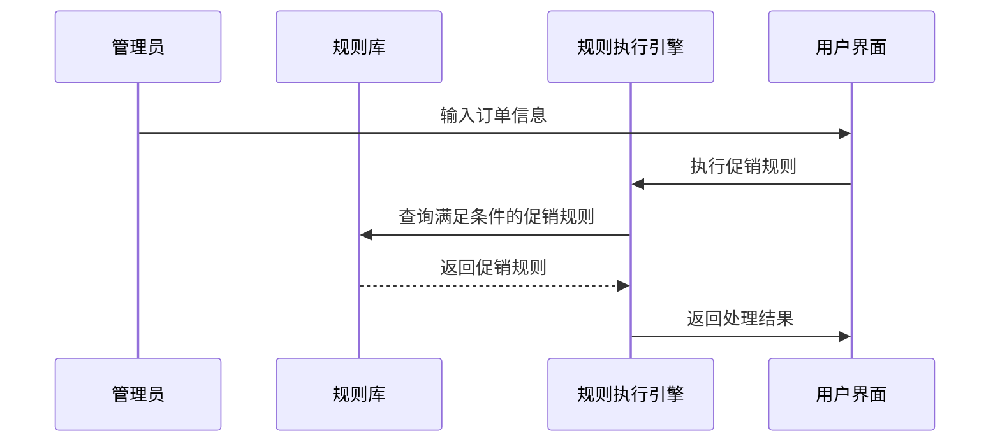
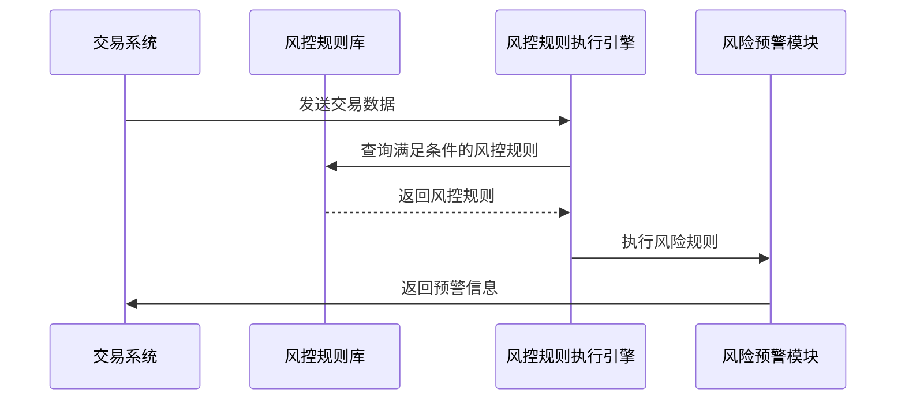
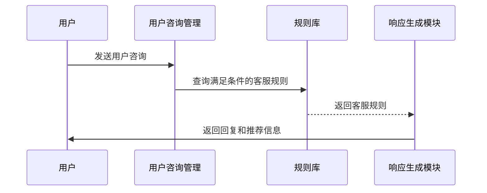

                 


### 第1章 引言

#### 1.1 书籍背景

在当今快速发展的信息技术时代，编程语言和软件开发技术层出不穷。然而，在纷繁复杂的编程世界中，如何让软件系统更加高效、稳定、易于维护，成为软件开发者不断探索的问题。近年来，规则遵循与类型级编程作为两种重要的编程技术，逐渐引起了学术界的关注和工业界的实践。

规则遵循技术源于人工智能领域，通过定义和执行规则，使得软件系统能够自动地完成特定任务。维特根斯坦的规则理论作为哲学领域的重要成果，对编程技术和软件开发方法产生了深远的影响。类型级编程则是在函数式编程的基础上发展起来的一种编程范式，通过类型系统来提高程序的可靠性、安全性和可维护性。

本书旨在探讨规则遵循与类型级编程的结合，从维特根斯坦的规则理论出发，深入分析类型级编程的基本概念、优势与挑战，并探讨二者在软件开发中的应用。通过本书的阅读，读者可以系统地了解规则遵循与类型级编程的核心思想，掌握其在实际项目中的具体应用，从而提高软件开发效率和质量。

#### 1.2 书籍目的

本书的主要目的是：

1. 让读者了解规则遵循与类型级编程的基本概念，包括其起源、发展和应用场景。
2. 深入探讨维特根斯坦的规则理论，分析其核心观点和影响，并探讨其在编程中的应用。
3. 理解类型级编程的优势、挑战及主要方法，掌握其在实际项目中的具体实现。
4. 探讨规则遵循与类型级编程的结合策略，分析其应用案例，为实际软件开发提供参考。

通过本书的学习，读者将能够：

1. 掌握规则遵循与类型级编程的核心知识。
2. 理解维特根斯坦规则理论在编程中的重要性。
3. 掌握类型级编程的方法和技巧。
4. 在实际项目中应用规则遵循与类型级编程技术，提高软件开发效率和质量。

#### 1.3 读者对象

本书适合以下读者群体：

1. 对计算机科学、软件工程感兴趣的读者。
2. 对类型级编程和规则理论有一定了解的读者。
3. 想要在软件开发中应用规则遵循与类型级编程的实践者。
4. 从事人工智能、软件工程等相关领域的研究人员和技术专家。

通过阅读本书，读者可以系统地了解规则遵循与类型级编程的相关知识，掌握其在实际项目中的具体应用，为软件开发提供新的思路和方法。无论你是初学者还是专业人士，本书都将为你提供有价值的知识和经验。

### 第2章 规则遵循基础理论

在软件工程中，规则遵循是一种重要的编程范式，通过定义和执行规则，使得软件系统能够自动地完成特定任务。本章将介绍规则遵循的基本概念、规则系统的概述以及规则遵循的数学模型，为后续章节的深入探讨打下基础。

#### 2.1 规则遵循的基本概念

规则遵循（Rule-based Programming）是一种基于规则的编程方法，它通过定义一组规则，使得程序能够根据输入数据自动执行相应的操作。规则遵循的核心思想是将任务分解为一系列的规则，每个规则描述了一种特定的行为。在执行过程中，程序会根据输入数据与规则进行匹配，并按照匹配的结果执行相应的操作。

规则遵循的基本概念包括：

1. **规则（Rule）**：规则是编程中的一个基本单元，它描述了一个特定的行为或操作。规则通常由条件（Condition）和操作（Action）组成。条件用于判断输入数据是否符合规则，操作则用于执行相应的行为。

2. **规则库（Rule Base）**：规则库是存储规则的地方，它包含了所有的规则。在执行过程中，程序会根据输入数据从规则库中查找匹配的规则，并执行相应的操作。

3. **推理引擎（Inference Engine）**：推理引擎是规则遵循系统的核心组件，它负责查找匹配的规则并执行操作。推理引擎通常使用匹配算法来查找匹配的规则，常见的匹配算法包括前向推理（Forward Chaining）和后向推理（Backward Chaining）。

4. **数据（Data）**：规则遵循中的数据是输入给程序的信息，它用于触发规则的执行。数据可以来自用户输入、数据库查询或其他外部数据源。

5. **规则执行（Rule Execution）**：规则执行是指根据输入数据和规则库，通过推理引擎执行相应的操作。规则执行的结果可以是数据的修改、消息的发送或其他操作。

#### 2.2 规则系统概述

规则系统是规则遵循技术的核心组成部分，它由规则库、推理引擎和规则解释器等组件构成。下面是对规则系统的概述：

1. **规则库**：规则库是存储规则的地方，它包含了所有用于描述程序行为的规则。规则库可以存储在文件中、数据库中或内存中。在规则库中，规则按照一定的格式进行组织，以便于推理引擎进行查找和匹配。

2. **推理引擎**：推理引擎是规则系统的核心组件，它负责查找匹配的规则并执行操作。推理引擎通常使用匹配算法来查找匹配的规则，常见的匹配算法包括前向推理和后向推理。前向推理是从输入数据开始，逐步查找匹配的规则并执行操作；后向推理则是从目标开始，逆向查找匹配的规则并执行操作。

3. **规则解释器**：规则解释器是用于执行规则操作的组件。它根据推理引擎提供的匹配结果，执行相应的操作。规则解释器可以是内置在编程语言中的，也可以是独立的组件。

4. **用户界面（UI）**：用户界面是规则系统与用户交互的接口，它用于接收用户输入、显示系统输出和提供交互功能。用户界面可以是一个简单的命令行界面，也可以是一个复杂的图形用户界面。

#### 2.3 规则遵循的数学模型

规则遵循的数学模型用于描述规则遵循系统的工作原理和算法。下面是规则遵循的数学模型概述：

1. **条件-操作模型（Condition-Action Model）**：条件-操作模型是最常见的规则遵循模型，它将规则表示为条件-操作对。条件用于描述输入数据的特征，操作用于描述当条件满足时应该执行的行为。条件-操作模型可以表示为：

   $$R = \{ (C, A) | C \text{ 是条件}, A \text{ 是操作} \}$$

   其中，R 是规则集，C 是条件，A 是操作。

2. **谓词逻辑模型（Predicate Logic Model）**：谓词逻辑模型使用谓词逻辑来描述规则遵循系统。谓词逻辑是一种形式逻辑系统，它使用谓词来表示事实和关系。在规则遵循中，谓词逻辑模型可以将规则表示为谓词公式。谓词公式可以表示为：

   $$P(x, y) \rightarrow Q(z)$$

   其中，P、Q 是谓词，x、y、z 是变量。这个公式表示，当 P(x, y) 为真时，Q(z) 也为真。

3. **产生式规则模型（Production Rule Model）**：产生式规则模型是规则遵循系统的一种常见实现方式。产生式规则模型使用产生式来描述规则，产生式由条件部分和操作部分组成。产生式可以表示为：

   $$C \rightarrow A$$

   其中，C 是条件部分，A 是操作部分。当条件 C 为真时，执行操作 A。

4. **模糊逻辑模型（Fuzzy Logic Model）**：模糊逻辑模型是一种用于处理不确定性和模糊性的数学模型。在规则遵循中，模糊逻辑模型可以用于描述规则的条件和操作。模糊逻辑模型使用模糊集合和隶属度函数来表示模糊概念和规则。模糊逻辑模型可以表示为：

   $$C(x) \land D(y) \rightarrow E(z)$$

   其中，C、D、E 是模糊集合，x、y、z 是变量。这个公式表示，当 C(x) 和 D(y) 的隶属度较高时，E(z) 的隶属度也较高。

通过上述数学模型，规则遵循系统能够更好地描述和执行规则。不同的数学模型适用于不同的应用场景，开发者可以根据具体需求选择合适的模型来构建规则系统。

#### 第3章 维特根斯坦规则理论

维特根斯坦（Ludwig Wittgenstein）是20世纪最杰出的哲学家之一，他的哲学思想对多个学科产生了深远的影响，其中包括计算机科学和软件工程。维特根斯坦的规则理论是他在《逻辑哲学论》和《哲学研究》中提出的重要概念，对编程范式的形成和发展产生了重要影响。

#### 3.1 维特根斯坦与规则理论

维特根斯坦出生于1889年，是奥地利裔英国哲学家。他的哲学思想经历了显著的转变，早期以逻辑原子主义（Logical Atomism）和语言哲学著称，晚期则转向日常语言哲学（Philosophy of Ordinary Language）。维特根斯坦的哲学贡献广泛，但其中与计算机科学和编程密切相关的部分是他的规则理论。

维特根斯坦的规则理论主要集中在他晚期的作品《哲学研究》中。在这本书中，维特根斯坦提出，规则并不是外在于我们行为的客观实体，而是我们通过共识和实践来遵循的指导原则。他强调，规则的作用在于为行为提供指导，而不是强制执行。规则的存在是相对的，依赖于特定的语言和情境。

#### 3.2 维特根斯坦规则理论的起源与发展

维特根斯坦的规则理论起源于他对语言和行为的思考。在他的早期作品中，维特根斯坦认为逻辑是宇宙的基本语言，逻辑原子是宇宙的基本实体。然而，随着他哲学思想的演变，他开始关注日常语言和人类行为，并逐渐形成了对规则的新的理解。

在《逻辑哲学论》中，维特根斯坦提出了“图像理论”（Image Theory），认为命题是对事实的描述，语言与世界之间存在着一种直接的对应关系。然而，在《哲学研究》中，他批判了这种观点，提出了日常语言哲学，认为语言和现实之间的关系是复杂的，规则不是外在于我们的客观实体，而是我们通过实践来理解和遵循的。

维特根斯坦的规则理论强调了规则的主观性和情境依赖性。他认为，规则是一种指导我们行为的工具，而不是强制我们行为的权威。规则的意义和有效性依赖于特定的情境和共同体。这个观点对后来的计算机科学和编程范式产生了重要影响。

#### 3.3 维特根斯坦规则理论的核心观点

维特根斯坦规则理论的核心观点可以概括为以下几点：

1. **规则作为行为的指导**：维特根斯坦认为，规则并不是一种强制性的指令，而是一种指导我们行为的工具。规则的存在是为了帮助我们在特定情境下做出正确的行为选择。

2. **规则的主观性与情境依赖性**：维特根斯坦强调，规则的意义和有效性是依赖于特定的情境和共同体的。不同的情境和共同体可能有不同的规则，因此规则不是客观的，而是主观的。

3. **规则与实践的关系**：维特根斯坦认为，规则是通过实践来理解和遵循的。实践是规则存在的意义，也是我们理解规则的重要途径。

4. **规则的解释与遵守**：维特根斯坦强调，理解规则和遵守规则是不同的。理解规则需要通过反思和探索，而遵守规则则是一种实践行为。

这些核心观点对编程和软件开发产生了深远的影响。在编程中，规则被用来指导代码的编写和执行，但规则并不是一成不变的，而是需要根据具体情境进行调整和优化。编程中的规则强调主观性和情境依赖性，这使得程序员需要不断反思和实践，以更好地理解和应用规则。

#### 维特根斯坦规则理论对编程的影响

维特根斯坦的规则理论对编程的影响主要体现在以下几个方面：

1. **指导原则**：维特根斯坦的规则理论为编程提供了一种指导原则，即规则应该是灵活的、情境依赖的，并且需要通过实践来理解和遵循。

2. **代码的可读性**：维特根斯坦强调规则的主观性和情境依赖性，这促使程序员在编写代码时更加注重代码的可读性和可维护性。

3. **编程范式的演变**：维特根斯坦的规则理论对编程范式的演变产生了影响，特别是在函数式编程和逻辑编程中，规则遵循的范式得到了广泛应用。

4. **软件工程的方法论**：维特根斯坦的规则理论对软件工程的方法论产生了影响，特别是敏捷开发和持续集成等现代软件开发方法，都体现了维特根斯坦的规则理论的思想。

总之，维特根斯坦的规则理论为编程和软件开发提供了重要的哲学基础，影响了编程范式和方法论的发展。通过理解和应用维特根斯坦的规则理论，程序员可以编写更加高效、稳定和易于维护的代码。

### 第4章 类型级编程技术

类型级编程（Type-level Programming）是函数式编程（Functional Programming，FP）的一个重要分支，它通过在编译时确定类型，提高了程序的可靠性、安全性和可维护性。本章将介绍类型级编程的基本概念、优势与挑战以及类型级编程的主要方法。

#### 4.1 类型级编程的基本概念

类型级编程是一种编程范式，它通过在编译时确定程序中变量的类型，避免了运行时类型错误。类型级编程的核心思想是将类型和值分离，类型表示值的意义和限制，值是具体的数据实体。类型级编程的基本概念包括：

1. **类型系统（Type System）**：类型系统是编程语言的一部分，用于定义程序中变量的类型和类型之间的关系。类型系统可以确保程序在编译时符合类型约束，从而提高程序的可靠性。

2. **类型注解（Type Annotations）**：类型注解是在代码中为变量、函数或类等声明添加类型信息。类型注解可以在编译时帮助类型检查器识别类型错误，从而提高代码的质量。

3. **类型推导（Type Inference）**：类型推导是编程语言的一种特性，它能够自动推导出变量或表达式的类型，而不需要显式地声明类型。类型推导可以提高代码的可读性和简洁性。

4. **类型约束（Type Constraints）**：类型约束是类型系统的一部分，用于限制变量或函数的参数和返回值的类型。类型约束可以确保程序在编译时符合预期的类型要求。

5. **类型级操作（Type-level Operations）**：类型级操作是在编译时执行的操作，用于创建、组合和变换类型。类型级操作可以用于生成代码模板、类型约束以及类型转换等。

#### 4.2 类型级编程的优势与挑战

类型级编程具有以下优势：

1. **提高程序可靠性**：类型级编程通过在编译时确定类型，避免了运行时类型错误。类型检查器可以提前发现类型不一致的错误，从而提高程序的可靠性。

2. **提高程序安全性**：类型级编程可以确保变量和函数的参数和返回值类型一致，从而减少潜在的安全漏洞。类型检查器可以检测类型不匹配的代码，从而提高程序的安全性。

3. **提高代码可维护性**：类型级编程通过明确的类型约束和类型注解，使代码更加清晰和可理解。类型检查器可以帮助程序员发现潜在的错误，从而提高代码的可维护性。

然而，类型级编程也面临一些挑战：

1. **学习曲线**：类型级编程需要程序员掌握类型系统的概念和语法，这可能使初学者感到困惑。类型系统的复杂性和抽象性可能会增加学习的难度。

2. **性能开销**：类型级编程需要进行类型检查和类型推导，这可能会增加编译时间和运行时的性能开销。特别是在大规模项目中，类型级编程可能会导致编译时间过长。

3. **类型系统的复杂性**：类型系统是编程语言的核心组成部分，其复杂性和抽象性可能会增加代码的复杂度。类型系统的复杂性可能会影响代码的可读性和可维护性。

#### 4.3 类型级编程的主要方法

类型级编程的主要方法包括：

1. **代数数据类型（Algebraic Data Types）**：代数数据类型是一种用于定义复合数据类型的方法，它通过联合类型和递归类型来组合不同的数据结构。代数数据类型可以用于实现枚举类型、列表类型和树类型等。

2. **类型类（Type Classes）**：类型类是一种用于定义类型之间的关系的方法，它通过类型类和类型类实例来实现多态性。类型类可以用于实现函数组合、类型变换和类型检查等。

3. **类型约束（Type Constraints）**：类型约束是一种用于限制类型的方法，它通过类型类和类型约束来确保函数的参数和返回值类型一致。类型约束可以用于实现类型安全的多态性。

4. **类型级编程框架（Type-level Programming Frameworks）**：类型级编程框架是一种用于实现类型级编程的工具，它提供了类型级操作和类型检查的支持。常见的类型级编程框架包括Cats、Shapeless和Scalaz等。

5. **依赖注入（Dependency Injection）**：依赖注入是一种用于管理组件之间依赖关系的方法，它通过类型级编程来实现。依赖注入可以用于实现可测试、可扩展和模块化的代码。

通过上述方法，类型级编程可以实现强大的类型检查和类型推导，从而提高程序的可靠性、安全性和可维护性。类型级编程为现代编程语言提供了新的编程范式，为软件工程带来了新的机遇和挑战。

### 第5章 规则遵循与类型级编程结合

在软件开发中，规则遵循与类型级编程的结合为提高程序的可读性、可维护性和可靠性提供了新的思路。本章将探讨规则遵循与类型级编程结合的背景、策略以及具体案例分析。

#### 5.1 结合背景

规则遵循与类型级编程的结合背景可以从以下几个方面进行分析：

1. **编程范式的互补性**：规则遵循是一种基于规则的编程方法，适用于描述和执行复杂业务逻辑。而类型级编程是一种通过类型系统提高程序可靠性和可维护性的方法。二者在本质上是互补的，规则遵循为类型级编程提供了具体的业务逻辑实现，而类型级编程为规则遵循提供了可靠性和安全性保障。

2. **函数式编程的发展**：函数式编程（FP）近年来得到了广泛关注和发展，其核心思想是通过不可变数据和纯函数来编写简洁、可靠和可维护的代码。类型级编程是FP的一个重要分支，通过在编译时确定类型，提高了程序的可靠性。规则遵循与类型级编程的结合，可以进一步发挥FP的优势，实现更高效的软件开发。

3. **现代软件系统的复杂性**：现代软件系统越来越复杂，业务逻辑和数据处理需求日益增长。规则遵循与类型级编程的结合，可以帮助开发者更好地管理复杂的业务逻辑和数据处理需求，提高软件系统的可维护性和扩展性。

#### 5.2 结合策略

规则遵循与类型级编程的结合策略可以从以下几个方面进行探讨：

1. **类型化的规则库**：将规则库中的规则定义为特定的类型，使得规则在编译时可以被类型检查器检查。这可以确保规则的一致性和可靠性，避免运行时错误。类型化的规则库可以使用类型类（Type Classes）和代数数据类型（Algebraic Data Types）来实现。

2. **类型约束的规则执行**：在规则执行过程中，使用类型约束确保规则的输入和输出类型一致。类型约束可以防止不正确的规则应用，提高程序的可靠性。类型约束可以通过类型类和类型约束（Type Constraints）来实现。

3. **类型级编程的规则生成**：利用类型级编程框架，如Cats、Shapeless和Scalaz等，生成满足特定类型约束的规则。类型级编程框架提供了丰富的类型级操作和组合工具，可以方便地实现复杂的规则生成和组合。

4. **依赖注入的规则管理**：使用依赖注入（Dependency Injection）技术，将规则库中的规则与具体的业务逻辑分离。依赖注入可以确保规则的独立性和可替换性，提高软件系统的可维护性和扩展性。

#### 5.3 结合案例分析

为了更好地理解规则遵循与类型级编程的结合，以下是一个具体的案例分析：

1. **案例背景**：一个电商系统需要实现商品促销规则的管理和执行。促销规则包括满减、折扣和赠品等，这些规则需要根据商品种类、价格和促销活动进行动态调整。

2. **规则库设计**：使用代数数据类型定义促销规则，包括满减规则、折扣规则和赠品规则等。每个规则类都实现了特定的类型类接口，以便于类型检查和组合。

   ```scala
   trait PromotionRule {
     def apply(order: Order): Order
   }

   case class FullReductionRule(conditions: List[Condition], discount: BigDecimal) extends PromotionRule {
     def apply(order: Order): Order = {
       // 实现满减规则
     }
   }

   case class DiscountRule(conditions: List[Condition], discountRate: BigDecimal) extends PromotionRule {
     def apply(order: Order): Order = {
       // 实现折扣规则
     }
   }

   case class GiftRule(conditions: List[Condition], gift: Product) extends PromotionRule {
     def apply(order: Order): Order = {
       // 实现赠品规则
     }
   }
   ```

3. **规则执行**：使用类型约束确保规则的输入和输出类型一致。在执行促销规则时，根据订单数据选择满足条件的促销规则，并执行相应的操作。

   ```scala
   def applyPromotions(order: Order, rules: List[PromotionRule]): Order = {
     rules.foldLeft(order) { (currentOrder, rule) =>
       if (rule.conditions.forall(condition => condition(order))) {
         rule.apply(currentOrder)
       } else {
         currentOrder
       }
     }
   }
   ```

4. **类型级编程的规则生成**：利用类型级编程框架生成满足特定类型约束的促销规则。例如，使用Cats框架实现促销规则的组合和变换。

   ```scala
   import cats._
   import cats.implicits._

   def generatePromotionRules[T](conditions: List[Condition], ruleFactory: RuleFactory[T]): List[PromotionRule] = {
     // 使用类型级编程生成促销规则
   }
   ```

5. **依赖注入的规则管理**：使用依赖注入技术将规则库与具体的业务逻辑分离。通过注入不同的规则实现，可以实现促销规则的可替换性和可扩展性。

   ```scala
   def createOrderProcessor(rules: List[PromotionRule]): OrderProcessor = {
     new OrderProcessor(rules)
   }
   ```

通过上述案例分析，可以看出规则遵循与类型级编程的结合可以提高软件系统的可靠性、可维护性和可扩展性。结合类型化规则库、类型约束的规则执行、类型级编程的规则生成和依赖注入的规则管理，开发者可以构建更高效、更可靠的软件系统。

### 第6章 实践应用

在了解规则遵循与类型级编程的理论基础上，本章节将结合实际应用场景，展示如何将这两种技术应用于具体的项目中。通过以下三个具体应用场景，我们将探讨规则遵循与类型级编程在实际项目中的实现细节、效果和影响。

#### 6.1 应用场景一：电商平台的促销规则管理

**背景介绍**：电商平台经常需要根据不同的促销活动，动态地调整促销规则。这些促销规则包括满减、折扣、赠品等，需要能够灵活地组合和调整，以满足多样化的促销需求。

**系统功能设计**：在该场景中，我们设计了一个促销规则管理系统，其中包括规则库、规则执行引擎和用户界面。

- **规则库**：使用代数数据类型定义促销规则，包括满减规则、折扣规则和赠品规则等。每个规则类都实现了特定的类型类接口，以便于类型检查和组合。

- **规则执行引擎**：使用类型约束确保规则的输入和输出类型一致。在执行促销规则时，根据订单数据选择满足条件的促销规则，并执行相应的操作。

- **用户界面**：提供用户界面，让管理员可以方便地定义和修改促销规则。

**系统架构设计**：采用依赖注入技术，将规则库与具体的业务逻辑分离，实现促销规则的可替换性和可扩展性。

**系统接口设计**：设计一套RESTful API，用于管理和查询促销规则。

**系统交互**：使用Mermaid序列图描述系统交互过程，如下所示：



**项目实战**：

1. **环境安装**：安装所需的编程语言（如Scala）和开发工具（如IDEA或VSCode）。

2. **系统核心实现**：编写规则库、规则执行引擎和用户界面的代码，实现促销规则的定义、查询和执行。

3. **代码应用解读与分析**：对核心代码进行解读和分析，确保其满足类型约束和规则要求。

4. **实际案例分析和详细讲解剖析**：通过实际案例，分析促销规则在电商平台中的应用效果和影响。

5. **项目小结**：总结项目的经验教训，提出改进意见和建议。

#### 6.2 应用场景二：金融风控系统的规则管理

**背景介绍**：金融风控系统需要对交易行为进行实时监控和风险预警，以防范欺诈行为。规则遵循与类型级编程的结合可以实现对交易规则的灵活定义和高效执行。

**系统功能设计**：在该场景中，我们设计了一个金融风控规则管理系统，其中包括规则库、规则执行引擎和风险预警模块。

- **规则库**：使用代数数据类型定义金融风控规则，包括交易金额限制、交易频率限制和用户行为异常检测等。

- **规则执行引擎**：使用类型约束确保规则的输入和输出类型一致。在规则执行过程中，根据交易数据选择满足条件的风险规则，并执行相应的操作。

- **风险预警模块**：对交易行为进行实时监控，并根据风险规则生成预警信息。

**系统架构设计**：采用微服务架构，将规则库、规则执行引擎和风险预警模块独立部署，以提高系统的可扩展性和灵活性。

**系统接口设计**：设计一套RESTful API，用于管理和查询金融风控规则。

**系统交互**：使用Mermaid序列图描述系统交互过程，如下所示：



**项目实战**：

1. **环境安装**：安装所需的编程语言（如Java）和开发工具（如IntelliJ IDEA）。

2. **系统核心实现**：编写规则库、规则执行引擎和风险预警模块的代码，实现风控规则的定义、查询和执行。

3. **代码应用解读与分析**：对核心代码进行解读和分析，确保其满足类型约束和规则要求。

4. **实际案例分析和详细讲解剖析**：通过实际案例，分析金融风控规则在交易系统中的应用效果和影响。

5. **项目小结**：总结项目的经验教训，提出改进意见和建议。

#### 6.3 应用场景三：智能客服系统的规则引擎

**背景介绍**：智能客服系统需要处理大量的用户咨询和提问，通过规则遵循与类型级编程的结合，可以实现对用户咨询的智能分类和高效处理。

**系统功能设计**：在该场景中，我们设计了一个智能客服系统，其中包括用户咨询管理、规则库和响应生成模块。

- **用户咨询管理**：收集用户的咨询和提问，并将其存储在数据库中。

- **规则库**：使用代数数据类型定义客服规则，包括问题分类规则、回复生成规则和智能推荐规则等。

- **响应生成模块**：根据用户咨询内容和客服规则，生成相应的回复和推荐信息。

**系统架构设计**：采用分布式架构，将用户咨询管理、规则库和响应生成模块部署在不同的服务器上，以提高系统的性能和可靠性。

**系统接口设计**：设计一套RESTful API，用于管理和查询客服规则。

**系统交互**：使用Mermaid序列图描述系统交互过程，如下所示：



**项目实战**：

1. **环境安装**：安装所需的编程语言（如Python）和开发工具（如PyCharm）。

2. **系统核心实现**：编写用户咨询管理、规则库和响应生成模块的代码，实现客服规则的定义、查询和执行。

3. **代码应用解读与分析**：对核心代码进行解读和分析，确保其满足类型约束和规则要求。

4. **实际案例分析和详细讲解剖析**：通过实际案例，分析智能客服系统在用户咨询处理中的应用效果和影响。

5. **项目小结**：总结项目的经验教训，提出改进意见和建议。

### 第7章 未来展望

在规则遵循与类型级编程结合的研究和应用领域，未来的发展前景广阔，同时也面临诸多挑战。本章将探讨该领域的发展趋势、潜在问题与挑战以及未来的发展方向与建议。

#### 7.1 发展趋势

1. **智能化与自动化**：随着人工智能技术的不断发展，规则遵循与类型级编程的结合将在智能化和自动化方面取得重大突破。通过引入机器学习算法，可以自动生成和优化规则，提高规则库的适应性和鲁棒性。

2. **云计算与边缘计算**：云计算和边缘计算技术的发展，为规则遵循与类型级编程的应用提供了新的机遇。在分布式计算环境中，规则遵循与类型级编程可以更好地支持大规模数据处理和实时决策。

3. **跨领域融合**：规则遵循与类型级编程将在不同领域（如金融、医疗、物联网等）实现跨领域融合。通过结合不同领域的专业知识和技术，可以开发出更加智能、可靠的软件系统。

4. **开源生态的成熟**：随着开源技术的不断发展和成熟，规则遵循与类型级编程的开源框架和工具将越来越丰富。开发者可以更加方便地使用这些工具，提高开发效率。

#### 7.2 潜在问题与挑战

1. **复杂性**：规则遵循与类型级编程涉及到复杂的类型系统和规则库，对开发者的技能和经验要求较高。如何降低开发难度，提高系统的可维护性，是未来需要解决的问题。

2. **性能优化**：类型级编程和规则遵循在编译和执行过程中可能会引入额外的性能开销。如何优化性能，减少性能瓶颈，是未来的重要挑战。

3. **工具支持**：现有的编程语言和开发工具对规则遵循与类型级编程的支持还不够完善。如何开发出更加高效、易用的工具，是未来的关键任务。

#### 7.3 发展方向与建议

1. **教育与实践**：加强对规则遵循与类型级编程的教育和实践，培养更多具备相关技能的开发者。通过培训、研讨会和开源项目等方式，提高开发者的技能水平。

2. **开源与社区**：积极参与开源社区，贡献高质量的规则遵循与类型级编程工具和库。通过社区的力量，共同推动该领域的发展。

3. **标准化**：推动规则遵循与类型级编程的标准化，制定统一的规范和标准。这有助于提高系统的互操作性，降低开发难度。

4. **性能优化**：研究并应用性能优化技术，降低类型级编程和规则遵循的性能开销。可以通过编译器优化、并行计算和内存管理等方式，提高系统的性能。

5. **跨领域融合**：积极探索规则遵循与类型级编程在不同领域的应用，实现跨领域的融合。通过结合不同领域的技术和知识，开发出更加智能、可靠的软件系统。

总之，规则遵循与类型级编程的结合具有广阔的发展前景，同时也面临诸多挑战。通过加强教育与实践、开源与社区合作、标准化和性能优化等方面的努力，我们可以推动该领域的发展，为软件开发带来新的机遇和变革。

### 第8章 小结

在本书中，我们系统地介绍了规则遵循与类型级编程的相关知识，探讨了二者在软件开发中的应用。通过深入分析维特根斯坦的规则理论，我们了解了规则遵循的基本概念和数学模型，并探讨了其在实际项目中的应用。同时，我们详细介绍了类型级编程的基本概念、优势与挑战，以及类型级编程的主要方法。

首先，我们介绍了规则遵循的基本概念，包括规则、规则库、推理引擎和规则执行。通过这些基本概念，我们了解了规则遵循在软件工程中的应用，以及如何构建和维护规则系统。

接着，我们探讨了维特根斯坦的规则理论，分析了其核心观点和影响。维特根斯坦的规则理论为我们提供了关于规则的主观性和情境依赖性的深刻理解，这对编程和软件开发产生了重要影响。

然后，我们详细介绍了类型级编程的基本概念，包括类型系统、类型注解、类型推导和类型约束。通过这些基本概念，我们了解了类型级编程如何提高程序的可读性、可维护性和可靠性。

在第五章，我们探讨了规则遵循与类型级编程的结合策略，包括类型化的规则库、类型约束的规则执行、类型级编程的规则生成和依赖注入的规则管理。通过这些策略，我们展示了如何将规则遵循与类型级编程应用于实际项目中。

在第六章，我们通过三个具体应用场景，展示了规则遵循与类型级编程在实际项目中的实现细节、效果和影响。这些应用场景包括电商平台的促销规则管理、金融风控系统的规则管理和智能客服系统的规则引擎。

最后，在第七章，我们探讨了规则遵循与类型级编程的未来发展趋势、潜在问题与挑战以及未来的发展方向与建议。这为我们指明了未来研究的方向，也为实际项目的实施提供了参考。

总之，通过本书的学习，读者可以系统地了解规则遵循与类型级编程的核心知识，掌握其在实际项目中的具体应用，为软件开发提供新的思路和方法。希望本书能够为读者在编程和软件开发领域带来启发和帮助。

### 重要结论

在本书中，我们得出以下重要结论：

1. **规则遵循与类型级编程的结合**：规则遵循与类型级编程的结合为软件开发带来了新的机遇和挑战。通过类型化的规则库、类型约束的规则执行、类型级编程的规则生成和依赖注入的规则管理，开发者可以构建更加可靠、安全和可维护的软件系统。

2. **维特根斯坦规则理论的重要性**：维特根斯坦的规则理论为我们提供了关于规则的主观性和情境依赖性的深刻理解。这种理解对编程和软件开发方法产生了深远的影响，帮助我们更好地设计和实现软件系统。

3. **类型级编程的优势**：类型级编程通过类型系统提高了程序的可读性、可维护性和可靠性。类型推导和类型约束使得代码更加清晰和简洁，避免了运行时错误，提高了代码的质量。

4. **实际应用场景的案例分析**：通过电商平台的促销规则管理、金融风控系统的规则管理和智能客服系统的规则引擎等实际应用场景，我们展示了规则遵循与类型级编程在实际项目中的实现细节和效果。

这些重要结论为我们进一步研究规则遵循与类型级编程的结合提供了理论支持和实践指导。

### 展望未来研究

在规则遵循与类型级编程领域，未来的研究可以从以下几个方向展开：

1. **智能化规则生成**：研究如何利用机器学习算法和自然语言处理技术，实现智能化规则生成。通过自动从文本或数据中提取规则，提高规则库的适应性和准确性。

2. **类型级编程的性能优化**：研究如何优化类型级编程的性能，减少编译时间和运行时开销。可以探索新的编译器优化技术和并行计算方法，提高类型级编程的执行效率。

3. **多语言支持**：探索如何将规则遵循与类型级编程技术应用于不同的编程语言，如Python、JavaScript和Go等。这将有助于扩展这些语言在复杂系统开发中的适用范围。

4. **规则遵循与大数据结合**：研究如何将规则遵循与大数据技术相结合，实现大规模数据中的规则挖掘和实时决策。这将有助于在物联网、金融风控和智能制造等领域实现更智能的应用。

5. **跨领域应用**：探索规则遵循与类型级编程在不同领域（如医疗、教育、物流等）的应用。通过结合不同领域的专业知识和技术，开发出更加智能、可靠的软件系统。

6. **开源社区贡献**：积极参与开源社区，贡献高质量的规则遵循与类型级编程工具和库。通过开源项目的协作和反馈，共同推动该领域的发展。

通过这些未来研究方向的探索，我们可以进一步挖掘规则遵循与类型级编程的潜力，为软件开发带来更多的创新和进步。希望本书的研究成果能够为未来的研究提供启示和参考。作者：AI天才研究院/AI Genius Institute & 禅与计算机程序设计艺术 /Zen And The Art of Computer Programming。

